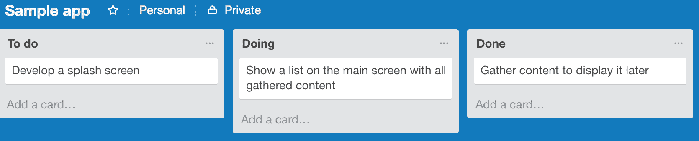
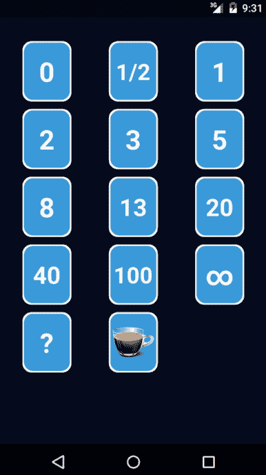
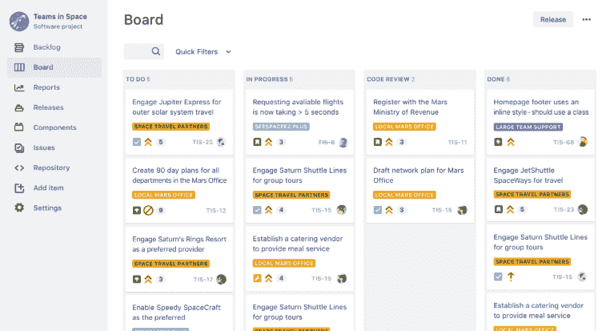
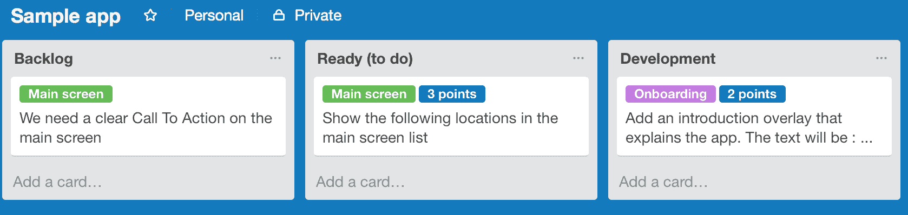
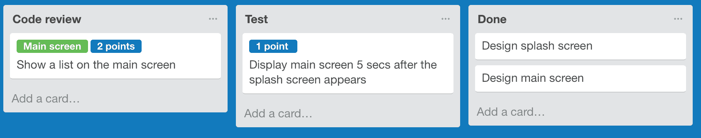

# 第四章：敏捷工作流程概述

在本章中，我们将讨论敏捷开发，以了解它是什么以及我们如何从中受益。

许多公司在开发软件时已经远离了瀑布式方法。他们转向了更适应的方法，如敏捷开发，并且有充分的理由。瀑布式方法只是遵循原始计划和需求，几乎没有改变的空间。显然，这种方法不适合你的应用程序。除非你有一个水晶球，并且从一开始就正确无误，否则这种方法很可能会导致大量的浪费。

敏捷工作流程通过适应性计划适应变化，促进更快的软件开发和交付，并基于持续改进的方法。这正是你需要验证你的假设，并在必要时进行转变的地方。

有许多敏捷软件开发方法的实现。它们都侧重于适应能力和尽快交付可发布软件的能力。其中一些特别关注管理工作流程。最常见的一种是敏捷 Scrum。我们将更深入地研究这种方法，看看它如何与精益软件开发很好地结合。

具体来说，在本章中，我们将学习以下主题：

+   敏捷工作流程

+   精益软件开发、看板和敏捷开发

+   史诗、故事和任务

+   敏捷团队和每日站立会议

+   后续改进和就绪状态的定义

+   迭代计划

+   完成定义

+   迭代回顾、计划和反思

+   你可以使用的一些工具，例如 Trello 和 Jira

# 敏捷工作流程

使用敏捷工作流程可以帮助你的团队保持灵活，能够快速响应变化。这也意味着你的团队是自我组织的，团队成员能够尽早和经常交付。

良好的沟通是敏捷开发的基础，你的团队成员必须与产品负责人、利益相关者和彼此良好合作。你的应用程序的用户也需要从一开始就参与进来。他们的反馈至关重要，对于你做出正确的应用程序开发决策至关重要。最后，在任何时候，你都应该能够交付一个可工作的软件版本。良好的 Git 工作流程和能够持续交付是这里的关键要素。你将在第十九章构建不公平优势中了解更多关于这一点。

所有敏捷方法共同之处在于它们都促进了改变的能力，在过程中持续学习，并尽快交付软件。

一些敏捷软件开发方法如下：

+   精益软件开发

+   看板

+   敏捷开发

还有更多方法，但这些都是最有趣的。当然，精益软件开发是本书的重点。该方法的要点是：

+   尽早交付

+   尽可能晚做决策

+   通过持续交付收集早期反馈

我们将在下一章中了解更多关于所有这些元素的内容。与其他方法不同，精益更专注于避免浪费。

但是，让我们先从基础知识开始。精益软件开发、看板和敏捷开发有很多共同之处。在本章中，我们将更深入地探讨看板和敏捷开发，并在本书的其余部分讨论精益。

# 看板

看板是一种可视化每个动作流程和当前状态的方法。每个参与者都可以看到从开始到结束的进度。团队成员在容量允许的情况下开始工作。与敏捷开发不同，由于它是一个连续的过程，因此不需要预测。

�看板是一种使用看板板进行可视化的方法。这种方法起源于精益制造（受到丰田的启发），但通常也用于软件开发。在其最基本的形式中，它包含三列，反映了每个项目的状态——**待办**、**进行中**和**已完成**。请注意，保持进行中列的项目数量最小是很重要的。实际上，人们并不擅长多任务处理，尽管他们认为自己可以。切换上下文会增加浪费，应该避免。

创建看板板你所需要的一切只是一个空白的墙和若干张便利贴，但你也可以使用像 Trello 这样的软件服务。如果你在[www.trello.com](https://trello.com/)注册，你可以免费设置自己的项目并定义多个通道。在这个例子中，使用 Trello 设置，每个人都可以清楚地看到每个项目的状态。根据需要，你可以定义额外的通道：

在看板中，工作流程是连续的，但在敏捷开发中，工作被划分为持续特定时间的事件。敏捷开发使用看板板，但增加了预测元素。

# 敏捷开发

敏捷开发是一种为小型团队设计的软件开发管理方式。团队成员在固定周期的循环中完成一系列动作，这个周期被称为**冲刺**。冲刺被限制在特定的持续时间。通常持续时间为一周到一个月，两周是最常见的。冲刺的固定长度很重要，因为它允许团队在几个冲刺之后确定他们的速度，即他们完成工作的速度。

在冲刺开始时，团队决定在给定的时间框架内可以完成哪些任务。经过几个冲刺后，由于团队将更好地了解他们的工作，因此做出适当的估计会更容易。了解团队的速度将使团队更容易对故事进行估计，并确保团队真正承诺完成给定冲刺中定义的所有故事（它是可完成的）。

该方法论强调在冲刺结束时有一个可行且可能发布的软件产品。这意味着软件不仅已经开发，而且已经过测试和集成。应该能够展示应用程序，对测试人员进行临时分发，甚至可以在 Play Store 或 App Store 中发布应用程序或更新。

# 英雄，故事和任务

**英雄**是一大批几乎总是跨越多个冲刺交付的工作。英雄通常是对功能的高级描述。它不包含具体细节。通过客户反馈，团队可以了解完成英雄所需的内容。一个英雄的例子可能是：作为应用程序的用户，我希望能够在应用程序中设置和审查一个商业模型画布。

英雄是一个功能或功能的概述性描述。由于缺少具体细节，团队需要了解更多关于英雄的信息，通常这会产生多个**故事**。解决英雄定义的问题可以成为一个故事。

用户故事应该尽可能小，同时仍然提供业务价值。用户故事通常从应用程序用户的角度编写，并使用自然语言描述。它们用几句话描述一个特定的功能，概述期望的结果。这可以帮助团队理解特定期望功能的目标和上下文。

一个故事可能包含一个或多个任务。这些任务可以非常具体地描述为了完成故事需要采取哪些行动。一个任务的例子可能是开发一个编辑框，用户可以在其中编辑文本或添加一个“保存”按钮，并持久化编辑后的文本。指定验收标准也很重要。如果你清楚地定义了故事或任务实施的结果应该是什么，那么你的测试人员接受（或拒绝）新功能将变得更加容易。

# Scrum 团队

对于 Scrum 方法，你通常会找到三个主要角色，尽管一些组织可能会定义其他角色，除了这里列出的那些：

+   Scrum 大师

+   产品负责人

+   开发团队（包括测试人员）

Scrum 团队有一个产品负责人。他或她负责确保团队交付所需的业务价值。为此，产品负责人是利益相关者和（技术）团队之间的联系人。产品负责人主要关注业务方面（问题定义）。产品负责人定义用户故事并将它们添加到待办事项列表中。

用户故事描述了需要实现的功能。你可以将待办事项列表视为待办事项清单。团队必须对这些项目做出承诺，并且每个项目都需要一些细化，以明确实现特定功能的确切需求。专注于寻找解决方案的团队将为此提供反馈。待办事项列表也需要优先排序。这种优先排序通常基于特定功能对最终用户（价值）的重要性。

产品负责人向利益相关者展示应用程序，并定义应用程序的里程碑和发布。他或她还向利益相关者通报应用程序的开发情况，并在资金、范围和优先事项的谈判中扮演重要角色。产品负责人需要能够有效地沟通。他/她需要在利益相关者（和最终用户）的利益与与团队成员的合作之间找到平衡，以确保他们为利益相关者发现或定义的问题开发正确的解决方案：

这导致了两个完全不同层次的信息。利益相关者通常只对获得问题的解决方案感兴趣。然而，开发团队更希望听到尽可能详细的反馈，这样他们就会知道一个功能应该如何实现。

开发者、测试员以及其他人员都是自组织团队的一员。他们将关心与交付或更新应用程序相关的所有任务。你可以想到的任务包括：

+   设计

+   UX

+   分析

+   技术研究和开发

+   代码审查

+   测试

+   文档

团队承诺进行冲刺，并负责在每个冲刺结束时交付更新并可以工作的应用程序。更新是外部还是内部并不重要。始终应该能够向利益相关者展示新功能。

另一个角色是 Scrum 大师。Scrum 大师确保遵循 Scrum 框架。他指导团队确保团队交付所有冲刺中的功能。他向团队和利益相关者传授 Scrum 原则。Scrum 大师帮助团队消除（或避免）可能妨碍冲刺成功的内部或外部障碍。

Scrum 大师还维护待办事项列表，并确保故事清晰，并且以非歧义的方式定义。团队理解故事的目标非常重要，这样它才能真正取得进展。Scrum 大师的其他重要职责是帮助团队制定“就绪”的定义（当开发团队能够开始处理一个故事时），以及制定“完成”的定义（何时可以推出新功能）。我们将在稍后更详细地探讨这些定义。

# 每日站立会议

团队在冲刺的每一天都会举行**站立会议**（也称为**每日 Scrum**）。这是一个简短的会议，通常限制在 15 分钟（时间盒）。它每天都在相同的时间和地点举行，即使有些团队成员缺席。任何人都可以参加，尽管只有团队成员应该做出贡献。

在站立会议期间，每个成员都会就与冲刺相关的以下三个问题提供答案：

+   我在上个工作日做了什么？

+   我计划今天完成什么？

+   我看到了哪些障碍阻止我或团队达到我们的冲刺目标？

由于会议是时间盒的，因此每个成员专注于这三个问题本身很重要，不应该有详细的讨论。Scrum 大师将被告知会议期间提到的任何障碍。

障碍包括阻塞器、风险、对其他团队或合作伙伴公司的依赖，以及可能的或预期的延迟。Scrum 大师负责移除障碍，或找到愿意或能够找到解决方案的人。一个显示实际障碍的 Scrum 板可以用来记录这一点，因为找到解决方案是需要在站立会议之外发生的事情。

# 优先级回顾

在冲刺开始之前，需要定义冲刺待办事项。哪些故事需要进入冲刺？为了回答这个问题，团队需要审查产品待办事项。产品待办事项包含完成产品（应用程序）所需的所有行动（故事）。首先，它们需要在团队可以承诺之前进行细化。

每个故事都需要对涉及的工作量进行估算。这种估算通常以故事点数表示，而不是小时数。故事点数与预期的复杂性和工作量相关。通常，一个具体且明确的行为，如按钮上的编辑文本，将被定义为一点故事。这为定义其他更复杂的故事提供了一个基准。所有估算的故事都将由此派生。

要能够分配故事点数，故事必须清晰且被团队充分理解。计划扑克通常被用来让团队成员做出估算。你可以使用卡片进行估算，或者使用许多可用的应用程序之一。

这里有一个这样的应用程序的例子，称为 Scrum Time。你可以在 Play Store 或 App Store 找到它。

作为应用程序的用户，你可以选择一张带有数字的卡片，并将其展示给其他团队成员。如果团队成员之间的估算点数差异太大，那么他们需要讨论为什么他们认为实现和测试一个故事将花费更多（或更少）的时间。也许团队成员中有知识其他人没有的人，或者他可能以不同的方式看待这个故事。新的见解可以有助于更好的估算。

可选的数字通常来源于斐波那契数列。在数学中，斐波那契数列的特点是每个数（从第三个数开始）都是前两个数的和。这里使用这些数字的原因是，故事越大（拥有更多的故事点），精确估算的难度就越大。如果你没有任何线索，你总是可以玩疑问卡，或者如果与故事相关的行动是无限的（想想提供支持），那么也有相应的卡片。是的，如果你渴了，你总是可以玩咖啡/暂停卡。

1、2、3、5 和 8 的卡片是最常被使用的。拥有更多点的故事很可能需要拆分成多个较小的故事以降低风险。

# 准备定义

产品负责人负责将故事添加到待办事项列表中。在待办事项细化过程中，团队必须提供反馈，以便将每个故事转化为可执行的状态。待办事项列表顶部的故事，以及即将到来的迭代中的候选故事，必须准备好。如果你希望提高团队的生产力，拥有一个清晰的**准备定义**（DoR）是非常重要的。

故事需要立即可执行。如果它们不是，那么如何实现或测试一个特性呢？目标必须明确，需要完成哪些工作才能实现，以及需要多少工作量。例如，待办事项列表可能包含用户反馈，如：“我们希望能够更快地创建新的发票。”这个陈述清楚地定义了一个问题，但如果我们想着手解决它，我们需要更多具体的信息。团队必须能够确定需要做什么。如果我们能说在主屏幕上添加创建新发票的按钮是解决方案，那么我们就可以为它做出估算并开始工作。一个准备好的故事是清晰、简洁且可执行的。

# 迭代计划

团队选择具有最高优先级且已准备好开始工作的项目。团队只能对具有明确目标且不受其他任何事物阻碍的故事做出承诺。此外，团队在迭代期间只能对有限数量的故事做出承诺。这意味着团队需要知道这些故事将涉及多少工作量，以及迭代期间可以完成多少工作量。

为了确定一个迭代中可以投入多少工作量，我们需要知道团队的速率，这是一个表示团队在一个迭代中能够完成的总工作量的数字。这个数字来自于评估和确定之前迭代中完成的工作的平均量（故事点的总和）。当然，季节性影响（假日）和其他可能决定团队容量的因素也需要考虑。一旦团队承诺开始迭代，就不应该向迭代中添加额外的工作。

# 完成定义

Scrum 框架规定每个故事应该在每个迭代的结束时完成。在理想的世界里，**完成定义（DoD**）意味着每个故事都已开发、测试并获得批准，并且你的应用程序当前状态处于可发货状态。我们仍然需要明确这究竟意味着什么。DoD 可能因 Scrum 团队而异，但必须在团队内部保持一致。DoD 可以帮助确保特性得到实施和测试，并且它们的添加确实有助于可发货的应用程序。

定义也可以包含其他行动的列表，例如代码审查、运行单元测试和 UI 测试、编写文档以及临时或公开分发。每个行动都应该为产品增加可验证的价值。这有助于团队专注于哪些特性重要，同时避免浪费的活动。

# 迭代回顾、规划和反思

每个迭代的末尾都有几个事件：迭代审查和迭代反思。还有下一个迭代的迭代规划。

在审查中，团队审查所有已完成的工作，并向利益相关者展示。他们还审查尚未完成的工作。

对于即将到来的迭代，有迭代规划事件。在此事件期间，团队和利益相关者共同努力确定哪些特性可以在迭代中交付，以及如何实现。

反思用于回顾过去迭代，以便团队可以随着时间的推移学习和改进。一般来说，向每个成员提出的主要问题是：

+   迭代中哪些方面做得好？

+   下一个迭代中需要改进的是什么？

Scrum 大师主持活动，并帮助团队确定需要采取哪些行动来改进事情。对于反思，你可以使用 Jira 等工具，但通常使用便签纸效果会更好。

需要改进的任何内容都将被优先考虑，并为前三个问题定义行动。

到现在为止，你对敏捷工作流程和 Scrum 有了基本的了解。要了解更多关于 Scrum 的信息，你可以访问[`www.scrum.org`](https://www.scrum.org)。

# 你可以使用的一些工具

你可以使用多种工具来支持、自动化和可视化流程。Jira 和 Agilefant 是知名的基于 Web 的解决方案，可以帮助你定义史诗、故事、估算和迭代。大多数工具也提供将（子）任务添加到故事中的选项。尽管故事应该是可能的最小工作量，但将它们分成多个子任务仍然是有用的。

你可以在[`www.atlassian.com/software/jira`](https://www.atlassian.com/software/jira)找到更多关于 Jira 的信息。Agilefant 可以在[`www.agilefant.com`](https://www.agilefant.com)找到。

以下是一个 Jira 显示看板板的示例。Jira 特别支持敏捷和 Scrum，而 Agilefant 则更不拘泥于特定方法：

如果你刚开始，可能还不需要所有这些工具。在这种情况下，一块白板和一些便利贴就足以创建你的第一个看板。当你的团队成员都在同一空间工作时，这个看板非常有用。当你有一个分布式团队时，Trello 是一个不错的选择。它不如 Jira 先进，因为它不支持 Scrum，但它是一种有组织地开始的好方法。

要开始使用 Trello，请注册[`trello.com/`](https://trello.com/)，创建一个新的团队和项目，然后你就可以开始使用了。就像 Jira 一样，你可以在 Trello 中创建多个通道，每个通道都反映了卡片/项目的实际状态。正如之前所说，你可以从待办、进行中和完成通道开始。然而，你很快就会意识到仅这些状态是不够的。

如果你配置以下通道，你将为 Trello 中的敏捷工作流程提供一个不错的起点：

+   需求列表

+   准备就绪（故事清晰，理解良好，没有障碍）

+   开发中（开发和测试）

+   测试

+   完成（已测试并批准）

它可能看起来像以下示例。你还可以添加更多通道，例如代码审查，或者最适合你组织的任何内容：

所有故事都从**需求列表**通道的卡片开始。一旦你清楚地定义了目标，故事就准备好开发。然后你可以将卡片移动到**准备就绪**通道。当开发者接手故事时，他会将卡片移动到**开发**通道。目前，实现已完成，故事的单个测试（s）成功，卡片将被再次移动，例如，移动到**测试**通道或可选地首先移动到**代码审查**通道：

如果对已实现功能的手动或自动化 UI 测试成功，则可以将故事视为完成，这对应于最终通道。

这当然只是一个简化的流程，并且像 Jira 这样的工具为敏捷和 Scrum 工作流程提供了更好的支持，包括史诗和估算。尽管如此，Trello 对于新手来说仍然是一个不错的起点。Trello 提供了添加标签和定义过期日期和时间的选择。你可以用它用于多种目的，甚至像前面的截图所示，设置史诗和估算。史诗以绿色标签显示，估算的故事点以蓝色显示。

在后面的章节中，你将了解到其他可以帮助你组织敏捷工作流程的工具。想想 Confluence。就像 Jira 一样，它是一个 Jetbrains 基于 Web 的解决方案，允许你组织所有的文档和讨论。

# 摘要

在本章中，我们简要介绍了敏捷和 Scrum 工作流程以及你可以从中获得的好处。我们现在知道你可以如何使用看板来可视化每个工作项的状态，以及敏捷工作流程的一些可能的实施方式。特别是，我们探讨了 Scrum，存在的不同角色，以及 Scrum 环境所需的规划和估算。

你可能会认为这一切都很有道理，但如果资源有限和时间紧迫，实施起来将会很困难。我们该如何将浪费降到最低，同时仍然采取非常务实的方式行动？你将在下一章中了解到所有这些内容。
