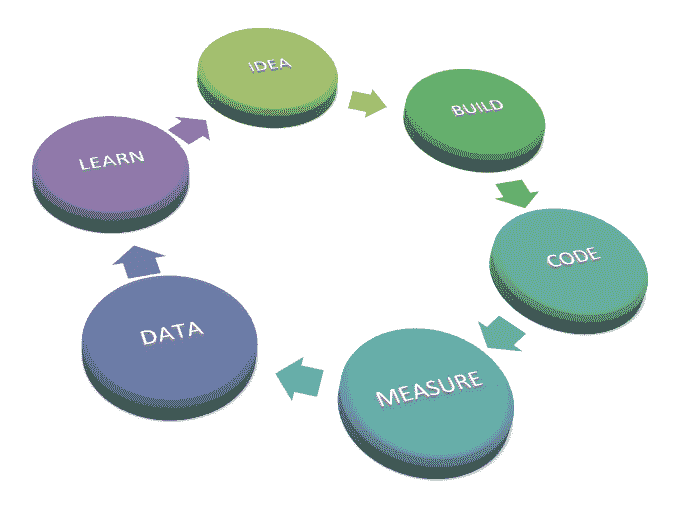
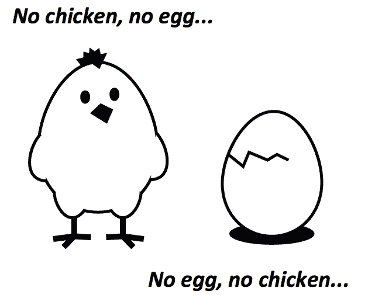
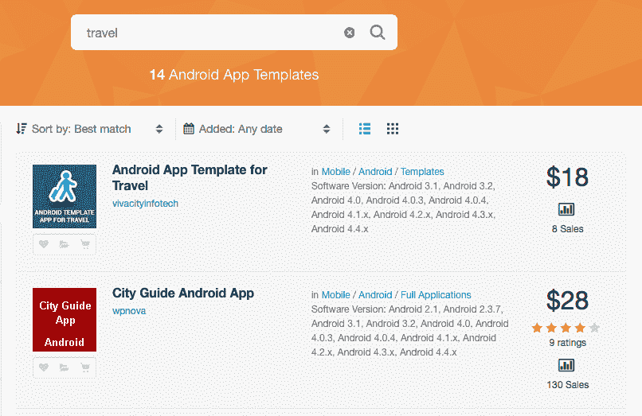
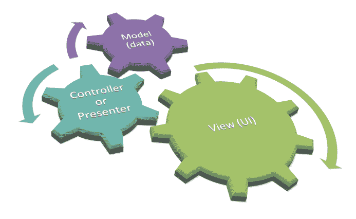
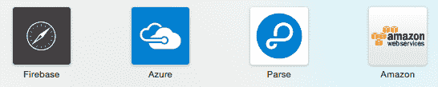

# 实用主义方法

你已经做出了一些惊人的举动！你知道你热爱什么，也许你已经创建了一个非常初级的**最小可行产品**（**MVP**）。这可能是一个网站、一个调查，甚至可能是一个非常简单的应用。它实际上是如何表现出来的并不重要。这里唯一重要的是，它应该是可以证明你的假设并且只需要最小努力的东西。从你得到的反馈中学习，并找出你最早的假设是否正确。如果是这样，那么是时候进行下一步了。

在本章中，我们将看到如何继续前进以及如何应对创业公司面临的最大挑战之一。时间和时机至关重要。这对自筹资金创业公司尤其如此。我们将探讨在没有任何东西的情况下以及当最重要的资源（时间和金钱）非常有限时如何完成任务。你需要的是正确的思维方式和非常实用主义的方法。

你不需要一个巨大的办公室和所有那些花哨的东西。同样，你不需要很多规则，但大多数时候事情不会自动发生。无论如何，我们需要一些规则，无论你的创业公司多么酷。实用主义方法是在完全混乱和官僚主义之间的良好平衡。你将保持对想要达成的目标的清晰关注，开发新功能不会比你严格需要的更长。这种方法将导致在应用特定阶段开发所需的功能。

在寻找产品解决方案或产品市场匹配时，创业领域没有捷径可走，但作为开发者，你通常不需要重新发明轮子。大多数情况下，现成的解决方案都广泛可用。例如，在第八章，*云解决方案用于应用实验*中，我们将调查哪些方提供**移动后端即服务**（**MBaaS**），而在第十章，*有 API 就能做到！*中，我们将探讨各种混合创意。这些解决方案无论你是用来构建最小可行产品（MVP）还是在整个应用生命周期中使用，都能节省大量时间。

具体来说，我们将涵盖以下主题：

+   了解时间 boxed 编程的好处

+   看看从无到有开始有哪些选项

+   展示如何保持事物结构良好

+   调查是否存在任何捷径

# 时间 boxed 编程

对于每个迭代，你需要决定它将花费多长时间以及将包含哪些特性。正如你在第四章，“敏捷工作流程概述”中看到的，典型的冲刺需要 2 到 3 周。虽然一开始可能很难，但很快你就会学会在这样一次冲刺中你能和你的团队成员完成什么。有时你甚至不知道一个特性的开发需要多长时间。在这种情况下，时间盒方法也能帮助你。在你开始工作之前，你分配一个特定的时间。之后，你可以确定你完成了什么，并决定是否可以以当前状态发布该特性。即使它不完全功能，只要它不包含（严重的）错误，它也能帮助你获得早期反馈。

保持简单，只为特定迭代开发你真正需要的特性。你应该问自己你想要证明什么，以及你需要什么样的反馈来继续前进。同样，当你审视你的应用当前阶段时，了解这些反馈的相关性很重要。例如，如果你的应用的基本功能尚未完成，你不应该过多关注 In-App Purchase 功能的开发。

“你不会需要它”，也称为 YAGNI 缩写，是敏捷开发和极限编程（XP）背后的理念之一，但这也同样适用。

目标始终应该是以最少的努力实现最大的学习。此外，保持简单，一次只解决一个产品和一种类型客户的一个问题。作为一名开发者，你经常会预见需要支持的场景，所谓的“不愉快流程”，但如果“愉快流程”还没有准备好，谁会在意它们呢？

考虑到时间盒的概念更多地关注于花费的时间而不是完成的任务。因此，与其思考应该在特定时间内完成的特性，不如思考在特定时间内可以实施哪些特性。为了最大化学习，你应用的新版本带来的变化应该尽可能小，同时仍然提供相关的商业价值。时间盒编程对于确保资源在特定时间内交付至关重要。为每个时间盒迭代确定可交付成果和截止日期。使用这种方法，你的生产力将得到提高，你也能对你的客户做出承诺。

通常，了解你的（潜在）客户。更多地了解他们的问题。这是你的应用需要解决的问题。这可能听起来像是你的更商业化的联合创始人的工作，但更好地理解这一点也会使你成为一个更好的开发者。提出问题，找出所有客户的共同问题。

# 客户服务

重要的是要意识到，你创建的解决方案中的一些部分可能是必不可少的，但可能并不一定是立即自动化的好候选者。这些部分也可以手动提供。这样的解决方案被称为**礼宾服务**，或称为**礼宾最小可行产品**（**CMVP**）。乍一看，这并不真正对开发者有太多意义。你可能认为精益创业方法论是关于最小化浪费的，所以 wonder 为什么我们应该手动处理事情？

事实是，手动处理事情确实不太高效，但就目前而言，这还是可以接受的。这是一个短期解决方案，可以帮助你获得新的见解，并学习如何解决用户或客户的问题。一旦你完全理解了问题，并知道解决方案应该是什么，那么自动化就到时间了。

如果你花上 3 个月时间开发一个令人惊叹的功能，然后发现你的应用似乎并不了解用户的问题，会发生什么？这可能会对所有利益相关者造成巨大的失望，你也会 wonder 为什么会发生这种情况。你应该始终问自己是否拥有解决该问题的所有必要信息，以及你是否理解了客户的需求。如果不是这样，你的努力可能会导致交付一个没有人想要的产品。你可能需要大量重构，或者从头开始。这样的活动将是浪费时间（而且如果你运气不好，你的信誉也会受损）。

# 它是糟糕的还是完美的？

你之所以关注最重要的功能，是因为它们有助于你想要证明的假设。然而，这并不意味着你的产品必须是糟糕的。采用时间盒方法可以帮助你经常（每天或每周）按时交付。

你将提供的功能可能不会完美，但每次新的迭代都可以改进它们。当然，你将不会有第二次机会来留下第一印象，但追求完美并不能帮助你证明你的假设。相反，它将阻止你尽早获得反馈。然而，选择你的第一批用户非常重要。早期采用者与主流用户非常不同，他们有不同的期望。因此，在要求早期采用者测试你的解决方案时，管理期望非常重要。诚实地告诉他们你的初创公司处于哪个阶段，告诉他们解决方案是为了最大化学习而构建的，你非常希望得到他们的反馈。这可能听起来有点严厉，但最终完美是不存在的。早期采用者的意见很重要，你的意见并不真正重要。

# 早期快速发布

早期快速发布——例如，每周一次或每两周一次——将最大化你的学习。时间盒编程可以帮助你交付重要的功能。

下图中所示的循环被称为**构建-度量-学习反馈**循环。如果你知道你的早期采用者，获取反馈很容易。但是，如果你正在开发一个应用程序，这并不总是可能的。有许多工具可以帮助你获取分析数据。在第十三章，*应用商店和应用程序商店技巧*中，我们将了解更多关于这些工具以及如何通过指标收集反馈：



# 你如何从无开始？

一张空白页，一个基本想法，以及一个早期的最小可行产品（MVP）。这就是开始的方式，但这并不完全是一无所有。但这并不意味着它是一家公司，或者一个应用程序，当然，它也不一定伴随着客户，除非你有一个真正令人信服的 MVP 或一个出色的生产解决方案。

# 鸡生蛋问题

根据你正在开发的应用程序类型，迟早你会面临著名的“先有鸡还是先有蛋”问题。简单来说，一个依赖于用户生成内容的应用程序在没有用户的情况下将没有内容，而没有内容的情况下也将没有用户。那么，你从哪里开始呢？

任何基于市场的应用程序都必须应对这个挑战，无论是约会应用程序、求职应用程序还是将公司联系在一起的应用程序。但这同样适用于其他类型的应用程序。应用商店中有许多应用程序。它们都在做更多或更少相同的事情，那么为什么你的用户（以及后来，你的客户）要使用你的应用程序而不是其他应用程序呢？迟早你需要找到答案，即“是什么让你的应用程序更好？”你的应用程序是否因为更便宜而更好，它是否提供了更好的服务，或者你的应用程序是否因为拥有庞大的用户群而显得更有说服力？简而言之，因为你刚刚开始，所以你还没有一个拥有许多用户或评价的平台。哦，是的，你确实有一个“先有鸡还是先有蛋”的挑战！



# 假装直到你做到

为了解决“先有鸡还是先有蛋”的挑战并启动你的应用，有一些简单的解决方案。其中之一是：假装直到你做到。这听起来像是作弊，或者至少听起来像是不好的事情，而实际上并非如此。这是对“先有鸡还是先有蛋”问题的权宜之计。不，我们不会撒谎，最多只是假装。如果你正在开发一个约会应用，让你的所有亲戚和朋友都注册一个有吸引力的个人资料照片。你可以使用这种方法不仅限于用户数据，还可以用于所有类型的内容。如果你正在开发一个面向企业的应用，你可以购买一些公司数据，丰富它，并假装这是你自己的。参考第十章，*有一个 API 可以做到！*，关于混合应用，了解更多相关信息。另一个可行的选项（例如，想想一个显示工作信息的应用）是从各种其他来源获取数据，并作为一个提供聚合数据的应用开始。有许多方法可以开始，它们都旨在通过开发内容和用户基础来增长你的应用。

# 成为专家

你也可以通过实践成为专家。你可以开始成为某个利基领域的更重要的一员。只需在学习的过程中成为那个专家即可。例如，当我们开始围绕窄播和社交媒体结合的概念建立我们的新创业公司时，我们对窄播一无所知，除了在商店或火车站经常看到的电视屏幕。通过撰写关于窄播主题的博客，我们学到了很多，并逐渐成为专家。更重要的是，它帮助我们塑造了我们试图解决的问题的愿景。在我们的案例中，这是关于找到答案的问题，我们如何使窄播成为一个更互动的过程？假装可以帮助你设定目标，一旦你达到了它们，就不再是假装，而是真实的。你可以通过这种方式建立你的声誉。这有多酷？显然，你必须保持真实。如果你永远无法满足随之而来的期望，就不要假装，而应该为了争取更多时间、完成工作或成为专家而这样做。如果你保持真实，你的初创公司将成为你所期望的样子。

# 抓住并适应

几乎所有的初创想法都源于现有的概念。一点增强、不同的定价、服务、UX 或特定的方法可以是**独特卖点**（**USP**），这将导致一个独特的产品。同样的服务，但采用不同的营销方法，可以产生完全不同的产品。这是一个你经常看到的趋势。例如，我一直在为一个**移动虚拟网络运营商**（**MVNO**）的促进者工作。他们的客户都是不拥有自己基础设施的移动服务提供商。所有虚拟提供商之间最大的区别只是营销策略。任何人都可以用很少的投资从头开始建立自己的网络。你只需要抓取并适应。不过，你必须小心。你需要意识到专利和版权问题，但有许多（开源）项目你可以用作你应用的基座，或者只是一个初期的 MVP。

用很少的钱，你也可以购买一个接近你的初创想法的概念，甚至是一个完整的应用。在这种情况下，你所需要做的就是增强它，看看你是否能有所区别。为了开始新事物，大多数应用只需要一点变化。例如，看看[`codecanyon.net`](http://codecanyon.net)。你在这里会发现一些很好的起点。这里有 Android、iOS、基于 Web 的应用程序等等。你可以找到 Flappy Bird 克隆应用、餐厅应用以及介于两者之间的所有应用。

假设你的初创公司正在开发一款旅行应用。你可以搜索这类应用并购买其中之一。你只需对应用进行一些修改，就能快速验证你的假设：



这将节省大量时间，而且值得小小的投资。你所学到的知识将帮助你定义应用在早期阶段应该做什么以及应该看起来像什么。也许后来你仍然想从零开始或多或少的重新开发你的应用。然而，如果你认为现成的基座应用能帮助你快速收集有价值的见解，那么遵循这种方法将不会是一个艰难的决定。

# 提供一个尚不存在的应用或服务

当你的应用尚不存在时，你该如何提供或描述它？一个不存在的应用很难展示，那么顾客如何得知它的存在，以及他们如何知道为什么应该获取这个应用？他们必须以某种方式了解到有一个（概念）应用可以解决他们遇到的问题。这里有趣的是，你的应用本身并不是那么重要。抱歉，你的应用本身并不是产品。它只是用户完成某事的工具。展示一个幻灯片或视频来解释你的应用做什么以及为什么它能帮助他们解决问题。这同样可以具有说服力。你会吸引他们的注意，如果你做得很好，你将立即获得他们的预订单。

如果你没有制作出色视频的技能，或者你需要一个标志或任何其他设计，那么请看看[`www.fiverr.com/`](https://www.fiverr.com/)。那里有许多自由职业设计师可以帮助你。另一个你可以查看的网站是[`99designs.com/`](https://99designs.com/).

一个视频或演示与最小可行产品（MVP）实际上并没有太大的区别，对吧？好吧，它确实是，尽管在这个例子中我们正在测试与产品-市场匹配相关的假设，而不是与产品-解决方案匹配相关的假设。每个初创企业的所有者，无论其角色如何，都必须进行销售，并且能够在产品存在之前就销售产品。这并不是谎言，甚至也不是假装。这是一种创造性的方式，承诺为已知问题提供解决方案。

然而，永远不要伪造推荐信或谎报客户数量，或者把事情夸大十倍。保持真实。相反，努力建立良好的声誉，成为专家，创建一个非常有说服力的网站，并包括功能列表，即使它还没有完成。为了表明人们可以信任你的公司，还可以添加一个包含条款和条件的公司政策链接。即使你还没有准备好销售，也要在网站上添加定价表。衡量（收入）牵引力永远不会太早。在第十五章“增长牵引力和提高留存率”中，我们将学习如何衡量牵引力，而在第十七章“货币化和定价策略”中，你将能够了解更多关于定价策略的内容。

# 如何保持事物结构良好

如果你从面试或指标中获得的反馈开始学习，那么你应用程序的流程或结构很可能发生变化。由于业务需求经常变化，需要做出临时调整。这要求你重构应用程序的代码。这是大多数开发者认为很重要的事情，但在现实中，它很容易被遗忘，或者根本就没有完成，仅仅是因为没有足够的时间。有时，重构被认为会使应用程序不稳定。然而，不要让你的技术债务变得过大。

如果你对底层过程理解不足，或者没有为开发分配足够的时间，可能会导致技术债务或甚至面条代码。如果一个初创公司只有面向业务的技术技能，它可能已经外包了开发，或者雇佣了一些第三方来完成这项工作。如果是这种情况，对应用程序的技术结构了解很少或没有。我强烈建议你尽可能自己做大部分的开发。如果你拥有一个没有技术合伙人的初创公司，那么请停止阅读，首先找到一位！有许多聚会和网站，你可以在那里遇到拥有你所需技能的人（作为合伙人或其他角色）。看看这些网站：[`angel.co/`](https://angel.co/) 和 [`cofounderslab.com/`](https://cofounderslab.com/)。

保持事物，尤其是你的代码，结构良好是非常重要的。设计模式和许多学科可以帮助你为 Android 和 iOS 构建应用程序。确实，Android Studio 为重构提供了更多的功能，而使用 Xcode 重构则需要额外的努力。然而，重构对于这两个平台同样重要。

# 设计模式

没有必要重新发明轮子，我们也不需要重复自己。这正是“不要重复自己”（DRY）软件开发原则所规定的。设计模式是针对常见问题的解决方案，这样的模式可以在应用程序的许多地方使用。这是我们能够信赖的方法论，它将帮助我们加快开发过程。模式可以帮助我们以最小的努力开发高质量的软件。它们还可以帮助我们处理关注点的分离。一些著名的模式包括**模型-视图-控制器**（MVC）模式、某种程度上相似的**模型-视图-表示者**（MVP）模式，以及**模型-视图-视图模型**（MVVM）方法。

关于设计模式有很多优秀的书籍，本书的范围不涉及对所有这些书籍的详细探讨，但 MVC/MVP 模式特别引人关注，因为它在移动开发中应用最为广泛。该模式背后的理念是将用户界面与业务逻辑以及数据与逻辑分离。当你仔细观察 Android Studio 或 Xcode 中大多数 Android 或 iOS 应用程序的结构时，你会注意到其中已经包含了一些这种模式的元素。控制器从另一个层获取数据。这个层可以是一个客户端或仓库类。例如，它将从 API 或本地源获取数据。控制器通过模型（或视图模型）将获取到的数据传达给用户界面：



# 独立自主

理想情况下，你的应用程序是从本地存根、**移动后端作为服务**（MBaaS）、第三方 API 还是你自己的 API 获取数据，这应该无关紧要。这很容易实现。你只需要意识到分离不同的关注点以及实现合同的重要性。

另一个学到的教训是，你并不总是可以信任第三方服务。你可能听说过 Parse。它曾经是最有前途的 MBaaS 之一，许多应用程序开发人员都依赖它来在云端存储他们的应用程序数据。最近，他们宣布将关闭业务，这让许多开发人员感到沮丧。幸运的是，Parse 已经创建了一个开源版本的 Parse Server。无论如何，它很好地说明了我想在这里表达的观点。确保即使你的一个关键合作伙伴关闭业务，你的业务也不会受到影响。

# 数据层

如果你的应用程序结构良好，从一家服务提供商切换到另一家（关键合作伙伴）很容易。使用单独的数据访问层，并为你的数据层和控制器之间的通信定义合同。合同被称为**接口**（对于 Android）或**协议**（对于 iOS）。它们不包含实现，只是类与类之间的约定。它们定义了可用的方法、所需的参数以及结果类型。

例如，让我们假设我们正在从某种数据源获取数据。在接口`IRepository`中，我们将定义表示某些操作的所有方法的名称、结果和参数。更精确地说，让我们假设我们想要检索我们存储在云中的公司新闻。它可能位于 Parse 服务器（在 Back4App 或其他地方）、Amazon、Azure 或 Firebase，具体在哪里以及如何获取这些数据并不重要。由于它是一个接口，我们目前不需要关心实际的实现。

对于 Android，它可能看起来像这样：

```kt
public interface IRepository{ 

    public void getNews(OnRepositoryResult handler, GetNewsRequest request); 
```

对于 iOS，它看起来像这样（在 Swift 2.x）：

```kt
protocol RepositoryProtocol { 

func getNews(handler: RepositoryResultDelegate, request: GetNewsRequest) 
```

实现此接口或协议的数据层类将执行实际工作。它们将从远程数据源检索数据。

例如，Android 实现开始如下：

```kt
public class RemoteRepository implements IRepository { 

... 
    @Override 
    public void getNews(OnRepositoryResult handler, GetNewsRequest request) { 
        // Get data asynchronously  and return the result 
    } 
```

而 iOS 实现开始如下：

```kt
public class RemoteRepository: RepositoryProtocol  { 

    ... 
    func getNews(handler: RepositoryResultDelegate, request: GetNewsRequest){ 
```

在第八章，“应用程序实验的云解决方案”中，我们将看到使用 Firebase 的实现将是什么样的。

数据层也可以从本地模拟或存根数据中获取数据。你可以轻松地在不同的数据源之间切换。这使得它对于测试目的也是一个很好的解决方案。

# 有任何捷径吗？

不，没有！开个玩笑。有一些服务和方法是值得调查的。它们可以为你节省大量的时间和金钱。想象一下，一个需要与后端通信的应用，因为它需要支持聊天功能，或者支持与其他用户共享文本、图片、音频或视频。这样的应用将有许多要求，例如：

+   从应用同步数据到后端

+   从后端获取数据到应用

+   数据存储

+   数据流

+   离线支持

+   通过电子邮件进行注册和登录

+   使用 Facebook 或 Twitter 进行注册和登录

你可能可以自己构建支持所有这些的后端，但这需要大量的工作，而且没有必要。有许多服务可以处理（或部分处理）之前提到的所有要求：



在第八章“应用实验的云解决方案”中，我们将更详细地探讨 Parse 服务器。稍后，我们还将探讨 Windows Azure。

# 混合解决方案

混合解决方案可以被视为一个组合应用，它结合了可重用数据、展示和新的逻辑。它通常被视为网络解决方案，但这种方法也可以用于原生应用开发。数据无处不在。政府和各种组织已经通过 API 将他们的数据公开。混合解决方案不需要担心具体内容，而更多地关注展示。它们可能出现在企业、数据导向或消费者混合解决方案中。

应用可能从多个来源收集数据，将它们合并并丰富，然后在应用中展示。一个例子可能就是简单地从提供的数据中生成信息图表。另一个例子是从 Flickr 获取照片并在谷歌地图上展示。还有许多其他更复杂的方法，你可以考虑。混合解决方案可以极大地促进最小可行产品（MVP）或**概念验证**（**PoC**）的开发。通常，当混合解决方案被证明是一个有利可图的解决方案时，它主要具有聚合器的功能。例如，一个比较保险公司的网站。

请记住，你可以相对快速地开发一个混合解决方案，但其货币化可能更困难。再次强调，混合解决方案的最大缺点是依赖于第三方。如果事情开始变得严肃，那么不要仅仅消费他们的数据。你需要做更多的事情。避免你的业务因提供数据的公司决定停止服务而可能出现的关闭。如果你让这家公司成为真正的关键合作伙伴，你可以降低这种风险。尽管仍然存在依赖，但它已经不再是一个问题，因为它已经变成了一个可管理的问题。

# 摘要

在本章中，我们了解了一些可以帮助你开始并持续进行的事情。我们探讨了鸡生蛋还是蛋生鸡的问题以及如何处理它。我们还研究了模式，以及它们如何帮助我们保持事物结构良好。

最后，我们简要介绍了**移动后端即服务**（**MBaaS**）解决方案和混合应用。在第八章《应用实验的云解决方案》和第十一章《用户注册和入门》中，我们将分别探讨这两个方面的实际操作实现。但首先，我们将弄清楚一个最小可行产品（MVP）实际上应该是多么的精简。
