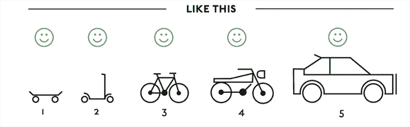
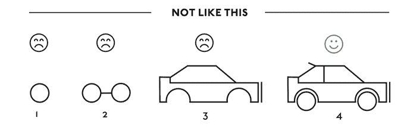
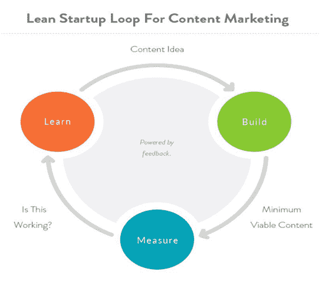

# 第六章：MVP 总是比你想象的更简约

MVP 中的 M 代表最小，而不是最大。如果你的 MVP 想法包含了每个潜在用例、每个潜在受众组合、所有可用功能的各个方面，并创建了一个需要开发团队超过 90 天才能完成的待办事项列表，那么你并没有 **最小可行产品**。相反，你拥有一个完全不同的东西，很多时候它会让团队陷入困境，导致不必要的返工、失去周期、失去收入，以及所有与在未很好地定义和验证用户的产品上工作相关的功能障碍和痛苦。

在书面语境中，定义 MVP 的想法似乎很简单；当团队试图概述和定义在他们的初始产品发布中“最小”意味着什么时，挑战就出现了。“最小有多小？”“我能有多个核心功能吗？”“我的所有用例都被覆盖和考虑了吗？”“屏幕上能有多于 12 个按钮吗？”所有这些问题都使得我们提出的 MVP 是否真正简约和可行变得难以确定。

本指南旨在作为基准工具，将帮助你确保你已经成功定义并验证了一个准备上市发布的 MVP。

我们将涵盖以下主题：

+   什么是 MVP？

+   如何定义你的 MVP

+   快速失败/验证一切

+   迭代并进化你的 MVP - 从可行到受欢迎

# 什么是 MVP？

**最小可行产品**（MVP）被定义为：

“新产品的版本，允许团队以最少的努力收集关于客户的最大验证学习”

- 埃里克·里斯

例如 Instagram、Snapchat 和 Tinder 这样的应用程序在推出时都有一个共同点：它们都是今天版本的简化版。智能手机和 iPod 也是如此。在它们诞生的那一刻，它们只做了一件事，而且做得很好。显然，这些产品已经成熟，经过多年的资本投资和开发，已经成为了提供远超其核心功能的应用程序。重要的是要注意，它们是那些以最小功能集发布到市场、针对解决初始用户群体核心问题的产品的绝佳例子。

# MVP 的好处

在你的组织中采用精益 MVP 产品设计和开发模型有助于将成本保持在最低，并允许你更快地测试和验证你的想法：

+   **保持简单**：专注于提供即时价值/实用性的核心功能，可以使你更快地将产品推向市场，而不是承诺进行无休止的开发周期，以交付一个功能齐全的多功能产品。

+   **节省资金**：揭示你产品的市场有效性，并证明进一步投资和开发的合理性。拥有一个可工作的原型，允许你在最小成本或努力的情况下进行转型或坚持。

+   **学习和进化**：MVP 模型的迭代和进化特性旨在快速灵活。它允许你在短时间内通过短跑成熟和细化你的产品，同时揭示宝贵的用户反馈和洞察，这些反馈和洞察有助于指导和塑造你的未来迭代。

# 如何定义你的 MVP

关于如何定义 MVP 存在很多争议，这与回答“最小化到什么程度？”这个问题有关。这是一个非常主观的概念，每个产品都有其独特的细微差别和需求，使其略有不同。这不是全有或全无的提议，但有一些技术和最佳实践可以应用，帮助你将你的产品定义为一个 MVP。市场需求可能需要多个核心功能来定义 MVP。

在本节中，我们将讨论以下主题：

+   如何构建 MVP

+   将组件组合成 MVP

+   将 MVP 应用于企业

# 构建 MVP

在接下来的第一幅插图里，很明显，预期的 MVP 是构建一个能够让用户从 A 点到 B 点通勤的车辆，而不一定是速度、距离，或者承诺使用机动车辆还是自驱动车辆等等：

显然，在第二幅插图里，考虑了多个用例和条件，因此这个模型不会允许快速的市场验证，并存在增加成本和可能无法满足目标受众的风险：

# 将组件组合成 MVP

在第一幅插图里，他们汇集了几个部件来制作一块滑板。他们需要一个板子，一些轮子，以及连接轮子到板子的车架。所有这些部件组合在一起构成了通勤车辆的 MVP。将这个比喻和思考过程应用到你所定义的 MVP 上。例如，如果你的 MVP 是客户关系管理软件，在最基本层面上，它需要提供一个中心位置，让用户可以存储客户和潜在客户的联系信息，与同事分享，并跟踪销售进度。为了定义 MVP，需要将多个组件或功能组合在一起。将管理客户的功能和跟踪销售线索的报表功能结合起来，这就是我们示例 CRM 的 MVP 定义。这两个组件本身也是迷你 MVP，作为独立组件并不定义市场上竞争性 CRM 的 MVP。别忘了，**V**代表**可行**，这意味着只需具备足够的功能就可以开始销售。

# 将 MVP 应用于企业

传统的企业软件开发方法集中在在向客户发布之前交付完美的、全面和功能丰富的产品。这与 MVP 指南和最佳实践中的最小和可行都不相符。企业团队在定义最小（恰好数量的功能，增加价值和实用性）和平衡它是否可行（我的产品中是否具有足够的特征，人们愿意为其付费？）方面都感到困难。

有不同的方法可以应用于企业产品，帮助在该领域重新定义最小可行产品：

+   **数据驱动的设计**：将数据置于产品决策的中心。使用客户的声音、使用指标和现有的性能报告来创建一个可以优先排序并缩减到最小和可行的功能层次结构变得比以往任何时候都容易。

+   **了解你的市场**：你不能为所有人构建一切。确保你有一个明确的目标市场细分，并从这里开始，即使这意味着你的客户是企业的玩家。明确界定你为谁构建产品将帮助你定义市场进入壁垒并巩固你的 MVP。

+   **最小可销售产品 (MSP)**: 一旦你定义了你的最小可行产品 (MVP)，不要忘记确保它是可行的。用你的目标市场来测试它，以确保它具有用户愿意为其付费的最小功能集。并且避免仅依赖产品经理的直觉和内部假设来预测哪些功能驱动产品的常见错误。验证！

+   **应用增量用户体验**：将 MVP 的概念降低到组件或功能级别，它不再是全有或全无的命题。基本思想是有一个计划中的进展（通过测试留下改进的空间）的每个阶段增加功能的功能。这将使你能够更快地进入市场（可行性）并通过验证学习随着时间的推移成熟你的产品，从而节省时间和成本。

但不要认为每个人都会立即理解这个过程，尤其是在一个企业中，你的同事和团队分布在世界各地。这需要不懈的传教。在我们公司，*Dominion Dealer Solutions*，我们在美国有办事处，由三个不同国家的离岸团队支持。更具有挑战性的是，许多团队都是我们以前的收购，带来了他们自己的继承文化和偏见。让每个人都理解和接受开发 MVP 的概念需要关键人物进行大量的传教以获得认同。这花费了数月时间，但一旦这个想法站稳脚跟，它就像野火一样迅速传播。

# 快速失败 – 验证一切

最小可行产品（MVP）的核心要素是获取用户反馈，进行用户测试，并在整个产品生命周期中验证用户是否愿意使用（并付费）您正在推出的产品。不幸的是，一些团队陷入了最小/可行产品的困境，完全忘记了验证。验证学习是定义 MVP、确认市场需求并塑造未来迭代、时间和资源投入产品中的关键组成部分。它是您是否应该在损失太多资金和耗尽资源之前转向并放弃项目，或者坚持不懈并继续在市场上前进的最佳指标。MVP 受“快速失败和快速恢复”的持续验证模型所管理，确保团队在时间、资源和运营资本方面保持超高效率。

让我们看看帮助我们快速失败的三个因素：

+   应用敏捷原型设计——消除技术债务

+   采用精益 UX 周期——构建-衡量-学习反馈循环

+   测试方法和最佳实践

# 应用敏捷原型设计——消除技术债务

原型允许您探索设计想法，测试假设，并在最小化技术债务的同时收集用户的反馈。对于那些可能不知道的人来说，技术债务是指在团队快速编码以将产品或原型推向市场时，随着时间的推移积累起来的未来工作，而不是为了创建最佳可能的解决方案而编写良好的代码。

在许多情况下，鉴于今天的科技，您可以创建无需任何技术债务的高清原型。如果您在代码提交后需要重新设计并重新创建 MVP 的界面和功能，那么绕过原型设计可能节省的任何时间都会在开发过程中以多倍的速度损失。

这里有一些如果您将敏捷原型设计应用于您的产品设计和开发过程中所获得的优点和好处：

+   **所有权和协作**：增加团队共识和所有权；在编写代码之前，在原型中发现潜在的可用性问题并进行纠正，从而避免可能的技术债务。

+   **工作流程效率**：减少和消除编写详细的故事和需求文档的需求。当每个人都可以通过实际体验点击和参与，而不是通过线框图或原型来想象和解释用户交互时，情况就大不相同了。

+   **经常验证**：从用户那里收集实时反馈，并快速迭代您的最小可行产品（MVP），一次冲刺一次。

# 精益 UX 周期——构建-衡量-学习反馈循环

精益 UX 的核心组件是建设度量学习反馈循环。这个概念最初来源于埃里克·莱斯所著的《*精益创业*》一书。其目标是验证不确定性、假设和潜在风险，以指导未来的 MVP 迭代和产品方向。这个循环形成一个循环，这个循环应用于敏捷开发中的冲刺。这种方法提供了一种快速有效地证明产品愿景（MVP）是会失败还是繁荣的方法：

# 以反馈为导向的开发模型的优点

采用数据驱动、以反馈为导向的开发模型可以使组织更有效地管理开发成本和资源。通过创建可用于验证周期并指导设计过程的 hi-fi 原型，可以立即减少开发时间和劳动力。在数字市场中，无效的商业假设风险太大，成本太高，无法生产。

# 建设度量学习反馈循环的各个阶段

这个循环有三个阶段：建设、度量和学习。

# 阶段 I - 建设

第一步是确定需要解决的问题，然后定义和开发一个 MVP 以尽可能快地开始学习过程：

+   **构思**：发展你的想法或概念。用非常清晰的语言确定需要解决的问题是什么。

+   **创建你的原型**：考虑简单和小巧。最好是构建最小的增量，以便快速获得足够的验证来指导下一步。

+   **定义一个实验/测试研究来证明你的假设**：创建问题集，考虑 A/B 测试和任务分析。

# 阶段 II - 度量

下一步是在互动循环中收集尽可能多的验证学习，并从你的测试中提取模式和洞察，以推动未来对 MVP 的投资和迭代：

+   **启动你的测试研究**：进行访谈，分发问卷，并验证你的原型。

+   **分析**：客观地查看你的数据。有什么出现？是否存在任何常见的模式和行为了？

+   **组织**：将重叠的模式和行为了解并开始形成洞察。

+   **整理**：将你的洞察转化为可操作的项目和讨论点，这将有助于告知潜在的修订、未来的迭代和发布。

# 阶段 III - 学习

这时需要做出决定，是坚持还是调整你的最小可行产品（MVP）。在这个语境中，坚持意味着继续以相同的目标前进，而调整至少需要改变，甚至可能完全重置你的原始 MVP 愿景：

+   确定你的 MVP 是否真正解决了用户的问题。我的 MVP 是否满足了我目标用户的需要？

+   建立你的最小可行产品（MVP）的可行性。我的 MVP 是否提供了用户愿意为之付费的功能集？

# 10 种基本用户体验测试方法

验证是 MVP 产品开发的基石。它是推动 MVP 构建-度量-学习反馈循环的动力。有几种不同的测试方法可以用以帮助定义 MVP，并通过应用构建-度量-学习周期来迭代地持续改进用户体验。

以下是可以用来帮助验证你的 MVP 的 10 种基本用户体验（UX）测试方法：

1.  **调查**：最经济的方法是了解你的用户是谁，他们想要什么，他们做什么，他们购买什么，他们在哪里购物，他们拥有什么，就是通过调查他们。你可以找到免费的调查软件，所以没有借口。

1.  **用户画像/市场细分**：使用调查数据，并在你的用户群体中识别有意义的模式和行为。揭示某些细分市场所要求的功能以及他们所经历的痛点。在你的市场细分中找到你的 MVP 市场甜点。

1.  **情境调查**：有时用户很难准确表达他们想要什么或他们试图实现什么。始终理想的是观察用户在其环境中执行对他们的角色至关重要的任务和功能。在他们执行任务的同时进行探究和调查，以发现哪些有效，哪些需要改进。

1.  **行业专家/利益相关者访谈**：在你的组织内部可以挖掘大量信息。访谈任何行业专家、客户支持、QA、开发、营销或销售人员，以了解需要构建什么，为谁构建，以及为什么。

1.  **任务分析**：通过观察用户参与特定任务和工作流程来衡量可发现性、可用性和性能。

1.  **面对面调节测试**：这适用于移动设备测试，或者当远程设置原型很困难时，在实验室、会议室甚至咖啡馆测试用户，以收集宝贵的反馈和见解。

1.  **远程调节测试**：这是最经济的用户测试形式。使用 Zoom 会议、Google 表格和 InVision 等服务，你可以在互联网上的任何地方记录和调节用户测试。这有助于扩大你的招募基础，并且不会限制用户群体。

1.  **A/B 测试**：这可以在许多条件下使用，如远程、调节等。比较测试布局、界面控件、按钮、CTA、颜色、任务、性能……天空才是极限。

1.  **比较基准研究**：在竞争应用上比较相同任务。使用核心指标，如完成率、时间和任务难度作为创建基准的基础。例如，Zappos 的结账流程是否比亚马逊的结账流程更快、更高效、更易于使用？

1.  **多变量测试**：一次只测试一个变量的方法可能需要很长时间，而且您会迅速消耗掉您的测试人员，速度比预期的要快得多。如果您需要经常进行测试，进行多变量测试将不仅使您从测试池中获得的最大回报最大化，而且还能让您对整个体验如何运作有一个很好的了解。例如，改变按钮的颜色可以收集一些数据，但与您改变按钮的位置、颜色和标签并测试所有变体一起收集的数据相比，这微不足道。您可以在实时环境和原型环境中进行多变量测试。例如，Optimizely 这样的产品可以帮助您在真实用户的环境中组织和启动多变量测试。

# 迭代和进化——从可行到可爱

现在我们已经成功地将我们的初始 MVP 推向市场，并收集了一些验证过的学习成果，接下来是什么？它是如何扩展的？它只是更多相同的东西吗？不，绝对不是。整个过程都是关于使您的产品、用户和收入不断发展和成熟。目标已经变成了将您的产品从可行变为可爱，引入**最小可爱产品**（**MLP**）。

MLP 被定义为以最少的努力从用户那里获得最大爱意的版本。我们都认识在我们生活中那些我们喜爱且无法离开的产品：汽车、由苹果、奥迪、三星和 G-Star 等杰出品牌创造的智能手机。我们喜爱这些产品，因为它们在我们内心唤起了积极的情感联系。简单来说，它们让我们微笑。

与用户建立积极的情感联系有许多不同的方法，但最简单的是通过良好的设计。

# 从可行到可爱：五个小贴士

以下是一些有价值的见解，可以帮助您的产品走向“令人喜爱”的用户体验之路：

+   **关注价值**：通常，团队专注于他们正在构建的内容，而不是为什么。用户不会因为“什么”（割草机）而购买，他们会因为“为什么”（我需要割草）而购买。构建有意义的东西。

+   **做好一件事**：一个稳固的功能或特性远比三个平庸的要好。从像 Dropbox 和 Instagram 这样的成功故事中学习。他们通过专注于做好一件事，简单地创造了大量喜爱他们产品的追随者。

+   **验证和迭代**：在没有尽头的移动目标上工作等于失去视野、失去机会、失去动力和失去收入。针对短期周期验证您的设计。将您的最小可行产品（MVP）的时间框设置为 90 天增量（12 周周期）。90 天足够实现您的愿景，但不足以让您失去对它的关注。

+   **以用户为先**：聚焦于对你客户来说是真正痛点的问题。你是否验证了这些痛点，还是只是你的观点？记住，以用户为中心的产品设计是一种以他人为中心的练习。这关乎你的受众对你产品的反应，而不是你自己的。

+   **言行一致**：对目标做出承诺并保持对过程的纪律性。如果你认为设计很重要，就通过你的行动来展示它：尽早引入设计以协作制定 MVP 策略/愿景——尽早开始制作线框和原型。不要只是说你的客户对你很重要，要通过你的行动来展示：测试和验证你的 MVP 想法。

# 摘要

在本章中，我们探讨了 MVP 的概念以及为什么它很重要。我们介绍了帮助你定义和构建 MVP 的技术。我们概述了一个遵循精益敏捷 UX 流程，并展示了验证你的 MVP 的优势和好处。最后，我们讨论了如何将你的 MVP 从可行转变为令人喜爱，以及如何激发用户的情感反应。使用这些构建块来节省时间和金钱，并开始构建你知道你的用户会喜爱和需要的产品。

在下一章中，我们将回顾一些案例研究，这些研究展示了这里讨论的许多想法。

用户至上 + 优秀设计 = 令人喜爱的产品
