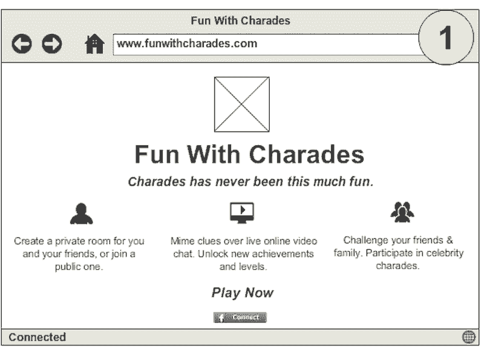
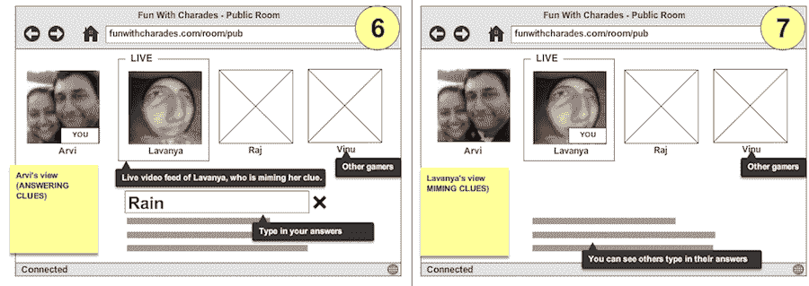
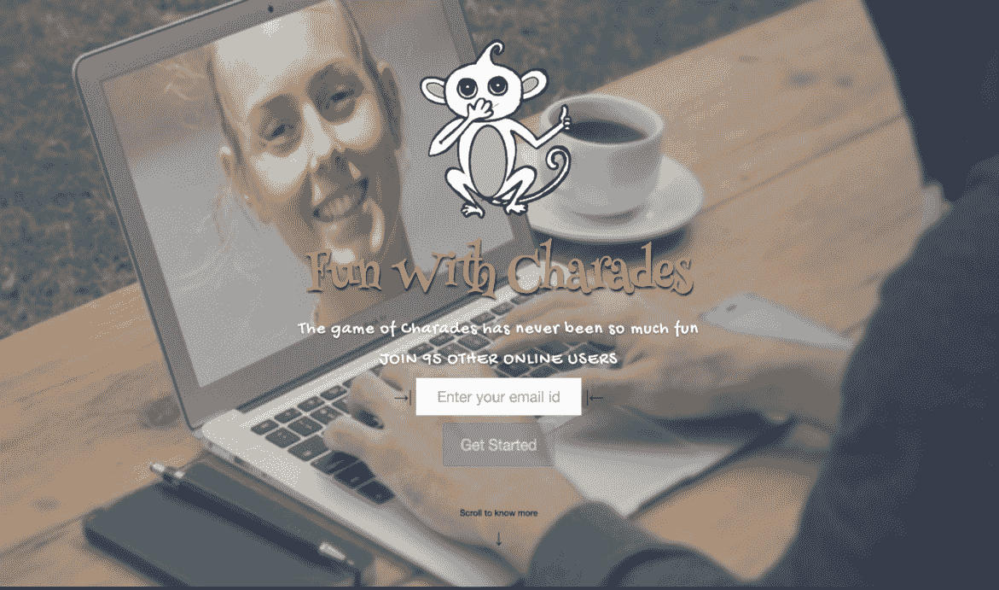

# 最小可行产品案例研究

在本章的最后，我们将探讨构建**最小可行产品**（**MVP**）的不同策略。

这些包括以下内容：

+   专属顾问

+   登录页面

+   假冒的后端

+   竞争对手应用

+   类比

+   干钱包

+   意向书

上述策略提供了一个框架，用于在不同保真度级别上运行快速实验，并利用所学知识来回答关于您应用商业模式画布的高风险假设。

在本章中，我们将深入研究一个 MVP 案例研究，以了解更多关于它们如何在一系列实验循环中应用。

我们将讨论“哑剧乐趣”，这是一个我和我的团队开发的应用，帮助世界各地的人们通过在线视频聊天室玩哑剧。我们将讨论原始愿景、我们面临的关键高风险假设、我们如何开发以假设为导向的测试方法、我们如何根据所学知识进行迭代，以及我们的最终结论。

# 哑剧乐趣 - 初始愿景

这是我们的初始愿景、目标受众和起始时的问题陈述：

+   **愿景**：创建一个有趣的地方，让人们在网上结交新朋友

+   **目标群体**：青少年、大学生、年轻专业人士、休闲玩家

+   **问题**：通过愚蠢的哑剧连接在线的人

在思考这个问题时，有几个问题：

+   他们是否对哑剧感兴趣？*艾伦*的哑剧游戏非常受欢迎，Heads Up Charades!周围也有很多热议，但这并不表明人们会想在线玩。

+   哑剧是否足够吸引人，以至于人们会想定期玩？

+   如果我们设置一个实时游戏来模拟我们习惯的游戏机制，这将需要朋友们同时在场，这可能很难安排。

+   如果安排很困难，人们会愿意在游戏室里与陌生人一起玩，就像在线扑克一样吗？

+   人们会对在线使用视频感到极度不安吗？是否有更开放使用在线视频的社区？

+   如果我们开发一个异步游戏，通过移动应用让人们有时间时就能玩，这可能可行。但是，人们同时手持智能手机面对挑战进行反应，这会实用吗？

+   然后，有一个问题，那就是我们是否有兴趣和技能在游戏方面。

# 重大不确定性

我们着手分解这些内容，解决我们认为列表上最大的疑虑：

+   人们是否对在线玩哑剧感兴趣？

+   他们是否习惯于在线使用视频？

+   他们是否喜欢这个概念，以至于会邀请朋友或加入公共游戏室？

+   他们是否喜欢在房间内与其他人一起玩游戏的体验？

+   他们是否喜欢这个到足以经常回来玩？

+   他们会邀请其他人吗？

接下来，我们试图围绕主要信念跳跃假设进行实验结构化，以寻求验证。

# 假设 1

在一组在线寻找猜谜游戏的人中，至少有 25%的人会注册来查看游戏：

+   **受众**：针对想要在线玩猜谜游戏的人。

+   **获取用户**：使用谷歌广告。

+   **验证**：这包括注册的百分比。

+   **执行**:

    +   在一天内构建注册页面。

    +   确定关键词并运行一周的广告。

    +   跟踪注册情况。

+   **结果**：我们针对搜索“在线猜谜”、“猜谜游戏”和“猜谜词汇”的用户投放了广告，超过 25%的用户注册了。

+   **学习**：在谷歌上搜索猜谜游戏的人中，对在线玩猜谜游戏感兴趣的人：

# 假设 2

在目标受众中，向展示游戏概念草图的用户展示，至少有 70%的人对游戏非常感兴趣：

+   **受众**：针对印度的年轻成年人。

+   **获取用户**：使用您的朋友网络进行招募。

+   **验证**：这包括对游戏非常感兴趣的人的百分比。

+   **执行**:

    +   使用 MockFlow 在一天内构建粗糙的模型。

    +   带领人们了解模型。

    +   收集反馈。

+   **结果**：总体而言，人们对游戏概念表现出一致的兴趣，但有些人提到他们可能对在线视频感到不舒服。

+   **学习**：总的来说，猜谜在印度很受欢迎，人们有兴趣尝试在线游戏：

# 假设 3

在被邀请到游戏房间的注册猜谜用户中，至少有 25%的人愿意加入公共房间并使用在线视频：

+   **受众**：这包括注册的用户。

+   **获取用户**：N/A。

+   **验证**：包括在公共房间中使用在线视频的用户百分比。

+   **执行**:

    +   邀请用户进入公共房间。

    +   提供关于游戏内容的解释。

    +   允许用户打开视频并开始游戏。

    +   跟踪分析。

+   **结果**：80%的用户访问了页面，但不到 5%的人打开了视频。

+   **学习**：这个实验否定了我们错误的希望，即在这个 FaceTime 和 Hangouts 时代，人们不会犹豫使用在线视频。因此，我们需要深入挖掘，并与用户交谈，了解他们的感受：

# 假设 4

如果用户与朋友一起玩，他们更有可能舒适地使用在线视频，80%或更多的人会这样使用：

+   **受众**：针对彼此相识但不太了解的朋友。

+   **获取用户**：使用您的朋友网络进行招募。

+   **验证**：这包括使用在线视频的用户百分比。对游戏想法感兴趣到足以失望不玩的人的百分比。

+   **执行**:

    +   邀请用户进入公共房间。

    +   提供关于游戏内容的解释。

    +   允许用户打开视频并开始游戏

    +   跟踪分析。

+   **结果**：100%的用户打开了视频，并且兴奋并准备好参与游戏，他们觉得如果无法玩游戏将会非常失望。

+   **学习**：当被问及是否愿意与不认识的人在线玩游戏时，女性表示会犹豫，而该组中的男性一致表示愿意尝试：

# 假设 5。

在网上使用视频与陌生人交流的在线社区用户更有可能舒适地相互玩游戏，至少 25%的人会使用在线视频：

+   **受众**：针对 Chatroulette 和 Chatrandom 社区。

+   **获取**：使用谷歌广告。

+   **验证**：这包括打开视频的用户百分比。

+   **执行**：

    +   为 Chatroulette 和 Chatrandom 运行谷歌广告，提供基于视频的在线哑剧，以及结识新人的机会。

    +   邀请用户进入公共房间。

    +   提供关于游戏内容的解释。

    +   允许用户打开视频并开始游戏。

    +   跟踪分析。

    +   添加一个 Qualroo 风格的提示来找出他们为什么没有打开视频。

+   **结果**：50%的用户访问了页面，但不到 10%的用户打开了视频。5%的用户回答了提示，表示他们不想打开视频，稍后会尝试，或者不确定如何打开。

+   **学习**：鉴于这些社区的匿名性，直接接触并获取反馈很困难，对提示做出回应的响应者的样本量太小，无法推断出足够的信息。

# 纠结的问题。

我们与一组用户进行了交谈并收集了反馈。因此，在这个阶段，我们面临了以下从我们的学习中获得的问题：

+   对于哑剧有一定的兴趣，但它主要被视为家庭和朋友之间的游戏。

+   对于那些经常看到朋友和家人的人来说，在线玩哑剧并不吸引人。（在感恩节或圣诞节与他们现场玩游戏仍然很有吸引力。）

+   普通用户不太愿意在网上与陌生人玩游戏。

+   即使是那些在网上处理裸露问题感到舒适且没有顾虑的社区，也没有发现这个想法吸引人。

+   视觉设计和提供解释信息方面的改进并没有增加转化率。

+   这样的游戏需要一个相当活跃的社区，而且看起来哑剧无法维持这种程度的参与度。

+   在次大陆有一个喜欢哑剧表演的社区，但他们所玩的形式相当技术化和古怪，无法大规模推广。

# 我们做得好的地方。

+   记录了我们的思维过程和假设，为我们成功提供了事实依据。

+   确定了可以以最低成本证明（或反驳）的小批量，快速构建并通过批量迭代。

+   保持诚实和客观，跟踪指标和群体情况良好。

# 我们本可以做得更好的地方。

+   最初的反馈主要来自次大陆用户，因为接触到国际受众并不容易。因此，反馈并不完全代表目标受众。

+   在我们理解客户及其行为理解的差距之前，我们建造了过多的东西。

+   我们在早期就包括了更多的在线调查，以便获得更好的洞察。

# 摘要

我们仍然相信原始愿景，并且可能坚持下去并让它在野外继续发展可能会产生一些成果。然而，我们最终被证明是错误的，并决定转向并探索其他想法。事后看来，这是一个明智的决定，可能使我们免于陷入沉没成本谬误的陷阱。

许多人对浪费资源（损失厌恶）持有强烈的保留意见。本章中我们看到的例子涉及一张不可退款的体育赛事门票。许多人会感到有义务参加活动，尽管他们并不真的想参加，因为否则就会浪费门票费用；他们觉得已经过了无法回头的点。

这有时被称为沉没成本谬误。经济学家会将这种行为标记为非理性：它是不高效的，因为它通过依赖于与所做决策无关的信息来错误地分配资源。（via Wikipedia）。

本案例研究的重要启示如下：

+   运行实验所需的严谨性和纪律性

+   根据新的学习和惊喜进行适应的意愿

+   需要专注于愿景（尽管，在这种情况下，我们的团队并没有长期坚持这一愿景）

+   代理用户的优势和涉及的权衡

在下一章中，你将学习更多关于使用**软件即服务**（**SaaS**）云服务来快速运行实验循环的知识。
