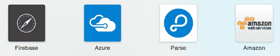

# 第八章：云端解决方案应用于应用实验

虽然 MVP 可能只是最简单的着陆页、宣布您的应用或应用的实时模拟版本，但总有那么一个时刻，您的应用应该比这更多，无论是为了证明您的下一个假设，还是为了看到其最基本形态的实际应用。是时候创建一个**概念验证（PoC**）了。

独立应用现在很少见。大多数应用都有在 Twitter 或 Facebook 上分享内容的功能（如果它是游戏），让用户发布图片或视频，拥有排行榜（如果它是游戏），让用户发布聊天或以其他方式相互沟通等功能。为此，您的应用需要有一个后端。

当然，您可以创建自己的 API 或使用为该目的而存在的许多解决方案的 API，即所谓的**移动后端即服务（MBaaS**）。这些解决方案的工作方式与任何其他**软件即服务（SaaS**）一样，但专门为此目的而设计。

在本章中，我们将探讨 MBaaS 解决方案，并了解使用 Firebase 构建 Android PoC 需要哪些步骤，Firebase 是一个流行的基于云的后端。

具体来说，在本章中我们将涵盖以下主题：

+   了解是否需要我们自己创建后端

+   利用云端解决方案进行应用实验

+   确定哪些服务可以作为 MBaaS（移动后端即服务）使用

+   检查使用 Firebase 的 Android PoC 应用

# 您需要自己创建后端吗？

这完全取决于您的应用需求，但对于大多数应用来说，完全没有必要自己创建后端，至少对于您的**最小可行产品（MVP**）来说是这样。有许多现成的后端解决方案可供选择。

大多数解决方案支持推送通知、数据存储、社交注册和登录（例如使用您的 Facebook 或 Twitter 凭证注册或登录）以及数据同步功能，包括对您的应用的支持离线功能。

如果您必须自己编写所有这些代码，可能会花费很多时间，而且可能需要更多时间来确保没有错误。

几乎所有解决方案都以免费增值服务的形式提供，而且大多数情况下，免费选项足以构建您的 MVP。其中一些，如 Firebase，提供实时支持，使其成为聊天应用的一个很好的基础。稍后，我们将使用 Firebase 构建一个 PoC，但首先让我们看看目前有哪些解决方案可用。

MBaaS 能为您做什么在这里得到了说明。大多数解决方案提供基于网络的**内容管理系统（CMS**），**应用程序编程接口（API**）和**软件开发工具包（SDK**）。这样的解决方案将负责存储远程和本地数据。此外，它还支持数据同步（它将本地持久化数据发送到远程位置，反之亦然）和分发推送通知：


更精确地说，API 是应用程序与存储在远程服务器（云解决方案）中的数据通信的方式。数据通常可以通过 http(s)上的**表示状态传输**（**REST**）接口检索。SDK 是一段你可以添加到自己的应用程序的软件。它将使 API 的使用更加方便。通常，API 会处理诸如获取数据和数据同步等问题。使用 API 可以简化服务的集成，但你仍然可以使用 REST 接口，例如，在网站上显示相同的数据。

# 利用云解决方案进行应用程序实验

MBaaS 解决方案非常适合快速启动项目。大多数解决方案都包含几乎所有应用程序都有的功能，例如注册、登录、检索、保存和共享数据。使用 MBaaS 的另一个重大优势是其可扩展性。目前我们正在致力于开发 MVP，技术扩展问题都是奢侈问题。然而，提前知道这些问题可以通过这些类型的第三方解决方案更容易解决是很好的。你的应用程序具有可扩展性，但尚未需要扩展。如果需要扩展，那么只需切换到更大的计划（从技术角度来看）。你将在第十五章中了解更多关于扩展策略的内容，*增长吸引力和提高留存率*。

# 需要考虑的事项

还有一些其他事项需要考虑，例如定价。你可以从免费计划开始，但如果需要扩展你的解决方案，了解价格增长的速度是很重要的。如果你需要处理大量数据，服务是否仍然价格合理。当这种情况发生时，由于你的业务已经显著增长，金钱可能不再是主要问题。也可能你的策略是仅将服务用于第一个最小可行产品（MVP）。只要你有策略，并牢记这些事项，一切就都很好。

另一个需要思考的问题是，你的用户数据存储在第三方服务器上，例如 Facebook 或 Google。你应该问自己是否应该信任第三方来构建解决方案。当然，这很大程度上取决于解决方案的性质。无论如何，有一些事情你确实需要了解，比如“你的数据是否安全，如果服务提供商决定停止其服务，会发生什么？”Parse 服务器和 Firebase 在其推荐信中有一些令人印象深刻的名称，所以我们可能可以假设在大多数情况下，你的数据确实是安全的。

# Parse 的故事

第二个问题比你想象的更重要。不久前，Parse 宣布他们将要停止提供服务。这个公告让许多（独立）开发者非常愤怒。这些开发者完全依赖于 Parse 服务。Parse 的停止让他们感到恐惧，因为他们认为他们别无选择，只能结束自己的业务。开发者对服务有很高的期望，这也因为 Parse 被 Facebook 收购。它看起来非常稳固。显然，这次收购也许也导致了那个同样的公告。对于 Facebook 来说，团队可能比服务本身更有趣。

幸运的是，这个童话有一个快乐的结局。Parse 提供了一套不错的迁移计划，现在这被称为开源解决方案 Parse 服务器。你可以自己托管，但如果你不想这么做，也没有问题。许多其他方也迅速加入，开始提供 Parse 服务器托管服务。服务器本身并不具备 Parse 中所有可用的功能，但像 Back4App 这样的公司做了大量工作，将它们全部添加回来。

简而言之，这个故事证明了你不应该完全依赖这类服务。合作伙伴很重要，但当他们变得不可替代时，你创业的未来可能会变得不确定。虽然这个故事是关于 Parse 的，但类似的事情也可能发生在 Firebase 上，例如。这不太可能，但谷歌之前已经关闭了一些服务，所以这也不是完全不可能的。

# 战略性考虑

如果你需要决定是否使用基于云的服务，以及需要从各种可用服务中进行选择，那么有一些战略性的考虑因素可能很重要。使用此类服务既有优点也有缺点。以下列出了一些。

以下是一些优点：

+   该服务缩短了开发时间

+   开箱即用的服务通常自带注册和登录支持

+   大多数服务可以根据你预期的流量量轻松地进行扩展或缩减

+   几乎所有服务都支持推送通知和媒体存储

以下是一些缺点：

+   一个现成的服务通常更贵。定价可能成为一个问题。

+   你的（用户）数据的隐私可能是一个问题。你必须相信提供该服务的公司正在采取适当的预防措施来确保安全性。

+   总是有这样的风险，即服务可能会被终止。

+   存在锁定风险。当所有数据都驻留在特定提供商处时，迁移到另一个服务可能会很困难。

# 可作为 MBaaS 使用的服务有哪些？

有一些服务可以作为你应用程序的后端。考虑到上一段中的战略考虑因素以及你应用程序的具体需求，一个服务可能比另一个服务更适合。

一些提供实时数据，使其非常适合聊天应用。其他则更侧重于数据持久化或附带构建块，例如 QuickBlox，让您能够更快地创建应用。一些是相当专业的解决方案，使用起来既简单又快捷，但不够灵活。其他则非常灵活，但学习曲线较陡峭：



大多数解决方案将数据存储在文档相关的数据库中，如 MongoDB。如果您需要为您的应用选择关系型数据库，那么选择 Azure 与 SQL Server 可能是最佳选择。选择与您的应用需求和当前开发技能最匹配的服务：

+   **Back4App**：该服务提供托管解析服务器。该服务支持推送通知、数据和文件存储，并支持云代码。云代码是在解析服务器上运行的代码，通常是查询。您可以使用常见的 Android 和 iOS 解析 SDK 与服务器通信。

+   **SashiDo**：与 Back4App 类似，这是一个提供托管解析服务器以及一些额外功能的托管服务。

+   **Firebase**：它是一个可扩展的实时后端，适用于 Web、Android 和 iOS。它非常适合聊天和协作工具，但也适用于其他需求。与 Parse 服务器或 Azure 等相比，存储媒体（如图像或视频）可能要复杂一些。

+   **BaasBox**：这是一个为您的移动应用提供的开源后端。它为 iOS、Android 和 JavaScript 提供了 SDK。

+   **QuickBlox**：这项服务为后端基础设施提供构建块。它提供数据存储、推送通知、文本和视频聊天以及许多其他功能。它允许开发者快速创建应用，但价格略高。因此，它最适合原型验证，而不太适合实际应用。

+   **Azure**：Microsoft Azure 提供了对推送通知和其他移动服务的支持。它已成为微软的核心业务之一，因此您可以将 Azure 视为最值得信赖的 MBaaS 解决方案之一。该平台肯定会持续存在。事实上，与其他 MBaaS 相比，Azure 服务有时可能有点令人困惑。它并不完全专注于 MBaaS。它能够做很多事情，如果刚开始使用，可能会使服务显得有些令人不知所措。它非常灵活，因此学习曲线相对较陡峭。对于您的应用需求，您可以使用表格和 blob 存储（用于图像、文档等），使用移动服务、API 服务，或者您可以使用 .NET 或其他语言创建自己的 API。Azure 为 Android、iOS 和 Windows 提供了客户端 SDK。

+   **Backendless**：Backendless 提供即时移动后端作为服务以及整体应用开发平台。

+   **remoteStorage**：[remoteStorage](https://remotestorage.io/) 提供了针对每个用户的开放协议存储。使用您信任的提供商的存储账户，或者设置您自己的存储服务器。

+   **CloudBoost.io**：这是一个包含数据存储、搜索、实时和其他功能的完整数据库服务。

+   **PubNub**：[PubNub](https://www.pubnub.com/)是一个实时网络，它通过提供云基础设施、连接和关键构建块，使软件开发者能够快速构建和扩展实时 APP。

+   **Parse server**：Parse server 是一个开源解决方案，你可以下载并自行托管。例如，你也可以在 Heroku 或 Azure 上托管它。服务器使用 MongoDB 数据库，并利用 Amazon S3 存储来存储文件，如图像、音频或视频。Parse SDKs for Android 和 iOS 包括各种实用功能，如缓存数据、在后台上传数据或文件。

# 技术考虑因素

除了战略考虑之外，还有一些技术方面需要考虑。在选择特定服务之前，你应该问自己以下问题：

+   你的 APP 需要实时支持吗？

+   你的 APP 处理大量的媒体（图像、视频和音频）吗？

+   服务提供商应该有多大的可信度？

+   你目前需要使用所选服务的技能有多好？

+   你需要多少灵活性，你有多少可用时间？

在下一段中，我们将检查一个使用 Firebase 的 Android MVP。

# Canvapp - 使用 Firebase 的 Android MVP APP

让我们使用 Firebase 构建一个 Android MVP APP。对于这个特定的案例，我们将有一个 APP，允许你通过手机创建和分享你的业务模型画布。任何人都可以查看或编辑彼此的画布，这样你可以轻松地收集反馈。如果你不记得业务模型画布的样子，你可以再次查看第二章，*精益创业入门*。

我们将使用一个线框工具，例如以下示例中的 SwordSoft Layout。假设 APP 应该看起来大致如此：


第一个视图显示了一个业务模型画布的列表，并且有一个滑动菜单。第二个视图是用户在创建新的画布或从列表中选择画布时看到的视图。它显示了多个页面，每个页面包含一个标题、描述和一些提示。用户可以前后滑动。这是一个非常基础的 APP。它只有三个视图，但这足以展示如何使用 Firebase 作为后端，并且我们可以用它来证明这个 APP 概念是有意义的。

为了简化起见，我们可以说，在这个例子中，你已经验证了你的早期假设。这个解决方案的假设是：

+   创业者希望通过其他创业者获取反馈来分享他们的画布。

+   创业者希望通过智能手机或平板电脑分享他们的画布。这将使我们能够专注于 APP 的技术实现。

你可以在以下位置找到这个项目的源代码：[`github.com/mikerworks/packt-lean-saas-canvapp`](https://github.com/mikerworks/packt-lean-saas-canvapp)。

# 注册 Firebase

如果你想看到实际操作，你将需要访问[www.firebase.com](http://www.firebase.com)并注册。完成注册后，你可以创建你的第一个应用。唯一重要的是 Firebase 将创建的端点。你需要这个端点来配置你的应用。在下面的示例中，端点是 torrid-head-3108.firebaseIO.com：


首先，从 GitHub 下载 Android Firebase 示例（[`github.com/mikerworks/packt-lean-saas-canvapp`](https://github.com/mikerworks/packt-lean-saas-canvapp)），这样我们就可以浏览它并了解其内容。如果你愿意，并且有时间的话，当然也可以从头开始构建这个应用。目前，你可以下载现成的应用，检查它，并根据需要修改它：


如果你更喜欢在 Android Studio 或其他 IDE 中打开应用，你需要修改的是应用中的 Firebase 端点。折叠应用中的`data`包节点并打开`FirebaseRepository`类。在`FirebaseRepository`类中，找到构造函数并调整 Firebase 引用，使其与你的匹配：

```kt
public class FirebaseRepository implements IRemoteRepository {
     private Firebase reference;
     private Context context;
     public FirebaseRepository(Context context){
         Firebase.setAndroidContext(context);
         this.context = context;
         reference = new Firebase("https://<your endpoint here>/canvapp/"); 
    }
```

当你运行应用并添加了几幅画布后，它看起来大致如此。是的，它已经包含了一些酷点子：


当你运行应用并添加了几幅画布后，它看起来大致如此。是的，它已经包含了一些酷点子。应用将显示在 Firebase 中驻留的画布模型列表。每个模型的标题和描述都将显示。任何人都可以通过点击模型来查看或编辑它。这将显示编辑视图，其中包含可滑动的画布元素集合。可以通过菜单中的选项创建新的画布。

对于这个应用，我们在 Android Studio 中创建了一个新项目，并选择了导航抽屉作为我们的第一个活动。这将给我们一个带有现成菜单的漂亮模板。列表和新画布选项将在这里出现。

# 布局

项目中有几个布局资源（res/layout），我们将对其进行描述。这些布局如下：

+   **列表布局**：这个布局显示画布列表

+   **分页布局**：这个布局显示一系列可滑动的元素。

+   **元素布局**：这个布局将为商业模型画布的每个元素显示标题、描述、一些提示和编辑框。

+   **行布局**：这个布局将渲染画布列表中的每一行。

布局文件很小，只包含一些样板代码。它并不花哨，但我们仍然需要它来创建 Android Firebase PoC。如果你想检查它们，现在让我们继续与代码中最重要的部分。

# 依赖项

要检查应用程序的依赖项列表，请打开 `app` 文件夹中的 `build.gradle` 文件。在这里，你将找到 Firebase 和 JSON 反序列化的依赖项，如下所示：

```kt
dependencies { 
    compile fileTree(dir: 'libs', include: ['*.jar']) 
    testCompile 'junit:junit:4.12' 
    compile 'com.android.support:appcompat-v7:23.3.0' 
    compile 'com.android.support:design:23.3.0' 
    compile 'com.android.support:cardview-v7:23.1.1' 
    compile 'com.android.support:recyclerview-v7:23.3.0' 
    compile 'com.squareup.retrofit:converter-gson:2.0.0-beta2' 
    compile 'com.firebase:firebase-client-android:2.5.2+' 
} 
```

在 `res` 文件夹的 raw 中，你可以找到 `canvas.json` 文件。该文件中的 JSON 数据将使用 `Gson` 进行解析。它将作为每个新画布的模板。用户需要做的只是为每个元素提供一个值。

文件中的 JSON 对象看起来像这样。它将由 `LocalRepository` 类处理：

```kt
{ 
  "ELEMENTS":  
    ... 
{ 
  "ID": "PROPOSITIONS", 
  "TITLE": "VALUE PROPOSITIONS", 
  "DESCRIPTION": "what value do you deliver to the customer? Which of your customer's problems are you helping to resolve? What bundles of services are you offering? Which needs do you satisfy?", 
  "HINT": "Enter your proposition here. What are the characteristics of it? What does it make unique? Is it price? Cost or risk reduction? A better design or performance? Is it more convenient? Why?..." 
}, 
{ 
  "ID": "SEGMENTS", 
  "TITLE": "CUSTOMER SEGMENTS", 
  "DESCRIPTION": "For who are you creating value?\nWho are you most important customers?", 
  "HINT": "Describe your customer segments here. Be as specific as possible. A niche market is much better as aiming for 'everybody'. If it is a platform what customers do you want to bring together. Who are your most important customers?..."
 }, 
{ 
  "ID": "CHANNELS", 
  "TITLE": "CHANNELS", 
  "DESCRIPTION": "Through which channels do your customer segments want to be reached? How are you reaching them now? How are your channels integrated?\nWhich ones work best?", 
  "HINT": "Describe your channels. How do you raise awareness? How can you help your customers to evaluate the value proposition? How can they purchase your services and how are they delivered?..." 
} 
```

此模板实现了一种特定的商业模型画布类型。还有一些变体。例如，Ash Maurya 使用了一个不同且在我看来更合适的画布。他称之为精益画布，并在 [第二章，《精益创业基础》中进行了描述。

随意修改模板或创建一个完全不同的应用程序，例如，用于某种调查。

# 模型

画布通常包含一组画布元素，每个元素代表商业模型画布的一个部分。为了简化，这些类只包含最基本的信息。

在应用程序中使用的重要模型是 `Canvas` 和 `CanvasElement` 模型。`Canvas` 和 `CanvasElement` 类都实现了 `Parcelable` 接口。这将使得将（复杂）对象传递给每个片段变得更加容易：

```kt

public class Canvas implements Parcelable { 
    private String id; 
    public List<CanvasElement> ELEMENTS; 
    public Canvas(){ 
        ELEMENTS = new ArrayList<>(); 
    } 
    public void setId(String value){ 
        this.id= value; 
    } 
    public String getId(){ 
        return this.id; 
    } 
    ... 
```

`CanvasElement` 类和模板文件中找到的 JSON 对象具有类似的字段。画布的每个元素都有一个 ID、标题、描述和占位符文本。用户输入将填充 `value` 字段：

```kt
public class CanvasElement implements Parcelable { 
    public String ID; 
    public String TITLE; 
    public String DESCRIPTION; 
    public String VALUE; 
    public String HINT; 

    @Override 
    public int describeContents() { 
        return 0; 
    } 
    @Override 

    public void writeToParcel(Parcel dest, int flags) { 
        dest.writeString(this.ID); 
        dest.writeString(this.TITLE); 
        dest.writeString(this.DESCRIPTION); 
        dest.writeString(this.VALUE); 
        dest.writeString(this.HINT); 
    } 
... 
    protected CanvasElement(Parcel in) { 
        this.ID = in.readString(); 
        this.TITLE = in.readString(); 
        this.DESCRIPTION = in.readString(); 
        this.VALUE = in.readString(); 
        this.HINT = in.readString(); 
    } 

    public static final Parcelable.Creator<CanvasElement> CREATOR = new Parcelable.Creator<CanvasElement>() { 
        @Override 
        public CanvasElement createFromParcel(Parcel source) { 
            return new CanvasElement(source); 
        } 
        @Override 
        public CanvasElement[] newArray(int size) { 
            return new CanvasElement[size]; 
        } 
    }; 
} 
```

本地仓库读取包含模板的原始 JSON 文件。它将数据转换为 `CanvasElementsModel` 类，该类本质上是对画布元素的包装：

```kt
public class LocalRepository { 
    ... 
    public static CanvasElementsModel getElements(Context context){ 
        Reader reader = getStreamReaderForRawAsset(context,R.raw.canvas); 
        return new Gson().fromJson(reader, CanvasElementsModel.class); 
    } 
    private static InputStreamReader getStreamReaderForRawAsset(Context context, int resId){ 
        InputStream stream = context.getResources().openRawResource(resId); 
        return new InputStreamReader(stream); 
    } 
} 
```

现在是时候处理一些 Firebase 相关的内容了。`IRemoteRepository` 接口已被添加到应用程序中。这将避免供应商锁定。如果你想要使用另一个 MBaaS 或你自己的 API，那么你需要做的就是更改以下三个方法的实现：

```kt
public interface IRemoteRepository { 
    Canvas createCanvas(); 
    void loadCanvasModels(OnRepositoryResult handler); 
    void saveCanvasModel(Canvas model); 
} 
```

`FirebaseRepository` 类是针对 `IRemoteRepository` 接口的 Firebase 特定实现。以下代码片段展示了存储和检索画布所需的内容。让我们首先看看构造函数。在这里，定义了 Firebase 端点的引用。你可以修改引用值以匹配你自己的 Firebase 应用程序的端点：

```kt
public class FirebaseRepository implements IRemoteRepository { 
    private Firebase reference; 
    private Context context; 
    public FirebaseRepository(Context context){ 
        Firebase.setAndroidContext(context); 
        this.context = context; 
        reference = new Firebase("https://torrid-heat-3108.firebaseio.com/canvapp/"); 
    } 
```

在 `createCanvas` 方法中，将创建一个新的 `Canvas` 对象。它将通过 `LocalRepository` 类从模板文件中获取的信息进行预填充。我们将引用更改为子节点画布，并将画布节点添加为该节点的子节点。`push` 方法获取画布的唯一标识符。我们将使用 Firebase 创建的该 ID 与 `Canvas` 对象一起存储。最后，此方法返回新的 `Canvas` 对象：

```kt
    @Override 
    public Canvas createCanvas() { 
        Firebase ref = reference.child("canvases"); 
        Canvas canvas = new Canvas() 
        CanvasElementsModel model= LocalRepository.getElements(context); 
        canvas.ELEMENTS= model.ELEMENTS; 
        Firebase postRef = ref.push(); 
        postRef.setValue(canvas); 
        canvas.setId(postRef.getKey()); 
        return canvas; 
    } 
```

Firebase 的一个酷特点是开发者不必太担心在线或离线。如果设备离线，此方法仍然会成功。Firebase 将负责在本地持久化新的 `Canvas` 对象。一旦再次有互联网连接可用，Firebase 将负责在您的应用和远程存储库之间同步数据。

这是在您开始创建新画布时应用的外观示例：


`saveCanvasModel` 方法的实现甚至更小。它将在用户进行了一些更改的情况下更新 Firebase 数据。您需要做的就是使用给定的 `Canvas` 对象调用 `setValue` 方法。该方法检索画布数据节点的引用。我们在 `createCanvas` 方法中较早获得的唯一 ID 将用于找到正确的节点。最后，我们只需调用 `setValue` 方法将数据发送到 Firebase：

```kt
    @Override 
    public void saveCanvasModel(Canvas model) { 
        Firebase ref = reference.child("canvases").child(model.getId()); 
        ref.setValue(model); 
    } 
```

在 `loadCanvasModels` 方法中，我们将检索所有存储的画布，并将监听器添加到画布节点。每当数据插入或现有数据更改时，`onDataChange` 事件将被触发。每个事件都会提供一个快照。它包含画布节点下所有子节点的（JSON）数据。

获得的快照的每个子节点都将反序列化为 `Canvas` 对象。`CanvasList` 片段将被通知，以便它可以显示或更新列表：

```kt
    @Override 
    public void loadCanvasModels(final OnRepositoryResult handler) { 
        Firebase ref = reference.child("canvases"); 
        ref.addValueEventListener(new ValueEventListener() { 
            @Override 
            public void onDataChange(DataSnapshot snapshot) { 
                CanvasListModel model = new CanvasListModel(); 
                for (DataSnapshot canvasSnapshot: snapshot.getChildren()) { 
                    Canvas canvas = canvasSnapshot.getValue(Canvas.class); 
                    canvas.setId(canvasSnapshot.getKey()); 
                    model.canvases.add(canvas); 
                } 
                handler.onResult(model); 
            } 
            @Override 
            public void onCancelled(FirebaseError firebaseError) { 
                System.out.println("The read failed: " + firebaseError.getMessage()); 
            } 
        }); 
    } 
} 
```

`MainActivity` 类是从带有导航抽屉模板的类派生出来的。它已经稍作修改，以便可以显示各种片段。它还将处理任何菜单项的点击。如果应用首次启动或用户从菜单中选择列表选项，则会触发 `onList` 方法。如果用户从菜单中选择新的画布选项，则会触发 `onEdit` 方法。

如果用户点击 `CanvasList` 片段中显示的任何列出的商业画布，`onEdit` 方法也将被调用。在 `onEdit` 方法中，将传递 `canvas` 参数。`getRepository` 方法返回一个实现 `IRemoteRepository` 接口的类，在我们的例子中是 `FireBaseRepository` 类。如果您想从 Firebase 切换到 Parse 或其他 MBaaS，那么您只需在这里返回另一个存储库：

```kt
public void onList(){ 
    CanvasListFragment fragment = CanvasListFragment.newInstance(); 
    showFragment(fragment); 
} 
public void onEdit(Canvas canvas){ 
    CanvasEditFragment fragment =  CanvasEditFragment.newInstance(canvas); 
    showFragment(fragment);
 } 
public void onEdit(){ 
    Canvas canvas = getRepository().createCanvas(); 
    onEdit(canvas); 
} 
private void showFragment(Fragment fragment){ 
    FragmentTransaction ft = getFragmentManager().beginTransaction(); 
    ft.replace(R.id.main_layout_container, fragment, fragment.getClass().toString()); 
    ft.commit(); 
} 
... 
public IRemoteRepository getRepository(){ 
    return new FirebaseRepository(this); 
} 
... 
```

应用程序使用三个片段。有一个用于显示画布列表，另一个用作一系列可滑动画布元素的容器，还有一个用于画布元素本身。

`CanvasListFragment` 有一个 `loadData` 方法，该方法从仓库中调用 `loadCanvasModels` 方法：

```kt
public class CanvasListFragment extends Fragment 
        implements OnCardViewClicked, OnRepositoryResult{ 
    private RecyclerView recyclerView; 
    private CanvasListAdapter adapter; 
    private CanvasListModel viewModel; 

... 
    @Override 
    public View onCreateView(LayoutInflater inflater, ViewGroup container, 
                             Bundle savedInstanceState) { 
        final View view = inflater.inflate(R.layout.fragment_canvas_list, container, false); 
        recyclerView = (RecyclerView)view.findViewById(R.id.canvas_recycle_view); 
        loadData(); 
        return view; 
    } 

    private void loadData(){ 
        recyclerView.setLayoutManager(new LinearLayoutManager(getActivity())); 
        recyclerView.setItemAnimator(new DefaultItemAnimator()); 
        ((MainActivity)getActivity()).getRepository().loadCanvasModels(this); 
            } 

    @Override 
    public void onCardClicked(View view, int position) { 
        ((MainActivity)getActivity()).onEdit(viewModel.canvases.get(position)); 
    } 
```

当检索到结果时，它们将在 `onResult` 方法中处理，该方法将获取结果并显示列表画布：

```kt
    @Override 
    public void onResult(CanvasListModel result) { 
        viewModel = result; 
        adapter = new CanvasListAdapter(viewModel, R.layout.adapter_canvas_list, getActivity()); 
        adapter.setOnCardViewClicked(this); 
        recyclerView.setAdapter(adapter); 
    } 
} 
```

`CanvasPagerFragment` 是一个容器片段。它可以容纳多个画布元素片段，每个片段代表画布的特定元素。用户可以前后滑动：

```kt
public class CanvasPagerFragment extends Fragment
       implements OnRepositoryResult, View.OnClickListener { 

    private static final String ARG_CANVAS = "ARG_CANVAS"; 
    private Canvas canvas; 
    private ViewPager pager; 
    private CanvasElementPageAdapter pagerAdapter; 

    public static CanvasPagerFragment newInstance(Canvas canvas) { 
        CanvasPagerFragment fragment = new CanvasPagerFragment(); 
        Bundle bundle = new Bundle(); 
        bundle.putParcelable(ARG_CANVAS, canvas); 
        fragment.setArguments(bundle); 
        return fragment; 
    } 

    @Override 
    public void onCreate(Bundle savedInstanceState) { 
        super.onCreate(savedInstanceState); 
        canvas = getArguments().getParcelable(ARG_CANVAS); 
    } 

    @Override 
    public View onCreateView(LayoutInflater inflater, ViewGroup container, Bundle savedInstanceState) { 
       final View view = inflater.inflate(R.layout.fragment_canvas_edit, container, false); 
        pager = (ViewPager) view.findViewById(R.id.canvas_edit_pager); 
        view.findViewById(R.id.canvas_edit_save).setOnClickListener(this); 
        loadData(); 
        return view; 
    } 
```

在 `loadData` 方法中，我们将根据提供的 `Canvas` 对象创建 `pagerAdapter`：

`setOffscreenPageLimit` 方法在此处设置为 `11`（每个画布包含 11 个元素，因此我们需要 11 个 `CanvasElementFragment` 类的实例）以确保我们可以访问所有元素片段。这只是为了演示目的，在实际应用程序中应避免这样做。它可能会导致内存问题：

```kt
private void loadData(){ 
        MainActivity ma = (MainActivity)getActivity(); 
        pagerAdapter = new CanvasElementPageAdapter( 
         ma.getSupportFragmentManager(),getActivity(),canvas); 
        pager.setOffscreenPageLimit(11); 
        pager.setAdapter(pagerAdapter); 
    } 

    @Override 
    public void onClick(View v) { 
        onSaveData(); 
    } 
```

如果用户点击保存按钮，将触发 `onSaveData` 方法。在那里，我们调用仓库中的 `saveCanvasModel` 方法并传递更新的画布对象。最后，我们将导航回画布列表：

```kt
    private void onSaveData(){ 
        Canvas canvas = pagerAdapter.getCanvas(); 
        MainActivity activity = (MainActivity)getActivity(); 
        activity.getRepository().saveCanvasModel(canvas); 
        activity.onList(); 
    } 
    ... 
    } 
} 
```

`CanvasElementFragment` 代表商业模型画布的一个元素。例如，这可能是一个用户可以输入关于价值主张想法的卡片：

```kt
public class CanvasElementFragment extends Fragment { 
    private static final String ARG_ELEMENT = "ARG_ELEMENT"; 
    public static CanvasElementFragment newInstance(CanvasElement element) { 
        CanvasElementFragment fragment = new CanvasElementFragment(); 
        Bundle bundle = new Bundle();
         bundle.putParcelable(ARG_ELEMENT, element); 
        fragment.setArguments(bundle); 
        return fragment; 
    } 
    private CanvasElement element; 

    public CanvasElement getElement(){ 
        if (getView() != null) { 
            EditText editValue = (EditText) getView().findViewById(R.id.element_value); 
            element.VALUE = editValue.getText().toString(); 
        } 
        return element; 
    } 
    @Override 
    public void onCreate(Bundle savedInstanceState) { 
        super.onCreate(savedInstanceState); 
        element = getArguments().getParcelable(ARG_ELEMENT); 
    } 
```

在 `OnCreateView` 方法中，我们将元素对象绑定到视图：

```kt
    @Override 
    public View onCreateView(LayoutInflater inflater, ViewGroup container, Bundle savedInstanceState) { 
        final View view = inflater.inflate(R.layout.fragment_canvas_element, container, false); 
        ((TextView)view.findViewById(R.id.element_text_title)).setText(element.TITLE); 
        ((TextView)view.findViewById(R.id.element_text_description)).setText(element.DESCRIPTION); 
        ((TextView) view.findViewById(R.id.element_value)).setHint(element.HINT);
         if (element.VALUE != null){ 
            EditText editValue = (EditText) view.findViewById(R.id.element_value); 
            editValue.setText(element.VALUE); 
        } 
        return view; 
    } 
} 
```

# Firebase 仪表板

如果你稍微玩过这个应用程序，添加了一些画布，然后转到 Firebase 仪表板，你将看到你刚刚创建的所有画布都出现在这里。所有更新都会立即显示（当然，前提是你在测试应用程序的设备是联网的）。

这也使得 Firebase 非常适合聊天应用程序。它也可以反过来工作。如果你在这里添加一个新的画布节点，它将立即出现在应用程序中。只需尝试一下，添加一些节点，玩一会儿，并适当地调整应用程序以测试其他 Firebase 功能。

这就是仪表板可能的样子。

为了阐明这个例子，标题、描述和提示字段，已经本地持久化，也存储在这里。尽可能避免数据冗余，只存储每个元素的 `ID` 和 `VALUE` 属性是有意义的：


只需一点代码，你就可以使用 Firebase 在云端持久化你的数据。你不需要担心可扩展性问题、在线或离线以及许多其他情况。Firebase 有许多其他选项，例如用户管理（注册、登录）、安全、限制和分页选项。

# 摘要

在本章中，我们看到了如果我们不想自己创建应用的后端，我们可以选择哪些服务。我们学习了什么因素对于做出正确的战略和技术选择可能很重要，并且还看到了一个示例应用，该应用使用 Firebase 作为移动后端。你可以使用这个应用来学习，或者你可以对其进行增强，并用作你自己的应用想法的起始项目。

我们所检查的应用仅适用于 Android。如果你想要这个应用为 iOS 构建，会怎样呢？你应该再次创建它，但这次使用 Swift 和 Xcode 吗？有没有其他选项，只需开发一次应用，但适用于多个（移动）平台？你可以查看下一章来了解更多相关信息。
