# 第十一章：入职和注册

在本章中，我们将专注于您应用的应用入职和注册部分。它始于从 Play Store 或 App Store 下载应用的人。这已经是一个重要的转化。现在他们需要成为应用的常规用户。这并不像听起来那么简单。研究表明，平均有 20%的应用只使用一次。Google Play Store 或 App Store 中有许多竞争应用。因此，为您的应用制定一个完美的入职策略是必不可少的，并且它可以极大地促进良好的转化。用户对您的应用的第一印象应该是好的。为了使转化尽可能顺利，重要的是要展示对他们有什么好处。你应该问问自己，为什么他们应该继续使用这个应用。从一开始，你必须帮助他们理解应用带来的附加价值。

我们想要用户注册的原因有很多。其中之一是已知用户比匿名用户更有价值，但注册可能成为障碍。特别是在用户需要立即在他们看到的第一个应用屏幕上注册的情况下。由于他们还没有弄清楚应用是关于什么的，你可能会在那里失去一部分观众。你要求得越多，过程就越困难。通过使用各种技术，你可以避免这种情况。在本章中，我们将看到如何降低入职过程的门槛，以及社交登录过程如何对此做出贡献。我们还将探讨通过短信进行注册和验证。

为了展示这一点和其他功能，我们将创建一个使用 Fabric 和 Firebase SDK 的应用。我们还将了解我们可以做些什么来提高应用知名度，以及一个持续的入职流程如何帮助您获得两全其美的效果。这种流程将降低门槛，并且还会导致丰富的用户资料，正如我们将在本章后面看到的。

简而言之，在本章中，我们将涵盖以下主题：

+   了解用户入职是什么，以及我们如何通过降低门槛来提高转化率

+   了解如何使用 Facebook 或 Twitter 进行社交登录

+   看看其他替代方案，例如类似 WhatsApp 的通过电话号码注册

+   了解如何使用持续入职来获得两全其美的效果（低门槛和丰富数据）

+   调查一个展示入职（包括后期入职）的应用

+   了解分享和寻找朋友如何有助于提高应用知名度和帮助入职过程

# 用户入职是什么？

引导流程始于潜在用户首次下载并打开你的应用程序。你必须说服那个用户，并确保他立即会注意到应用程序的好处。你希望将潜在用户转化为积极参与的用户，而这个过程从应用程序显示的第一个视图开始。为了实现这一点，应用程序的第一印象在视觉上应该有趣，并且应该解释为什么用户应该使用这个应用程序。实现这一目标的一种方法是通过一个或多个幻灯片创建一个介绍视图。记住，在移动设备上空间有限，所以你需要保持简短和简单。它应该清楚地解释应用程序的“为什么”和“是什么”。具体如何操作留待以后再说。

在谈论应用程序的功能（“是什么”）之前，先向用户展示应用程序的好处（“为什么”）。

展示最多三到四个好处。例如，它们可以解释用户如何将应用程序整合到他的生活中，以及应用程序提供了哪些价值。使用页面滑块或其他技术一次展示一个好处。在沟通中保持清晰，并尽量不使用户感到困惑。使用一致的风格、词汇和方式来解释概念。乍一看，引导流程可能看起来相当明显，但实际上并非如此。许多应用程序，即使是知名的应用程序，也要求用户在第一页注册，几乎没有解释应用程序是关于什么的。这可能对几乎每个人都熟悉的 Facebook 应用程序有效。这可能不适合你的应用程序。

典型的流程是这样的：用户下载应用程序后，通过简短的介绍了解其内容，然后被要求注册。那时，通常不清楚为什么用户需要输入用户名、输入密码、确认密码以及输入几个必填字段。在这个阶段，许多潜在用户会流失：

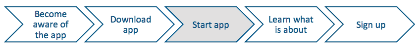

# 为什么这很重要？

一个出色的介绍故事应该指出应用程序的核心价值以及用户从中能得到什么。引导流程很重要，因为它与成功的转化密切相关。每一步你都会失去客户，这是无法完全避免的，但如果你为你的应用程序有一个出色的引导流程，那么损失的数量可以限制。作为一个例子，让我们考虑这样一个场景：每天有 100 个用户下载你的应用程序，其中 60 个注册，其余的 40 个决定稍后或可能永远不会这样做。在这 60 个用户中，只有 30 个在下一个月仍在使用应用程序。在这 30 个用户中，只有 15 个邀请朋友、分享应用程序的内容或进行应用内购买。这仍然是一个非常乐观的故事。

在这个最后一点上，我们可以考虑将用户视为客户，因为他以某种方式（金钱或认知）为我们带来收入。然而，在从潜在用户到客户的转化过程中，我们失去了 85 人。必须有一种方法可以提高转化率。为了做到这一点，我们必须采取一些明智的措施，并且我们需要收集关于该过程的反馈。

入门流程关乎转化，总结如下：

+   从在 App Store 或 Google Play Store 意识到应用的人到通过下载应用成为潜在用户

+   从下载应用的可能用户到通过注册成为实际用户

+   从注册用户到经常使用应用的用户

+   从普通用户到通过分享或邀请朋友推广应用成为大使

# 海盗指标（AARRR）

只有如果我们对优化过程有洞察力，我们才能进行改进。如果我们想从过程中学习，我们需要对其进行测量。转化是我们将在另一章中测量的内容。在那里，我们将更详细地研究我们可以应用于移动应用开发的可操作指标。

这些所谓的海盗指标（AARRR，显然这是海盗们说的）完美地描述了为什么入门流程如此重要以及每个阶段在转化漏斗中代表什么。简而言之，流程如下：

+   A 代表 **获取** 或 **认知******，因此他们能在商店中找到您的应用并下载它。

+   A 代表 **激活**，当用户注册时。

+   R 代表 **留存**，意味着用户定期使用该应用。下载了应用的用户中，有多少人在一周、一个月或一年后仍在使用？

+   R 代表 **收入**，因为人们通过应用内购买或其他我们在另一章中将要审查的货币化方式赚钱。

+   R 代表 **推荐**，其中用户通过分享内容或邀请朋友来告知其他用户关于您的应用。你的应用能否通过口碑或分享而病毒式传播？


可操作指标可以帮助你识别入门过程中的摩擦点。你将在第十三章中了解更多关于这一点，*Play Store 和 App Store 技巧*（拆分测试）和第十五章中，*增加用户粘性和提高留存率*。

# 更高的转化率

通常，移动应用不太关注入门流程。至少，如果你审查 App Store 中的许多应用，你会有这样的印象。你可以为你的应用做出改变。如果你的入门故事更有吸引力，如果注册的门槛更低，那么从获取到激活的转化率会更好。如果你还能向用户展示应用的使用方式，并且他对事物的工作方式感到自信，那么你将提高用户的留存率。他将会频繁地使用你的应用。

为了取得领先，我们需要考虑一种降低用户门槛的方法。有多个已知的引导模式可供选择，而且没有理由你不能将它们结合起来。以下是一些这些模式：

+   简介

+   指南（或游览）

+   乐趣之旅

+   社交注册

+   持续引导

**简介**方法显示几页幻灯片，通常需要用户注册，但一些应用程序选择立即显示应用程序的内容。指南或游览展示了真正的应用程序，并指出一些示例案例。

**乐趣之旅**方法略有不同，因为它允许用户立即使用应用程序，并时不时地突出显示对用户来说新的功能。这是展示应用程序内容的一种很好的方式。但请注意。如果你的应用程序比较复杂，这个选项可能会让用户感到有些不知所措。

**社交注册**允许用户使用他的 Twitter 或 Facebook 账户等快速注册。这可能是有必要让用户能够继续使用应用程序的原因，但如果首先展示应用程序的内容，并且只在需要继续时要求注册，这将降低门槛。

最后，有一个**持续引导**的概念，它可能非常强大，因为它带来了降低门槛和获取丰富用户档案等好处，通过鼓励用户在后期完成其档案。

# 如何降低门槛？

可能最好的引导流程根本不需要注册或登录。在应用程序可以使用之前真的需要这样做吗？另一方面，这也同样是真实的，已知用户比匿名用户更有价值。已知用户可以被转化为客户，这将导致一个盈利的应用程序。一个未知用户不过是一个访客。我们关于此类访客的数据很少，转换可能也会很困难：


为了降低门槛，你最好让注册过程尽可能顺畅。我见过一些应用程序在注册过程中要求用户在多个页面上填写多个字段。在移动设备上做这件事并不有趣，我们可以肯定转换损失将会很大。典型的传统引导和注册流程如下：


我们可以做得更好。所以创建一个精彩而激动人心的介绍故事，并确保用户可以立即看到应用程序的核心价值。一个非常清晰的行动号召（想想一个带有解释文本的高亮按钮）和简化的注册表单可以帮助你做到这一点。描述用户注册后将会拥有的好处，或者使用游戏化元素，如数字激励来说服用户。

社交登录选项是提高转化率并了解用户的好方法。它需要更少的步骤，因此如果用户只需点击 Twitter 或 Facebook 的注册按钮，他们更有可能注册。

要查看一些入门案例研究，您应该检查[`www.useronboard.com`](http://www.useronboard.com)。它包含许多知名应用的入门流程，包括改进的评论和建议。您可以在那里找到 WhatsApp、Yo、Twitter、Foursquare、Snapchat 以及许多其他应用的入门流程。

您可能还想访问[`uxarchive.com`](http://uxarchive.com)以查看更多示例。

# 使用 Twitter 或 Facebook 等社交网络进行单一登录

社交注册具有多重好处，不仅对用户有利，也对开发者有利。避免漫长的注册过程和许多字段。用户注册的可能性增加，并且，在适当的权限下，您可以立即获取有关该用户的一系列信息，例如，用户的头像和姓名，这对于个性化选项来说非常棒。

提供社交登录可能比基于表单的注册多 50%的注册率。还可以提供其他信息，例如，您可以用来邀请朋友加入应用的联系人列表。根据您应用的性质，您可以让用户使用 Twitter、Facebook、Pinterest、LinkedIn 或其他任何受信任的社交网络登录。如果您的应用提供对平台的访问（双边市场），这也可能取决于您的用户性质。例如，对于在线学习解决方案，有面向教师和专业人士的 LinkedIn 注册功能，但学生使用的是 Facebook 注册流程：


使用社交登录的好处如下：

+   注册更快，因此转化率更高

+   邮箱地址立即验证

+   获得的数据是真实的可能性增加

+   个性化，从而产生更多忠诚的粉丝

+   高度参与度

+   需要的支持（如重置密码服务）减少

+   重复用户数量增加

+   由于邀请和分享，增加了推荐的机会

没有一种解决方案适合所有人。您需要决定您将支持哪些社交网络，也许您会选择支持多个。如果您对您的应用有国际化的目标，这一点尤为重要。在美國和欧洲的大部分地区，Facebook 或 LinkedIn 的注册功能非常合理，但在世界其他地区（例如中国或俄罗斯）这些网络可能不太受欢迎（或者根本无法访问），您可能希望为这些特定地区提供另一种注册选项。这可能是一个社交网络，或者您可以提供一个回退机制。您仍然可以在您的应用中提供基于表单的注册流程。您可以使用它来处理用户无法或不想使用社交注册的情况。如果您决定支持它，这取决于您。您可以通过它获得一些额外的受众，但代价是（开发和转化）。因此，有些应用只选择支持一个或多个社交注册选项。

# 展示您拥有的东西

另一种方法是立即显示应用的内容（如果应用的性质允许您这样做），只有在需要时才要求社交注册。

这样就不需要或只需要很少的介绍。就像许多电子商务解决方案（想想网店）一样，只有在必要时才要求注册。在网店的情况下，这是结账所必需的。对于移动应用来说，这可能适用于例如用户不再只是消费，还希望为流贡献力量的情况。您可以想到一个允许用户对出现的消息进行评论的新闻应用：

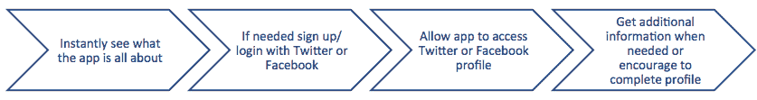

这样可以进一步降低门槛；然而，缺点可能是大量用户永远不会注册，因此对您来说价值较低。例如，匿名用户不太可能从您的应用中分享很多内容，而且由于我们不知道他们是谁，邀请他们的朋友也是不可能的。

# 电话号码注册 - 一个很好的替代方案

WhatsApp 和其他一些应用正在使用设备的电话号码来识别用户进行注册。这是通过短信验证码完成的。用户输入他们的电话号码，并收到包含验证码的短信，他们需要将其输入到应用中。这将确保电话号码是正确的。甚至还有一些实现拦截接收短信验证码，然后自动填写代码。这将从注册流程中去除另一个步骤：

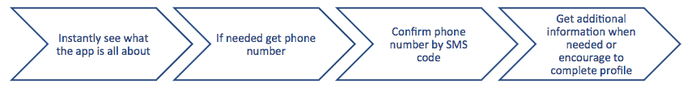

您必须向用户明确说明，他的手机号码仅用于验证目的，并且它不会在应用中公开可用。使用手机号码还将导致用户做出更有价值的贡献。原因很简单。他知道他的手机号码与他应用中进行的所有操作相关联。有一些服务将消除与实施相关的绝大多数麻烦。在我们将在本章后面讨论的示例应用中，我们将使用 Fabric 和 Firebase，因为这是最容易实现的解决方案，并且它是免费使用的。

# 持续引导 - 以后完成用户资料

从你的用户那里获取最基本的信息以让他加入是一个降低门槛的聪明方法。以后你可以鼓励用户添加更多细节到他的资料，或者通过用户做出特定的选择，让应用从中学习。持续引导的概念正是如此。用户的资料将通过用户采取的行动而丰富。这将允许应用提供更好、更定制的应用体验，随着时间的推移将变得更加专注。

领英是一个完美的例子，因为每个人都会认出领英显示的提醒。它要求你完成你的资料，支持你的联系人（丰富他人的资料），或者与人建立联系。你经常会收到这样的提醒，但做这些事情永远不会是强制性的。

这里的激励甚至不是很强，但它效果很好。谁不想拥有一个全明星资料呢？你可以用这个想法为你的移动应用，正如我们很快将在示例应用中看到的那样：

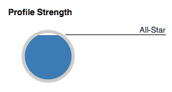

# 讲述一个故事 - 一个示例引导应用

为了展示与引导相关的各种想法，我们将创建一个使用 Fabric 进行 Twitter 身份验证和 Firebase SDK 进行手机身份验证的 Android 应用。你也可以使用 Firebase 进行 Twitter 身份验证，但 Fabric 提供的那个使用起来更方便。

我们将把这个应用命名为“讲述故事”。使用这个应用，用户可以一起编写故事。任何人都可以阅读人们创作的故事，但如果用户想要为故事做出贡献，他需要使用 Twitter 或他的手机号码进行注册。让我们从一个简单的线框开始，它将解释应用的精确流程：

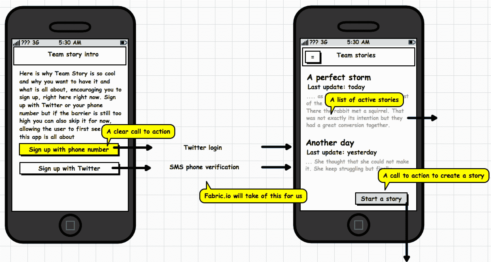

用户首次打开应用时将进入介绍视图。这个视图包含了对为什么他应该想要使用该应用以及它是什么的清晰解释。这里展示了两个非常清晰的行动号召。其中一个是使用手机号码注册的按钮，另一个是使用 Twitter 注册的按钮。

注册后，将显示现有团队故事的列表。用户可以浏览列表，如果他点击任何故事，详细视图中将显示完整的故事。用户也可以决定自己开始一个故事。这里还有一个清晰的行动号召，以“开始一个故事”按钮的形式可视化。

详细视图显示了故事的全部行，包括作者的姓名。现在用户可以阅读完整的故事，或者他可以通过点击“为故事做出贡献”按钮来为故事做出贡献。这样做将带他到“为...做出贡献”视图，在那里他可以输入新的一行代码。如果用户通过点击“开始一个故事”按钮开始一个新故事，他将看到相同的视图。在这种情况下，用户还将被要求提供故事标题。点击“将新行添加到故事”按钮将把新行添加到故事中或创建一个新故事：

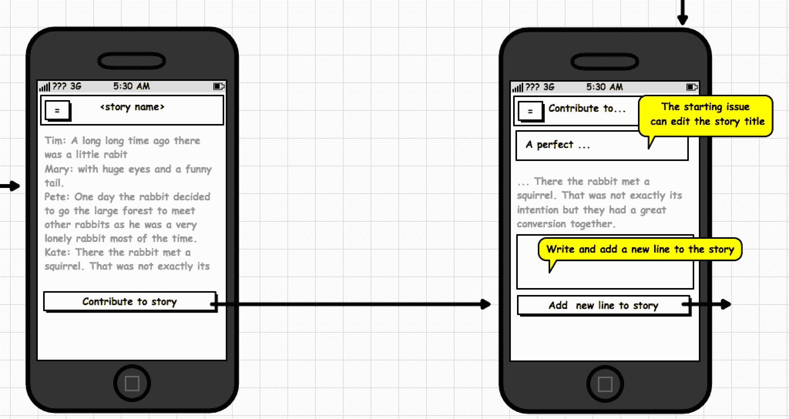

# 需要时进行入职注册

我们还需要在应用中添加一个延迟入职选项。为此，我们将在简介视图中添加一个“暂时跳过”按钮。在第十三章，“应用商店和商店应用技巧”，关于拆分测试的部分，我们将看到如何了解哪种方法最有效。我们需要知道哪种实现将导致最高的转化率。基于这个反馈，我们可以移除“暂时跳过”按钮、简介视图中的注册按钮，或者决定保留简介视图中的所有三个选项。

注意，尽管此按钮被突出显示以演示延迟入职流程，但此按钮不应是主要的行动号召，因此不应将其标记为这样的按钮。我们希望降低门槛，但仍然希望鼓励用户尽早注册：

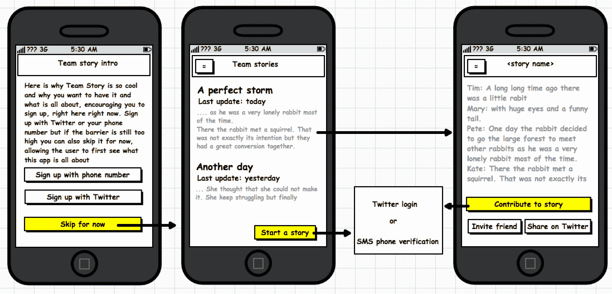

如果用户选择点击“暂时跳过”按钮，因为他显然还没有完全确信应用的好处，他将会立即看到故事列表。只有当他想要开始一个新故事，或者他想要为现有故事做出贡献时，他才会被要求通过 Twitter 或电话/短信进行注册。对于我们的应用，我们希望支持这两种类型的流程。让我们从实现我们刚才看到的内容开始。

# 实现

您可以在此处找到本章的示例项目：[`github.com/mikerworks/packt-lean-onboarding`](https://github.com/mikerworks/packt-lean-onboarding)。

代码示例已更新，因此它将使用最新的最佳版本（在撰写本文时）。Digits，Fabric 手机身份验证服务，已被 Firebase 手机身份验证服务取代。代码示例现在使用此服务，而且我在忙碌之余，还将 Android Java 示例转换为 Kotlin。

您可以先查看该应用，或者如果您想为自己配置它，您需要先配置 Fabric 和 Firebase。

访问[`fabric.io`](https://fabric.io)并创建一个账户。一旦您完成并确认，您就可以继续了。输入一个团队名称（例如`packt-demo`）并选择一个平台（Android）。之后，向导中的新页面将显示多个选项。首先选择 Twitter 选项。第一条信息告诉您如何配置您的 Android 项目。使用向导（或手动操作）在 Fabric 环境中创建第一个应用程序并将其命名为`onboarding`。您需要这样做以获取允许您在自己的应用程序中使用 Fabric SDK 的密钥和 ID。

接下来，我们需要为电话号码认证做一些事情。Fabric 的 Digit 服务正是这样做的，但它已被 Firebase 电话认证所取代。因此，您需要在 Firebase 上设置一些事情。访问[`console.firebase.google.com`](https://console.firebase.google.com)并创建一个新的项目，或者如果您还没有注册 Firebase，您需要先注册。

按照 Firebase 的设置说明操作。在认证部分，您可以选择为您的应用程序使用哪些注册方法。如果您点击手机注册选项并启用它，您就可以继续使用示例应用程序。

让我们浏览一下应用程序。在飞行中，您可以修改 API 密钥和密钥以匹配您自己的设置。一旦在 Android Studio 中打开，您应该展开应用程序文件夹。找到此文件夹中的 build.gradle 文件并打开它。

您会看到该文件包含对 Fabric 和 Firebase 的一些依赖项。我们稍后会使用它们，这样我们就可以使用 Twitter 或 Firebase 电话认证进行登录。此外，我们可以使用`TweetComposer`类在 Twitter 上分享故事。请注意，您可能需要将版本号更新到最新版本。它们出现在各种包名称定义的末尾：

```java
... 
apply plugin: 'io.fabric' 

repositories { 
   maven { url 'https://maven.fabric.io/public' } 
   maven { 
       url 'https://maven.google.com' 
   } 
   mavenCentral() 
} 

dependencies { 
  ... 
   compile('com.twitter.sdk.android:twitter:1.13.3@aar') { 
       transitive = true; 
   } 

   compile('com.twitter.sdk.android:tweet-composer:1.0.3@aar') { 
       transitive = true; 
   } 

   ... 
   implementation 'com.google.firebase:firebase-auth:11.4.2' 
   implementation 'com.google.firebase:firebase-database:10.2.4' 
} 

apply plugin: 'com.google.gms.google-services' 
```

现在，打开`app/src/main/`文件夹中的`AndroidManifest.xml`文件。元数据部分包含`ApiKey`的值。修改它，使其具有与您在`Fabric.io`上的配置相对应的值：

```java
<meta-data 
    android:name="io.fabric.ApiKey" 
    android:value="fill in your api key" /> 
```

与引导活动关联的布局显示了一段简短的介绍，解释了用户为什么想要使用该应用程序以及开始使用它有多简单。电话号码和 Twitter 注册按钮在这里都是清晰的行动号召：

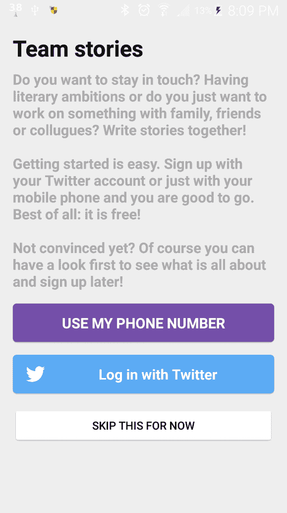

还有一个额外的按钮，它被有意做得更小、颜色更少。它的目的是允许用户暂时跳过注册过程，以防他只想看看应用程序的内容。

打开`strings.xml`值并更新`twitter_key`和`twitter_secret`。用您自己的值替换它们。您可以在 Fabric 网站上找到它们：

```java
<resources> 
   <string name="twitter_key">fill with your own Twitter key</string> 
   <string name="twitter_secret">fill your own Twitter secret</string> 
```

打开`OnboardingActivity`类。在`onCreate`方法中，调用了`initFabric`方法。这就是 Fabric 初始化 Twitter 认证和分享的地方：

```java
private fun initFabric(){ 
   val authConfig = TwitterAuthConfig(getString(R.string.twitter_key), getString(R.string.twitter_secret)) 
   Fabric.with(this, Twitter(authConfig)) 
   Fabric.with(this, TwitterCore(authConfig), TweetComposer()) 
} 
```

跳过按钮的点击监听器使应用程序立即跳转到列表。如果点击，Twitter 登录按钮将显示一个请求权限的 Twitter 对话框。如果授予此权限，回调的成功方法将被触发。然后我们将存储`TwitterSession`对象，并通过调用`onShowList`方法向用户显示故事列表：

为了简化，`AuthenticationHelper`除了在应用程序的生命周期内之外，不会持久化会话。在生产应用程序中，只要它们有效，持久化它们会更为方便。

您可以在`setupTwitterLoginButton`和`signinWithTwitterAuthCredential`方法中找到我们刚才看到的实现，如下所示：

```java
private fun setupTwitterLoginButton(){ 
  twitter_login_button.setCallback(object : Callback<TwitterSession>() { 
       override fun success(result: Result<TwitterSession>) { 
           mTwitterSession = result.data 
           Log.i(javaClass.simpleName, "Twitter login @" + result.data.getUserName() + ")") 
           val credential = TwitterAuthProvider.getCredential( 
                   result.data.getAuthToken().token, 
                   result.data.getAuthToken().secret) 
           signinWithTwitterAuthCredential(credential) 
       } 

       override fun failure(exception: TwitterException) { 
           Log.d(javaClass.simpleName, "Login with Twitter failure", exception) 
       } 
   }) 
} 
```

`signInWithPhoneAuthCredential`方法使用用户的 Twitter 名字作为 Firebase 用户注册用户。我们稍后会使用这个手机号码来识别用户的贡献。

```java
private fun signinWithTwitterAuthCredential (credential: AuthCredential){ 
   mAuth.signInWithCredential(credential) 
       .addOnCompleteListener(this, OnCompleteListener<AuthResult> { 
           if (it.isSuccessful) { 
               AuthenticationHelper.user = it.result.user 
               Log.i(javaClass.simpleName, 
                 "User logged in or registered with twitter name ${AuthenticationHelper.user?.displayName}") 
               continueFlow() 
           } else { 
               if (it.exception is FirebaseAuthInvalidCredentialsException) { 
                   onboarding_code_feedback_text.text = "Invalid code." 
               } 
           } 
       }) 
} 
```

要使用手机号码注册，我们需要告诉 Firebase 通过短信向用户发送验证码。我们将在`sendPhone`方法中完成此操作：

```java
private fun sendPhone(){ 
   val number = onboarding_phone.text.toString() 
    PhoneAuthProvider.getInstance().verifyPhoneNumber( 
           number, 60, TimeUnit.SECONDS,  this, getCallback()); 
} 
```

回调实现位于`getCallback`方法中。`onCodeSent`是最有趣的事件。如果验证码已发送，我们将存储返回的验证 ID。我们稍后会需要它来使用代码验证用户：

```java
private fun getCallback(): PhoneAuthProvider.OnVerificationStateChangedCallbacks { 
   val callbacks = object : PhoneAuthProvider.OnVerificationStateChangedCallbacks() { 
     ... 
       override fun onCodeSent(verificationId: String?, token: PhoneAuthProvider.ForceResendingToken?) { 
           mVerificationId = verificationId; 
           mResendToken = token; 
           ... 
       } 
   } 
   return callbacks 
} 
```

在向用户发送验证码后，他必须输入验证码以确保提供的手机号码确实是他的手机号码。这是在`sendCode`方法中完成的：

```java
private fun sendCode(){ 
   val verification = mVerificationId 
   if (verification != null) { 
       val code = onboarding_code.text.toString() 
       val credential = PhoneAuthProvider.getCredential(verification, code) 
       signInWithPhoneAuthCredential(credential) 
   } 
} 
```

`signInWithPhoneAuthCredential`方法使用用户的手机号码作为 Firebase 用户注册用户。我们稍后会使用这个手机号码来识别用户的贡献：

```java
private fun signInWithPhoneAuthCredential(credential: PhoneAuthCredential) { 
   mAuth.signInWithCredential(credential) 
       .addOnCompleteListener(this, OnCompleteListener<AuthResult> { 
           if (it.isSuccessful) { 
               AuthenticationHelper.user = it.result.user 
               Log.i(javaClass.simpleName, 
                  "User logged in or registered with phone no ${AuthenticationHelper.user?.phoneNumber}") 
               continueFlow() 
```

这里是两个用户的示例。第一个是使用 Twitter 注册的，而另一个则使用了他的手机号码进行注册：

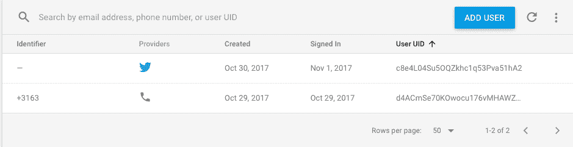

现在，打开 MainActivity。在`onCreate`方法中，您会看到我们首先做的事情之一是调用`onList`方法。`onList`方法创建一个新的`StoriesFragment`，通过调用`showFragment`方法，默认会显示故事列表：

```java
fun onList() { 
   val fragment = StoriesFragment.newInstance() 
   showFragment(fragment) 
} 

fun onCreateStory() { 
   val newStory = Story() 
   newStory.lastUpdate = "today" 
   val fragment = StoryContributeFragment.newInstance(newStory) 
   showFragment(fragment) 
} 

fun onContribute(story: Story) { 
   val fragment = StoryContributeFragment.newInstance(story) 
   showFragment(fragment) 
} 

fun onReadStory(story: Story) { 
   val fragment = StoryDetailFragment.newInstance(story) 
   showFragment(fragment) 
} 

fun onLateOnboarding(story: Story) { 
   val intent = Intent(this, OnboardingActivity::class.java) 
   intent.putExtra(OnboardingActivity.ARG_LATE, true) 
   intent.putExtra(OnboardingActivity.ARG_STORY, story) 
   startActivityForResult(intent, REQUEST_LATE_ONBOARDING) 
} 

private fun showFragment(fragment: Fragment) { 
   val ft = fragmentManager.beginTransaction() 
   ft.replace(R.id.main_fragment_container, fragment, fragment.javaClass.toString()) 
   ft.commit() 
} 
```

MainActivity 还负责显示其他片段，例如显示完整故事的`StoryDetailFragment`和`StoryContributeFragment`。它还包含对`OnboardingActivity`的调用，用于后续的注册。这将允许用户在之前跳过注册但后来想要为应用程序做出贡献的情况下注册。通过向故事添加内容或创建新的故事，他们将被要求再次注册：

```java
val repository: Repository get() = Repository(this) 
```

`getRepository`方法仅返回我们接下来将要研究的`Repository`类的新实例。

您将找到包含数据包的`Repository`类。如您所见，`getDummyContent`方法创建了一个示例故事列表。

`repository`类已经准备好与 Firebase 一起使用，但由于我们想要演示引导概念，数据仅在应用的生命周期内持久化。如果你已经阅读了第九章，*原生、混合或跨平台*，设置 Firebase 并修改这个类以能够将故事存储在云中将会非常容易。

类看起来是这样的：

```java
class Repository(private val context: Context) { 

   fun getStories(handler: OnRepositoryResult) { 
       val content = getDummyContent() 
       handler.onResult(content) 
   } 

   fun updateContributions(story: Story) { 
       if (story.id == null) { 
           addStory(story) 
       } 

       dummyContentList.forEach { 
           if (it.id.equals(story.id, ignoreCase = true)){ 
               it.contributions  = story.contributions 
           } 
       } 
   } 

   fun addStory(story: Story) { 
       if (story.id == null) { 
           story.id = UUID.randomUUID().toString() 
       } 
       dummyContentList.add(story) 
   } 

   companion object { 
       private var dummyContentList = mutableListOf<Story>() 
       private fun getDummyContent(): List<Story> { 

           if (dummyContentList.isEmpty()) { 
               val dummy = mutableListOf<Story>() 
               val s1 = Story("A first story", "MikeR", "Today") 
               s1.id = "1" 
               s1.contributions.add(Contribution("Once upon a time", "MikeR")) 
               s1.contributions.add(Contribution("a giant rabbit did exist", "Pete")) 
               s1.contributions.add(Contribution("in a galaxy far far away", "Floris")) 

               val s2 = Story("A second story", "MikeR", "Yesterday") 
             ... 
               dummy.add(s1) 
  ... 
               dummyContentList = dummy 
           } 
           return dummyContentList 
       } 
   } 
} 
```

`getStories`方法异步返回所有故事和数据。`updateContributions`方法向现有故事添加新的贡献，或者如果故事尚不存在，通过调用`addStory`方法创建一个新的故事，并添加到列表中。

在`models`包中，你可以找到`Story`和`Contribution`类。一个`Story`有一个标题和多个贡献，每个贡献都有一个作者和一些内容。`Parcelable`实现使得从一个片段（或活动）向另一个片段传递数据变得更加方便，正如我们稍后将会看到的：

```java
class Story : Parcelable { 
   var id: String? = null 
   var title: String? = null 
   var initiator: String? = null 
   var lastUpdate: String? = null 
   var contributions = mutableListOf<Contribution>() 
...  
   fun getFullStory(includeAuthors: Boolean): String { ...  }    

val summary: String 
       get() { 
           val builder = StringBuilder() 
           if (contributions != null) { 
               var start = contributions.size - 3 
               if (start <= 0) { start = 0 } 
               for (build in start..contributions.size - 1) { 
                   builder.append(contributions[build].paragraph.toString() + "\n") 
               } 
               return builder.toString() 
           } else { 
               return "This story has not started yet!" 
           } 
       } 
   ... 
```

`getSummary`和`getFullStory`方法使`Story`对象稍微智能一些，并分别返回最后三行或完整的故事文本。

`Contribution`类同样实现了`Parcelable`接口，原因与`Story`类相同。每个`Contribution`实例都有一个作者和一个段落成员。

用户首先看到的是登录视图之后的内容，了解应用的基本功能。对于功能较为复杂的应用，在首次使用时突出显示特定功能可能很有帮助。通过在引导流程中展示这些功能，我们可以鼓励用户注册应用。对于这个应用来说，事情相当明显：

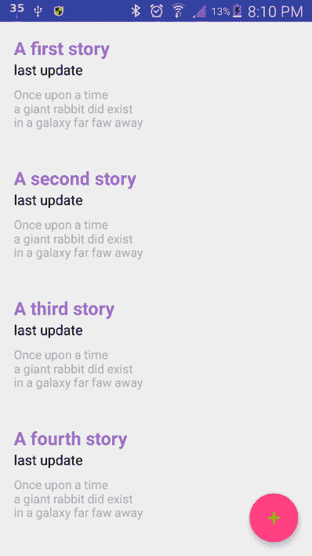

每个人都喜欢故事，所以用户可能的第一步就是点击一个看起来吸引人的故事摘要。（这同样是一个需要证明的假设。）如果用户点击带有加号符号的浮动操作按钮，他将创建一个新的故事：

```java
class StoriesFragment : Fragment(), OnCardViewClicked, OnRepositoryResult { 
   private var recyclerView: RecyclerView? = null 
   private var adapter: StoryAdapter? = null 
   private var viewModel = mutableListOf<Story>() 
... 
```

如果你查看`StoriesFragment`内部，你会看到将使用`RecyclerView`小部件和`StoryAdapter`来显示这里显示的数据。在`onCreateView`方法中，将调用`loadData`方法，该方法反过来调用`Repository`类的`getStories`方法，并将片段本身作为结果的处理者：

```java
override fun onResult(result: List<Story>) { 
   viewModel = result.toMutableList() 
   adapter = StoryAdapter(viewModel) 
   adapter?.setOnCardViewClicked(this) 
   recyclerView?.adapter = adapter 
} 
```

当结果返回时，将创建一个`StoryAdapter`类的实例并将其附加到`RecyclerView`实例上。`StoryAdapter`将每个故事的数据绑定到列表中的行：

```java
override fun onCardClicked(view: View, position: Int) { 
   (activity as MainActivity).onReadStory(viewModel[position]) 
} 
```

如果用户点击任何一行，将触发`OnCardViewClick`事件，这将调用`MainActivity`中的`onReadStory`方法，并将选定的故事作为参数传递。这将带我们到`StoryDetailFragment`的实现。

此片段向用户显示完整的故事，包括贡献者的名字。在这里，用户可以通过点击 CONTRIBUTE（如示例图像所示）来为故事做出贡献：

```java
class StoryDetailFragment : Fragment() { 
   private var mStory: Story? = null 
   override fun onCreate(savedInstanceState: Bundle?) { 
       super.onCreate(savedInstanceState) 
       mStory = getArguments().getParcelable(ARG_STORY) 
   } 
```

在`onCreate`方法中，选定的故事将通过 bundle 接收。在这里，`Parcelable`实现非常有用。在`onCreateView`方法中，将使用`story`对象的`getFullStory`方法将故事的全部内容设置为`textView`的文本：

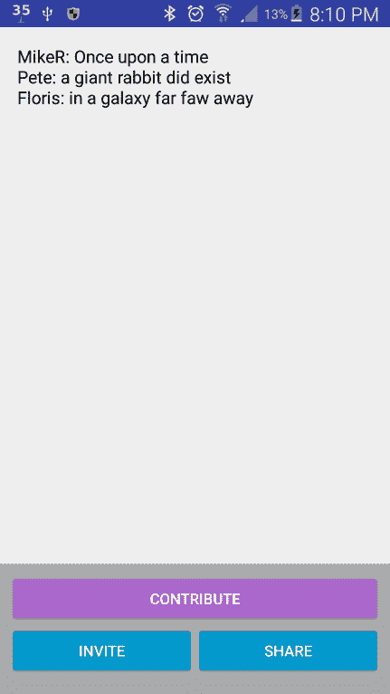

在`onClick`方法中，你可以找到处理各种按钮点击的处理，例如“贡献”按钮。这将调用`onContribute`方法，然后反过来调用 MainActivity 的`onContribute`方法，包括当前选定的故事。这将导致显示与`StoryContributeFragment`类相关的布局：

在`StoryDetailFragment`的`onShare`方法中，你可以找到用于编写和分享推文的代码行：

```java
private fun onShare() { 
   val builder = TweetComposer.Builder(getActivity()) 
           .text(String.format(getString(R.string.sharing_text), mStory?.title)) 
   builder.show() 
} 
```

`StoryContributeFragment`允许用户为故事做出贡献或开始一个新的故事。在此时刻，用户从被动用户变为主动用户。此外，由于用户需要注册（尽管他可能还没有这样做），用户将被转换为已知用户。片段通过 bundle 参数获取选定的故事。它可能是一个空的，因为用户点击加号按钮，他想要创建一个新的故事。如果它是一个现有的故事，将显示故事的摘要（最后三个贡献）。

如果用户点击“贡献”按钮，将调用`onContribute`方法。在这里，将创建一个新的`Contribution`对象，并且可选地创建一个新的故事对象。贡献将被添加到故事中，我们将询问`AuthenticationHelper`类当前用户是否已经认证。如果用户已经认证，无论是通过 Twitter 注册还是通过 Firebase 手机注册，我们可以通过填写贡献者的名字（Twitter 名字或电话号码）来继续操作。此外，我们调用`Repository`类的`updateContributions`方法，该方法将负责存储故事：

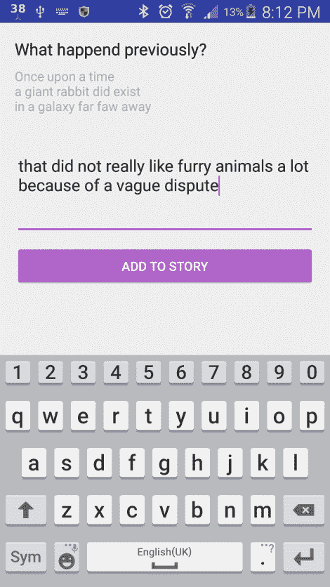

如果用户尚未认证，我们将调用 MainActivity 的`onLateOnboarding`方法。在这里，我们也将故事（以及与之相关的贡献）作为参数传递：

```java
fun onLateOnboarding(story: Story) { 
   val intent = Intent(this, OnboardingActivity::class.java) 
   intent.putExtra(OnboardingActivity.ARG_LATE, true) 
   intent.putExtra(OnboardingActivity.ARG_STORY, story) 
   startActivityForResult(intent, REQUEST_LATE_ONBOARDING) 
} 
```

`OnboardingActivity`还将动态处理认证过程。虽然来得晚，但总比不来好。如果你想为故事做出贡献，或者想自己创建故事，你必须先注册。现在，活动将显示一条消息，指出这一点，并再次为用户提供使用 Twitter 账户或使用电话号码注册的选择：

```java
private fun continueFlow(){ 
   if (mIsLateOnboarding){ 
       val returnIntent = Intent() 
       returnIntent.putExtra(OnboardingActivity.ARG_STORY, mStory) 
       setResult(Activity.RESULT_OK, returnIntent) 
       this.finish() 
... 
```

如果延迟认证成功，结果将返回 MainActivity，MainActivity 将负责将贡献添加到故事中：

```java
override fun onActivityResult(requestCode: Int, resultCode: Int, data: Intent) { 
   if (requestCode == REQUEST_LATE_ONBOARDING) { 
       if (resultCode == Activity.RESULT_OK) { 
           val story = data.getParcelableExtra<Story>(OnboardingActivity.ARG_STORY) 
           val lastContribution = story.contributions.last() 
           lastContribution.contributor = AuthenticationHelper.userName 
           repository.updateContributions(story) 
           onList() 
       } 
   } 
} 
```

之后，通过调用`MainActivity`类的`onList`方法再次显示故事列表。这次列表将包括贡献，或者不再是不知名的用户的故事。最后注册成功！

到目前为止，对于这个应用，我们已经看到了一些关于注册和后期上线的酷炫实现。如果你喜欢这个概念，那么请随意对应用进行一些进一步的实验。例如，考虑为应用添加另外两个很棒的功能：一个邀请朋友选项（与你一起写故事）和一个分享选项（在 Twitter 或其他社交媒体网络上分享这个故事）。这将提高你应用的知名度。这将帮助你扩大你应用的用户基础。我们将在第十四章中了解更多关于这一点，*A/B 测试你的应用*，这是关于吸引力和留存率的：

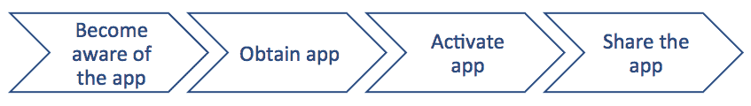

成长黑客（除了其他事情之外，还是一个持续的过程，结果是现有用户邀请朋友加入并使用应用）。人们开始下载你的应用的原因是他们已经意识到了它。当你实施朋友推荐流程时，你会看到更高的转化率。

成长黑客：

成长黑客（基本上是营销的现代说法）是一个值得单独写书的主题。在开始构建你的应用之前，你应该考虑构建一个增长引擎。为你的应用将要解决的问题建立一个受众。这是一种测试你的应用想法和创造意识的好方法。最简单的方法是创建一个关于这个主题的常规博客。


完美的转化是这样的：一旦用户注册并开始了一个故事或对其做出了贡献（激活），然后决定继续这样做（留存），他将成为你应用的代言人，并开始分享故事或邀请朋友一起写故事（推荐）。

推荐很重要，因为口碑是营销中最有效的类型之一。超过 70%的潜在应用用户是基于朋友、同事或家人的推荐下载应用的。考虑到这一点，目标应该是让应用用户能够推动更多的知名度，这正是团队故事应用试图做到的。推荐往往是推广应用的唯一方式。这是因为，对于大多数移动应用来说，用户获取成本（广告）通常会比收入高。

由于其性质，某些特定应用，如社交或消息应用，以及当然还有游戏应用，非常适合邀请朋友。如果以某种方式无法进行协作，它们通常就没有太多意义。对于许多其他应用，分享或邀请的原因可能不那么明显。然而，如果你提供激励，例如，Dropbox 通过为每个新推荐提供额外空间来做到这一点，你仍然可以从推荐中受益。

# 摘要

在本章中，我们看到了引导用户和鼓励用户注册的多种方法。我们看到了保持门槛尽可能低的重要性，并且你需要从一开始就非常清楚地说明你应用的好处以及用户为什么要使用它。或者，就像西蒙·辛克所说的那样，“从为什么开始”。

我们已经看到，使用 Firebase 或 Fabric SDK 实现社交注册相对容易，我们也学习了如何为用户提供多种选择，包括最初跳过注册的选项。尽管这降低了门槛，但后者并不一定是好事。匿名用户的价值不如已知的用户。此外，已知的用户更容易转化为付费用户（客户）。你需要找出对你应用来说什么最有效。也许你最初只是想扩大用户基础。在下一章中，我们将看到拥有可扩展解决方案的重要性。
