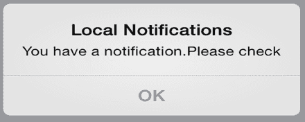
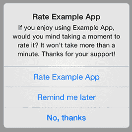
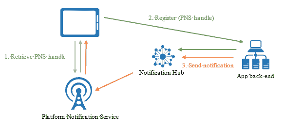
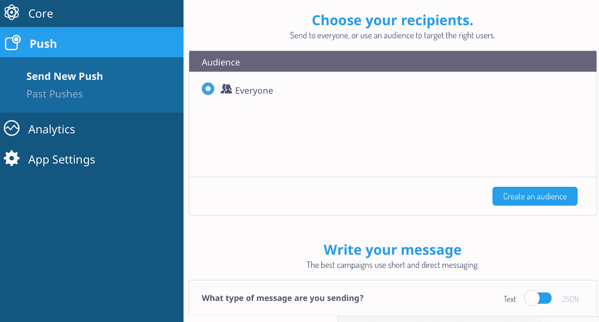
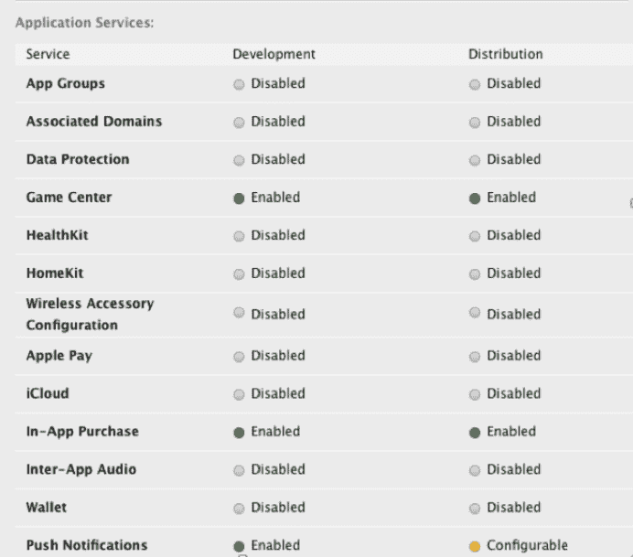
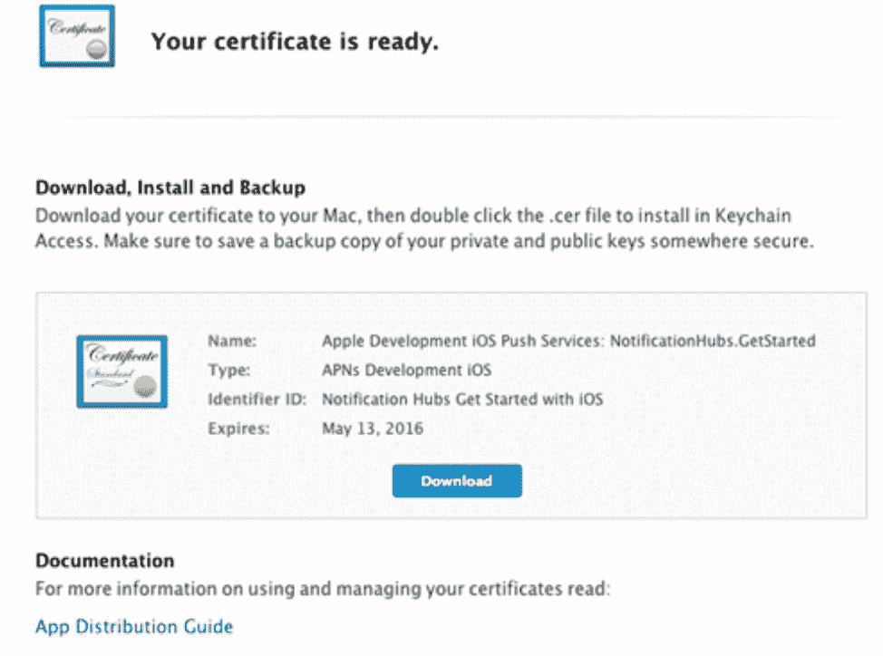
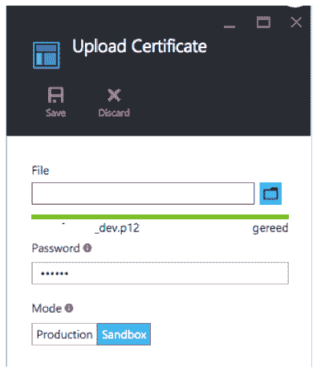
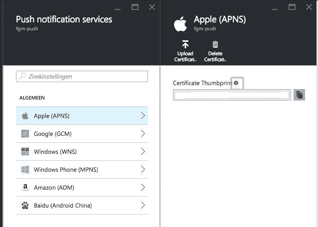

# 第十五章：增长用户粘性和提高留存率

在本章中，你将了解用户粘性，这是某人想要使用你的产品并且，在大多数情况下，愿意为此付费的证据，最终导致盈利性业务。现在我们已经获得了一些可操作的指标，正如我们在上一章中学到的，我们将看到如何增长用户粘性。如果没有足够的留存率（返回应用的用户）或者过高的流失率（放弃应用的用户），关键时刻将很快过去，我们将失去用户粘性。让我们调查如何提高留存率。此外，我们还将看到我们可以做些什么来保持低流失率。

具体来说，在本章中，我们将涵盖以下主题：

+   了解用户粘性的定义

+   发现我们如何增长用户粘性以及何时“增长黑客”策略开始发挥作用

+   了解我们如何提高留存率

+   学习如何与你的应用用户保持联系

+   了解实现通知机制以提醒用户需要什么

# 用户粘性

那么，什么是用户粘性？基本上，它是指表明业务规模化和可重复性的趋势。用户粘性是足够大的市场需求和更具体地说关于采用和参与度的证据。如果你做得好，用户粘性就是对你产品或服务假设的证实。用户粘性关乎实际进展，在应用的每个阶段都很重要。它关乎你在刚开始时注册的前几个早期采用者，最终也关乎进行（应用内）购买的用戶。你的应用在将人们转化为用户以及用户转化为客户方面做得如何？

即使是新兴的应用克隆（或模仿者）也是用户粘性的迹象。它证明了随着用户基础的扩大，你应用解决的问题确实很重要，并且这个问题值得解决。

如盈利（收入）、注册和活跃用户数量（留存率）、参与度、流量以及甚至合作伙伴关系等都是你可以用来衡量用户粘性的因素。请注意，孤立的信息并不能真正证明用户粘性。例如，你可以运行一些活动来增加你的用户基础，但如果**客户获取成本**（**CAC**）高于**每用户平均收入**（**ARPU**），那么仅仅看收入来决定用户粘性就没有意义了。你需要确保**客户终身价值**（**LTV**）将高于新用户获取的成本。你需要降低成本或者提高 LTV。为了做到后者，例如，你可以考虑提供订阅服务。除了一次性应用内购买外，它还将带来持续的收入。

在你的应用的可扩展性上下功夫，对业务有所帮助，这有助于获得和提升吸引力。然而，为了了解这对你的应用将如何工作，你通常需要做一些（目前）不可扩展的事情，正如我们在第十一章中看到的，*用户入门和注册*。你首先必须了解什么有效，什么无效。前面提到的“礼宾服务”肯定不可扩展，但它可以帮助你获得许多有用的见解。你可以做的事情还包括冷 canvassing 和一般的 networking。由于这些策略是商业导向的人喜欢做的事情，但大多数开发者会讨厌，我们将探讨我们还能做些什么来增长吸引力。

你可以做一些事情来提高你应用的知名度，并找到你的早期用户。如果人们看到你的应用列在以下提到的任何网站上，并决定下载你的应用，那么你将看到吸引力的第一个迹象。

除了在 Facebook、LinkedIn 和 Twitter 上发布关于你应用的帖子外，以下是一些你可以开始的地方：

+   **Product hunt**: [`www.producthunt.com`](https://www.producthunt.com)

+   **Betali.st**: [`Betali.st`](http://Betali.st)

+   **Start-up list**: [`startupli.st`](http://startupli.st)

+   **Reddit startups**: [`www.reddit.com/r/startups`](https://www.reddit.com/r/startups)

这些地方就是你的（潜在）早期用户所在之处，他们对了解新应用和服务充满好奇。由于他们喜欢对新产品提供反馈，这些人正是你所寻找的目标。

当然，你应该有一个关于你应用的博客（如果没有，现在就开始一个），在发布第一个（测试）版本之前。在投入任何开发应用的努力之前，首先建立受众是很重要的。确保你的博客读者有一个清晰的行动号召。尽可能让注册你的电子邮件通讯简报变得方便，并定期向订阅者发送这些通讯简报。一旦你的应用发布，继续你的博客写作，并进行一些实验（对你的电子邮件进行 A/B 测试），看看什么能带来最佳的转化（从阅读到打开你的应用，着陆页和下载，以及使用你的应用）。

# 免费还是付费？

有些人说，唯一相关的牵引力是价格牵引力。如果你的应用程序完全免费，那么你对应用程序的需求可能是无限的。然而，如果没有收入，这本身并不是很重要。从一开始就为你的应用程序收费是衡量牵引力的最终方式。你越早产生收入，就越快验证应用程序的概念。如果你认为这种方法不会奏效，那么再考虑一下，并查看网络上的各种众筹网站。当然，你需要有一个关于你的应用程序的精彩故事。你需要告诉他们你的应用程序有什么如此出色，但你已经有了一个很好的故事，对吧？

没有任何收入的业务是无法生存的。事实上，免费的应用程序是不存在的。钱必须从某个地方来。提供应用内购买是货币化你的应用程序的一种方式，但只有一小部分用户（2%或更少）会真正这样做。其他 98%将继续使用你的应用程序，而从未为此付费。免费增值模式之所以有效，是因为托管成本低，并且你可以不费太多力气地扩展你的应用程序。然而，你仍然需要关注整个 100%的用户群体。你必须回应他们的评论，并且你必须继续在社交媒体上发布。这可能非常耗时。来自你 2%用户的收入应该覆盖这些成本。

决定应用程序付费版本应包含哪些功能可能很困难。你需要清楚地了解你的应用程序的每一部分对你的用户来说有多有价值。此外，你也可以选择仅提供高级应用程序。如果你从一开始就直接为你的应用程序收费，这将提高门槛，但你的销售数字将是牵引力的真实证明。在第十七章“货币化和定价策略”中，我们将更详细地探讨定价策略。

当然，还有其他方式可以货币化你的应用程序。你可以考虑展示广告。此外，你也可以考虑一个利用网络和移动渠道的解决方案。不要再把你的应用程序视为产品，而是将其视为你服务的渠道。因此，你可以免费提供你的应用程序，但在网络上，你可以要求用户为订阅你的服务付费。这种方法对于面向商业的解决方案尤其有效。收入会更高，可能是因为应用程序本身的价值感知可能较低。这只是一种感知问题，但在市场营销中，感知很重要。这也可能与这样一个事实有关，即，人们往往不太愿意为在较小设备上运行的应用程序付费。这有点荒谬，但无论如何，这是真的。也许我们可以专注于开发仅适用于大电视的应用程序？当然，我只是在开玩笑。

从开发者的角度来看，这完全没有意义。开发者知道这需要相同的工作量，而且设备的大小在这里并不重要。无论如何，感知的价值和使用的渠道确实很重要。它们将对牵引力的大小及其确定方式产生影响。

没有明确的目标，你无法衡量牵引力或任何其他类型的成功。你的目标越抽象，你感知结果就越困难。为了使结果可衡量（可操作的指标），你需要定义明确的目标。明确的目标伴随着数字，比如我们希望在特定时间内（1 个月？）有多少新注册（1,000？），或者我们需要发送多少封电子邮件来将用户的转化率提高 25%？

# 提高留存

移动应用的留存和参与度是衡量你的应用成功与否的指标。高留存和参与度比率往往是你的应用成功的原因。留存说明了在特定时间内你的用户多久重启一次你的应用。参与度是一个活动指标。它说明了他们在使用你的应用时在做什么，以及他们在特定会话中多久做一次以及做多少次。在这两个指标中，留存可能是最重要的。如果你理解了是什么让你的应用对用户有粘性，那么你将能够提高留存率。

你应该始终思考：对他们来说，这有什么好处？你应该给你的用户提供一些好的理由，让他们定期回到应用中。社交应用有最好的留存率。人们回来是因为他们想保持对常规信息流的更新。这被称为**错失恐惧症**（**FoMo**）。这是 Facebook 完全掌握的技能。不幸的是，与 Facebook 不同，大多数应用并不是每天都会被使用。

活跃流失是一个或多或少与留存相反的现象。活跃流失总是存在的，但你尽可能将其保持在最低。今天，数据显示，如果一个应用一周内没有被启动，那么有 60%的人可能会忘记它。你需要保持你的应用的相关性。你必须定期提供新鲜的内容和新功能。不用说，你必须通知用户这些更新。例如，你可以发送推送通知。这是一个非常常见的吸引用户注意并让他们回到你的应用的方法！

一个低门槛的入门体验，提供新鲜和相关的内容和功能，个性化（社交注册策略可能在这里有所帮助），激励措施，以及发送推送通知，这些都是可以极大地促进更好的留存和参与价值的特性。

激励与游戏化密切相关。两者都奖励用户在您的应用中达到特定成就。虽然游戏化更多地涉及数字激励，例如徽章（例如在 Foursquare 和 Stack Overflow 上可用），但激励则是关于现实世界、非数字奖励，例如在最近的咖啡馆里免费提供一杯咖啡。如果您想了解更多关于激励的概念，您可以查看[`kiip.me`](http://kiip.me)。

有许多方法可以提高用户留存率，从而获得更好的推广效果。目前，我们将仅探讨如何通过启用推送通知来保持与用户的联系。您需要给人们一个理由让他们继续回来，并且您通常需要提醒人们您的应用的存在。如果您不希望您的应用被遗忘、废弃，最终被删除，您应该友好地提醒他们。

有许多方法可以提高用户留存率，从而获得更好的推广效果。目前，我们将仅探讨如何通过启用推送通知来保持与用户的联系。您需要给人们一个理由让他们继续回来，并且您通常需要提醒人们您的应用的存在。如果您不希望您的应用被遗忘、废弃，最终被删除，您应该友好地提醒他们。

请不要向用户发送垃圾信息。不要发送太多消息，并通过细分，只发送相关信息。如果用户长时间不活跃，并且您有一些有趣的内容想要与他们分享，您可以发送一个友好的提醒。如果您想了解哪种提醒效果最好，这是一个绝佳的礼宾服务候选。找出哪种消息效果最好，并看看哪些客户细分市场将显示出最佳的转化率。一旦您了解了这些，然后您可以稍后进行自动化。如果您已经拥有庞大的用户群，您还可以进行 A/B 测试，看看哪种方法效果最好。有许多服务可以帮助您进行客户细分和运行拆分测试。

此外，考虑一下提醒的频率。一周的禁食期是否是发送提醒的好时机？或者两周更好？讲述一个故事并构建一个体验很重要。明确告诉他们从中可以得到什么，应该伴随着一个明确的行动号召，例如“查看我们的新功能 X”或“看看你的朋友 Y 发布了什么”。

推送通知可以帮助提高用户留存率。数据显示，平均而言，选择接收推送通知的用户留存率提高了 25%。这似乎很有道理。顺便说一下，iOS 应用的推送通知总是需要用户主动选择接收。只有当用户明确表示他们希望接收推送通知时，他们才会收到这些通知。Android 系统有一个退出机制。用户安装应用后，除非他们选择退出，否则会收到推送通知。

# 通知

您可以使用以下三种方式通过通知消息和徽章与您的应用程序用户进行沟通：

+   本地通知

+   推送通知

+   应用内通知

# 本地通知

本地通知就像服务一样，在用户的设备上运行。您的应用程序不需要处于活动状态即可接收与您的应用程序相关的本地通知。它们也不需要互联网访问或服务器。相反，它们被安排在特定的日期和时间，就像闹钟一样。它们是由您的应用程序初始化的。

您可以安排一个本地通知来提醒用户关于应用程序，但一旦用户启动您的应用程序，就取消该通知。这是一个提醒用户您的应用程序存在的绝佳工具：



您可以使用本地通知来提高您应用程序的留存率。您可以在应用程序关闭或失去焦点时安排通知，但在应用程序再次变得活跃时取消它们。如果您将日期设置为现在的一周或两周后，并且用户忘记了您的应用程序，他们将收到一个友好的提醒。然而，如果他们在这一特定时间段内使用应用程序，那么通知将被取消，用户将不会受到任何提醒通知的打扰。

# 推送通知

推送通知涉及服务器（以及随之而来的互联网连接）来启动操作。此类通知是促销活动的绝佳工具，可以通知用户关于应用程序中新内容和新功能的情况。此外，根据应用程序的性质来决定哪些通知是相关的。对于约会应用程序，当有新的应用程序时收到通知会很不错。在这种情况下，在应用程序图标上显示表示新匹配和消息数量的徽章也会非常有帮助。对于新闻应用程序，每当有新的重要消息到来时收到通知会很棒。您可以根据兴趣或地理位置等来创建用户细分，例如，仅通知您的用户有关当地新闻事件。

# 应用内通知

最后，您可以使用应用内通知来指示有新事件发生。您可以在相关的地方显示徽章，比如标签或菜单项。您还可以在应用程序使用时使用应用程序通知来刺激特定的行为。例如，考虑一个提醒通知，如“给这个应用评 5 星！”一些方法可能相当巧妙，比如只有在用户使用应用程序五次（参与度）且应用程序没有崩溃时才显示的对话框。

只有在这种情况下，对话框才会请求给予 5 星评价！为对您应用程序充满热情的用户提供便利并降低评价应用的门槛是很重要的。对于可能对您的应用程序不太满意的用户，您可以保持当前的门槛。这将有助于您获得更好的 App/Play Store 评价。

有一些组件正是为此而设计的。其中之一是 iOS 的 iRate。只需几行代码，你就可以在你的应用中实现一个“给我们评分”或“给我们 5 星”的弹出窗口。你可以配置它何时以及什么条件下会显示：



对于每种类型的通知，重要的是不要让用户感到烦恼。不要过于频繁地向用户提出过多要求。只有当有相关内容需要提及时，才应该通知用户。没有特定原因的推送通知，只是为了让用户回到应用，可能一次转化效果不错。然而，如果这种情况发生得太频繁，就会变得令人烦恼，用户可能会选择卸载应用。

# 推送通知服务

要将你的推送通知分发到安卓和 iOS 设备，你需要有一个推送通知服务器，它会将消息发送到正确的设备。虽然你可以自己构建这个服务器，但使用为这个目的提供的现成解决方案会更方便。现有解决方案的好处，除了节省大量时间外，还包括它们的可扩展性、多平台支持和分段选项，这使得确定哪些消息发送给哪些用户变得更加容易。

这样的解决方案的例子包括 Urban Airship、Azure 推送通知中心、Amazon Push、托管 Parse 服务器解决方案（例如在 back4app.com 上找到的），以及 Firebase 推送通知服务。它们都有不同的定价计划，并支持不同的操作系统。

例如，这里有一个 Azure 推送通知中心的示意图。它可以向 iOS 和安卓（如果你仍然真的想这么做，也可以是 Windows Phone）发送推送通知：



如果你想要向除安卓或 iOS 以外的操作系统发送推送通知，或者如果你想在西方世界之外发送推送通知，那么仔细检查不同的选项是很好的。比如说，你想要将你的应用推向中国市场。在这种情况下，了解亚马逊支持百度推送通知是很有帮助的，因为并非所有服务都支持这一点。亚马逊有一个中心节点，无论设备运行在亚马逊、iOS、百度、安卓还是 Windows 上，都可以发送通知。

安卓的推送通知是通过**谷歌云消息**（**GCM**）协议发送的。苹果使用**苹果推送通知服务**（**APNS**）为 iOS 服务。配置 iOS 的推送通知稍微复杂一些，因为它需要处理证书的问题。然而，如果你是使用证书和分发配置文件的 iOS 开发者，那么你不会对此感到害怕。

Back4App 是一个提供包括推送通知（安卓和 iOS）支持在内的 Parse 服务器托管服务的组织。你可以轻松地针对所有用户或特定用户（细分市场）：



如您所见，大多数服务都提供对 Android 和 iOS 以及其他几个平台的支持。可扩展性、支持的平台、定价计划和集成容易程度都是在选择推送通知服务提供商时需要考虑的事项：

|  | **亚马逊** | **苹果**（**APNS**） | **百度** | **谷歌（GCM**） | **微软** |
| --- | --- | --- | --- | --- | --- |
| 亚马逊 | 支持 | 支持 | 支持 | 支持 | 支持 |
| 微软 Azure | 支持 | 支持 | 不确定 | 支持 | 支持 |
| Firebase |  | 支持 |  | 支持 | ? |
| Urban Airship | 支持 | 支持 |  | 支持 | 支持 |
| 解析服务器 |  | 支持 |  | 支持 |  |

# 实现

两个平台的方法大致相同。如果用户启动应用，设备和应用将注册以接收推送通知。这将生成一个令牌（或 Android 的可选注册 ID），您可以用它来向该特定设备发送通知，以及针对该特定应用。Android 和 iOS 之间的主要区别在于 iOS 使用默认接收通知的策略，而 Android 使用默认不接收通知的策略。

iPhone 用户将看到一个弹出问题，询问他是否希望允许应用接收推送通知（默认接收）。这是我们注册时操作系统为我们做的事情，如下所示：

对于 Android，我们只需注册设备和应用，我们就会收到推送通知，用户直到收到第一条通知之前不会注意到。在 Android 上，您可以使用设置应用关闭接收推送通知（默认不接收）。

因此，这里有一个 Android Java 示例，展示如何在`App`类中进行此类注册。`GCM_PROJECT_NUMBER`指的是 Google 开发者控制台中的项目编号，但我们会稍后讨论：

```java
private GoogleCloudMessaging gcm; 
... 
String regid = gcm.register(FlavorConstants.PushConfiguration.GoogleConfiguration.  
 GCM_PROJECT_NUMBER); 
Log.i(getClass().toString(), "Obtained RegId from GCM : " + regid); 
```

此外，这里是如何在 iOS（Swift 3.x，iOS 10）的`AppDelegate`类中完成的。对于 iOS，您还需要在开发者门户中配置一些内容，我们稍后会看到：

```java
 func registerForPushNotifications(){         
        print ("PN - register for PN")         
        let center = UNUserNotificationCenter.current() 
        center.delegate = self         
        center.requestAuthorization(options:[.badge, .alert, .sound]) { (granted, error) in 
            if error == nil { 
                print ("PN - No error")                
            } 
            else{ 
                print ("PN - Error ")                 
            } 
            if (!granted){ 
                print ("PN - Not granted") 
            } 
            else{ 
                print ("PN - granted") 
            } 

            guard granted else { return } 
            self.getNotificationSettings() 
        } 
    } 

    func getNotificationSettings() { 
        UNUserNotificationCenter.current().getNotificationSettings { (settings) in 
            print("Notification settings: \(settings)") 
            guard settings.authorizationStatus == .authorized else { return } 
            UIApplication.shared.registerForRemoteNotifications() 
        } 
    } 

 func application(_ application: UIApplication, didRegisterForRemoteNotificationsWithDeviceToken deviceToken: Data) 
    { 
        let installation = PFInstallation.current() 
        installation?.setDeviceTokenFrom(deviceToken) 
        installation?.saveInBackground()         
        PFPush.subscribeToChannel(inBackground: "global") { (result, error) in 
            print("PN - subscribed to global") 
        } 
    } 

```

# 设置

要为您的 Android 应用设置 GCM，您必须访问您的 Google 开发者控制台，您可以在[`console.developers.google.com/`](https://console.developers.google.com/)找到它。

在那里，您可以配置您的应用并获取服务器密钥。

要设置**苹果推送通知**（**APNS**），您需要访问苹果开发者门户，并在标识符/应用 ID 部分找到您的应用（假设您已经为您的应用创建了一个应用 ID）：



点击编辑按钮，滚动到推送通知部分。根据需要点击下载证书按钮或创建证书按钮。

遵循指示。使用`keychain`应用创建一个 CSR 文件（证书签名请求）。从服务器机器上执行此操作更佳。

将请求文件（CSR）上传到苹果开发者门户：



下载证书（将包含私钥和公钥部分），然后双击安装。在`keychain`应用中，找到 APNS 证书，并从上下文菜单中选择导出。

为文件提供密码并保存。现在您有一个扩展名为 P12 的文件，您可以稍后将其上传到您的通知服务，例如 Azure 推送通知中心。

以下示例显示了通知中心的部分，您可以在沙盒模式下（仅限开发）上传此证书文件。这种方法对于其他服务也大致相同。它们都需要您上传此文件以实现魔法般的效果：



以下是可以在此配置的所有推送服务的示例：



在决定使用哪种通知服务之后，找到一些好的参考资料（关于该主题的书籍或教程），特别是 iOS 推送通知配置可能有点棘手。

# 处理传入的通知

如果收到通知，它将在消息传递部分显示，这是操作系统为我们提供的。此外，我们可以定义如何处理它。在 Android 中，我们可以实现一个`PushHandler`类来消费通知，并使用`NotificationCompat`构建器为它定义特定的操作。以下是一个 Android Java 示例：

```java
public class PushHandler extends NotificationsHandler { 

    Context ctx; 

    @Override 
    public void onReceive(Context context, Bundle bundle) { 
        ctx = context; 
        String nhMessage = bundle.getString("message"); 
        Parcelable parselableObject = bundle.getParcelable("parcel");            
       consumeNotification(nhMessage,parselableObject); 
    } 

    private void consumeNotification(String msg, Parcelable parselableObject) { 

        Log.i(this.getClass().toString(), "Consume notification");
         Log.i(this.getClass().toString(), "Notification msg = "+msg); 

        if (parselableObject != null) {
             Log.i(this.getClass().toString(), "Consume has parcel"); 
        } 

        displayNotificationMessage(ctx, "Message", msg,msg); 
    } 

    public static void displayNotificationMessage(Context context, String title, String contentText,  
      String tickerText){ 
        displayNotificationMessage(context,title,contentText,tickerText,null); 
    } 

    public static void displayNotificationMessage(Context context, String title, String contentText, String tickerText, Parcelable parcelableObject){ 

... 
        NotificationCompat.Builder builder = new NotificationCompat.Builder(context); 
        Uri soundUri = RingtoneManager.getDefaultUri(RingtoneManager.TYPE_NOTIFICATION); 

        Bundle extras = new Bundle(); 
        extras.putParcelable("parcel", parcelableObject); 

        Notification notification = builder.setContentTitle(title) 
                .setContentText(contentText) 
                .setTicker(tickerText) 
                .setSmallIcon(R.mipmap.appicon) 
                .setContentIntent(pendingIntent) 
                .setPriority(Notification.PRIORITY_HIGH) 
                .setSound(soundUri) 
                .setVibrate(new long[]{0, 500}) 
                .setExtras(extras) 
                .build(); 

        NotificationManager notificationManager = (NotificationManager) context.getSystemService(Context.NOTIFICATION_SERVICE); 
        notificationManager.notify(0, notification); 
    } 
```

对于 iOS，您可以做同样的事情。这是`AppDelegate`类中的事件处理，它是一个 Swift 4/3.x、iOS 11 的示例（对于 iOS 的早期版本，它以不同的方式工作），并且使用 Parse Server 来传递推送通知。

在这里，我们也可以确定当推送通知到达时应该发生什么（在一定程度上）。完成处理程序确定是否显示通知或徽章，以及是否播放声音：

```java
    func application(_ application: UIApplication,  didFailToRegisterForRemoteNotificationsWithError error: Error) { 
        print("Failed to register: \(error)") 
    } 

    func userNotificationCenter(_ center: UNUserNotificationCenter, willPresent notification: UNNotification, withCompletionHandler completionHandler: @escaping (UNNotificationPresentationOptions) -> Void) { 

        print ("PN - willPresent")         
        let userInfo = notification.request.content.userInfo as NSDictionary 
        let body = notification.request.content.body 
        for (key, value) in userInfo { 
            print("userInfo: \(key) -> value = \(value)") 
        } 
        if ... { 
                print ("PN - completion handler silent") 
                completionHandler([]) 
            } 
            else{ 
                print ("PN - completion handler alert badge sound") 
                completionHandler([.alert,.badge, .sound]) 
            } 
        } 
       ... 
    } 

    func userNotificationCenter(_ center: UNUserNotificationCenter, didReceive response: UNNotificationResponse, withCompletionHandler completionHandler: @escaping () -> Void) { 
        print ("PN - Did receive") 
        ... 
        completionHandler() 
    }
```

# 发送通知

要发送通知，您可以使用服务的 Web 界面，或者如果您想以编程方式发送消息，可以使用服务提供的功能。

以下是一个针对 Parse Server（Back4App）的云代码示例。它向所有监听特定频道的设备发送消息。您可以向所有用户发送推送通知，或者您可以设置用于客户分段的频道。您可以设置图标上的徽章数量（仅限 iOS），标题和消息：

```java
 Parse.Push.send({ channels: "channel or channels", data: { title: "title", sound: 'default',  badge: 2, alert: "message", extraParam: "something" } },  
    {   success: function () {   response.success("ok");   }, 
        error: function (error) { response.success("nok: " + error); }, 
        useMasterKey: true 
    }); // push send 
```

无论您使用哪种服务，基本的有效负载总是相同的。此外，请注意，您可以使用它发送自定义参数：

```java
data: { title: "title", sound: 'default',  badge: 2, alert: "message", extraParam: "something" }  
```

到目前为止，对于推送通知的高级视角，您现在应该有了实现它的概念。要继续这个主题，请查看谷歌和苹果提供的关于此方面的教程。

# 摘要

在本章中，你学习了牵引力的定义以及为什么它很重要。我们了解到参与度和留存率也是重要元素。我们还看到了不同类型的通知以及每种类型的好处。你可以提醒你的用户关于应用中的特定事件。这将提高留存率。通知还可以帮助你提高应用的认识度，例如，通过请求用户对你的应用进行评分。最后，我们看到了现有的通知服务用于发送推送通知，以及实际为你的 Android 和 iOS 应用实现推送通知机制需要做什么。

在下一章中，我们将探讨可扩展性。一开始，你可能会做一些无法扩展的事情，但一旦你建立了足够的牵引力，就是时候考虑可扩展性策略了。这对于使用后端的应用尤其重要。
