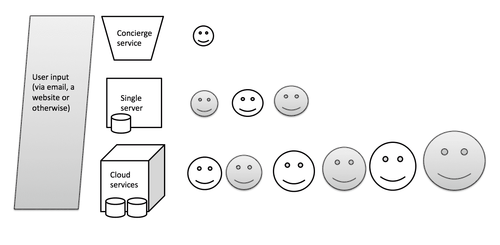
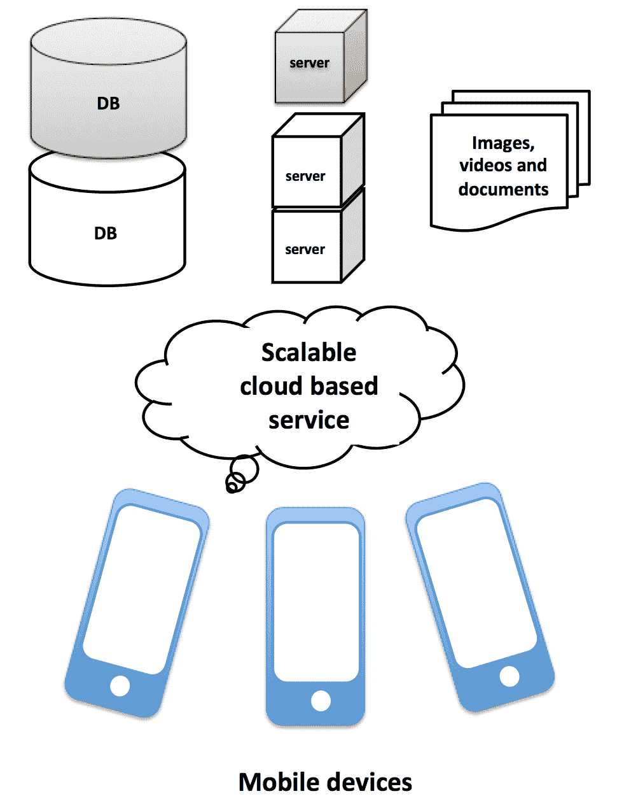
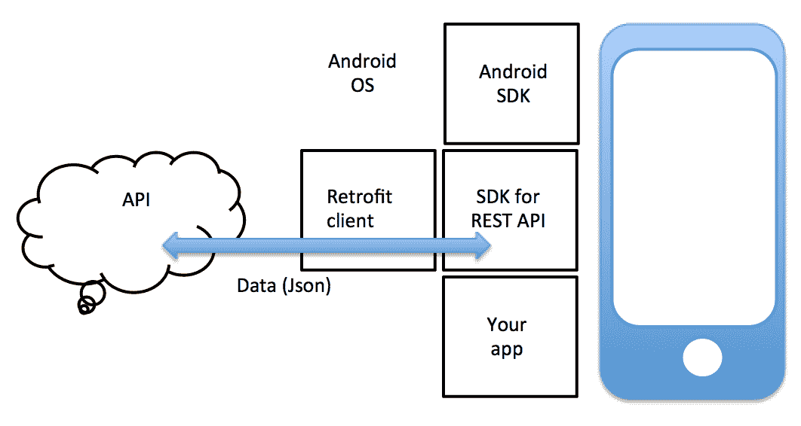
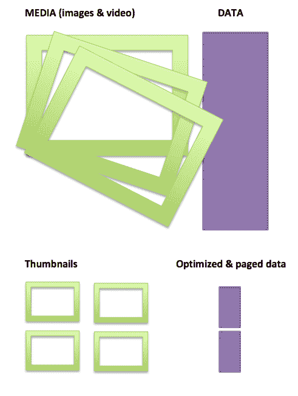
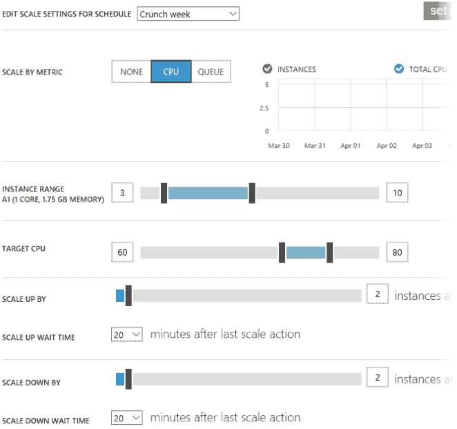
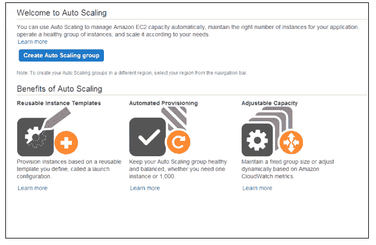

# 扩展策略

在本章中，你将了解什么决定了你的应用程序的可扩展性，以及你需要做什么才能让它良好地扩展。你还将了解何时扩展变得重要，以及哪些因素会影响你的扩展策略。当你刚开始时，规模根本不重要。事实上，我们之前确实告诉过你做一些不可扩展的事情。那么，是什么让我们改变了主意？实际上并没有什么。证明你的假设仍然很重要，而且，直到那件事情完成，让你的应用程序扩展将是浪费时间。然而，重要的是你应该考虑你应用程序的可扩展性，以及如果你的应用程序变得非常流行并开始快速增长，你的策略将是什么。现在，如果你的应用程序后端只能处理一百个同时连接是完全正常的。但你的应用程序后端也需要能够处理数千个甚至更多的同时请求。无法快速扩展会导致停机时间，这会导致用户感到沮丧，进而导致高流失率。人们会离开，而不是稳步增长，你短暂的名声也将消失。这将是更大的浪费。因此，我们需要一个计划，而本章将帮助你定义这个计划。

具体来说，在本章中，我们将涵盖以下主题：

+   了解为什么让你的应用程序能够扩展很重要

+   确定何时以及如何扩展你的应用程序，以及分析如何帮助

+   了解你需要做什么才能拥有一个可扩展的后端

# 让它具有可扩展性，但不要立即扩展

在现实世界中，可扩展性的定义可能因文化而异，但对你来说，重要的是你的应用程序在大多数情况下都是响应的和功能性的。

如果你预见在某个特定时刻有任何问题，那么是时候扩展了；但关键要素是能够快速扩展。确保在势头的时候你能做正确的事情！

因此，你已经开发了一个应用程序，并且它已经在像 Product Hunt 或 Betalist 这样的网站上展示过。你已经有了一些热情的早期用户。作为一个处于早期阶段的初创公司，你不应该过于关心你的应用程序扩展得有多好，但你应该有一个想法，如果你的受众突然比预期的大，你该如何让它扩展。

可扩展性不仅仅是关于你应用程序的后端解决方案。它还涉及到到什么程度可以自动化你的应用程序服务，以及为任何数量的应用程序用户提供服务将有多容易。只有当你的应用程序服务几乎可以 100%自动化时，你才有一个真正可扩展的解决方案。任何需要你个人或其他人的注意的事情都会阻止你的应用程序完全可扩展。你的应用程序需要的支持越多，它的可扩展性就越低。

你应用的扩展性也可能受到应用性质和目标受众的限制。例如，一个游戏应用：Flappy Bird，从定义上讲，可以非常容易地扩展。它没有后端，游戏通过 App Store 或 Play Store 分发。对于像排行榜这样的功能，你可以使用 Google 或 Apple 的服务。你可以相信这些服务是可扩展的。一个社交应用将更难扩展，因为它需要你有一个（复杂的）后端解决方案。尽管它通过商店分发，但你的用户需要能够下载和上传包含文本、图像和视频的数据流。你的服务器应该能够处理这种负载。

所有这些都需要存储在某处，并且需要快速交付。此外，尽管可以大量自动化，但当用户生成的内容出现时，监管变得更加重要。监管需要人工干预，这将对应用的扩展性产生影响。其他应用，如 Uber，会带来其他（非技术性）的挑战。它们需要处理各种法规，这也需要人工交互。任何需要人工交互的事情都可能威胁到你的解决方案的扩展性。一旦你的假设得到证实，你的应用开始增长，那么尽可能自动化你应用中的许多组件就变得非常重要。

如果你需要更多员工，当然可以雇佣更多的人。然而，自动化更好。在本章中，我们将特别关注应用的技術扩展性。当应用的分发由 Play Store 或 App Store 负责时，就不需要制定策略。商店可以像你希望的那样频繁地分发这些应用，而不必担心扩展。嗯，这就是为什么他们要收取 30%（针对付费应用）的原因，对吧？讨论你应用的扩展性是相关的，如果你的应用将使用某种后端。例如，你可能会使用后端来分享故事、图片、视频或其他内容。

假设你已经为你的应用创建了一个初步的 MVP（最小可行产品）。MVP 本身还不是一款应用。它仅仅是为了验证而存在的。想象一下，通过网站或电子邮件，你获得了需要某种处理方式的用户反馈。正如我们在前面的章节中看到的，拥有一个门童服务是完全可行的。你可能需要部分或完全手动处理这个过程。确实，这并不容易扩展，但你为什么要在不知道它是否可行的情况下就自动化这个过程呢？

如果你的 MVP（最小可行产品）按预期工作，它将导致一些满意的客户。你已经验证了你的假设，并可以开始自动化流程。你实际上构建了一个应用并为它创建了后端。你将所有数据（文本、图像和视频）存储在单个服务器上。如果一切顺利，将有更多的满意客户。然后，你的应用被 App Store 收录，或者一个非常有影响力的早期采用者写了一篇关于你的应用的博客，它就火爆了！突然之间，很多人开始使用你的应用，你的服务器（们）冒出了烟。你需要迅速想出解决方案，在事情开始变慢或停止工作之前。你需要防止人们感到失望，否则你的势头就会消失。你可以添加几个额外的服务器并考虑一些智能负载均衡解决方案，但另一方面，如果你从一开始就利用云服务，例如在 Amazon 或 Azure 上运行，你可以省去很多麻烦。

如果你认为它不会那么快，那么考虑这一点：如果你不期望你的应用会突然火爆，那么为什么一开始要构建它呢？即使是宠物项目也可能突然变得非常受欢迎！

# 可扩展的后端

根据你的具体情况，移动后端解决方案可能需要处理以下情况：

+   数据库和数据库层负载均衡

+   网络服务器和负载均衡

+   减少数据传输量（低带宽支持）

+   媒体存储（图像、视频和音频）

+   内容分发（视频流）

云存储空间现在相当实惠，并且，在大多数解决方案中，你只需点击几个按钮就可以扩展（并且花费一点更多的钱）。所以，为什么不从一开始就使用云服务呢？如果你有技能和时间，你可以构建自己的解决方案，并在（可扩展的）云上使用基础设施即服务（IaaS）解决方案，如 AWS 或 Azure 运行。如果你没有技能或时间，你也可以选择使用移动后端即服务（MBaaS）。后者将不太灵活，成本也会更高，但无论你选择哪一个，这两种服务都将很容易实现可扩展性。

# 基于云的存储和处理

在云中运行你的应用后端解决方案并存储你的数据，例如在：

+   亚马逊（例如亚马逊云服务（Amazon Web Services）和亚马逊存储服务（Amazon Storage Service，S3））

+   谷歌（App Engine、云存储、云数据存储和云 SQL）

+   Azure（虚拟服务器、数据库、存储和内容分发）

+   Heroku

大多数这些解决方案至少提供以下组件：

+   虚拟服务器

+   数据库

+   媒体存储（图像和视频）

+   内容分发（视频）

影响选择哪种服务的事项包括价格、特定需求、数据库支持、数据库类型（NoSQL 与 SQL）、以及对你或你的团队来说最方便的编程语言。此外，易用性和推送通知服务的定价也是重要的评估因素。你可以使用的编程语言因云解决方案而异。对于 Java 开发者来说，Google App Engine 是一个更好的选择，而.NET 的信仰者最好在 Azure 云中部署他们的解决方案。

大多数云解决方案提供多种编程环境。如果你想在 Heroku 上使用 Java，或者在 AWS 或 Azure 上使用 Node.js，那么你可以这样做。所有解决方案都支持 Java、PHP、Python 和 Ruby 编程语言。Azure 和 Amazon 都支持.NET，但 Azure 可能在这里是首选。除了 Amazon 之外，所有云解决方案都支持 Go：

如果你倾向于选择现成的后端解决方案，例如 Firebase 和 Parse 服务器，请参阅第八章，*应用实验的云解决方案*。MBaaS 既方便，在某种程度上也具有可扩展性，但便利性是有代价的。你从免费增值计划开始，但当你需要升级到高级计划时，它通常比开发自己的云解决方案更昂贵。另一个陷阱可能是它可能导致比其他情况下更多的供应商锁定。然而，如果你需要额外的数据库或额外的服务器用于存储或处理数据，扩展事物很容易，但这也适用于 IaaS。

# 从客户端视角看

让我们来看一个例子。从客户端的视角（这里是一个 Android 应用）来看，架构图可能看起来如下所示。从某个端点，API 正在被消费。这将导致接收由 Retrofit 客户端（Android 的 HTTP 客户端）处理的数据（在这个例子中）。它以**JavaScript 对象表示法**（**JSON**）格式消费数据，并最终使用 JSON 转换器（如 Gson 库，一个能够对 JSON 数据进行对象映射的库）将数据转换为对象。通常，提供服务的方会提供 SDK，这将使从端点消费数据或向其发送数据更快、更容易。例如，Parser Server SDK 将负责对象映射和与 Parse 服务器的数据同步。正如你所看到的，对于 Android 或 iOS 应用来说，后端的结构和托管位置并不重要。对于客户端来说，重要的是接口，在这个例子中，是一个在请求时提供 JSON 数据的 REST API：

事情并不总是像前面这张图片中那样理想。如果您正在开发一个从原始目的是与网站或其他非移动解决方案一起使用的端点获取数据的移动应用，您可能需要首先创建一个中间件解决方案。移动可扩展性还意味着您需要处理低带宽情况。尽可能限制单次事务中的数据量非常重要。任何不需要立即在您的应用中显示的内容都不应该包含在内。您的应用应下载缩略图而不是下载图片或视频；它应该有一个分页机制（“加载更多”选项），并且数据应针对可能具有低带宽连接的设备进行优化。

以下图片很好地展示了非优化和优化情况之间的差异，适用于移动使用：

与其将整个数据集以大而描述性的名称加载到 JSON 中，您应该只加载尽可能少的数据，并在设备上持久化以用于缓存。即使在低带宽条件下，即使您没有互联网连接，您的应用也将保持响应和可用。为了进一步优化，您的应用应首先检索缩略图。如果用户只看到它的小图片，下载高分辨率图片就没有意义了。此外，您的（中间件）解决方案应允许您的应用分块检索数据。以 Facebook 应用为例。它只加载流的一部分，当您向下滚动时（一些应用在列表底部有“加载更多”按钮），它会加载数据的另一部分。如果您是从零开始构建，并采用移动优先策略，那么这种分页机制是您立即需要的。如果当前的 API 旨在用于非移动用途，您应该考虑首先创建一个中间件解决方案来优化数据流。

一个可扩展性良好的应用会带来改进的用户体验和更好的可靠性，并且将更容易利用特定事件。想想节假日或特定事件，根据应用类型，这些都可能严重影响与您的应用相关的流量量。可扩展的应用后端应该易于扩展，让您在高峰时段/日提供所需的内容。它还应允许您在其他时候缩减规模，以避免在资源未被利用时浪费资源。

# 您应该知道何时需要扩展或缩减

如果你正确地使用分析工具，你将知道何时升级或缩减你的解决方案。季节性和你应用的本质可以帮助你做出一些预测。在一天中的什么时候或哪些特定事件期间，你的应用会被最频繁使用，或者用户使用应用较少的时候？例如，如果你的应用是一个闹钟，人们在假日季节会较少使用它。此外，如果你的应用与奥运会有关，你可以预期在该活动期间会有峰值使用。在假日，人们在 App Store 上通常会花费更多的钱，导致额外的下载和应用使用。最后，活动，尤其是当你以较低的价格提供你的应用时，将对应用的使用率产生重大影响。其他事件则难以预测。如果你的应用被推荐并每天增长 150%，你最好为此做好准备。

用户数量说明了同时使用应用的用户数量。这个数字对于扩展你的应用后端来说才是真正重要的。你可以有上千万的用户定期使用你的应用，或者有上千万的用户每天使用你的应用。这两种情况是截然不同的。指标可以告诉你特定时间段内用户在应用中平均花费的时间。如果你的应用是国际化的，那么按时区进行细分就很重要了。用户可能会整天使用你的应用，但（也许）在睡觉时不会使用。

无论如何，重要的是要认识到，如果你的应用目前还没有实现扩展或者只支持少量（并发）用户，只要它相对容易扩展，这是完全可以接受的。不要因为你的应用需要可扩展性而进行扩展。你需要准备好在必要时做正确的事情，但也不要在这方面投入过多的精力。完美主义已经扼杀了众多伟大的项目。不要让这种情况发生在你身上。

# 一个关于应用后端没有实现扩展的真实恐怖故事

即使有缓存并尽量减少数据消耗，低带宽也可能导致用户体验不佳，但有些事情是你无法控制的。另一方面，一个完全过载的后端是你可以控制到一定程度的。你的用户会评判整个应用体验。这就是为什么整个架构都很重要的原因。

这里有一个例子来说明这一点。不久前，我正在为一个知名的国际化电视节目开发 Android SecondScreen 应用。一份**保密协议**（**NDA**）阻止我告诉你具体是哪个节目，但这对于故事本身并不重要。无论如何，节目在电视上播出。在家观看节目的观众能够为出现在节目中的各种候选人投票。因此，很容易预测，在节目播出时会有大量流量。所以，当询问开发应用后端的第三方关于他们解决方案的可扩展性时，他们告诉我，他们可以保证至少有 100K 用户可以在观看节目时使用该应用。我没有要求他们是否在他们那里进行了适当的负载测试，这是我的天真。我只是假设他们是一家专业公司。不幸的是，他们并不那么专业。

当节目的新季开始，人们开始首次使用该应用时，在第一次直播期间出现了严重的问题。前 30 分钟一切顺利，大约有 40K 用户在积极投票使用应用。然后，应用在大多数情况下停止工作，投票变得非常困难。原因是后端无法处理大量流量负载。尽管不是前端（应用）而是后端的问题，但从用户的角度来看，是应用本身出了问题。糟糕的性能产生了大量负面评论。尽管下一场直播进行得很顺利，但很难从负面评论中恢复过来。损害已经造成。

# 后知后觉的船长来帮忙了！

这里是对这个问题的回顾。如果我们有一个证明所承诺内容的适当负载测试，那么这种情况可能可以避免。此外，如果我们能够快速扩展，我们就可以避免很多麻烦。

除非你有一个真正能工作的水晶球，否则预测未来相当困难。据我所知，没有这样的水晶球。因此，始终确保你能快速应对新情况。

你需要为那些你或多或少能预见的情况做好准备。自己去弄清楚，做一些重负载测试。在用户为你做之前，先破坏一些东西。如果你注意到任何问题，那么你需要找到瓶颈，并看看最好的解决方案是什么。

# 是要扩展规模还是要重构？这是一个问题。

只要知道，扩展规模并不总是正确的答案。如果你的架构不好，你可以添加另一个数据库或服务器，但这只是短期修补，你会浪费硬件资源（和金钱）。如果更好的架构不进行扩展就能带来更好的性能，那么这就是你应该做的。此外，你仍然需要确保你能快速扩展。

将应用程序保持尽可能瘦是一个常见的做法（尽管有一些例外）。让服务器去做所有重活，而不是一个小设备，否则可能会导致电池耗尽和 CPU 使用过重。从这个角度来看，可扩展性通常只适用于后端。

随着您的应用程序用户基础从 10 个用户增长到 100 人，到 1 万，10 万，或 100 万，可扩展性变得越来越重要。以下是一些最佳实践：

+   尽可能保持应用程序尽可能瘦

+   保持简单，不要立即扩展，但要使其可扩展

+   使用云存储和部署

+   考虑首先构建接口（API）

+   通过分析获得深刻的见解非常重要

+   跟随市场，仔细计划您的活动

+   尽可能降低数据流量，并不要传输将不会被利用的数据

+   在可能的情况下使用自动扩展选项

影响您解决方案可扩展性的因素包括以下内容：

+   数据库

+   存储

+   流量平均大小

+   服务器所在区域以及（大多数）用户居住的地方

+   在使用 MBaaS、自行托管解决方案和基于云的解决方案（如 App Engine、Azure 或 Amazon）之间进行选择

# 自动扩展

如果您选择使用 Azure 作为移动应用程序的后端，您可以使用 Azure 的移动服务。它为您提供了大部分基础设施，包括处理、存储和扩展选项。您可以选择定价层，如免费、基本之一或高级计划之一。以下是从 Microsoft 文档中提供的如何在工作在 Azure 中扩展的示例图片。图片是从经典环境拍摄的，它在“新”门户中看起来略有不同；然而，这里展示的方式更清晰：

包括之前提到的服务在内的大多数 Azure 服务都带有自动扩展功能。该解决方案将根据流量或遵循计划自动扩展或缩减。例如，考虑白天和夜晚的日程安排，周末与工作日的日程安排，或者您在运行活动时的特定时间段。这取决于您的应用程序如何使用，什么最适合您。如果您没有头绪，您可以通过关注统计数据来了解最佳方法。

在亚马逊上，您有更多或更少的自动扩展选项，AWS Mobile Services 可以帮助您更快地构建应用程序。它包括推送通知、用户分析、数据存储和同步选项。它可以在高峰时段（或日子）自动增加实例数量，并在需要较少容量时减少它们，从而通过降低成本来为您节省金钱：

Amazon Cloud Watch 启用自动扩展，这是一项用于 AWS 云资源和应用程序的监控服务。您可以在[`aws.amazon.com/autoscaling/`](https://aws.amazon.com/autoscaling/)上了解更多信息。

关于这个主题有一些非常好的书籍，它们可以为你提供关于这里任何 IaaS 的更深入知识。我建议你稍后查看它们。在本章中，我们只是看了看你的选项以及它们如何影响你的策略。

另一篇有趣的阅读材料是：[`highscalability.com/blog/2016/1/11/a-beginners-guide-to-scaling-to-11-million-users-on-amazons.html`](http://highscalability.com/blog/2016/1/11/a-beginners-guide-to-scaling-to-11-million-users-on-amazons.html)。

扩展 MBaaS（如 Firebase）基本上就是选择另一个价格计划。与 Azure、Amazon 和 App Engine 不同，它没有自动扩展选项，并且通常来说，它不太适合支持大量用户。然而，这不应该阻止你使用 Firebase，例如，因为它是一个很好的入门解决方案，更重要的是，它允许你快速验证。此外，如果你以后想从 MBaaS 迁移到 IaaS，你可以使用之前节省的时间。

# 摘要

在本章中，你了解到了你的应用的扩展策略以及这种策略如何特别适用于你的应用后端。良好的架构和可扩展性，而不是规模本身，是这里的关键要素。

根据定义，将数据存储和处理服务放在云中通常非常可扩展，但具体取决于你的选择，也可能非常昂贵。如果你想使用原本不是为在移动设备上消费而设计的 API 中的数据，你可能需要首先创建一个中间件解决方案。这样你可以确保即使在低带宽条件下，你的应用也能良好运行。最小化数据量和分页可以帮助提高你的应用性能。

云服务提供了便利，但代价也不小。一旦你的应用开始盈利，这不应该成为问题。有许多盈利方式，我们将在下一章中探讨。你需要创建一个付费应用，还是应用内购买能带来更多收入？让我们来看看！
