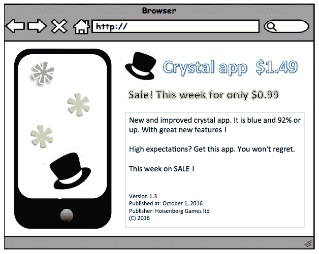

# 第十七章：盈利和定价策略

在本章中，我们将探讨如何从我们的应用中获得收入。这显然是商业模式画布中最重要的一部分，也是最激动人心的部分。为移动应用赚钱并不容易。尽管如此，人们往往不太愿意在移动设备和应用上花钱，尽管游戏可能是一个例外。幸运的是，有许多其他可能性来构建有利可图的移动应用业务，我们将看到实现这一目标有哪些方法。

我们将探讨多种使你的应用盈利的方式。此外，我们还将检查如果你想要出售你的应用，或者如果你想要在应用内出售产品（也称为应用内购买），一个智能的定价策略会是什么样子。

总结来说，在本章中，我们将涵盖以下主题：

+   查看你可以应用到你的应用中的盈利策略

+   学习定价策略

+   在 App Store 或 Play Store 中找出如何应用定价策略到你的应用列表

+   查看如何在应用内实现购买

# 盈利策略

你可以使用一些策略来赚钱。你可以出售你的应用，展示广告，使用应用内订阅，或者将用户数据出售给第三方。它们都可能有些棘手，但赚钱始终是一个挑战，你需要找出对你应用来说什么最有效。不要（过于）贪婪。人们已经习惯了似乎一切都可以免费的世界。特别是，如果你计划出售用户数据，你需要有一个良好的计划。

应用盈利的一些策略如下：

+   在 App Store 或 Play Store 中销售你的应用

+   提供一个轻量级和免费的应用版本，并销售你的高级应用

+   在你的应用中展示广告

+   提供一个应用内购买产品以去除广告

+   建立一个免费的应用并提供网页上的高级功能

+   在现实世界中销售产品或服务

+   使你的（用户）数据盈利

+   通过推广你的其他产品或服务之一来利用你的应用创造价值

# 销售或升级你的应用

在 App Store 或 Play Store 中销售你的应用。这是使你的应用盈利的最明显方式。只有当人们非常了解你的应用的存在和良好声誉，或者当你的应用提供的附加价值非常明显时，这种方法才会有效。在 App Store 的早期，这个问题通过发布两个应用来解决：一个轻量级、免费的版本和一个收费的高级版本。今天，通过使用应用内购买（苹果的术语）来应用*免费增值模式*已经变得更加普遍。谷歌使用“应用内计费”这个术语来指代 Android 设备。虽然术语不同，但理念是相同的。用户可以免费下载应用，但需要付费来解锁特定的付费内容或功能。由于这种模式的成瘾性，它非常适合游戏，尽管它也可以应用于更严肃的应用。这是推广你的应用和升级高级功能的一个很好的方式。

一旦用户对你的应用产生依赖并决定继续使用，他们可以通过购买来享受其高级功能。你必须记住，只有少数用户会转化为付费客户。平均来说，从免费增值用户到高级用户的转化率最多为 1%到 5%。这不应该成为问题。一些应用的支出通常接近零（游戏），但对于需要托管后端的应用以及需要存储大量文件（视频）的应用来说，这很重要。例如，考虑一个社交应用，每个用户都可以上传或流式传输视频。

通常，云存储的成本并不昂贵，但显然很多用户将需要大量的存储空间。简而言之，如果你的 1%到 5%的用户能够覆盖 100%（高级和免费增值）用户的费用，那么你就安全了：


# 在现实世界中销售产品或服务

在商店销售你的应用很方便，因为整个付款过程将由苹果或谷歌为你处理。然而，这是一个相当昂贵的过程。他们将为此向你收取 30%的费用。所以，如果你以一美元的价格销售你的应用，你将得到 70 美分，对吗？实际上情况更糟。根据国家/地区，增值税（VAT）和个人所得税将使你的实际收入更低。所以，在 21%的增值税和 30%的个人所得税率下，情况可能如下所示：


除非你搬到像迪拜这样的城市，否则支付税收不是可以完全避免的事情，但你所能做的就是避免 30%的店铺费用。这可能（可能）只在你不销售任何数字产品（内容、功能、游戏关卡或库存）的情况下有效。你需要销售实物产品或现实生活中的服务。

例如，考虑一个停车应用。该应用消除了获取停车票并在时间到期前返回的麻烦，等等。作为这项服务的交换，你每次使用该应用停车时都需要支付额外的费用（荷兰这里为 25 欧分；Parkmobile 应用，2016 年）。所有付款都通过信用卡安排，苹果或谷歌与此无关。

# 免费提供你的应用并销售你的服务

如果你认为你的应用只是你服务利用的许多渠道之一，那么免费提供你的应用并对你提供的服务收费（例如，在你的网站上）是个好主意。这将有两个好处。首先，它将以积极的方式影响用户的定价感知（因为用户会在网站上而不是在应用上花钱）。其次，你不需要支付 30%给苹果或谷歌。当然，这意味着你需要自己处理付款，或者找到一个**支付服务提供商（PSP**）来为你做这件事。然而，这无疑会提高你的收入，这当然是好事。

如果你的应用是一个使用后端并且适合与 SaaS（如 CMS）一起使用的应用，你可以在网站上提供你应用的付费功能（更大的屏幕，更多的带宽）。让他们免费使用你的应用，但为访问网站收费：


# 广告

展示广告是应用盈利最知名的方式。广告对用户来说很烦人，但当你应用免费时，它们是获取收入所必需的。如果用户基数足够大，从应用内广告中赚钱才有意义。据说这是 Flappy Bird 唯一的创收方式，而且显然效果很好。开发者每天从中赚取了 5 万美元。这是一种经常与应用内购买相结合的商业模式。用户可以通过支付小额费用来移除广告。这可能是一次性费用，也可能是每月或每年的订阅。

好的，所以你想要在你的应用中添加一些广告。对于 iOS 和 Android，你可以从多个移动广告网络中选择，每个网络都为你使用的平台提供 SDK。网络将提供广告。你所需做的只是添加 SDK 和几行代码。

网络可能提供多种广告格式和营销类型。最常见的一些列在这里：

移动广告格式：

+   **横幅广告**（出现在屏幕底部或顶部）

+   **插页式广告**（全屏）

+   **原生**（与应用内容无缝集成）

营销类型：

+   **每次行动/获取成本**（**CPA**）：广告商为特定的行动（联系、注册、提交）付费

+   **每次点击成本**（**CPC**）：广告商为每次点击广告付费

+   **每次展示成本**（**CPI**）：广告商为每次展示付费

+   **每千次展示成本**（**CPM**）：广告商为每 1000 次（估计）展示付费：


一些流行的移动广告网络如下：

+   AdMob（被谷歌收购）

+   Inmobi

+   TapJoy

+   Flurry

+   Kiip

+   MoPub

+   RevPub

+   Smaato

还有许多其他格式！在应用中何时以及如何展示广告要小心。例如，使用原生 Facebook 广告的插页式广告，几乎覆盖整个屏幕，是用户最讨厌的广告形式。对于你的用户来说，最好的展示广告方式可能是屏幕底部的横幅广告。然而，这不一定是你最好的位置。也许全屏广告的转化率会更好。这取决于你应用的本质，也可能从 Android 到 iOS 有所不同。也许你可以进行 A/B 测试，找出最适合你情况的方法。

如果你想要提供一个选项来移除广告，你应该考虑在广告附近放置一个带有明确行动号召的按钮。在你的底部广告横幅上方放置一个“移除广告”按钮怎么样？这样，你通过广告创造收入，并通过人们愿意付费来移除它们创造收入，比如说，0.99 美元：


# 数据货币化

如果你拥有大量用户，你可以考虑将数据出售给第三方作为一种从你的应用中赚钱的方式。你必须小心这种策略，因为你的用户可能不会喜欢这个选项。始终确保你出售的数据是匿名的，并且再次尝试不要过于贪婪。不要出售用户数据以便以后发送垃圾邮件。

如果你有一个大型用户基础，其中每个用户都有一个丰富的个人资料，那么你可以从这些个人资料中创建细分市场。在第十一章“入职和注册”中，我们回顾了持续入职的过程。建立一个大型用户基础与丰富的用户个人资料相结合，即使你目前没有向第三方出售数据，也会增加你公司和你的应用的价值；它为你提供了将来出售数据的选项。你对用户了解得越多，他们就越有价值。例如，你可以创建一个数据集，包含经常在特定区域特定日期旅行的中年家庭主妇，或者你可以创建一个喜欢听重金属音乐的年轻人的数据集。所有你可以想到的细分市场都可能是有趣的，只要它们产生足够大的数据集。

如果你正在考虑并购策略，那么大量用户可能比应用盈利性更重要。此外，如果你的应用有助于推广或销售其他产品或服务，无论是数字的还是物理的，它都在提供价值。收入将来自产品和服务销售。你的应用，再次，只是支持你的销售策略的一个渠道。

# 定价策略

让我们假设你想要出售你的应用，或者你想要添加应用内购买。你的策略会是什么样子？你将在什么时候开始收费？从一开始就允许用户下载应用？或者你会提供一个试用期，让用户首先评估你的应用？或者它将是一个具有高级功能的应用，这些功能可以通过应用内购买来解锁？这些问题的答案将取决于你的应用性质、用户所在的地区以及设备操作系统的性质。

# 价格感知

价格感知是这里的一个重要元素。每个人都知道 99 美分的心理效应。我们知道 0.99 美元只比 1 美元少一美分。然而，它看起来更便宜。应用和游戏也应用了一些基于定价心理学的有趣技巧。其中之一是价格点效应；给定三个产品，包括一个提供最小价值的价格低廉的产品和一个价格荒谬高昂的产品，使得中间价格的产品看起来是最好的交易，即使它的价格高于用户最初打算花费的金额。我们稍后会看到这个的例子。

对于游戏，有趣的可售物品包括额外的生命、金币或关卡。以下是一个 8 球桌球游戏应用可用的产品示例，将价格点理论发挥到极致，您想要一叠、一堆、钱包、藏匿处、一堆还是金币保险库：


对于出售金币的游戏，这种策略效果相当好。在游戏的开始阶段，当玩家还在探索事物并且还没有上瘾的时候（记得 Candy Crush 吗？），有大量的金币或信用点可以花费。通常，玩家可以在游戏中解锁/获得新的信用点；但往往，虚拟宝库的底部被过早地看到。如果是这样的话，对于不耐烦的玩家，有虚拟金币可以救命。通常，只有 1%到 3%的玩家会真正进行购买。这仍然足以使游戏非常有利可图。

对于不是游戏的 App，考虑哪些功能应该是付费的而不是免费的重要。您需要确定在用户的认知中，哪些功能提供了额外的价值。如果不是去除广告的话，那么您的应用应该提供哪些付费功能，哪些功能仍然需要免费提供？您可以进行一些实验来找到这个问题的答案：用户愿意为哪些付费功能付费？

虽然这不是专门针对移动应用的，但有一本关于定价的有趣电子书可以阅读，书名为*Don't Just Roll the Dice*。为了理解产品定价，这本书帮助您了解一些（但不是太多）经济学。您可以在[download.red-gate.com/ebooks/DJRTD_eBook.pdf](http://download.red-gate.com/ebooks/DJRTD_eBook.pdf)找到示例和免费 PDF 下载。或者，您也可以在 Google 上搜索它。

您还可以查看这个 SlideShare：

[`www.slideshare.net/omohout/lean-pricing-startups`](http://www.slideshare.net/omohout/lean-pricing-startups)

# 首先开发 Android 还是 iOS？

作为一家初创公司，您需要决定首先在哪个平台上进行开发。如果您希望尽可能多地触达受众，那么 Android 可能是您的首选，除非您知道目标受众中 iOS 用户的比例更高。然而，如果您认为通过销售应用或应用内产品进行货币化是最重要的事情，那么 iOS 可能是一个更好的首选。原因在于 iOS 用户比 Android 用户更愿意为应用付费。另一方面，对于后者来说，展示广告似乎效果更好。平均而言，**点击率**（CTR）在 Android 平台上更好。

# 应用内购买产品类型

对于 iOS，应用内购买产品有四种类型。iOS 应用内购买产品类型包括：

+   可消耗

+   不可消耗

+   非可再生订阅

+   自动续订订阅：


可消耗产品在过程中被消耗；例如，游戏中额外的生命。不可消耗产品可以一次性购买，并永久解锁功能。订阅可以解锁特定时间内的功能或功能；例如，访问特定（高级）内容。还有两种可用的订阅类型：非可再生订阅和自动续订订阅。

您可以在 iTunes Connect 中设置每种类型的产品。对于每种产品，您可以选择产品 ID、参考名称（用于内部参考）、显示名称、描述名称和价格层级。您还可以在特定价格点销售您的应用或产品。第一层级指的是 0.99 美元的价格；例如，稍后展示的样子。这些都是 Empurror 应用的产品，我们将稍后在本章中对其进行更详细的探讨。

更多信息，请参阅[`developer.apple.com/in-app-purchase/`](https://developer.apple.com/in-app-purchase/)。

# 应用内计费

Android 的应用内计费产品也可以是可消耗的、不可消耗的或订阅类型。从高层次来看，没有太大差异。

您只能在通过 Google Play 发布的应用中实现应用内计费。您可以为您的应用内计费指定两种产品类型：管理型应用内产品，和订阅。Google Play 会根据每个用户对您的应用中的应用内产品和订阅进行管理和跟踪。

如果您正在使用应用内计费 API，您也可以在您的应用中消耗管理项目。您通常会实现可购买多次的项目（如游戏货币、燃料或魔法咒语）的消耗。一旦购买，管理项目在您消耗该项目之前不能再次购买。

订阅是在应用内购买中提供的一种产品类型，允许您在您的应用内部向用户销售内容、服务或功能，并采用每月或年度的定期收费。您几乎可以销售任何类型的数字内容，无论是哪种应用或游戏。

要启动购买，您的应用程序会发送一个针对特定应用内产品的计费请求。Google Play 随后处理交易的所有结账细节，包括请求和验证支付方式以及处理财务交易。

当结账过程完成后，Google Play 会将购买详情发送给您的应用程序，例如订单号、订单日期和时间以及支付的金额。在任何时候，您的应用程序都不需要处理任何财务交易；这个角色属于 Google Play。

更多信息，请参阅[`developer.android.com/google/play/billing/billing_overview.html`](https://developer.android.com/google/play/billing/index.html)。

# 看看应用内购买是如何实现的

由于应用内购买（iOS）通常比应用内购买（Android）的转化率更高，我们将重点查看应用内购买，特别是使用 Empurror 应用案例。

# Empurror 案例

Empurror 是我之前开发的一个 iOS 小 SpriteKit 游戏。这是一款关于一只猫（Empurror）和许多小猫从屋顶跳下的非常简单的游戏。在这款游戏中，我们的英雄（玩家）需要捕捉它们所有，才能成功：


这款游戏包含三项应用内购买，都是捐赠，除了展示 Empurror 表示感谢的画面外，没有为游戏添加任何特殊功能。哦，对了，你还可以摸摸它的肚子，让它发出咕噜咕噜的声音。

无论如何，应用内购买视图如下。游戏提供三种产品：慷慨的捐赠（猫粮）、大量的捐赠（一条好看的鱼）和惊人的捐赠（一只巨大的火鸡）。我们添加了这三种类型的捐赠来进行一些定价实验。

第一个重点是中间的那个，大量的捐赠。我们试图让它看起来是最好的交易。如果你喜欢这款游戏，就给那只猫一条鱼吧！惊人的捐赠看起来，嗯，有点太惊人了，显然定价过高。只付 99 美分？你的名字不是斯克鲁奇，对吧？那么，就选择“大量捐赠”吧。

这基本上就是我们在这里试图做的事情。当然，这种定价策略最适合真实的数字激励措施，但你应该明白了：


如果我们开发了一个提供应用内购买的应用，那么我们的移除产品可以遵循相同的策略：中间一个公平的交易，左边一个较小的，右边一个昂贵的，只是为了让中间的那个看起来很棒：

+   移除广告 1 周，费用为 0.99 美元

+   移除广告 1 个月，费用为 1.99 美元

+   移除广告 1 年，费用为 19.99 美元

如果您至少使用该应用程序一年，最好的节省方式将是第三个选项。然而，当选项以我们这样做的方式呈现时，大多数人会被鼓励选择中间选项。这对大多数应用程序都适用，但没有理由不对此策略进行反馈。衡量并找出哪种产品导致最佳的转换。有一些分析工具可以帮助您做到这一点。参见第十三章，*Play Store 和 App Store Hacks*，以及第十四章，*A/B Testing Your App*，获取更多信息。

现在，查看代码以了解实现此支付模型需要做什么。以下代码是为 iOS Objective-C 编写的，但如果您想的话，将其转换为 Swift（4）并不困难。对于 Android，事情略有不同，但所有情况下主要思想都是相同的。

您将在 iTunes Connect（或 Google Developer Console）为您的应用程序定义一系列产品，当用户导航到您的内购视图时需要下载这些产品。注意这里对 StoreKit 和 SKProductsRequestDelegate 的导入：

```java
@interface PurchaseViewController : UIViewController <SKProductsRequestDelegate, SKPaymentTransactionObserver> 
... 
#import "PurchaseViewController.h" 
#import <StoreKit/StoreKit.h> 
... 

/* 
 4 In-App Purchases 
*/ 
#define kProductTipGenerous @"EMP_TIP_JAR_GENEROUS" 
#define kProductTipMassive @"EMP_TIP_JAR_MASSIVE" 
#define kProductTipAmazing @"EMP_TIP_JAR_AMAZING" 
@implementation PurchaseViewController 
... 
```

当视图出现时，我们添加一个事件来衡量转换（我们在这里使用 Flurry），并从商店加载产品，即如果我们被允许这样做的话：

```java
@synthesize scene; 

- (void)viewDidLoad { 
    [super viewDidLoad]; 

    [Flurry logEvent:analyticsPurchaseViewShown];  
... 
    [self loadProductsFromStore]; 
} 

-(void)loadProductsFromStore{  
    if([SKPaymentQueue canMakePayments]){ 
        NSLog(@"User can make payments");  
SKProductsRequest *productsRequest = [[SKProductsRequest alloc] initWithProductIdentifiers:[NSSet setWithObjects: 
kProductColorfulWorld,      
      kProductTipGenerous,  
      kProductTipMassive,  
      ProductTipAmazing, nil]]; 

        productsRequest.delegate = self; 
        [productsRequest start]; 
    } 
    else {  
        NSLog( @"User cannot make payments,  
                 perhaps due to parental controls"); 
    } 
} 
```

一旦我们收到响应，我们就可以向用户展示它们，或者，正如这里的情况，启用相应的按钮，允许用户进行购买。对于每个产品，将返回一个产品标识符、一个名称和一个价格：

```java
- (void)productsRequest:(SKProductsRequest *)request didReceiveResponse:(SKProductsResponse *)response{     
    if (self.view == nil){ 
        return; 
    } 

    SKProduct *validProduct = nil; 
    int count = (int)[response.products count];  
    products = response.products;  
    if(count > 0){  
        validProduct = [response.products objectAtIndex:0]; 
        NSLog(@"Products Available!"); 
        ...  
        for (SKProduct* product in products){ 
            [self enableProductPurchaseOption:product]; 
        } 
    } 
    else if(!validProduct){ 
        NSLog(@"No products available"); 
    } 
} 

-(void)enableProductPurchaseOption:(SKProduct*)product{ 

 if ([product.productIdentifier    
       isEqualToString:kProductTipGenerous]){ 
        [nameGenerous setEnabled:YES]; 
        [priceGenerous setEnabled:YES]; 
       [nameGenerous setTitle: @"Generous donation"  
      forState:UIControlStateNormal]; 
      [priceGenerous setTitle: product.price.stringValue                            forState:(UIControlStateNormal)]; 
      } 
 ...     
if ([product.productIdentifier isEqualToString:kProductTipAmazing]){ 
        [nameAmazing setEnabled:YES]; 
        [priceAmazing setEnabled:YES]; 
        [nameAmazing setTitle: @"Amazing donation"  
          forState:UIControlStateNormal]; 
        [priceAmazing setTitle: product.price.stringValue      
          forState:(UIControlStateNormal)]; 
      } 
    }  
```

如果用户点击了任何一个按钮（大量捐赠！），购买交易将被启动。有几个交易状态会生成回调。

如果支付成功（`SKPaymentTransactionStatePurchased`），我们需要通过调用`EnablePurchaseProduct`方法让应用程序知道要对其做出反应。如果支付失败（`SKPaymentTransactionStateFailed`），或者发生了其他事件，如果需要，我们也可以对其做出反应：

```java
-(void)purchase:(SKProduct *)product{ 

    if (products==nil || products.count==0){ 
        return; 
    } 
    SKPayment *payment = [SKPayment paymentWithProduct:product]; 
    [[SKPaymentQueue defaultQueue] addTransactionObserver:self]; 
    [[SKPaymentQueue defaultQueue] addPayment:payment]; 
} 

- (void)paymentQueue:(SKPaymentQueue *)queue updatedTransactions:(NSArray *)transactions{ 

    for(SKPaymentTransaction *transaction in transactions){ 

        switch(transaction.transactionState){ 
            case SKPaymentTransactionStatePurchasing: 
                NSLog(@"Transaction state -> Purchasing"); 
                //called when the user is in the process of  
          purchasing. 
                break; 

            case SKPaymentTransactionStatePurchased: 
                //this is called when the user has successfully  
          purchased the package  
                [self enablePurchaseProduct:  
         transaction.payment.productIdentifier]; 

                [[SKPaymentQueue defaultQueue]  
         finishTransaction:transaction]; 
                NSLog(@"Transaction state -> Purchased");  
                break; 

            case SKPaymentTransactionStateRestored:  
                NSLog(@"Transaction state -> Restored"); 
                [self enablePurchaseProduct:  
         transaction.payment.productIdentifier]; 
                [[SKPaymentQueue defaultQueue]  
         finishTransaction:transaction];  
                break; 

            case SKPaymentTransactionStateFailed:  
                if(transaction.error.code ==  
           SKErrorPaymentCancelled){ 
                    NSLog(@"Transaction state -> Cancelled");  
                } 
                [[SKPaymentQueue defaultQueue]  
          finishTransaction:transaction];  
                break; 
            default: 
                break; 
        } 
    } 
} 
```

如果用户之前购买过非消耗性或仍然有效的商品（比如订阅），则需要提供恢复选项。想象一下用户获得了一台新设备，或者重新安装了应用程序。根据苹果的指导方针（谷歌也有类似的规定），应用程序需要能够恢复之前的购买，如果没有这样的选项，可能不会接受您的应用程序。

应用程序调用`restore`方法（因为用户点击了恢复按钮，或者类似的操作），这会触发`restoreCompletedTransactions`方法：

```java
- (void)restore{ 
    [[SKPaymentQueue defaultQueue] restoreCompletedTransactions]; 
} 
```

这就是`SKPaymentTransactionStateRestored`状态来源的地方。应用程序应该对此做出反应，就像购买成功时的情况一样。除此之外，您还可以向用户提供一些额外的反馈，告知他们高级功能或其他购买已被恢复。

最后，交易完成，`paymentQueueRestoreCompleted`和`TransactionsFinished`方法被触发。这个方法可能更适合响应恢复或成功状态：

```java
- (void) paymentQueueRestoreCompletedTransactionsFinished: (SKPaymentQueue *)queue 
{ 
    NSLog(@"received restored transactions: %lu", (unsigned  
     long)queue.transactions.count); 

    for(SKPaymentTransaction *transaction in queue.transactions){ 
        if(transaction.transactionState ==  
         SKPaymentTransactionStateRestored){  
            //called when the user successfully restores a purchase 
            NSLog(@"Transaction state -> Restored"); 
            [self enablePurchaseProduct:  
             transaction.payment.productIdentifier]; 
            [[SKPaymentQueue defaultQueue]   
             finishTransaction:transaction]; 
            break; 
        } 
... 
    }    
} 
```

# 将定价策略应用于你的商店列表

虽然应用内购买的平均转换率更高，但你也可以立即为你的应用收费。如果你在 App Store 中销售你的应用，那么最重要的问题是选择哪个价格层。你可以尝试了解 App Store 中类似应用的收费情况。例如，检查 App Annie，看看其他应用的表现。使用你的浏览器访问[`www.appannie.com/apps/ios/top`](https://www.appannie.com/apps/ios/top)以获取更多信息。一次性收费对于很多人都知道的应用、有良好声誉的应用以及提供内容完全清晰的应用来说效果很好。通常，竞争对手会提供免费的应用，所以你的应用提供的附加价值必须对用户明显。

如果你的应用与知名品牌相关，或者你正在细分市场中运营，那么在用户下载应用之前收费也可能有效。否则，你应该认真考虑免费增值模式，并通过应用内购买来赚钱。

这里是 App Annie（美国市场，2016 年第三季度）显示的顶级付费 iOS 应用的例子。在商店中有许多 Minecraft 克隆应用并不奇怪。Minecraft Pocket 版已经以几乎每份$7 的价格售出了 100 万份！


当然，找到你应用的正确价格点的最佳方式是进行一些测试。从高价开始，如果需要，稍后降低价格：



如果你想要测试较低的价格点是否会增加购买数量，以及你想要测试在什么价格点你的应用收入是最优的，你应该考虑为有限期限提供特别折扣。如果你已经找到了这个价格点，你可以将其永久应用于你的应用。在这里，销售数量并不是最重要的因素。相反，找到能带来最大收入的价格点。例如，假设你为你的应用收费$3.99，你每月可以卖出 10 份。如果你将价格降低一美元到$2.99，你可以卖出三倍的数量。如果你以最低价格$0.99 出售你的应用会发生什么？哇，你卖出了 60 份而不是 10 份：


但当你计算你的收入时，你会发现$2.99 的价格点是你应该选择的：

10 x $3.99 = $39.90

30 x $2.99 = $87.70

60 x $0.99 = $59.40

# 摘要

在本章中，我们看到了多种使你的应用盈利的方法。拥有大量用户是好的，但拥有大量客户更受欢迎。毕竟，你是在经营一个业务，对吧？

我们看到了销售你的应用和免费增值模式之间的区别，在免费增值模式中，你提供免费的应用，并通过销售高级功能来赚钱。如果你这样做，你的应用在一段时间后对用户来说将更有价值。正因为如此，一小部分用户将转化为付费客户。你的应用可能通过应用内购买策略会更有利可图。

我们研究了定价策略，并看到了如何在 iOS 应用中实现应用内购买的示例。你需要测试哪种策略最适合你的应用。你可以运行一些 A/B 测试，并必须倾听从用户那里得到的反馈。你需要找出根据用户反馈，你应用的哪些高级元素是受欢迎的。你可以查看你应用的评论，并在必要时回复他们的评论。

当你查看应用商店（或 Play Store）中的评论时，特别是负面的评论很有趣。不要因为人们对你的应用所写的内容而感到冒犯。显然，他们认为给你这样的反馈是值得的。如果你回应，不仅是对他们评论的评论，而且通过发布一个新版本来解决他们遇到的问题，你就可以将一个愤怒的用户转变为一个快乐的用户！

你需要通过尽早和频繁发布来缩小反馈循环。你需要的是持续交付策略，这正是你将在下一章中读到的！
