# 第十八章：持续部署

在本章中，我们将了解如何组织一个工作流程，在这个工作流程中，我们将自动化测试和交付您的应用的过程。您可以为应用的临时发布和公共发布都这样做。为了使构建-度量-反馈循环真正为您所用，您需要尽早且频繁地发布。

您可以在构建服务器或另一台专用机器上安装 Jenkins 或 TeamCity，以便在每次新功能可用时构建您的新应用。基本上，就是这样，但还有许多有趣的策略可以考虑。例如，您的分支策略（Git 工作流程）是什么？您想在构建服务器上运行单元测试或 UI 测试吗？您如何支持应用的变体（Android）或目标（iOS）？让我们在本章中找出答案。

我们将探讨各种工具，这些工具可以帮助我们进行应用的临时分发。其中一些工具还可以帮助您将应用部署到 Play Store 或 App Store。

具体来说，在本章中，我们将涵盖以下主题：

+   学习自动化工作流程的好处

+   了解持续集成、持续交付和持续部署的内容

+   了解一个好的分支策略如何帮助您完成任务

+   了解**TeamCity**和**Jenkins**

+   查看构建变体或构建目标以支持应用的不同版本

+   检查**Gradle**如何帮助我们创建不同的构建风味和类型

+   了解如何使用**Fastlane**、**Fabric**或**HockeyApp**分发应用

# 持续部署 = 持续集成和持续交付

为什么持续集成和持续交付最初很重要？对这个问题的答案有很多。其中之一是您需要尽早获得反馈。由于您还希望确保一定的质量水平，这里可能会有一些摩擦。分发和测试您的应用将花费大量时间，然而，您也需要尽早且频繁地发布。

构建服务器可以帮助您实现这一目标，因为构建服务器可以验证您的代码是否编译成功，以及测试是否仍然通过。此外，它可以将应用分发给测试者或 App 或 Play Store。在特定时间或每次新功能实施时，构建服务器将被触发以执行这些和其他任务。

如果您想设置持续部署环境，就需要有一个智能分支策略。这也可以为您节省很多麻烦。以下是一个这样的环境的例子：

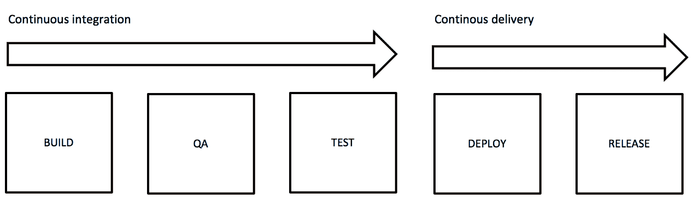

# 持续集成

通常，此事件将在更改被提交并推送到仓库时触发。构建服务器从特定的仓库和分支获取源代码。它尝试构建代码，并使用例如**SonarQube**进行自动质量检查（QA）。

SonarQube 是一个测量代码质量的优秀工具。它是一个自动化的解决方案，因此它不能完全取代代码审查，然而，它能够发现可能或可能不会成为您应用程序质量或性能问题的潜在问题。

SonarQube 将负责：

+   架构和设计

+   编码规则

+   重复代码

+   单元测试

+   代码复杂度

+   发现潜在的错误

您可以定义自定义规则或使用适用于超过 20 种编程语言的默认规则，包括您可能用于您的 Android 应用程序的 Java（很快 Kotlin 也将完全支持），Objective-C 和 Swift。您可以在[`www.sonarqube.org`](http://www.sonarqube.org)找到 SonarQube。如果 QA 检查成功，那么构建服务器还可以运行单元测试，甚至 UI 测试。

您可以配置构建服务器，使其在特定时间进行每日构建，或者在每次提交新的拉取请求时启动。最佳实践是从开发分支创建每日构建，或者每次您想要为测试人员提供一个临时发布版本时。对于每个新的拉取请求，您可以为特定的功能分支创建一个新的构建（与每个新的提交）。您将在后面的“仓库和 Git 工作流程”段落中了解更多关于分支策略的信息。

持续集成的目的是通过运行自动化测试（单元测试和 UI 测试）尽可能频繁地审查和测试代码。其理念是，如果在整个流程中任何环节失败，您将尽早得到通知。这使您能够在应用程序分发之前进行更改。只有当所有步骤都成功时，应用程序才会分发。如果构建失败，您的团队成员（通常是开发者）将通过电子邮件、Slack 或您使用的任何其他通信渠道得到通知。

# 持续交付

在此工作流程中，构建和测试的代码作为临时分发提供给测试人员（或测试用户）。他们可以审查应用程序并对其进行一些手动测试。他们可以执行一些功能测试，尽管有很多测试，但并非所有测试都可以自动化。

构建服务器可以通过使用 Fabric、HockeyApp、alpha/beta Play Store 或 iTunes Beta（以前称为 TestFlight）来分发您应用程序的临时版本。您应用程序的部署需要尽可能平滑。Fastlane 这样的工具可以帮助您分发临时版本，并还可以帮助您在 Play Store 或 App Store 上发布您的应用程序。

# 仓库和 Git 工作流程

构建服务器需要从代码库中检索代码。即使你独自工作，使用代码库也是一个明智的选择。两个知名的基于 Git 的代码库是 GitHub 和 Bitbucket（也称为 Stash）。两者都提供免费和付费计划。GitHub 仅在付费计划中提供私有代码库（见[`github.com`](https://github.com)）。私有代码库仅对团队成员可访问。公共代码库对任何人开放。Bitbucket 在免费计划中提供私有代码库，因此让我们在[`bitbucket.org`](https://bitbucket.org)创建一个 Bitbucket 账户。

下面展示了一个常见的 Git 工作流程。对于每个新功能的开发，都会创建一个功能分支。一旦完成，并通过拉取请求进行代码审查后，功能分支可以被合并到开发分支。

使用智能分支策略，至少可以完成以下两个重要任务：

+   只有经过全面测试并被接受的应用程序版本才能发布

+   热修复可以快速应用，而不会干扰持续集成工作流程

即使你是一个人开发，这也很有意义：

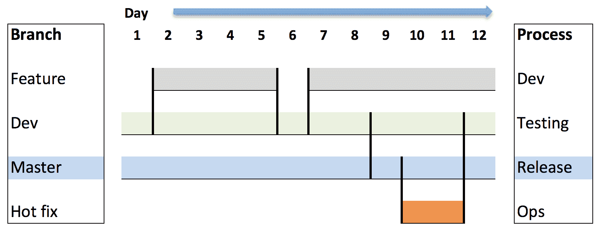

在 dev（或功能）分支上，可以运行单元和 UI 测试。如果所有测试都成功，dev 分支可以合并到 master 分支，并准备好发布。然而，如果应用程序运行时似乎出现了问题，您可以在 master 分支上使用功能分支来应用热修复，而不会干扰新功能的开发。

当然，这只是一个简化的例子，根据您的需求，您可能希望以不同的方式做事。要了解更多关于 Git 工作流程的信息，请查看网站[`www.atlassian.com/git/tutorials/comparing-workflows`](https://www.atlassian.com/git/tutorials/comparing-workflows)或[`git-scm.com/book/en/v2/Git-Branching-Branching-Workflows`](https://git-scm.com/book/en/v2/Git-Branching-Branching-Workflows)。

# 自动化测试

构建服务器可以为您的应用程序运行单元测试甚至 UI 测试。对于 UI 测试，可以考虑像 Espresso（Android）或 Xcode UI 测试（iOS）这样的工具。如果您正在寻找支持两个平台的工具，可以查看 Appium，例如（适用于 Android 和 iOS）。

当谈到测试时，需要考虑不同的方法。其中一种方法是**测试驱动开发**（**TDD**）。如果功能以及所有需求都是已知的，我们可以在开发我们的应用程序之前定义我们的测试。当然，所有测试最初都会失败，但这实际上是一件好事，因为它将设定需要完成的工作大纲，并集中精力确保一切正确。在实现功能的过程中，你的测试将会成功。

浓缩咖啡适合编写简洁可靠的 Android UI 测试。一个测试通常包含点击、文本输入和检查。要了解更多关于 Espresso 或 Appium 的信息，请参阅[`google.github.io/android-testing-support-library/docs/espresso/`](https://google.github.io/android-testing-support-library/docs/espresso/)和[`appium.io`](http://appium.io)。

单元测试通常在功能分支上运行，而集成和 UI 测试通常在开发分支上运行。在你通过所有测试之后，你的应用可以被部署并发布给测试用户或最终用户。

# Android 应用的持续工作流程示例

一个 Android 应用的即兴分发图可能看起来如下。对于持续集成，在下面的图片中，TeamCity 用于从 Bitbucket 创建的存储库检索应用源代码：

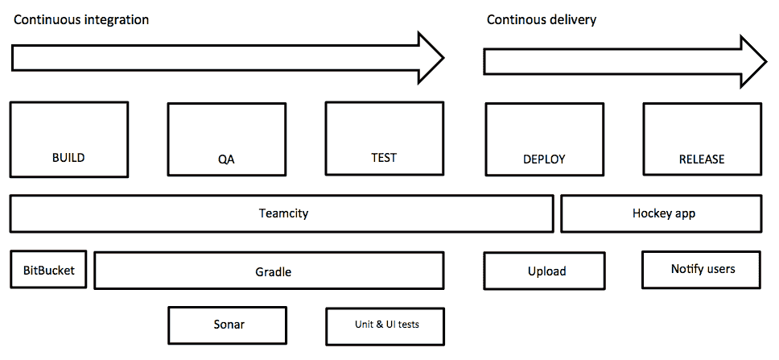

在前面的图中，我们使用**TeamCity**来指示**Gradle**构建和签名应用，并创建一个**Sonar**报告来衡量代码的质量。此外，我们还运行了单元测试和 UI 测试（使用**Espresso**）。一旦配置完成，**TeamCity**将负责所有这些步骤。如果它们都成功，那么下一个步骤将上传签名的应用（APK 文件）到**HockeyApp**，然后它会通知用户有新版本可用。如果你愿意，你也可以使用 Jenkins 作为构建服务器，或者使用 Fabric Beta 代替 HockeyApp。我们只讨论 CI/CD 的亮点。对于构建服务器有一些有趣的书籍。有关更多信息，请参阅[`www.packtpub.com/`](https://www.packtpub.com/application-development/continuous-integration-delivery-and-deployment)。

# 构建变体

你可能需要交付你应用的多个版本，这并不罕见。实际上，在多个名称下发布你的应用，每个名称都有不同的外观和感觉，这可能是一个明智的选择。这对于针对多个受众群体非常有用。另一个例子是发布一个轻量级和付费（或免费和高级）版本的应用。尽管通常使用风味来定制外观和感觉，但也没有理由不能用它来启用或禁用功能。

除了特定的风味之外，你可能需要创建具有不同配置的构建类型。想象一下一个与后端通信的应用。你可能希望使用与生产环境中不同的端点来测试你的应用。这允许你在不担心会破坏生产数据的情况下安全地测试你的应用：

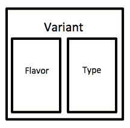

**构建口味**这个术语是用于定制的，而构建类型是用于配置目的的。口味和构建类型的组合称为**构建变体**；嗯，至少对于 Android 和 Android Studio 来说是这样的。如果你有轻量版和完整版的应用，并且需要至少一个配置作为测试端点和一个用于生产，那么总共将有四个变体，例如像这样：

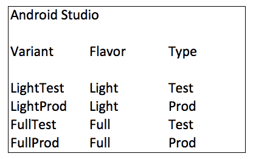

正如我们稍后将会看到的，使用 Gradle 完成这个任务并不困难。我们可以使用多个 Gradle 任务来构建每个变体。

我们可以为我们的 iOS 应用做同样的事情吗？是的，我们可以，但方式略有不同。Xcode 允许你定义多个方案，定义构建目标，这可以与 Android 的构建口味和构建配置进行比较，实际上，它们具有与构建变体相同的目的：

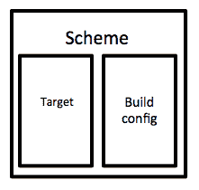

在 Xcode 中，你将拥有四个不同的方案（两个目标乘以两个构建配置）：

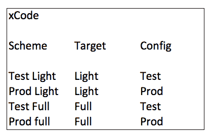

如果我们使用构建服务器，我们可以使用 Xcode 命令行工具来确定针对哪个构建使用哪个方案。

# Gradle 方法

对于 Android，我们可以使用 Gradle 来：

+   确定要使用哪些资源和针对哪个构建口味

+   确定每个构建类型应使用哪些配置参数

+   为每个变体构建应用

+   签署应用

从[`github.com/mikerworks/packt-lean-mobile-app-development`](https://github.com/mikerworks/packt-lean-mobile-app-development)下载或克隆示例项目。

或者，更具体地，查看[`github.com/mikerworks/packt-lean-android-build-variants`](https://github.com/mikerworks/packt-lean-android-build-variants)。

当我们查看示例 Android 应用的`app`文件夹中的`build.gradle`文件时，它有几个部分定义了如何处理不同的产品口味。尽管仅定义口味并保留项目的调试和发布构建类型就足够了，但示例项目中的部分可能有助于检查。

样本项目有蓝色和绿色版本，包含测试和生产端点。每个配置都有一个不同的应用程序 ID 和配置字段。

# productFlavors

在`productFlavors`部分，你可以找到不同的口味：

```kt
productFlavors {
     flavorBlueTest {
         applicationId = "com.coolapp.flavorblue.test"
         buildConfigField "String", "api_endpoint ", "\"https://testapi.coolapp.com/\""
     }
     flavorBlueProd{
         applicationId = "com.coolapp.flavorblue"
         buildConfigField "String", " api_endpoint ", "\"https:/api.coolapp.com /\""
     }
     flavorGreenTest{
         applicationId = "com.coolapp.flavorgreen.test"
         buildConfigField "String", " api_endpoint ", "\"test.api.coolapp.com /\""
     }
     flavorGreenProd{
         applicationId = "com.coolapp.flavorgreen"
         buildConfigField "String", " api_endpoint ", "\"api.coolapp.com /\""
     }
 }
```

# sourceSets

在`productFlavors`部分，你可以看到每个口味引用哪些源和资源：

```kt
sourceSets {
     flavorBlueTest {
         java.srcDirs = ['src/blue/java']
         res.srcDirs = ['src/blue /res']
     }
     flavorBlueProd{
         java.srcDirs = ['src/blue/java']
         res.srcDirs = ['src/blue/res']
     }
     flavorGreenTest{
         java.srcDirs = ['src/green/java']
         res.srcDirs = ['src/green/res']
     }
     flavorGreenProd {
         java.srcDirs = ['src/green/java']
         res.srcDirs = ['src/green/res']
     }
 } 
```

`java.srcDirs`和`res.srcDirs`对象确定特定口味（或口味）所引用的文件夹。

在此项目中，文本（`values.xml`）和颜色（`colors.xml`）等资源定义在`/src/main/res`文件夹下：

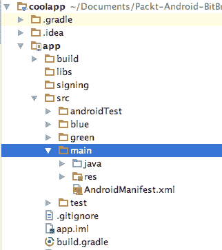

如您所见，除了 `main` 文件夹外，还有两个其他文件夹：`blue` 和 `green`。在 `blue/res` 和 `green/res` 文件夹下，您将找到覆盖默认资源的文件和值。

例如，`main` 文件夹中的 `color.xml` 文件有如下内容：

```kt
<?xml version="1.0" encoding="utf-8"?>
 <resources>
     <color name="colorPrimary">#3F51B5</color>
     <color name="colorPrimaryDark">#303F9F</color>
     <color name="colorAccent">#FF4081</color>
     <color name="colorBackground">#888888</color>
 </resources> 
```

例如，您可以看到对于 `green` 香草，相同的资源文件存在，但这次 `colorBackground` 的值不同（一个漂亮的绿色）：

```kt
<?xml version="1.0" encoding="utf-8"?>
 <resources>
     <color name="colorPrimary">#3F51B5</color>
     <color name="colorPrimaryDark">#303F9F</color>
     <color name="colorAccent">#FF4081</color>
     <color name="colorBackground">#00dd22</color>
 </resources> 
```

同样的，对于包含应用程序文本的 `values.xml` 资源文件也适用。

# buildTypes

在 `productFlavors` 部分，您可以看到特定香草的发布签名配置与 `signingConfigs` 部分条目的映射，我们将在 `buildTypes` 部分之后检查：

```kt
buildTypes {

     release {
         productFlavors.flavorBlueTest.signingConfig signingConfigs.flavorBlueTest
         productFlavors.flavorBlueProd.signingConfig signingConfigs.flavorBlueProd

         productFlavors.flavorGreenTest.signingConfig signingConfigs.flavorGreenTest
         productFlavors.flavorGreenProd.signingConfig signingConfigs.flavorGreenProd
     }

     debug {
         testCoverageEnabled = true
     }
 } 
```

# signingConfigs

在 `productFlavors` 部分，您可以看到我们可以为每个香草使用不同的签名，使用不同的密钥库：

```kt
signingConfigs {
     flavorBlueTest{
         storeFile file('../app/signing/coolapp_flavorBlue.jks')
         storePassword 'secretFlavorBlue'
         keyAlias 'secretFlavorBlue'
         keyPassword 'secretFlavorBlue'
     }
     flavorBlueProd {
         storeFile file('../app/signing/coolapp_flavorBlue.jks')
         storePassword 'secretFlavorBlue'
         keyAlias 'secretFlavorBlue'
         keyPassword 'secretFlavorBlue'
     }
     flavorGreenTest{
         storeFile file('../app/signing/coolapp_flavorGreen.jks')
         storePassword 'secretFlavorGreen'
         keyAlias 'secretFlavorGreen'
         keyPassword 'secretFlavorGreen'
     }
     flavorGreenProd {
         storeFile file('../app/signing/coolapp_flavorGreen.jks')
         storePassword 'secretFlavorGreen'
         keyAlias 'secretFlavorGreen'
         keyPassword 'secretFlavorGreen'
     }
 } 
```

为了简化，您将在这里看到所有属性，如 `storeFile`、`storePassword`、`keyAlias` 和 `keyPassword`，这些都指的是密钥库中同等名称的属性。将它们放在单独的签名文件中是一种良好的做法。

在 Android Studio 中，如果您打开构建变体面板，它将看起来像这样：

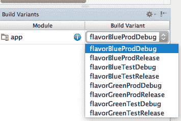

现在，您只需要告诉 Gradle 构建特定的变体，如下所示：

```kt
./gradlew assemblectFlavorGreenTestRelease 
./gradlew assemblectFlavorGreenProdRelease 
./gradlew assemblectFlavorBlueTestRelease 
./gradlew assemblectFlavorBlueProdRelease 
```

打开一个终端窗口以本地构建每个变体。接下来，我们将查看 TeamCity 并了解我们如何使用它来自动构建所有变体。

# 使用 TeamCity 作为构建代理

可以使用构建服务器，如 TeamCity 或 Jenkins，来自动化这些流程。在我们的示例中，我们将使用 TeamCity，您可以在 [`www.jetbrains.com/teamcity/download/`](https://www.jetbrains.com/teamcity/download/) 免费下载它。如果您更喜欢 Jenkins，您可以在 [`jenkins.io`](https://jenkins.io) 获取它。

在服务器上下载、安装和配置 TeamCity，或者如果只是为了测试目的，可以在您的开发机器上安装。安装 TeamCity 后，您可以启动构建服务器。在 OS X 上，打开一个终端窗口，定位到 `teamcity` 文件夹的 `bin` 文件夹（例如，`/Users/mike/Dev/teamcity/bin`），然后输入以下命令：

```kt
m010:bin mike$ sh runall.sh start 
```

启动浏览器并将它指向 `http://localhost:8111`。等待 TeamCity 的设置完成，然后创建一个新项目，如下所示：

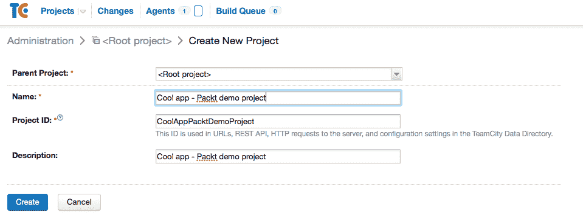

现在我们知道了如何使用 Gradle 构建不同的变体，接下来显示的图片不会太具有挑战性。我们有一个轻量和完整版本。我们希望为每个版本构建两个：一个从测试端点消耗数据，另一个从生产端点获取数据。这将总共产生四个 APK 文件：

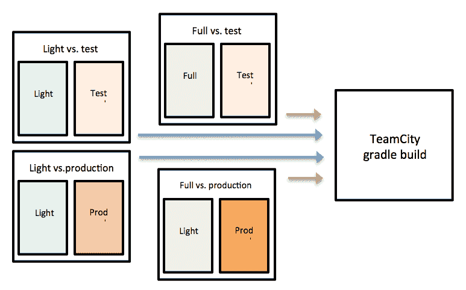

现在我们将创建一些构建步骤，使用 Gradle 创建四个 APK 文件，就像我们在本地做的那样。首先，我们需要告诉 TeamCity 应该从哪里获取此特定项目的存储库。对于此项目，我们将为所有口味使用相同的存储库和分支，但对于更复杂的项目，口味和构建类型可能会有所不同。这是因为在一个开发分支上运行您的临时测试，以及在产品分支上运行您的最终测试是有意义的。

定义项目的 VCS 根并选择 Git 作为 VCS 类型。给它一个名称，并选择以下 URL 作为获取 URL：[`github.com/mikerworks/packt-lean-android-build-variants.git`](https://github.com/mikerworks/packt-lean-android-build-variants.git)。

您不需要在此处输入凭据（认证方法为匿名），因为此 Bitbucket 存储库具有公开访问权限。

现在您已准备好创建第一个构建步骤。选择“命令行”作为运行类型，因此您可以为构建脚本内容输入与您在本地机器上相同的内容：

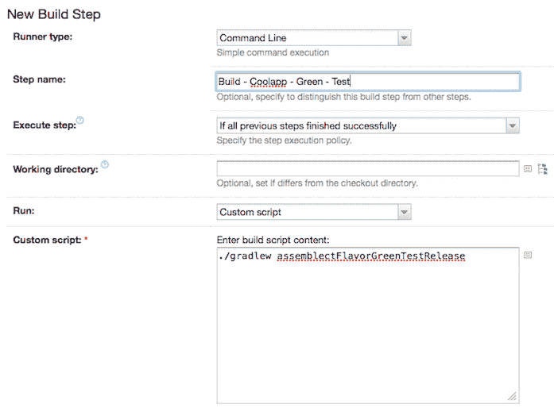

对于“自定义脚本”字段，输入`./gradlew assembleFlavorGreenTestRelease`。

您可以在 TeamCity 中定义额外的构建步骤，例如，运行单元测试、UI 测试、SonarCube QA 检查，以及基本上您可以从命令行自动化的任何其他内容。

# 自动部署和交付

您的应用程序在构建、签名和测试后需要分发。有多种方法可以做到这一点：

+   自托管网站

+   HockeyApp 或 Fabric 测试版

+   Play Store alpha/beta 或 iTunes beta/TestFlight

# 自托管

您可以上传已签名的 APK 并将其发布到您自己的网站上。对于 Android，只需托管 APK 即可（尽管您可能需要为 IIS 进行一些额外的配置）。对于 iOS，您可以使用 **Over the Air** (**OTA**) 清单分发您的 IPA 文件。如果您选择此选项，您仍然需要注册 UDIDs 并创建相应的临时配置文件。

从一个高层次的角度来看，这种方法看起来是这样的：

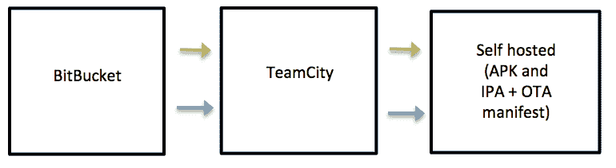

您还必须通知您的用户关于网站上有新版本可用。

# HockeyApp 或 Fabric 测试版

有许多 SaaS 解决方案可用于分发并通知您的用户新的临时发布。其中之一是 HockeyApp。您可以使用一个 (**cURL**) 脚本将您的已签名 APK 或 IPA 文件上传到 HockeyApp。HockeyApp 还可以通知您的用户新的构建，并且每个版本都可以包含发布说明，例如，通过添加一个运行此命令的构建步骤：

```kt
    curl -F "status=2" -F "notify=0" -F "ipa=@//TeamCity/buildAgent/work/<work folder>/app/build/outputs/apk/app-release.apk" -H "X-HockeyAppToken:<your hockey app token>" https://rink.hockeyapp.net/api/2/apps/<app id>/app_versions/upload  
```

使用 HockeyApp，界面将如下所示：

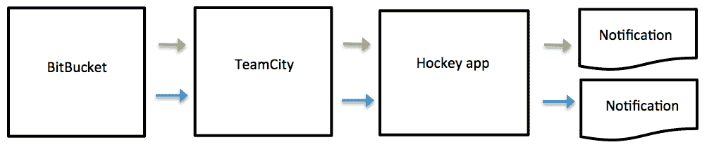

HockeyApp 是一项付费服务，它减轻了您在 iOS 应用程序分发中的配置文件烦恼。Fabric Beta 是另一个您可以用于临时分发的服务。Fabric beta 是一个免费增值服务，并且它的工作方式几乎相同。

# Fastlane，alpha/beta Play Store，和 iTunes beta

如果您将 fastlane 与 beta Play Store 或 iTunes beta/Testflight 分发结合使用，那么您可能可以节省一些时间和麻烦。

**Fastlane** 是将您的应用程序交付到测试或生产环境的一种工具。因为它使用 iTunes beta 进行您的 iOS 应用程序的临时分发，所以它不再需要您事先获取测试用户的 UDID。这种方法的一个缺点是，虽然它是一个临时的 beta 分发，但您的应用程序需要先由 Apple (预-)批准，这会花费更多的时间，直到测试版本对您的测试用户可用。

它将高级视图转换为这个：

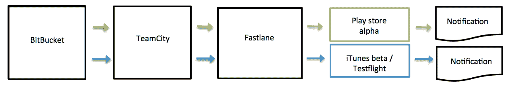

fastlane 的路线图看起来像这样。它将负责您分发流程的每个部分。它最初是为 iOS 应用程序分发开发的。

>

Fastlane 带有各种其他有趣的功能，这些功能将使您的构建自动化生活更加光明，例如：

+   创建（本地化）截图并上传它们

+   向 App Store 发送更新元数据

+   在配置文件中生成和续订推送通知

+   运行测试

Fastlane 也适用于 Android。这可能是自动化构建和发布您的应用程序的最简单方法。您可以在 [`fastlane.tools`](https://fastlane.tools) 找到 fastlane。

正确设置 CI/CD 需要一些时间（和一些痛苦），但这值得投资！

# DevOps

通常，您不仅是开发者，还是运营商。**DevOps** 文化最常见于初创公司；然而，越来越多的成熟公司正在采用其哲学。DevOps 建立了一种文化和环境，其中构建、测试和发布您的应用程序将快速、频繁且更可靠地发生，这正是我们所希望的。基本上，这个想法是，整个过程将成为从开发到运营（配置、监控和调节）团队的责任。如果在生产中出现故障，您将创建一个热修复，测试它，然后重新发布它。

CI/CD 的持续集成部分特别关注 DevOps 中的开发部分。交付部分更多地关注运维部分。这两个循环可以对应于构建-度量-反馈循环（从更高视角来看）：

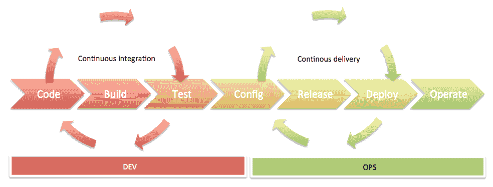

持续交付和 DevOps 经常一起使用。它们有共同的目标，例如向最终客户提供小而快速的变化，并专注于有价值的方面。CD 和 DevOps 之间的一些区别在于，后者还关注组织变革，以支持涉及到的许多功能之间的良好协作。它要求每个团队成员都具备良好的协作和沟通技巧。随着您的组织和团队开始成长，这一点将变得越来越重要。

CI/CD 和 DevOps 使得分割测试和收集反馈变得更加容易。这种方法将显著促进精益创业方法（从技术角度）的采用。这将导致更好的质量，更高的客户满意度，以及更多（更早！）的发布。

# 摘要

我们已经了解了 CI 和 CD 是什么，以及它们为您带来的好处。公共或临时的分发可以由构建服务器启动。您可以使用构建服务器，例如 TeamCity 或 Jenkins 来构建和测试您的应用程序。

可以使用 HockeyApp、Fabric Beta 或 Play Store 或 App Store 的测试版程序来分发临时的发布。Fastlane 可以帮助您完成这些和其他任务。到目前为止，您可能已经学到了很多。

CI 和 CD 对于您想要提高和维护代码质量，以及想要优化工作流程来说非常重要。它允许您收集反馈，因为您能够提前和频繁地发布。CI/CD 和 DevOps 文化可以帮助您优化构建-度量-反馈循环。

在下一章中，我们将学习为什么如果您想成功，如果您想作为一个公司生存下去，构建不公平的优势是重要的。
