# Android N 简介及 Android SDK 的安装

欢迎来到 Android 和游戏开发的世界。你即将开始一段旅程，这将为你打下将最狂野的想象转化为游戏的基础。本书将成为你创造精彩游戏的垫脚石。如果你是初学者，你将经历一段陡峭但舒适的学习曲线，并在本书结束时，你将创建出自己的游戏。

本书章节被划分为极其易于理解的部分，无需游戏开发方面的先验经验。然而，编程经验是必须的。

本章将指导你了解 Android N 的入门，以及安装所需软件的步骤。简而言之，你将在本章学习以下内容：

+   Android N 的简要介绍

+   通过一些表现良好的游戏的例子介绍游戏开发

+   安装 Android Studio

+   Android Studio 的组成部分以及为 Android N 设置

+   Android 基本概念的快速介绍

# Android N 简介

所有这一切始于 2005 年，当时谷歌收购了一家新公司，这家公司后来彻底改变了移动计算的未来。是的，你猜对了！被收购的公司是 Android 操作系统的开发者。从那时起，Android 经历了许多发展，由于谷歌的力量，其用户基础显著增长。在撰写本书时，Android N 是该操作系统的最新版本。Android 的市场份额一直在增长，目前占总移动计算设备的 87.6%。这是一个巨大的数字，因此，从开发者的角度来看，为这个平台开发是极其重要的，因为大多数移动用户都是 Android 用户。

Android N 代表 Android Nougat。你必须了解 Android 版本的命名约定。如果不了解，它们是按字母顺序递增命名的，每个版本都以甜点命名，除了前两个版本。以下是对不同 Android 版本的快速浏览：

+   Alpha

+   Beta

+   Cupcake

+   Donut

+   Eclair

+   Froyo

+   Gingerbread

+   Honeycomb

+   Ice Cream Sandwich

+   Jellybean

+   Kit Kat

+   Lollipop

+   Marshmallow

+   Nougat

你可以从官方来源了解更多关于 Android 历史的信息：[`www.android.com/history/`](https://www.android.com/history/)。

应用开发的世界很有趣——但比这更有趣的是，一个特定的领域，那就是游戏开发。移动游戏在 Google Play Store 上的下载量最高，因此，对于游戏开发者来说，这是一个最激动人心的时刻，因为谷歌已经建立了一个庞大的分发渠道，使得移动游戏开发者发布游戏变得极其容易。那些需要等待数月甚至数年才能与主要发行商达成出版协议的日子已经过去了。在当今时代，您只需在 Google Play Store 上注册为开发者，几小时内就可以发布您的第一款游戏（如果准备好了），并从真实用户那里获得反馈。

安卓游戏的世界见证了巨大的成功故事，例如愤怒的小鸟、糖果传奇、地铁跑酷等等。即使是玩法简单的游戏，如 Flappy Bird，也取得了极大的成功，据估计，在游戏的巅峰时期，它每天的广告收入约为 50,000 美元。这难道不令人兴奋吗？你只需点击一下，就能让你的游戏接触到数十亿潜在的用户，如果你的游戏受到关注，那么你将享受人生中最美好的时光。

您可以制作从基于文本的游戏到第三人称射击游戏如此简单或复杂的游戏。您的限制仅限于您的想象力。此外，您今天可以轻松在线获取所有需要的资源。这本书将为您在安卓游戏开发的世界中提供一个便捷的参考，并使用最新的安卓版本，因此您将保持知识的更新。您不一定需要具备开发安卓平台游戏的先前经验；然而，如果您有，那将是一个加分项。不过，请放心，这本书的语言将会尽可能容易理解，在整个开发您第一个安卓游戏的过程中，您将会非常享受。

因此，无需多言，让我们直接进入这个激动人心的旅程，使用我们可用的最新组件和工具来开发安卓游戏。我希望你在阅读和实施这本书的同时能有一个愉快的时光，并强烈建议你在阅读这本书的过程中做笔记。

# 软件需求

为了开始我们的安卓游戏开发之旅，我们需要在您的计算机上安装某些软件。我们将使用截至本书写作时的最新版本的 Android Studio 来开始。本章将指导您完成安装过程。

在开始安装之前，请确保您的计算机满足以下系统要求：

+   Windows：

    +   Microsoft® Windows® 7/8/10

    +   至少 3 GB RAM，建议 8 GB RAM；另外还需要 1 GB 用于 Android 模拟器

    +   至少 2 GB 的可用磁盘空间，建议 4 GB（IDE 为 500 MB，Android SDK 和模拟器系统镜像为 1.5 GB）

    +   最小屏幕分辨率 1280 x 800

    +   对于加速模拟器，需要 64 位操作系统和具有 Intel® VT-x、Intel® EM64T (Intel® 64)和执行禁用(XD)位功能支持的 Intel®处理器，或者支持 AMD 虚拟化(AMD-V)的 AMD 处理器

+   Mac:

    +   Mac® OS X® 10.10（Yosemite）或更高版本，最高至 10.12（macOS Sierra）

    +   最小内存 3 GB RAM，推荐 8 GB RAM；此外，Android 模拟器还需要 1 GB 内存

    +   最小可用磁盘空间 2 GB，推荐 4 GB（IDE 占用 500 MB + Android SDK 和模拟器系统镜像占用 1.5 GB）

    +   1280 x 800 最小屏幕分辨率

+   Linux:

    +   GNOME 或 KDE 桌面环境

    +   能够运行 32 位应用程序的 64 位发行版

    +   GNU C 库（glibc）2.11 或更高版本

    +   最小内存 3 GB RAM，推荐 8 GB RAM；此外，Android 模拟器还需要 1 GB 内存

    +   最小可用磁盘空间 2 GB，推荐 4 GB（IDE 占用 500 MB + Android SDK 和模拟器系统镜像占用 1.5 GB）

    +   最小屏幕分辨率 1280 x 800

    +   对于加速模拟器，需要具有 Intel® VT-x、Intel® EM64T (Intel® 64)和执行禁用(XD)位功能支持的 Intel®处理器，或者支持 AMD 虚拟化(AMD-V)的 AMD 处理器

模拟器加速需要安装**Intel 硬件加速执行管理器**（**Intel HAXM**）或**基于内核的虚拟机**（**KVM**），它们都是虚拟机管理程序。如果没有安装所需的虚拟机管理程序，Android Studio 通常会提示您安装它。没有加速，模拟器将从虚拟机获取机器代码，并将其逐块转换为与主机计算机架构兼容。这个过程可能相当慢。然而，如果虚拟机和主机计算机的架构匹配（例如 x86 上的 x86），模拟器可以跳过代码转换，并直接在真实的 CPU 上使用虚拟机运行。在这种情况下，模拟器的速度可以接近您的实际计算机。

您可以从以下 URL 开始安装 Android Studio：

[`developer.android.com/studio/index.html`](https://developer.android.com/studio/index.html)

为了编写这本书，我们使用了具有最低系统要求的 Windows 10 系统。一旦您下载了 Android Studio 的`.exe`文件，请按照以下步骤完成安装：

1.  打开您刚刚下载的`.exe`文件

1.  按照设置向导进行操作，并使用标准安装方式安装它

完成此操作后，您将准备好使用需要 Android N 的 SDK 组件启动 Android Studio；Android 的 SDK 工具版本为 25.0.0。

安装步骤如下：

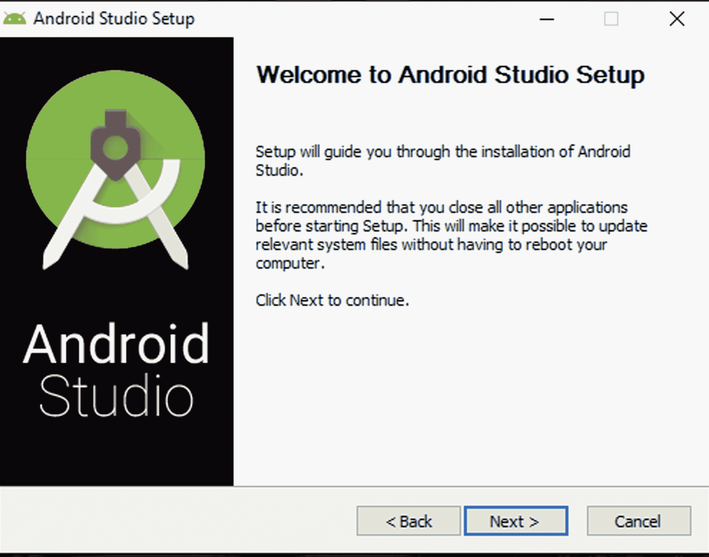

按“下一步”开始设置：

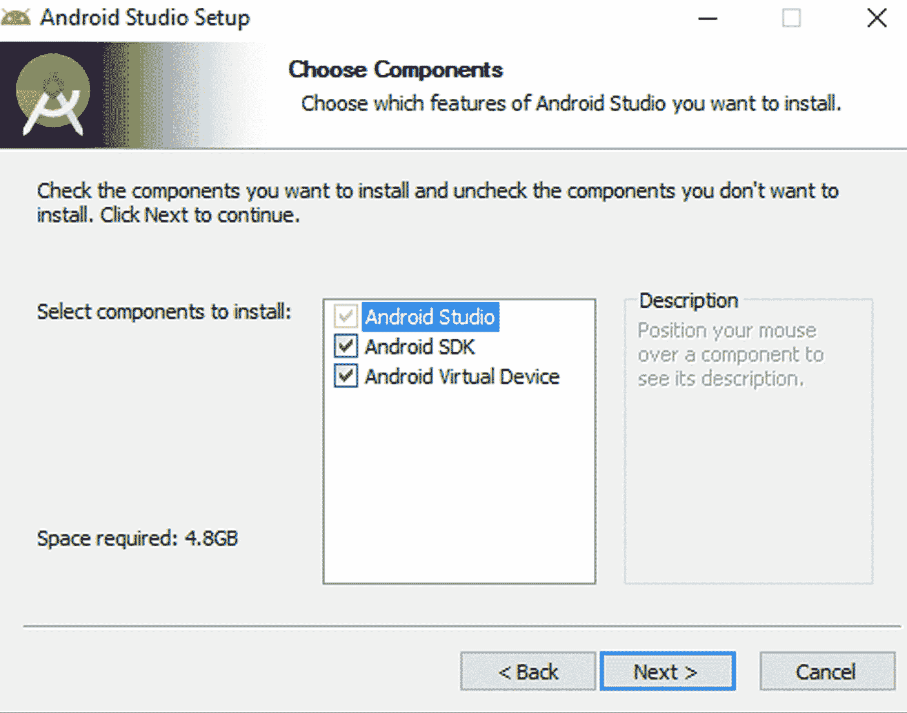

确保您有足够的安装空间，然后通过点击“下一步”继续：

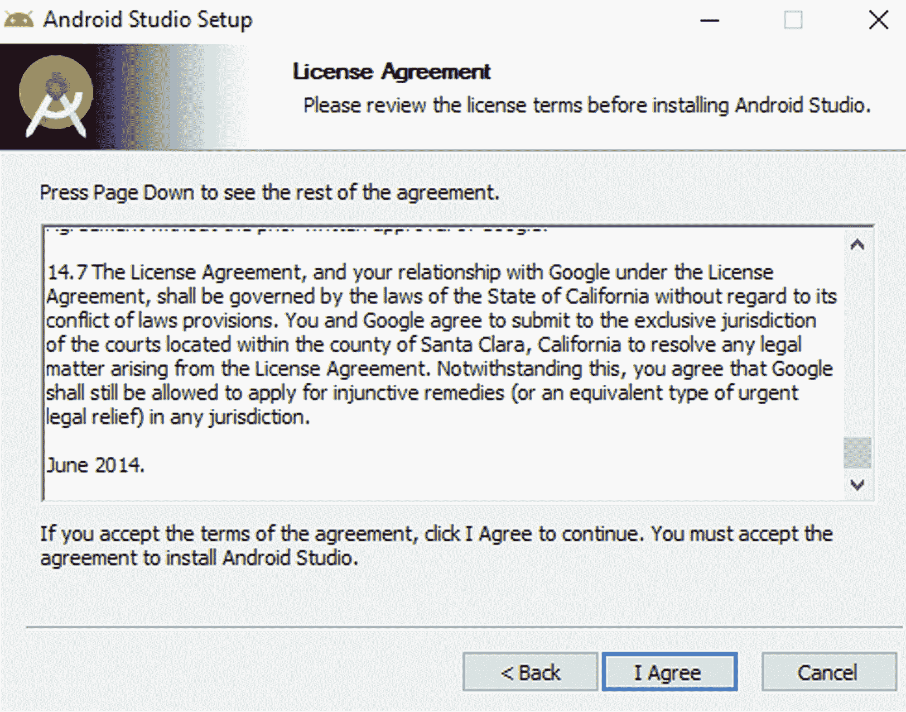

仔细阅读条款和协议后，按“我同意”继续：

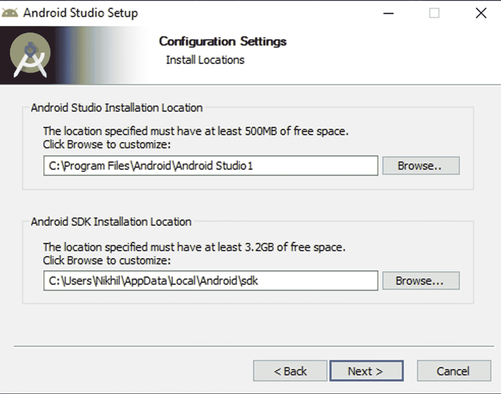

选择您希望安装 Android Studio 的路径，然后按“下一步”：

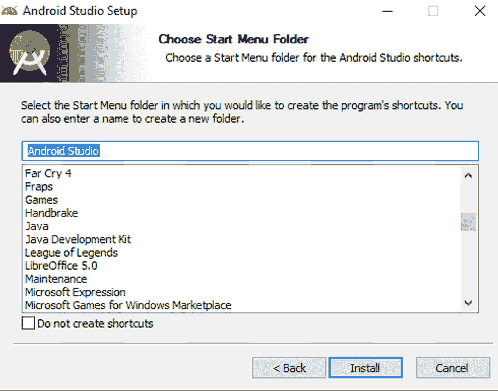

创建一个启动菜单项以快速访问，并按“安装”：

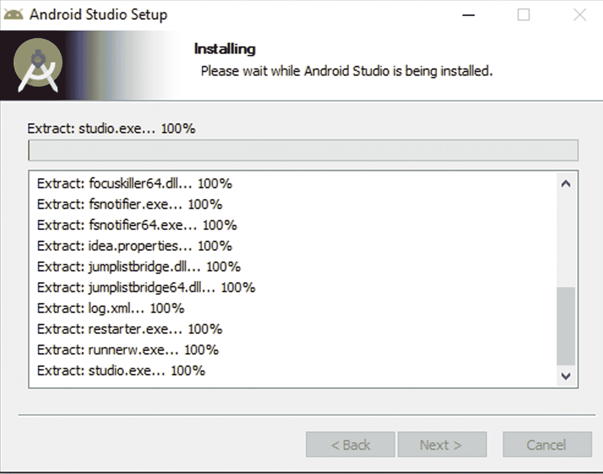

等待安装过程完成：

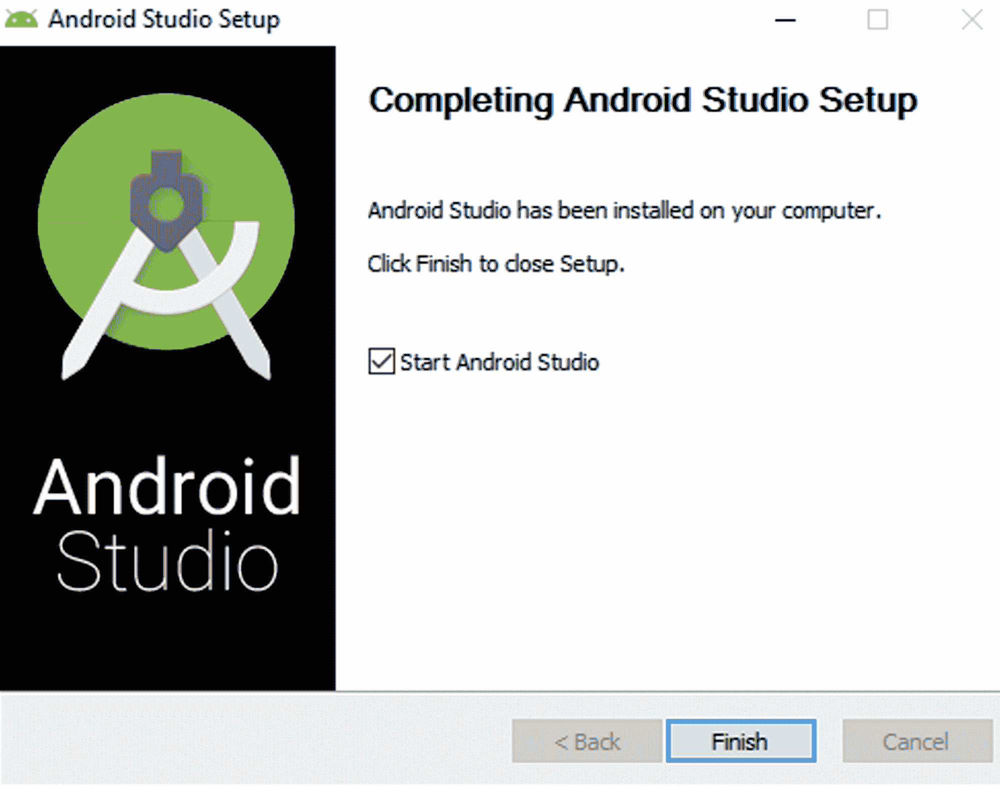

你现在已经完成了 Android Studio 的安装；按完成继续。

现在，你需要配置 Android Studio 以使用 Android N SDK。完成此操作的步骤如下所示：

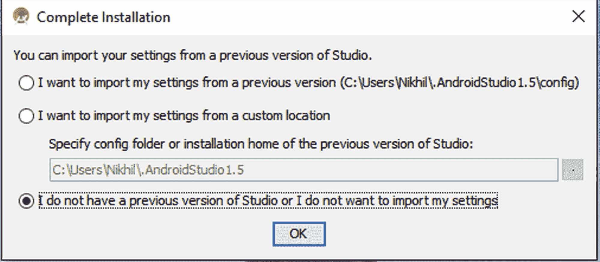

由于我们正在安装一个全新的副本，请选择截图中的最后一个选项并按确定：

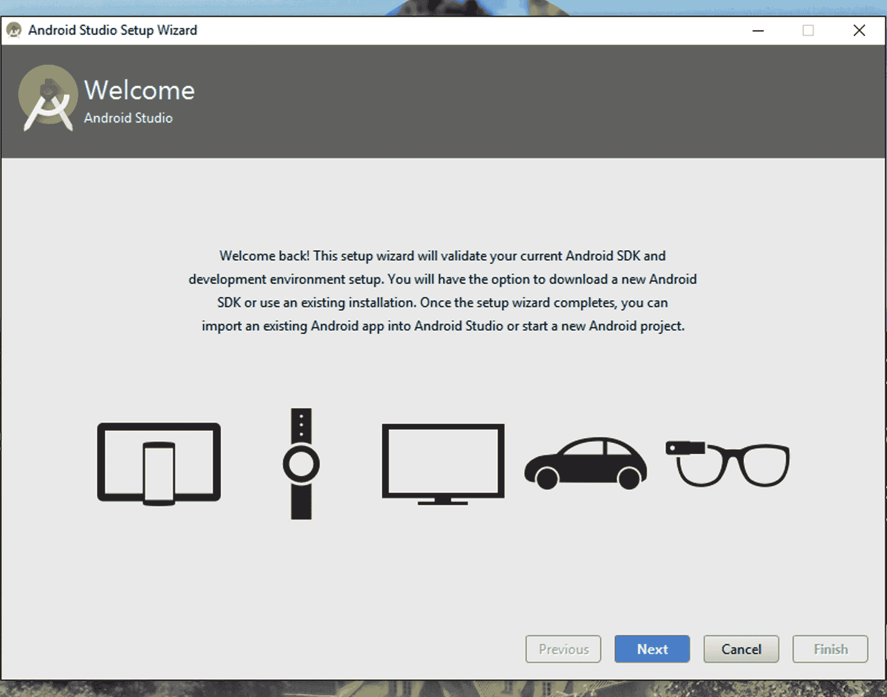

按下下一步继续：

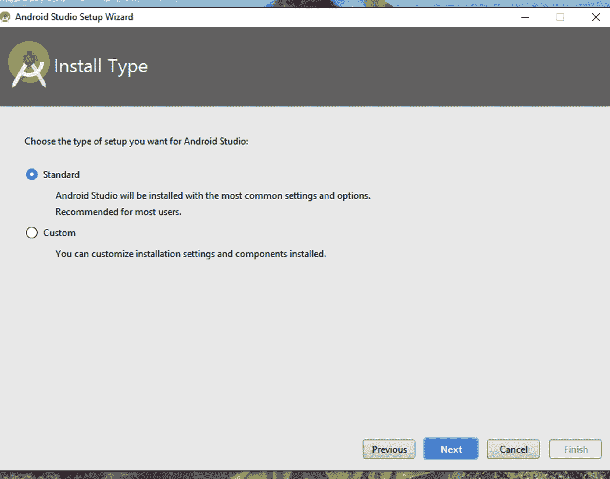

选择标准安装以使用推荐设置：

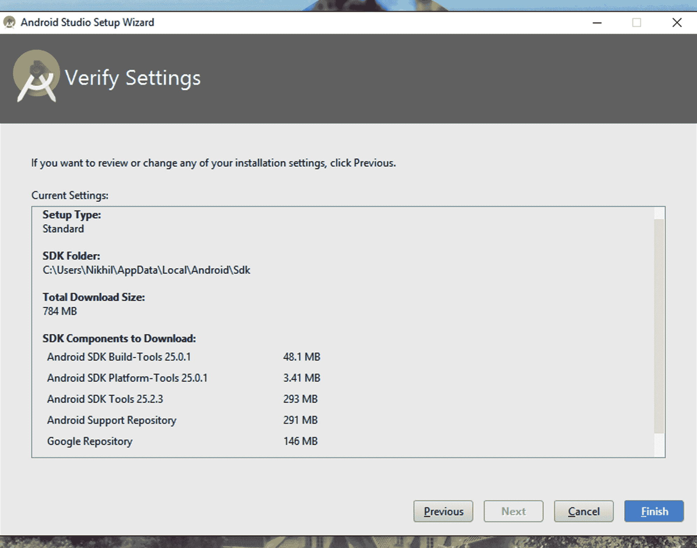

按完成开始下载所需组件。

按下完成后，你的电脑将开始下载 Android N SDK 所需组件，因此请确保你的互联网连接正常，然后坐下来享受一杯咖啡，同时 SDK 在你的系统上安装：

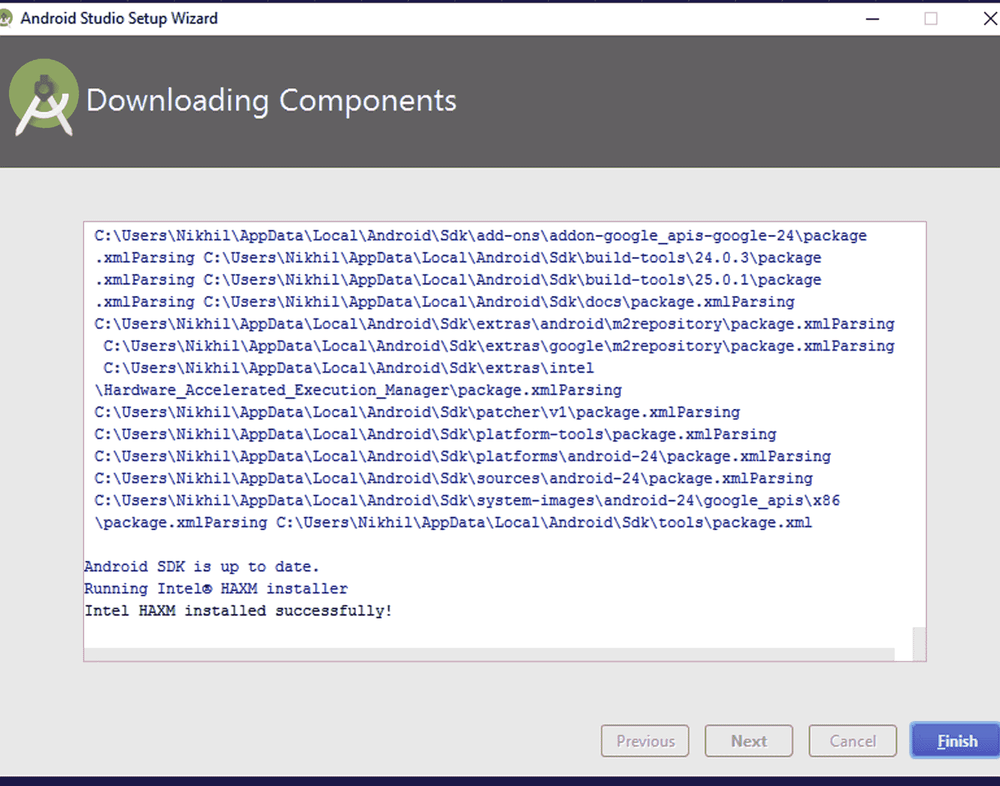

你现在已经成功安装了 Android Studio 和 Android N 所需的组件。

下载完 SDK 的所有组件后，你将准备好启动 Android Studio，并会看到以下屏幕菜单：

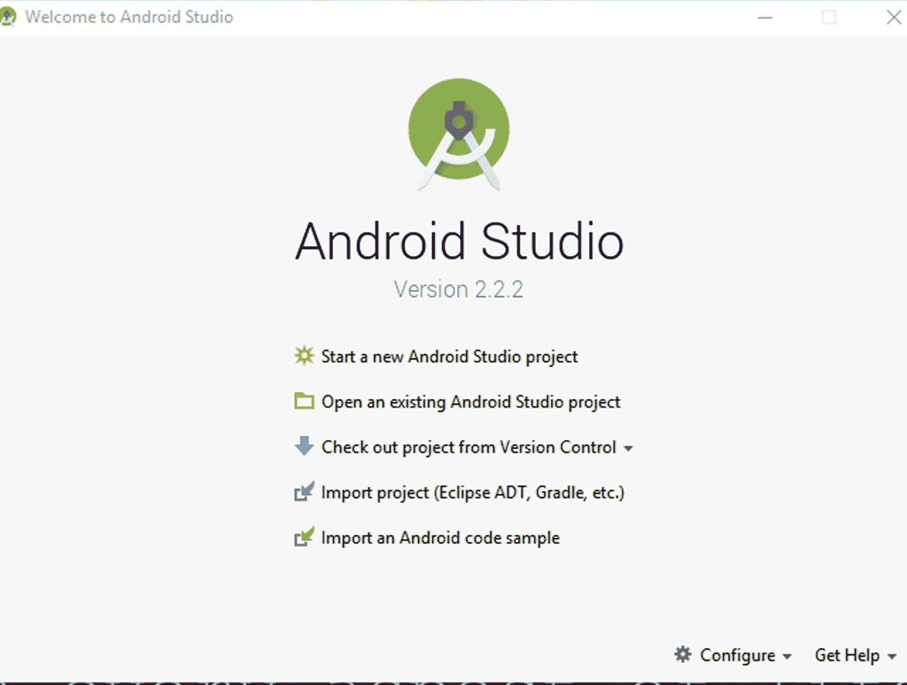

恭喜！你现在可以开始使用 Android Studio 了！

# 安卓的精髓

在 Android Studio 中开始新项目之前，有一些基本概念你必须熟悉。因此，让我们看看我们章节中将要处理的一些常见术语。

# 包名

你将遇到的第一件事是所谓的**包名**。实际上，理解起来相当简单。包名就像一个反向 URL。将包名视为你的应用的域名——就像一个网站一样，只是方向相反。例如，你可以将`www.google.com`视为一个网站的域名；以完全相同的方式，Android 应用的命名规范与网站相反。因此，你可以将你的应用命名为类似`com.google.www`的东西。没有严格的规定说你的包名必须从`com`开始，但它是最普遍接受的约定。你也可以使用你自己的约定随机命名包名，例如`abc.xyz.lmn`、`mygame.mycompany.myname`等等。此外，非常重要的一点是，包名必须是唯一的，并且不应与谷歌应用商店上任何其他现有应用的包名匹配。

选择一个独特的包名非常重要，因为 URL 会被谷歌索引，这对你的游戏或应用在谷歌应用商店中被注意到至关重要。因此，请确保你为你的游戏使用一个独特的包名。还有一个有趣的现实是，如果你在包名上已经确定，即使应用尚未上线，你也可以预测你的应用 URL。因此，你不能使用另一个已上线应用相同的包名，因为它已经在谷歌应用商店上。你的应用将根据以下 URL 约定上线：

`https://play.google.com/store/apps/details?id=*package_name_here*`

因此，如果你的包名是 `abc.xyz.lmn`，那么你的应用的 URL 将是以下格式：

`https://play.google.com/store/apps/details?id=abc.xyz.lmn`

# 布局

下一个概念是布局。我们将在下一章处理布局，但为了给你一个简单的介绍，让我们提供一些示例。我们将制作一个游戏，在游戏中，我们不需要显示**状态栏**，这意味着我们需要一个**全屏布局**。如果你在制作一个应用，你可能不会介意在顶部显示状态栏。所以在这种情况下，你可以使用**相对布局**或**线性布局**。这本书真正有趣的地方在于，到结束时，你还将对如何创建非游戏应用有一个基本的了解。因此，强烈建议你正确掌握前三章的知识。

# AndroidManifest 文件

在制作 Android 应用或游戏时，另一个重要的概念是`AndroidManifest`文件。简单来说，这个文件包含了应用所需的所有规则，或者用更广泛的话说，是**权限**。你一定在 Google Play Store 上注意到，在下载任何应用之前，都会弹出一个对话框告诉你应用运行所需的权限。这些权限是基本规则，需要在`AndroidManifest`文件中提供，以便让用户了解将收集哪些信息。例如，如果一个应用需要访问互联网，那么开发者必须确保在清单文件中包含互联网权限。如果开发者没有在清单文件中写入这个权限，那么应用将无法访问该功能，访问联系人、相册、摄像头以及其他一切也是如此。

在开始开发任何 Android 游戏或应用之前，你需要牢记这三件最重要的事情。

在下一章中，我们将开始我们的第一个 Android Studio 项目。

# 概述

在本章中，我们学习了有关 Android 的一些基本信息以及如何安装 Android Studio，这将有助于我们在开发应用的道路上。我们还配置了 Android Studio，使其与 Android N 的组件兼容；你现在可以开始 Android 游戏开发了。

现在我们已经安装了 Android Studio，我们将在下一章学习如何执行/运行我们的第一个程序。系好安全带，你将有一段刺激的旅程！
