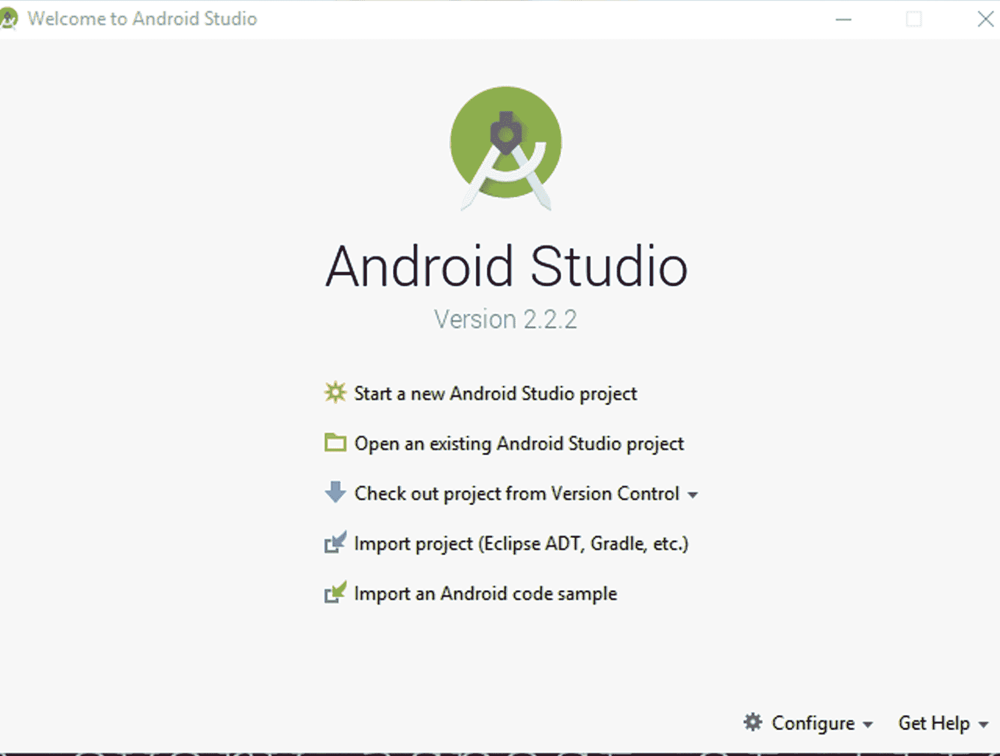
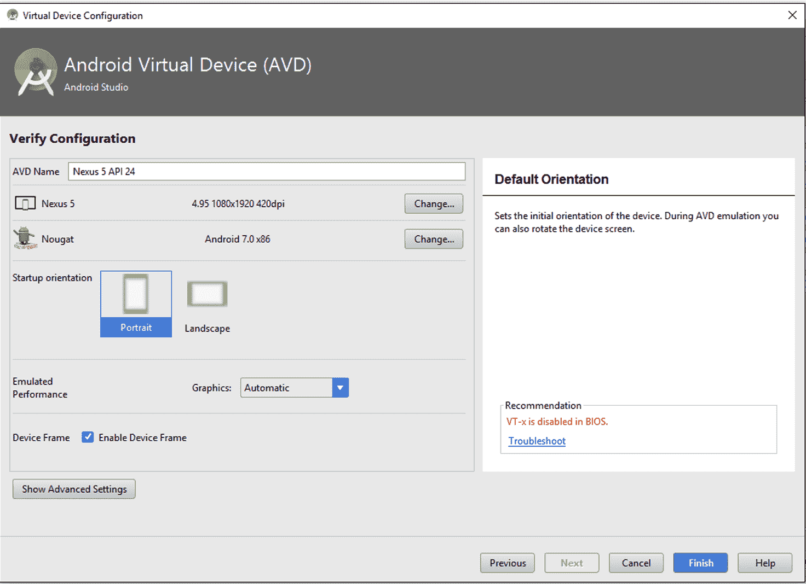

# 第二章：熟悉 Android Studio

本章将指导你通过 Android Studio，并在本章结束时，你将成功执行你的第一个 Android 项目。这将是一个对你理解 Android 项目结构至关重要的章节，并将帮助你理解后续章节。你将学习以下内容：

+   Android 项目的通用项目结构

+   默认类说明

+   XML 文件和不同类型的 XML 文件

+   设置 Android 模拟器

+   执行你的第一个 Hello World 程序

# 理解 Android 项目结构

因此，在我们上一章中，我们成功设置了 Android Studio，并配备了开始工作的必要组件。让我们开始吧。为了了解 Android 项目结构，我们首先必须打开一个新的项目。

# 创建你的第一个 Android Studio 项目

打开你的 Android Studio，点击“开始新的 Android Studio 项目”，如下截图所示：

一旦你开始一个新的项目，你将看到以下截图：

在这个屏幕上，填写你第一个 Android 应用的详细信息：

+   应用名称是应用的名字，当它安装到手机上时，将显示在图标上。

+   公司域名是应用的一个标识符。确保你在所有应用中保持这一名称的一致性，以实现更好的组织和规范。

+   包名是应用的重要唯一标识符。我们在第一章中学习了它，并看到了它的命名约定。如有关于包名及其命名约定的疑问，请参考该部分。

+   包含 C++支持是可选的。为了本书的目的，我们将保持未选中状态。

+   项目位置是指你的项目文件夹将在电脑上的路径。

在填写所有这些详细信息后，按下“下一步”。

现在，你将看到这个屏幕：

你的 Android 应用的不同平台

为了本书的目的，我们只会使用手机和平板电脑。然而，一旦你对开发周期感到熟悉，你也可以尝试在其他平台上进行实验。

最小 SDK 是运行你的应用所需的最小 OS 版本。建议你选择尽可能多的 OS 版本上运行应用的最小版本。然而，请注意，一些功能在后续版本中已被弃用，因此建议使用最小 API 14：Android 4.0（IceCreamSandwich）以实现无烦恼的开发。你还将被提示你的应用将支持多少设备，如图所示。这些数据是实时的，并且随着 OS 市场份额的变化而变化。

如果你想了解更新后的市场份额以及与各种版本及其相应市场份额相关的更多有趣内容，你可以访问官方 Android 网站[`developer.android.com/about/dashboards/index.html`](https://developer.android.com/about/dashboards/index.html)。

选中我们的全屏活动后，按下一步，如下所示：

不同类型的活动

你可以说活动只是一个默认布局。由于我们正在创建一个游戏，我们将使用全屏活动。正如你在前面的截图中所见，你有许多不同的活动选项可以选择，它们本身相当直观。因此，让我们选择全屏活动并按下一步：

活动命名

活动名称是你将生成的 Java 类的名称。我们将大量使用这个文件，所以请确保你记得它。

布局名称是处理你的应用视觉上如何以及显示什么组件的 XML 文件的名称。对于 XML 文件，需要遵循一些命名约定。如下所示：

+   名称必须全部小写

+   使用下划线而不是空格来分隔两个单词。

+   总是在文件名前加上资源类型的前缀；例如，如果你的 XML 文件对应一个活动，如`MainActivity.java`，那么你的文件名应该是`activity_main.xml`。

+   如果你有一个特定组的子项，例如主活动的列表项，那么它可以命名为`activity_main_list_item.xml`。

+   这样，你可以根据你的喜好在文件名后缀或前缀添加一个关键字。

标题是将在你的应用顶部栏中显示的名称。你为活动使用的标题和主活动的类名可能不同；标题也可能包含空格。

完成所有这些后，点击“完成”并给自己一个掌声。你已经成功学习了如何创建 Android Studio 项目。在此之后，根据你系统的性能等待几秒钟/几分钟，以便项目设置；一旦准备好，你将看到以下屏幕：

我们的 Android Studio 项目文件夹

如果由于某种原因，等待后你仍然看不到这个屏幕，那么点击屏幕左上角垂直对齐的“1：项目”选项，它位于“FirstGame”下方。

恭喜！你现在已经成功创建了你第一个应用。在这个时候，你可以运行项目并查看它在模拟器上的运行情况；然而，在我们这样做之前，让我们了解一下这个项目的文件夹结构。让我们展开每个文件夹以进一步了解它。现在，这部分非常重要，因为它将作为你在 Android Studio 中几乎每项基本操作的基础，所以请确保你正确理解这一点。

# Android 项目的项目结构

点击每个文件夹左侧的小箭头以展开其视图：

项目文件夹内的各种文件夹

正如你所见，在我们的项目文件夹中有多个文件夹。我们的主要项目文件夹包含三个子文件夹，分别是 `manifest`、`java` 和 `res`；我们现在将分别探索这些文件夹：

+   `manifest`：这个文件夹包含你的 `AndroidManifest.xml` 文件，它负责给你的应用授权，正如我们在前面的章节中学到的。

+   `java`：这个文件夹包含所有你的 `.java` 文件，这些是你的 Java 代码文件。通常，这个文件夹有多个子文件夹，其中包含你的包名，在其中，是源代码文件。你可以在前面的屏幕截图中观察到我们有一个 `java` 文件夹，其中包含一个名为 `nikhil.nikmlnkr.game` 的文件夹，这实际上是我们的游戏包名，我们有一个 `FullScreenActivity` 在其中。

+   `res`：这个文件夹包含所有你的资源。这里的 `res` 简单来说就是资源，它可以包括从简单的字符串数据到图像再到复杂的 XML 布局的任何内容。简单来说，屏幕上显示的大多数东西都存储在这里。你可以使用你保存在 `res` 文件夹中的资源来设计你的前端。

现在我们已经知道了这些文件夹是什么，让我们开始设计我们的第一个程序。同时，为了保持我们的编程背景，让我们从著名的 `Hello World` 示例开始。从这一点开始，事情将会变得非常有趣。到目前为止，你已经掌握了开始开发所需的大部分基础知识。现在，只需几分钟的时间，你就可以准备好在你的手机上运行的你第一个 Android 应用。所以，无需多言，让我们开始吧！

如果你看到一个屏幕上有两个大蓝色窗口，上面写着 DUMMY CONTENT，就像前面的屏幕截图所示，那么你就可以开始了；否则，只需导航到 `res/layout/` 文件夹，双击 `activity_fullscreen.xml` 以打开我们将要工作的 XML 布局。

现在，你面前有许多选项；不要感到不知所措或害怕。你很快就会学会并掌握使用面前工具创建令人惊叹的用户界面的艺术。

# 创建我们的 Hello World！程序

那么，让我们创建我们的第一个 `Hello World` 程序。正如你所见，在你面前除了蓝色的 DUMMY CONTENT 窗口外，还有一个调色板。只需将 TextView 组件拖放到你的 DUMMY CONTENT 屏幕上，就像你在下面的屏幕截图中看到的那样：

将 TextView 组件拖放到我们的屏幕上

注意当你成功地将 TextView 放置在 DUMMY CONTENT 屏幕上时出现的新属性窗口。

现在，您可以在屏幕上看到空白文本视图组件，但上面没有任何内容。要让它显示内容，我们需要稍微修改其属性。查看屏幕右侧的属性，在文本组件中输入`Hello World!`。您还可以看到我们的文本非常小。让我们将其改为稍大一些，以便我们可以清楚地看到。定位到属性窗口中名为 textAppearance 的最后一个选项。点击其旁边的下拉菜单，并从其中选择任何适合您选择的选项。在这个例子中，我们将使用 AppCompat.Headline；然而，您可以选择任何您想要的。完成这些操作后，您将看到类似以下内容：

您的第一个 Hello World!程序已准备就绪！

就这样！您现在可以执行程序了！简单易行，对吧？让我们继续执行这段代码。为此，我们需要运行一个称为**模拟器**的东西。模拟器简单来说就是一个虚拟设备，它将在您的 PC 上充当 Android 设备，这样您就不必每次都实际在 Android 设备上测试您的应用。您需要遵循几个步骤来设置模拟器，让我们开始吧。您只需设置一次模拟器，下次它将为您准备好。

# 设置模拟器

点击绿色的播放图标以启动执行您的第一个程序并设置模拟器：

播放按钮位于屏幕顶部，如图所示

现在，点击“创建新虚拟设备”并确保已勾选“未来启动使用相同选择”：

选择您选择的设备，然后点击“下一步”：

选择 Nougat（API Level 24），然后点击“下一步”：

在 AVD 名称字段中为您的模拟器命名（可选），选择竖屏启动方向，然后点击“完成”：

您可以看到您创建的最新设备现在将出现在可用虚拟设备列表中；选择它并点击“确定”：

选择您的设备后点击“确定”

**仅适用于 Windows 系统**

现在你可能会收到以下消息，如图所示：

如果您收到“仅适用于 Windows 系统”的消息，请按照以下步骤操作；否则，可以跳过这部分：

1.  通过重启计算机并按*Delete*、*Esc*或*F1*键进入 BIOS（具体按键取决于您的系统）。

1.  前往处理器/芯片组设置。

1.  启用虚拟化技术。

这可能是由几个问题引起的。HAXM 问题通常是由于英特尔芯片组引起的。**英特尔硬件加速执行管理器**（**Intel® HAXM**）是一个硬件辅助的虚拟化引擎（管理程序），它使用**英特尔虚拟化技术**（**Intel® VT**）来加速主机上的 Android 应用程序仿真。结合英特尔提供的 Android x86 模拟器镜像和官方的 Android SDK 管理器，HAXM 允许在启用 Intel VT 的系统上实现更快的 Android 仿真：

一旦你这样做，屏幕下方将打开一个小窗口，你的构建过程将开始。等待一段时间，你的模拟器将打开：

恭喜！你的 Hello World!程序运行成功。

给自己一个掌声。你现在已经成功执行了你的第一个程序。

# 摘要

在本章中，你已经了解了我们的 Android 项目结构，以及如何使用 XML 文件创建元素的基本理解。我们还学习了如何设置 Android 模拟器，并执行了我们的 Hello World!程序。

在下一章中，我们将探讨如何管理输入，并深入理解 XML 文件，这将成为我们制作游戏的核心基础。我们还将学习如何将你的 XML 文件链接到源代码，更改文本，以及其他酷炫的功能。
