# 第三章：管理输入

现在我们已经学会了如何在 Android 模拟器上运行程序，是时候我们做一些更酷的事情了，这将使我们具备制作游戏所需的知识。在本章中，我们将继续探讨 XML 文件，并进入获取用户输入的领域。简而言之，我们将学习以下内容：

+   进一步探索不同类型的 XML 文件和资源文件夹

+   创建按钮并将它们链接起来以获取输入

+   与加速度计读数一起工作

+   移动触摸输入

所以，让我们开始吧。

# 资源文件夹的详细情况

在上一章中，我们使用了 `activity_fullscreen.xml` 文件来编辑应用程序的前端。现在，我们将查看更多这类 XML 文件，并了解它们如何对我们制作游戏有所帮助。为了理解这类文件，我们首先需要了解一些关于它们的基本信息。首先，关于 XML 的最基本信息是它是一种扩展标记语言的简称。现在，如果你已经学习了 HTML，你会知道它的全称与它非常相似——超文本标记语言。它们的语法也非常相似，但 XML 文件的功能是存储数据。如果你按照 XML 文件的定义来看，它可能如下所示：XML 是一种软件和硬件独立的存储和传输数据的工具。

你可以在 [`en.wikipedia.org/wiki/XML`](https://en.wikipedia.org/wiki/XML) 上了解更多关于 XML 文件的信息。

我们还没有在代码中看到 XML 文件，所以让我们来做这件事。点击以下截图所示的“文本”：

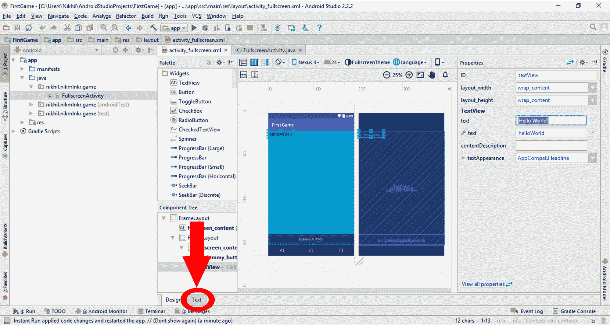

代码编辑的文本模式就在设计按钮旁边

现在，你实际上可以看到打开的 XML 代码：

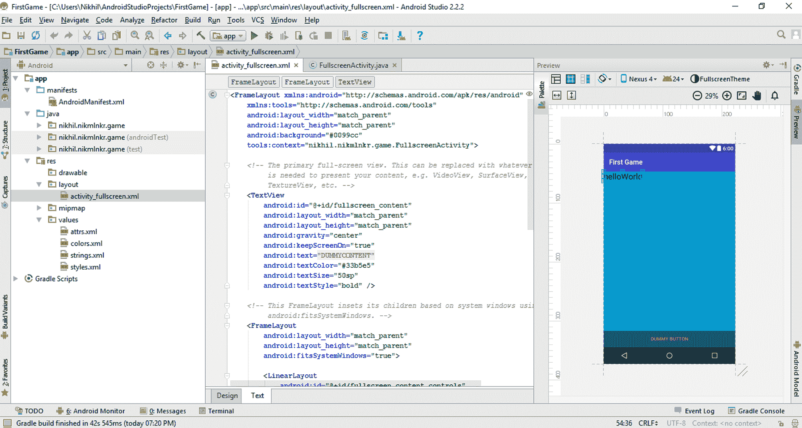

这是你的默认 XML 代码

仔细关注这段代码，你会发现如下内容：

```kt
<TextView
    android:text="Hello World!"
    android:layout_width="wrap_content"
    android:layout_height="wrap_content"
    android:id="@+id/TextView"
    tools:text="helloWorld"
    android:textAppearance="@style/TextAppearance.AppCompat.Headline" />

```

如果你看到这个，你可以在代码的第一行看到你的`Hello World!`文本。我们在上一章中通过视觉方式更改的数据可以通过代码在这里进行更改。对于所有组件来说，几乎都是一样的，随着你进一步练习，你将了解不同的组件。

现在，这并不是唯一的 XML 文件类型。正如我们在定义中读到的，XML 文件用于存储数据。让我们看看其他类型的 XML 文件，这些文件可以用来存储游戏得分、文件名、文本数据等等。让我们取一个这样的新类型的 XML 文件，它已经存在于我们的项目文件夹中，以便进一步了解：

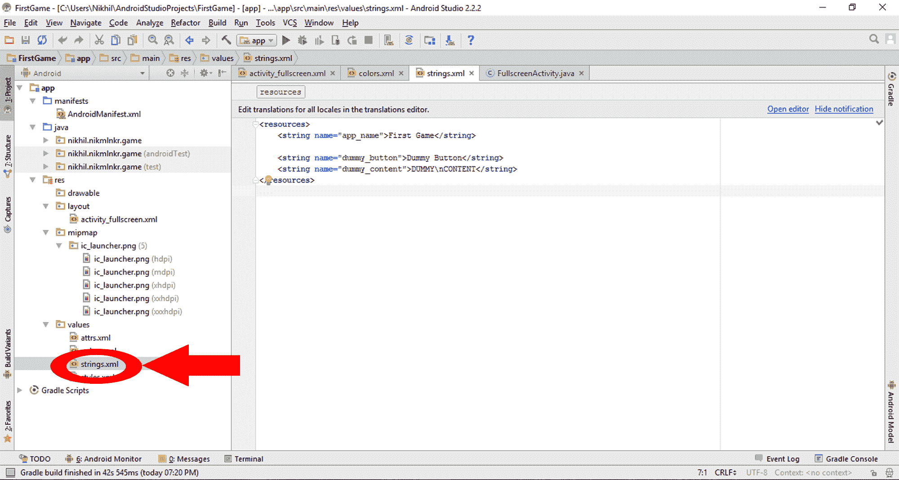

strings.xml 文件包含所有字符串数据，位于 res/values/ 文件夹中

导航到 `app/res/values/` 文件夹，并双击 `strings.xml` 文件。

当你打开这个文件时，你可以看到这个文件的代码。在这里，你可以观察到每个值都有多个值和一个以 `name` 形式的 ID。仔细观察第二行，如下所示：

```kt
<string name="app_name">First Game</string>

```

记住这个名字吗？我们在开始项目时将其设置为我们的应用程序名称。它存储在`app_name`的值中。另外，如果您回到`activity_fullscreen.xml`文件并使用*Ctrl* + *F*搜索`app_name`，您将找到此条目。您可以自己探索一下。

还要查看其他文件以了解情况。以下是项目文件夹中四个 XML 文件的基本说明：

+   `attrs.xml`：这声明了允许根据 API 级别更改按钮栏样式的自定义主题属性

+   `colors.xml`：这定义了可以使用十六进制代码使用的颜色

+   `strings.xml`：这包含所有字符串相关值的数据库

+   `styles.xml`：这设置了应用程序的基本主题

那么，关于 XML 文件的内容就到这里了。现在让我们继续到更有趣的部分——输入。

# 获取用户输入

您可以从 Android 设备获取输入的多种方式。以下是一些方法：

+   UI 按钮：绘制在您的应用程序 UI 上的按钮

+   硬件按钮：您的 Android 设备上的按键

+   触摸屏输入：基于屏幕坐标映射的触摸

+   加速度计读数：运动传感器读数

我们将查看每种输入类型。所以，让我们从第一种输入类型，UI 按钮开始。

# 按钮输入

按钮输入是 Android 项目中使用的最常见组件类型之一。让我们回到设计模式，并在屏幕上创建一个按钮：

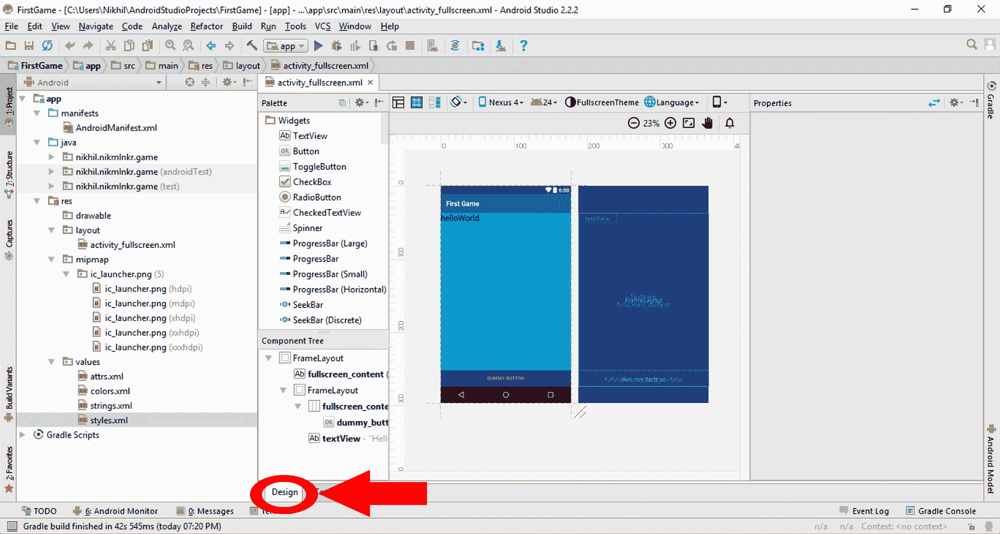

从文本模式恢复到设计模式

点击设计按钮，切换回我们的 activity_fullscreen.xml 文件上的视觉编辑模式。

在这里，我们需要对我们的 XML 文件进行一些更改。按照以下步骤操作：

1.  从调色板中向下滚动，找到线性布局（水平）并将其拖放到 fullscreen_content_controls 内部。

1.  在调色板下方拖动您的 TextView 到您刚刚创建的 LinearLayout（水平）下。

1.  从调色板中选择按钮组件并将其拖放到组件树窗口的 LinearLayout（水平）中。

完成此操作后，您将得到如下输出：

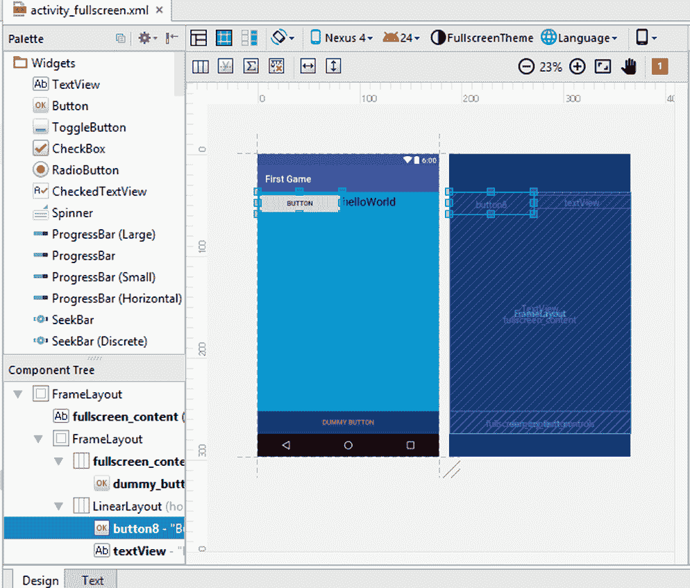

您现在屏幕上有一个按钮和文本。

如果我们没有使用线性布局组件，那么我们的按钮和文本将相互重叠，因为如果您观察组件树，我们的 TextView 最初是在 FrameLayout 内部，它没有对齐选项。您可以尝试将您的按钮和文本拖放到 FrameLayout 内部，自己看看。

现在，让我们继续制作这个按钮工作。点击您刚刚创建的按钮，在右侧的属性窗口中查看 ID 属性。这是让您的代码知道与哪个按钮交互的属性；将其更改为`myFirstButton`：

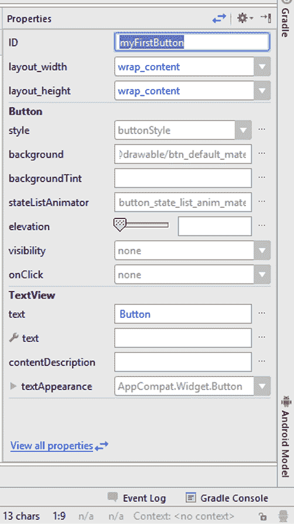

您现在已为您的按钮分配了一个自定义 ID。

对于 TextView，重复相同的步骤，将其 ID 更改为 `myTextView`。记住这两个 ID，然后继续我们的下一步。现在，我们将实际将这个视觉按钮链接到我们的代码中，以便我们可以更改 TextView 组件的文本。前往你的 `app/java/nikhil.nikmlnkr.game` 文件夹，并打开 FullscreenActivity。

注意，`nikhil.nikmlnkr.game` 是本书中使用的包名。你的包名可能因你最初设置的而不同，所以根据你的包名导航到文件夹。为了本书的目的，我们将假设包名是 `nikhil.nikmlnkr.game`。

打开该文件后，我们将打开应用程序的主 Java 代码。你可以看到那里已经写了很多代码。不要被它吓到，因为很快你就会自己理解每个代码块是关于什么的。让我们先编写一些自己的代码，以便开始将按钮链接到代码文件；搜索 `void onCreate` 函数。

`onCreate()` 方法是初始化你的活动的地方。如果活动被启动且应用程序未加载，则两个 `onCreate()` 方法都将被调用。你可以在这里初始化你的变量和方法。

你可以看到类似这样的内容：

```kt
    @Override
    protected void onCreate(Bundle savedInstanceState) {
        super.onCreate(savedInstanceState);

        setContentView(R.layout.activity_fullscreen);

        mVisible = true;
        mControlsView = findViewById
        (R.id.fullscreen_content_controls);
        mContentView = findViewById(R.id.fullscreen_content);

        // Manually show or hide the System UI
        mContentView.setOnClickListener(new View.OnClickListener(){
            @Override
            public void onClick(View view) {
                toggle();
            }
        });

        /* Upon interacting with UI controls, delay any scheduled hide() 
        operations to prevent the jarring behavior of controls going away while 
        interacting with the UI.*/

        findViewById(R.id.dummy_button).
        setOnTouchListener(mDelayHideTouchListener);
    }

```

现在，将其修改为看起来像这样；更改已用粗体标出：

```kt
    @Override
    protected void onCreate(Bundle savedInstanceState) {
        super.onCreate(savedInstanceState);

        setContentView(R.layout.activity_fullscreen);
 // Declare variable references for our TextView and Button with // their IDs final TextView tv = 
        (TextView)findViewById(R.id.myTextView); final Button button = 
        (Button) findViewById(R.id.myFirstButton);
 // Make an OnClickListener to listen to button click events button.setOnClickListener(new View.OnClickListener() { public void onClick(View v) { // Perform action on click
                tv.setText("Button Clicked");
 } });        mVisible = true;
        mControlsView = 
        findViewById(R.id.fullscreen_content_controls);
        mContentView = 
        findViewById(R.id.fullscreen_content);

        // Manually show or hide the System UI
        mContentView.setOnClickListener(new View.OnClickListener(){
            @Override
            public void onClick(View view) {
                toggle();
            }
        });

        // Upon interacting with UI controls, delay any scheduled hide()
        // operations to prevent the jarring behavior of controls going
        // away while interacting with the UI.

        findViewById(R.id.dummy_button).
        setOnTouchListener(mDelayHideTouchListener);
    }

```

通过编写此代码，你已经完成了以下操作：

+   将你的按钮 ID 链接到你的代码

+   将你的文本视图 ID 链接到你的代码

+   创建了一个按钮点击监听器，这是从按钮获取输入所必需的

准备好之后，按照我们在上一章中学到的步骤在模拟器上运行你的应用程序：

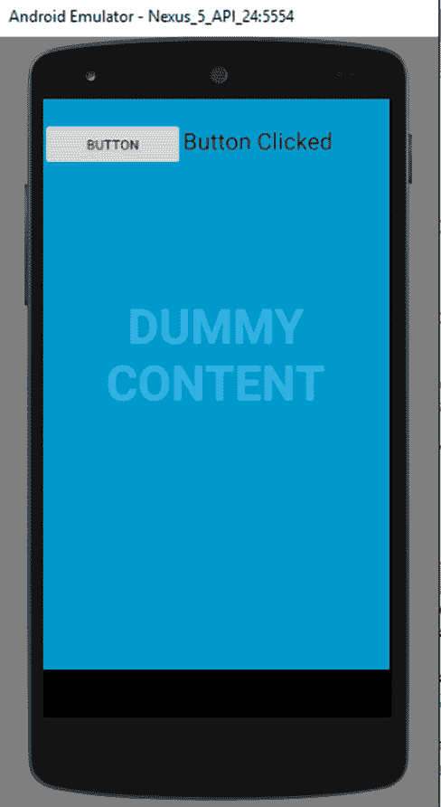

按下我们的按钮时，文本将更改为“Button Clicked”，正如我们在文件中编码的那样。

# 硬件按钮输入

现在，让我们测试一下我们的硬件按钮，并使用 Toast 示例。阅读 Toast 时不要感到饿！它不是你将要吃的那个。Toast 是一个在屏幕上显示几秒钟后消失的消息。你将在几分钟内看到它是什么。所以，现在打开你编写的 `FullscreenActivity.java` 文件，并在 `onCreate` 方法之后，输入以下内容：

```kt
    @Override
    public void onBackPressed() {
        // your code.
        Toast.makeText(FullscreenActivity.this, 
        "Back button pressed", Toast.LENGTH_SHORT).show();
    }

```

观察这里的代码。在第一行，我们使用了关键字 `@Override`。这是因为我们正在覆盖父类功能，这是 Android 默认行为，以便执行我们想要的另一项操作。如果你不覆盖该函数，那么默认情况下 Android 将关闭应用程序，因为这是返回按钮的功能。

如果你收到一个带有红色下划线的 Toast 错误，请点击你得到错误的地方，然后按 *Alt* + *Enter*。这将添加运行它所需的缺失导入。完成后，再次在模拟器上运行你的应用程序，你将看到以下输出：

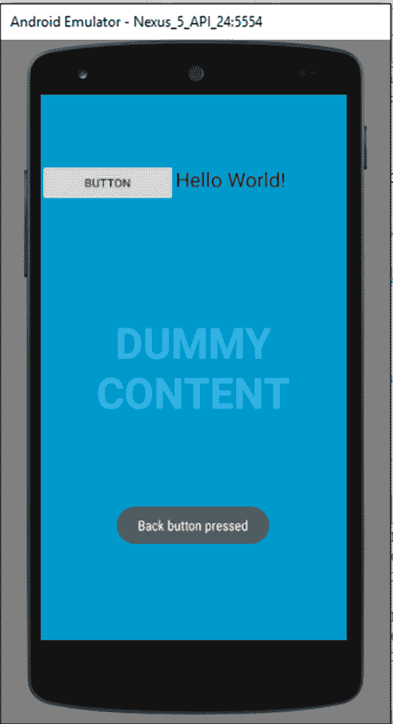

因此，现在你已经成功地将你的硬件按钮映射到显示 Toast 消息。太棒了！让我们继续前进，尝试跟踪我们的触摸坐标。

# 触摸输入

现在我们已经了解了如何映射我们的硬件按钮，让我们更深入地探讨 Android 中最常用的输入方式：触摸输入。然而，在我们理解触摸输入之前，我们必须了解用于跟踪屏幕上触摸的坐标系。让我们看一下下面的插图来理解这一点：

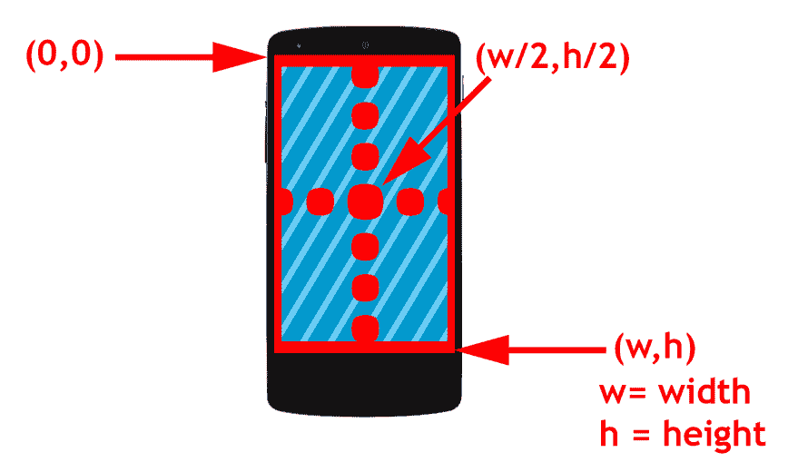

Android 中的坐标系

为了跟踪我们的触摸，我们必须对屏幕坐标如何在我们的设备上映射有一个基本的了解。正如你在前面的图像中看到的，我们的屏幕坐标从左上角的(0,0)开始，到右下角的**(w,h)**结束，其中 w 是屏幕宽度，h 是屏幕高度。所以，如果你的手机分辨率为 480 x 850，那么你的右下角坐标将是`w=480`，`h=850`。因此，你的极端坐标将被映射为(480,850)。只需记住这一点，你很快就会理解为什么我们需要知道这个。

现在，打开你的 XML 文件，并拖放另一个 TextView 组件：

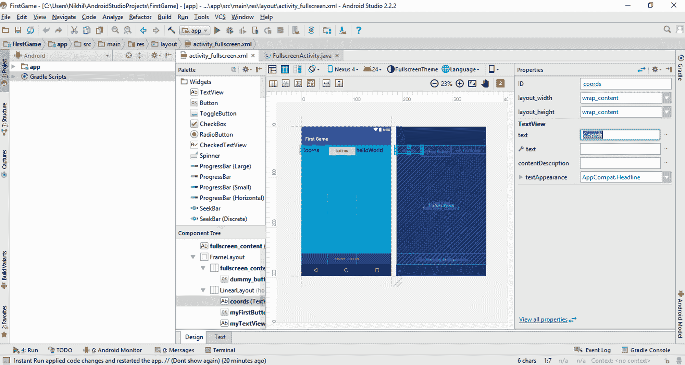

给它一个 ID `coords` 和文本 `Coords`：

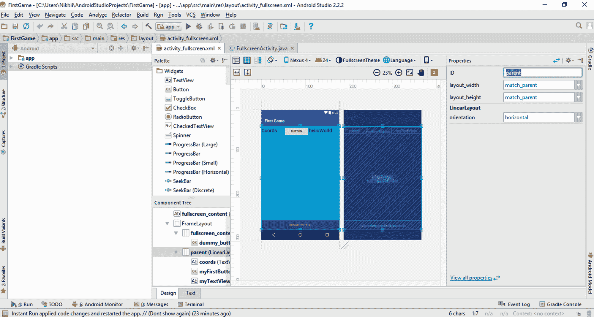

现在，点击组件树视图中的 LinearLayout，并给它一个 ID 为`parent`。

现在，前往你的`FullscreenActivity.java`代码文件，并修改你的`onCreate`函数，使其看起来像这样：

```kt
    @Override
    protected void onCreate(Bundle savedInstanceState) {
        super.onCreate(savedInstanceState);

        setContentView(R.layout.activity_fullscreen);
        final TextView tv = 
        (TextView) findViewById(R.id.myTextView);
        final Button button = 
        (Button) findViewById(R.id.myFirstButton);

        button.setOnClickListener(new View.OnClickListener() {
            public void onClick(View v) {
                // Perform action on click
                tv.setText("Button Clicked");
            }
        });
        mVisible = true;
        mControlsView =
        findViewById(R.id.fullscreen_content_controls);
        mContentView =
        findViewById(R.id.fullscreen_content);

        final LinearLayout parent = 
        (LinearLayout) findViewById(R.id.parent);

        final TextView text = (TextView) findViewById(R.id.coords);

        parent.setOnTouchListener(new View.OnTouchListener() {
            public boolean onTouch(View v, MotionEvent ev) {
                text.setText
                ("Touch at " + ev.getX() + ", " + ev.getY());
                return true;
        }
    });

    // Set up the user interaction to manually show or hide the system UI.
    mContentView.setOnClickListener(new View.OnClickListener() {
        @Override
        public void onClick(View view) {
            toggle();
        }
    });

    // Upon interacting with UI controls, delay any scheduled hide()
    // operations to prevent the jarring behavior of controls going
    // away while interacting with the UI.

    findViewById(R.id.dummy_button).
    setOnTouchListener(mDelayHideTouchListener);
    }

```

为了解释前面的代码，我们在这里所做的是相当简单的：我们为我们的 LinearLayout 声明了一个引用`parent`，然后为我们的新创建的 coords(TextView)声明了另一个引用。现在，在我们的声明之后，我们指示`parent`类在其上有一个`Touch listener`属性。这将帮助我们获取我们触摸的坐标。正如你在前面的代码中看到的，我们有一个`MotionEvent`变量`ev`，它将给我们坐标。然后，在下一条线中，我们以*x*和*y*坐标的形式获取了值，然后将其设置为 coords(TextView)上的文本。

现在运行你的代码，当模拟器启动时，尝试随机点击任何地方；这将给出你刚刚触摸的坐标：

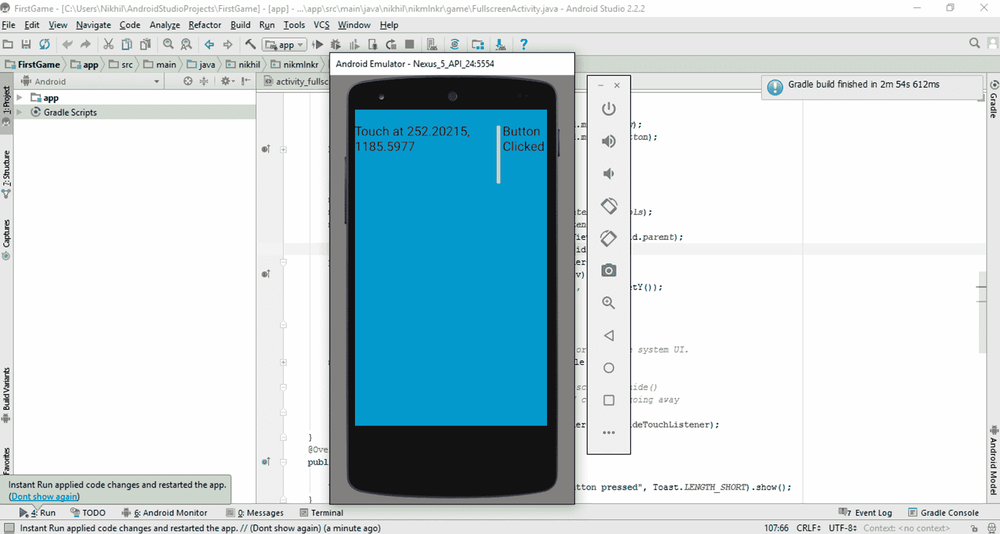

它将显示你在屏幕上触摸的位置。

现在，到这个时候，你必须已经注意到，拖放并正确对齐所有文本相当繁琐，对吧？这是因为我们正在使用 LinearLayout。有一种方法可以正确组织所有文本。那就是通过 RelativeLayout。让我们看看一个工作示例，帮助你更好地理解这一点。前往你的 XML 文件中的 TextView，就像我们在上一章中学到的那样，将你看到的 LinearLayout 更改为 RelativeLayout。以下是相应的参考代码：

```kt
<RelativeLayout
    android:orientation="horizontal"
    android:layout_width="match_parent"
    android:layout_height="match_parent"
    android:id="@+id/parent">

    <Button
        android:text="Button"
        android:layout_width="wrap_content"
        android:layout_height="wrap_content"
        android:id="@+id/myFirstButton"
        android:layout_weight="1" />

    <TextView
        android:text="Hello World!"
        android:layout_width="wrap_content"
        android:layout_height="wrap_content"
        android:id="@+id/myTextView"
        tools:text="helloWorld"
        android:textAppearance="@style/TextAppearance.AppCompat.Headline"
        android:layout_weight="1"
        android:layout_alignBaseline="@+id/myFirstButton"
        android:layout_alignBottom="@+id/myFirstButton"
        android:layout_toRightOf="@+id/myFirstButton"
        android:layout_toEndOf="@+id/myFirstButton" />

    <TextView
        android:text="Coords"
        android:layout_width="wrap_content"
        android:layout_height="wrap_content"
        android:id="@+id/coords"
        android:layout_weight="1"
        android:textAppearance="@style/TextAppearance.AppCompat.Headline"
        android:layout_below="@+id/myFirstButton"
        android:layout_alignRight="@+id/myFirstButton"
        android:layout_alignEnd="@+id/myFirstButton" />
</RelativeLayout>

```

现在，你已经成功地将你的 LinearLayout 转换为 RelativeLayout，这将为你提供更多的设计选项控制。你现在可以更轻松地调整屏幕上的组件，因此你可以将它们对齐如下：

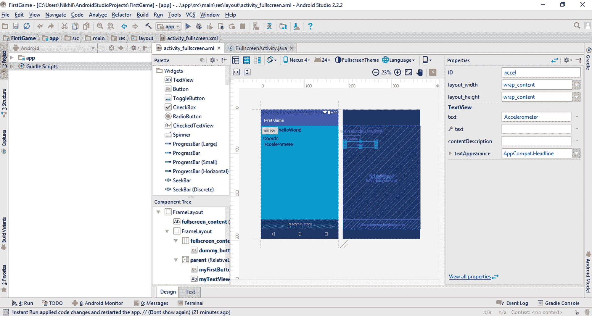

完成这些操作后，你可以轻松地通过简单地拖动它们到任何你想要的位置来调整你的文本。当你使用 RelativeLayouts 时，你不会弄乱布局。现在，让我们继续到下一个示例，获取加速度计输入，并在屏幕上选择另一个 TextView 组件，如前述代码所示，给它一个 ID `accel` 并设置文本为`加速度计`。然而，在我们继续相同的代码之前，我们需要在我们的现有代码中进行一个小的更改。

由于我们刚刚将我们的 LinearLayout 更改为 RelativeLayout，我们还需要在我们的 Java 代码文件中为我们的触摸功能引用相同的 RelativeLayout。打开你的 Java 代码文件，你将注意到它已经在 LinearLayout 上给出了错误提示。这是因为实际上在我们的项目中没有 ID 为 parent 的 LinearLayout，因为我们将其更改为 RelativeLayout。不过，不用担心这个问题；只需输入 RelativeLayout 而不是 LinearLayout，问题就解决了。以下是方法：

```kt
    @Override
    protected void onCreate(Bundle savedInstanceState) {
        super.onCreate(savedInstanceState);

        setContentView(R.layout.activity_fullscreen);
        final TextView tv = 
        (TextView) findViewById(R.id.myTextView);
        final Button button =
        (Button) findViewById(R.id.myFirstButton);

        button.setOnClickListener(new View.OnClickListener() {
            public void onClick(View v) {
                // Perform action on click
                tv.setText("Button Clicked");
            }
        });
        mVisible = true;
        mControlsView =
        findViewById(R.id.fullscreen_content_controls);

        mContentView = 
        findViewById(R.id.fullscreen_content);

        final RelativeLayout parent = 
        (RelativeLayout) findViewById(R.id.parent);

        final TextView text = 
        (TextView) findViewById(R.id.coords);
        parent.setOnTouchListener(new View.OnTouchListener() {
            public boolean onTouch(View v, MotionEvent ev) {
                text.setText
                ("Touch at " + ev.getX() + ", " + ev.getY());
                return true;
            }
        });

        // Set up the user interaction to manually show or hide the system UI.
        mContentView.setOnClickListener(new View.OnClickListener(){
            @Override
            public void onClick(View view) {
                toggle();
            }
        });

        // Upon interacting with UI controls, delay any scheduled hide()
        // operations to prevent the jarring behavior of controls going
        // away while interacting with the UI.

        findViewById(R.id.dummy_button).
        setOnTouchListener(mDelayHideTouchListener);
    }

```

运行你的应用一次，你就可以看到它现在看起来多么整洁：

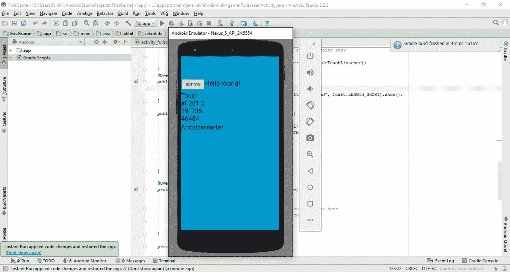

现在，我们已经成功地对我们的布局进行了相当整洁的调整，并实现了触摸监听器以检测触摸。

现在，我们继续本章的最后一个输入类型，*加速度计输入*。

# 加速度计输入

我们现在将查看 Android 上的加速度计组件。如果你不知道加速度计是什么，它是一种用于检测 Android 中运动的设备。用通俗易懂的话来说，我们可以称它为运动传感器。最好的例子是任何允许你根据手机运动来控制汽车的赛车游戏。这真的很有趣，你可以在后续章节中将运动应用到对象上，所以请确保你正确理解这一点。从`sensorManager`开始输入你看到的以下代码块：

```kt
    @Override
    protected void onCreate(Bundle savedInstanceState) {
        super.onCreate(savedInstanceState);

        setContentView(R.layout.activity_fullscreen);
        final TextView tv = 
        (TextView) findViewById(R.id.myTextView);

        final Button button = 
        (Button) findViewById(R.id.myFirstButton);

        button.setOnClickListener(new View.OnClickListener() {
            public void onClick(View v) {
                // Perform action on click
                tv.setText("Button Clicked");
            }
        });
        mVisible = true;
        mControlsView =
        findViewById(R.id.fullscreen_content_controls);
        mContentView =
        findViewById(R.id.fullscreen_content);

        final RelativeLayout parent =
        (RelativeLayout) findViewById(R.id.parent);

        final TextView text = 
        (TextView) findViewById(R.id.coords);

        parent.setOnTouchListener(new View.OnTouchListener() {
            public boolean onTouch(View v, MotionEvent ev) {
                text.setText
                ("Touch at " + ev.getX() + ", " + ev.getY());
                return true;
            }
        });
        SensorManager sensorManager = 
        (SensorManager) getSystemService(Context.SENSOR_SERVICE);
        Sensor sensor =
        sensorManager.getDefaultSensor(Sensor.TYPE_ACCELEROMETER);

        sensorManager.registerListener(new SensorEventListener() {
            @Override
            public void onSensorChanged(SensorEvent event) {

                float x = event.values[0];
                float y = event.values[1];
                float z = event.values[2];
                TextView acc = (TextView) findViewById(R.id.accel);
                acc.setText("x: "+x+", y: "+y+", z: "+z);

            }

            @Override
            public void onAccuracyChanged(Sensor sensor, 
            int accuracy){
            }
        }, sensor, SensorManager.SENSOR_DELAY_FASTEST);
        // Set up the user interaction to manually show or hide the system UI.
        mContentView.setOnClickListener(new View.OnClickListener(){
            @Override
            public void onClick(View view) {
                toggle();
            }
        });
        // Upon interacting with UI controls, delay any scheduled hide()
        // operations to prevent the jarring behavior of controls going 
        // away while interacting with the UI.

        findViewById(R.id.dummy_button).
        setOnTouchListener(mDelayHideTouchListener);
    }

```

再次，如果你在输入时遇到与导入语句相关的错误，请按 *Alt* + *Enter*，你将收到建议。从列表中选择相应的导入语句以解决错误。现在，代码将被解释。我们为 Android 的`sensorManager`组件创建了一个变量，该组件负责跟踪我们的`加速度计`值。正如你在其后的行中可以看到的，我们将传感器类型设置为`TYPE_ACCELEROMETER`。接下来，我们为我们的组件创建了一个另一个监听器，然后我们获取了`x`、`y`和`z`值。之后，我们简单地引用了 XML 文件中的 accel TextView 组件，并将其文本设置为显示这些值。

现在，很明显你无法在模拟器上看到加速度计值的变化，所以你将不得不在移动设备上测试它。然而，出于好奇，尝试在你的电脑上运行代码：

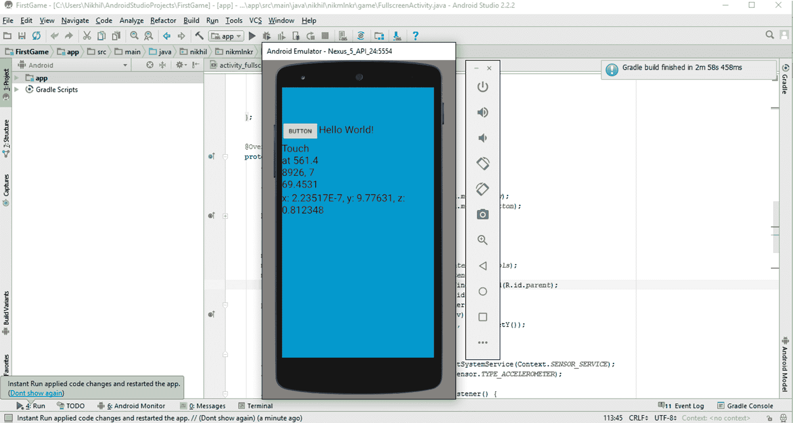

你会看到一些值，但它们不会变化，因为我们的 PC 没有运动传感器。

因此，现在让我们在我们的移动设备上运行我们的应用。我们可以用两种方式来做这件事：

+   通过 USB 直接构建和部署到我们的设备，这将允许我们在物理设备上直接运行应用

+   构建 apk 文件，然后将 apk 文件传输到我们的手机并安装它

让我们开始吧！

# 通过 USB 构建 和 部署

要使你的设备准备好调试，首先需要启用调试功能。为了在开发者选项中启用调试功能，需要访问这些设置，请打开系统设置中的开发者选项。在 Android 4.2 及更高版本中，开发者选项屏幕默认隐藏。要使其可见，请转到设置 | 关于手机，然后连续点击七次“构建号”：

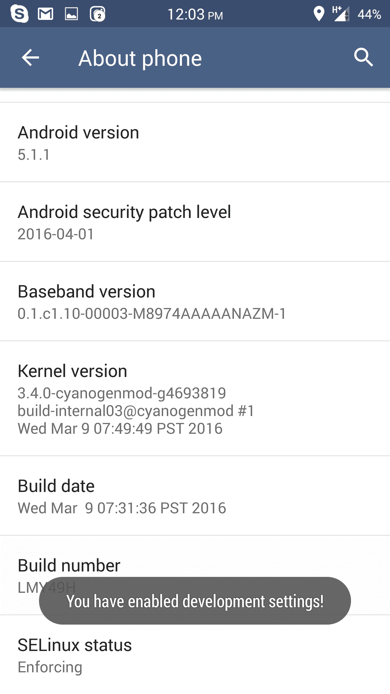

然后，返回上一屏幕，在底部找到开发者选项：

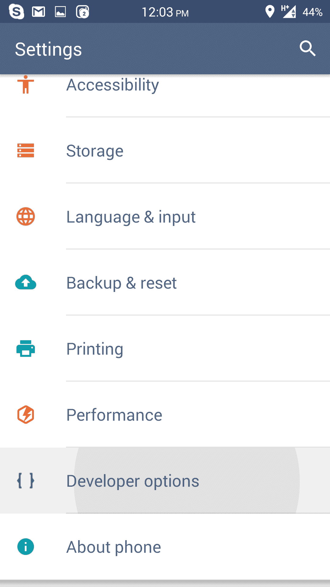

现在，在你的设备上启用 USB 调试选项：

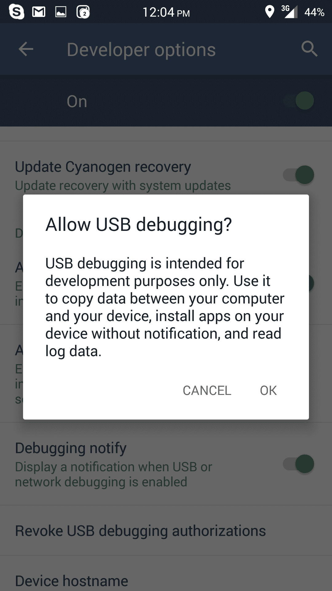

使用 Android 设备，你可以像在模拟器上一样开发和调试你的 Android 应用。在开始之前，只需做一些事情：

在你的清单文件或 `build.gradle` 文件中验证你的应用是否可调试。

在构建文件中，确保 `debug` 构建类型的 `debuggable` 属性设置为 true。构建类型属性会覆盖清单设置：

```kt
android {
    buildTypes {
        debug {
            debuggable true
        }

```

在 `AndroidManifest.xml` 文件中，将 `android:debuggable="true"` 添加到 `<application>` 元素中。

注意：如果你在清单文件中手动启用调试，确保你在发布构建中禁用它（你发布的应用通常不应该可调试）。

1.  在设备系统设置中，在设置 | 开发者选项下启用 USB 调试。

    注意：在 Android 4.2 及更高版本中，开发者选项默认隐藏。要使其可用，请转到设置 | 关于手机，然后连续点击七次“构建号”。返回上一屏幕以找到开发者选项。

1.  设置你的系统以检测你的设备：

    +   如果你在 Windows 上开发，你需要安装 ADB 的 USB 驱动程序。有关安装指南和 OEM 驱动程序的链接，请参阅[OEM USB 驱动程序](https://developer.android.com/tools/extras/oem-usb.html)文档。

    +   如果你正在 macOS X 上开发，它就会正常工作，所以跳过这一步。

    +   如果你正在 Ubuntu Linux 上开发，你需要添加一个 udev 规则文件，该文件包含你想要用于开发的每种设备的 USB 配置。在规则文件中，每个设备制造商由一个唯一的供应商 ID 标识，如 `ATTR{idVendor}` 属性所指定。有关供应商 ID 的列表，请参阅 [USB 供应商 ID](https://developer.android.com/studio/run/device.html#VendorIds)，如下所示。要在 Ubuntu Linux 上设置设备检测，请执行以下操作：

        1.  以 root 身份登录并创建此文件：`/etc/udev/rules.d/51-android.rules`。

            使用以下格式将每个供应商添加到文件中：

            `SUBSYSTEM=="usb", ATTR{idVendor}=="0bb4", MODE="0666", GROUP="plugdev"`

            在此示例中，供应商 ID 是为 HTC 设计的。MODE 分配指定了读写权限，GROUP 定义了哪个 Unix 组拥有设备节点。

            注意：规则语法可能因环境而略有不同。如有需要，请咨询您系统的 udev 文档。有关规则语法的概述，请参阅此指南 [编写 udev 规则](http://www.reactivated.net/writing_udev_rules.html)。

        1.  现在，执行 `chmod a+r /etc/udev/rules.d/51-android.rules`。

注意：当你将运行 Android 4.2.2 或更高版本的设备连接到计算机时，系统会显示一个对话框，询问是否接受允许通过此计算机进行调试的 RSA 密钥。这种安全机制保护用户设备，因为它确保除非你能够解锁设备并确认对话框，否则无法执行 USB 调试和其他 ADB 命令。这需要你有 ADB 版本 1.0.31（在 SDK 平台工具 r16.0.1 及更高版本中可用）才能在运行 Android 4.2.2 或更高版本的设备上进行调试。

当通过 USB 连接时，你可以通过执行 SDK 平台工具目录中的 ADB devices 来验证你的设备是否已连接。如果已连接，你将看到设备名称作为设备列出。

在运行或调试应用程序时，你将看到一个设备选择对话框，其中列出可用的模拟器（s）和连接的设备（s）。选择你想要安装和运行应用程序的设备。

如果使用 **Android 调试桥接**（**ADB**），你可以使用 `-d` 标志来针对你的连接设备发出命令。

你可以在 [`developer.android.com/studio/run/device.html`](https://developer.android.com/studio/run/device.html) 找到供应商 ID。

# 构建 apk 并在设备上安装

从顶部的任务栏，你看到文件、编辑等，点击构建，然后点击生成 APK。完成此操作后，它将开始为你生成 apk。完成后，右键单击左侧可见的应用程序文件夹，然后点击在资源管理器中显示：

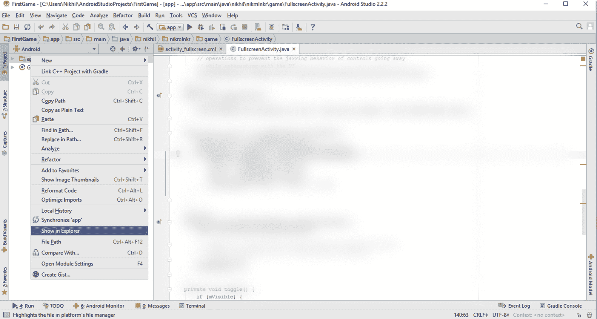

在资源管理器中显示将打开包含你的项目文件夹的窗口：

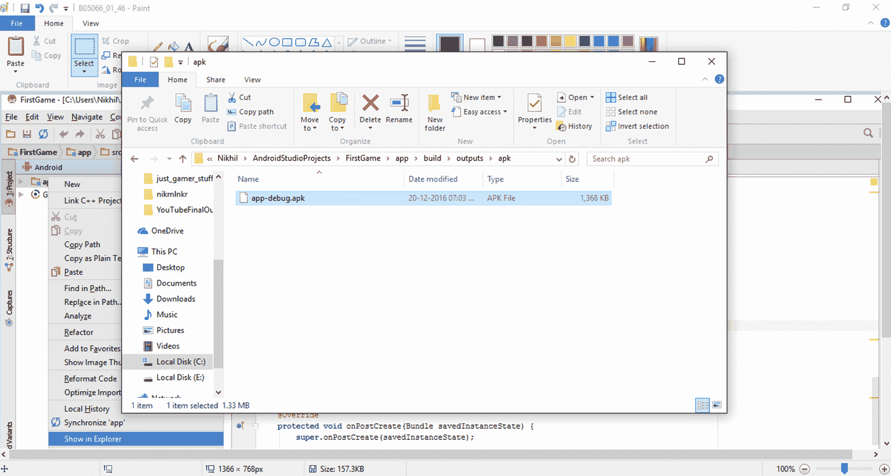

在你的项目文件夹中，导航到`app/build/outputs/apk/`文件夹，在那里你会看到你的`app-debug.apk`文件。将这个文件传输到你的手机上，安装 apk 并运行它：

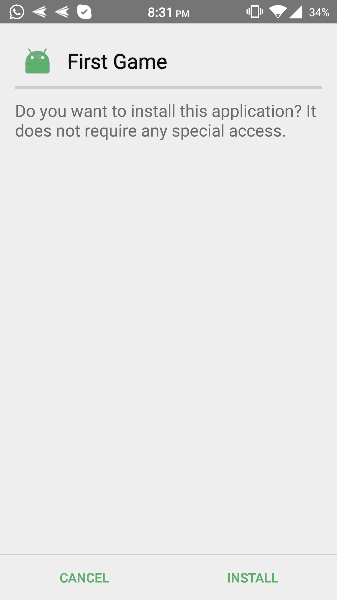

点击“安装”：

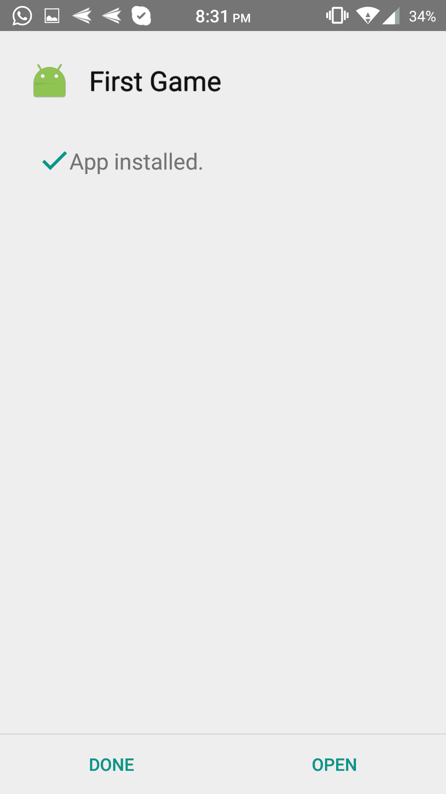

点击“打开”：

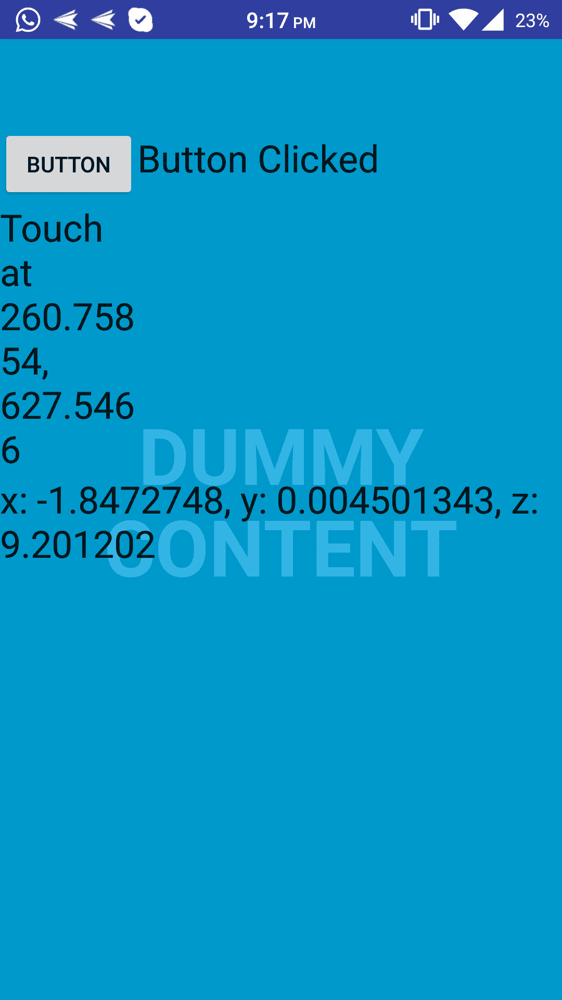

当你移动手机时，加速度计的值将会改变。

恭喜！你也学会了如何创建 apk 并在你的实际设备上运行它。

# 摘要

在本章中，你学习了如何接收不同类型的用户输入，以及如何生成 apk 并在你的实际设备上运行它。你还学习了各种类型的 XML 文件。

在下一章中，我们将学习如何创建精灵——不，不是冷饮！我们将学习如何创建图像以及如何玩转颜色。下一章将是我们进入屏幕图形创作的起点，对你来说将是一个巨大的进步。
