# 创建精灵和交互对象

我们已经几乎学到了创建 Android 中各种组件所需的所有基础知识，因此我们现在可以继续做一些更有趣的事情。现在，在这个阶段，我们将开始制作一个真正的 2D 游戏。它将是一个类似于马里奥的小型 2D 横版滚动游戏。然而，在我们这样做之前，让我们首先谈谈游戏作为一个开发概念。为了更好地了解游戏，你需要了解一点**博弈论**。所以，在我们继续创建屏幕上的图像和背景之前，让我们深入探讨一些博弈论。以下是本章我们将涵盖的一些主题列表：

+   博弈论

+   使用颜色

+   在屏幕上创建图像

+   制作连续滚动的背景

让我们从第一个开始。

# 博弈论

如果你仔细观察游戏的源代码，你会注意到游戏只是一系列错觉，用于创建某些效果并在屏幕上显示。也许，最好的例子就是我们即将开发的这个游戏。为了使你的角色向前移动，你可以做以下两件事之一：

+   让角色向前移动

+   让背景在后面移动

让我们更详细地看看这个。前两点可以通过一些错觉来实现；让我们了解如何。

# 幻觉

上一节中提到的任何两种东西都会给你一种错觉，即角色正在向某个方向移动。如果你正确地记得马里奥，那么你会注意到云彩和草地是相同的，只是它们的颜色改变了。这是因为当时控制台平台的内存限制：

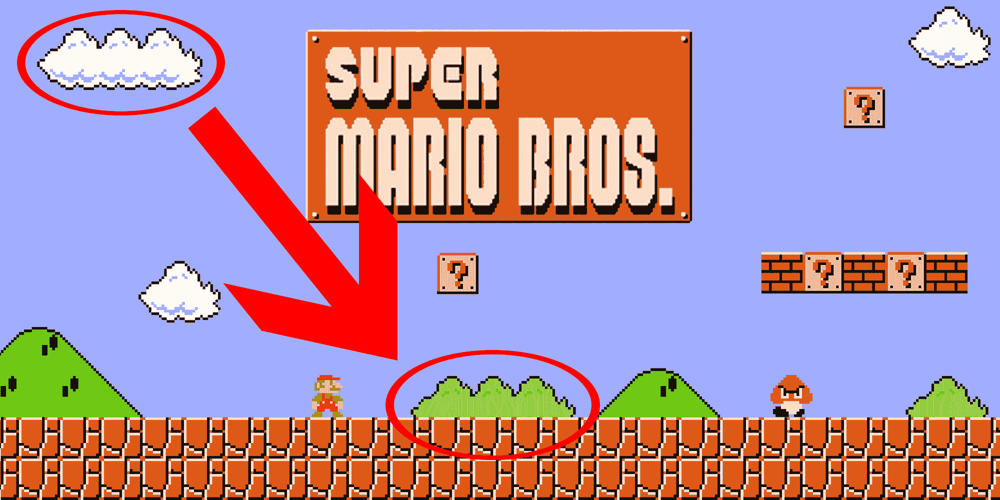

游戏开发者使用许多这样的**技巧**来确保他们的游戏能够运行。当然，在当今时代，我们不必过于担心内存限制，因为我们的移动设备具有阿波罗 11 号火箭的能力，它曾在月球上着陆。现在，考虑到提到的两种情况；我们将在我们的游戏中使用其中之一来使我们的角色移动。

我们还必须理解，每个游戏都是一个活动的循环。与应用程序不同，你需要在每一帧上绘制你的游戏资源。移动或其他效果的错觉将随着移动设备每秒可以绘制的帧数增加而变得更强烈。这个概念被称为**每秒帧数**（**FPS**）。它几乎与旧电影的概念相似，其中一大块胶片通过每帧滚动来在屏幕上投影。看看下面的截图，以更好地理解这个概念：

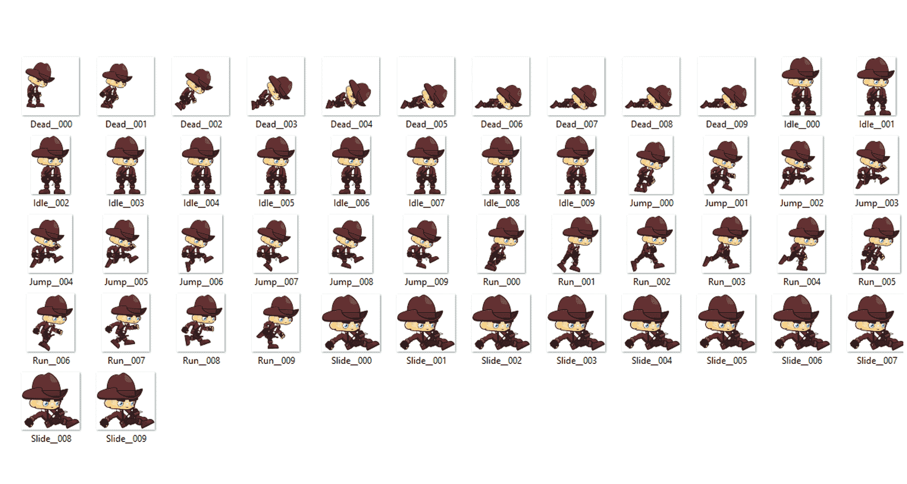

游戏角色的精灵图集

自从上一章以来，你可能一直在想精灵是什么意思，如果不是流行的冷饮。正如你在前面的屏幕截图中所见，精灵图集只是一个由多个图像组成的图像，这些图像本身又包含多个图像，以创建动画，因此精灵只是一个图像。如果我们想让我们的角色跑步，我们只需简单地读取文件`Run_000`并按顺序播放到`Run_009`，这样角色看起来就像是在跑步。我们将在*第五章*“为你的游戏添加动画”中查看这一点，我们将继续进行。

当你制作游戏时，你将处理的大多数事情都将基于操纵你的移动。因此，你需要清楚你的坐标系，因为它会很有用——无论是从枪中发射子弹、角色移动，还是简单地转身四处张望——所有这些都基于简单的移动组件。

# 游戏循环

在其核心，每个游戏基本上都是一个事件的循环。它是一组调用各种函数和代码块以在屏幕上执行绘制调用的设置，从而使游戏可玩。大多数情况下，你的游戏由三个部分组成：

+   初始化

+   更新

+   绘制

初始化游戏意味着为你的游戏设置一个入口点，通过这个入口点可以调用其他两个部分。你的游戏从这里开始，并且只调用一次。

一旦你的游戏初始化，你需要开始调用你的事件，这些事件可以通过你的`update`函数进行管理。

`draw`函数负责在屏幕上绘制所有图像数据。屏幕上显示的所有内容，包括你的背景、图像，甚至是你的 GUI，都是`draw`方法的职责。

至少可以说，你的游戏循环是游戏的核心。这只是一个游戏循环的基本概述，你还可以添加更多复杂性。然而，目前，这些信息已经足够你开始。

以下图像完美地说明了什么是游戏循环：

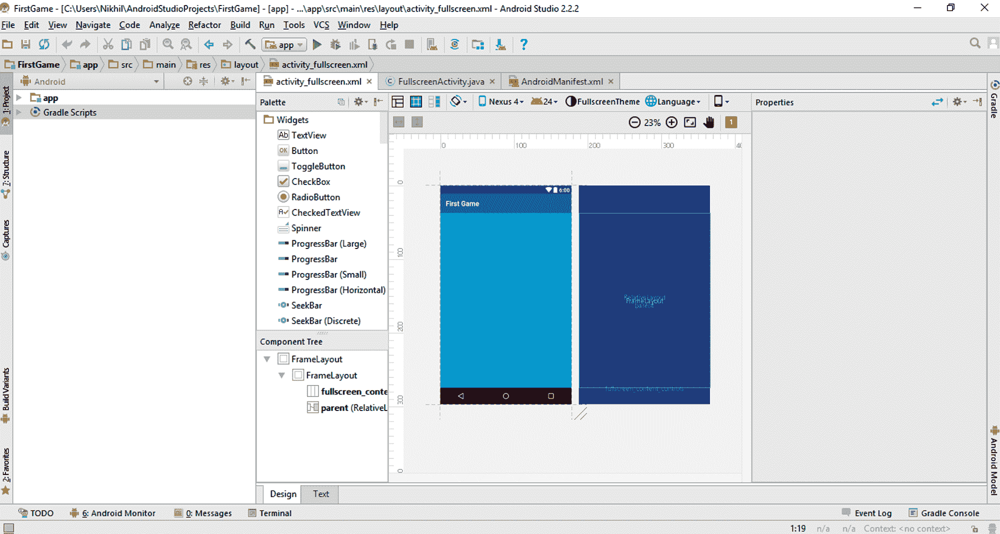

图片来源：[`gamedevelopment.tutsplus.com/articles/gamedev-glossary-what-is-the-game-loop--gamedev-2469`](https://gamedevelopment.tutsplus.com/articles/gamedev-glossary-what-is-the-game-loop--gamedev-2469)

# 游戏设计文档

在开始游戏之前，创建一个**游戏设计文档（GDD）**是至关重要的。这份文档是你将要制作的游戏的基础。总的来说，当我们开始制作游戏时，有 99%的时间我们会失去对计划的功能的跟踪，并偏离核心游戏体验。因此，始终建议有一个 GDD，以便保持专注。GDD 包括以下内容：

+   游戏玩法机制

+   故事（如果有）

+   关卡设计

+   声音和音乐

+   UI 规划和游戏控制

你可以通过以下链接了解更多关于游戏设计文档的信息：

[游戏设计文档](https://en.wikipedia.org/wiki/Game_design_document)

# 原型设计

在制作游戏时，我们需要同时进行测试。游戏是最复杂的软件之一，如果我们在一部分出错，可能会破坏整个游戏。这个过程可以称为**原型设计**。制作游戏的原型是游戏最重要的方面之一，因为这是你测试游戏基本机制的地方。原型应该是具有基本功能的一个简单的工作模型，也可以称为游戏的**简化版本**。

# 表面和画布

我们看到了如何使用从我们的 Android 应用调色板中的组件创建图像和按钮。然而，在游戏中，这个概念略有不同。在游戏中，我们与一个称为**画布**的东西一起工作，它用于在**表面**上绘制图像。为了给你一个基本的概念，表面是任何在其上持有像素的东西。基本上，表面持有你的画布，然后将其映射到视图上。所有的图像操作都是基于这个。因此，为了在游戏中绘制任何东西，我们将使用`SurfaceView`组件。

# 处理颜色和图像

现在我们已经学习了这些概念，并且对在 Android Studio 上的工作有了了解，我们可以开始从头开始制作我们的游戏。让我们清除`activity_fullscreen.xml`文件中的所有按钮和文本视图，并从我们的 Java 代码中移除所有引用，使其看起来大致如下：


看看你调色板下面的组件树窗口，以获得适当的参考：

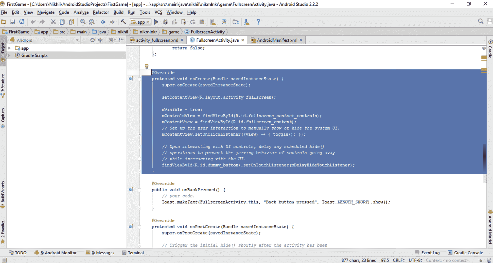

注意，此时我们回到了应用的原点。

完成这些后，只需运行并测试你的应用一次，检查是否有任何错误；如果没有，则继续进行。现在我们将看看如何使用十六进制颜色代码创建基本颜色，然后继续创建背景以及其他组件的图像。

# 创建颜色

这相当简单，我们也在上一章中看到了这一点。只需前往位于`app/res/values/`文件夹中的`colors.xml`文件。在这里，你可以观察到多个十六进制颜色代码值。十六进制颜色代码代表一个六位数的字母数字值，负责赋予颜色。值从**#000000**（黑色）到**#ffffff**（白色）。

在我们的`colors.xml`中，如果你观察，可以看到已经预定义了值，如下面的截图所示：

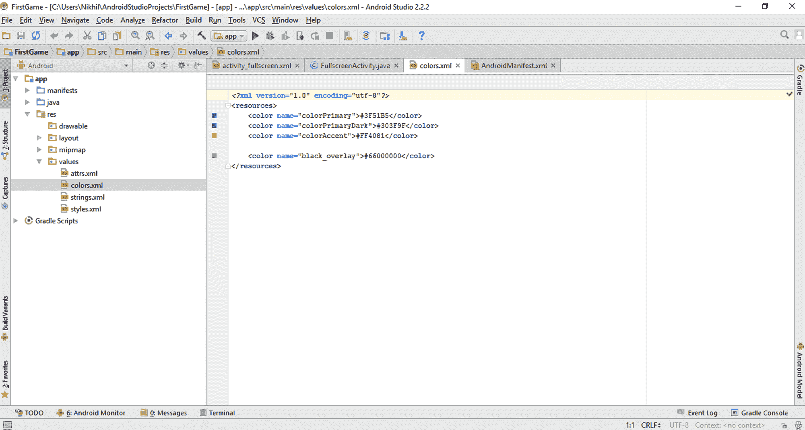

十六进制颜色代码值

在这个文件中，你可以调整这些值，或者简单地添加你自己的值。比如说，如果你想添加红色，你只需将以下行添加到这段代码中，以获取红色值：

```kt
<color name="red">#ff0000</color>

```

如果您仔细观察语法，您会注意到这个十六进制代码的格式为`RRGGBB`，这意味着前两个字母数字组成红色成分，第二个两个数字对应绿色，最后两个数字对应蓝色。此外，使用名称字段，您可以在任何组件中使用这种颜色，就像我们在背景中所做的那样。现在，尝试调整`colorPrimary`中的某些值，看看会发生什么变化。

此外，请注意，在十六进制颜色代码中，我们只能使用 0-9 的数字和 a-f 的字符。因此，如果您使用类似于#99z9pt 的东西，那么它不会产生任何颜色或数字输出。尝试这样做，以便您对这种颜色代码概念有更清晰的理解。

这就是 Android Studio 中关于颜色的全部内容。您可以使用它们在背景、表面等地方使用您对 XML 文件的理解，就像我们在前面的章节中看到的那样，或者您也可以从 Java 代码中程序化地设置它们。现在，让我们继续到最有趣的部分，即处理图像。

# 创建图像

我们已经查看了一个 Android 项目的项目结构。因此，到现在我们已经清楚代码文件和资源放置的位置的区别。图像是资源，因此它们可以放在 Android Studio 项目的`res`文件夹或 AssetManager 中，但更具体地说，我们不能仅仅将它们放在`res`文件夹中。

按照惯例，有一个专门用于图像资源的特定文件夹，即`drawable`文件夹。您可以在`app/res/drawable`中找到此文件夹。如果您看不到它，则可以通过在`res`文件夹上右键单击并选择“新建 | Android 资源目录”，然后在“资源类型”中选择`drawable`来手动创建它。如果您的文件夹中已经存在`drawable`文件夹，则无需这样做：

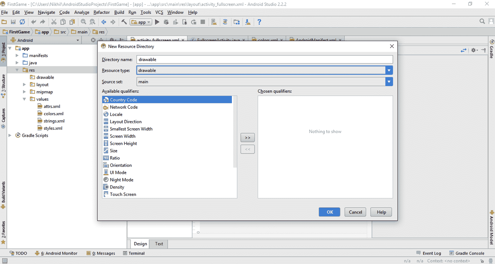

创建 drawable 文件夹

此文件夹包含项目中所有图像资源，包括资源，如背景图片、图标和精灵图集。为了本游戏的目的，我们将所有图像资源放入`drawable`文件夹。现在我们将创建一个背景图片，在下一章中，我们将学习如何在上面的图片上放置另一张图片。完成这些后，我们将在背景上创建一个新的`OnClickListener`，以便更改图片。因此，我们需要三个图像资源。让我们称它们为以下：

+   `background_image`

+   `image_1`

+   `image_2`

对于本章，我们已选取以下库存图片。您可以根据自己的需要自由选择任何图片。

`background_image`：以下是我们游戏将使用的背景图片：

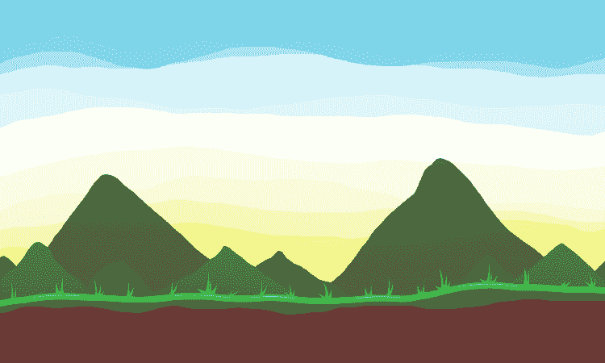

`image_1`：以下是我们玩家的一个帧：

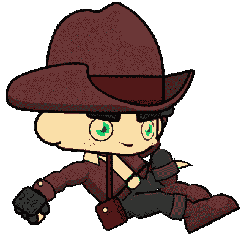

`image_2`：以下是我们角色的另一个图像帧：

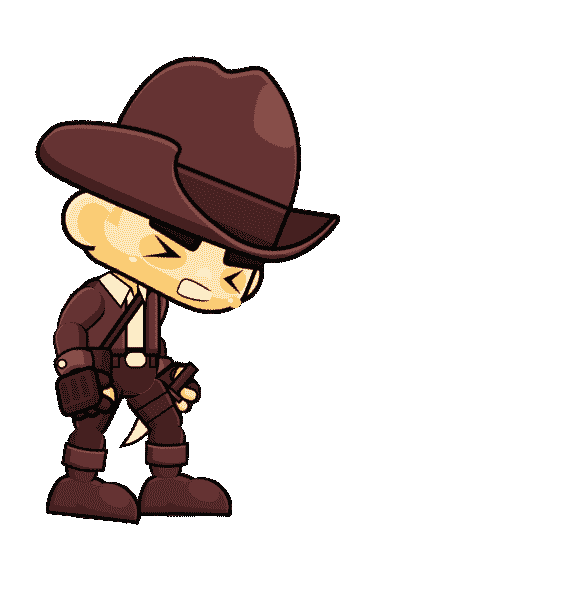

因此，我们将在`background_image`的上方放置`image_1`。当我们点击`image_1`时，它将转换为`image_2`。让我们获取一些库存图片资源并将它们放入我们的`res/drawable`文件夹中。为此，只需在你想放入`drawable`文件夹的任何图片上右键单击并选择复制：

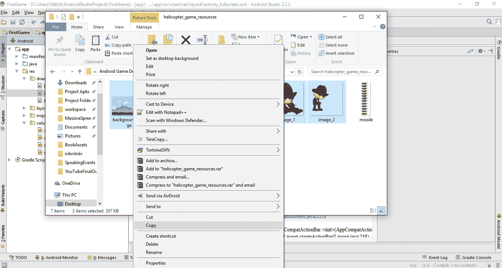

然后，在 drawable 文件夹上右键单击并选择粘贴：

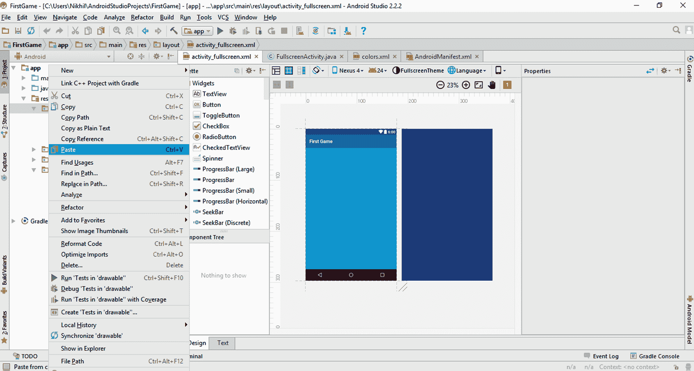

然后，你会弹出一个对话框。点击“确定”以成功将你的图片资源导入到你的`project`文件夹中。

现在我们已经放置了图像资源，是时候将它们显示在我们的屏幕上了。你可以立即通过获取一个 ImageView 组件并将其属性设置为你的期望图片来实现这一点，但由于我们正在制作游戏，我们将采用*Canvas 方式*。为此，首先我们需要替换我们`FullscreenActivity.java`中的全部 Java 代码，使其看起来像这样：

```kt
package nikhil.nikmlnkr.game;

import android.os.Bundle;
import android.view.Window;
import android.view.WindowManager;
import android.app.Activity;

public class FullscreenActivity extends Activity{
    @Override
    protected void onCreate(Bundle savedInstanceState) {
        super.onCreate(savedInstanceState);
 //Set our game to full screen mode
        getWindow().setFlags
        (WindowManager.LayoutParams.FLAG_FULLSCREEN,
        WindowManager.LayoutParams.FLAG_FULLSCREEN);

 //Set no title on screen
        requestWindowFeature(Window.FEATURE_NO_TITLE);

 setContentView(new GameView(this));
    }
}

```

你需要在现有代码中做的所有更改都已用**粗体**标出。

注意这里我们已经消除了所有切换状态栏的功能，只保留了我们的`onCreate`方法。我们还用`getWindow().setFlags(WindowManager.LayoutParams.FLAG_FULLSCREEN, WindowManager.LayoutParams.FLAG_FULLSCREEN);`手动将游戏设置为全屏模式。我们还用`requestWindowFeature(Window.FEATURE_NO_TITLE);`代码消除了标题屏幕窗口。现在，注意这里你会在你的`GameView(this)`代码上得到一个错误。这是因为我们还没有创建我们的`GameView`类。所以，让我们先创建这个类，但在那之前，让我们在我们的清单文件中做一个小的修改。

打开位于`app/manifests/`文件夹中的`AndroidManifest.xml`文件。在你的`<activity>`代码中，添加方向为横屏，如下所示：

```kt
<?xml version="1.0" encoding="utf-8"?>
<manifest xmlns:android="http://schemas.android.com/apk/res/android"
    package="nikhil.nikmlnkr.game">

    <application
        android:allowBackup="true"
        android:icon="@mipmap/ic_launcher"
        android:label="@string/app_name"
        android:supportsRtl="true"
        android:theme="@style/AppTheme">
        <activity
            android:screenOrientation="landscape"
            android:name=".FullscreenActivity"
            android:configChanges="orientation
            |keyboardHidden|screenSize"
            android:label="@string/app_name"
            android:theme="@style/FullscreenTheme">
            <intent-filter>
                <action android:name="android.intent.action.MAIN" />

                <category android:name=
                "android.intent.category.LAUNCHER" />
            </intent-filter>
        </activity>
    </application>

</manifest>

```

这将明确告诉应用程序我们的游戏处于横屏模式。

现在，让我们继续并创建我们的`GameView`类。要做到这一点，只需在你的`app/java/packagename`文件夹上右键单击并选择新建 | Java 类，如下所示：

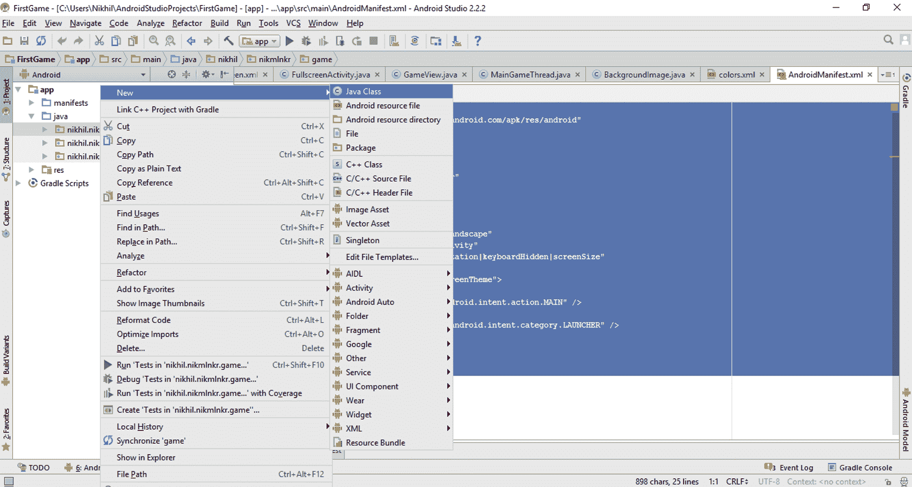

在这样做之后，将打开一个新窗口，询问你想要创建的新类的详细信息。只需在名称文本框中输入`GameView`并按 OK 继续，如图所示：

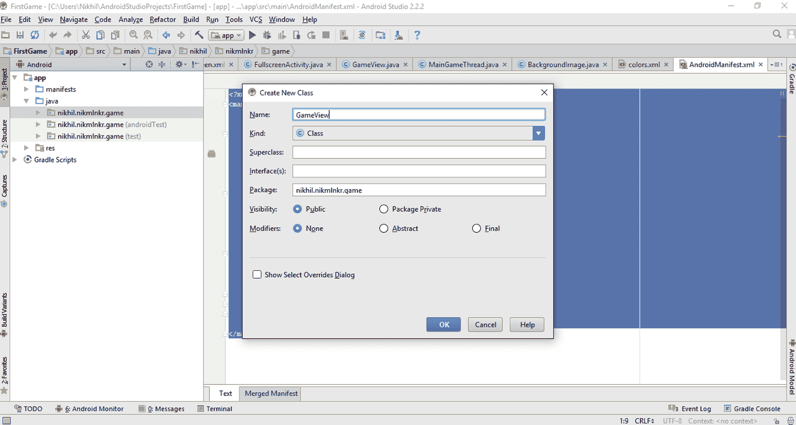

我们需要再创建两个类来设置我们的侧滑背景图片，所以重复同样的步骤，创建以下两个类：

+   `BackgroundImage`

+   `MainGameThread`

因此，现在你的项目中总共有四个类：

+   `BackgroundImage`

+   `FullscreenActivity`

+   `GameView`

+   `MainGameThread`

我们的目的是在屏幕上有一个背景图片，它会连续滚动通过我们的视图。让我们首先打开我们的`BackgroundImage.java`文件，并在其中写入以下代码：

```kt
package nikhil.nikmlnkr.game;

import android.graphics.Bitmap;
import android.graphics.Canvas;

public class BackgroundImage {

    private int xc, yc, dxc;
    private Bitmap backgroundImage;

    public BackgroundImage(Bitmap res)
    {
        backgroundImage = res;
    }

    public void setVector(int dxc)
    {
        this.dxc = dxc;
    }

    public void update()
    {
        xc += dxc;
        if(xc < -GameView.WIDTH){
            xc=0;
        }
    }

    public void draw(Canvas canvas)
    {
        canvas.drawBitmap(backgroundImage, xc, yc,null);
        if(xc < 0)
        {
            canvas.drawBitmap
            (backgroundImage, xc + GameView.WIDTH, yc, null);
        }
    }
}

```

让我们尝试理解这段代码。我们在这里简单地创建了一个类，以下是类中每个代码块的逐步分解：

1.  我们导入了 Bitmap 和 Canvas，这是进行图像和画布操作所需的。

1.  我们声明了私有变量`xc`、`yc`和`dxc`，它们分别是*x*、*y*坐标和*x*方向的位移。这些变量的默认值将是零，因为我们还没有初始化它们。

1.  然后，我们声明了一个私有的 Bitmap 变量，它将保存要显示在屏幕上的实际图像文件。

1.  接下来，我们为我们的类创建了一个构造函数，这样我们就可以通过 res 引用将其传递进去，并在构造函数中，我们将这个引用与步骤 3 中声明的背景图像变量相等。

1.  我们创建了一个向量位移方法，以便将单位向量添加到图像的位置值中，使其移动。

1.  然后，我们使用了每次都会被调用的更新方法，并将所有的位移和重置逻辑放入其中。如果图像超出我们的屏幕，我们就将位置重置为 0，以产生连续移动的效果。

1.  现在，如果你还记得，我们在开始时讨论过，为了在屏幕上绘制任何东西，你需要一个画布。因此，使用 draw 方法，我们将画布作为一个引用变量，并将我们的绘制逻辑包含在其中。注意，我们在这里绘制了两次背景图像。这是因为如果我们的图像持续滚动，中间将会有一个空白区域，它将显示为黑色，所以我们使用相同的图像，并在屏幕上稍微远离主图像的位置绘制两次，以产生连续循环的效果。为了理解这个活生生的例子，你可以尝试移除`canvas.drawBitmap()`代码中的任何一个，自己看看效果。

这就是`BackgroundImage.java`文件的内容。到这时，你可能在你的`GameView.WIDTH`代码上遇到一些错误。不要担心，我们稍后会解决它。在解决这个错误之前，我们必须首先设置我们的游戏线程，因为所有的更新函数都将从我们的线程中调用。我们的`MainGameThread.java`文件的目标如下：

+   对更新函数进行连续调用

+   以每秒帧数为基础进行性能评估

因此，打开你的`MainGameThread.java`文件，并输入以下内容：

```kt
package nikhil.nikmlnkr.game;
import android.graphics.Canvas;
import android.view.SurfaceHolder;

public class MainGameThread extends Thread
{
    private int framesPerSecond = 30;
    private double averageFPS;
    private SurfaceHolder surfaceHolder;
    private GameView gameView;
    private boolean running;
    public static Canvas canvas;

    public MainGameThread(SurfaceHolder surfaceHolder, GameView 
    gameView){
        super();
        this.surfaceHolder = surfaceHolder;
        this.gameView = gameView;
    }

    public void setRunning(boolean b){
        running=b;
    }

    @Override
    public void run(){
        long startTime;
        long timeMillis;
        long waitTime;
        long totalTime = 0;
        int frameCount =0;
        long targetTime = 1000/framesPerSecond;

        while(running) {
            startTime = System.nanoTime();
            canvas = null;

            //try locking the canvas for pixel editing
            try {
                canvas = this.surfaceHolder.lockCanvas();
                synchronized (surfaceHolder) {
                    this.gameView.update();
                    this.gameView.draw(canvas);
                }
            } catch (Exception e) {
            }
            finally{
                if(canvas!=null)
                {
                    try {
                        surfaceHolder.unlockCanvasAndPost(canvas);
                    }
                    catch(Exception e){e.printStackTrace();}
                }
            }
            timeMillis = (System.nanoTime() - startTime) / 1000000;
            waitTime = targetTime-timeMillis;

            try{
                this.sleep(waitTime);
            }catch(Exception e){}

            totalTime += System.nanoTime()-startTime;
            frameCount++;
            if(frameCount == framesPerSecond){
                averageFPS = 1000/((totalTime/frameCount)/1000000);
                frameCount = 0;
                totalTime = 0;
                System.out.println(averageFPS);
            }
        }
    }
}

```

在我们的`MainGameThread.java`文件中，我们做了以下操作：

1.  我们创建了运行线程所需的所有变量。

1.  我们为`MainGameThread`文件创建了一个构造函数，通过传入`SurfaceHolder`和`GameView`引用，并将它们的引用设置为`this`文件。

1.  我们创建了一个方法来跟踪我们的运行线程，它有一个布尔值返回值。

1.  我们重写了线程的默认`run`方法，使其执行我们需要的特定操作：

    1.  我们使用 surfaceholder 变量来操作图像的像素数据。

    1.  我们计算每秒的帧数。

    1.  我们计算每秒的平均帧数，并在控制台视图中显示它。

通过这样做，我们现在已经准备好了我们的线程类，最后只剩下我们的`GameView`类。在我们的`GameView`中，我们将实际上把我们在屏幕上构建的所有图像数据放上去并显示出来。所以，让我们打开`GameView.java`文件并开始输入以下内容：

```kt
package nikhil.nikmlnkr.game;

import android.content.Context;
import android.graphics.BitmapFactory;
import android.graphics.Canvas;
import android.view.MotionEvent;
import android.view.SurfaceHolder;
import android.view.SurfaceView;

public class GameView extends SurfaceView implements SurfaceHolder.Callback {
    public static final int WIDTH = 1920;
    public static final int HEIGHT = 1080;
    private MainGameThread mainThread;
    private BackgroundImage bgImg;

    public GameView(Context context){
        super(context);

        //set callback to the surfaceholder to track events
        getHolder().addCallback(this);

        mainThread = new MainGameThread(getHolder(), this);

        //make gamePanel focusable so it can handle events
        setFocusable(true);
    }

    @Override
    public void surfaceChanged(SurfaceHolder holder, int format, 
    int width, int height){}

    @Override
    public void surfaceDestroyed(SurfaceHolder holder){
        boolean retry = true;
        while(retry){
            try{
                mainThread.setRunning(false);
                mainThread.join();
            }catch(InterruptedException e){e.printStackTrace();}
            retry = false;
        }

    }

    @Override
    public void surfaceCreated(SurfaceHolder holder){

        bgImg = new BackgroundImage(BitmapFactory.decodeResource
        (getResources(), R.drawable.background_image));
        bgImg.setVector(-5);

        //we can safely start the game loop
        mainThread.setRunning(true);
        mainThread.start();

    }
    @Override
    public boolean onTouchEvent(MotionEvent event){
        return super.onTouchEvent(event);
    }

    public void update(){
        bgImg.update();
    }

    @Override
    public void draw(Canvas canvas){
        final float scaleFactorX = getWidth()/WIDTH;
        final float scaleFactorY = getHeight()/HEIGHT;
        if(canvas != null) {
            final int savedState = canvas.save();
            canvas.scale(scaleFactorX, scaleFactorY);
            bgImg.draw(canvas);
            canvas.restoreToCount(savedState);
        }
    }
}

```

这段代码很容易理解。我们的`GameView`是我们创建 Surface 并在此之上绘制一切的地方。因此，我们扩展了`SurfaceView`并实现了我们的回调，`SurfaceHolder`。这给了我们访问一些预写方法的权限，我们将覆盖这些方法。在你理解这些方法之前，让我们先尝试理解这段代码背后的逻辑。它可以分为以下几部分：

1.  我们为`GameView`类创建默认构造函数，然后调用`start`我们的`MainGameThread`。

1.  使用预定义的方法，我们覆盖它们并在我们的 Surface 之上创建我们的 Canvas。

1.  我们在`BackgroundImage`类中调用更新函数。

1.  我们动态地设置图像的缩放以匹配手机的分辨率。

现在我们知道了逻辑，我们就可以逐个阅读这些方法并理解它们。在我们的代码中，我们有以下方法：

+   `surfaceChanged`：我们创建了一个带有参数的空方法。如果我们的 Surface 发生变化，那么这个方法就会被调用

+   `surfaceDestroyed`：如果 Surface 被销毁，这个方法就会被调用

+   `surfaceCreated`：在我们的 Surface 创建后，我们可以开始游戏循环；这就是我们初始化背景图像并设置其资源的地方，正如你在代码中所看到的，`bgImg = newBackgroundImage(BitmapFactory.decodeResource(getResources(), R.drawable.background_image));`

+   `onTouchEvent`：每当屏幕上有触摸时，这个方法就会被调用

+   `update`：这个方法是更新方法，在这里，我们调用`BackgroundImage`的`update`方法

+   `draw`：这个方法调用将我们的图像绘制到屏幕上，我们进行一些计算以缩放图像并将其适当地设置到手机上，以符合其分辨率

在你完成这个文件后，别忘了检查你的`FullscreenActivity.java`文件，并确保其代码看起来像这样：

```kt
package nikhil.nikmlnkr.game;

import android.os.Bundle;
import android.view.View;
import android.view.Window;
import android.view.WindowManager;
import android.app.Activity;

public class FullscreenActivity extends Activity{

    @Override
    protected void onCreate(Bundle savedInstanceState) {
        super.onCreate(savedInstanceState);
        //Set our game to full screen mode
        getWindow().setFlags
        (WindowManager.LayoutParams.FLAG_FULLSCREEN,
        WindowManager.LayoutParams.FLAG_FULLSCREEN);

        //Set no title on screen
        requestWindowFeature(Window.FEATURE_NO_TITLE);

        setContentView(new GameView(this));
    }
}

```

现在建议你为这个游戏构建一个 apk 并在你的设备上测试它，因为如果你在模拟器上尝试运行它，它会运行得非常慢。

在你的设备/模拟器上构建并执行它，你将看到如下输出，其中你的背景图像会持续滚动：


就这样！你的侧边滚动背景已经启动并运行。

# 摘要

恭喜！你已经成功学习了如何在 Android Studio 中创建图像并处理颜色。你还在游戏中实现了侧边滚动背景，这将是游戏后续部分的基础。

在下一章中，我们将创建我们的玩家角色，并在我们的图像对象上实现点击监听器，同时学习如何使用我们刚刚学到的精灵表的概念来动画化对象。
