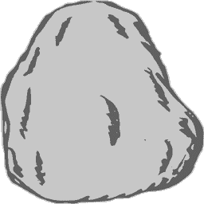
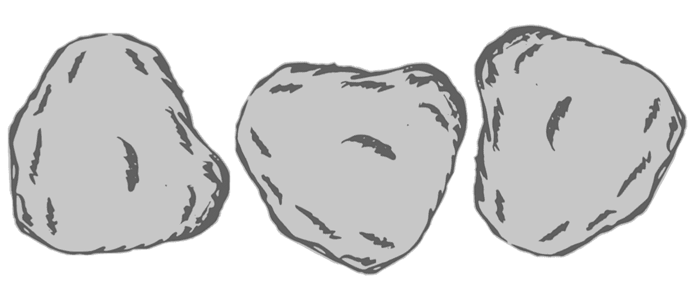
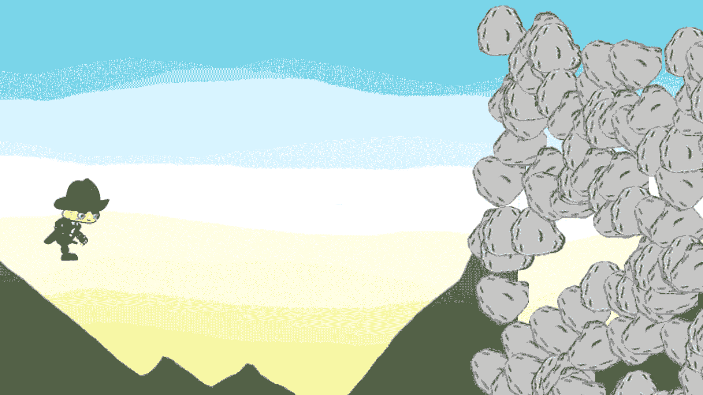
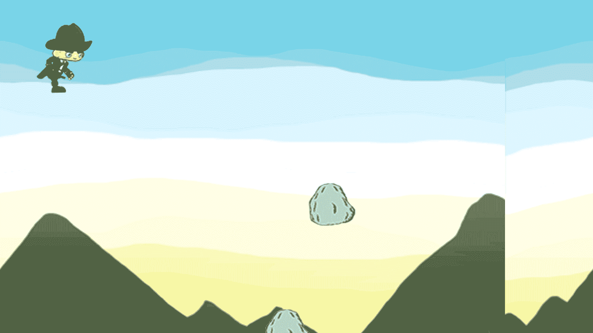
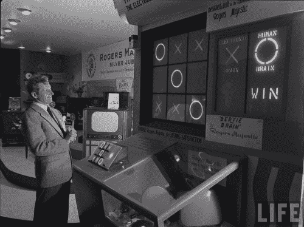

# 第六章：碰撞检测和基本人工智能

你已经学到了如何在我们的游戏中播放动画的概述，现在我们将更进一步地进入这个激动人心的游戏开发之旅，通过学习制作游戏感觉真实所需的最复杂但至关重要的概念之一。通过添加动画，我们可以使我们的游戏看起来更真实，但游戏感觉真实也同样重要，因为这是使其有趣的原因。在本章中，我们将更详细地探讨以下两个概念：

+   碰撞检测

+   人工智能

因此，本章将分为两个主要部分。碰撞检测和人工智能的研究本身是非常广泛的课题。为了简化以服务于我们的目的，我们将查看这些主题的最基本版本，以便获得入门级理解，以便能够在我们的游戏中应用这些概念的知识。所以，无需多言，让我们深入这个复杂但令人兴奋的碰撞检测主题。

# 碰撞检测

简单来说，碰撞是两个物体之间短暂相互作用。有各种不同类型的碰撞，如弹性碰撞和非弹性碰撞。研究两个或多个物体重叠的交集称为**碰撞检测**。它是计算数学中最复杂的部分之一，并分为许多类型，例如：

+   **边界框碰撞**：这是一种最简单的碰撞技术形式，其中我们取两个矩形并检查它们是否重叠。为此，我们需要每个矩形的四个坐标，即 *x* 和 *y* 位置以及两个矩形的宽度和高度。

+   **圆形碰撞**：这是第二种最简单的碰撞类型，其中我们测试两个圆之间的碰撞。在这里，我们考虑两个圆的半径和圆心的 *x* 和 *y* 位置来测试重叠。

+   **分离轴定理**：这种碰撞比前面提到的两种要复杂一些，主要是因为它主要用于检测两个多边形之间的碰撞。

当然，还有许多其他类型的碰撞，但这本身就是一个庞大的概念。为了本书的目的，我们将处理更简单的碰撞形式，并根据对这些概念的理解，你可以进一步实验更复杂的碰撞类型。

现在，让我们看看你所学的三种碰撞类型的算法。

这些算法只是伪代码。伪意味着虚假，这意味着这些代码不应被执行。它们只是在这里提到，以便理解不同的碰撞技术。

在我们继续我们的游戏项目之前，让我们逐一查看它们。

# 碰撞检测技术算法

我们非常需要为理解这些碰撞技术打下基础，因此了解这些技术是如何工作的非常重要。让我们来看看检测碰撞的不同算法。在我们本章进一步处理碰撞时，我们将使用这些概念。由于我们在这本书中只处理简单类型，我们将只查看边界框和圆形碰撞检测技术的算法。

# 边界框碰撞

在我们前面的解释中，我们看到边界框碰撞技术是最简单的之一。这是因为我们只是在两个矩形之间进行测试。考虑以下伪代码以更好地理解：

```kt
rectangle1 = {x: 5, y: 5, width: 50, height: 50}
rectangle2 = {x: 20, y: 10, width: 10, height: 10}

if(rectangle1.x < rectangle2.x + rectangle2.width && rectangle1.width > rectangle2.x && rectangle1.y < rectangle2.y + rectangle2.height && rectangle1.height + rectangle1.y > rectangle2.y) 
{
    //Bounding Box Collision Detected
}

// Taking the values from our variables
if (5 < 30 && 55 > 20 && 5 < 20 && 55 > 10) {
 // Bounding Box Collision Detected!
}

```

如您从前面的代码中可以看到，通过这种技术检测碰撞所需的数学运算相当简单。我们只处理基本的 `x`、`y` 坐标以及 `width` 和 `height`。

# 圆形碰撞

另一种简单的碰撞类型，它涉及绘制两个圆心之间的距离以检测碰撞。其算法如下：

```kt
circle1 = {radius: 20, x: 5, y: 5};
circle2 = {radius: 12, x: 10, y: 5};

dx = circle1.x - circle2.x;
dy = circle1.y - circle2.y;

distance = Math.sqrt(dx * dx + dy * dy);

if (distance < circle1.radius + circle2.radius) {
 // Circle Collision!
}

```

如您在此处所观察到的，我们有两个圆。然后我们取它们各自的 `x` 和 `y` 坐标距离。之后，我们取它们平方和的平方根。这就是计算两个圆之间距离的简单公式。然后在我们的测试条件下，我们检查这个距离是否小于两个圆的和。

现在我们对碰撞检测的算法有了基本的了解，我们就可以继续在游戏中检测碰撞了。让我们开始吧！

# 在我们的游戏中检测碰撞

由于我们在这里处理的是一个游戏，我们将以实际应用的方式处理理论。因此，让我们通过一个玩家面前接近的岩石的例子来研究碰撞技术。我们的游戏是一个横版滚动游戏，因此将有多个障碍物和可收集物品朝我们走来。通过简单的边界框碰撞技术，我们可以检测玩家与其他对象之间的碰撞并执行相应的函数。

在我们创建即将到来的岩石之后，我们还将创建即将到来的硬币，以便玩家也能得分。然而，在我们继续进行之前，我们必须想出一种让我们的玩家避开这些障碍的方法。我们将实现碰撞检测，如果玩家与岩石相撞，他将死亡。因此，玩家跳跃是至关重要的。我们将在触摸输入上赋予玩家跳跃能力。所以，让我们让我们的玩家跳跃吧！

# 让我们的玩家跳跃

由于在接下来的章节中，我们将在屏幕上随机生成障碍物和金币，我们将修改我们的玩家，使其能够在屏幕上上下移动。所以，如果你触摸屏幕，玩家将上升；如果你停止触摸屏幕，我们的玩家将下降。让我们首先看看我们需要在代码中实现的变化，然后一步一步地分解它们。我们将为这段代码部分在`GameView.java`文件上工作。

最初，我们的动画是在游戏开始时立即开始的。但我们需要对我们的动作有更多的控制，所以我们使用了`getPlaying()`函数来实现这一点。以下是我们将如何解决这个问题：

我们在`update()`方法中添加了一个条件，即只有当玩家正在玩游戏时，我们才会更新背景图像和玩家角色。这意味着如果没有信号，游戏将不会开始：

```kt
public void update(){
 if(playerCharacter.getPlaying()) { bgImg.update(); playerCharacter.update(); }
}

```

我们现在将使用`onTouchEvent()`来通知我们的游戏已经开始，以及何时上升和下降。在我们的`onTouchEvent()`的第一个条件中，我们将检查屏幕上是否有触摸事件。`ACTION_DOWN`表示屏幕被触摸。

在这里，如果被阻塞，我们将有一个另一个 if 块，它检查玩家是否正在玩游戏。如果玩家没有在玩游戏，那么我们将`setPlaying()`函数设置为`true`值，从而启动游戏循环，然后由于步骤 1 中的条件，它将启动`update()`方法。否则，它将简单地告诉玩家屏幕被触摸，因此我们的`up`布尔变量被设置为`true`，这意味着玩家上升。

然后，我们将编写`return true`语句，它负责通知触摸事件，因为我们的`onTouchEvent()`有一个布尔返回类型。

接下来，我们定义玩家下移的条件。在我们的例子中，这仅仅意味着不再接收到触摸输入，这意味着我们的手指已经从屏幕上抬起。`ACTION_UP`定义了这个事件。

如果发生此事件，则将我们的`up`变量设置为`false`，因此玩家将下降。

我们将为事件再次编写一个`return true`语句。以下是我们的`onTouchEvent()`代码将看起来像：

```kt
    @Override
    public boolean onTouchEvent(MotionEvent event)
    {
 if(event.getAction() == MotionEvent.ACTION_DOWN) {
 if(!playerCharacter.getPlaying()){
 playerCharacter.setPlaying(true);
 } else {
 playerCharacter.setUp(true);
 }
 return true;
 }

 if(event.getAction() == MotionEvent.ACTION_UP){
 playerCharacter.setUp(false);
 return true;
 }        return super.onTouchEvent(event);
    }

```

从这次编辑中，我们只定义了设置玩家上下功能所需的调用。然而，我们还需要为我们的玩家添加加速度和减速度，以便实际上能够上下移动。我们将通过编辑我们的`PlayerCharacter.java`文件来实现这一点。让我们在这个文件中编写一些跳跃代码。打开它，并在`update()`方法中写下以下加粗的代码：

```kt
    public void update() {
        long elapsed = (System.nanoTime()-startTime)/1000000;
        if(elapsed > 100) {
            score++;
            startTime = System.nanoTime();
        }
        ac.update();
 if(up){
 dyc = (int)(dya-=1.1);
 }
 else {
 dyc = (int)(dya+=1.1);
 }

 if(dyc > 10) {
 dyc = 10;
 }
 if(dyc < -10) {
 dyc = -10;
 }

 yc += dyc*2;
 dyc = 0;
    }

```

这段代码块非常容易理解。让我们分解它，以便更好地掌握：

1.  我们检查我们的`up`变量是否为真。

1.  如果它是`true`，那么我们将添加一个正加速度值，该值在每次更新时增加 1.1。你可以根据你的喜好调整这些值。

1.  如果它是 `false`，那么我们将在每次更新中添加一个负加速度值，该值会减少 1.1。

1.  在此之后，我们不想加速度或减速度超过某个限制，所以我们将其限制在某个范围内。在我们的例子中，我们将其限制在最大 10 和最小 -10。

1.  我们将加速度值的两倍添加到 `y` 坐标上。

1.  我们将减速度设置为 0，以便在下一个 `update()` 调用中重置它。

你可以调整加速度值来自行测试并熟悉期望的速度。要更改加速度的速度，只需更改 `dyc` 中的值。

这将使我们的玩家高兴地跳跃！构建你的游戏并在你的设备或模拟器上测试它。你将在这里观察到两件事：

+   当你开始游戏时，游戏会暂停，并且只有在触摸屏幕时才会播放。这是因为我们的 `GameView.java` 文件中的 if 条件。

+   由于我们在 `PlayerCharacter.java` 文件中提供的加速度值，你的玩家现在可以上下移动。

现在我们已经建立了这个，是时候处理迎面而来的障碍物并避开它们了！哦，顺便说一下，还要了解碰撞过程。

# 避免迎面而来的石头

在我们继续进行任何操作之前，我们首先需要一块看起来不错的石头。不是开玩笑，真的！我们需要一块看起来卡通的石头图像，这将符合我们游戏的主题。所以，让我们为自己找一块石头。 为了本章的目的，我们将使用这块石头：



这是我们基本的石头

正如我们在前面的部分中所做的那样，我们需要为石头创建动画，因此我们将创建我们拥有的石头的角色表。然后，我们只需将其命名为 `rock.png` 并开始使用它。 有一个滚动的石头会更好，因为这在游戏中更有意义，所以我们将使用 滚动的石头角色表。



我们的 rock.png 角色表

当然，正如我们之前所看到的，这块石头也只是一个图像，并且会像之前一样放置在 `res/drawable` 文件夹中。所以，拿起任何一块石头并将其放入 `res/drawable` 文件夹以开始。

现在，由于我们将处理一个新的对象，所以到这一点为止，必须非常清楚我们需要创建一个新的类。所以，让我们继续并创建一个新的类，命名为 `Rock.java`。这将包含我们障碍石头的所有代码。然后，你将有一个空白 java 文件，你需要将其扩展到我们的 `GameObj.java` 文件，就像我们游戏中的其他任何游戏对象一样：

```kt
package nikhil.nikmlnkr.game;

/**
 * Created by Nikhil on 30-01-2017.
 */

public class Rock extends GameObj {
}

```

现在，准备好！我们将对这个进行一些重头戏的编码。让我们一步一步地看看。在这个文件中，我们需要三个方法：

+   `构造函数`：这将包含我们石头的参数，例如 `x`、`y` 位置、`宽度`、`高度`、`得分` 等等

+   `Update` 方法：正如之前所见，这是在每一帧都会被调用的方法

    +   `Draw` 方法：这个方法负责在屏幕上实际绘制我们的对象

让我们从构造函数和变量开始。我们需要一个`score`和`speed`变量，以及一个用于`Bitmap`和预定义的`AnimationClass`的变量，因为我们还将对这个石头进行动画处理。让我们开始吧。我们首先声明游戏所需的变量，包括`score`、`speed`、我们的`animationClass`引用和`spriteSheet`引用。我们还取了一个`Random`数字引用变量，用于根据游戏循环中即将看到的唯一条件生成分数。目前，我们没有在屏幕上显示分数，但很快你将看到它：

```kt
package nikhil.nikmlnkr.game;

import android.graphics.Bitmap;
import android.graphics.BitmapFactory;
import android.graphics.Canvas;

import java.util.Random;

/**
 * Created by Nikhil on 30-01-2017.
 */

public class Rock extends GameObj{

    private int score;
    private int speed;
    private Random rnd = new Random ();
    private AnimationClass animationClass = new AnimationClass();
    private Bitmap spriteSheet;

}

```

现在，我们将编写我们的构造函数。构造函数需要一系列参数，如`x`、`y`坐标、`width`、`height`、`score`和`noOfFrames`。我们基本上将它们的引用作为参数传递给我们的方法，因此我们需要在构造函数中提供`xc`、`yc`、`w`、`h`、`s`和`noOfFrames`作为参数。

之后，我们需要我们的石头在生存时间更长后跑得更快，因此我们将编写代码，使得随着分数的增加，我们的石头会变得更快。我们将使用一点数学知识来完成这个任务，其中我们将使用我们的随机变量。基本上，这将是我们公式：`speed = 7 + (int) (rnd.nextDouble()*score/30);`。然后我们将设置我们的`Bitmap`引用变量，以便它可以扫描我们的精灵图集，随后通过一个`for`循环扫描相同的图集。最后，我们将设置我们的帧到`animationClass`，并为动画添加延迟。让我们看看这在我们的代码中是如何工作的：

```kt
    public Rock (Bitmap res, int xc, int yc, int w, int h, int s, int noOfFrames) {
        this.xc = xc;
        this.yc = yc;
        width = w;
        height = h;
        score = s;

        speed = 7  + (int) (rnd.nextDouble()*score/30);

        if(speed > 35)
            speed = 35;

        Bitmap[] img = new Bitmap[noOfFrames];

        spriteSheet = res;

        for(int i=0; i rocks;
 private Random rnd = new Random();

```

我们将对我们的`surfaceDestroyed()`方法进行一些改进，并创建一个`counter`以及调整我们的`retry`变量块，以避免无限循环的情况。代码更改用粗体标出：

```kt
    @Override
    public void surfaceDestroyed(SurfaceHolder holder){
        boolean retry = true;
 int counter = 0; while(retry && counter <1000)
        {
            counter++;
            try {mainThread.setRunning(false);
                mainThread.join();
 retry = false;
            } catch(InterruptedException e){e.printStackTrace();}
        }

    }

```

在我们的`surfaceCreated()`方法中，我们将我们的引用变量`rocks`赋值为`Rock`类，并将`rockStartTime`变量初始化为当前`System.nanoTime()`，如下所示：

```kt
    @Override
    public void surfaceCreated(SurfaceHolder holder){

        bgImg = new BackgroundImage(BitmapFactory.decodeResource
        (getResources(),  R.drawable.background_image));
        playerCharacter = new 
        PlayerCharacter(BitmapFactory.decodeResource
        (getResources(),R.drawable.player_run),200,246,3);
 rocks = new ArrayList<Rock>();

 rockStartTime = System.nanoTime();

        //we can safely start the game loop
        mainThread.setRunning(true);
        mainThread.start();

    }

```

在我们的更新方法中，我们处理屏幕上生成岩石的“真正难点”。这里有多个事情需要管理，所以让我们进一步分解它们。

我们将声明我们的`rockElapsed`变量，它跟踪岩石在屏幕上停留的时间。

然后，我们定义我们希望在屏幕上生成岩石的频率。您可以根据所需的效应在`if`条件中随意操作这个值。

在这个`if`块内部，我们还有一个嵌套的`if`块，其主要目的是定义岩石的生成位置。在这里，我们定义岩石的生成方式，使得第一个岩石元素位于屏幕的中间部分，正如您可以从数学计算中看到的那样。或者，如果它不是第一个生成的岩石元素，那么我们告诉它随机生成在任何位置，只要我们的`rnd`随机变量出现。

我们首先定义我们的碰撞逻辑。在这里，我们将使用一个`for`循环来遍历屏幕上的所有岩石对象，如果任何元素与我们的玩家角色发生碰撞，那么我们将暂停游戏。

最后，如果岩石超出我们定义的屏幕空间，那么我们就从我们的`ArrayList`中`remove`该对象。

让我们为这个写代码：

```kt
    public void update(){
        if(playerCharacter.getPlaying()) {
            bgImg.update();
            playerCharacter.update();
 //spawn rocks on screen
            long rockElapsed = (System.nanoTime() - 
            rockStartTime/1000000);
 if(rockElapsed>(2000 - playerCharacter.getScore()/4)){
 if(rocks.size() == 0){
 rocks.add(new Rock(BitmapFactory.decodeResource
                    (getResources(), R.drawable.rock), 
                    WIDTH+10, HEIGHT/2, 66, 82, 
                    playerCharacter.getScore(),3));
 } else {
 rocks.add(new Rock(BitmapFactory.decodeResource
                    (getResources(), R.drawable.rock), 
                    WIDTH+10, (int) 
                    (rnd.nextDouble() * (HEIGHT)), 66, 82, 
                    playerCharacter.getScore(),3));
 }
 rockStartTime = System.nanoTime();
 }

 for(int i=0; i<rocks.size();i++) {
 rocks.get(i).update();
 if(collision(rocks.get(i),playerCharacter)) {
 rocks.remove(i);
 playerCharacter.setPlaying(false);
 break;
 }
 //remove rocks if they go out of the screen
                if(rocks.get(i).getXC()<-100) {
 rocks.remove(i);
 break;
 }

 }
        }
    }

```

我们接下来编写我们的碰撞检测函数。我们这样做是基于你在本章前面学到的边界框碰撞技术。你可以很容易地从这段代码中观察到，`Rect.intersects(a.getRectangle(), b.getRectangle())`，我们只是使用预定义在我们的`android.graphics.Rect`导入中的`Rect`类来比较我们两个对象的矩形。如果存在重叠的矩形，那么这个函数返回一个`true`值；否则，它返回`false`。这个函数的返回类型是`boolean`，因此它返回一个`boolean`值是很重要的：

```kt
 public boolean collision(GameObj a, GameObj b) {

 if(Rect.intersects(a.getRectangle(), b.getRectangle())) {
 return true;
 }
 return false;
 }

```

然后最后，我们在屏幕上绘制我们的岩石对象。我们再次使用`for`循环和我们的`draw()`方法来完成：

```kt
    @Override
    public void draw(Canvas canvas)
    {
        final float scaleFactorX = getWidth()/WIDTH;
        final float scaleFactorY = getHeight()/HEIGHT;
        if(canvas!=null) {
            final int savedState = canvas.save();
            canvas.scale(scaleFactorX, scaleFactorY);
            bgImg.draw(canvas);
            playerCharacter.draw(canvas);
 for(Rock r : rocks) {
 r.draw(canvas);
 }

            canvas.restoreToCount(savedState);
        }
    }

```

这将使我们的游戏具备碰撞检测技术。编写完这段代码后，我们的碰撞技术在游戏中的工作方式应该非常明显。我们创建了一个返回类型为`Boolean`的函数，该函数将检测我们传递给它的两个对象的矩形之间的碰撞。

让我们快速回顾一下我们的代码块，逐一列出每个代码块在`GameView.java`文件中的具体职责，以获得更好的清晰度。

# 定义我们的变量

我们通过添加我们想要的变量，如`rockStartTime`、`rocks`和`rnd`来定义所需的变量：

```kt
public static final int WIDTH = 1920;
public static final int HEIGHT = 1080;
public static final int MOVINGSPEED = -5;
private long rockStartTime;
private MainGameThread mainThread;
private BackgroundImage bgImg;
private PlayerCharacter playerCharacter;
private ArrayList<Rock> rocks;

private Random rnd = new Random();

```

这些变量为我们提供了可以工作的对象引用。

# 解决无限循环问题

在我们前面的代码中，有可能遇到无限循环的情况，所以我们替换了重试并添加了一个计数器，以在`surfaceDestroyed()`方法中无限循环情况发生时提供额外的安全性。我们的重试可能在每次运行时返回一个`false`值或一个`true`值，因此有可能出现无限循环的情况。为了避免这种情况，我们有一个计数器，每次 while 循环运行时都会增加，并在之后停止。你可以自己尝试一下，看看如果不使用计数器会发生什么问题：

```kt
@Override
public void surfaceDestroyed(SurfaceHolder holder){
    boolean retry = true;
    int counter = 0;
    while(retry && counter <1000)
    {
        counter++;
        try{mainThread.setRunning(false);
            mainThread.join();
            retry = false;
        }catch(InterruptedException e){e.printStackTrace();}
    }

}

```

这解决了我们的无限循环问题。

# 初始化我们的变量

在定义变量之后，初始化它们也是至关重要的。我们从`surfaceCreated()`方法中这样做，如下所示：

```kt
@Override
public void surfaceCreated(SurfaceHolder holder){

    bgImg = new BackgroundImage(BitmapFactory.decodeResource
    (getResources(), R.drawable.background_image));
    playerCharacter = new PlayerCharacter(BitmapFactory.decodeResource
    (getResources(),R.drawable.player_run),200,246,3);
    rocks = new ArrayList<Rock>();

    rockStartTime = System.nanoTime();

    //we can safely start the game loop
    mainThread.setRunning(true); 
    mainThread.start();

}

```

这样就处理好了我们的变量值。

# 碰撞行为

在此之后，我们定义了如果两个对象之间发生碰撞时会发生什么，这定义在我们的`update()`方法中。我们还处理了岩石飞出屏幕的情况：

```kt
long rockElapsed = (System.nanoTime() - rockStartTime/1000000);

if(rockElapsed>(2000 - playerCharacter.getScore())){

    if(rocks.size() == 0){
        rocks.add(new Rock(BitmapFactory.decodeResource
        (getResources(), R.drawable.rock), 
        WIDTH+10, HEIGHT/2, 66, 82, 
        playerCharacter.getScore(),3));
    } else {
        rocks.add(new Rock(BitmapFactory.decodeResource
        (getResources(), R.drawable.rock), 
        WIDTH+10, (int) (rnd.nextDouble() * (HEIGHT)), 66, 82,           
        playerCharacter.getScore(),3));
    }

    rockStartTime = System.nanoTime();
}

for(int i=0; i<rocks.size();i++) {

    rocks.get(i).update();

    if(collision(rocks.get(i),playerCharacter)) {
        rocks.remove(i);
        playerCharacter.setPlaying(false);
        break;
    }

//remove rocks if they go out of the screen
    if(rocks.get(i).getXC()<-100) {
        rocks.remove(i);
        break;
    }
}

```

我们现在已经准备好了碰撞行为。

# 碰撞函数

我们定义了碰撞行为，但编写一个定义碰撞本身的逻辑也是必要的。因此，我们创建了一个碰撞检测函数：

```kt
public boolean collision(GameObj a, GameObj b) {

    if(Rect.intersects(a.getRectangle(), b.getRectangle())) {
        return true;
    }
    return false;
}

```

我们的碰撞函数现在已经准备好了。

# 在屏幕上绘制我们的对象

一旦我们完成，我们只需在我们的`draw()`方法的`if`块中绘制我们的对象即可：

```kt
for(Rock r : rocks) {
    r.draw(canvas);
}

```

这样就处理好了检测碰撞所需的所有功能。

现在我们已经完成了碰撞逻辑，让我们对我们的玩家角色做一些调整。那里有一些未使用的变量，所以让我们去掉它们，并进一步定制它。在此之前，它们是了解事物工作原理所必需的。但现在它们对我们来说几乎毫无用处，所以没有必要让它们随意存在。打开你的`PlayerCharacter.java`文件，对你的代码进行以下更改：

```kt
package nikhil.nikmlnkr.game;

import android.graphics.Bitmap;
import android.graphics.Canvas;

/**
 * Created by Nikhil on 13-01-2017.
 */

public class PlayerCharacter extends GameObj{
    private Bitmap spriteSheet;
    private int score;
    private boolean up, playing;
    private AnimationClass ac = new AnimationClass();
    private long startTime;

    public PlayerCharacter(Bitmap res, int w, int h, int noOfFrames) {
        xc = 100;
        yc = GameView.HEIGHT/2;
 //removing the dya variable        dyc = 0;
        score = 0;
        height = h;
        width = w;

        Bitmap[] img = new Bitmap[noOfFrames];
        spriteSheet = res;

        for(int i=0; i 100) {
            score++;
            startTime = System.nanoTime();
        }
        ac.update();

        if(up){
 dyc -=1;
        }
        else {
 dyc +=1;
        }

        if(dyc > 10) {
            dyc = 10;
        }
        if(dyc < -10) {
            dyc = -10;
        }

        yc += dyc*2;
 //removing the dya variable
    }

    public void draw(Canvas canvas) {
        canvas.drawBitmap(ac.getImage(), xc, yc, null);
    }

    public int getScore() {
        return score;
    }

    public boolean getPlaying(){
        return playing;
    }

    public void setPlaying(boolean b) {
        playing = b;
    }

    public void resetDYC() {
        dyc = 0;
    }

    public void resetScore () {
        score = 0;
    }
}

```

这些只是微小的调整，相当直观，不需要任何单独的解释。现在我们已经建立了所有这些，我们最终可以测试我们的碰撞技术了！所以，让我们继续前进，构建你的游戏，并在你的设备或模拟器上测试它。你将看到类似这样的东西：



哈喽！我们的岩石现在出现在屏幕上了……但是等等，发生了什么？

所以，好消息是我们的岩石终于出现在屏幕上了，坏消息是它们遍布整个屏幕。我们将很快解决这个问题，但现在我们可以测试我们的碰撞功能。一旦我们的岩石与玩家角色碰撞，游戏将暂停。现在我们需要调整它们的频率，以便控制它们的生成。

打开你的`GameView.java`文件，对以下加粗的部分进行更改。删除所有加粗的注释代码，并添加以下`if(rocks.size() < 2)`语句：

```kt
public class GameView extends SurfaceView implements SurfaceHolder.Callback
{
    public static final int WIDTH = 1920;
    public static final int HEIGHT = 1080;
    public static final int MOVINGSPEED = -5;
 //private long rockStartTime;    private MainGameThread mainThread;
    private BackgroundImage bgImg;
    private PlayerCharacter playerCharacter;
    private ArrayList<Rock> rocks;

    private Random rnd = new Random();

    //Constructor, surfaceDestroyed and surfceChanged methods remain 
    same
    @Override
    public void surfaceCreated(SurfaceHolder holder){

        bgImg = new BackgroundImage(BitmapFactory.decodeResource
        (getResources(), R.drawable.background_image));
        playerCharacter = new 
        PlayerCharacter(BitmapFactory.decodeResource
        (getResources(),R.drawable.player_run),200,246,3);
        rocks = new ArrayList<Rock>();
 //rockStartTime = System.nanoTime();

        //we can safely start the game loop
        mainThread.setRunning(true);
        mainThread.start();

    }
    //onTouchEvent remains same

    public void update()
    {
        if(playerCharacter.getPlaying()) {
            bgImg.update();
            playerCharacter.update();

            //spawn rocks on screen
 //long rockElapsed = (System.nanoTime() - 
            rockStartTime/1000000);
 //if(rockElapsed>(2000 - playerCharacter.getScore())){
             if(rocks.size() < 2){
                 if(rocks.size() == 0){
                    rocks.add(new Rock(BitmapFactory.decodeResource
                    (getResources(), R.drawable.rock),
                    WIDTH+10, HEIGHT/2, 120, 82, 
                    playerCharacter.getScore(),3));
                } else {
                    rocks.add(new Rock(BitmapFactory.decodeResource
                    (getResources(), R.drawable.rock), 
                    WIDTH+10, (int) (rnd.nextDouble() * (HEIGHT)),
                    120, 82, playerCharacter.getScore(),3));
                }
                rockStartTime = System.nanoTime();
 } //Bracket ends here

            for(int i=0; i<rocks.size();i++) {
                rocks.get(i).update();
                if(collision(rocks.get(i),playerCharacter)) {
                    rocks.remove(i);
                    playerCharacter.setPlaying(false);
                    break;
                }
                //remove rocks if they go out of the screen
                if(rocks.get(i).getXC()<-100) {
                    rocks.remove(i);
                    break;
                }

            }
        }
    }

    public boolean collision(GameObj a, GameObj b) {

        if(Rect.intersects(a.getRectangle(), b.getRectangle())) {
            return true;
        }
        return false;
    }

    @Override
    public void draw(Canvas canvas)
    {
        //same as the draw method seen earlier
    }

}

```

我们只是注释掉了`rockElapsed`和`rockStartTime`变量，并用`rocks.size()`条件替换了我们的`if`条件，这个条件告诉游戏在任何给定时间内只生成`2`块岩石。这样，我们就控制了屏幕上生成的岩石频率。你可以根据需要调整你的频率：



好吧，这看起来比之前的好多了

当然，还有一个问题，那就是岩石的出现；这取决于你用来创建精灵动画的图像。但到目前为止，我们将继续进行下一步。此外，请注意，以类似的方式，你也可以创建可收集物品，如硬币，因此建议你创建一个硬币类，玩家可以收集并添加到他的分数中。继续前进，进行实验！

现在让我们来了解我们的下一个概念，那就是人工智能。由于我们游戏中不会使用任何人工智能，所以我们只需浏览一下这个主题的概念。我们当前的游戏是一个简单的横向卷轴游戏，不需要任何敌人。因此，让我们开始学习人工智能，或者像许多人所说的，AI。当然，如果你有在游戏中添加敌人的想法，那么你总是可以使用从前面章节中学到的概念，并将它们与你即将学习的概念结合起来，创造出一些酷炫的东西！

# 人工智能

**人工智能**（**A.I.**）是研究能够执行人类任务和自动化，而不需要人类参与的系统的学科。在游戏中，这个概念被广泛用于为游戏敌人创建真实的行为。让我们在本章中了解人工智能的基本概念。这部分内容将是理论性的，所以如果你只想专注于准备你的游戏，可以自由跳过这部分。然而，强烈建议你阅读这部分内容，因为如果你想在游戏中创建人工智能，这部分的概念将会非常有用。

# 人工智能的历史

在游戏中，人工智能被用来为用户无法控制的对象创建智能行为。这可以是屏幕上看到的龙，或者简单地是一个始终跟随你的角色。简单来说，它是一种为看似无生命的物体提供类似人类智能的手段。在技术层面上，人工智能是研究算法的学科，这些算法包括来自机器人学、计算机图形学、计算机科学和控制理论的技巧。有许多创建逼真人工智能的算法。

自从游戏行业诞生以来，游戏中的人工智能研究一直是这个行业的一部分，因为游戏提供了在无生命物体中模拟人工智能行为的一种最佳方式。然而，如果你回顾到 20 世纪 50 年代，你会观察到，与今天相比，人工智能是一个相对简单的概念。1951 年制作的 Nim 游戏是人工智能的第一个例子：



1951 年的 Nim 游戏

这款游戏是一个简单的井字棋游戏，它展示了在对抗计算机时人工智能的第一个例子。1974 年，在街机游戏中首次出现了几个引人注目的例子：Taito 游戏《速度竞赛》（一款赛车视频游戏）、Atari 游戏《Qwak》（一款鸭狩猎光枪射击游戏）和《Pursuit》（一款战斗机空战模拟器）。1972 年的两款基于文本的计算机游戏《Hunt the Wumpus》和《Star Trek》也拥有敌人。敌人的移动基于存储的模式。微处理器的引入使得更多的计算和随机元素可以叠加到移动模式中。让我们来谈谈一些有趣的 AI 算法。

# 人工智能算法

人工智能的算法可以包括许多方面。本质上，将这些分解成简单术语，它们只是搜索算法。以下是一些最流行的搜索算法，这些算法可以应用于人工智能逻辑。在中间，有一些伪代码用于理解这些示例。一旦你了解了这些，我们就可以为我们的游戏制定一些基本的 AI 逻辑，如果你愿意从你的角度加入的话。

# 广度优先搜索

这个算法从根节点开始，然后首先探索所有相邻节点，然后移动到下一层的相邻节点，这返回了到解决方案的最短路径。它使用先进先出（FIFO）队列数据结构。

这个算法的缺点是它消耗了大量的内存，因为为了创建下一个节点，必须保存每个层级的节点。

在这里了解更多：[`en.wikipedia.org/wiki/Breadth-first_search`](https://en.wikipedia.org/wiki/Breadth-first_search)

# 深度优先搜索

该算法的实现使用递归和后进先出（LIFO）的栈数据结构，它创建与我们的第一种方法相同的节点，但顺序不同。由于每个迭代从根节点到叶节点存储节点，因此空间需求相当线性。

该算法的缺点是，有可能这个算法可能不会终止，并且在一个路径上无限期地继续，在某些情况下执行时间会增加。它不能检查重复节点。

在这里了解更多：[`en.wikipedia.org/wiki/Depth-first_search`](https://en.wikipedia.org/wiki/Depth-first_search)

# 双向搜索

在这个技术中，搜索从初始状态开始，并从目标状态反向进行，直到两者都满足以识别共同状态，然后从初始状态到目标状态的路径被连接起来。

在这里了解更多：[`en.wikipedia.org/wiki/Bidirectional_search`](https://en.wikipedia.org/wiki/Bidirectional_search)

# 一致成本搜索

在这个算法中，排序是通过增加节点到路径的成本来进行的，并且具有最低成本的节点被扩展。它也普遍被称为迪杰斯特拉算法。

这个算法的缺点是，由于可能有多个长路径，这种技术必须探索它们所有。

在这里了解更多：[`en.wikipedia.org/wiki/Dijkstra%27s_algorithm`](https://en.wikipedia.org/wiki/Dijkstra%27s_algorithm)

# 迭代加深深度优先搜索

执行到第 1 层的深度优先搜索，然后对第 2 层执行相同的操作，依此类推，直到找到解决方案。直到所有较低层节点生成，节点才不会被创建。

在这里了解更多：[`en.wikipedia.org/wiki/Iterative_deepening_depth-first_search`](https://en.wikipedia.org/wiki/Iterative_deepening_depth-first_search)

# 前述算法复杂度比较

让我们通过比较前五种算法来查看一些有趣的结果。以下是算法基于各种标准的性能：

| **标准** | **广度优先** | **深度优先** | **双向** | **一致成本** | **加深** |
| --- | --- | --- | --- | --- | --- |
| 时间 | b^d | b^m | b^(d/2) | b^d | b^d |
| 空间 | b^d | b^m | b^(d/2) | b^d | b^d |
| 优化性 | 是 | 否 | 是 | 是 | 是 |
| 完全性 | 是 | 否 | 是 | 是 | 是 |

# *搜索

这个算法最著名的是最佳优先搜索算法，并且在游戏中用于路径查找方面也广泛使用。它的性能非常高效，通过这个算法避免了扩展已经昂贵的路径。

`f(n) = g(n) + h(n)`，其中`g(n)`是到达目标节点的成本（到目前为止），`h(n)`是从节点到目标估计的成本，而`f(n)`是通过`n`到目标的路径估计总成本。它是通过增加`f(n)`来使用优先队列实现的。

更多信息请参阅：[`en.wikipedia.org/wiki/A*_search_algorithm`](https://en.wikipedia.org/wiki/A*_search_algorithm)

# 创建你自己的人工智能

现在，关于这个游戏，我们实际上并不需要人工智能，因为我们的大多数障碍本身对我们来说就是一个巨大的挑战。然而，我们可以有一些思考的食物。这里有一个练习给你。利用你在前几章中获得的知识，尝试创建一个用于生成敌人的 AI 类，如果它进入一定的半径，它将开始向你射击弹丸。以下是创建 AI 的目标：

+   从屏幕右侧生成敌人

+   让它们向左手方向移动

+   进入一定半径后，它们将开始向你射击弹丸

+   如果你与弹丸相撞，游戏将暂停

你可以使用你的 Rock.java 类作为射击弹丸。你可以有一个猴子从屏幕的侧面进入，如果它进入一定的半径，它将开始向你扔石头。自己试试看；看到你有什么想法会很有趣！

所以，这本书关于碰撞和人工智能的部分就到这里了。

# 摘要

在本章中，你学习了大量的各种碰撞技术以及多个人工智能算法。我们现在知道如何根据边界框碰撞技术创建碰撞。

在下一章中，我们将为我们的玩家添加地面，并了解我们如何根据我们的碰撞创建爆炸。
