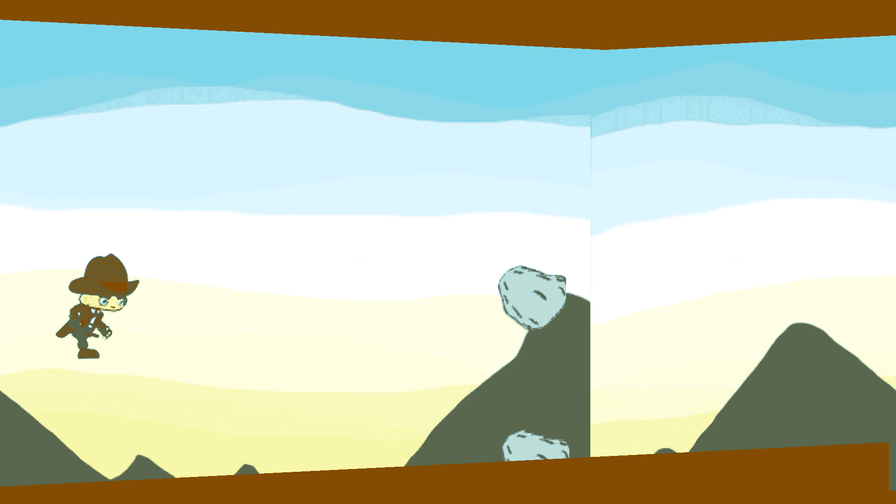

# 添加边界和使用精灵创建爆炸

在我们前面的章节中，我们介绍了成功检测碰撞的部分。现在我们已经了解了如何处理碰撞，我们可以利用我们的知识来为游戏添加一些酷炫的功能。本章将会非常简洁，如果你正确理解了碰撞检测的概念，那么对你来说这将是一个轻松的任务。以下是本章我们将要完成的内容：

+   为玩家添加一个作为边界的地面

+   检测玩家与岩石之间的碰撞

+   在碰撞发生的位置生成一个爆炸精灵

注意，从前面的任务中，我们已经完成了第二个任务，所以我们必须专注于第一个和第三个任务。让我们深入创建玩家的地面，因为现在玩家正在无限地下落。我们还将添加一个上边界，以将玩家限制在屏幕内，否则玩家会直接穿过屏幕。再次，我们将本章分为两部分：

+   将边界添加到我们的游戏中

+   使用精灵创建爆炸

让我们开始吧！

# 添加边界

由于我们非常熟悉创建新类的流程，我们将简单地创建两个新类，分别用于上边界和下边界，并分别命名为 `UpperBoundary.java` 和 `LowerBoundary.java`。我们对边界有以下目标：

+   让它们出现在游戏屏幕的顶部和底部

+   如果玩家与它们发生碰撞，则重置游戏

在这些目标指导下，我们将继续创建游戏边界。

# 创建边界类

在实际创建边界之前，我们需要一个图像精灵，以便在屏幕上显示它们。为此，我们将使用一个简单的单色精灵。以下是我们将用于游戏的精灵：


我们的 ground.png 文件

此外，我们将此文件放置在 `res/drawable` 文件夹中，就像我们之前处理图像文件一样。完成这些后，继续下一部分。

因此，现在让我们创建 `UpperBoundary.java` 类。继续前进，创建一个新的类，并在其中写入以下代码：

```kt
public class UpperBoundary extends GameObj {
    private Bitmap img;

    public UpperBoundary(Bitmap res, int xc, int yc, int h) {
        height = h;
        width = 20;

        this.xc = xc;
        this.yc = yc;

        dxc = GameView.MOVINGSPEED;
        img = Bitmap.createBitmap(res, 0, 0, width, height);
    }

    public void update(){
        xc += dxc;
    }

    public void draw(Canvas canvas) {
        try{
            canvas.drawBitmap(img, xc, yc, null);
        } catch(Exception e) {
        };
    }
}

```

在这段代码中，我们只是创建了一个边界类，包括其构造函数和 `update()` 以及 `draw()` 函数。这里的构造函数非常简单易懂。每次我们创建边界的一个实例时，我们将传递一个精灵、x y 位置和高度。我们还会设置一个速度，使边界向后移动，给人一种玩家正在向前移动的错觉。

就像我们之前所有的游戏对象一样，这个类也扩展了我们的主 `GameObj` 类。以类似的方式，我们也将创建 `LowerBoundary.java` 类。我们将做的唯一改变是在 `height` 和 `width` 变量上，其余的整个代码与 `UpperBoundary.java` 文件相同：

```kt
public class LowerBoundary extends GameObj {
    public LowerBoundary(Bitmap res, int xc, int yc) {
        height = 200;
        width = 20;
    }
}

```

注意，我们保持`height`为常数，因为我们希望将底部边界生成得尽可能低，因此`200`是一个安全的限制。你可以根据自己的喜好实验这些值。

现在我们已经准备好了我们的类，是时候将它们引入我们的游戏了。

# 在我们的游戏中创建边界

我们将一步一步地进行，因为这部分可能会有些棘手。我们还需要处理很多关于边界的数学计算，以及大量的新变量。让我们从在`GameView.java`文件中声明一些变量开始。

在这部分，我们只会在我们的`GameView.java`文件中工作。

# 创建所需的变量

下面是我们将要声明的新的变量：

```kt
private ArrayList<UpperBoundary> upperBoundary;
private ArrayList<LowerBoundary> lowerBoundary;

private int maxBoundaryHeight;
private int minBoundaryHeight;

private boolean upBound = true;
private boolean lowBound = true;

private int progressDenom = 20;

private boolean newGameCreated;

```

我们创建`upperBoundary`和`lowerBoundary`变量作为`ArrayList`，以跟踪屏幕上的实际游戏对象，然后我们还创建了两个整数变量`maxBoundaryHeight`和`minBoundaryHeight`，以跟踪上边界的最大和最小高度。我们还创建了两个布尔变量`upBound`和`lowBound`，如果我们的边界超出指定的最小或最大高度。`progressDenom`变量被创建为一个整数，以便为地面创建一个酷炫的模式，而不仅仅是平面。最后，我们有一个`newGameCreated`布尔变量，如果我们的玩家与任何对象相撞，它将自动重置游戏。

我们已经设置了变量。现在，我们将继续在游戏开始时引用我们的边界。

# 引用我们的边界

正如我们在岩石中分配了一个值一样，我们也会为我们的边界做同样的事情。我们将在`surfaceCreated()`方法中这样做，通过添加以下标记的变量：

```kt
    @Override
    public void surfaceCreated(SurfaceHolder holder){
upperBoundary = new ArrayList<UpperBoundary>();
 lowerBoundary = new ArrayList<LowerBoundary>();
    }

```

看起来很整洁！现在到了棘手的部分。我们需要为我们的两个边界编写更新逻辑。不要将这个与我们的单个边界的`update()`方法混淆。那个更新方法将简单地使地面向后移动。我们还需要实际编写在屏幕上生成它们的逻辑。让我们看看如何做到这一点。

# 更新我们的边界

我们将在每 50 分和每 40 分时更新我们的上边界和下边界。让我们为我们的边界编写代码。这涉及到很多复杂的数学计算，所以要注意。然而，与此相反，这里的每一步都很直观。以下是我们的边界的基本逻辑：

1.  每 50 分或 40 分更新一次

1.  将我们的图像添加到屏幕上

1.  每一帧之后，调用边界类中的`update()`方法

1.  如果边界超出屏幕，则将其移除

1.  如果任何一个边界超过了其最大值或最小值，则相应地将其`upBound`或`lowBound`变量设置为`true`或`false`，具体取决于其位置

这是我们的边界逻辑，并且对于我们的上边界和下边界都是重复的。这个代码块是在我们的 `draw()` 方法之后编写的。我们按照以下方式编写它们的代码：

```kt
public void updateUpperBound () {
    if(playerCharacter.getScore() % 50 == 0){
        upperBoundary.add(new
        UpperBoundary(BitmapFactory.decodeResource
        (getResources(), R.drawable.ground),
        upperBoundary.get(upperBoundary.size()-1).
        getXC() + 20, 0, (int)((rnd.nextDouble()*
        (maxBoundaryHeight))+1)));
    }

    for(int i=0; i<upperBoundary.size();i++) {
        upperBoundary.get(i).update();
        if(upperBoundary.get(i).getXC() < -20){
            upperBoundary.remove(i);

            if(upperBoundary.get(upperBoundary.size()-1).
            getHeight() >= maxBoundaryHeight) {
                upBound = false;
            }

            if(upperBoundary.get(upperBoundary.size()-1).
            getHeight() <= minBoundaryHeight) {
                upBound = true;
            }

            if(upBound){
                upperBoundary.add(new 
                UpperBoundary(BitmapFactory.decodeResource
                (getResources(), R.drawable.ground),
                upperBoundary.get(upperBoundary.size()-1).
                getXC() + 20, 0,upperBoundary.get
                (upperBoundary.size()-1).getHeight()+1));
            } else {
                upperBoundary.add(new 
                UpperBoundary(BitmapFactory.decodeResource
                (getResources(), R.drawable.ground),
                upperBoundary.get(upperBoundary.size()-1).
                getXC() + 20, 0, upperBoundary.get
                (upperBoundary.size()-1).getHeight()-1));
            }
        }
    }
}

public void updateLowerBound () {
    if(playerCharacter.getScore() % 40 == 0) {
        lowerBoundary.add(new
        LowerBoundary(BitmapFactory.decodeResource
        (getResources(),R.drawable.ground),
        lowerBoundary.get(lowerBoundary.size() - 1).
        getXC() + 20,(int)((rnd.nextDouble()*
        maxBoundaryHeight) + (HEIGHT - maxBoundaryHeight))));
    }

    for(int i=0;i<lowerBoundary.size();i++) {
        lowerBoundary.get(i).update();

        if(lowerBoundary.get(i).getXC()<-20){
            lowerBoundary.remove(i);

            if(lowerBoundary.get(lowerBoundary.size()-1).
            getHeight() >= maxBoundaryHeight) {
                lowBound = false;
            }

            if(lowerBoundary.get(lowerBoundary.size()-1).
            getHeight() <= minBoundaryHeight) {
                lowBound = true;
            }

            if(lowBound) {
                lowerBoundary.add(new
                LowerBoundary(BitmapFactory.decodeResource
                (getResources(),R.drawable.ground), 
                lowerBoundary.get(lowerBoundary.size() - 1).
                getXC() + 20, lowerBoundary.
                get(lowerBoundary.size() - 1).getYC() + 1));
            } else {
                lowerBoundary.add(new
                LowerBoundary(BitmapFactory.decodeResource
                (getResources(),R.drawable.ground),
                lowerBoundary.get(lowerBoundary.size() - 1).
                getXC() + 20, lowerBoundary.
                get(lowerBoundary.size() - 1).getYC() - 1));
            }
        }
    }
}

```

现在，我们必须实际上在我们的屏幕上绘制我们的边界，所以我们将进入我们的 `draw()` 方法来完成这个任务。

# 在屏幕上绘制我们的边界

就像我们之前的图像一样，我们使用 `draw()` 方法来编写我们的代码，以便在屏幕上显示我们的地面：

```kt
for(UpperBoundary ub : upperBoundary){
    ub.draw(canvas);
}

for(LowerBoundary lb: lowerBoundary) {
    lb.draw(canvas);
}

```

即使这部分也已经处理好了。现在，我们必须查看我们地面的碰撞部分。我们需要检测玩家与地面之间的碰撞。

# 检测地面和玩家之间的碰撞

由于我们已经有了一个碰撞方法，我们只需继续使用该函数。由于前一章，我们已经清楚地理解了碰撞是如何工作的，所以我们将在我们的 `GameView.java` 文件的 `update()` 方法中编写以下代码：

```kt
for(int i=0; i<lowerBoundary.size();i++) {
    if(collision(lowerBoundary.get(i),playerCharacter)) {
        playerCharacter.setPlaying(false);
    }
}

for(int i=0; i<upperBoundary.size();i++) {
    if(collision(upperBoundary.get(i),playerCharacter)) {
        playerCharacter.setPlaying(false);
    }
}

```

玩家和地面之间的碰撞检测已完成。现在，我们还需要分配我们的最大和最小边界高度，并根据我们的 `progressDenom` 进行调整。

# 最大和最小边界高度

在我们的 `update()` 方法中，我们将根据玩家得分和 `progressDenom` 分配这些值。我们还将使用此方法调用我们在此章中较早创建的 `updateUpperBound()` 和 `updateLowerBound()` 方法：

```kt
this.updateUpperBound();
this.updateLowerBound();

maxBoundaryHeight = 30+playerCharacter.getScore() / progressDenom;

if(maxBoundaryHeight > HEIGHT/4)maxBoundaryHeight = HEIGHT/4;
minBoundaryHeight = 5 + playerCharacter.getScore()/progressDenom;

```

我们几乎完成了。现在，唯一剩下要创建的是我们的 `newGame()` 函数。

# 创建一个新的游戏

我们将创建一个 `newGame()` 函数，该函数将在玩家与对象碰撞时被调用。我们现在什么都没做，只是将对象重置为游戏开始时的初始状态。所以，我们这样做：

```kt
public void newGame () {
    lowerBoundary.clear();
    upperBoundary.clear();
    rocks.clear();

    minBoundaryHeight = 5;
    maxBoundaryHeight = 30;

    playerCharacter.resetScore();
    playerCharacter.resetDYC();
    playerCharacter.setYC(HEIGHT/2);

    for(int i = 0; i * 20 < WIDTH + 40;i++) {
        if(i == 0) {
            upperBoundary.add(new
            UpperBoundary(BitmapFactory.decodeResource
            (getResources(),R.drawable.ground),
            i * 20, 0, 10));
        } else {
            upperBoundary.add(new
            UpperBoundary(BitmapFactory.decodeResource
            (getResources(),R.drawable.ground),
            i * 20, 0, upperBoundary.get(i - 1).getHeight() + 1));
         }
    }

    for(int i = 0; i*20<WIDTH+40;i++) {
        if(i==0) {
            lowerBoundary.add(new 
            LowerBoundary(BitmapFactory.decodeResource
            (getResources(),R.drawable.ground),
            i * 20, HEIGHT - minBoundaryHeight));
        } else {
            lowerBoundary.add(new 
            LowerBoundary(BitmapFactory.decodeResource
            (getResources(),R.drawable.ground),
            i * 20, lowerBoundary.get(i - 1).getYC() - 1));
        }
    }
    newGameCreated = true;
}

```

此外，我们仍然需要在某个地方调用这个函数。根据我们的目标，我们需要它在玩家崩溃后调用。所以，我们在 `if(playerCharacter.getPlaying())` 条件之后在我们的更新函数中添加一个 else 块，如下所示：

```kt
 else {
    newGameCreated = false;
    if(!newGameCreated) {
        newGame();
    }
}

```

我们的代码已经准备好了。让我们回顾一下代码中标记的变化，并检查你是否遗漏了任何步骤：

```kt
package nikhil.nikmlnkr.game;

import android.content.Context;
import android.graphics.Bitmap;
import android.graphics.BitmapFactory;
import android.graphics.Canvas;
import android.graphics.Rect;
import android.view.MotionEvent;
import android.view.SurfaceHolder;
import android.view.SurfaceView;

import java.util.ArrayList;
import java.util.Random;

public class GameView extends SurfaceView implements SurfaceHolder.Callback
{
    public static final int WIDTH = 1920;
    public static final int HEIGHT = 1080;
    public static final int MOVINGSPEED = -5;
    private MainGameThread mainThread;
    private BackgroundImage bgImg;
    private PlayerCharacter playerCharacter;
    private ArrayList<Rock> rocks;
 //Our new variable names
    private ArrayList<UpperBoundary> upperBoundary; private ArrayList<LowerBoundary> lowerBoundary;
 private int maxBoundaryHeight; private int minBoundaryHeight;
 private boolean upBound = true; private boolean lowBound = true;
 private int progressDenom = 20;

    private boolean newGameCreated;

    private Random rnd = new Random();

    public GameView(Context context){
        super(context);
        //set callback to the surfaceholder to track events
        getHolder().addCallback(this);

        mainThread = new MainGameThread(getHolder(), this);

        //make gamePanel focusable so it can handle events
        setFocusable(true);
    }

    @Override
    public void surfaceChanged(SurfaceHolder holder, int format, int width, int height){}

    @Override
    public void surfaceDestroyed(SurfaceHolder holder){
        boolean retry = true;
        int counter = 0;
        while(retry && counter <1000){
            counter++;
            try{
                mainThread.setRunning(false);
                mainThread.join();
                retry = false;
            }catch(InterruptedException e){e.printStackTrace();
            }
        }
    }

    @Override
    public void surfaceCreated(SurfaceHolder holder){

        bgImg = new 
        BackgroundImage(BitmapFactory.decodeResource
        (getResources(), R.drawable.background_image));

        playerCharacter = new 
        PlayerCharacter(BitmapFactory.decodeResource
        (getResources(),R.drawable.player_run),200,246,3);

        rocks = new ArrayList<Rock>();
 //Referencing our upperBoundary and lowerBoundary variables upperBoundary = new ArrayList<UpperBoundary>(); lowerBoundary = new ArrayList<LowerBoundary>();

         //we can safely start the game loop
         mainThread.setRunning(true);
         mainThread.start();
    }
    @Override
    public boolean onTouchEvent(MotionEvent event){
        if(event.getAction() == MotionEvent.ACTION_DOWN) {
            if(!playerCharacter.getPlaying()){
                playerCharacter.setPlaying(true);
 playerCharacter.setUp(true); //minor change            } else {
                playerCharacter.setUp(true);
            }
            return true;
        }

        if(event.getAction() == MotionEvent.ACTION_UP){
            playerCharacter.setUp(false);
            return true;
        }

        return super.onTouchEvent(event);
    }

    public void update()
    {
        if(playerCharacter.getPlaying()) {
            bgImg.update();
            playerCharacter.update();
 this.updateUpperBound(); this.updateLowerBound();
 maxBoundaryHeight = 
            30 + playerCharacter.getScore() / progressDenom;
 if(maxBoundaryHeight > HEIGHT/4)
                maxBoundaryHeight = HEIGHT/4;
 minBoundaryHeight = 
            5 + playerCharacter.getScore()/progressDenom;
 for(int i=0; i<lowerBoundary.size();i++) { if(collision(lowerBoundary.get(i),
                playerCharacter)) { playerCharacter.setPlaying(false); } }
 for(int i=0; i<upperBoundary.size();i++) { if(collision(upperBoundary.get(i),
                playerCharacter)) { playerCharacter.setPlaying(false); } }

            //spawn rocks on screen
            if(rocks.size() < 2){
                if(rocks.size() == 0){
                    rocks.add(new
                    Rock(BitmapFactory.decodeResource
                    (getResources(), R.drawable.rock), 
                    WIDTH + 10, HEIGHT/2, 200, 200,
                    playerCharacter.getScore(),3));
                } else {
                    rocks.add(new
                    Rock(BitmapFactory.decodeResource
                    (getResources(), R.drawable.rock), 
                    WIDTH+10, (int) (rnd.nextDouble() *
                    (HEIGHT - maxBoundaryHeight * 2))
                    + maxBoundaryHeight, 200, 200,
                    playerCharacter.getScore(),3));
                }
            }

            for(int i=0; i<rocks.size();i++) {
                rocks.get(i).update();
                if(collision(rocks.get(i),playerCharacter)) {
                    rocks.remove(i);
                    playerCharacter.setPlaying(false);
                    break;
                }
                //remove rocks if they go out of the screen
                if(rocks.get(i).getXC() < -100) {
                    rocks.remove(i);
                    break;
                }

            }
        } else {
            //We created an else block to trigger our newGameCreated 
            variable and to set a new game newGameCreated = false; if(!newGameCreated) { newGame(); }        }
    }

    public boolean collision(GameObj a, GameObj b) {
        if(Rect.intersects(a.getRectangle(), b.getRectangle())) {
            return true;
        }
        return false;
    }

    @Override
    public void draw(Canvas canvas){
        final float scaleFactorX = getWidth()/WIDTH;
        final float scaleFactorY = getHeight()/HEIGHT;
        if(canvas != null) {
            final int savedState = canvas.save();
            canvas.scale(scaleFactorX, scaleFactorY);
            bgImg.draw(canvas);
            playerCharacter.draw(canvas);

            for(Rock r : rocks) {
                r.draw(canvas);
            }
 //Drawing our upperBoundary for(UpperBoundary ub : upperBoundary){ ub.draw(canvas); } //Drawing our lowerBoundary for(LowerBoundary lb: lowerBoundary) { lb.draw(canvas); }

            canvas.restoreToCount(savedState);
        }
    }
 public void updateUpperBound () {
        //Refer code block above }
 public void updateLowerBound () {
        //Refer code block above for this }
 public void newGame () {
        //Refer code block in above part    }

```

现在，构建并运行你的游戏；我们已经准备好了边界！：



玩家现在不会无限坠落

我们现在可以继续创建屏幕上的爆炸效果的下一部分。

# 创建爆炸效果

我们在这里的游戏几乎完成了，只剩下以下两个部分：

+   添加爆炸效果的粒子效果

+   在屏幕上显示我们的得分

我们将这部分分为两个部分，其中我们将完成本章的一半爆炸，另一半将与游戏的 UI 一起完成，从而结束这个游戏。所以，让我们现在开始。对于我们的爆炸效果，我们需要一个精灵图集。我们将使用以下精灵图集来制作我们的游戏：


我们的爆炸精灵图集

我们将创建一个名为`ExplosionEffect.java`的新类。请注意，我们不会将此文件扩展到`GameObj`文件中，因为我们不需要这个图像的任何碰撞组件。我们只需在屏幕上生成它并使其保持在同一位置。所以，打开你的`ExplosionEffect.java`文件，让我们首先定义我们的变量：

```kt
private int xc;
private int yc;
private int height;
private int width;
private int row;
private AnimationClass ac = new AnimationClass();
private Bitmap spriteSheet;

```

如您所见，我们只需要`x`、`y`坐标以及`height`和`width`作为整数值。此外，请注意，在这里我们将同时处理精灵图中的行和列，而之前的精灵我们只使用了一行或一列，因此我们需要一个额外的变量`row`来帮助我们解决这个问题。我们需要`AnimationClass`变量来运行我们的动画，最后但同样重要的是，我们的`Bitmap spriteSheet`变量。

然后，我们将定义我们类的构造函数如下：

```kt
public ExplosionEffect(Bitmap res, int xc, int yc, int w, int h, int noOfFrames){
    this.xc = xc;
    this.yc = yc;
    this.width = w;
    this.height = h;

    Bitmap[] img = new Bitmap[noOfFrames];

    spriteSheet = res;

    for(int i = 0; i < img.length; i++) {
        if(i % 5 == 0 && i > 0)
            row++;
        img[i] = Bitmap.createBitmap
        (spriteSheet, (i - (5 * row)) * width, row * height,
        width, height);
    }
    ac.setFrames(img);
    ac.setDelay(10);
}

```

如果您仔细观察，您会看到我们只是在重复之前为游戏对象所做的步骤，只是这里我们有一个之前定义的额外`row`变量，这将帮助我们扫描精灵图的行。

现在，我们只剩下这个类的`draw()`和`update()`方法。我们还将创建一个用于精灵图`getHeight()`的方法，以便我们在使用这个方法实际生成爆炸效果时进行计算：

```kt
public void draw(Canvas canvas) {
    if(!ac.playedOnce()){
        canvas.drawBitmap(ac.getImage(),xc,yc,null);
    }
}

public void update() {
    if(!ac.playedOnce()){
        ac.update();
    }
}

public int getHeight() {
    return height;
}

```

完成这些后，确保你的`ExplosionEffect.java`文件看起来像这样：

```kt
public class ExplosionEffect {

    //refer variables created above
    public ExplosionEffect(Bitmap res, int xc, int yc, int w, int h, int noOfFrames){
        this.xc = xc;
        this.yc = yc;
        this.width = w;
        this.height = h;

        Bitmap[] img = new Bitmap[noOfFrames];

        spriteSheet = res;

        for(int i = 0; i < img.length; i++) {
            if(i % 5 == 0 && i > 0)
                row++;
            img[i] = Bitmap.createBitmap
            (spriteSheet, (i - (5 * row)) * width, row * height,
width, height);
        }
        ac.setFrames(img);
        ac.setDelay(10);
    }

    public void draw(Canvas canvas) {
        if(!ac.playedOnce()){
            canvas.drawBitmap(ac.getImage(),xc,yc,null);
        }
    }

    public void update() {
        if(!ac.playedOnce()){
            ac.update();
        }
    }

    public int getHeight() {
        return height;
    }
}

```

我们已经准备好我们的`ExplosionEffect.java`文件；这就是本章的全部内容。我们已经准备好我们的爆炸类，在下一章中，我们将在岩石与玩家碰撞后开始在屏幕上创建爆炸效果。

# 摘要

我们学习了如何为我们的游戏创建边界，并且创建了包含所需组件及其构造函数的爆炸效果文件。

我们现在在游戏中有了适当的上下边界，并且我们在玩家与岩石碰撞后添加爆炸效果的基础已经建立。

在下一章中，当玩家与岩石碰撞后，我们将在屏幕上生成爆炸效果，并将分数作为用户界面组件显示在屏幕上。
