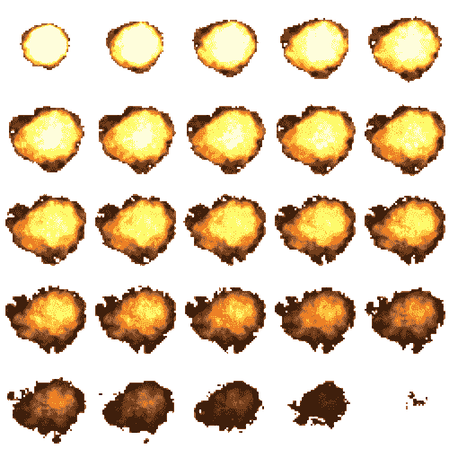
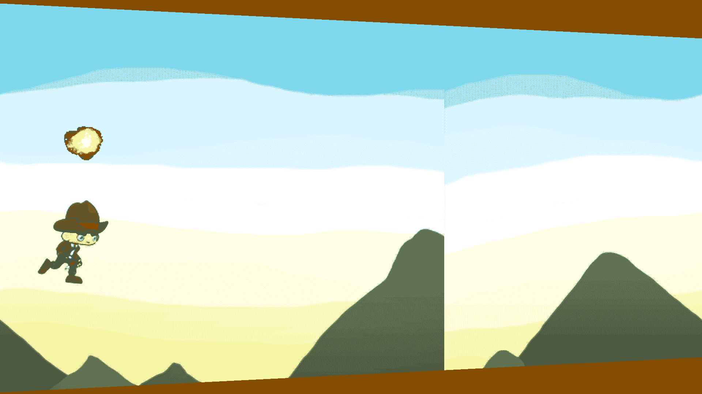
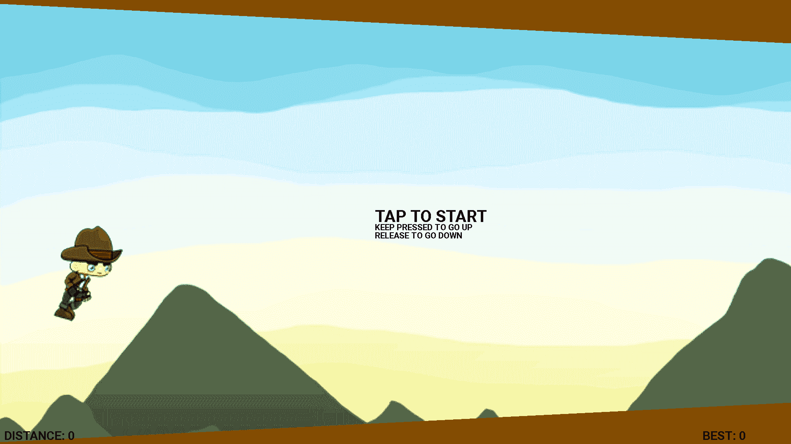
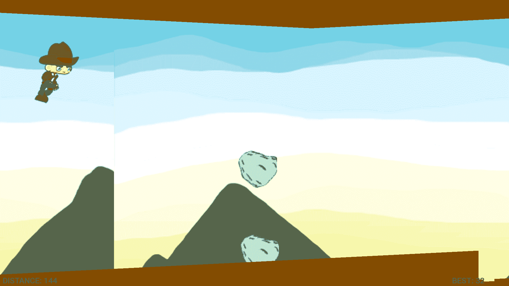

# 第八章：添加爆炸和创建 UI

恭喜你走到了这一步！到现在为止，你必须已经装备了几乎所有的基本知识，以便你开始你的游戏开发之旅。这一章将作为我们游戏的收尾，我们将通过向游戏场景添加爆炸来完成我们的爆炸部分。一旦我们完成了这个，我们将为我们的游戏创建一个简单的 UI，它将在屏幕上显示我们的分数和距离。所以，系好安全带！你即将完成我们开始的游戏。在本章中，我们将学习以下内容：

+   将爆炸添加到我们的游戏中

+   创建一个带有玩家操作说明的教程

+   使用我们的 UI 在屏幕上显示分数

然而，在我们继续到我们的 UI 之前，让我们首先完成我们的爆炸效果。

# 将爆炸添加到我们的游戏中

在*第七章*，*添加边界和使用精灵创建爆炸*中，我们已经创建了我们的`ExplosionEffect.java`类文件。现在，我们只剩下最后一个任务：在屏幕上生成我们的爆炸。现在，仅作参考，我们将查看我们将用于爆炸文件的图像：

`Explosion.png`文件精灵图集

注意，我们爆炸的最后几帧几乎没有任何图像。这是因为我们不会销毁这个对象；我们只是简单地生成它，并让它现在播放其动画。

让我们继续前进，让我们的爆炸在游戏屏幕上运行。同样，我们将我们的过程分解成简单的步骤。

# 创建变量

如您现在所知，我们将处理我们的`GameView.java`文件来显示爆炸。所以打开你的`GameView.java`文件。我们将首先创建一些变量，如下所示：

```kt
private ExplosionEffect explosionEffect;
private long startReset;
private boolean reset;
private boolean started;

```

我们创建了`explosionEffect`变量来获取对`ExplosionEffect`类以及其他我们创建的变量的引用，以便在玩家碰撞后重置玩家。所以，基本上，我们将要做的是一旦玩家与一块石头碰撞，就会播放爆炸动画，并且玩家将重置到初始状态。

# 一些优化和改进

我们将通过在创建表面后移动`mainThread`来对我们的游戏进行一些优化。因此，我们将从构造函数中移除`mainThread = new MainGameThread(getHolder(), this);`并将其写入我们在`surfaceCreated()`方法中开始运行它的地方，如下所示：

```kt
@Override
public void surfaceCreated(SurfaceHolder holder){

    bgImg = new BackgroundImage(BitmapFactory.decodeResource
    (getResources(), R.drawable.background_image));
    playerCharacter = new PlayerCharacter(BitmapFactory.decodeResource
    (getResources(),R.drawable.player_run),200,246,3);
    rocks = new ArrayList<Rock>();
    upperBoundary = new ArrayList<UpperBoundary>();
    lowerBoundary = new ArrayList<LowerBoundary>();

    mainThread = new MainGameThread(getHolder(), this);
    //we can safely start the game loop
    mainThread.setRunning(true);
    mainThread.start();

}

```

看起来很整洁！现在，我们还需要对我们的触摸事件做一些改进，因为如果我们的玩家与一块石头碰撞，我们将重置游戏到初始状态。所以，我们需要确保只有在游戏处于播放模式或创建或重置了新游戏时才能播放。因此，我们将修改我们的`onTouchEvent()`，使其看起来如下：

```kt
@Override
public boolean onTouchEvent(MotionEvent event)
{
 if(event.getAction() == MotionEvent.ACTION_DOWN) {
 if(!playerCharacter.getPlaying() && newGameCreated && reset){
 playerCharacter.setPlaying(true);
 playerCharacter.setUp(true);
 }
 if(playerCharacter.getPlaying()){
 if(!started)started = true;
 reset = false;
 playerCharacter.setUp(true);
 }        return true;
    }
}

```

在这里，我们只是设置了一些参数，以便更好地控制玩家移动。正如您从我们的第一个`if`块中可以看到，如果`getPlaying()`、`newGameCreated`和`reset`返回一个`false`值，那么我们将`setPlaying`设置为`true`，并将`setUp`设置为`true`。

此外，如果我们的`getPlaying()`已经是`true`，那么我们将检查游戏是否已经开始；如果没有，我们将`started`变量设置为`true`，`reset`设置为`false`，并将`setUp()`设置为`true`。

现在，我们已经设置了新游戏、游戏和重置逻辑，以便玩游戏。我们在这里处理重置变量，但还必须在之前创建的`newGame()`函数中处理它们。然而，在我们这样做之前，让我们引用我们的爆炸效果并确切地告诉它在哪里以及何时生成。

# 生成我们的爆炸效果

我们需要爆炸在玩家与我们的岩石碰撞后生成。一旦玩家与岩石碰撞，游戏就结束了。所以，所有这些都已经在我们的`update()`函数中处理，其中我们已经为`newGame()`函数创建了一个 else 块。让我们利用这个块并编写我们的生成爆炸的逻辑。我们的目标是以下内容：

+   生成爆炸效果

+   在碰撞后启动计时器等待一段时间

+   在一定时间后重置游戏

注意，我们的图像尺寸是 500 x 500，因此我们将把我们的图像分成每个帧的相等部分，从而得到 25 个部分，每个部分尺寸为 100 x 100。我们将每个部分传递给我们的构造函数作为宽度、高度和帧数。如果您用于游戏的图像尺寸不同，那么您需要计算您的尺寸，然后使用与您的图像尺寸相应的值。

我们将进入`update()`函数的`else`块并修改我们之前编写的代码，使其看起来像这样：

```kt
else {
    playerCharacter.resetDYC();
    if(!reset) {
        newGameCreated = false;
        startReset = System.nanoTime();
        reset = true;
        explosionEffect = new ExplosionEffect(BitmapFactory
        .decodeResource(getResources(),R.drawable.explosion)
        playerCharacter.getXC(),playerCharacter.getYC()
        -30,100,100,25);
    }

    //Code block after this part remains the same
}

```

因此，我们现在正在重置玩家的`y`加速度并生成我们的爆炸。然后，在等待一段时间后，我们调用函数来重置我们的游戏。

# 在屏幕上绘制爆炸效果

我们仍然需要在屏幕上绘制我们的爆炸效果，是的，您说得对！我们将在我们的`draw()`方法中这样做。我们还必须确保我们只绘制一次爆炸，即在游戏开始时，因此我们将使用我们的`started`变量来跟踪它：

```kt
if(started) {
    explosionEffect.draw(canvas);
}

```

我们已经完成了我们的绘制逻辑。我们已经完成了爆炸效果的整个逻辑，现在您的`GameView.java`文件的整个代码应该看起来像以下这样；本章所做的所有更改都以粗体标注：

```kt
//Package name and import statements remain same as previous chapter
public class GameView extends SurfaceView implements SurfaceHolder.Callback
{
    //Same variables as defined earlier
 private ExplosionEffect explosionEffect;
 private long startReset;
 private boolean reset;
 private  boolean started;

    private Random rnd = new Random();
    //GameView constructor, SurfaceChanged and surfaceDestroyed methods 
    remain same
    @Override
    public void surfaceCreated(SurfaceHolder holder){
        //bgImg, playerCharacter, rocks, upperBoundary and 
        lowerBoundary code same as before
 mainThread = new MainGameThread(getHolder(), this);        //main thread code after this as earlier

    }
    @Override
    public boolean onTouchEvent(MotionEvent event)
    {
        if(event.getAction() == MotionEvent.ACTION_DOWN) {
 if(!playerCharacter.getPlaying() 
            && newGameCreated && reset){
 playerCharacter.setPlaying(true);
 playerCharacter.setUp(true);
 }
 if(playerCharacter.getPlaying()){
 if(!started)started = true;
 reset = false;
 playerCharacter.setUp(true);
 }            return true;
        }
        //MotionEvent.ACTION_UP code same as earlier

        return super.onTouchEvent(event);
    }

    public void update()
    {
        if(playerCharacter.getPlaying()) {
            //Same code as earlier
        } else {
 playerCharacter.resetDYC();
 if(!reset) {
 newGameCreated = false;
 startReset = System.nanoTime();
 reset = true;
 explosionEffect = new ExplosionEffect(BitmapFactory
                .decodeResource(getResources(),R.drawable.explosion),
                playerCharacter.getXC(),playerCharacter.getYC()
                -30,100,100,25);
 }

 explosionEffect.update();
 long resetElapsed = (System.nanoTime()-startReset)/1000000;

 if(resetElapsed > 2500 && !newGameCreated) {
 newGame();
 }

 if(!newGameCreated) {
 newGame();
 }
        }
    }

    //collision code remains same. no change

    @Override
    public void draw(Canvas canvas)
    {
            //Same as till lower boundary and upper boundary code block
 if(started) {
 explosionEffect.draw(canvas);
 }

            canvas.restoreToCount(savedState);
        }
    }

    //No change in updateUpperBound, updateLowerBound and update method
}

```

因此，现在您可以通过在您的设备上玩游戏来测试您的爆炸效果！



我们的爆炸效果正在发挥作用

咔嚓！我们现在完成了我们的精灵爆炸效果！现在，我们将继续进行这个游戏的最后一部分——UI。

# 为我们的游戏创建 UI

如果你不太熟悉 UI 这个术语，你一定想知道这是什么？UI 是用户界面的缩写。简单来说，UI 可以包括你需要在游戏屏幕或屏幕控制上显示的所有信息。UI 的常见元素包括以下内容：

+   屏幕上显示的文本

+   按钮

+   操控盘

+   指导说明

在本章的这一部分，我们将学习如何在屏幕上显示文本。我们还将指导玩家如何玩游戏。我们将在屏幕上显示以下内容：

+   跑步距离

+   最佳得分

+   游戏玩法说明

因此，在这里我们需要显示最佳得分。然而，我们还没有创建最佳得分变量。对于这部分，我们将完全在我们的`GameView.java`文件中工作。所以，让我们在这个类中定义我们的最佳得分变量：

```kt
private int bestScore;

```

现在，我们已经准备好在屏幕上显示我们的 UI 数据。我们的 UI 将完全基于`draw()`函数，因此我们将定义一个名为`drawText()`的方法，它应该在我们的类中的`draw()`方法中被调用。所以，在我们实际调用`drawText()`方法之前，让我们为它编写一些代码。

在此之前，让我们先计算最佳得分。显然，我们的最佳得分将在第一局游戏结束后计算，所以我们将这个逻辑放入`newGame()`函数中。这个逻辑相当简单。如果当前得分大于初始化为`0`的`bestScore`，那么我们的`bestScore`等于通过`playerCharacter.getScore();`获取的当前得分，这将在`newGame()`函数中：

```kt
if(playerCharacter.getScore() > bestScore) {
    bestScore = playerCharacter.getScore();
}

```

好的，问题解决了，现在我们有了`bestScore`变量，可以用来存储最佳得分；我们的`newGame()`函数看起来是这样的：

```kt
public void newGame () {
    //clear code and minBoundaryHeight, maxBoundaryHeight code same as 
    before
 if(playerCharacter.getScore() > bestScore) { 
        bestScore = playerCharacter.getScore(); 
    } 
    //Rest of the code block after this is the same as previous
}

```

我们现在可以编写我们的`drawText()`方法。为此，我们将使用 Android 中的`Paint`类。`Paint`类包含有关样式、颜色以及如何绘制几何图形、文本和位图的信息。使用这个类，我们可以定义文本的颜色、大小和字体。然后，以我们的画布作为参考，我们可以在画布上绘制文本。所以，让我们在屏幕上显示当前距离和最佳得分：

```kt
public void drawText(Canvas canvas) {
    Paint p = new Paint();
    p.setColor(Color.BLACK);
    p.setTextSize(30);
    p.setTypeface(Typeface.create(Typeface.DEFAULT, Typeface.BOLD));
    canvas.drawText("DISTANCE: "+
    (playerCharacter.getScore()*3),10,HEIGHT-10,p);
    canvas.drawText("BEST: "+ bestScore,WIDTH - 215,HEIGHT-10,p);
}

```

好的，看起来很棒，但是嘿，我们还有一个部分没有完成：教程。游戏开始时，我们需要指导玩家如何玩游戏。所以，我们将添加一个`if`语句来控制教程信息的可见性。我们将指导玩家进行“点击开始”、“按住向上移动”和“松开向下移动”：

```kt
if(!playerCharacter.getPlaying() && newGameCreated && reset) {

    Paint p1 = new Paint();
    p1.setTextSize(40);
    p1.setTypeface(Typeface.create(Typeface.DEFAULT, Typeface.BOLD));
    canvas.drawText("TAP TO START",WIDTH/2-50,HEIGHT/2,p1);

    p1.setTextSize(20);
    canvas.drawText("KEEP PRESSED TO GO UP",WIDTH/2 - 
    50,HEIGHT/2+20,p1);
    canvas.drawText("RELEASE TO GO DOWN",WIDTH/2 - 50,HEIGHT/2+40,p1);
}

```

好的，我们已经完成了`drawText()`方法，整体看起来是这样的：

```kt
public void drawText(Canvas canvas) {
    Paint p = new Paint();
    p.setColor(Color.BLACK);
    p.setTextSize(30);
    p.setTypeface(Typeface.create(Typeface.DEFAULT, Typeface.BOLD));
    canvas.drawText("DISTANCE: "+
    (playerCharacter.getScore()*3),10,HEIGHT-10,p);
    canvas.drawText("BEST: "+ bestScore,WIDTH - 215,HEIGHT-10,p);

if(!playerCharacter.getPlaying() && newGameCreated && reset) {

        Paint p1 = new Paint();
        p1.setTextSize(40);
        p1.setTypeface(Typeface.create(Typeface.DEFAULT, 
        Typeface.BOLD));
        canvas.drawText("TAP TO START",WIDTH/2-50,HEIGHT/2,p1);

        p1.setTextSize(20);
        canvas.drawText("KEEP PRESSED TO GO UP",WIDTH/2 - 
        50,HEIGHT/2+20,p1);
        canvas.drawText("RELEASE TO GO DOWN",WIDTH/2 - 
        50,HEIGHT/2+40,p1);
    }
}

```

现在，还有最后一件事要做。我们需要调用我们的`drawText()`方法。你猜我们在哪里做这件事？我们将在我们类中的`draw()`方法中这样做；让我们来做吧：

```kt
@Override
public void draw(Canvas canvas)
{
    final float scaleFactorX = getWidth()/WIDTH;
    final float scaleFactorY = getHeight()/HEIGHT;
    if(canvas!=null) {
        //No changes in code till if(started) statement

        if(started) {
            explosionEffect.draw(canvas);
        }
 drawText(canvas);

        canvas.restoreToCount(savedState);
    }
}

```

你已经完成了在屏幕上显示文本组件的代码，现在有一个带有 UI 的运行游戏，可以在屏幕上显示教程信息、已覆盖的距离和最佳得分。

让我们回顾一下我们在本章的这一部分所做的代码更改；代码更改以粗体标注：

```kt
//package name and import statements remain the same as before
public class GameView extends SurfaceView implements SurfaceHolder.Callback
{
    //no change in variable names
    //GameView constructor. No change needed, write as is
    //surfaceChanged method constant as before
    //surfaceDestroyed method same as before
    //surfaceCreated method same as before

    //onTouchEvent same as before
    //collision method written as is

    @Override
    public void draw(Canvas canvas)
    {
        final float scaleFactorX = getWidth()/WIDTH;
        final float scaleFactorY = getHeight()/HEIGHT;
        if(canvas!=null) {
            final int savedState = canvas.save();
            canvas.scale(scaleFactorX, scaleFactorY);
            bgImg.draw(canvas);
            playerCharacter.draw(canvas);

            for(Rock r : rocks) {
                r.draw(canvas);
            }

            for(UpperBoundary ub : upperBoundary){
                ub.draw(canvas);
            }

            for(LowerBoundary lb: lowerBoundary) {
                lb.draw(canvas);
            }

            if(started) {
                explosionEffect.draw(canvas);
            }
 drawText(canvas);

            canvas.restoreToCount(savedState);
        }
    }
    //updateUpperBound code remains same
    //updateLowerBound code remains same

    public void newGame () {
        lowerBoundary.clear();
        upperBoundary.clear();
        rocks.clear();

        minBoundaryHeight = 5;
        maxBoundaryHeight = 30;
 if(playerCharacter.getScore() > bestScore) {  
             bestScore = playerCharacter.getScore(); } 
        playerCharacter.resetScore();
        playerCharacter.resetDYC();
        playerCharacter.setYC(HEIGHT/2);

        for(int i=0; i*20<WIDTH+40;i++) {
            if(i==0) {
                upperBoundary.add(new UpperBoundary
                (BitmapFactory.decodeResource(getResources(),
                R.drawable.ground),i*20,0,10));
            } else {
                upperBoundary.add(new UpperBoundary
                (BitmapFactory.decodeResource(getResources(),
                R.drawable.ground),i*20,0,
                upperBoundary.get(i-1).getHeight()+1));
            }
        }

        for(int i = 0; i*20<WIDTH+40;i++) {
            if(i==0) {
                lowerBoundary.add(new LowerBoundary
                (BitmapFactory.decodeResource(getResources(),
                R.drawable.ground),i*20, HEIGHT-minBoundaryHeight));
            } else {
                lowerBoundary.add(new LowerBoundary
                (BitmapFactory.decodeResource
                (getResources(),R.drawable.ground),
                i*20, lowerBoundary.get(i-1).getYC()-1));
            }
        }
        newGameCreated = true;
    }

public void drawText(Canvas canvas) {
 Paint p = new Paint();
 p.setColor(Color.BLACK);
 p.setTextSize(30);
 p.setTypeface(Typeface.create(Typeface.DEFAULT, 
        Typeface.BOLD));
 canvas.drawText("DISTANCE: "+
        (playerCharacter.getScore()*3),10,HEIGHT-10,p);
 canvas.drawText("BEST: "+ bestScore,WIDTH - 215,HEIGHT-10,p);

 if(!playerCharacter.getPlaying() && newGameCreated && reset) {

 Paint p1 = new Paint();
 p1.setTextSize(40);
 p1.setTypeface(Typeface.create(Typeface.DEFAULT,            Typeface.BOLD));
 canvas.drawText("TAP TO START",WIDTH/2-50,HEIGHT/2,p1);

 p1.setTextSize(20);
 canvas.drawText("KEEP PRESSED TO GO UP",WIDTH/2 - 
            50,HEIGHT/2+20,p1);
 canvas.drawText("RELEASE TO GO DOWN",WIDTH/2 - 
            50,HEIGHT/2+40,p1);
 }
 }

}

```

如果你已经完成了所有这些步骤，那么你现在可以继续在你的设备或模拟器上测试你的游戏了。你将得到如下输出：



显示我们信息的教程

在游戏过程中，我们也可以看到我们的得分：



随着游戏的进行，覆盖的距离和最佳得分更新

因此，我们完成了我们的 2D 游戏。现在，基于你对前几章的理解，你可以向这个游戏中添加元素，比如金币、更多障碍，以及你能想象到的任何东西。现在建议你尽可能根据你的理解来定制这个游戏，或者你也可以完全开始创建一个新的游戏。

# 摘要

我们创建并显示了我们教程信息、已覆盖的距离和屏幕上的最佳得分。

我们学习了如何在屏幕上创建文本，帮助我们显示得分，并最终实现了爆炸逻辑，使得在撞到岩石后爆炸会在屏幕上显示。这就是我们的 3D 游戏的全部内容。在此之后，你可以构建你的游戏，在你的设备上测试它，甚至进一步调整以添加更多障碍或使其变得尽可能有趣。你唯一受限制的是你的想象力。

有了这个，我们完成了我们的 2D 游戏，我们将在下一章中探讨如何过渡到 3D 世界。
