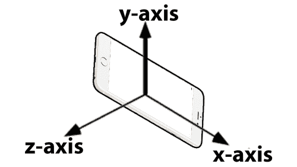
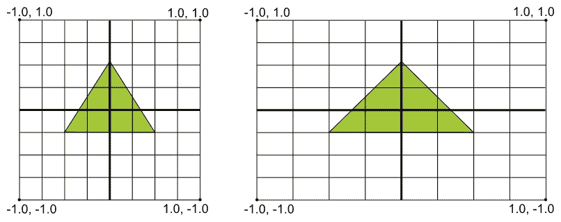
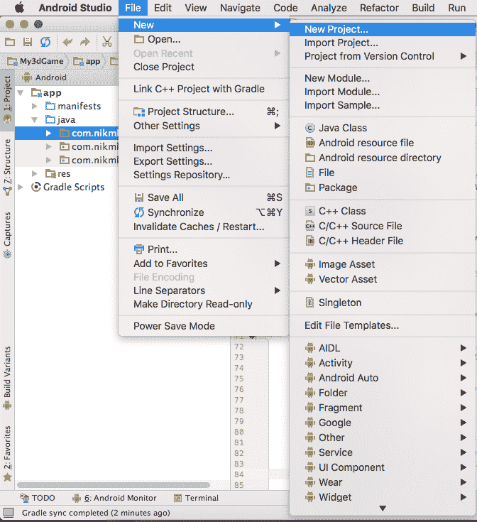
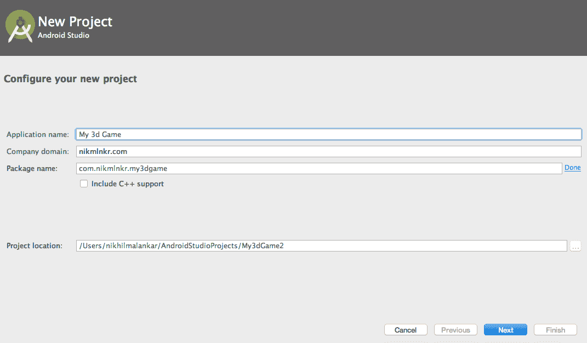
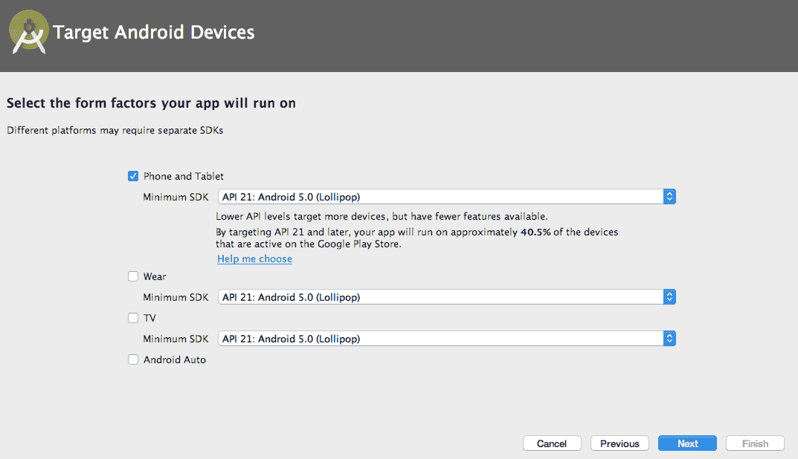
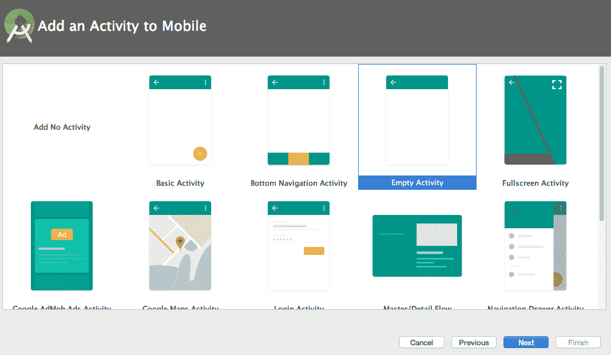
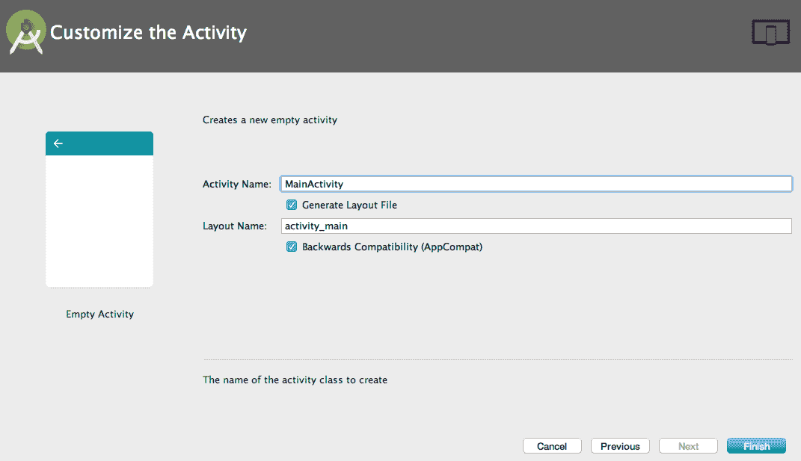
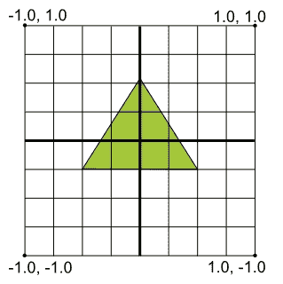

# 第九章：将您的游戏从 2D 转换为 3D

现在，请注意，在 Android Studio 中从头开始制作 3D 游戏是一项艰巨的任务。并不是绝对必要在 3D 中从头开始制作游戏，因为市场上有很多工具和游戏引擎可用，这些工具和引擎消除了从头开始创建一切的需求。然而，了解幕后如何操作的知识将肯定有助于你长期发展。

在本章中，我们将学习一些高级概念的基础知识，到本章结束时，你将了解如何在 Android Studio 中创建基本 3D 对象。为了本章的目的，我们将创建一个新的 Android Studio 项目，因为我们不会继续在先前的游戏项目文件夹中继续。然而，在我们开始之前，让我们简要地看看我们将学习的概念。在本章中，我们将学习以下概念：

+   OpenGL ES 简介

+   使用 OpenGL ES 学习 3D 坐标系

+   使用 OpenGL ES 创建场景

    +   项目文件夹

    +   渲染类和主活动

    +   定义形状

为了创建我们的 3D 图形，我们将使用 OpenGL ES 进行渲染。让我们了解 OpenGL ES 是什么。

# OpenGL ES 简介

在 Android 上，通过 OpenGL 库支持高性能的 2D 和 3D 图形。我们使用 OpenGL ES API，该 API 用于此。此 API 指定了 3D 图形处理硬件的接口。OpenGL 是一个庞大的库，其中一部分是 OpenGL ES，它是专门为嵌入式设备创建的。

在 Android 上支持的 OpenGL ES API 的各个版本如下：

+   1.0 和 1.1：支持 Android 1.0 及更高版本

+   2.0：支持 Android 2.2（API 级别 8）及更高版本

+   3.0：支持 Android 4.3（API 级别 18）及更高版本

+   3.1：支持 Android 5.0（API 级别 21）及更高版本

你可以在 Android 官方网站上阅读更多关于此的信息：[`developer.android.com/guide/topics/graphics/opengl.html`](https://developer.android.com/guide/topics/graphics/opengl.html)。

使用 OpenGL ES，你可以在 Android 上创建 3D 图形。由于我们将创建 3D 对象，我们需要了解坐标系。让我们快速看一下我们将用于我们示例的 3D 坐标系。

# 学习 3D 坐标系

在制作我们的 2D 游戏时，我们只处理*x*和*y*轴的值。然而，当你制作 3D 游戏时，你必须处理三个轴的值：*x*、*y*和*z*。到目前为止，我们对*x*和*y*轴的值是如何工作的已经很清楚。以类似的方式，我们的*z*轴被投影到我们移动设备的正面和背面。以下图像将更好地解释我们 3D 坐标系中的三个轴：



手机上的正*x*、*y*和*z*轴

在前面的图像中您看到的轴是正方向。如果您取它们的相反方向，您将得到负值。原点从(0,0,0)开始，您的值可以是浮点值，这将表示您的对象在 3D 空间中的位置。

这里有一个您在处理 OpenGL 时可能会遇到的一个经典问题，与设备屏幕尺寸有关。OpenGL 中的网格假设一个屏幕，它是正方形并且具有统一的坐标系统。然而，如果您的屏幕尺寸不同，那么非正方形屏幕被视为一个完美的正方形屏幕。为了理解这一点，请看以下图示：



理解默认的 OpenGL 坐标系统

如前图所示，我们有两个不同的屏幕，一个是正方形形状的，另一个是矩形的。现在，这里发生的情况是，尽管您的屏幕是矩形，但它被视为正方形，因此您的图形被拉伸。为了解决这个问题，您需要应用 OpenGL 投影模式和相机视图来变换坐标，以便在任何显示上获得适当的比例。

要这样做，我们创建一个投影矩阵和一个相机视图矩阵，然后将它们应用到我们的 OpenGL 渲染管线中。投影矩阵帮助我们通过重新计算我们的图形矩阵来处理坐标，以便它们正确地映射到我们的设备屏幕上。相机视图矩阵帮助创建一个变换，从特定的眼睛位置渲染对象。

你可以在[`en.wikipedia.org/wiki/OpenGL_ES`](https://en.wikipedia.org/wiki/OpenGL_ES)了解更多关于 OpenGL ES 的信息。

现在我们已经了解了这些基本概念，我们可以开始使用 OpenGL ES 在 Android 中创建我们的 3D 游戏场景；让我们开始吧！

# 使用 OpenGL ES 创建 3D 场景

就像我们在 2D 游戏示例中所做的那样，我们的大部分绘图机制将保持不变。您会发现这两个过程之间有很多相似之处。我们将为这个示例创建一个新的项目文件夹，所以让我们继续创建一个新的项目，就像我们在第八章中做的那样，*添加爆炸和创建用户界面*。

# 创建我们的项目文件夹

我们将遵循我们在第二章中做的步骤，*熟悉 Android Studio*。首先，我们将从我们的顶部菜单创建一个新的项目。

要创建一个新的项目，请执行以下步骤：

1.  前往文件 | 新建 | 新项目...，如下截图所示：



1.  填写你的应用程序名称、公司域名和包名详细信息；然后点击下一步：



1.  选择您的目标设备并点击下一步：



1.  选择空活动并点击下一步：



1.  填写你的活动名称、布局名称，然后点击完成：



好吧，我们现在已经设置了我们的新项目文件夹。此外，我们将为这个项目使用横屏模式方向，所以我们将它在`AndroidManifest.xml`文件中定义。从`app/manifests/AndroidManifest.xml`文件打开您的清单文件，并做出以下标记为粗体的更改：

```java
<?xml version="1.0" encoding="utf-8"?>
<manifest xmlns:android="http://schemas.android.com/apk/res/android"
    package="com.nikmlnkr.my3Dgame">

    <application
        android:allowBackup="true"
        android:icon="@mipmap/ic_launcher"
        android:label="@string/app_name"
        android:roundIcon="@mipmap/ic_launcher_round"
        android:supportsRtl="true"
        android:theme="@style/AppTheme">
<activity android:name=".MainActivity" 
        android:screenOrientation="landscape">
            <intent-filter>
                <action android:name="android.intent.action.MAIN" />

                <category android:name="android.intent.category.LAUNCHER" />
            </intent-filter>
        </activity>
    </application>

</manifest>

```

让我们现在定义我们的主活动并为我们的 3D 游戏视图创建一个渲染类。

# 创建一个渲染类和定义主活动

为了在屏幕上看到任何东西，我们必须在屏幕上渲染它。因此，我们需要创建一个渲染类来处理我们功能中的渲染部分。渲染是通过计算机程序从 2D 或 3D 模型生成图像的过程。我们将命名我们的渲染类为`MyGLRenderer`，但在我们这样做之前，让我们定义我们的主活动。所以打开您的`MainActivity.java`文件，我们将在那里创建三个默认方法。删除屏幕上的所有内容，除了您的包名第一行。我们将有三个方法：

+   `onCreate()`: 这个方法初始化我们的主活动

+   `onPause()`: 当应用进入后台时，这个方法处理应用。

+   `onResume()`: 用户返回应用后，这个方法会被调用。

此外，我们在这里处理的是 OpenGL 图形，因此我们需要一个`GLSurfaceView`，就像我们在我们的 2D 游戏中做的那样，我们有一个用于游戏的表面视图。

因此，让我们在`MainActivity.java`文件中创建它们，如下所示：

```java
package com.nikmlnkr.my3Dgame;

import android.app.Activity;
import android.opengl.GLSurfaceView;
import android.os.Bundle;

public class MainActivity extends Activity {

    private GLSurfaceView gv;

    //Our onCreate method
    @Override
    protected void onCreate(Bundle savedInstanceState) {
        super.onCreate(savedInstanceState);
        gv = new GLSurfaceView(this);
        gv.setRenderer(new MyGLRenderer(this));
        this.setContentView(gv);
    }

    //Resume method
    @Override
    protected void onResume() {
        super.onResume();
        gv.onResume();
    }

    //Pause method
    @Override
    protected void onPause() {
    super.onPause();
        gv.onPause();
    }
}

```

好吧，看起来没问题，但现在我们在`MyGLRenderer`行上遇到了错误。这是因为我们还没有创建我们的渲染器类。让我们现在创建我们的渲染器类。创建一个新的 Java 类文件，命名为`MyGLRenderer.java`，让我们开始编写我们的渲染器类。

`Renderer`类是您将进行大部分对象显示的地方。

接口`GLSurfaceView.Renderer`负责让 OpenGL 渲染一个帧，因此我们需要在我们的代码中实现它作为一个接口；所以我们将从我们的第一行开始，这将做同样的事情。我们将扩展我们的类到`GLSurfaceView.Renderer`接口，并编写一个默认构造函数，如下所示：

```java
public class MyGLRenderer implements GLSurfaceView.Renderer {
    Context ct;    //Context variable

    //Constructor of our renderer class
    public MyGLRenderer(Context ct) {
        this.ct = ct;
    }
}

```

现在，在这个类中，就像我们在我们的 2D 精灵示例游戏中做的那样，我们需要三个方法来在屏幕上绘制；它们是`onSurfaceCreated()`、`onSurfaceChanged()`和`onDraw()`。然而，在 OpenGL 中，`onDraw()`方法实际上是`onDrawFrame()`，所以让我们逐一定义这三个方法。

首先，我们将从我们的`onSurfaceChanged()`方法开始。在这个方法中，我们将创建我们的表面。这个方法用于初始化我们的场景。在这里，我们将在屏幕上创建一个简单的黑色屏幕。为了设置我们的颜色，我们将使用 RGBA 值。对于黑色，我们需要(0,0,0,1)的 RGBA 值。我们还会在这里添加一些更多的初始化因素：

```java
    @Override
    public void onSurfaceCreated(GL10 gles, EGLConfig c) {
        gles.glClearColor(0.0f, 0.0f, 0.0f, 1.0f); 
        //Clear color and set to black

        gles.glClearDepthf(1.0f); 
        //Clear depth

        gles.glEnable(GL10.GL_DEPTH_TEST);
        //Enable depth test

        gles.glDepthFunc(GL10.GL_LEQUAL); 
        //Set depth function

        gles.glHint(GL10.GL_PERSPECTIVE_CORRECTION_HINT, 
        GL10.GL_NICEST);
        //set gl to nicest

        gles.glShadeModel(GL10.GL_SMOOTH); 
        //set shade model to smooth

        gles.glDisable(GL10.GL_DITHER); 
        //disable dither
    }

```

这些参数基本上是必需的，用于设置 OpenGL ES 环境中的各种方面。你可以通过[`www.khronos.org/registry/OpenGL-Refpages/es3.0/`](https://www.khronos.org/registry/OpenGL-Refpages/es3.0/)了解更多关于这些特定方法和更多信息。

这个方法在`onSurfaceCreated()`方法之后被调用，并且每次屏幕分辨率改变时也会被调用。基本上，这个方法负责创建我们在本章中较早看到的显示矩阵，这反过来又会在任何屏幕上创建一个均匀的形状：

```java
    @Override
    public void onSurfaceChanged(GL10 gles, int w, int h) {
        if (h == 0) h = 1;
        float aspect = (float)w / h;

        gles.glViewport(0, 0, w, h); 
        //dynamically set the width and height of our viewport as per screen 
        resolution

        gles.glMatrixMode(GL10.GL_PROJECTION); 
        //set our matrix mode projection

        gles.glLoadIdentity();
        GLU.gluPerspective(gles, 45, aspect, 0.1f, 100.f);

        gles.glMatrixMode(GL10.GL_MODELVIEW); 
        //set our camera view matrix mode

        gles.glLoadIdentity();
    }

```

最后，我们有`onDrawFrame()`函数，它用于绘制当前帧。在每一帧之后，我们需要清除之前绘制的屏幕，因此在这个函数中，在渲染任何其他代码之前，我们调用`glClear()`。现在，我们只需编写我们的清除代码，然后在清除代码之后，在这个函数中绘制我们的对象形状：

```java
    @Override
    public void onDrawFrame(GL10 gles) {
        gles.glClear(GL10.GL_COLOR_BUFFER_BIT | 
        GL10.GL_DEPTH_BUFFER_BIT);    
        //clear depth buffer
    }

```

最后，这是你的`Renderer`类的整个代码看起来像这样：

```java
package com.nikmlnkr.my3Dgame;

/**
 * Created by nikhilmalankar on 05/03/17.
 */
import javax.microedition.khronos.egl.EGLConfig;
import javax.microedition.khronos.opengles.GL10;
import android.content.Context;
import android.opengl.GLSurfaceView;
import android.opengl.GLU;

public class MyGLRenderer implements GLSurfaceView.Renderer {
    Context ct;    //Our context variable

    // Constructor of our renderer
    public MyGLRenderer(Context ct) {
        this.ct = ct;
    }

    // Call back when the surface is first created or re-created
    @Override
    public void onSurfaceCreated(GL10 gles, EGLConfig c) {
        gles.glClearColor(0.0f, 0.0f, 0.0f, 1.0f);
        gles.glClearDepthf(1.0f);
        gles.glEnable(GL10.GL_DEPTH_TEST);
        gles.glDepthFunc(GL10.GL_LEQUAL);
        gles.glHint(GL10.GL_PERSPECTIVE_CORRECTION_HINT, 
        GL10.GL_NICEST);
        gles.glShadeModel(GL10.GL_SMOOTH);
        gles.glDisable(GL10.GL_DITHER);
    }

    @Override
    public void onSurfaceChanged(GL10 gles, int w, int h) {
        if (h == 0) h = 1;
        float aspect = (float)w / h;

        gles.glViewport(0, 0, w, h);

        gles.glMatrixMode(GL10.GL_PROJECTION);

        gles.glLoadIdentity();
        GLU.gluPerspective(gles, 45, aspect, 0.1f, 100.f);

        gles.glMatrixMode(GL10.GL_MODELVIEW);
        gles.glLoadIdentity();
    }

    @Override
    public void onDrawFrame(GL10 gles) {
        gles.glClear(GL10.GL_COLOR_BUFFER_BIT | 
        GL10.GL_DEPTH_BUFFER_BIT);    
        //clear our depth buffer
    }
}

```

现在，我们将学习如何定义和绘制，或者更准确地说，*渲染*我们的 3D 对象在屏幕上。首先，我们将从一个基本的三角形形状开始，然后我们将绘制一个金字塔，然后我们将使它们两个在屏幕上旋转。

# 定义形状

为了在屏幕上绘制某些东西，我们首先需要定义其形状，然后渲染它。因此，我们不会在我们的渲染类中定义我们的形状。我们将创建一个新的类来定义我们的形状。正如讨论的那样，我们首先创建一个基本的三角形。

为了创建我们的三角形，我们首先需要定义其顶点。因此，让我们创建一个新的类名为`Triangle.java`，并开始编写我们的逻辑来定义 3D 三角形的形状。在我们开始编写代码之前，让我们尝试理解我们实际上要做什么。

我们将在屏幕上绘制顶点。此外，正如你之前看到的 OpenGL 坐标如何工作，我们将在三个方向上绘制我们的顶点。对于我们的三角形，我们需要绘制三个点。因此，我们将在一个正**y 轴**上绘制一个点，其他两个点分别绘制在正负**x 轴**上：



绘制我们的三角形

为了这个目的，我们将使用一个三维数组来存储我们的顶点，并在我们的类中定义它们作为变量：

```java
package com.nikmlnkr.my3Dgame;

/**
 * Created by nikhilmalankar on 05/03/17.
 */
public class Triangle {
    private float[] v = {  // Vertices of our triangle
        0.0f,  1.0f, 0.0f, // 0\. top vertices
        -1.0f, -1.0f, 0.0f, // 1\. left-bottom vertices
        1.0f, -1.0f, 0.0f  // 2\. right-bottom vertices
    };
}

```

这样我们就处理了顶点，并定义了其形状，好吧，某种程度上是这样，但当然，还有更多。我们还需要定义一个顶点缓冲区并将这些数据传输到其中。为此，我们将定义我们的顶点缓冲区变量为 nio 的缓冲区，因为它们位于本地堆上，不会被垃圾回收。我们也会为我们的索引缓冲区做同样的事情，这将使我们的三角形以逆时针（CCW）方向排列，并且正**z**方向朝向屏幕。因此，首先我们将定义我们的`vertexBuffer`和`indexBuffer`变量，然后在我们的默认构造函数中，我们将设置我们的`vertexBuffer`和`indexBuffer`：

```java
    private FloatBuffer vb;
    private ByteBuffer ib

    private byte[] ind = { 0, 1, 2 };

    public Triangle() {
        ByteBuffer vbb = ByteBuffer.allocateDirect(v.length * 4);
        vbb.order(ByteOrder.nativeOrder());
        vb = vbb.asFloatBuffer();
        vb.put(v);
        vb.position(0);

        ib = ByteBuffer.allocateDirect(ind.length);
        ib.put(ind);
        ib.position(0);
    }

```

好的，现在我们已经处理好了这些，我们实际上还必须在屏幕上绘制我们的三角形；为此，我们将使用我们的`draw()`方法。要做到这一点，我们将遵循以下四个简单步骤：

1.  我们启用了顶点数组客户端状态。

1.  我们指定缓冲区位置。

1.  我们使用`glDrawElements()`来渲染我们的原始形状，该函数使用索引数组来引用顶点数组。

1.  我们禁用了我们的顶点数组客户端状态。

既然我们已经理解了其理论的工作原理，那么让我们继续通过在代码中实现它来实践：

```java
public void draw(GL10 gles) {
    gles.glEnableClientState(GL10.GL_VERTEX_ARRAY);
    gles.glVertexPointer(3, GL10.GL_FLOAT, 0, vb);

    gles.glDrawElements(GL10.GL_TRIANGLES, ind.length,
    GL10.GL_UNSIGNED_BYTE, ib);
    gles.glDisableClientState(GL10.GL_VERTEX_ARRAY);
}

```

我们的定义形状是完美的，我们的整个`Triangle.java`文件的代码块将看起来像这样：

```java
package com.nikmlnkr.my3Dgame;

/**
 * Created by nikhilmalankar on 05/03/17.
 */

import java.nio.ByteBuffer;
import java.nio.ByteOrder;
import java.nio.FloatBuffer;
import javax.microedition.khronos.opengles.GL10;

public class Triangle {
    private FloatBuffer vb;
    private ByteBuffer ib;

    private float[] v = {  // Vertices of our triangle
        0.0f,  1.0f, 0.0f, // 0\. top vertices
        -1.0f, -1.0f, 0.0f, // 1\. left-bottom vertices
        1.0f, -1.0f, 0.0f  // 2\. right-bottom vertices
    };
    private byte[] indices = { 0, 1, 2 };

    public Triangle() {
        ByteBuffer vbb = ByteBuffer.allocateDirect(v.length * 4);
        vbb.order(ByteOrder.nativeOrder());
        vb = vbb.asFloatBuffer();
        vb.put(v);
        vb.position(0);

        ib = ByteBuffer.allocateDirect(ind.length);
        ib.put(ind);
        ib.position(0);
    }

    public void draw(GL10 gles) {
        gles.glEnableClientState(GL10.GL_VERTEX_ARRAY);
        gles.glVertexPointer(3, GL10.GL_FLOAT, 0, vb);

        gles.glDrawElements(GL10.GL_TRIANGLES, ind.length,
        GL10.GL_UNSIGNED_BYTE, ib);
        gles.glDisableClientState(GL10.GL_VERTEX_ARRAY);
    }
}

```

然而，如果你将此部署到你的设备上，你将无法在屏幕上看到你的三角形。这是因为我们还没有在我们的屏幕上渲染它。还记得我们讨论了如何使用`MyGLRenderer`文件来帮助渲染所有我们的对象吗？我们还没有告诉那个文件使用我们的三角形进行渲染，但这就是本章的全部内容。我们将在下一章中介绍对象的渲染。

# 摘要

在本章中，我们学习了如何从 2D 游戏过渡到 3D 游戏，以及 OpenGL 的相关概念。我们还学习了如何创建我们的主活动以及我们的自定义渲染器。之后，我们学习了如何定义一个基本形状。

总结一下，在本章中，我们涵盖了以下内容。我们介绍了 OpenGL ES，并查看了解同中的坐标系。我们学习了如何创建一个空白场景以及渲染过程。然后我们创建了我们的基本渲染器并定义了我们的三角形形状。

在下一章中，我们将学习如何在屏幕上渲染我们定义的形状并对其进行旋转。我们还将学习如何在下一章中创建一个 3D 金字塔，并在下一章结束时，你将完成这本书，并且也将为创建 2D 和 3D 游戏打下基础。
