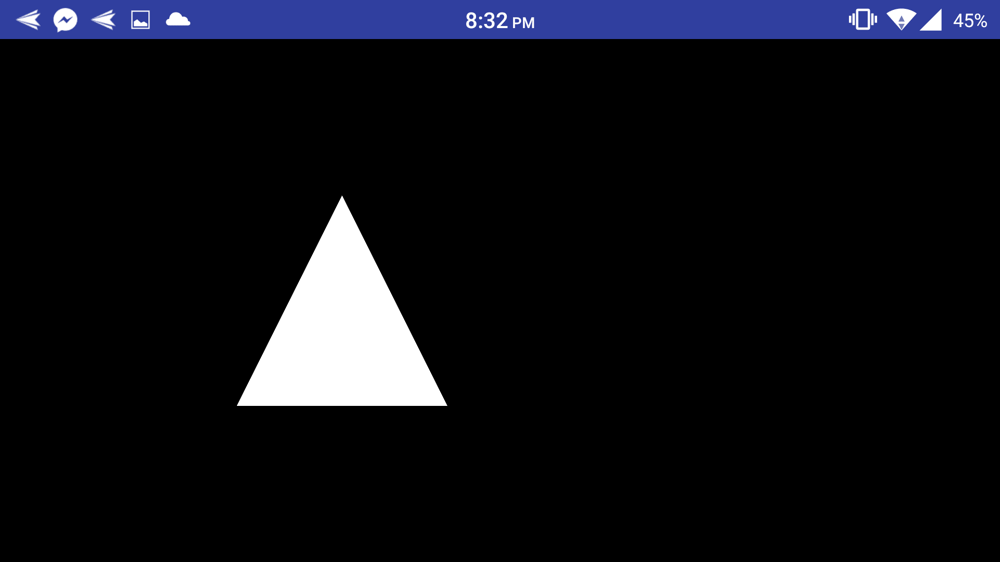
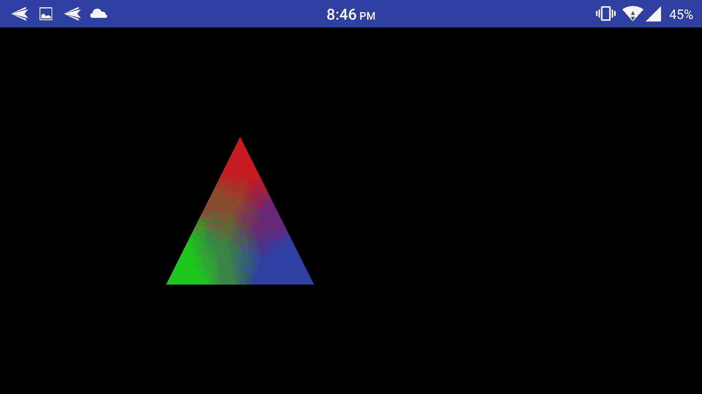
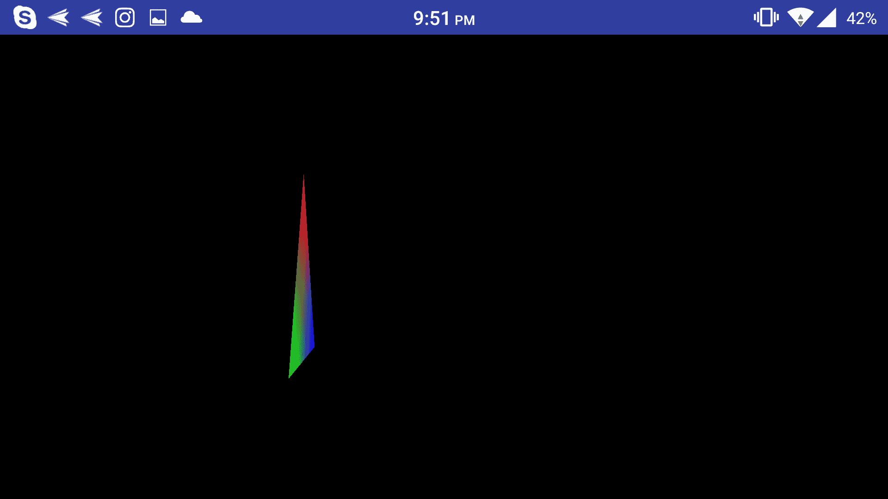

# 第十章：进一步工作在 3D 游戏上

现在我们已经定义了我们的 3D 形状，让我们在屏幕上渲染它。然而，在我们开始本章之前，让我们总结一下这本书内容中我们所学到的所有内容，因为这是我们最后一章。

我们学习了关于 Android 的许多有趣的东西。我们从学习 Android 的历史开始，很快便转向了安装开发 Android 应用所需的软件。之后，我们安装了 Android Studio，并使用 Android-N 的最新组件进行了配置。

一旦我们的环境设置完成，我们学习了如何创建一个基本的 Android 应用，并了解了 Android 的各种概念，如包名、输入、模拟器等。在熟悉 Android 之后，我们学习了如何从制作应用过渡到制作游戏，其中我们学习了如何创建表面和画布，这将允许我们为游戏创建图形，然后我们继续学习游戏开发的各种概念。

随着我们章节的深入，我们开始学习制作游戏的过程，在几章之内，我们学会了如何从头开始使用 UI 创建 2D 游戏。我们用同样的方法完成了一个完整的 2D 游戏开发，然后转向将事物转化为 3D。

在我们之前的章节中，我们了解到我们可以使用 OpenGL ES 为原生 Android 创建 3D 游戏，因此我们开始定义基本形状。

在这本书的最后一章，我们将学习以下主题：

+   在屏幕上渲染我们的对象

+   给我们的对象添加颜色

+   旋转我们的两个 3D 对象

+   创建一个金字塔

所以，无需多言，让我们开始这本书的最后一部分，这将为我们开始 3D 游戏开发之旅奠定所需的基础。

# 在屏幕上渲染我们的对象

在我们之前的章节中，我们为我们的`Triangle`对象创建了一个类；然而，如果你运行你的游戏，它仍然会显示一个空白屏幕，因为我们还没有使用我们的渲染类来显示它。我们需要为我们的新定义的类创建一个对象，然后使用我们的 GL 引用，我们在屏幕上绘制/渲染它。打开你的`MyGLRenderer.java`文件，让我们首先声明一个三角形变量的声明。我们不会修改我们在`onSurfaceCreated()`或`onSurfaceChanged()`方法中编写的任何代码。

为了在我们的屏幕上绘制我们的对象，我们将简单地遵循以下步骤：

1.  定义我们的`Triangle`类的变量。

1.  在我们的构造函数中为其分配一个引用。

1.  使用 gl，在我们的`Triangle`中访问`draw()`方法，将其显示在屏幕上。

让我们看看我们如何做到这一点；只需在你的`MyGLRenderer.java`文件中输入以下加粗代码：

```kt
//The import statements are same as our previous chapter

public class MyGLRenderer implements GLSurfaceView.Renderer {
 Triangle triangle;

    // Constructor
    public MyGLRenderer(Context context) {
        triangle = new Triangle();
    }

    //onSurfaceCreated and onSurfaceChanged methods remain same as previous chapter

    @Override
    public void onDrawFrame(GL10 gles) {
        gles.glClear(GL10.GL_COLOR_BUFFER_BIT | 
        GL10.GL_DEPTH_BUFFER_BIT);

 gles.glLoadIdentity();
        gles.glTranslatef(-1.5f, 0.0f, -6.0f);
        triangle.draw(gles);
    }
}

```

非常简单，就是这样！你的三角形对象已经准备好在屏幕上渲染了。你不相信吗？那就试试吧；在你的模拟器/设备上测试和运行它，你将得到以下输出：



我们的三角形终于渲染在屏幕上了！

你可能会认为这个物体仍然是 2D 的，但请等到我们旋转它的部分。然而，在那之前，让我们学习如何给这个物体添加颜色。所以，让我们添加一些颜色。

# 给我们的物体添加颜色

在这部分，我们将演示我们如何使用不同的颜色来纹理我们的物体。我们将使用`colorBuffer`中的 RGB 值从顶点的颜色中获取值。之后，我们将启用颜色数组客户端状态，然后这些颜色将与顶点一起在`glDrawElements()`中渲染。

在这里，我们再次使用 nio 的`FloatBuffer`来声明我们的`colorBuffer`变量。以下是我们要用到的步骤来给我们的物体添加颜色：

1.  我们声明我们的`colorBuffer`变量。

1.  我们声明我们的颜色数组变量。

1.  我们将我们的颜色顶点数据复制到我们的缓冲区。

1.  启用我们的颜色数组。

1.  定义颜色数组缓冲区。

1.  禁用颜色数组。

此外，由于这是三角形的原生属性，我们将在这我们创建的`Triangle.java`类中编写此代码，而不是在`MyGLRenderer.java`类中。在输入代码时，请记住前面的步骤，并输入以下加粗的代码：

```kt
//Import statements remain the same
public class Triangle {
private FloatBuffer vb;
 private FloatBuffer cb;
    private ByteBuffer ib;

    private float[] v = {  // Vertices of the triangle
            0.0f,  1.0f, 0.0f, // 0\. top vertices
            -1.0f, -1.0f, 0.0f, // 1\. left-bottom vertices
            1.0f, -1.0f, 0.0f  // 2\. right-bottom vertices
    };
    private byte[] ind = { 0, 1, 2 };
 private float[] colors = { 
            1.0f, 0.0f, 0.0f, 1.0f, //R
            0.0f, 1.0f, 0.0f, 1.0f, //G
            0.0f, 0.0f, 1.0f, 1.0f  //B
    };

    public Triangle() {
        //start of code same as earlier
 ByteBuffer cbb = ByteBuffer.allocateDirect(colors.length * 4);
 cbb.order(ByteOrder.nativeOrder());
        cb = cbb.asFloatBuffer();
        cb.put(colors);
        cb.position(0);

        //index buffer code same as earlier
    }

    public void draw(GL10 gles) {
        //code as before
 gles.glDisableClientState(GL10.GL_COLOR_ARRAY);
    }
}

```

现在，我们有一个彩色的三角形。如果你使用了指定的颜色值，你会得到这样的输出。当然，你可以自由地通过改变`colors`变量中的 RGB 值来更改和调整颜色。



我们彩色的三角形

好的，现在我们将使我们的三角形旋转，这将澄清我们的疑问，即它是否真的是一个 3D 物体。

# 旋转我们的物体

到现在为止，你必须已经明白，任何对物体渲染的改变都必须在`MyGLRenderer`中进行，而任何属于我们物体的本地属性则需要在相应的物体文件中进行。因此，我们将把我们的旋转代码写在`MyGLRenderer.java`文件中，因为旋转一个物体是渲染过程的一部分。

这里是我们旋转三角形的逻辑：

+   我们获取我们的旋转角度

+   我们在指定的旋转角度旋转我们的物体。

+   我们增加我们的旋转角度

让我们来做这件事；我们将在开始时简单地声明两个变量来表示旋转角度和速度；然后在我们的`onDrawFrame()`方法中实现我们的旋转逻辑，如下所示：

```kt
//Import statements as before
public class MyGLRenderer implements GLSurfaceView.Renderer {

    Triangle triangle;
 private float angleTriangle = 0.0f;
    private float speedTriangle = 0.5f;

    public MyGLRenderer(Context context) {
        triangle = new Triangle();
    }

// No changes in our onSurfaceCreated and onSurfaceChanged methods so ignore this part

    @Override
    public void onDrawFrame(GL10 gles) {
        //Same as previous part
 angleTriangle += speedTriangle;
    }
}

```

编译此代码后，你的三角形将开始旋转。酷吧？构建并运行，看看你的旋转三角形在动作中的样子！：



我们旋转的三角形

太棒了！现在，让我们利用这些知识来创建一个合适的 3D 物体，我们的金字塔！我们对创建物体的过程非常清楚，所以我们将快速浏览金字塔的部分。

让我们重复相同的步骤来创建金字塔。这次我们的物体将完全是 3D 的，而不仅仅是 2D 平面物体；所以，让我们开始吧！

# 创建一个金字塔 3D 物体

现在您已经了解了如何定义形状并在屏幕上渲染对象，创建我们的 3D 对象将相对容易。我们将遵循与创建我们的三角形几乎相同的程序。我们将创建金字塔，就在我们的三角形旁边；让我们开始吧。

# 定义形状

正如我们从前面的部分学到的，我们将首先创建一个金字塔的类来定义我们的形状。所以创建一个名为`Pyramid.java`的文件来定义金字塔对象的形状。

我们的金字塔有五个面，因此我们需要五个顶点来绘制金字塔。所以，在您创建了`Pyramid.java`之后，我们将定义我们的顶点，如下所示：

```kt
//Package name of our game

public class Pyramid {
    private float[] vp = { // 5 vertices of the pyramid in (x,y,z)
            -1.0f, -1.0f, -1.0f,  //left-bottom-back
            1.0f, -1.0f, -1.0f,  //right-bottom-back
            1.0f, -1.0f,  1.0f,  //right-bottom-front
            -1.0f, -1.0f,  1.0f,  //left-bottom-front
            0.0f,  1.0f,  0.0f   //top
    };
}

```

好吧，现在我们已经设置了顶点，但就像我们的三角形一样，我们仍然需要处理我们的缓冲区和索引。我们将快速定义我们的形状和颜色以及将构成金字塔面的索引的浮点缓冲区和字节数据缓冲区：

```kt
private FloatBuffer vb;  // Buffer for vertex-array
private FloatBuffer cb;   // Buffer for color-array
private ByteBuffer ib;    // Buffer for index-array

private float[] colors = {  // Colors of the 5 vertices in RGBA
        0.0f, 0.0f, 1.0f, 1.0f,  // blue
        0.0f, 1.0f, 0.0f, 1.0f,  // green
        0.0f, 0.0f, 1.0f, 1.0f,  // blue
        0.0f, 1.0f, 0.0f, 1.0f,  // green
        1.0f, 0.0f, 0.0f, 1.0f   // red
};

private byte[] ind = { // Vertex indices
        2, 4, 3,   // front face
        1, 4, 2,   // right face
        0, 4, 1,   // back face
        4, 0, 3    // left face
};

```

现在，我们将根据三角形的逻辑编写我们的`Pyramid`构造函数：

```kt
public Pyramid() {
    ByteBuffer vbb = ByteBuffer.allocateDirect(vp.length * 4);
    vbb.order(ByteOrder.nativeOrder());
    vb = vbb.asFloatBuffer();
    vb.put(vp);
    vb.position(0);

    ByteBuffer cbb = ByteBuffer.allocateDirect(colors.length * 4);
    cbb.order(ByteOrder.nativeOrder());
    cb = cbb.asFloatBuffer();
    cb.put(colors);
    cb.position(0);

    ib = ByteBuffer.allocateDirect(ind.length);
    ib.put(ind);
    ib.position(0);
}

```

最后，当然，如以下代码所示，我们的`draw()`方法：

```kt
   public void draw(GL10 gles) {
      gles.glFrontFace(GL10.GL_CCW);

      gles.glEnableClientState(GL10.GL_VERTEX_ARRAY);
      gles.glVertexPointer(3, GL10.GL_FLOAT, 0, vb);
      gles.glEnableClientState(GL10.GL_COLOR_ARRAY);
      gles.glColorPointer(4, GL10.GL_FLOAT, 0, cb);

      gles.glDrawElements(GL10.GL_TRIANGLES, ind.length, 
      GL10.GL_UNSIGNED_BYTE,ib);

      gl.glDisableClientState(GL10.GL_VERTEX_ARRAY);
      gl.glDisableClientState(GL10.GL_COLOR_ARRAY);
   }

```

我们已经完成了对`Pyramid`形状的定义。所以，最终您的整个`Pyramid`代码将如下所示：

```kt
//Package name and our import statements
public class Pyramid {

//Our 3 buffer variables

    private float[] vp = {
            -1.0f, -1.0f, -1.0f,  //left-bottom-back
            1.0f, -1.0f, -1.0f,  //right-bottom-back
            1.0f, -1.0f,  1.0f,  //right-bottom-front
            -1.0f, -1.0f,  1.0f,  //left-bottom-front
            0.0f,  1.0f,  0.0f   //top
    };

    private float[] colors = {
            0.0f, 0.0f, 1.0f, 1.0f,  //blue
            0.0f, 1.0f, 0.0f, 1.0f,  //green
            0.0f, 0.0f, 1.0f, 1.0f,  //blue
            0.0f, 1.0f, 0.0f, 1.0f,  //green
            1.0f, 0.0f, 0.0f, 1.0f   //red
    };

    private byte[] ind = { // Vertex indices
            2, 4, 3,   // front face (CCW)
            1, 4, 2,   // right face
            0, 4, 1,   // back face
            4, 0, 3    // left face
    };

    public Pyramid() {
        ByteBuffer vbb = ByteBuffer.allocateDirect(vp.length * 4);
        vbb.order(ByteOrder.nativeOrder());
        vb = vbb.asFloatBuffer();
        vb.put(vp);
        vb.position(0);

        ByteBuffer cbb = ByteBuffer.allocateDirect(colors.length * 4);
        cbb.order(ByteOrder.nativeOrder());
        cb = cbb.asFloatBuffer();
        cb.put(colors);
        cb.position(0);

        ib = ByteBuffer.allocateDirect(ind.length);
        ib.put(ind);
        ib.position(0);
    }

// Draw the shape
    public void draw(GL10 gles) {
        gles.glFrontFace(GL10.GL_CCW);

        gles.glEnableClientState(GL10.GL_VERTEX_ARRAY);
        gles.glVertexPointer(3, GL10.GL_FLOAT, 0, vb);
        gles.glEnableClientState(GL10.GL_COLOR_ARRAY);
        gles.glColorPointer(4, GL10.GL_FLOAT, 0, cb);

        gles.glDrawElements(GL10.GL_TRIANGLES, ind.length, 
        GL10.GL_UNSIGNED_BYTE,ib);

        gles.glDisableClientState(GL10.GL_VERTEX_ARRAY);
        gles.glDisableClientState(GL10.GL_COLOR_ARRAY);
    }
}

```

好的，设置好了，但我们仍然看不到屏幕上的金字塔，因为我们还没有渲染它；现在让我们渲染一下，以便将金字塔显示在屏幕上。

# 渲染我们的 3D 对象

根据我们对之前与三角形一起工作的示例的理解，我们非常清楚，为了渲染我们的对象，我们必须使用我们的`MyGLRenderer.java`类。由于我们对 3D 渲染的工作原理非常清楚，我们也会在相同的代码中添加我们的旋转代码。

这里有一个关键的事情需要考虑，我们将绘制金字塔在三角形旁边，所以我们必须确保我们不使金字塔与三角形重叠。为此，我们将使用`gl.Translate()`代码，我们将在绘制三角形后观察`onDrawFrame()`代码块中的后续操作。

我们将工作在`MyGLRenderer.java`文件上，所以打开该文件，并编写以下加粗代码；其余部分保持不变：

```kt
//Package name and import statements

public class MyGLRenderer implements GLSurfaceView.Renderer {

    //our triangle object variables
 private Pyramid pyramid;

 private static float anglePyramid = 0;
    private static float speedPyramid = 2.0f;

    public MyGLRenderer(Context context) {
        //our triangle object reference remains same
 pyramid = new Pyramid();
    }

    //Again there's no change in onSurfaceCreated and onSurfaceChanged methods so type them as is in previous chapter

    @Override
    public void onDrawFrame(GL10 gles) {
        //Triangle code remains same gles.glLoadIdentity();
        gles.glTranslatef(1.5f, 0.0f, -6.0f);
        gles.glRotatef(anglePyramid, 0.1f, 1.0f, -0.1f);
        pyramid.draw(gles);

        //angleTriangle speed assign here
 anglePyramid += speedPyramid;
    }
}

```

好吧，所以一切看起来都准备好了。构建并运行您的项目，您将得到以下输出：


我们的两个对象现在都显示在屏幕上了

恭喜！您已经成功使用 OpenGL 创建了一个 3D 对象。以类似的方式，您可以根据顶点创建任何类型的对象。

这只是使用 OpenGL 创建 3D 基本形状游戏的基石。创建一个完整的 3D 游戏是一项巨大的任务，而这只是您能做的事情的一瞥。

我们建议您购买我们关于 3D 游戏开发的其它书籍，以便更深入地学习创建 3D 游戏。

# 摘要

在本章中，我们学习了如何创建 3D 对象并在屏幕上渲染它们。我们还学习了如何给对象添加颜色以及以 3D 方向旋转它们。随着本章的结束，我们完成了这本书。

我们已经学习了如何使用原生 Android 创建 2D 和 3D 游戏。通过本章获得的知识，你可以开始你的游戏开发之旅，并开始为 Android 创建自己的游戏。

这本书关于使用 Android 创建游戏的内容到此结束。通过本书获得的知识将成为你未来制作游戏的基石。在原生 Android 上创建游戏的优点主要是，游戏的文件大小最终会相当小，这正是用户通常所寻求的。如果你使用引擎创建任何游戏，最终你会得到一个游戏，其文件大小在开发过程结束时相对较大；你需要进一步优化它，但在这方面你所能做的还是有限的。因此，开发原生应用不仅允许你制作出文件大小更小的游戏，还能增强你对整个过程的了解和核心理解。

随着本书的结束，现在就取决于你和你丰富的想象力，开始利用本书所学到的知识来创造游戏。当然，使用引擎来创建游戏无疑是一个更快的流程；如果你想要跳过为每一件事创建自己的类，那么建议你从游戏引擎开始。Packt 提供了多种书籍来帮助你完成这个过程。也许，你开始使用游戏引擎的最佳起点是 *Unity 游戏引擎*。如果你对学习更多并给你的游戏开发过程带来提升感兴趣，那么最好的建议就是阅读 Packt 关于 *Unity 游戏引擎* 的书籍。

祝你在创建下一个游戏时一切顺利！
