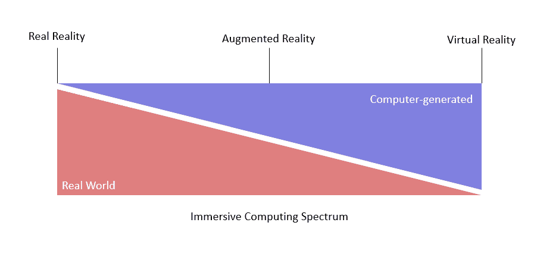
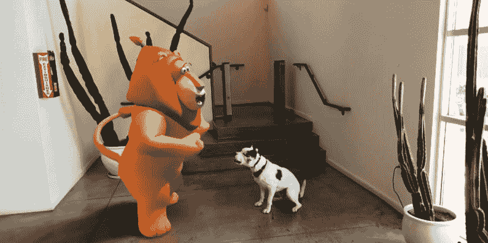
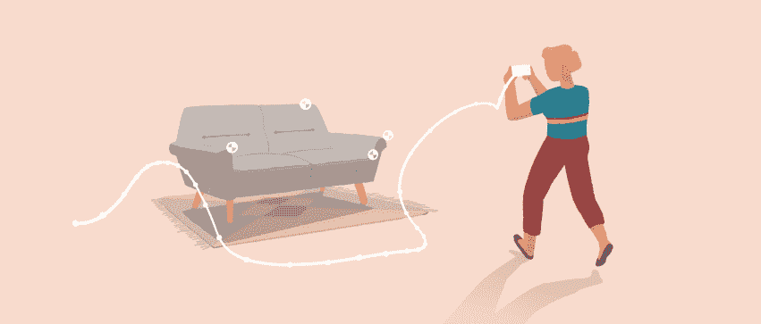
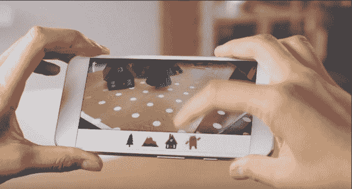
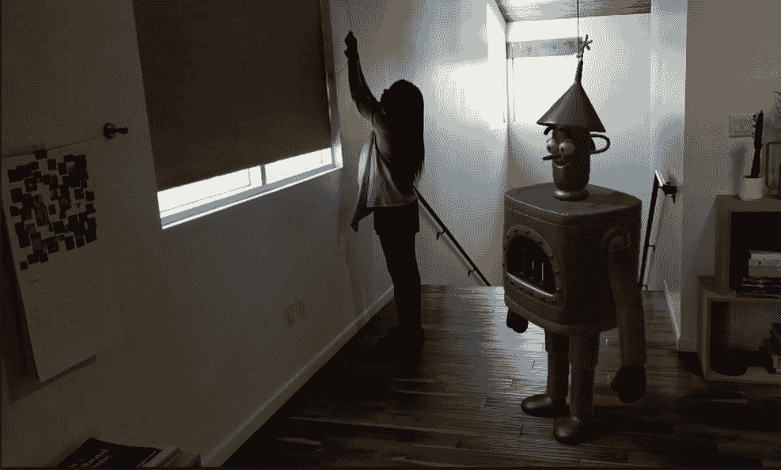

# 第一章：入门

欢迎来到 Google ARCore 的沉浸计算和增强现实的世界。在本书中，我们将从基础知识开始。首先，我们将介绍增强现实（**AR**）的一些重要核心概念。从那里，我们将介绍本书中将使用的三个开发平台（Android、Web 和 Unity）的安装和基础知识。接下来，我们将更深入地探讨 AR 开发者面临的技术挑战，包括解决这些挑战的各种技术和方法。在本书的最后几章中，我们将通过开发三个示例 AR 和**混合现实**（**MR**）应用来扩展这些技能，我们将构建一个机器学习物体识别器、一个 AR 设计应用以及一个从 AR 过渡到 MR 的应用。

我们决定从本书中省略 Unreal 平台，并不是因为它是一个低级的平台，恰恰相反。Unreal 是一个经过验证且处于前沿的游戏引擎，非常适合经验丰富的图形和游戏开发者。然而，Unreal 和 Unity 在开发功能上基本上是相等的。因此，专注于 Unity 更有意义，它更适合学习游戏和图形开发。

在本章中，我们将首先快速介绍沉浸式计算和增强现实的基本概念。然后，我们将探讨 ARCore 旨在解决的核心理问题（运动跟踪、环境理解和光估计）。以下是本章我们将涉及的主题快速浏览：

+   沉浸计算

+   ARCore 和 AR

    +   运动跟踪

    +   环境理解

    +   光估计

+   前方的道路

本书是在 ARCore 的测试版中编写的。如果您发现有任何不同之处或需要更改的内容，请联系 Packt 并提供勘误表。

# 沉浸计算

**沉浸计算**是一个新术语，用来描述为用户提供沉浸式体验的应用。这可能以增强现实或虚拟现实体验的形式出现。虽然本书的重点将主要集中在构建增强现实体验上，但我们也会突出可用于 VR 的技术。为了更好地理解沉浸计算的范围，让我们看一下这个图表：

沉浸计算谱系

上述图表说明了沉浸程度如何影响用户体验，图表的左侧代表沉浸程度较低或几乎没有的传统应用，而右侧则代表完全沉浸的虚拟现实应用。对我们来说，我们将保持在中间的甜蜜点，致力于开发增强现实应用。在下一节中，我们将更详细地介绍 AR 和 ARCore。

# AR 和 ARCore

增强现实应用是独特的，因为它们会注释或增强用户的现实。这通常是通过 AR 应用将计算机图形叠加到现实世界的视图上视觉完成的。ARCore 主要是为了为用户提供这种类型的视觉注释而设计的。这里展示了一个 ARCore 演示应用的例子：

谷歌 ARCore 演示应用；狗是真的

当你意识到这个截图是在移动设备上实时渲染的时候，它甚至更加令人印象深刻。这不是使用 Photoshop 或其他媒体效果库耗时数小时的结果。你在这张图片中看到的是虚拟物体，狮子，在用户现实中的整个叠加。更令人印象深刻的是沉浸感的质量。注意细节，比如狮子上的光照和阴影，地面上的阴影，以及物体在现实中保持位置的方式，尽管它实际上并不在那里。如果没有这些视觉增强，你看到的将只是一个浮现在屏幕上的狮子。正是这些视觉细节提供了沉浸感。谷歌开发了 ARCore，作为一种帮助开发者将这种视觉增强融入构建 AR 应用的方法。

谷歌开发了 ARCore 用于 Android，作为一种与苹果的 iOS ARKit 竞争的方式。今天，两大科技巨头在 AR 领域争夺地位的事实表明了构建新的和创新的沉浸式应用的推动力。

ARCore 起源于 Tango，这是一个更先进的 AR 工具包，它使用内置在设备中的特殊传感器。为了使 AR 更加易于访问和主流，谷歌开发了 ARCore，这是一个为没有配备任何特殊传感器的 Android 设备设计的 AR 工具包。Tango 依赖于特殊传感器，而 ARCore 则使用软件来尝试完成相同的核心增强。对于 ARCore，谷歌确定了三个核心领域，通过这个工具包来解决，如下所示：

+   运动追踪

+   环境理解

+   光估计

在接下来的三个部分中，我们将更详细地探讨这些核心领域，并了解它们如何增强用户体验。

# 运动追踪

跟踪用户在 2D 和 3D 空间中的运动和最终位置是任何 AR 应用的基础。ARCore 允许我们通过识别和跟踪设备摄像头图像中的视觉特征点来跟踪位置变化。这种工作原理的例子如图所示：

ARCore 中的特征点跟踪

在图中，我们可以看到用户的位置是如何相对于在真实沙发上识别的特征点进行跟踪的。之前，为了成功跟踪运动（位置），我们需要预先注册或预先训练我们的特征点。如果你曾经使用过 Vuforia AR 工具，你将非常熟悉需要训练图像或目标标记。现在，ARCore 为我们自动完成所有这些，实时进行，无需任何训练。然而，这种跟踪技术非常新，存在一些限制。在本书的后期部分，特别是在第五章，*真实世界运动跟踪*中，我们将为我们的 AR 助手添加一个功能，允许我们使用 GPS 实时跟踪来自多个设备的多个对象的位置。然后，在第十章，*混合现实中的混合*中，我们将扩展我们的跟踪，包括增强地图。

# 环境理解

AR 应用越好地理解用户的现实或他们周围的环境，沉浸感就越强。我们已经看到了 ARCore 如何使用特征识别来跟踪用户的运动。然而，跟踪运动只是第一步。我们需要的是一种方法来识别用户现实中的物理对象或表面。ARCore 通过一种称为**网格化**的技术来实现这一点。

我们将在后面的章节中详细介绍网格化的更多细节，但现在，请看一下谷歌提供的以下图像，它展示了网格化操作的实际应用：

展示网格化操作的谷歌图像

在前面的图像中，我们看到的是一个通过网格化识别了真实世界表面的 AR 应用。平面通过白色点被识别。在背景中，我们可以看到用户已经在表面上放置了各种虚拟对象。环境理解和网格化对于创建融合现实的幻觉至关重要。运动跟踪使用识别的特征来跟踪用户的位置，而环境理解使用网格化来跟踪用户现实中的虚拟对象。在第八章，*识别环境*中，我们将探讨如何训练我们自己的机器学习对象识别器，这将使我们能够将网格化扩展到包括环境中可自动识别的对象或区域。

# 光度估计

魔术师努力成为欺诈和视觉错觉的大师。他们明白，在伟大的错觉中，透视和良好的光照是至关重要的，而在开发优秀的 AR 应用中，这一点也不例外。请花一秒钟时间回到有虚拟狮子的场景。注意狮子和地面上的阴影的照明和细节。你注意到狮子在地面上投下了影子，尽管它实际上并不在那里吗？这种额外的照明细节是通过结合用户位置的追踪、虚拟对象位置的环境理解以及读取光水平的方式才得以实现的。幸运的是，ARCore 为我们提供了一种读取或估计场景中光照的方法。然后我们可以使用这些照明信息来照亮和投射虚拟 AR 对象的阴影。这是一张显示 ARCore 演示应用上低调照明的图片：

Google 展示低调照明的 ARCore 演示应用图片

随着我们开始开发我们的初创应用程序，光照效果或缺乏光照的影响将变得更加明显。稍后，在第九章 Blending Light for Architectural Design 中，我们将更深入地探讨 3D 光照，甚至构建一些简单的着色器效果。

在本章中，我们没有深入探讨任何详细内容；我们将在稍后进行，但你现在应该已经很好地掌握了 ARCore 旨在解决的核心理念。在下一节中，我们将更详细地探讨如何最好地使用本书中的材料。

# 前方的道路

在本书的剩余部分，我们将采取非常实际的方法。毕竟，没有比实践更好的学习方法了。虽然本书旨在整体阅读，但并非所有读者都有时间或需要这样做。因此，以下表格提供了一个关于书中剩余章节的平台、工具、技术和难度级别的快速总结：

| **章节** | **重点** | **难度** | **平台** | **工具和技术** |
| --- | --- | --- | --- | --- |
| 第二章，*Android 中的 ARCore* | Android 基础 | 基础 | Android (Java) | 安装 Android 的工具和环境。 |
| 第三章，*Unity 中的 ARCore* | Unity 基础 | 基础 | Android/Unity (C#) | Unity 示例的安装、设置和部署。 |
| 第四章，*Web 中的 ARCore* | 构建 ARCore Web 应用 | 中等 | Web (JavaScript) | 支持 Web 开发和托管工具的安装和设置。 |
| 第五章，*现实世界运动追踪* | 3D 空间音频和 Firebase | 中等 | Web (JavaScript) | 使用带有音频的移动设备进行运动追踪，与 Google Firebase 集成，并在 AR 中追踪多个对象和/或用户。 |
| 第六章, *理解环境* | EU 和网格化的介绍 | 中级 | Android (Java) | 学习 ARCore API 的 Java 版本，以及创建一个新的 ARCore Android 项目，对环境进行网格化，并使用 OpenGL ES 与对象交互。 |
| 第七章,*光估计* | Unity 中光估计和光照的介绍 | 高级 | Unity (C#, Cg/HLSL) | 了解光照的重要性以及如何使用它来使 AR 对象看起来更真实。 |
| 第八章,*识别环境* | AR 和机器学习（**ML**）的介绍及其应用 | 高级 | Android (Java), Unity (C#) | 查看各种机器学习平台，以便更好地理解它们在 AR 应用中的使用方法。 |
| 第九章,*为建筑设计融合光线* | 3D 光照和着色器 | 高级 | Unity (C#) | Unity 中光照和着色器的深入介绍，包括编写 HLSL/ Cg 着色器代码。 |
| 第十章,*混合现实中的混合* | 将所有元素结合在一起。 | 高级+ | Unity (C#), Android (Java) | 我们将通过引入混合现实来扩展 ARCore 平台，并允许应用从 AR 过渡到 MR。 |
| 第十一章,*性能和故障排除* | 性能和故障排除技巧 | 基础 | 所有 | 提供了一些关于性能的有用技巧，并有一个专门的部分来解决你在处理示例时可能遇到的问题。 |

此外，第十章，*混合现实中的混合*，是在读者回顾了所有前面的章节之后使用的。

虽然一些读者可能更喜欢只通过那些特定章节来探索单个 ARCore 平台，但你被强烈鼓励完成这本书中的所有示例。鉴于 ARCore API 在各个平台之间如此相似，你学到的技术应该可以很好地转移到另一个平台。另外，不要因为不同的平台或编程语言而感到害怕。如果你在 C 语言方面有良好的知识基础，学习这个家族中的任何其他语言只需要最小的努力。开发者、程序员、软件工程师，或者你想要称自己为什么，你都可以从学习另一种编程语言中受益。

# 摘要

在本章中，我们简要地探讨了沉浸式计算和增强现实（AR）的基本概念。我们了解到，增强现实覆盖了沉浸式计算光谱的中间地带，AR 只是精心混合的幻觉，用来欺骗用户相信他们的现实已经与虚拟现实相结合。毕竟，谷歌开发了 ARCore，作为一种提供构建这些幻觉的更好工具的方式，并保持 Android 在 AR 市场中的竞争力。之后，我们学习了 ARCore 旨在解决的核心概念，并逐一进行了更详细的探讨：运动跟踪、环境理解和光估计。最后，我们为那些希望在最短的时间内从本书中获得最大收益的用户提供了一个有用的路线图。

在下一章中，我们将开始深入探讨，通过设置和调整满足我们需求的样本 Android 项目来“动手实践”。
