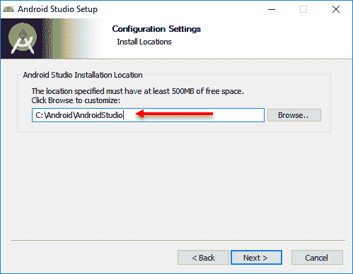
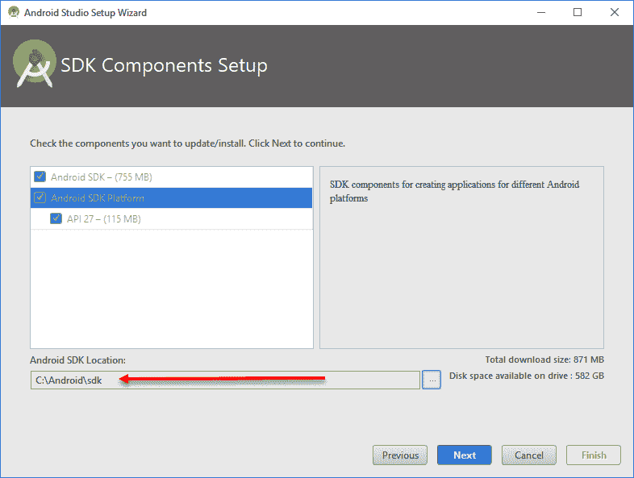
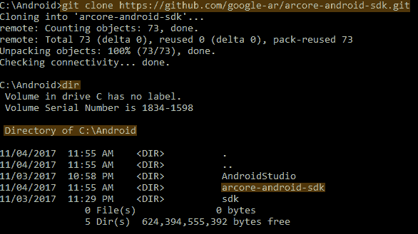
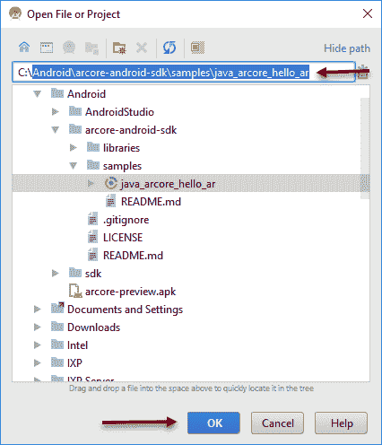
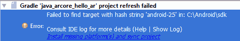
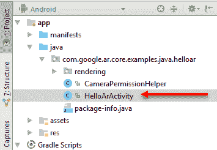

# Android 上的 ARCore

Google 开发了 ARCore，使其可以从多个开发平台（Android [Java]，Web [JavaScript]，Unreal [C++]，和 Unity [C#]）访问，从而为开发者提供了大量的灵活性和选项，以便在各种平台上构建应用程序。虽然每个平台都有其优势和劣势，我们将在后面讨论，但所有平台本质上都扩展了最初作为 Tango 构建的本地 Android SDK。这意味着无论你选择哪个平台，你都需要安装并熟悉使用 Android 开发工具。

在本章中，我们将专注于设置 Android 开发工具和构建 Android 的 ARCore 应用程序。以下是本章我们将涵盖的主要主题摘要：

+   安装 Android Studio

+   安装 ARCore

+   构建和部署

+   探索代码

如果你已经有经验使用 Android 工具并且已经安装了 SDK，你可能只想快速浏览前三部分。否则，请确保跟随本章的练习，因为这些步骤将在本书的许多其他领域的练习中是必需的。

在撰写本文时，为了执行本书中的任何练习，你需要一个支持 ARCore 的设备。支持设备的列表可以在[`developers.google.com/ar/discover/#supported_devices`](https://developers.google.com/ar/discover/#supported_devices)找到。其他人已经做了一些工作来支持早期设备，所以如果你有一个不支持设备，这可能是一个选择。你可以在[`github.com/tomthecarrot/arcore-for-all`](https://github.com/tomthecarrot/arcore-for-all)找到更多关于`ARCore for All`项目的详细信息。

# 安装 Android Studio

Android Studio 是一个用于编码和部署 Android 应用程序的开发环境。因此，它包含了我们构建和部署应用程序到 Android 设备所需的核心工具集。毕竟，ARCore 需要安装到物理设备上以便测试。按照以下说明在你的开发环境中安装 Android Studio：

1.  在你的开发计算机上打开浏览器到[`developer.android.com/studio`](https://developer.android.com/studio)。

1.  点击绿色的“下载 Android Studio”按钮。

1.  同意条款和条件并按照说明下载。

1.  文件下载完成后，运行你的系统安装程序。

1.  按照安装对话框上的说明进行操作。如果你在 Windows 上安装，请确保设置一个容易记住的安装路径，以便稍后轻松找到，如下例所示：



设置 Windows 的安装路径

1.  点击剩余的对话框以完成安装。

1.  安装完成后，您将可以选择启动程序。确保选中启动 Android Studio 的选项，然后点击“完成”。

Android Studio 内置了 OpenJDK。这意味着我们至少在 Windows 上可以省略安装 Java 的步骤。如果您在 Windows 上进行任何严肃的 Android 开发，那么您应该自己执行步骤来安装完整的 Java JDK 1.7 和/或 1.8，尤其是如果您计划使用较旧的 Android 版本。

在 Windows 上，我们将把所有内容安装到 `C:\Android`；这样，我们可以把所有 Android 工具放在一个地方。如果您使用的是其他操作系统，请使用类似的已知路径。

现在我们已经安装了 Android Studio，但我们还没有完成。我们还需要安装构建和部署所必需的 SDK 工具。按照下一项练习中的说明完成安装：

1.  如果您之前没有安装 Android SDK，那么当 Android Studio 首次启动时，您将被提示安装 SDK，如下所示：



为 Windows 设置 SDK 安装路径

1.  选择 SDK 组件，并确保您将安装路径设置为已知位置，再次，如前一张截图所示。

1.  目前请保持 Android Studio 欢迎对话框开启。我们将在稍后的练习中返回它。

这样就完成了 Android Studio 的安装。在下一节中，我们将开始安装 ARCore。

# 安装 ARCore

当然，为了使用或构建任何 ARCore 应用程序，我们需要为我们的选择平台安装 SDK。按照以下说明安装 ARCore SDK：

我们将使用 Git 直接从源代码拉取所需的代码。您可以在 [`git-scm.com/book/en/v2/Getting-Started-Installing-Git`](https://git-scm.com/book/en/v2/Getting-Started-Installing-Git) 上了解更多关于 Git 以及如何在您的平台上安装 Git 的信息，或者使用 Google 搜索：getting started installing Git。确保当您在 Windows 上安装时，选择默认选项，并让安装程序设置 `PATH` 环境变量。

1.  打开命令提示符或 Windows 命令行，导航到 Android (`C:\Android` 在 Windows 上) 安装文件夹。

1.  输入以下命令：

```kt
git clone https://github.com/google-ar/arcore-android-sdk.git
```

1.  这将下载并安装 ARCore SDK 到一个名为 `arcore-android-sdk` 的新文件夹中，如下面的截图所示：



显示 ARCore 安装的命令窗口

1.  确保您保持命令窗口开启。我们稍后还会再次使用它。

# 在设备上安装 ARCore 服务

现在，随着 ARCore SDK 已安装在我们的开发环境中，我们可以继续在测试设备上安装 ARCore 服务。使用以下步骤在您的设备上安装 ARCore 服务：

注意：此步骤仅在处理 ARCore 预览 SDK 时需要。当 Google ARCore 1.0 发布时，你将不需要执行此步骤。

1.  拿起你的移动设备，通过以下步骤启用开发者调试选项：

    1.  打开设置应用

    1.  选择“系统”

    1.  滚动到页面底部并选择“关于手机”

    1.  再次滚动到页面底部并连续点击“构建号”七次

    1.  返回到上一屏幕并选择底部的“开发者选项”

    1.  选择“USB 调试”

1.  从[`github.com/google-ar/arcore-android-sdk/releases/download/sdk-preview/arcore-preview.apk`](https://github.com/google-ar/arcore-android-sdk/releases/download/sdk-preview/arcore-preview.apk)下载 ARCore 服务 APK 到 Android 安装文件夹（`C:\Android`）。此外，请注意，此 URL 可能会在未来发生变化。

1.  使用 USB 线连接你的移动设备。如果你是第一次连接，你可能需要等待几分钟以安装驱动程序。然后，你将被提示开启设备以允许连接。选择“允许”以启用连接。

1.  返回到命令提示符或 Windows shell，并运行以下命令：

```kt
adb install -r -d arcore-preview.apk
//ON WINDOWS USE:
sdk\platform-tools\adb install -r -d arcore-preview.apk 
```

命令运行后，你会看到“成功”这个词。如果你在这一阶段遇到了错误，请确保查阅第十一章，*性能提示和故障排除*，以获取更多帮助。

这就完成了 Android 平台 ARCore 的安装。在下一节中，我们将构建我们的第一个 ARCore 示例应用。

# 构建和部署

现在我们已经完成了所有繁琐的安装步骤，是时候构建并部署一个示例应用到你的 Android 设备上了。让我们回到 Android Studio，按照给定的步骤开始操作：

1.  从 Android Studio 的欢迎窗口中选择“打开现有 Android Studio 项目”选项。如果你意外关闭了 Android Studio，只需再次启动它。

1.  按照以下步骤导航并选择`Android\arcore-android-sdk\samples\java_arcore_hello_ar`文件夹：



选择 ARCore 示例项目文件夹

1.  点击“确定”。如果你是第一次运行此项目，你可能会遇到一些依赖错误，例如这里所示：



依赖错误信息

1.  为了解决错误，只需点击错误信息底部的链接。这将打开一个对话框，你将被提示接受并下载所需的依赖项。继续点击链接，直到不再出现错误。

1.  确保你的移动设备已连接，然后从菜单中选择“运行”-“运行”。这应该在设备上启动应用，但你可能仍然需要解决一些依赖错误。只需记住点击链接来解决错误。

1.  这将打开一个小对话框。选择应用选项。如果你看不到应用选项，从菜单中选择构建 - 构建项目。再次，通过点击链接解决任何依赖错误。

"你的耐心将得到回报。"

- 阿尔顿·布朗

1.  从下一个对话框中选择你的设备并点击“确定”。这将启动你的设备上的应用。确保你允许应用访问设备的相机。以下是一个显示应用运行状态的截图：


运行中的示例 Android ARCore 应用；这只狗是真的

太好了，我们一起构建并部署了我们的第一个 Android ARCore 应用。在下一节中，我们将快速查看 Java 源代码。

# 探索代码

现在，让我们通过深入研究源代码来更仔细地查看应用的主要部分。按照以下步骤在 Android Studio 中打开应用的代码：

1.  从项目窗口中，找到并双击`HelloArActivity`，如图所示：



项目窗口中显示的 HelloArActivity

1.  在源代码加载后，滚动到以下部分：

```kt
private void showLoadingMessage() {
 runOnUiThread(new Runnable() {
  @Override
  public void run() {
   mLoadingMessageSnackbar = Snackbar.make(
    HelloArActivity.this.findViewById(android.R.id.content),
    "Searching for surfaces...",
    Snackbar.LENGTH_INDEFINITE);
   mLoadingMessageSnackbar.getView().setBackgroundColor(0xbf323232);
   mLoadingMessageSnackbar.show();
  }
 });
}
```

1.  注意高亮显示的文本——**`"Searching for surfaces.."`**。选择此文本并将其更改为**`"Searching for ARCore surfaces.."`**。`showLoadingMessage`函数是一个用于显示加载信息的辅助函数。内部，这个函数调用`runOnUIThread`，它反过来创建一个新的`Runnable`实例，然后添加一个内部的`run`函数。我们这样做是为了避免在 UI 上阻塞线程，这是一个大忌。在`run`函数内部设置消息，并显示消息`Snackbar`。

1.  从菜单中选择运行 - 运行 'app' 以在设备上启动应用。当然，确保你的设备通过 USB 连接。

1.  在你的设备上运行应用并确认消息已更改。

太好了，现在我们有一个包含我们自己的代码的工作应用。这当然不是飞跃，但在跑之前先走一走是有帮助的。在这个阶段，返回并审查代码，特别注意注释和流程。如果你从未开发过 Android 应用，代码可能看起来相当令人畏惧，确实如此。不必担心，我们将在第五章现实世界运动跟踪和第六章理解环境中分解并重用这个示例应用的一些元素。

# 摘要

在本章中，我们通过为 Android 平台构建和部署一个 AR 应用开始了对 ARCore 的探索。我们首先安装了 Android Studio，这将成为我们 Android 开发的**集成开发环境**（**IDE**）。然后，我们在测试移动设备上安装了 ARCore SDK 和 ARCore 服务。接下来，我们加载了示例 ARCore 应用，并耐心地安装了各种所需的构建和部署依赖项。在成功构建后，我们将应用部署到我们的设备上并进行了测试。最后，我们测试了对代码进行微小修改后再次部署应用。这样做确保了我们的 Android 开发环境完全可用，我们现在可以继续阅读本书的其余部分。

我们的故事将在下一章继续，我们将使用 Unity 平台构建和部署一个 ARCore 应用。Unity 是一个领先的免费/商业游戏引擎，我们将在第十章混合现实混合的最终项目中使用。
