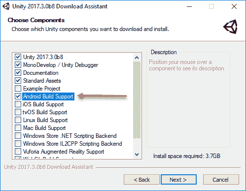
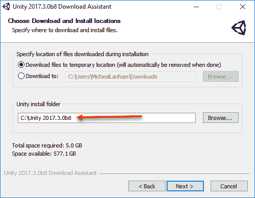
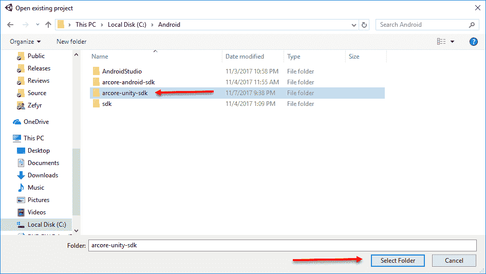
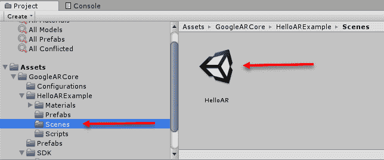
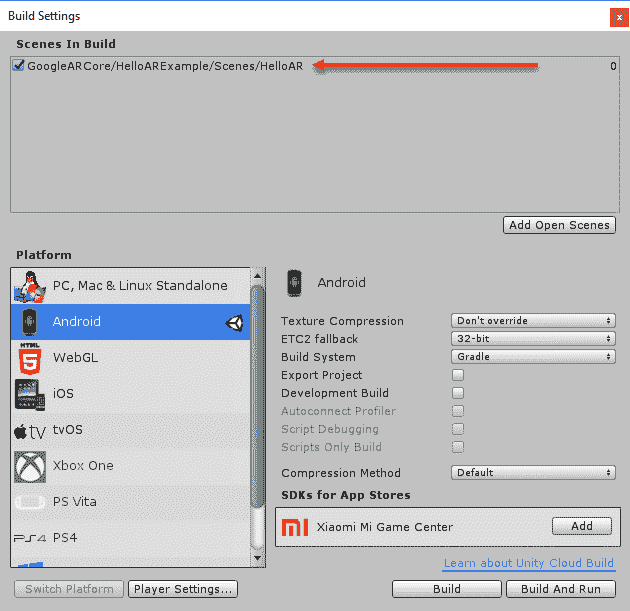
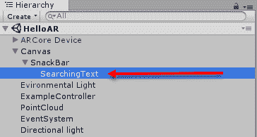
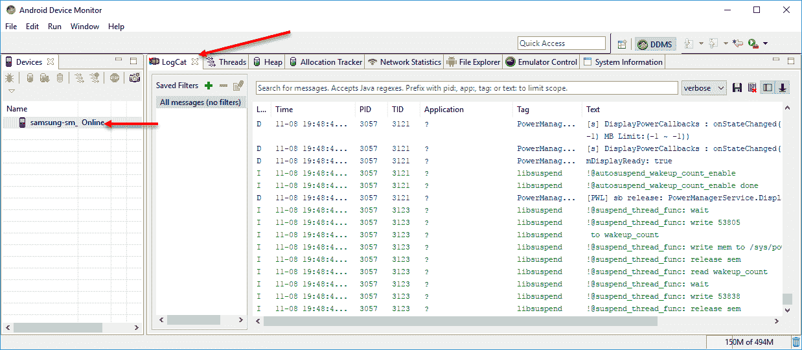
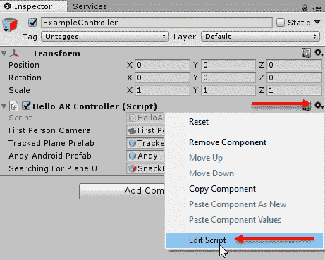
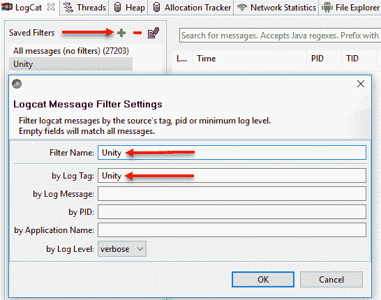

# 第三章：Unity 上的 ARCore

我们接下来要搭建的平台是 Unity。Unity 是一个领先的跨平台游戏引擎，它特别易于快速构建游戏和图形应用程序。因此，当我们第十章“混合现实中的混合”中构建最终应用程序时，它将成为我们使用的平台。

近年来，Unity 因其被过度用于低质量游戏而获得了一些坏名声。这不是因为 Unity 不能制作高质量的游戏，它当然可以。然而，快速创建游戏的能力经常被开发者滥用，他们为了盈利而发布廉价游戏。

在本章中，我们将学习如何为 Android 安装、构建和部署 Unity ARCore 应用程序。然后，我们将设置远程调试，最后我们将探索对示例应用程序进行一些修改。以下是本章我们将涵盖的主题摘要：

+   安装 Unity 和 ARCore

+   构建和部署到 Android

+   远程调试

+   探索代码

我们已经在第二章“Android 上的 ARCore”中介绍了设置 Android 工具。如果您跳过了这一章，您需要回到前面几节去做练习，然后再继续。如果您是一个已经设置了 Android 环境的经验丰富的 Unity 开发者，您仍然应该阅读这一章，因为它可能包含一些有用的提示或设置。

# 安装 Unity 和 ARCore

安装 Unity 编辑器相对简单。然而，我们将使用的 Unity 版本可能仍在 beta 测试中。因此，在安装 Unity 时，您需要特别注意以下说明：

1.  使用网络浏览器导航到[`unity3d.com/unity/beta`](https://unity3d.com/unity/beta)。

在撰写本文时，我们将使用 Unity 的最新 beta 版本，因为 ARCore 也仍在 beta 预览中。请务必注意您正在下载和安装的版本。如果您在使用 ARCore 时遇到问题，这将有所帮助。

1.  点击“下载安装程序”按钮。这将下载`UnityDownloadAssistant`。

1.  启动`UnityDownloadAssistant`。

1.  点击“下一步”，然后同意服务条款。再次点击**下一步**。

1.  选择组件，如图所示：



选择要安装的组件

1.  将 Unity 安装在可以识别版本的文件夹中，如下所示：



设置 Unity 安装路径

1.  点击“下一步”下载并安装 Unity。这可能需要一些时间，所以请起身活动一下，喝点饮料。

1.  点击“完成”按钮，并确保 Unity 设置为自动启动。让 Unity 启动并保持窗口打开。我们很快就会回来。

Unity 安装完成后，我们希望下载 Unity 的 ARCore SDK。由于我们已经安装了 Git，现在这会变得容易。按照给定的说明安装 SDK：

1.  打开一个 shell 或命令提示符。

1.  导航到您的`Android`文件夹。在 Windows 上，使用以下路径：

```kt
cd C:\Android
```

1.  输入并执行以下命令：

```kt
git clone https://github.com/google-ar/arcore-unity-sdk.git
```

1.  在`git`命令完成后，您将看到一个名为`arcore-unity-sdk`的新文件夹。

如果这是您第一次使用 Unity，您需要上网到[`unity3d.com/`](https://unity3d.com/)并创建一个 Unity 用户账户。Unity 编辑器将要求您在首次使用和之后不时登录。

现在我们已经安装了 Unity 和 ARCore，是时候通过以下步骤打开示例项目了：

1.  如果您关闭了 Unity 窗口，请启动 Unity 编辑器。在 Windows 上的路径将是`C:\Unity 2017.3.0b8\Editor\Unity.exe`。您可以创建一个带有版本号的快捷方式，以便稍后更容易启动特定的 Unity 版本。

1.  切换到 Unity 项目窗口，并点击打开按钮。

1.  选择`Android/arcore-unity-sdk`文件夹。这是我们之前使用`git`命令安装 SDK 的文件夹，如下面的对话框所示：



打开示例 ARCore Unity 项目

1.  点击选择文件夹按钮。这将启动编辑器并加载项目。

1.  在项目窗口中打开`Assets/GoogleARCore/HelloARExample/Scenes`文件夹，如图所示：



打开场景文件夹

1.  双击 HelloAR 场景，如图所示在项目窗口和前面的截图。这将把我们的 AR 场景加载到 Unity 中。

在任何时候，如果您在底部状态栏看到红色控制台或错误消息，这通常意味着您有一个版本冲突。您可能需要安装 Unity 的不同版本。有关更多帮助，请参阅第十一章，*性能提示和故障排除*。

现在我们已经安装了 Unity 和 ARCore，我们将在下一节构建项目并将应用部署到 Android 设备。

# 在 Android 上构建和部署

在大多数 Unity 开发中，我们只需在编辑器中运行场景进行测试。不幸的是，当开发 ARCore 应用程序时，我们需要将应用部署到设备进行测试。幸运的是，我们正在打开的项目应该已经大部分配置好了。所以，让我们按照下一个练习中的步骤开始吧：

1.  打开 Unity 编辑器到示例 ARCore 项目，并打开 HelloAR 场景。如果您在上一个练习中留下了 Unity 打开，请忽略此步骤。

1.  通过 USB 连接您的设备。

1.  从菜单中选择文件 | 构建设置。确认设置与以下对话框匹配：



构建设置对话框

1.  确认 HelloAR 场景已添加到构建中。如果场景缺失，请点击添加打开场景按钮将其添加。

1.  点击构建和运行。请耐心等待，首次构建可能需要一些时间。

1.  在应用被推送到设备后，您可以自由地测试它，就像您测试 Android 版本时那样。

太好了！现在我们有一个 Unity 版本的示例 ARCore 项目正在运行。在下一节中，我们将探讨如何远程调试我们的应用。

# 远程调试

每次都要连接 USB 来推送应用是不方便的。更不用说，如果我们想进行任何调试，我们就需要始终维护与我们的开发机器的物理 USB 连接。幸运的是，有一种方法可以通过 Wi-Fi 将我们的 Android 设备连接到我们的开发机器。使用以下步骤建立 Wi-Fi 连接：

1.  确保设备通过 USB 连接。

1.  打开命令提示符或 shell。

在 Windows 上，我们将只为我们在工作的提示符添加`C:\Android\sdk\platform-tools`到路径。建议您将此路径添加到您的环境变量中。如果您不确定这是什么意思，请谷歌搜索。

1.  输入以下命令：

```kt
//WINDOWS ONLY
path C:\Android\sdk\platform-tools

//FOR ALL 
adb devices
adb tcpip 5555
```

1.  如果成功了，您将看到`重新启动 TCP 模式端口：5555`。如果您遇到错误，请断开连接并重新连接设备。

1.  断开您的设备。

1.  按照以下步骤查找您的设备 IP 地址：

    1.  打开您的手机并转到设置，然后是关于手机。

    1.  点击状态**。**注意记录 IP 地址。

1.  返回您的 shell 或命令提示符并输入以下内容：

```kt
adb connect [IP Address]
```

1.  确保您使用从您的设备记下的 IP 地址。

1.  您应该看到`连接到[IP 地址]:5555`。如果您遇到问题，只需再次运行这些步骤。

# 测试连接

现在我们已经与我们的设备建立了远程连接，我们应该测试它以确保它正常工作。让我们通过以下步骤来测试我们的连接：

1.  打开 Unity 到示例 AR 项目。

1.  在层次结构窗口中展开 Canvas 对象，直到您看到 SearchingText 对象并选择它，就像以下摘录中所示：



展示已选择 SearchingText 对象的层次结构窗口

1.  将您的注意力转向默认位于右侧的检查器窗口。在窗口中向下滚动，直到您看到文本`“正在搜索表面…”`。

1.  将文本修改为`“正在搜索 ARCore 表面…”`，就像我们在上一章中为 Android 所做的。

1.  从菜单中选择文件 | 构建和运行。

1.  打开您的设备并测试您的应用。

# 远程调试运行中的应用程序

现在，通过这种方式构建和推送应用到您的设备将花费更长的时间，但这种方式要方便得多。接下来，让我们看看我们如何可以通过以下步骤远程调试运行中的应用程序：

1.  返回您的 shell 或命令提示符。

1.  输入以下命令：

```kt
adb logcat
```

1.  您将看到覆盖屏幕的日志流，这不是非常有用的事情。

1.  按*Ctrl* + *C* (*command* + *C* 在 Mac 上)来终止进程。

1.  输入以下命令：

```kt
//ON WINDOWS
C:\Android\sdk\tools\monitor.bat

//ON LINUX/MACcd android-sdk/tools/
monitor
```

1.  这将打开 Android 设备监控器。您应该在左侧的列表中看到您的设备。确保您选择它。您将在**LogCat**窗口中看到日志输出开始流式传输。将 LogCat 窗口拖动到主窗口中的一个标签页，如图所示：



显示 LogCat 窗口的 Android 设备监控器

1.  保持 Android 设备监控器窗口打开并运行。我们稍后会回来。

现在我们可以远程构建、部署和调试。这将给我们提供足够的灵活性，以便我们想要变得更加移动。当然，我们通过 `adb` 设置的远程连接也将与 Android Studio 一起工作。然而，我们实际上还没有跟踪任何日志输出。我们将在下一节输出一些日志消息。

# 探索代码

与 Android 不同，我们能够轻松地在编辑器中修改我们的 Unity 应用，而无需编写代码。实际上，给定正确的 Unity 扩展，你可以在 Unity 中不写任何代码就制作出可工作的游戏。然而，对于我们来说，我们想要深入了解 ARCore 的细节，这需要编写一些代码。回到 Unity 编辑器，让我们看看我们如何通过实现以下练习来修改一些代码：

1.  从层次窗口中选择 ExampleController 对象。这将使对象在检查器窗口中显示出来。

1.  在 Hello AR Controller (Script) 旁边的齿轮图标上选择，然后从上下文菜单中选择编辑脚本，如下面的摘录所示：



在 Unity 中编辑脚本

1.  这将打开你的脚本编辑器并加载脚本，默认情况下，`MonoDevelop`。

Unity 支持许多用于编写 C# 脚本的集成开发环境（IDE）。一些流行的选项是 Visual Studio 2015-2017（Windows）、VS Code（所有）、JetBrains Rider（Mac）以及甚至 Notepad++（所有）。为了自己好，尝试为你操作系统列出的选项之一。

1.  在脚本中向下滚动，直到你看到以下代码块：

```kt
public void Update ()
{
    _QuitOnConnectionErrors();
```

1.  在 `_QuitOnConnectionErrors();` 代码行之后，添加以下代码：

```kt
Debug.Log("Unity Update Method");
```

1.  保存文件，然后返回 Unity。Unity 将自动重新编译文件。如果你犯了任何错误，你将在状态栏或控制台看到红色错误消息。

1.  从菜单中选择文件 | 构建和运行。只要你的设备仍然通过 TCP/IP 连接，这将有效。如果你的连接中断，只需回到上一节并重置它。

1.  在设备上运行应用程序。

1.  将注意力转向 Android 设备监控器，看看你是否能找到那些日志消息。

# Unity 更新方法

Unity 的 `Update` 方法是一个在帧更新或渲染之前/期间运行的特殊方法。对于你典型的每秒 60 帧的游戏，这意味着 `Update` 方法将每秒被调用 60 次，所以你应该会看到很多标记为 Unity 的消息。你可以通过以下方式过滤这些消息：

1.  跳转到 Android 设备监控器窗口。

1.  在已保存的过滤器面板中单击绿色加号按钮，如下面的摘录所示：



添加新的标签过滤器

1.  通过输入过滤器名称（使用 `Unity`）和日志标签（使用 `Unity`），创建一个新的过滤器，如前一张截图所示。

1.  点击 确定以添加过滤器。

1.  选择新的 `Unity` 过滤器。当应用在设备上运行时，您将看到针对 Unity 平台特定过滤的消息列表。如果您没有看到任何消息，请检查您的连接并尝试重新构建。确保您已在 `MonoDevelop` 中保存了您编辑的代码文件。

干得好。我们现在有一个带有远程构建和调试支持的正常工作的 Unity 设置，这无疑将使我们的工作更加容易。现在您已经设置好了一切，回到 Unity 平台并熟悉界面。尽量不要更改任何设置，因为我们将在后面的章节中使用示例项目作为我们的基础。

# 摘要

在本章中，我们为我们的 ARCore 开发设置了一个新的平台，称为 Unity。正如我们所学的，Unity 是一个领先、强大、灵活且简单的游戏/图形引擎，我们将在后面的章节中广泛使用它。然而，我们现在安装了 Unity 和 ARCore SDK for Unity。然后，我们通过设置使用 TCP/IP 通过 Wi-Fi 到设备的远程构建和调试连接进行了一点点偏离。接下来，我们通过添加一些调试日志输出测试了我们在 Unity 中修改 C# 脚本的能力。最后，我们使用 Android 设备监控工具测试了我们的代码更改，以过滤和跟踪部署到设备上的 Unity 应用程序的日志消息。

我们将在下一章继续努力，为我们的 Web ARCore 开发设置环境。Web ARCore 开发与 Android 和 Unity 实际上有很大不同。然而，我们仍将涵盖一些我们将用于 第十章，*混合现实中的混合* 的基本设置，所以即使您不做 Web 开发，也不要跳过下一章。
