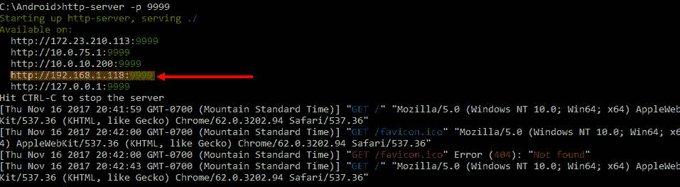
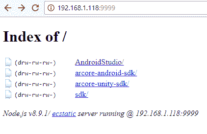
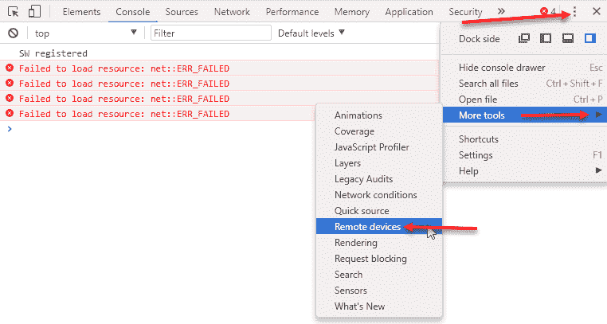
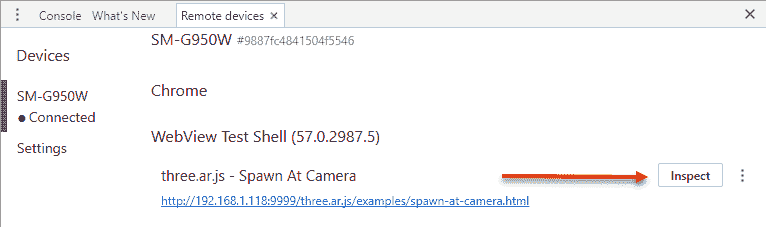
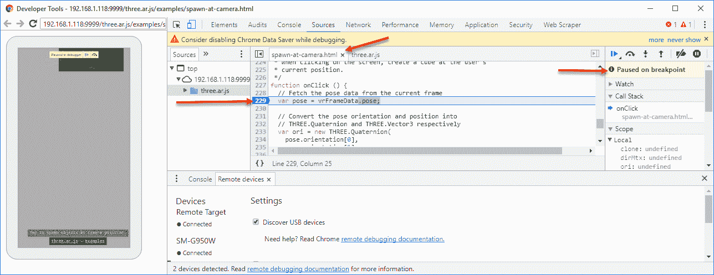

# ARCore 在网页上

以前，大多数 AR 开发都需要在本地安装的应用中进行。然而，随着 ARCore 的出现，谷歌增加了对网页 AR 开发的支持，这使用户可以通过浏览器访问 AR 应用。当然，AR 网页应用可能永远不会像使用 Android 或 Unity 开发的类似应用那样强大或功能丰富。但 ARCore 扩展了其浏览器支持，包括 iOS 和 Android。因此，如果您需要一个跨平台 AR 应用，那么您可能需要专注于 ARCore 网页开发。

在本章中，我们继续为 ARCore 网页开发设置我们的环境。以下是本章我们将涵盖的主要主题：

+   安装 WebARonARCore

+   安装 Node.js

+   探索示例

+   在 Android 上调试网页应用

+   3D 和 three.js

即使您对网页开发没有兴趣，您也应该阅读这一章。我们将在最终项目第十章，*混合现实中的混合*中使用这一章的内容。

# 安装 WebARonARCore

为了从网页上运行 ARCore，我们还需要一个支持 ARCore 或 ARKit 的浏览器。截至撰写时（beta 预览），没有浏览器支持 ARCore 或 ARKit，因此我们需要安装一个特殊或实验性浏览器。我们将安装的实验性浏览器称为 WebARonARCore。

截至撰写时，Google ARCore 处于 beta 预览阶段。如果 Google ARCore 已全面发布（1.0）并在您的设备上的浏览器中得到支持，那么您可以跳过这一部分。

安装 WebARonARCore 非常简单，只需在您的设备上打开浏览器并安装一个 APK。按照以下步骤安装 WebARonARCore：

1.  将您的设备上的浏览器指向[`github.com/google-ar/WebARonARCore`](https://github.com/google-ar/WebARonARCore)或直接在 Google 上搜索`git WebARonARCore`。

1.  按照 README 文件中的说明查找并点击 WebARonARCore APK 下载链接。这将下载 APK 到您的设备。如果您收到关于 APK 文件类型的警告，只需忽略它即可。

1.  文件下载后，点击“打开”。如果您的设备设置为阻止从未知来源安装应用，您将收到警告。为了绕过警告，请执行以下操作：

    1.  点击“设置”。

    1.  点击“未知来源”以启用它。

1.  点击“安装”以将 APK 安装到您的设备。

1.  在您的设备上找到 WebARonARCore 应用并打开它。

1.  点击“允许”，通过安全警告。

这将启动 WebARCore 实验性浏览器并将其指向我们从那里拉取 APK 的同一 GitHub 页面。请保持应用在您的设备上打开，因为我们将在接下来的部分中使用它。在下一节中，我们将学习如何安装 Node.js。

您可以通过安装 WebARonARKit 在 iOS 设备上测试您的网页开发。不幸的是，WebARonARKit 源代码必须手动构建、编译和部署。这些步骤在本书中没有涵盖，但如果您对为 iOS 设备设置感兴趣，请遵循 [`github.com/google-ar/WebARonARKit`](https://github.com/google-ar/WebARonARKit)。

# 安装 Node.js

与其他平台不同，我们不需要在设备上安装任何其他东西来使用 AR 网页应用。然而，我们确实需要一个方法来将我们的网页应用程序页面提供给设备。通常，这是通过一个网页服务器，如 IIS、Tomcat、Jetty、Node 或其他服务器来完成的。对于我们的目的，我们只需要一个简单的 HTTP 服务器来提供静态 HTML 内容。幸运的是，Node 提供了一个仅用于从文件夹运行简单 HTTP 服务器的包。为了获取此包，我们首先需要安装 Node。按照以下步骤安装 Node：

1.  从 [Nodejs.org](http://nodejs.org) 下载并安装 Node.js 的 **长期支持** (**LTS**) 版本。只需遵循页面上的说明和安装程序。确保在安装到 Windows 时设置 `PATH`。

Node.js 是一个基于 Chrome 的 JavaScript 运行时之上的轻量级、非阻塞和事件驱动的 JavaScript 运行时。由于其庞大的模块或包库，它已经变得非常流行。我们安装 Node.js 只是为了使用 Node.js 包。

1.  打开命令提示符或 shell，并输入以下内容：

```kt
npm
```

1.  如果一切安装正确，你应该会看到一个显示 `npm` 用法的消息。

# 节点包管理器

**Node 包管理器** (**npm**) 是一个用于安装 Node.js 包的命令行工具。我们将使用此工具下载并安装我们的简单 HTTP 服务器。按照以下步骤安装 HTTP 服务器：

1.  从您的设备打开命令提示符或 shell，并输入以下内容：

```kt
npm install http-server -g
```

1.  这将下载并安装 `http-server` 作为全局工具。现在，让我们测试它。

1.  使用您的命令提示符或 shell，将文件夹更改为 `Android`，如下所示：

```kt
//WINDOWS
cd c:\Android
```

1.  在 `Android` 文件夹中运行 `http-server`，输入以下内容：

```kt
http-server -p 9999
```

1.  你将看到一个端点 URL 的列表。选择一个与您的 Wi-Fi 相同子网、与您的设备相同的子网的端点。复制或写下端点的文本，如下面的摘录所示：



选择端点 URL

1.  在您的设备上打开网页浏览器，并输入上一步骤中选择的端点。开始建立连接后，你将看到前面屏幕截图中显示的日志输出。

如果您无法与您的设备连接，请确保您输入了完整的端点，包括协议，例如示例中的 `http://192.168.1.118:9999`，但您的端点可能不同。确保您允许防火墙中端口 `9999` 的任何异常。或者，您可以关闭防火墙进行测试。只是不要将其关闭。

1.  您应该在浏览器中看到`Android`文件夹的列表，因为我们已经配置了我们的服务器，只列出`Android`文件夹的内容。以下是在您的浏览器中它将看起来如何的示例：



浏览器显示 Android 文件夹列表

好的！现在我们有一种简单的方式来提供我们需要的任何静态网页。在下一节中，我们将下载 Web ARCore 示例并对其进行审查。

# 探索样本

现在我们有了支持 AR 的网页浏览器，我们可以继续探索一些示例。按照提到的步骤中的说明来探索样本：

1.  打开命令提示符或 shell 到`Android`文件夹，并输入以下内容：

```kt
git clone https://github.com/google-ar/three.ar.js.git
```

1.  确保您的`http-server`网页浏览器从`Android`文件夹中运行。如果您需要再次启动服务器，只需运行最后一个练习中的命令。

1.  将您的设备上支持 Web AR 的浏览器（WebARCore）指向一个有效的端点 URL。再次检查最后一个练习，以防您忘记了如何操作。如果页面变黑或无响应，您可能需要重置应用程序。只需关闭 WebARCore 浏览器应用并重新启动。

1.  浏览到`three.ar.js/examples/`文件夹。在这个文件夹中，您将找到使用`three.js`和`three.ar.js`开发的 AR 应用程序的示例 HTML 页面集合。以下表格概述了每个示例，以及它们的功能描述：

| **页面** | **描述** | **概念** |
| --- | --- | --- |
| `boilerplate.html` | 一个用于构建的简单项目 | 基础 |
| `graffiti.html` | 在 AR 中进行触摸交互和绘图 | 触摸，环境 |
| `record-at-camera.html` | 在一个点上录制 3D 空间音频 | 触摸，空间音频 |
| `reticle.html` | 跟踪表面的姿态 | 运动，姿态跟踪 – 环境 |
| `spawn-at-camera.html` | 在相机位置触摸生成对象 | 触摸，环境 |
| `spawn-at-surface.html` | 在识别的表面或平面上触摸生成对象 | 触摸，环境 |
| `surfaces.html` | 识别环境中的表面或平面 | 环境 |

在撰写本文时，这些是可用的示例。可能还会添加一些具有一些新功能或其他操作方式的新的样本。请确保检查您的文件夹，并花些时间探索每个样本。

1.  在您的设备上浏览每个样本。这些样本是我们将在后续章节中涵盖的概念的优秀示例。

如果在运行 WebAR 浏览器时屏幕变黑，只需强制关闭应用并重新启动。通常发生的情况是 Chrome 的**开发者工具**（**DevTools**）和应用程序失去了同步，只需要重新启动。

我们现在在我们的开发机器上运行一个 HTTP 服务器，为我们的设备提供 Web AR 应用。这很好，但我们如何编辑代码和调试呢？能够调试代码在我们开始编写新代码时也将对我们成功至关重要。因此，在下一节中，我们将学习如何设置远程 Web 调试到 Android 设备。

# 在 Android 上调试 Web 应用

如我们在上一节末尾提到的，当我们开始编写新代码时，调试/记录对我们来说将至关重要。如果你曾经尝试在没有日志或调试能力的情况下盲目修复问题，那么你很快就会欣赏到一个好的调试器的价值。碰巧的是，Chrome 有一个很棒的工具集，可以帮助我们做到这一点。按照以下步骤在你的 Android 设备上设置远程 Web 调试：

1.  使用 USB 将您的设备连接到您的计算机。

1.  打开命令提示符窗口。

1.  通过输入以下内容来验证您的连接：

```kt
adb devices
```

1.  那个命令的输出应该显示你的连接设备。你可能可以绕过这一步，但通过运行这个简单的检查，你可以避免以后的很多挫折。

1.  确保您的 Android 设备上所有 Chrome 浏览器实例都已关闭。

1.  打开 WebARCore 浏览器的一个实例。记住，这个浏览器只是 Chrome 的一个实验性扩展。

1.  使用打开的浏览器导航到一个示例。现在还真的不重要。这个例子将使用 `spawn-at-camera.html`。

# 连接 Chrome 开发者工具

所以，信不信由你，我们现在已经连接并准备好调试了。现在，我们只需要在开发机器上设置我们的调试工具：

1.  在你的开发机器上打开 Chrome。如果你没有安装 Chrome，你需要做这个。当然，如果你正在阅读一本关于 Google ARCore 的书，你很可能已经安装了 Chrome，对吧？

1.  通过按 *command* + *option* + *I*（Mac），*Ctrl* + *Shift* + *I*（Windows、Linux）或从菜单中选择更多工具 | 开发者工具来打开 Chrome 开发者工具。

1.  从 Chrome 的开发者工具菜单中选择更多工具 | 远程设备，如图所示：



定位远程调试菜单选项

1.  将会打开一个新的标签页，远程设备，并应显示你的连接设备，如下所示：



显示连接设备和页面的远程设备标签

1.  在标签页底部，你应该能看到您当前在设备上指向的地址。如果不是这样，可能有一个文本框允许您手动输入它，然后连接。

1.  点击检查按钮。这将打开一个新的 Chrome 窗口，一侧是开发者工具，另一侧是您的设备图像。

# 使用 Chrome 调试

到目前为止，如果你有使用 Chrome DevTools 的经验，你可以开始调试了。当然，如果你对这一切都相对陌生，请按照以下步骤学习如何在 DevTools 中调试：

1.  切换到上一节中我们打开的 Chrome 窗口。

1.  点击 DevTools 窗口的“源”标签。

1.  选择`spawn-at-camera.html`或你在测试中使用的文件。

1.  在 HTML 和 JavaScript 中向下滚动，直到看到`onClick()`函数。

1.  点击行号 229（示例中为 229，但你的可能不同），在突出显示的代码左侧设置断点。这也在以下摘录中演示：



设置 JavaScript 断点

1.  切换回运行应用的设备。触摸屏幕以生成一个对象。当你这样做时，你的应用应该在顶部显示“调试器暂停”消息，然后优雅地冻结。

1.  切换回你的开发机器和开发者工具窗口。你会看到应用在断点处暂停。现在，你可以使用鼠标悬停在代码上以检查变量和任何其他你可能正在调试的内容。

随意探索设置其他断点，甚至逐步执行代码。我们将把探索更多 DevTools 功能留给读者自行探索。

现在你可以远程调试在设备上运行的 AR Web 应用。这也完成了我们的大部分初始基本设置。我们现在可以深入了解在 3D 中与 AR 合作，从下一节开始。

# 3D 和 three.js

我们生活在一个三维世界中。因此，为了让我们用户相信他们的现实正在被增强或改变，我们需要以三维的方式与他们所处的世界合作。现在，我们正在合作的每个平台（Web、Android 和 Unity），都有我们将要使用的 3D 引擎。在 Unity 的情况下，它是 3D 引擎，毫无疑问，它是最容易使用的，几乎不需要编程或数学知识。Android 和 OpenGL ES 是第二选择，因为它将需要一些 3D 数学知识。第三和最后一个选择是我们用于 Web 的 3D 引擎，它将是`three.js`库。`three.js`将是使用 3D 时最难的平台，这使得它成为我们理想的起点。

如我们在第一章“入门”中提到的，Unreal 平台是另一个 ARCore 平台选项。Unreal 在提供用于 3D 工作的优秀工具方面与 Unity 相似，尽管这些工具更技术化，并且需要理解 3D 数学才能成功。

与前几章不同，我们不会仅仅进行简单的文本更改来测试我们更改和部署代码的能力。相反，在本节中，我们将修改我们生成的 3D 对象。这将是一次深入 3D 的好机会，并为我们准备本书的其余部分。让我们按照以下步骤开始：

1.  使用记事本、Notepad++、vi 或其他文本编辑器打开位于`Android/three.ar.js/example`文件夹中的`spawn-at-camera.html`文件。

1.  在代码中向下滚动，直到看到以下部分：

```kt
var geometry = new THREE.BoxGeometry( 0.05, 0.05, 0.05 );
var faceIndices = ['a', 'b', 'c'];
for (var i = 0; i < geometry.faces.length; i++) 
{
  var f  = geometry.faces[i];
  for (var j = 0; j < 3; j++) 
{
    var vertexIndex = f[faceIndices[ j ]];
    f.vertexColors[j] = colors[vertexIndex];
  }
}
var material = new THREE.MeshBasicMaterial({ vertexColors:       
                                           THREE.VertexColors });
```

1.  将整个代码部分注释掉或删除。使用 `//` 将一行转换为注释。

1.  在高亮行之前输入新代码：

```kt
var geometry = new THREE.TorusGeometry( 10, 3, 16, 100 );
var material = new THREE.MeshBasicMaterial( { color: 0xffff00 } );
cube = new THREE.Mesh(geometry, material);
```

1.  这第一行新代码将几何形状替换为环面。`TorusGeometry` 是一个用于创建环面的辅助函数。还有许多其他辅助函数用于创建许多其他几何形状或甚至加载网格对象。第二行创建了一个新的基本单色材质。然后，它将这个材质包裹在几何形状周围，并创建我们的对象（网格），现在我们仍然将其称为立方体。如果你觉得需要更改变量名，那么请随意进行更改，但请务必小心。

1.  保存你的代码更改。

1.  切换回你的设备并刷新页面。然后，轻触屏幕以生成新对象。一开始，你可能认为没有任何效果；走开并四处移动。你可能会看到一个非常大的亮黄色环面的边缘。如果你仍然有一些问题，只需确保你已保存更改并尝试重新连接一切。

在这一点上，我们有一系列问题需要理解和解决，如下列所示：

+   物体太大或比例不合适

+   物体的方向或旋转错误

+   需要将物体移动或变换到摄像头正前方

+   我们想要改变颜色

# 理解左手系或右手系坐标系统

虽然对 3D 数学的良好理解当然会有所帮助，但它并不是完全必要的。目前你所需要知道的是，我们使用 x、y 和 z 的通用符号定义三维（3D）中的对象，其中 x 是沿*x*轴的位置，y 是沿*y*轴，z 是沿*z*轴。此外，我们使用左手系或右手系坐标系统这个术语来定义这些轴的位置，如下面的图所示：


左手系和右手系坐标系统的定义

按照前面的图示，举起你的左手，并将你的中指指向屏幕。现在，你的大拇指指向正 x 轴，食指指向正 y 轴，中指指向正 z 轴。很多时候，为了避免左手系或右手系之间的混淆，我们只需用它们指向的方向来表示轴。因此，右用于正 x 轴，上用于正 y 轴，前用于正 z 轴。幸运的是，对于我们的所有平台，我们将使用左手系坐标系统。

# 3D 缩放、旋转和变换

我们接下来需要理解的是如何将缩放、旋转和变换应用于对象，从而解决我们确定的问题。不深入数学，让我们只理解这些术语的含义：

+   **缩放**：它允许我们定义对象的大小。在我们的例子中，我们的对象太大，因此我们需要缩小对象。我们很快就会学习如何做到这一点。

+   **旋转**：它定义了物体的方向或姿态。我们将这两个术语交替使用。旋转稍微复杂一些，我们在这个例子中不会担心它。

+   **变换**：它定义了物体的位置，其中位置 0,0,0 代表原点。在我们的例子中，我们希望将环面稍微放置在相机前方。

我们使用一个称为矩阵的数学概念来在三维空间中对三维物体应用缩放、旋转和变换操作。矩阵的酷之处在于它们可以同时表示缩放、旋转和变换的所有三种操作。然而，这也意味着我们必须注意这些操作的顺序。让我们回到代码中，看看我们如何将每个操作应用到我们的环面上：

1.  打开你的文本编辑器到`spawn-at-camera.html`示例。

1.  滚动到高亮显示的代码，并在其后输入以下行：

```kt
scene.add(clone); //near the bottom of the file
clone.scale.copy(new THREE.Vector3(.15,.15,.15));
clone.position.copy(new THREE.Vector3(0,0,10));
```

1.  将下面那行代码注释掉，就像这样：

```kt
//clone.position.copy(pos);
```

1.  保存你的工作，并在你的设备上运行应用程序。你现在可以看到我们如何移动和缩放生成的对象。你可以随意尝试进一步移动、缩放甚至旋转对象。

至于将颜色从那刺眼的黄色改为更吸引人的颜色，我们留给读者作为他们的家庭作业。以下是需要更改的代码行：

```kt
var material = new THREE.MeshBasicMaterial( { color: 0xffff00 } );
```

如果你在上一个部分中遇到了任何困难，你真的应该找一本书，阅读博客/维基百科，或者参加 3D 和/或 3D 数学的课程。学习 3D 概念的另一个好方法是使用 Blender、SketchUp、Max 等 3D 建模软件。

当然，我们将在本书中以及在后几章中更详细地介绍更多的 3D 概念。不过，如果你是第一次接触 3D 编程，欢迎加入我们，并准备好迎接一段颠簸的旅程。

# 摘要

在本章中，我们完成了我们在后续章节中将要探索的 ARCore 环境的主要设置任务中的最后一个。我们首先跳进去安装了预置的 AR 启用实验性 Chrome 浏览器。然后，我们下载并安装了 Node.js，作为运行简单 HTTP 服务器的需求。这使得我们能够将`three.ar.js`源中的示例拉到我们的本地机器上。然后，我们使用 HTTP 服务器为我们设备上的样本 AR 网络启用应用程序提供服务。接下来，我们解决了远程调试 JavaScript 代码到 Android 设备的问题。在那之后，我们简要地游览了 3D 世界，并探讨了在 AR 场景中缩放和变换 3D 对象的方法。然后，我们最终了解到，对 3D 概念和/或数学的良好了解对于我们的 AR 开发者成功至关重要。

现在我们完成了基本的设置任务，是时候开始构建我们自己的 AR 应用程序了。在下一章中，我们将探索使用我们的网络平台进行运动跟踪的 AR 概念。
