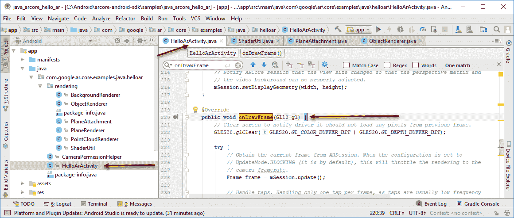
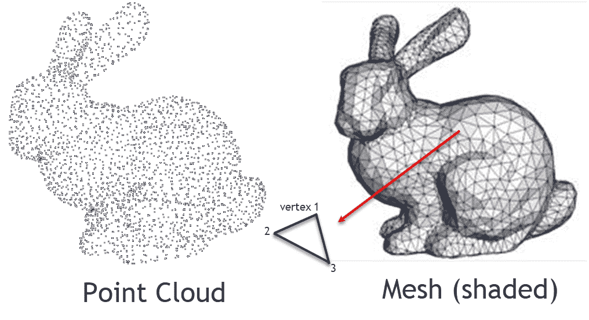
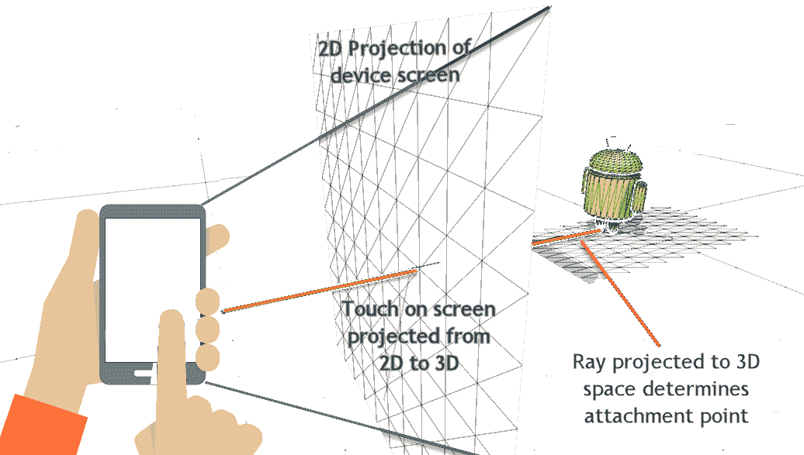
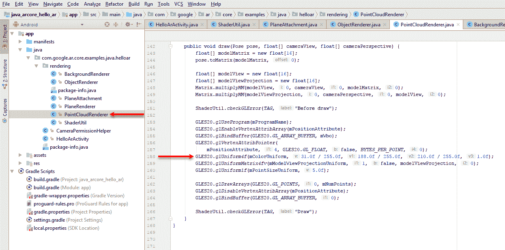
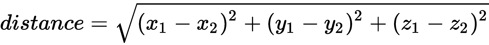
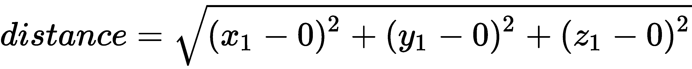
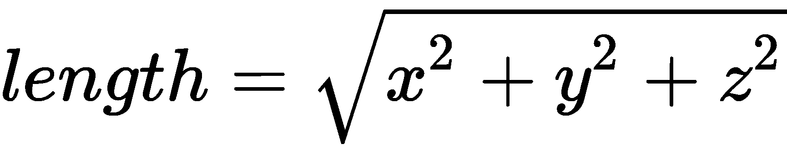
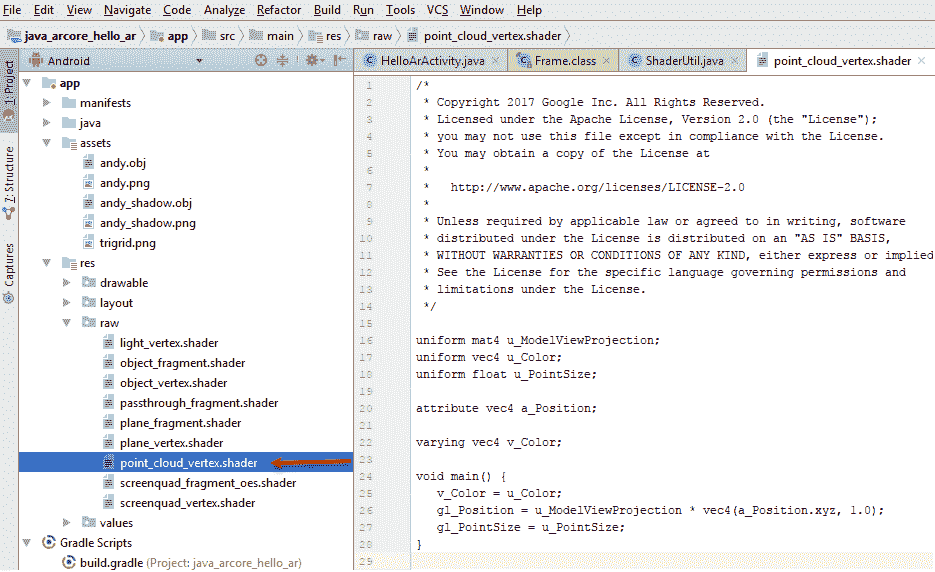
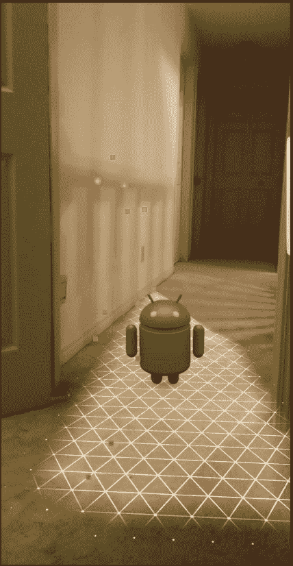

# 第六章：理解环境

增强现实应用程序都是关于增强或扩展用户的现实。为了做到这一点，作为 AR 应用程序开发者，我们需要一套能够理解用户环境的工具。正如我们在上一章中看到的，ARCore 使用 **视觉惯性里程计**（**VIO**）来识别环境中的对象和特征，然后它可以利用这些信息来获取设备的姿态并跟踪运动。然而，这项技术也可以帮助我们使用相同的工具包来识别对象及其姿态。在本章中，我们将探讨如何使用 ARCore API 更好地理解用户的环境。以下是本章我们将涵盖的主要主题的简要概述：

+   跟踪点云

+   网格化和环境

+   与环境交互

+   使用 OpenGL ES 绘制

+   着色器编程

如果你还没有从 GitHub 下载源代码，你需要为这一章这样做。当然，你还需要完成 第二章 中涵盖的 Android 设置和安装，即 *ARCore on Android*。

# 跟踪点云

正如我们讨论的那样，ARCore 中的运动跟踪是通过识别和跟踪用户周围的可见特征来完成的。然后，它使用这些点以及设备的方向和加速度计传感器来保持跟踪更新。如果不这样做，准确跟踪的能力会迅速下降。此外，我们还获得了跟踪 ARCore 识别为对象点的多个点的优势。让我们通过再次启动示例 ARCore Android 应用程序来查看这些跟踪点的外观。按照以下步骤开始：

1.  打开 Android Studio。如果你还没有打开其他项目，那么它应该会立即加载 Android ARCore 示例项目。如果不是这样，请在 `Android/arcore-android-sdk/samples/java_arcore_hello_ar` 文件夹中加载项目。

1.  打开 `HelloArActivity.java` 文件，并向下滚动到 `OnDrawFrame` 方法，如下面的摘录所示：



在 Android Studio 中打开 HelloArActivity.java 文件

1.  `OnDrawFrame` 是渲染方法，就像我们在网络示例中看到的 `update` 函数一样。这个方法每帧被调用一次，在典型的 3D 应用程序中，通常每秒大约 60 帧。我们也将 60 fps 称为帧率。帧率将根据你每帧执行的操作量而变化。因此，我们希望我们的 `render` 函数和其中的代码尽可能快。我们将在 第十一章 中更多地讨论性能和渲染，*性能提示和故障排除*。

1.  在此方法的第一行，从 `GLES20.glClear` 开始，清除渲染缓冲区并准备绘图。

根据你正在使用的 3D 平台，你可能不需要担心一些特定的细节，比如清除渲染缓冲区。例如，Unity 会隐藏许多这些细节，对开发者来说这可能既有好的一面也有不好的一面。只需理解所有 3D 平台通常都会遵循相同的原理。

1.  向下滚动一点，直到`try`块内部，并添加以下行：

```java
Frame frame = mSession.update();
```

1.  `Frame`代表从设备摄像头捕获的当前 AR 视图。我们通过调用`mSession.update()`来获取`frame`的实例；`mSession`是在之前初始化的，代表我们的 ARCore 会话服务。

1.  `Frame`还公开了一些辅助方法；向下滚动直到你看到以下行：

```java
mPointCloud.update(frame.getPointCloud());
mPointCloud.draw(frame.getPointCloudPose(), viewmtx, projmtx);
```

1.  从`mPointCloud.update()`开始，这个调用获取当前`frame`中的可见点。然后，`mPointCloud.draw()`根据云的姿态绘制点，使用当前的视图（`viewmtx`）和投影（`projmtx`）矩阵。

视图和投影矩阵代表相机或组合场景视图。使用`three.js`时，这些由我们处理。同样，当我们到达 Unity 时，我们也不需要担心设置这些矩阵。

1.  将你的设备连接到你的机器，无论是通过 USB 还是远程连接。然后，在你的设备上构建并运行应用。特别注意点云的绘制。

注意，当你保持设备在一个方向上更长的时间时，点的数量会增加。这些点代表用于跟踪和解释环境的可识别和可识别的特征点。这些点将帮助我们识别环境中的物体或表面。在下一节中，我们将探讨如何识别和渲染表面。

# 网格化和环境

因此，能够识别物体的特征或角点实际上只是我们想要了解用户环境信息的起点。我们真正想要做的是利用这些特征点来帮助我们识别平面、表面或已知物体及其姿态。ARCore 通过一种称为**网格化**的技术自动为我们识别平面或表面。我们已经多次在高级示例中看到网格化是如何工作的，当 ARCore 跟踪表面时。现在，在我们自己领先之前，让我们通过以下图表来想象一下点云和网格在 3D 中的样子：



3D 中的点云和网格

如果你注意观察图示，你会看到一个嵌入的图形，展示了一个多边形及其组成的有序顶点集。注意点的顺序是逆时针的。是的，我们连接点的顺序会影响网格光照和着色时的表面朝向。当场景渲染时，我们只能看到面向摄像机的表面。远离摄像机的表面会被移除或背面裁剪。我们连接点的顺序被称为绕行，除非你计划手动创建网格，否则你不必担心这个问题。

网格化是将一组特征点组合起来并从中构建网格的过程。生成的网格随后通常会被着色并渲染到场景中。如果我们现在运行这个示例并观察，我们会看到 ARCore 生成的表面或平面网格被生成并放置。我们何不再次在 Android Studio 中打开 Android 示例项目，看看网格化发生在哪里：

1.  确保你的代码是开放的，以便我们上次离开的地方。你应该正在查看带有 `mPointCloud` 的行。

1.  向下滚动一点，直到你看到这段代码块：

```java
if (messageSnackbar != null) {
  for (Plane plane : session.getAllTrackables(Plane.class)) {
    if (plane.getType() == com.google.ar.core.Plane.Type.HORIZONTAL_UPWARD_FACING
        && plane.getTrackingState() == TrackingState.TRACKING) {
      hideLoadingMessage();
      break;
    }
  }
}
```

1.  这段代码块只是遍历会话中识别出的类型为 **Plane**（一个平面网格）的跟踪对象。当它识别出一个正确类型的跟踪平面时，它会隐藏加载信息并跳出循环。

1.  然后，它将识别出的任何平面渲染成这条线：

```java
planeRenderer.drawPlanes(
    session.getAllTrackables(Plane.class), camera.getDisplayOrientedPose(), projmtx);
```

1.  `planeRenderer` 辅助类用于绘制平面。它使用 `drawPlanes` 方法渲染 ARCore 会话通过视图和投影矩阵识别出的任何识别出的平面。你会注意到它通过调用 `getAllTrackables(Plane.class)` 将所有平面传递进去。

1.  将光标放在 `drawPlanes` 上，输入 *Ctrl *+ *B* (*command* + *B* 在 Mac 上) 以跳转到定义。

1.  现在，你应该能在 `PlaneRenderer.java` 文件中看到 `drawPlanes` 方法——不要慌张。是的，这里有很多令人害怕的代码，幸运的是，这些代码已经为我们写好了。作为一个练习，只需滚动并阅读代码。我们没有时间深入分析，但阅读这段代码将使你对渲染过程有更深入的了解。

1.  从菜单中选择运行 - 运行 'HelloArActivity'。现在，当应用程序运行时，请特别注意表面的渲染方式以及你如何与之交互。

好的，现在我们了解了表面是如何创建和渲染的。我们还需要了解如何与环境中的这些表面或其他对象交互。

# 与环境交互

我们知道 ARCore 会为我们提供用户周围识别的特征点和平面/表面。从这些识别的点或平面，我们可以附加虚拟对象。由于 ARCore 为我们跟踪这些点和平面，因此当用户移动对象时，附加到平面上的对象保持固定。但是，我们如何确定用户试图放置对象的位置呢？为了做到这一点，我们使用一种称为**射线投射**的技术。射线投射将触摸点在二维空间中的点投射到场景中。然后，该射线被用于测试场景中其他对象的碰撞。以下图表显示了这是如何工作的：



从设备屏幕到 3D 空间的射线投射示例

当然，你可能已经看到过无数次这样的工作了。不仅是在示例应用中，几乎所有 3D 应用都使用射线投射进行对象交互和碰撞检测。现在我们了解了射线投射是如何工作的，让我们看看它在代码中的样子：

1.  打开 Android Studio，示例项目和`HelloArActivity.java`文件。

1.  滚动到以下代码块：

```java
MotionEvent tap = queuedSingleTaps.poll();
if (tap != null && camera.getTrackingState() == TrackingState.TRACKING) {
  for (HitResult hit : frame.hitTest(tap)) {
    // Check if any plane was hit, and if it was hit inside the plane 
       polygon
    Trackable trackable = hit.getTrackable();
    // Creates an anchor if a plane or an oriented point was hit.
    if ((trackable instanceof Plane && ((Plane) trackable).isPoseInPolygon(hit.getHitPose()))
 || (trackable instanceof Point
 && ((Point) trackable).getOrientationMode()
 == OrientationMode.ESTIMATED_SURFACE_NORMAL)) {
      // Hits are sorted by depth. Consider only closest hit on a plane 
         or oriented point.
      // Cap the number of objects created. This avoids overloading 
         both the
      // rendering system and ARCore.
      if (anchors.size() >= 20) {
        anchors.get(0).detach();
        anchors.remove(0);
      }
      // Adding an Anchor tells ARCore that it should track this          
        position in
      // space. This anchor is created on the Plane to place the 3D 
         model
      // in the correct position relative both to the world and to the 
         plane.
      anchors.add(hit.createAnchor());
      break;
    }
  }
}
```

1.  阅读注释并注意高亮显示的代码行。第一行高亮显示的代码基于在场景中使用`frame.hitTest(tap)`检测到的击中次数开始循环。那个调用正在进行射线投射以确定哪些对象可能被点击。**点击**代表二维空间中的屏幕触摸。

    下一个高亮显示的行在检查哪个 ARCore 识别的平面被触摸的`if`语句内部。如果有击中，我们首先检查`anchors`的数量是否小于 20，其中每个锚点代表一个附加点。然后，我们使用`hit.createAnchor`向`anchors` `ArrayList`集合中添加一个新的`Anchor`，并使用对新锚点的引用。

1.  向下滚动一些，直到`onDrawFrame`中的以下代码块：

```java
// Visualize anchors created by touch.
float scaleFactor = 1.0f;
for (Anchor anchor : anchors) {
  if (anchor.getTrackingState() != TrackingState.TRACKING) {
    continue;
  }
  // Get the current pose of an Anchor in world space. The Anchor pose is updated
  // during calls to session.update() as ARCore refines its estimate of the world.
  anchor.getPose().toMatrix(anchorMatrix, 0);

  // Update and draw the model and its shadow.
  virtualObject.updateModelMatrix(anchorMatrix, scaleFactor);
  virtualObjectShadow.updateModelMatrix(anchorMatrix, scaleFactor);
  virtualObject.draw(viewmtx, projmtx, lightIntensity);
  virtualObjectShadow.draw(viewmtx, projmtx, lightIntensity);
```

1.  快速阅读一下代码。第一行高亮显示的代码首先遍历`anchors`列表中的`anchor`。然后，我们检查该锚点是否正在被跟踪；如果是，我们在第二行高亮显示的代码中获取其姿态。然后，我们在代码的最后几行中绘制我们的`virtualObject`（安迪）。注意，在这种情况下，我们还在绘制阴影。

1.  将第一行代码更改为以下内容：

```java
float scaleFactor = 2.0f;
```

1.  此更改将使安迪的大小加倍。在您的设备上运行应用，等待一些表面出现。然后，触摸屏幕放下安迪。现在，他看起来是原来的两倍大小。

# 触摸进行手势检测

因此，这涵盖了简单的交互。我们再添加一个手势，允许用户清除所有附加点，从而从场景中移除安迪机器人。按照以下步骤添加另一个触摸手势：

1.  滚动到以下代码部分：

```java
// Set up tap listener.
gestureDetector =
    new GestureDetector(
        this,
        new GestureDetector.SimpleOnGestureListener() {
          @Override
          public boolean onSingleTapUp(MotionEvent e) {
            onSingleTap(e);
            return true;
          }

          @Override
          public boolean onDown(MotionEvent e) {
            return true;
          }
        });

surfaceView.setOnTouchListener(
    new View.OnTouchListener() {
      @Override
      public boolean onTouch(View v, MotionEvent event) {
        return gestureDetector.onTouchEvent(event);
      }
    });
```

1.  上述代码位于`HelloArActivity`的`onCreate`方法中。它首先为解释选定的触摸事件设置了`gestureDetector`。然后，我们通过`setOnTouchListener`设置一个监听器来捕获触摸事件并将它们发送到手势检测器。只需记住，监听器监听触摸，而手势检测器解释触摸的类型。所以我们要做的是捕获用户另一种形式的触摸手势。

1.  在高亮部分之后立即添加以下代码：

```java
@Override
public boolean onDown(MotionEvent e) { return true;} //after this section@Overridepublic void onLongPress(MotionEvent e) {
 onLongPressDown(e);
}

```

1.  这将我们的事件发送到新的方法`onLongPressDown`。让我们在其他的处理手势的方法下面添加这个新方法，代码如下：

```java
private void onSingleTap(MotionEvent e) {
    // Queue tap if there is space. Tap is lost if queue is full. mQueuedSingleTaps.offer(e);
} //after this block of codeprivate void onLongPressDown(MotionEvent e) {
    mTouches.clear();
}
```

1.  在`onLongPressDown`内部发生的一切只是收集`anchors`，`anchors`被清除。通过清除`anchors`，我们清除了附着点，因此 Andy 的任何渲染都将消失。

1.  保存文件，连接您的设备，并运行示例。尝试在场景周围放置几个大型的 Andy。然后，使用新的长按手势来移除它们。

好的，现在我们基本了解了如何与环境交互。在下一节中，我们将介绍 OpenGL ES 的一些基础知识，这是我们用于 Android 的 3D 渲染框架。

# 使用 OpenGL ES 进行绘图

OpenGL ES 或简称 GLES 是 OpenGL 的精简版移动版本。OpenGL 是一个类似于 DirectX 的低级且强大的 2D 和 3D 绘图 API。由于它是一个低级库，因此确实需要大量的 2D/3D 数学知识。再次强调，为了我们的目的，我们将避免大多数复杂的数学，只是修改一些绘图代码来改变示例应用程序的功能。我们将修改示例应用程序，改变对象绘制的方式。加载 Android Studio 中的示例项目，让我们开始吧：

1.  滚动到`PointCloudRenderer.java`的底部，查看以下屏幕摘录中标识的代码部分：



在`PointCloudRenderer.java`中打开 draw 方法

1.  现在代码很简单，但其中很多内容都假设开发者有很好的 3D 数学和图形渲染基础。我们没有时间逐一解释每个步骤，但本质上，代码所做的只是绘制标识的点云特征（那些蓝色点）。

当我们到达 Unity 章节时，你可能会开始想知道为什么有人会愿意忍受编写 OpenGL ES AR 应用程序的痛苦。这是一个好问题。渲染逼真的 3D 图形完全是关于速度和性能。虽然 Unity 在渲染方面做得很好，但它仍然是 OpenGL ES 之上的另一层软件。这意味着 Unity 通常会比其本地的 OpenGL ES 版本运行得慢。具体慢多少，取决于你试图做什么。

1.  查看以下摘录中标识的行，如图所示：

```java
GLES20.glUniform4f(colorUniform, 31.0f / 255.0f, 188.0f / 255.0f, 210.0f / 255.0f, 1.0f);
```

1.  这行代码设置了渲染点云的颜色。它是通过将`31.0`、`188.0`和`210.0`的 RGB 颜色值除以`255.0`来归一化这些值的，从而创建一个从 0 到 1 的均匀或归一化颜色向量。最后一个值`1.0`代表 alpha 或透明度，其中`1.0`表示颜色**不透明**，而`0.0`表示它**透明**。

1.  让我们通过将那行代码更改为以下内容进行一点实验：

```java
GLES20.glUniform4f(colorUniform, 255.0f / 255.0f, 255.0f / 255.0f, 255.0f / 255.0f, 1.0f); 
```

1.  接下来，我们将改变我们绘制的点的尺寸，以便它们清晰可见，通过更改以下行代码：

```java
GLES20.glUniform1f(pointSizeUniform, 25.0f);
```

1.  保存文件，连接您的设备，然后部署并运行应用程序。当应用程序运行时，注意现在点的颜色。这是您预期的吗？

现在，我们可以清楚地看到特征点是如何以及在哪里被识别的。然而，我们仍然从点数据中得不到很多信息。如果我们根据点到观察者的距离给点着色会怎样？这将使我们能够以一些深度信息可视化我们的环境点云。在像 OpenGL ES 这样的低级 API 中手动通过颜色子集点将需要大量的代码更改。幸运的是，我们甚至可以更进一步，编写一个名为**着色器**的程序，在绘制点之前改变点的颜色。我们将在下一节深入探讨着色器编程。

# 着色器编程

着色器编程可能是作为图形程序员你能做的最困难且最底层的发展任务之一。它需要卓越的 3D 数学和图形渲染过程的知识。此外，编写好的着色器是一项可能需要数年才能掌握的技能。那么，为什么我们要在一本介绍基础知识的书中介绍这个？简单地说，编写一个好的着色器可能很困难，但它也是极其有益的，而且这是一项对于任何严肃的 3D 程序员来说必不可少的技能集。

我们将在本书的其余部分使用着色器来完成许多事情。如果你现在开始感到不知所措，那么请休息一下，学习一些 3D 数学或跳到下一章。有时候，你需要时间让事情沉淀下来，才能有那种“啊哈”的顿悟时刻。

着色器程序直接在设备或计算机的**图形处理单元**（**GPU**）上运行。如果设备没有 GPU，则程序在 CPU 上执行，这是一个速度慢得多的过程。毕竟，GPU 已经针对运行着色器代码进行了优化，并且执行得非常好。实际上，几乎在 GPU 上进行的所有 3D 渲染都运行着色器代码。当我们使用 Unity 这样的高级游戏引擎时，我们仍然会编写自己的着色器，因为它给我们提供了强大的功能和灵活性。

那么，着色器程序看起来是什么样子？以下是一个用**OpenGL 着色语言**（**GLSL**）编写的着色器示例：

```java
uniform mat4 u_ModelViewProjection;
uniform vec4 u_Color;
uniform float u_PointSize;

attribute vec4 a_Position;

varying vec4 v_Color;

void main() {
   v_Color = u_Color;
   gl_Position = u_ModelViewProjection * vec4(a_Position.xyz, 1.0);
   gl_PointSize = u_PointSize;
}
```

这是我们用于渲染点云点或顶点的着色器程序。具体来说，这个着色器负责在每次调用`main`时渲染单个顶点，它被称为顶点着色器。在渲染过程的后期，在 3D 场景通过顶点着色器被展平成 2D 图像之后，我们有运行片段或像素着色器的机会。片段着色器是为需要渲染的每个像素/片段运行的。

着色器程序有多种变体，但既然它们都源自 C 语言并且共享许多相似的功能，从一种语言切换到另一种语言并不像你想的那么困难。实际上，我们将学习一些 GLSL 的基础知识以及 Unity 中使用的称为**高级着色语言**（**HLSL**）的形式，它起源于 DirectX。

如果你查看`main`函数，你会看到我们设置了三个变量：`v_Color`、`gl_Position`和`gl_PointSize`。这些变量是全局的，仅用于确定顶点的颜色、大小和位置。第一行将颜色设置为输入变量——`u_Color`。然后，通过将`u_ModelViewProjection`矩阵与表示位置的新的向量相乘来计算位置。这个操作将我们的顶点从世界空间转换为屏幕空间。最后，我们使用另一个输入——`u_PointSize`来设置点的大小。

我们想要做的是修改这个着色器程序，使其根据用户距离来着色点。不过，在我们这样做之前，先看看着色器是如何获取这些输入的。打开 Android Studio 中的`PointCloudRenderer.java`文件，并按照以下步骤操作：

1.  滚动到`createOnGUIThread`方法的底部，查找以下行：

```java
positionAttribute = GLES20.glGetAttribLocation(programName, "a_Position");
colorUniform = GLES20.glGetUniformLocation(programName, "u_Color");
modelViewProjectionUniform = GLES20.glGetUniformLocation(programName, "u_ModelViewProjection");
pointSizeUniform = GLES20.glGetUniformLocation(programName, "u_PointSize");
```

1.  这些代码行设置了我们的着色器输入位置。我们在这里所做的就是确定我们需要用于将数据注入传递给着色器的数组缓冲区的索引。我们需要添加另一个输入，所以请在前面代码片段的末尾添加以下行：

```java
furthestPoint = GLES20.glGetUniformLocation(programName, "u_FurthestPoint");
```

1.  这行代码添加了一个名为`u_FurthestPoint`的另一个输入变量。我们需要计算用户（相机）到最远点的距离，以便在渐变上着色点。在此之前，回到文件顶部，并在识别的行下面声明以下新变量：

```java
private int numPoints = 0; //after this line
private int furthestPoint;
private float furthestPointLength;
```

1.  记住`furthestPoint`是一个变量的索引，而`furthestPointLength`将用于存储到最远点的距离。

1.  滚动到`update`方法，在识别的行之后输入以下代码：

```java
numPoints = lastPointCloud.getPoints().remaining() / FLOATS_PER_POINT;  //after me

furthestPointLength = 1;
if(numPoints > 0) {
    for(int i=0; i<numPoints*FLOATS_PER_POINT;i= i+FLOATS_PER_POINT) {
        float x = lastPointCloud.getPoints().get(i);
        float y = lastPointCloud.getPoints().get(i+1);
        float z = lastPointCloud.getPoints().get(i+2);
        double len = Math.sqrt(x*x+y*y+z*z);
        furthestPointLength = Math.max(furthestPointLength, (float)len);
    } 
 }
}
```

1.  这段代码首先将我们的最小距离（`1`）设置为`mFurthestPointLength`。然后，我们检查是否有任何观测到的点。如果有，我们遍历点云中的点。在循环中，我们使用`get`方法索引到点缓冲区并提取点的`x`、`y`和`z`。这使得我们可以用点的`x`、`y`和`z`来测量向量的长度。你可能认出这个方程是勾股定理，但是在三维空间中，而不是你习惯的二维空间中。然后我们检查这个新的长度（距离）是否大于当前的最长长度，使用`Math.max`。请注意，这段代码在`update`方法中运行，因此每帧渲染都会执行。

我们使用以下公式计算三维空间中两点之间的距离：



由于我们的相机（用户）是原点，我们可以假设我们的一个点是（0,0,0），这等于以下内容：



这变成了以下内容：



1.  滚动到`draw`方法，并在指定的行下面添加以下代码：

```java
GLES20.glUniform1f(mPointSizeUniform, 25.0f); //after me

GLES20.glUniform1f(furthestPoint, furthestPointLength);
```

1.  这个调用将我们在`update`方法中计算的`furthestPointLength`设置到着色器程序中。

# 编辑着色器

好的，这就是我们为了计算和设置新的距离变量而需要编写的所有 Java 代码。接下来，我们想要打开着色器程序并修改代码以满足我们的需求。按照以下步骤修改着色器程序：

1.  在`res/raw`文件夹下打开`point_cloud_vertex.shader`文件，如图所示：

>

打开`point_cloud_vertex.shader`

1.  按照以下方式对高亮显示的代码进行更改：

```java
uniform mat4 u_ModelViewProjection;
uniform vec4 u_Color;
uniform float u_PointSize;
uniform float u_FurthestPoint;

attribute vec4 a_Position;

varying vec4 v_Color;

void main() {
   float t = length(a_Position)/u_FurthestPoint;
   v_Color = vec4(t, 1.0-t,t,1.0);
   gl_Position = u_ModelViewProjection * vec4(a_Position.xyz, 1.0);
   gl_PointSize = u_PointSize;
}
```

1.  代码的第一行是新的。我们只是获取`a_Position`向量的长度，确定其长度或到相机的距离，然后将该值归一化到 0 和 1 之间。第二行根据我们对`t`变量的计算创建一个新的`vec4`来表示颜色。这个新向量代表以**红蓝绿 alpha**（**RGBA**）形式存在的颜色，其中 alpha 被设置为常量`1.0`。

1.  保存文件，连接您的设备，并在设备上构建和运行应用程序。现在，你应该会看到按到相机的距离着色的云点，如下所示：



按深度着色的点云点截图

想象一下，如果我们不得不编写 Java 代码来完成相同颜色的点着色。我们肯定需要比我们写的代码多得多的代码。此外，我们使用的任何 Java 代码肯定比着色器慢得多。现在，对于我们的示例，应用程序的性能不太关键，但当你开发一个真正的 AR 应用程序时，你将希望榨取所有可用的性能；这就是为什么我们的讨论和对着色器的了解如此重要的原因。

# 练习

以下练习旨在测试你的技能和刚刚获得的知识，以便在我们刚刚完成的工作上继续前进。请在自己的设备上完成以下练习：

1.  将跟踪线的颜色从蓝色改为红色，或另一种颜色。

1.  将直线段替换为`SplineCurve`。提示：你需要跟踪多个之前的位置。

1.  让立方体和/或音频沿着跟踪路径跟随用户。提示——你可以使用另一个`setInterval`定时器函数，每 1.1 秒（1100 毫秒）沿着路径移动盒子。

# 摘要

我们从回顾环境跟踪的一些概念开始本章，探讨了 ARCore 如何跟踪环境。然后，我们转向网格化以及它是如何用于生成平面和表面的。从那里，我们转向与环境交互，我们看到触摸手势是如何被解释并转换为 3D 场景中的位置的。之后，我们学习了 OpenGL ES 的一些基础知识以及我们的点云是如何渲染的。然后，我们深入探讨了着色器的低级渲染过程。有了这个，我们就修改了点云顶点着色器，以便根据距离着色点。

灯光是增强现实整体错觉的关键元素。在下一章中，我们将再次深入 Unity，学习关于光估计的内容。
