# 光估计

魔术师们会在镜子前花费数小时，观察并研究他们表演的每一个角度，以确保完美无缺。他们意识到，每一个细节都必须完美，才能让观众相信这个幻觉。即使是小小的错误，也可能毁掉整个幻觉，甚至魔术师的整个表演和可信度。虽然这听起来很苛刻，但这与构建 AR 应用的过程并无二致。如果你的应用要让用户沉浸在你的世界中，你需要尽可能地让它看起来可信。这包括确保场景中的所有虚拟物体看起来就像它们属于那里一样。魔术师们使用照明和透视技巧来欺骗用户，让他们相信某物是真实的。我们已经看到了我们如何使用透视，现在我们需要涵盖并增强我们对照明的使用。

在本章中，我们将介绍 ARCore 如何使用光估计技术来让 AR 体验对用户来说更加可信。然后我们将继续扩展一些基本技术，以改进我们未来的 AR 应用。以下是本章我们将涵盖的主要主题：

+   3D 渲染

+   3D 照明

+   光估计

+   Cg/HLSL 着色器

+   估计光方向

我们将在本章中使用 Unity，因为它提供了一个更容易的平台来学习渲染过程、照明以及更多关于着色器程序的内容。Unity 中的着色器程序是不同类型的，绝对值得一看。

虽然这一章还不到书的一半，但读者应该将其视为高级章节。我们还将再次涵盖更多关于着色器程序和 3D 数学概念的内容。对于那些想要复习或只是想对 3D 数学有一个基本了解的人来说，这里有一个很好的网站，通过这个教程，*3D Math: Vector Math for 3D Computer Graphics* [`chortle.ccsu.edu/vectorlessons/vectorindex.html`](http://chortle.ccsu.edu/vectorlessons/vectorindex.html)。这是一个由*Bradley Kjell*授权的极好网站。

# 3D 渲染

在我们讨论 AR 中的光估计之前，让我们回顾一下 3D 模型的渲染过程。看看以下这个图表，它从高层次解释了渲染过程：

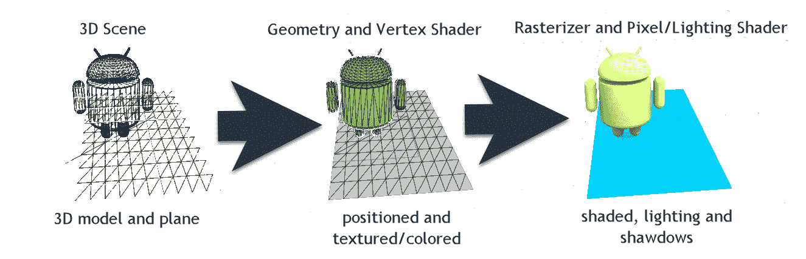

3D 模型的典型渲染过程

现在，这个图表只是从视觉上展示了渲染过程。几何和顶点着色器实际上永远不会渲染线框模型。相反，它们只定位和着色顶点和表面，然后这些信息被输入到像素/片段和照明着色器中。这一步被称为**光栅化**，代表了生成或光栅化 2D 图像的最终步骤。

我们在这里讨论的渲染过程是在设备 GPU 上使用 DirectX 或 OpenGL 进行的标准实时渲染。请记住，还有其他用于实时（体素）和非实时（光线追踪）渲染的渲染过程。

Euclideon 开发了一种类似体素渲染技术，他们声称如下：

"这里有了真正可用的全息技术。"

- Euclideon

这听起来非常有前景，并且是 AR 和 VR 的一个变革性技术。然而，这项技术因在帧率损失的情况下渲染万亿个点而受到极大的质疑，有些人认为这是荒谬的声明。

# 构建测试场景

如往常一样，让我们看看这在我们工具中的样子。打开 Unity，使用我们已安装的示例 ARCore 项目，并执行以下步骤：

1.  从菜单中选择文件 | 新建场景。这将在 Unity 中为我们创建一个新的空场景。

1.  从项目窗口中，将安迪预制件从`Assets/GoogleARCore/HelloARExample/Prefabs`文件夹拖动到层次窗口中，如以下屏幕截图中所示：

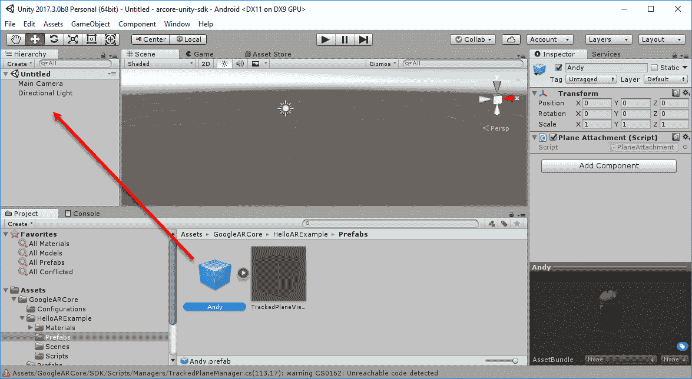

显示 Unity 界面，安迪预制件被拖动到场景中

1.  安迪（Andy）相当小，因此我们将调整他的大小和相机，以便更好地适应场景和游戏窗口。选择安迪，并将变换缩放修改为 X 为`25`，Y 为`25`，Z 为`25`。然后，选择主相机，并将其变换位置修改为 Y 为`4`。这在上面的屏幕截图中显示：

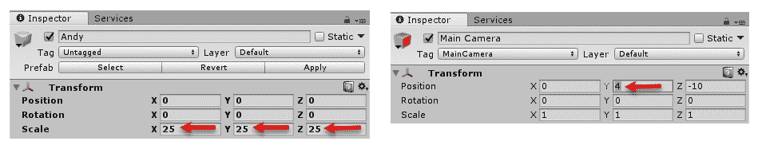

设置安迪和主相机的变换

1.  点击游戏和场景标签页以切换视图，查看安迪模型在每个视图中的样子。

Unity 中的场景窗口用于组合场景对象。你将在 Unity 中大部分工作都在这里完成。游戏窗口表示游戏中的视图，尽可能接近渲染效果。不幸的是，对于 ARCore 应用，我们只能限制在设备上进行测试，因此无法生成准确的游戏视图。这就是为什么，至少目前，我们将为探索目的在单独的场景中工作。

1.  从菜单中选择 GameObject | 3D Object | Plane。这将向场景添加一个新的平面。确保通过在检查器窗口中点击变换组件旁边的齿轮图标并从菜单中选择重置位置，使平面定位在`0`,`0`,`0`。完成此操作后，安迪将在平面上投射阴影。

1.  再次切换视图。展开场景标签页下方的着色下拉菜单，如以下摘录所示：

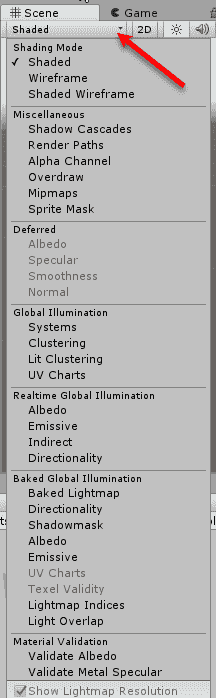

绘制模式菜单

1.  此菜单表示 Unity 可以支持的各种绘制模式。其中一些可能是有意义的，例如线框，而其他则不太有意义。无论如何，运行每个选项的列表，看看它们的作用。

# 材质、着色器和纹理

好的，现在我们已经看到了 Unity 如何渲染场景以及各种绘制模式。然而，我们仍然需要了解对象是如何着色或纹理化的。在 Unity 中，我们通常使用材质、着色器和纹理来渲染 3D 对象。材质本质上是一个着色器、其依赖的纹理和其他设置的封装。让我们通过以下步骤查看 AndyMaterial 在 Unity 中的样子：

1.  在项目窗口中打开 `Assets/GoogleARCore/HelloARExample/Materials/Andy` 文件夹，并选择 AndyMaterial。查看检查器窗口，注意顶部的着色器名称（`ARCoreDiffuseWithLightEstimation`）。当前着色器使用简单的光照模型，并针对移动 AR 进行了优化，而我们目前不需要，因此我们将更改它。

1.  在 AndyMaterial 中展开着色器下拉菜单，选择标准。这将使材质切换到使用标准着色器，如下面的截图所示：

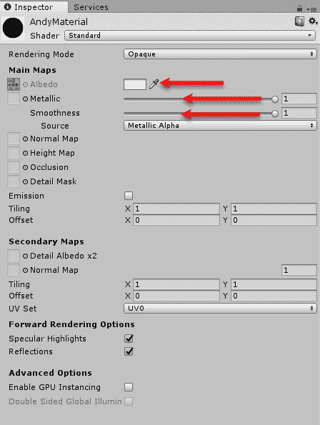

将 Andy 切换到使用标准 Unity 着色器

1.  你会立即注意到 Andy 变得非常暗。这是因为金属和光滑度被调得非常高。使用鼠标调整各种值，使其更加愉快，如前一张截图中的红色箭头所示。也许一个金属闪亮的 Andy？

在调整材质时要注意的一点是，你对材质所做的任何更改都将自动保存并持久化，即使在播放或演示模式下运行也是如此。有时，保留设置的备份很有用，尤其是如果你发现它们很难实现。

1.  在项目窗口中选择 AndyMaterial 并按 *Ctrl* + *D* 或在 Mac 上按 *command* + *D* 复制 AndyMaterial。将新材质重命名为 StandardAndyMaterial。

1.  再次选择 AndyMaterial。将着色器改回 `ARCore/DiffuseWithLightEstimation`。注意 Andy 的外观如何迅速改变。

1.  从菜单中选择文件 | 保存场景。将场景保存到 `Assets/GoogleARCore/HelloARExample/Scenes` 文件夹，命名为 `RenderingTest.scene`。

如你所见，有很多选项和设置可以用于渲染 3D 对象。请自由探索标准着色器上的每个材质设置。在下一节中，我们将通过讨论光照来扩展我们对渲染的理解。

# 3D 光照

到目前为止，我们已经了解了渲染过程的基础以及 3D 模型的渲染方式。然而，在第一部分中，我们省略了光照如何影响这个过程。为了了解光照在 3D 场景中的重要性，我们不妨先关闭灯光。打开 Unity，回到第一部分结束的地方，并按照以下步骤操作：

1.  在层次结构窗口中选择方向光对象。

1.  在检查器窗口中通过取消选中对象名称旁边的复选框来禁用灯光。这将关闭或禁用灯光。然而，你将注意到并非所有的灯光都关闭了。这是因为我们有一个环境光或全局光，用于解释一般的光散射。

1.  现在，你面前的是一个没有灯光和阴影的暗物体。通过点击复选框重新打开方向光。查看检查器窗口中光的属性，如图所示：

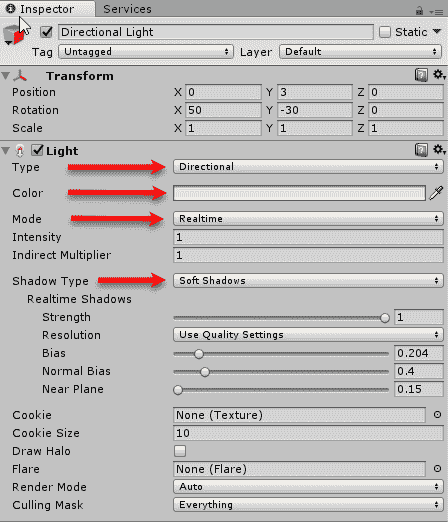

检查器窗口中的方向光属性

1.  在检查器窗口中调整类型、颜色、**模式**和阴影类型属性。你可以使用四种不同类型的灯光。方向光类型代表如太阳这样的光源，因此我们只需要确定光的方向。对于其他灯光类型，如**点光**和**聚光灯**，你需要正确地将灯光放置在场景中才能看到任何效果。

我们可以使用以下方程计算简单的 3D 漫反射照明：

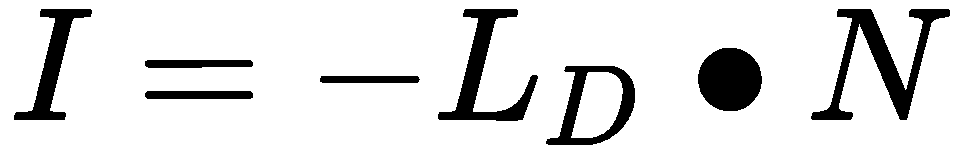

这里：

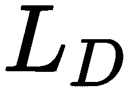 是光的方向

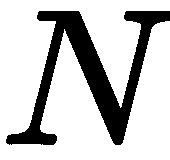 是表面的法线

 是光的强度 [0 到 1]

 然后被乘以颜色，以确定最终的照明颜色。

1.  我们之前查看的**Standard**着色器使用**基于物理的渲染（PBR**）或照明模型，这是一个相当复杂的模型。不幸的是，PBR 着色器目前在移动平台上有限制，并且通常无法正常工作或性能不佳。通常，设备的 GPU 无法支持 PBR 着色器所需的额外指令。因此，我们将局限于编写我们自己的自定义照明着色器。

1.  让我们探索在 AndyMaterial 上切换着色器，以便我们可以看到不同的照明模型会产生什么效果。在`Assets/GoogleARCore/HelloARExample/Materials/Andy`文件夹中找到 AndyMaterial 并选择它。

1.  在`ARCore/DiffuseWithLightEstimation`、**Mobile Diffuse**和**Standard**着色器之间切换，以查看效果或不同的照明模型，如图所示：

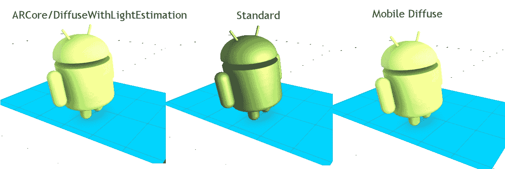

三个不同着色器的照明模型比较

1.  显然，Standard 着色器看起来最自然，但正如我们所学的，PBR 着色器目前在移动平台上不受支持。另一个选择是 Mobile Diffuse 着色器；让我们看看这个着色器在我们的 AR 示例应用中的样子。

1.  将着色器切换到 Mobile Diffuse，然后保存项目（文件 | 保存项目）。

1.  将你的设备连接并输入 *Ctrl *+ *B*，Mac 上为 *command *+ *B*。这将构建并在你的设备上运行应用。玩玩这个应用，等待一个表面可见，然后点击并放置 Andy。

注意我们的朋友有什么不同吗？没错，他看起来就像加拿大炎热的夏天一样突出。这是因为移动漫反射着色器假设了一个一致的光源，这意味着我们的模型总是接收到相同的光（方向和强度），但在现实世界中，随着用户的移动，光的方向和强度可以发生显著变化。你的设备相机会尝试补偿这一点，但你仍然可以观察到明显的光照变化，尤其是在用户周围的光照发生显著变化时。你可以通过再次运行应用程序来观察这一点，这次，仔细观察我们的模型及其周围的光照有何不同。ARCore 通过执行一个称为光估计的过程来解决不一致光照的问题。我们将在下一节中详细介绍光估计。

# 光估计

光估计是一种复制现实世界光照条件并将其应用于我们的 3D 虚拟对象的技术。理想情况下，我们希望能够复制确切的光照条件，但当然，我们还没有达到那个水平。ARCore 目前使用图像分析算法根据设备当前图像确定光强度。然后，将其作为全局光照应用于场景中的 3D 对象。再次打开 Unity，让我们通过遵循给定的步骤来了解这是如何完成的：

1.  再次定位 AndyMaterial 并将其着色器还原为`ARCore/DiffuseWithLightEstimation`。

1.  保存项目（文件 | 保存项目）。

1.  连接你的设备，并输入*Ctrl* + *B* (*Mac 上的*command* + *B*)来构建和运行设备上的应用程序。放置几个 Andy 模型并改变光照条件。注意我们的物体是如何对光照变化做出反应的。

1.  返回 Unity，双击`Assets/GoogleARCore/HelloARExample/Scenes`文件夹中的`HelloAR`场景以打开场景。请随意保存你的`RenderingTest`场景。

1.  将你的注意力转向层级窗口，双击**方向光**以在场景窗口中聚焦并突出显示它。注意在场景窗口中光是如何直指下方的。在**检查器**窗口中，你会看到阴影类型设置为无阴影，并且强度调低到`0.7`，这实际上将光变成了方向性环境光或全局光。

1.  将你的注意力转回到层级窗口，并选择**环境光**。进入**检查器**窗口，点击**环境光（脚本）**组件旁边的齿轮图标。然后，从上下文菜单中选择**编辑脚本**选项，如图所示：

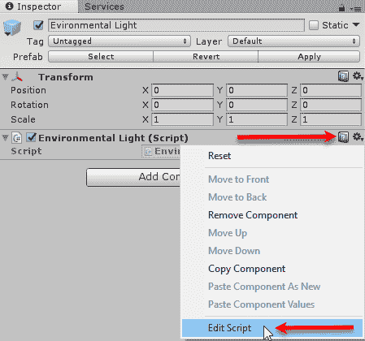

编辑环境光脚本

1.  这将打开你的脚本编辑器中的脚本。默认情况下，Unity 安装了**MonoDevelop**，如果没有安装或设置了不同的编辑器，它将打开脚本。向下滚动到`Update`方法，如下所示：

```kt
public void Update()
{
#if UNITY_EDITOR
        // Set _GlobalLightEstimation to 1 in editor, if the value is not set, all materials
        // using light estimation shaders will be black.
        Shader.SetGlobalFloat("_GlobalLightEstimation", 1.0f);
#else
 if (Frame.TrackingState != FrameTrackingState.Tracking)
        {
            return;
        }

        // Use the following function to compute color scale:
        // * linear growth from (0.0, 0.0) to (1.0, LinearRampThreshold)
        // * slow growth from (1.0, LinearRampThreshold)
            const float LinearRampThreshold = 0.8f;
            const float MiddleGray = 0.18f;
            const float Inclination = 0.4f;

        float normalizedIntensity = Frame.LightEstimate.PixelIntensity / MiddleGray;
        float colorScale = 1.0f;

        if (normalizedIntensity < 1.0f)
        {
            colorScale = normalizedIntensity * LinearRampThreshold;
        }
        else
        {
            float b = LinearRampThreshold / Inclination - 1.0f;
            float a = (b + 1.0f) / b * LinearRampThreshold;
            colorScale = a * (1.0f - (1.0f / (b * normalizedIntensity + 1.0f)));
        }

        Shader.SetGlobalFloat("_GlobalLightEstimation", colorScale);
#endif
    }
}
```

1.  `#if UNITY_EDITOR`是一个编译器指令，用于检查代码是否在编辑器中运行。我们这样做的原因是，当代码在 Unity 编辑器中运行时，我们希望它忽略任何光估计计算。当代码在编辑器中运行时，它将执行下一行；`_GlobalLightEstimation`着色器变量被设置为`1`。这意味着当代码在编辑器中运行时，它所做的只是将我们的光照设置为`1.0`。

在进行移动开发时，你经常会遇到`#if UNITY_EDITOR`指令。这个指令允许你编写仅在代码在编辑器中运行时执行的测试代码。这允许我们模拟对象在编辑器中的运行，而无需担心 ARCore 服务或设备限制。

1.  将你的注意力转向代码中的`#else`块。这是在设备上执行的代码，首先检查`Frame`是否正在跟踪。我们已经在 Android 中看到了这个检查。其余的代码基本上只是数学运算，但如果你查看最后高亮的那一行，你会看到一个对`Frame.LightEstimate.PixelIntensity`的调用。这就是 ARCore 从相机读取图像并确定当前像素强度的调用；一个从完全黑色的图像的`0`到完全白色的`1`的浮点值。强度是根据一个称为`MiddleGray`的常量进行归一化的。`MiddleGray`颜色或光强度为`0.18f`大致对应于我们人类停止识别颜色的点。

1.  然后，我们使用`normalizedIntensity`来确定我们是否想要线性变化的光照，当`normalizedIntensity`小于`1.0`时，或者当强度大于`1.0`时，变化更缓慢。这就是其余数学运算所做的一切，只是在某个阈值之后使光照变化更加缓慢。

1.  将`MiddleGray`常量更改为以下行：

```kt
const float MiddleGray = 1.0f;
```

1.  这将把我们的光估计转换为现在使用线性模型。保存代码更改并返回 Unity。Unity 将自动重新编译代码，并在编辑器底部的状态栏中通知你任何错误。

1.  连接你的设备并构建运行。将一个 Andy 放在表面上。注意这个图形有多暗；这是因为光照模型太突然。

我们使用的是单通道的颜色，或者你也可以称之为灰度。这就是为什么我们称这些值为颜色，但实际上它只是一个单一的浮点数。灰度颜色`0.18f`相当于 RGB 颜色（`0.18f`，`0.18f`，`0.18f`），或者 ARCore 称之为`MiddleGray`。

1.  将`MiddleGray`常量改回`0.18f`，保存项目，并运行应用。注意光照的变化。

这涵盖了 ARCore 如何使用图像分析技术从相机的图像中读取光强度，并将其转换为全局光强度或颜色。光照值是在着色器上设置的，我们将在下一节中了解这个值是如何被使用的。

# Cg/HLSL 着色器

Unity 中使用的着色语言是 HLSL 的多种变体，有时也称为 Cg。这种着色变体提供了两种不同形式的着色器：**表面**和**顶点**/**片段**着色器。现在，从 Android 过来，这可能会让人感到困惑，因为 GLSL 对顶点和片段着色器处理不同。然而，Unity 中的 HLSL 变体将顶点和片段着色器视为相同，因为它们位于同一文件中，并且处于相同的流程中。处理我们模型光照的表面着色器可以是简单的，也可以非常复杂。标准的 Unity 表面着色器使用 PBR 光照模型，这是一个相当先进的模型，并且不支持大多数移动设备。这个问题，加上我们有限的场景光照跟踪能力，使我们不得不编写自己的着色器，以正确地获取我们的对象光照。ARCore 为我们提供了一个非常简单的表面着色器，用于在示例中为 Andy 模型提供光照。让我们打开 Unity，按照以下步骤查看这个着色器的样子：

1.  加载`HelloAR`示例项目和场景。

1.  在`Assets/GoogleARCore/HelloARExample/Materials/Andy`文件夹中选择 AndyMaterial。确保着色器设置为`ARCore/DiffuseWithLightEstimation`。如果你更改了它，请将其切换回来。

1.  点击齿轮图标，从上下文菜单中选择编辑着色器。这将打开你的代码编辑器中的着色器，这里也为了参考而展示：

```kt
Shader "ARCore/DiffuseWithLightEstimation"
{
    Properties
    {
        _MainTex ("Base (RGB)", 2D) = "white" {}
    }

    SubShader
    {
        Tags { "RenderType"="Opaque" }
        LOD 150

        CGPROGRAM
    #pragma surface surf Lambert noforwardadd finalcolor:lightEstimation

        sampler2D _MainTex;
        fixed _GlobalLightEstimation;

        struct Input
        {
            float2 uv_MainTex;
        };

    void lightEstimation(Input IN, SurfaceOutput o, inout fixed4   
                         color)
    {
        color *= _GlobalLightEstimation;
    }

    void surf (Input IN, inout SurfaceOutput o)
    {
        fixed4 c = tex2D(_MainTex, IN.uv_MainTex);
        o.Albedo = c.rgb;
        o.Alpha = c.a;
    }
    ENDCG
  }

    Fallback "Mobile/VertexLit"
}
```

1.  这是一个相当简单的漫反射光照着色器，它使用了我们之前计算的全球光照估计。它首先通过以下行定义自己：

```kt
Shader "ARCore/DiffuseWithLightEstimation"
```

1.  接下来，它定义了下一个代码块中的`Properties`，其中`_MainTex`代表基础纹理，被称为`"Base (RGB)"`，并设置为`2D`。如果你快速回顾 Unity，你可以在**检查器**窗口中看到这个属性。

1.  以`SubShader`开始的代码块是动作发生的地方。我们首先定义`Tags`，这是一组键/值对，用于设置渲染顺序和类型参数。在我们的例子中，我们将此设置为`Opaque`。然后，我们有以下行：

```kt
LOD 150
```

1.  这决定了着色器的**细节级别**。`LOD`指令用于确定着色器的复杂度或性能要求。你可以将值设置为任何值，但以下列表显示了典型值：

    +   顶点照明类型着色器 = `100`

    +   贴图，反射式顶点照明 = `150`

    +   漫反射 = `200`

    +   漫反射细节，反射式凸起无光照，反射式凸起顶点照明 = `250`

    +   凸起，高光 = `300`

    +   凸起高光 = `400`

    +   视差 = `500`

    +   视差高光 = `600`

1.  从列表中可以看出，简单的着色器代表的是低细节级别。这意味着低级硬件应该能够无任何问题地运行这个着色器。你可以为每个着色器或全局设置最大着色器 LOD；查看 Unity 文档以获取更多详细信息。

1.  我们从`CGPROGRAM`开始编写实际的着色器代码，然后使用`#pragma`指令定义表面着色器的形式，如下所示代码：

```kt
#pragma surface surf Lambert noforwardadd finalcolor:lightEstimation

#pragma surface surfaceFunction lightModel [optionalparams]

```

1.  指令的第一部分，`surface`，将其定义为表面着色器。然后，我们看到`surf`函数名称指的是主表面函数。接着是光照模型，本例中为`Lambert`。之后，选项设置为`noforwardadd`，这是一种简单的方式来限制灯光数量为单一。最后，我们使用一个名为`lightEstimation`的自定义修改函数，并通过`finalcolor:lightEstimation`进行设置。

此着色器使用 Lambert 光照模型。你可以在[`docs.unity3d.com/Manual/SL-SurfaceShaderLightingExamples.html`](https://docs.unity3d.com/Manual/SL-SurfaceShaderLightingExamples.html)找到 Unity 支持的光照模型的大量示例或如何编写自己的模型。

1.  在`#pragma`指令的内部，我们看到着色器输入的定义：`_MainTex`、`_GlobalLightEstimation`和`struct Input`。如果你还记得，`_GlobalLightEstimation`是我们设置在`EnvironmentalLight`脚本中的变量，用来表示我们的全局光。

1.  接下来，我们将向下跳几行到`surf`函数，如下所示：

```kt
void surf (Input IN, inout SurfaceOutput o)
{
 fixed4 c = tex2D(_MainTex, IN.uv_MainTex);
 o.Albedo = c.rgb;
 o.Alpha = c.a;
 }
```

1.  此函数简单地使用`tex2D`和输入的`uv`坐标从我们的`_MainTex`中采样颜色。然后，它从查找中设置颜色（`Albedo`）和`Alpha`。这个函数首先被调用以确定表面的颜色，然后，其输出被传递到 Lambert 光照模型，之后最终颜色由`lightEstimation`函数设置。

    标记为`inout`的输入表示一个可以修改的值，并且将自动返回。

1.  向上滚动一点到`lightEstimation`函数。在这个函数内部，以下所示的代码根据为`_GlobalLightEstimation`设置的值修改颜色：

```kt
color *= _GlobalLightEstimation;
```

1.  将颜色乘以全局光照估计相当于调整亮度开关。

1.  最后，我们通过`Fallback`和另一个着色器的名称来完成着色器的设置。这将为当前着色器无法运行时设置一个回退或备用着色器。着色器可能会因为编译错误或硬件限制而失败。

现在我们已经清楚地了解了之前生成的光照估计值在着色器中的使用方式，我们可以转向可能增强我们的光照。如果你还记得，我们当前的光线是直接向下的，但理想情况下，我们希望将光线定位到最强的光源处。在下一节中，我们将探讨一种简单但有效的方法来跟踪和定位 AR 中的光线。

# 估计光照方向

Google 通过 ARCore 为我们提供了一个强大的解决方案，用于估计 AR 场景中的光照量。正如我们所学的，光方向是场景照明的一个重要组成部分。Google 并没有故意忽略使用 ARCore 估计光方向；只是这个问题真的很难做对。然而，Google 确实在 ARCore 中为我们提供了足够多的工具，使我们能够估计光方向，并做出一些简单的假设。首先，我们需要假设我们的用户，至少目前，将保持在同一个房间或区域。其次，我们的用户需要至少在视野中 180 度的弧度内查看，或者更简单地说，用户只需要四处看看。第三，如果真实世界环境由一个远处的单一明亮光源照亮，例如太阳，那么效果最好。基于这些假设，我们可以简单地存储用户看到最亮图像的方向，并使用它来反向计算我们的光方向。这可能听起来比实际要复杂，所以希望以下图表可以进一步解释这一点：

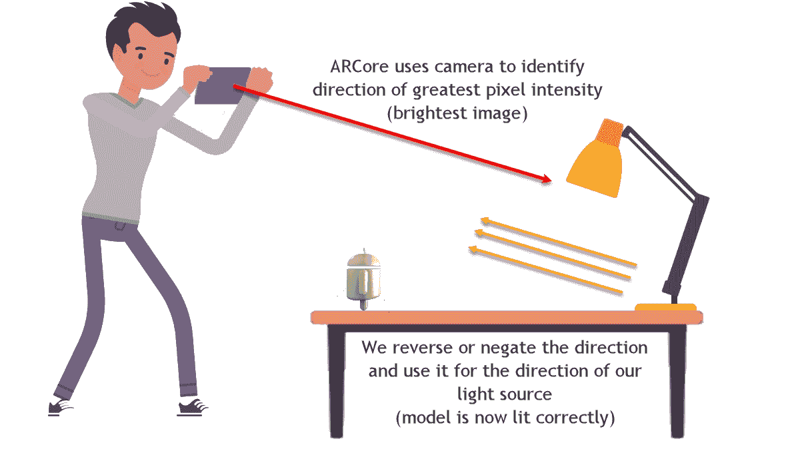

从相机像素强度计算光方向

现在，这个技术听起来可能相当复杂，但实际上并不复杂。我们实际上只需要几行代码就能完成这个任务。打开 Unity 并跟随步骤编写我们的方向光检测器：

1.  确保样本应用中的`HelloAR`场景已加载。

1.  在层次结构窗口中选择环境光对象。

1.  在**检查器**窗口中点击环境光（脚本）组件旁边的齿轮图标，并在上下文菜单中选择编辑脚本。

1.  在类声明下方，添加以下行以声明新变量：

```kt
public class EnvironmentalLight : MonoBehaviour
{ //after me
  public GameObject SceneCamera;
  public GameObject SceneLight;
  private float maxGlobal = float.MinValue;
  private Vector3 maxLightDirection;
```

1.  这些变量将保存对场景相机、光、找到的最大全局强度以及找到的方向的引用。

1.  在代码中向下滚动，直到看到`Update`方法中标识的行，并添加以下行：

```kt
const float Inclination = 0.4f; //after me
var pi = Frame.LightEstimate.PixelIntensity;
if(pi > maxGlobal)
{
  maxGlobal = pi;
  SceneLight.transform.rotation = Quaternion.LookRotation(-SceneCamera.transform.forward);
}

```

1.  所有这些代码所做的只是使用`Frame.LightEstimate.PixelIntensity`读取当前相机方向的光强度。然后，我们检查这个值是否高于之前看到的任何值（`maxGlobal`）。如果是，我们设置一个新的最大值并将光（`SceneLight`）旋转到与相机相反的方向，这意味着光将面向相机。

在编辑`#if UNITY_EDITOR`指令之外的代码时要小心。这段代码只有在为平台运行构建时才会编译，这意味着代码中的任何错误都会被识别为构建错误。这可能会令人困惑，所以请小心避免在编写这些部分时出现语法错误。

1.  保存文件；这就是我们为了调整光方向需要编写的所有代码。如果你还记得上一节，我们使用的漫反射着色器并没有考虑光方向。然而，ARCore 为我们提供了一个考虑了光方向的着色器。

1.  返回编辑器以在 Assets/GoogleARCore/HelloARExample/Materials/Andy 文件夹中找到并选择 Andy 材质。

1.  将材质更改为使用`ARCore/SpecularWithLightEstimation`着色器。这种材质能更好地显示光的方向。

1.  在层级窗口中选择环境光照对象。注意我们已向环境光照（脚本）组件添加了两个新属性。这些新属性（场景相机和场景光）被添加是因为我们在类中将它们声明为**公共**字段。

1.  点击场景相机属性旁边的类似靶心的图标。然后，如以下摘录所示，从**选择游戏对象**对话框中选择 First Person Camera 对象：

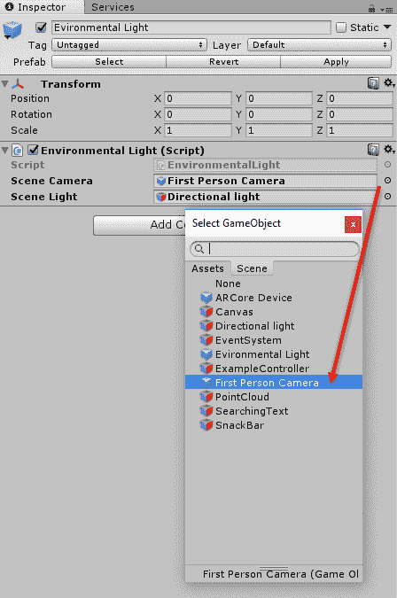

设置组件的场景相机和场景光属性

1.  关闭**选择游戏对象**对话框。

1.  重复相同的步骤来设置**方向光**作为**场景光**。

1.  连接您的设备并构建运行。在一个只有一个明亮光源的区域运行应用，看看放置 Andy 后他的样子。

# 更新环境照明

现在，Andy 应该被看起来区域中最亮的光源照亮。然而，因为我们目前没有跟踪光方向的变化，如果你更换房间或照明发生变化，那么这种幻觉就会被打破。光跟踪很困难，而且比跟踪用户更困难，尽管我们可以实施一个简单的黑客手段来不跟踪照明，目前这个手段是永久的，如果你没有注意的话。跟随以下步骤将这个简单的黑客手段放入我们刚刚编写的代码中：

1.  在你选择的文本编辑器中打开`EnvrionmentalLight.cs`脚本。如果你忘记了如何做，只需回顾几页。

1.  在指定的行之后和之前添加以下行：

```kt
var pi = Frame.LightEstimate.PixelIntensity; //after me
maxGlobal *= .98f;
if(pi > maxGlobal){ //before me
```

1.  那一行是`maxGlobal`变量的降级函数。记住`maxGlobal`是我们识别为最强光源的值。这个简单的函数，是的，函数，随时间降低这个值。`.98f`的值设置了衰减速度。`.98f`代表一个相当快的衰减率，而`.9999f`则代表一个慢衰减率。

1.  保存文件，是的，就这样。

1.  返回 Unity。连接、构建并运行应用。现在当你放置一个 Andy 时，你应该很快看到应用识别的最强光源的变化。你可以随意返回并更改衰减率或修改函数，并使用你自己的方法；实验。

我们组合的方法是一种简单的跟踪和估计光方向的方式。正如我们提到的，这种方法是有效的，但当然并非没有局限性。无论如何，这应该为好奇的读者提供足够的资料来继续并进一步扩展。我们还完全避免了关于阴影的适当讨论。幸运的是，我们将在第九章[混合光用于建筑设计](https://843257a4-843b-4278-99df-fec1e2bd996b.xhtml)中有很多时间来讨论这一点，我们将允许用户转换他们自己的居住空间。

# 练习

**请独立完成以下练习**：

1.  改变`maxGlobal`衰减率。你决定是让它更快还是更慢。

1.  根据用户的移动量增加或减少`maxGlobal`衰减率。提示——回想一下我们是如何追踪用户的，并利用这一点来确定他们走了多远或有多快。使用这些信息来设置衰减率。

1.  编写你自己的自定义光照表面着色器。这个任务可能有些困难，但付出努力是值得的。

# 摘要

当然，随着你成为 AR 领域的专家，你会意识到光照对增强现实的重要性。它如此重要，以至于谷歌开发了内置光估计的 ARCore，这就是为什么我们花费了整个章节来讨论这个主题。首先，我们更深入地了解了渲染过程；然后，我们介绍了 3D 光照，这是我们理解 AR 中光照增加的复杂性所必需的基本知识。这引导我们研究 ARCore 如何通过仔细查看 Unity Cg/HLSL 着色器和，更具体地说，表面着色器来估计区域的光照水平或全局光照。最后，我们实施了一个简单但有效的技巧来跟踪和估计场景中的光方向，我们将这个任务留给读者在他们的时间里去改进。

估计环境中的实际光照条件将是 AR 需要克服的主要障碍。然而，随着 AI 和机器学习的惊人进步，我们可能会很快看到一些更好的解决方案出现。我们将在下一章更详细地探讨机器学习如何帮助 AR。
