# 第八章：环境识别

在整本书中，我们探讨了我们的设备如何借助 ARCore 的多种方式来跟踪用户、理解用户的世界，并渲染一个替代现实。ARCore 使用设备的传感器和摄像头作为输入，不断更新它感知到的用户真实世界。然而，如果我们想为用户提供更多功能；比如识别某个物体、标志或地标？这将需要一套更高级的工具。即使是在 5 年前，这也会被视为一项极其艰巨的任务。随着 OpenAI 的出现，多亏了马斯克先生，许多其他公司也开始开源并使他们的工具可用。这导致了这些技术（俗称为**机器学习**（**ML**））的爆炸性增长，并使它们对每个人更加易于访问。幸运的是，对于那些对开发 AR 应用感兴趣的人来说，这是一个好事。当我们需要识别和理解用户的环境时，我们希望得到所有可能的帮助。

在本章中，我们将介绍机器学习，并探讨我们如何利用它为我们的用户提供更好的 AR 应用。在本章中，我们将涵盖以下主题：

+   机器学习简介

+   深度强化学习

+   编程神经网络

+   训练神经网络

+   TensorFlow

机器学习是一个非常高级的主题，要掌握它可能需要多年的学习。然而，为了我们的目的，我们将学习一些基本技术，读者可以在以后通过更多的学习或实现自己的解决方案来扩展。

如果你已经对神经网络、卷积神经网络和 TensorFlow 有深入的了解，你可以自由地跳过这一章。

# 机器学习简介

机器学习是一个广泛使用的术语，用来指代人工智能和相关计算机预测分析模型。虽然“机器学习”这个名字可能过于笼统，但它比“人工智能”这个术语更合适。然而，机器学习本身是一个非常广泛的术语，可能需要进一步的解释和澄清。机器显然指的是计算机或其他设备，而学习通常表示一个随着时间的推移会演变或学习的算法或模型。然而，在许多机器学习模型中，情况往往并非如此。因此，为了我们的目的，我们将使用更广泛的“机器学习”这个术语来指代任何可以训练以识别 AR 中的环境或环境部分的工具或算法，从而让我们，开发者，更好地增强用户的世界。

数据科学和机器学习密不可分。数据科学是关于理解数据、提取模式和做出预测的。本质上，当你开始编写机器学习模型以识别物体或环境时，你实际上只是在分析数据，这意味着你也可以非常松散地称自己为数据科学家。

机器学习是一个很大的领域，并且每天都在不断扩大，所以让我们具体分析一下我们希望机器学习帮助我们解决的问题：

+   **目标检测**：目标在 AR 中已经使用了一段时间。它曾是许多 AR 应用在 ARCore 之前的跟踪和参考点。

+   **图像识别**：这衍生出一系列子应用，我们将在后面详细讨论。

+   **物体检测**：从点云数据中检测 3D 物体并非易事，但这已经实现，并且正在变得更好。

+   **人脸检测**：在图像中检测人脸已经存在多年，并在许多应用中得到了很好的应用。

+   **人员检测**：检测人或动作具有很大的可能性。想想看，Kinect 进入 AR。

+   **手**/**手势检测**：不要与触摸手势混淆。这是我们检测用户在设备摄像头前手的动作或手势的地方。

+   **物体姿态检测**：与物体检测相关，但现在我们还在检测物体的位置和方向。

+   **光源检测**：能够在场景中放置逼真的光源，使虚拟对象渲染更加逼真。我们已经在第七章中探讨了光照的重要性，*光照估计*。

+   **环境检测**：识别用户移动到的环境在地图制作或 GPS 不可用的建筑或其他位置有很好的应用，这适用于大多数内部空间。

每个问题可能需要不同的工具和技术来解决这些问题。在机器学习中，不仅仅关于使用工具，而是最终的答案和什么有效。在构建您应用所需的任何机器学习时，请考虑这一点。尝试各种机器学习工具和技术；机器学习模型的大小和性能差异可能至关重要，这是您需要考虑的。

一位机器学习算法走进了一家餐厅。

服务员问道：“您要点什么？”

算法说：“其他人都在吃什么？”

- 未知

在下表中总结了当前主要机器学习提供商及其可以解决的 AR 问题类型：

| **工具集** | **优点/缺点** | **机器学习任务** |
| --- | --- | --- |
| **目标/图像** | **物体/姿态** | **人脸** | **人员** | **手** | **光源** | **环境** |
| Vuforia | 成熟且易于使用。需要互联网连接。 | 是 | 是/付费 |  |  |  |  |  |
| XZIMG | 支持 Unity 和其他平台的人脸和图像/目标跟踪。 | 是 |  | 是 |  |  |  |  |
| ARToolkit | 成熟的开源平台，用于图像跟踪和特征检测。 | 是 |  |  |  |  |  |  |
| EasyAR | 专业许可证获得对象和特征跟踪。 | 是 | 是/付费 |  |  |  |  |  |
| Google Face Detection API | 低级 Android API。 |  |  | 是 |  |  |  |  |
| OpenCV | Android 的一个成熟的底层 API，商业版本已移植到 Unity。仍需要底层知识。 | 是 | 是 | 是 | 是 | 是 | 即将推出 | 即将推出 |
| Google TensorFlow | 尚处于起步阶段，但迅速成为 CNN 的平台标准。需要底层和高级机器学习知识。 | 是 | 是 | 是 | 是 | 是 | 即将推出 | 即将推出 |
| Google ARCore | 目前识别平面、特征点和光线。 |  |  |  |  | 是 | 是 |

我们只包括为支持移动 ARCore 设备的 AR 平台构建了主要平台的参与者。由于这些技术的局限性，我们排除了 Web 技术，尽管许多提到的技术需要互联网连接并支持 Web 平台。如果你快速浏览一下表格，你也可以清楚地看到两个有潜力主导整个空间的主要竞争者；这是因为这些技术都是底层技术，通常支持像 Vuforia 这样的更大平台。这两个平台现在都支持移动预训练网络，以便在移动设备上进行快速识别。这现在可能看起来不是什么大事，但当我们开始训练自己的模型时，你就会明白为什么。

# 线性回归解释

让我们讨论一下机器学习的基本原理以及它试图实现的目标。看看以下图表，它显示了为你下一个应用程序的一些虚构的销售数据：

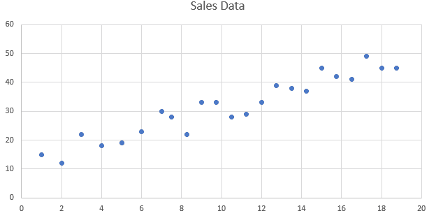

虚构的销售数据图表

现在，只需看一下图表，你就可以看到，随着*x*值（可能是销售天数）的增加，我们的销售额似乎也在增加：*y*值（销售额）。仅凭观察图表，我们自己就可以通过跟随点的趋势来做出预测。试试看；当*x*值（底部轴）为 25 时，销售额是多少？给出你的猜测，并写下它。在你确定了猜测之后，我们将使用一种称为**线性回归**的技术来找到一个好的答案。

线性回归已经存在多年，被认为是许多统计数据分析方法的基础。它是今天在数据科学和预测分析中使用的许多其他机器学习算法的基础。这种技术通过找到一个最佳拟合点（一条线、曲线或任何其他形状）的解决方案来实现。从这个解决方案中，我们可以确定未来的或过去的事件或发生。由于这种方法已经非常成熟，你只需打开 Excel，就可以让它直接在图表上绘制线性回归解决方案。以下是一个带有趋势线和方程的线性回归图表的示例：

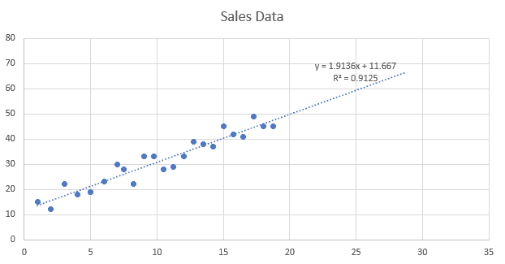

带有线性回归趋势线的图表

请记住，这个例子使用的是二维点，但同样的概念也适用于三维，你只需要考虑额外的维度，这虽然不是一件 trivial 的事情，但仍然可行。

不深入数学的细节，只需理解，这条线是为了最小化线与点之间的误差，这通常被称为最佳拟合线或最小误差线，在这种情况下，它被表示为 R 平方值（**R²**）。**R²**的值从 1.0（最佳拟合）到 0.0（在黑暗中射击）不等。你可以看到我们的**R²**并不完美，但它是 1 或 91.25%的正确率；它并不完美，但可能足够好了。

概率和统计学在所有形式的机器学习中都起着重要作用。如果你没有良好的统计学背景，你仍然可以通过选择第三方提供商来获取统计数据。唯一的例外是如果你有关于该技术的难题；那么，拥有一些你自己的背景知识会有所帮助，如果你已经在努力追赶你的 3D 数学技能，这可能不是你想要听到的。

以我们刚才看到的例子为例，现在考虑在 3D 空间中的问题，它不是一个线，而是一个我们想要识别或预测的 3D 对象。显然，使用统计模型，事情可以很快变得复杂，计算成本也很高。幸运的是，有一种更好的方法来做这件事，使用一种使用**监督学习**来模拟人脑的技术，称为**神经网络**（**NN**）。

在下一节中，我们将深入了解监督学习，并探讨我们可以使用神经网络进行数据分析和使用**深度学习**（**DL**）的一些技术。

# 深度学习

正如我们讨论的那样，更传统的预测模型，如线性回归，扩展性不好，因为它们总是需要使用所有可用的点或数据来计算整个解决方案。这些类型的技巧或模型没有记忆、学习和改进的能力，它们通常被归类为监督模型。这导致了更高级的学习模型的演变，称为**强化学习**（**RL**）技术，用于解决机器学习问题。实际上，深度学习和深度强化学习技术在性能和准确性上已经超越了统计方法几个数量级。然而，情况并非总是如此，统计方法也在每天以同样的速度显著改进。这确实是一个进入机器学习的激动人心的时刻。

下面的图示展示了强化学习过程：

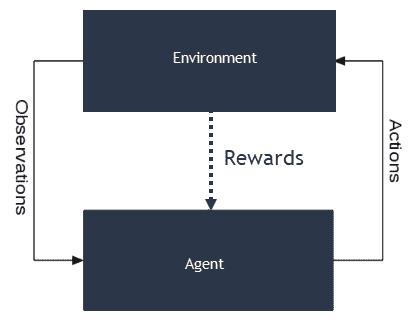

强化学习过程

在图中，你可以看到有一个**代理**（假设为计算机）和**环境**（游戏或现实世界）。**代理**根据**环境**的**观察**采取行动，这些行动可能基于或可能不基于**奖励**。使用奖励的 RL 系统被称为强化学习。我们在本章中使用的学习方法被称为监督学习，因为我们正在对特定输出类别进行标记或训练。无监督学习是一种不标记数据但仅使用技术进行分类或分组的数据训练方法。

我们通常识别出三类训练：无监督学习、监督学习和强化学习。强化学习在监督或无监督系统之上使用基于奖励的系统作为学习增强。RL 系统可以以这种方式学习，基本上不需要初始训练。使用深度 RL 模型的 AlphaGo Zero 在能够从头开始击败经过训练的版本，且没有人类干预后，目前正成为新闻焦点。

定义所有这些 ML 概念的问题之一是它们经常交织在一起，其中一种学习算法或技术可能被层叠在另一种之上，可能使用带有或不带有监督的 RL。正如我们将看到的，使用多个不同的技术层来产生准确的答案是很常见的。这种层叠的好处是能够快速尝试多种不同的方法，或者稍后用更好的技术替换。

深度学习是我们用来描述这种层叠过程的术语。DL 可以使用我们讨论过的任何训练方法进行训练。在任何情况下，我们需要停止泛泛而谈，真正地看看 DL 的过程。

深度强化学习近年来变得非常流行，从玩 Atari 游戏到快速击败早期监督训练版本的成功案例有很多。如果你对这个领域的训练感兴趣，确保你搜索 AlphaGo Zero。

# 神经网络——深度学习的基础

当我们谈论 DL 时，我们通常想到的是一种称为神经网络的 ML 技术。神经网络是通过尝试模拟人脑而构思的。神经网络的核心是神经元，之所以称为神经元，是因为它代表了一个单一的人类脑细胞。以下是人类和计算机神经元的图像：

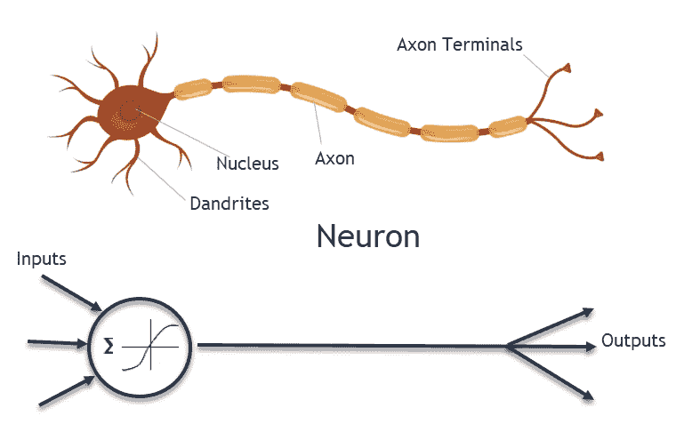

人类和计算机神经元

就像大脑中数十亿个神经元在层中连接一样，我们以类似的方式在层中连接神经元。每个神经元都与层中其他所有神经元的输入和输出相连，其中第一层接收我们的输入，而最后一层或单个神经元输出我们的答案。以下是一个典型的例子：

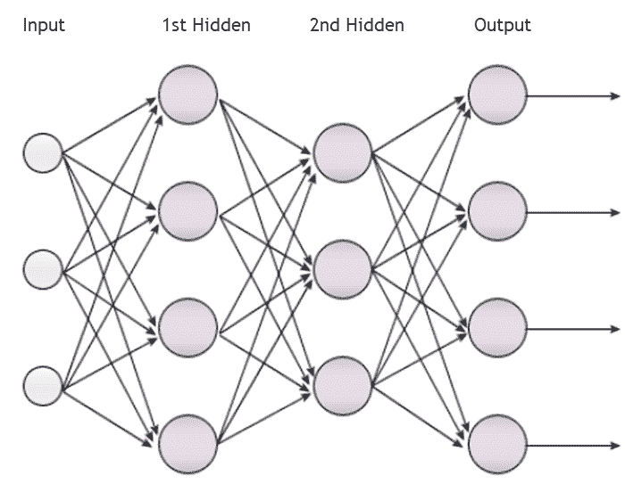

带有层的神经网络

在我们继续之前，我们应该澄清一点，我们讨论的深度学习中的层并不对应于神经网络中的层。将神经网络想象为 DL 系统中的一个层。

在这里，图中的每个圆圈代表一个单独的神经元。每个神经元在其所有输入的总和超过某个阈值或激活函数时都会触发。这个过程会持续对所有神经元进行，最终层输出答案。当然，这是一个非常简单的例子，但直到你开始用它们编程，你很难看到神经网络的威力。因此，在下一节中，我们将编写一个神经网络，我们计划用它来识别环境中的物体。

当你第一次遇到神经网络时，你可能会认为这不可能工作。毕竟，自动驾驶汽车怎么可能只使用一串相互连接的神经元来识别人呢？答案确实如此。我们实际上才开始理解神经网络是如何工作的，而且，我们经常发现我们需要回到起点。在这种情况下，起点是人的大脑，而神经网络的一些最新进展是进一步大脑研究的结果。

# 编程神经网络

学习某事物的最佳方式是去实践，因此在本节中，我们将编写一个简单的神经网络，然后对其进行训练以执行各种任务。这个网络将具有固定数量的层——输入层、隐藏层和输出层——但我们将在每一层中允许设置一定数量的神经元。我们将使用 Unity 编写此代码，以便在第十章，*混合现实*中使用。

编写神经网络是一个高级示例，需要与数学讨论才能正确解释。如果你在任何时候感到不知所措，你总是可以打开完成的项目并检查最终结果。当然，如果你之前已经编写过神经网络，那么你可能也想跳过这一部分。

对于这个例子，我们将从源 Unity 模板创建一个新的项目，所以让我们开始通过打开命令提示符来开始：

1.  使用以下命令在根文件夹（Windows 上的`C:\`）下创建一个名为`ARCore`的新文件夹：

```kt
mkdir ARCore
cd ARCore
```

1.  这组命令创建了一个新文件夹，然后导航到它。

1.  执行以下命令：

```kt
git clone https://github.com/google-ar/arcore-unity-sdk.git ARCoreML
```

1.  这将 Unity ARCore 模板从 GitHub 拖入一个名为`ARCoreML`的新文件夹中。

1.  打开 Unity 的新实例，并在项目页面点击“打开”。这将打开选择项目文件夹对话框。选择您刚刚将模板拖入的新文件夹，`ARCoreML`，以打开项目。等待项目在 Unity 编辑器中打开。

1.  在项目窗口中，右键单击（在 Mac 上按*Ctrl* + 点击）`Assets`文件夹。从上下文菜单中选择创建 | 文件夹。将新文件夹命名为`Scripts`。

1.  通过在项目窗口中双击它，从`Assets/GoogleARCore/Examples/HelloAR`文件夹打开`HelloAR`场景。

1.  从菜单中选择**文件** | **构建设置**。确保 Android 设置为目标平台，并将`HelloAR`场景设置为构建中的场景`0`。

1.  连接您的设备并构建运行。只需确保示例在您的设备上按预期运行。

# 编写神经网络脚本

在新项目设置完成后，我们现在可以开始编写脚本以构建神经网络。回到 Unity 并执行以下步骤：

1.  打开`ARCoreML/Scripts`文件夹，然后从菜单中选择 Assets | Create | C# Script。将脚本命名为`Neuron`，双击以在您选择的编辑器中打开它。

这个示例的代码最初来源于[`github.com/Blueteak/Unity-Neural-Network.git`](https://github.com/Blueteak/Unity-Neural-Network.git)，它展示了为 Unity 开发的一个简单且简洁的神经网络示例，并明确进行了训练。我们将根据我们的需求修改原始代码，但如果您感兴趣，请随意查看并贡献原始源代码。这段代码非常适合学习，但当然，这并不是您可能希望在生产中使用的东西。我们将在 TensorFlow 部分查看生产就绪神经网络的选项。

1.  删除所有代码，留下`using`语句，然后添加以下内容：

```kt
using System.Linq; //add after other using's

public class Neuron
{
  private static readonly System.Random Random = new System.Random();
  public List<Synapse> InputSynapses;
  public List<Synapse> OutputSynapses;
  public double Bias;
  public double BiasDelta;
  public double Gradient;
  public double Value;
}
```

1.  注意这个类没有继承`MonoBehaviour`，因此不会是一个游戏对象，这意味着我们将在这个脚本中加载这个类。然后，我们为`Random`创建一个占位符；我们这样做是因为我们使用的是`System.Random`而不是`Unity.Random`。`Unity.Random`仅支持生成随机`float`，但我们需要`double`的精度。其余的都是我们将随着相关代码部分的出现而讨论的属性。

1.  在最后一个属性声明之后但在类的结束花括号之前输入以下内容：

```kt
public static double GetRandom()
{
 return 2 * Random.NextDouble() - 1;
}
```

1.  我们创建这个`static`辅助方法是为了生成从`-1.0`到`1.0`的`double`随机数。这允许有更高的精度，并确保我们的值总是围绕`0`生成。将值保持在`0`附近可以避免舍入错误，并且通常使计算变得更简单。

1.  接下来，在`static`方法之后输入以下代码：

```kt
public Neuron()
{
  InputSynapses = new List<Synapse>();
  OutputSynapses = new List<Synapse>();
  Bias = GetRandom();
}

public Neuron(IEnumerable<Neuron> inputNeurons) : this()
{
  foreach (var inputNeuron in inputNeurons)
  {
    var synapse = new Synapse(inputNeuron, this);
    inputNeuron.OutputSynapses.Add(synapse);
    InputSynapses.Add(synapse);
  }
}
```

1.  在这里，我们设置了基类构造函数和单个参数构造函数。基类构造函数为神经元的输入和输出连接创建了一个`List<Synapse>`。`Synapse`代表一个连接。另一个构造函数调用基类（`this`）并接受一个`IEnumerable<Neuron>`的神经元，然后将其连接回。这样，网络可以自下而上构建；当我们到达`NeuralNet`类时，我们将看到这是如何工作的。

1.  接下来，我们将添加`Neuron`类的其余方法：

```kt
public virtual double CalculateValue()
{
  return Value = Sigmoid.Output(InputSynapses.Sum(a => a.Weight *  
                                a.InputNeuron.Value) + Bias);
}

public double CalculateError(double target)
{
  return target - Value;
}

public double CalculateGradient(double? target = null)
{
  if (target == null)
    return Gradient = OutputSynapses.Sum(a =>    
    a.OutputNeuron.Gradient * a.Weight) * Sigmoid.Derivative(Value);
    return Gradient = CalculateError(target.Value) * Sigmoid.Derivative(Value);
}

public void UpdateWeights(double learnRate, double momentum)
{
  var prevDelta = BiasDelta;
  BiasDelta = learnRate * Gradient;
  Bias += BiasDelta + momentum * prevDelta;
  foreach (var synapse in InputSynapses)
  {
    prevDelta = synapse.WeightDelta;
    synapse.WeightDelta = learnRate * Gradient * synapse.InputNeuron.Value;
    synapse.Weight += synapse.WeightDelta + momentum * prevDelta;
  }
}
```

1.  我们在这里添加了四个方法：`CalculateValue`、`CalculateError`、`CalculateGradient` 和 `UpdateWeights`。`CalculateValue` 用于根据我们在 `Sigmoid` 中定义的激活函数确定神经元的输出。我们将在稍后介绍 `Sigmoid`。其他方法用于训练神经元。训练神经元是我们将在下一节中介绍的内容。

1.  保持在同一文件中，并在 `Neuron` 类外部添加以下三个新的辅助类：

```kt
} // end of Neuron class definition
public class Synapse
{
  public Neuron InputNeuron;
  public Neuron OutputNeuron;
  public double Weight;
  public double WeightDelta;
  public Synapse(Neuron inputNeuron, Neuron outputNeuron)
  {
    InputNeuron = inputNeuron;
    OutputNeuron = outputNeuron;
    Weight = Neuron.GetRandom();
  }
}

public static class Sigmoid
{
  public static double Output(double x)
  {
    return x < -45.0 ? 0.0 : x > 45.0 ? 1.0 : 1.0 / (1.0 +    
    Mathf.Exp((float)-x));
  }
  public static double Derivative(double x)
  {
    return x * (1 - x);
  }
}
public class DataSet
{
  public double[] Values;
  public double[] Targets;
  public DataSet(double[] values, double[] targets)
  {
    Values = values;
    Targets = targets;
  }
}
```

1.  第一个类 `Synapse`，正如我们已知的，定义了神经元之间的连接。接下来是 `Sigmoid`，它恰好是一个用于我们使用的 sigmoid 激活函数的包装类。注意，值被限制在 `-45.0` 和 `+45.0`。这限制了我们的网络大小，但我们可以手动更改它。然后是 `DataSet`，它只是我们训练数据的持有者。

这样就完成了 `Neuron` 类。在 Unity 中创建另一个脚本，这次命名为 `NeuralNet`；在您选择的编辑器中打开它并执行以下步骤：

1.  再次删除起始代码，但保留 `using` 语句，并输入以下内容：

```kt
public class NeuralNet
{
  public double LearnRate;
  public double Momentum;
  public List<Neuron> InputLayer;
  public List<Neuron> HiddenLayer;
  public List<Neuron> OutputLayer;

}  //be sure to add ending brace
```

1.  再次，这是一组定义 `LearnRate` 网络和 `Momentum` 的公共属性。然后是三个 `List<Neuron>`，用于存储输入、隐藏（中间）和输出层中的神经元集合。在这个例子中，我们使用单个隐藏层，但更复杂的网络通常支持更多层。你可以猜到，`LearnRate` 和 `Momentum` 将在训练部分进行介绍。

我们通常在 Unity 中不倾向于使用带有获取器和设置器的属性。为什么？主要是因为 Unity 编辑器与公共字段配合得更好。其次，游戏编程完全是关于性能的，尽可能避免获取器和设置器的开销是有意义的。使用列表也是不允许的，但在这个情况下，它使得代码更容易理解。

1.  接下来，让我们为我们的 `NeuralNet` 添加一个构造函数：

```kt
public NeuralNet(int inputSize, int hiddenSize, int outputSize, 
              double? learnRate = null, double? momentum = null)
{
  LearnRate = learnRate ?? .4;
  Momentum = momentum ?? .9;
  InputLayer = new List<Neuron>();
  HiddenLayer = new List<Neuron>();
  OutputLayer = new List<Neuron>();
  for (var i = 0; i < inputSize; i++){
    InputLayer.Add(new Neuron());
  }

  for (var i = 0; i < hiddenSize; i++){
    HiddenLayer.Add(new Neuron(InputLayer));
  }

  for (var i = 0; i < outputSize; i++){
    OutputLayer.Add(new Neuron(HiddenLayer));
  }
}
```

1.  此构造函数期望几个输入，包括输入、隐藏和输出层中的神经元数量，以及 `learnRate` 和 `momentum` 的值。在构造函数内部，属性根据输入值进行初始化。注意，第一层使用默认的 `Neuron` 构造函数，而后续层使用带有前一层作为输入的单参数构造函数。记得从构建 `Neuron` 类中，这是添加神经元层之间所有突触连接的地方。

1.  接下来，我们将添加一些用于训练的方法：

```kt
public void Train(List<DataSet> dataSets, int numEpochs)
{
  for (var i = 0; i < numEpochs; i++)
  {
    foreach (var dataSet in dataSets)
    {
      ForwardPropagate(dataSet.Values);
      BackPropagate(dataSet.Targets);
    }
  }
}

public void Train(List<DataSet> dataSets, double minimumError)
{
  var error = 1.0;
  var numEpochs = 0;
  while (error > minimumError && numEpochs < int.MaxValue)
  {
    var errors = new List<double>();
    foreach (var dataSet in dataSets)
    {
      ForwardPropagate(dataSet.Values);
      BackPropagate(dataSet.Targets);
      errors.Add(CalculateError(dataSet.Targets));
    }
    error = errors.Average();
    numEpochs++;
  }
}
```

1.  然后，我们将添加方法来正向和反向传播网络：

```kt
private void ForwardPropagate(params double[] inputs)
{
  var i = 0;
  InputLayer.ForEach(a => a.Value = inputs[i++]);
  HiddenLayer.ForEach(a => a.CalculateValue());
  OutputLayer.ForEach(a => a.CalculateValue());
}

private void BackPropagate(params double[] targets)
{
  var i = 0;
  OutputLayer.ForEach(a => a.CalculateGradient(targets[i++]));
  HiddenLayer.ForEach(a => a.CalculateGradient());
  HiddenLayer.ForEach(a => a.UpdateWeights(LearnRate, Momentum));
  OutputLayer.ForEach(a => a.UpdateWeights(LearnRate, Momentum));
}
```

1.  最后，添加以下方法来计算整个网络和计算错误：

```kt
public double[] Compute(params double[] inputs)
{
  ForwardPropagate(inputs);
  return OutputLayer.Select(a => a.Value).ToArray();
}

private double CalculateError(params double[] targets)
{
  var i = 0;
  return OutputLayer.Sum(a => Mathf.Abs((float)a.CalculateError(targets[i++])));
}
```

这样就完成了神经网络代码。我们在下一节关于训练神经网络的训练部分留下了许多讨论区域。

# 训练神经网络

如您可能已经总结的那样，神经网络在训练之前基本上是无用的。在我们开始训练之前，我们应该更多地讨论一下神经元是如何被激活的。再次打开 `Neuron` 类，并查看 `CalculateValue` 函数。此方法根据其内部设置的权重计算输出，如下所述：

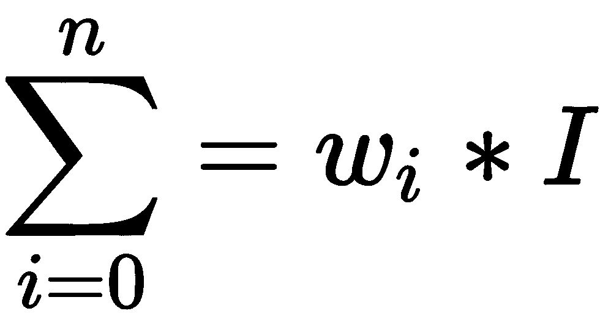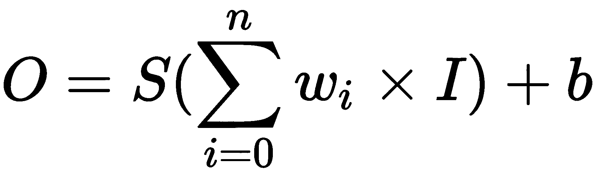

这里：

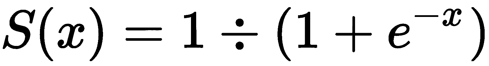

同时，请注意以下几点：

*n* = 作为输入连接的总神经元数

*I* = 传递给 `Neuron` 类的信号输入

*O* = 计算的输出

*S* = 具有如下图的 `sigmoid` 函数：

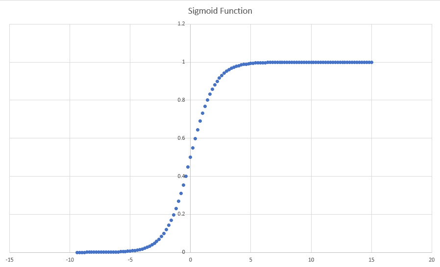

Sigmoid 函数

**Sigmoid 函数**基本上根据类似于前述图表的曲线（函数）在 0 和 1 之间分配值的加权总和。我们这样做是为了使每个神经元的输出均匀加权。同样，当我们考虑将输入数据输入到网络中时，我们也希望将值规范化到 0 和 1 之间。如果我们不这样做，单个神经元或输入可能会偏置我们的整个网络。这就像用锤子敲你的大拇指，接下来的几秒钟内只能感觉到大拇指的疼痛，但我们不希望我们的网络对这种野外的输入做出反应。相反，我们希望用 `sigmoid` 函数来平缓我们的网络。

# 激活警告

让我们进一步推迟对训练的讨论，并准备一个简单的例子来看看它是如何工作的。再次打开 Unity 并执行以下步骤：

1.  在 `Assets/ARCoreML/Scripts` 文件夹中创建一个新的 C# 脚本，名为 `EnvironmentScanner`。然后，在您的编辑器中打开该脚本。

1.  将如下所示的代码添加到类定义中：

```kt
[RequireComponent(typeof(AudioSource))]
public class EnvironmentalScanner : MonoBehaviour  //before me
```

1.  `RequireComponent` 是一个自定义的 Unity 属性，它强制一个 `GameObject` 在添加此组件之前需要特定的类。在这个例子中，我们需要一个 `AudioSource` 组件。

1.  将以下新的属性/字段和方法添加到类中；不要删除任何内容：

```kt
public NeuralNet net;
public List<DataSet> dataSets;

private float min = float.MaxValue;
private float maxRange = float.MinValue;
private float[] inputs;
private double[] output;
private double temp;
private bool warning;
private AudioSource audioSource;
private double lastTimestamp;

public void Awake()
{ 
    int numInputs, numHiddenLayers, numOutputs;
    numInputs = 1; numHiddenLayers = 4; numOutputs = 1;
    net = new NeuralNet(numInputs, numHiddenLayers, numOutputs);
    dataSets = new List<DataSet>();
}
```

1.  在 Unity 中，`Awake` 方法是特殊的，因为它在对象首次唤醒或变为活动状态时被调用。`Awake` 与 `Start` 的不同之处在于它在对象的初始化时被调用，而 `Start` 在对象渲染第一帧之前被调用。这种差异很微妙，通常只有在您担心对象加载时间时才相关。

    接下来，我们创建了一些临时输入变量来设置 **输入**、**隐藏**和**输出**神经元的数量。在这个例子中，我们将使用一个输入、四个隐藏和一个输出。这些输入用于在下一行创建 `NeuralNet`，随后初始化 `dataSets` 列表。

1.  接下来，让我们修改 `Start` 方法，使其类似于以下内容：

```kt
void Start()
{ 
  dataSets.Add(new DataSet(new double[]{ 1,.1,0.0}, new double[] { 0.0,1.0,1.0 } ));
  net.Train(dataSets, .001);
  audioSource = GetComponent<AudioSource>();
}
```

1.  `Start`内部的第一行创建了一个非常简单的`DataSet`，具有输入和输出。由于我们使用单个输入和输出神经元，这些输入和输出映射 1 到 1，因此产生以下图表：

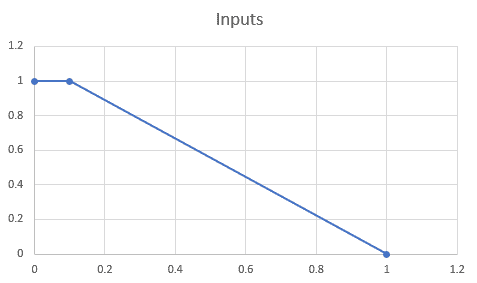

训练输入图表

1.  然后，`net.Train`使用最小误差`.001`训练神经网络。之后，它获取所需的`AudioSource`，记住`RequireComponent`属性，并将其设置为私有的`audioSource`字段。我们将使用声音来警告用户当他们太靠近时。考虑一下这些点作为函数描述的是什么。

1.  最后，修改`Update`方法以包含以下内容：

```kt
void Update()
{
  if (warning)
  { 
    audioSource.Play();
  }
  else
  {
    audioSource.Stop();
  }
  // Do not update if ARCore is not tracking.
  if (Frame.TrackingState != FrameTrackingState.Tracking)
  {
    return;
  }

  min = float.MaxValue; 
  PointCloud pointCloud = Frame.PointCloud;
  if (pointCloud.PointCount > 0 && pointCloud.Timestamp > lastTimestamp)
  {
  lastTimestamp = pointCloud.Timestamp;
  //find min
    for (int i = 0; i < pointCloud.PointCount; i++)
    {
      var rng = Mathf.Clamp01((pointCloud.GetPoint(i)- transform.parent.parent.transform.position).magnitude);
      min = Mathf.Min(rng, min);
    }

    //compute output
    output = net.Compute(new double[] { (double)min });
    if(output.Length > 0)
    {       
      warning = output[0] > .001;
    }
    else
    {
      warning = false;
    }
  }  
}
```

1.  这里有很多事情在进行中，所以让我们分解一下。我们首先检查`warning`是否为`true`。如果是，我们播放声音，否则我们停止播放；`warning`将是我们表示神经网络发出信号的标志。接下来，我们确保`Frame`正在跟踪，使用与之前看到的相同的代码。然后，我们重置`min`并从`Frame`获取当前点云。

    之后，我们确保`pointCloud`有点，并且是最新的。这是通过测试时间戳来检查的。然后，在`if`块内部，我们通过遍历所有点来计算当前的`min`。然后，我们通过`net.Compute`将这个值（最小点）推送到我们的神经网络中，这返回我们的信号或神经元输出。在这种情况下，我们正在测试`.001`以确定神经元是否发出激活信号。这会将警告设置为`true`或`false`。

1.  保存代码并返回 Unity；确保您没有看到编译错误。

# 添加环境扫描器

现在我们有一个使用该组件的脚本，让我们将其添加到场景中作为一个新对象。返回到我们上次离开的编辑器，并继续以下步骤：

1.  打开`HelloAR`场景。从菜单中选择文件 | 保存为，并将场景保存为`Main`在`Assets/ARCoreML`文件夹中。

1.  在层次结构窗口中找到并选择第一人称摄像机。请记住，您可以使用搜索面板。

1.  右键单击（*Ctrl* + 点击 Mac）第一人称摄像机，并从上下文菜单中选择创建空对象。将对象命名为`Environmental Scanner`。

1.  选择新对象，在`Inspector`窗口中添加一个新的`AudioSource`组件。

1.  在项目窗口中，在`Assets/ARCoreML`路径下创建一个新的文件夹，命名为`Audio`。

1.  从下载的代码文件夹中打开`Resources`文件夹，并将`tone-beep.wav`文件复制到您刚刚创建的`Assets/ARCoreML/Audio`文件夹中。

1.  在`Inspector`窗口中打开`Environmental Scanner`对象，并设置`AudioSource`属性，如图所示：

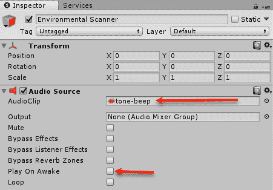

在`Inspector`中设置`AudioSource`属性

1.  在`Inspector`窗口中选中`Environmental Scanner`，然后点击添加组件按钮。添加我们之前编写的`Environmental Scanner`脚本。

1.  打开构建设置对话框，确保将当前场景（`Main`）添加到构建中。确保从构建中删除任何其他场景。

1.  连接、构建和运行。在房间内移动。那么，当您接近物体时会发生什么？在什么距离？

很好，所以我们已经有效地创建了一个备份或警告蜂鸣器，以便在您接近物体时通知您。显然，我们也可以简单地编写一个简单的阈值测试来测试当`min`接近时的情况。然而，这个简单的例子为我们理解训练工作提供了一个良好的基础。

# 反向传播解释

在这个例子中，我们正在对模型（监督学习）进行预训练，使其执行一个简单的函数，该函数由一系列输入（1.0, 0.1, 0）和预期的输出（0, 1.0, 1.0）描述，这在我们之前看到的图表/图中表示。本质上，我们希望我们的神经网络能够学习由这些点定义的函数，并能够输出这些结果。我们通过调用`net.Train`，传入`datasets`和最小预期误差来实现这一点。这样，网络通过反向传播错误通过网络中的每个神经元来训练，直到达到最小误差。然后，训练停止，网络声明自己已准备好。

反向传播使用一个简单的迭代优化算法，称为**梯度下降**，它使用最小误差来最小化每个神经元的输入权重，以便达到全局最小误差。为了完全理解这一点，我们需要进入一些微分学和导数的知识。相反，我们将走捷径，只看看`NeuralNet`类的`Train`方法中的代码在做什么：

```kt
public void Train(List<DataSet> dataSets, double minimumError)
{
  var error = 1.0;
  var numEpochs = 0;
  while (error > minimumError && numEpochs < int.MaxValue)
  { 
    var errors = new List<double>();
    foreach (var dataSet in dataSets)
    {
      ForwardPropagate(dataSet.Values);
      BackPropagate(dataSet.Targets);
      errors.Add(CalculateError(dataSet.Targets));
    }
    error = errors.Average();
    numEpochs++;
  }
}
```

这里的代码相对简单。我们设置了一个`error`和`numEpochs`。然后，我们启动一个`while`循环，该循环在`error`大于`minimumError`（全局）并且`numEpochs`小于最大`int`值时结束。在循环内部，我们遍历`dataSets`中的每个`dataSet`。首先，使用`ForwardPropagate`对数据集值的输入进行操作以确定输出。然后，使用`BackPropagate`对数据集的目标值进行调整，使用梯度下降法调整每个神经元的权重。让我们看看`BackPropagate`方法内部的情况：

```kt
private void BackPropagate(params double[] targets)
{
    var i = 0;
    OutputLayer.ForEach(a => a.CalculateGradient(targets[i++]));
    HiddenLayer.ForEach(a => a.CalculateGradient());
    HiddenLayer.ForEach(a => a.UpdateWeights(LearnRate, Momentum));
    OutputLayer.ForEach(a => a.UpdateWeights(LearnRate, Momentum));
}
```

这个方法优雅地使用`System.Linq`中的`ForEach`遍历每个神经元层。首先，它计算输出和隐藏层的梯度，然后以相反的顺序调整权重：首先是隐藏层，然后是输出层。接下来，我们将剖析`CalculateGradient`方法：

```kt
public double CalculateGradient(double? target = null)
{
  if (target == null)
    return Gradient = OutputSynapses.Sum(a => a.OutputNeuron.Gradient * a.Weight) * Sigmoid.Derivative(Value);

  return Gradient = CalculateError(target.Value) * Sigmoid.Derivative(Value);
}
```

我们可以看到`CalculateGradient`方法接受一个名为`target`的可空`double`。如果`target`为`null`，则通过将先前梯度乘以输入权重来计算`Gradient`。否则，`Gradient`通过将误差乘以`Sigmoid`的导数来计算。记住，sigmoid 是我们的激活函数，这基本上是我们试图最小化的。如果你从微积分中回忆起来，我们可以通过对函数求导来确定其最小值或最大值。实际上，为了使用梯度下降法进行反向传播，你的激活函数必须是可导的。

# 梯度下降法解释

梯度下降法使用损失或误差函数的偏导数来将更新传播回神经元权重。在这个例子中，我们的成本函数是 Sigmoid 函数，这与我们的激活函数相关。为了找到输出神经元的梯度，我们需要对 Sigmoid 函数求偏导数。以下图表显示了梯度下降法如何沿着导数下降以找到最小值：

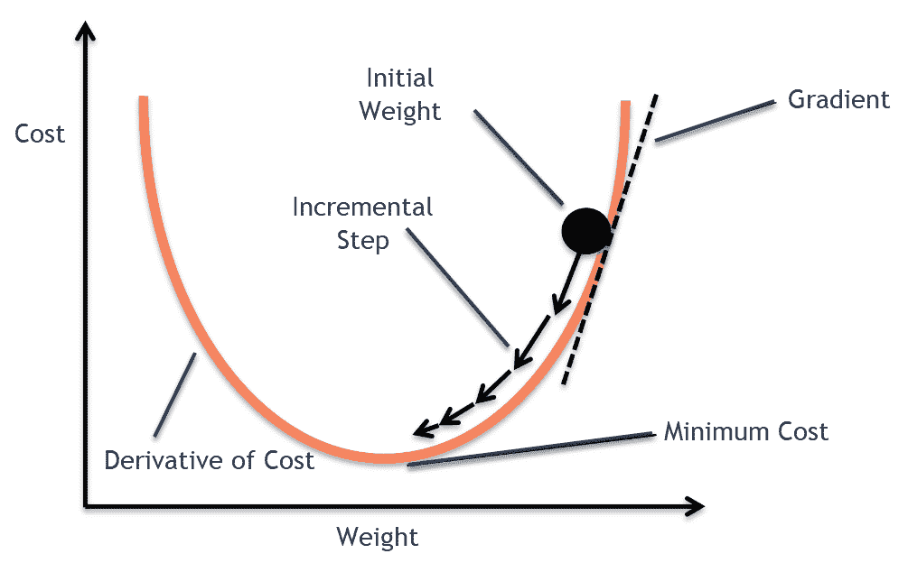

梯度下降算法可视化

如果你计划花更多时间学习神经网络、深度学习或机器学习，你肯定会更深入地学习梯度下降和反向传播的数学。然而，你不太可能进一步接触到编程神经网络的基礎概念，因此这一章将是一个很好的未来参考。

让我们看看`CalculateError`函数，它简单地从神经元的输出值中减去其应有的值：

```kt
public double CalculateError(double target)
{
    return target - Value;
}
```

然后，滚动到以下代码中的`UpdateWeights`方法：

```kt
public void UpdateWeights(double learnRate, double momentum)
{
    var prevDelta = BiasDelta;
    BiasDelta = learnRate * Gradient;
    Bias += BiasDelta + momentum * prevDelta;

    foreach (var synapse in InputSynapses)
    {
        prevDelta = synapse.WeightDelta;
        synapse.WeightDelta = learnRate * Gradient *         
                               synapse.InputNeuron.Value;
        synapse.Weight += synapse.WeightDelta + momentum * prevDelta;
    }
}
```

`UpdateWeights`随后根据`learnRate`和`momentum`调整每个神经元的权重；`learnRate`和`momentum`设置了神经网络学习的速度。我们通常希望控制算法的学习率，以防止过拟合和陷入局部最小值或最大值。之后，代码相对简单，它通过循环突触连接并使用新值更新权重。`Bias`用于控制 Sigmoid 激活函数的截距，从而允许神经元调整其初始激活函数。我们可以在以下图表中看到`Bias`如何改变激活函数：

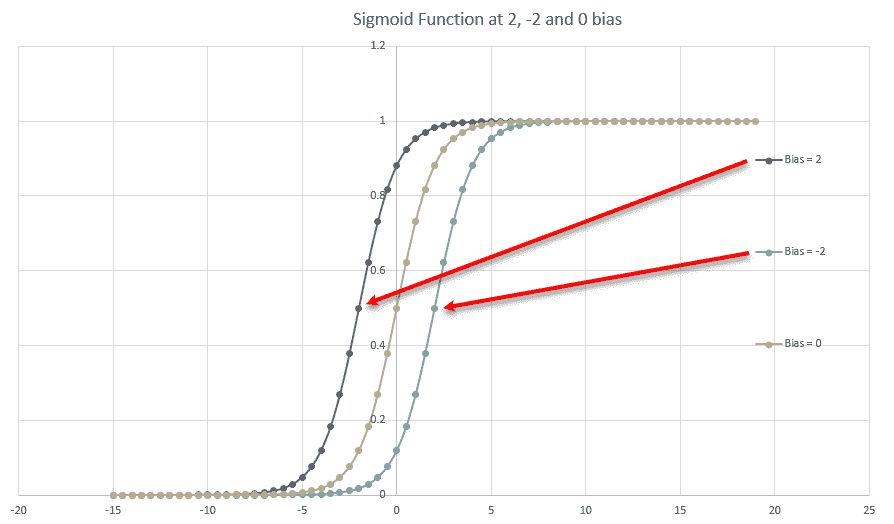

偏置对 Sigmoid 激活函数的影响

调整`Bias`允许神经元在除了 0 以外的值开始放电或激活，如前图所示。因此，如果`Bias`的值为 2，那么神经元将在-2 处开始激活，如图所示。

# 定义网络架构

我们刚刚学习了如何编写和使用一个简单的神经网络来警告用户当他们离物体太近时。当你查看代码时，请注意，这些值中的大多数都是在训练过程中内部调整的。在使用神经网络时，理解这些基本原理非常重要：

+   **激活函数**: 如果你没有使用 sigmoid 函数，那么你还需要找到你的激活函数的偏导数，以便在使用反向传播时使用梯度下降。

+   **# 输入神经元**: 这不仅会设置网络的复杂性，还会确定隐藏或中间层的神经元数量。

+   **# 输出神经元**: 你需要你的网络有多少个输出或分类方式？

+   **# 隐藏层/神经元**: 作为一条好的经验法则，你希望使用输入和输出神经元的平均值，或者就是 *输入+输出/2*。我们将在下一个示例中应用这个规则。

+   **训练方法**: 我们的神经网络支持两种训练方法：最小误差或按 epoch 或迭代次数。我们更倾向于使用最小误差，因为这能更好地量化我们的模型。

本章源代码下载中包含了一个工作示例，在资产包中展示了我们的简单神经网络被用作环境或对象识别器。回到 Unity，执行以下步骤来设置此示例：

在开始之前，请确保保存你的现有项目或下载一个新的 ARCore 模板。资产导入将覆盖你的现有文件，所以如果你想在继续之前保留任何早期工作，你应该先进行备份。

1.  从菜单中选择“Assets | 导入包 | 自定义包”。使用文件对话框导航到书籍下载源代码的`Code/Chapter_8`文件夹，并导入`Chapter_8_Final.unitypackage`。

1.  从`Assets/ARCoreML`文件夹中打开主场景。

1.  打开构建设置对话框，确保主场景被添加到构建中并且是激活的。

1.  连接、构建和运行。现在当你运行应用时，你将在界面顶部看到两个按钮：一个写着“训练 0”，另一个写着“训练 1”。

1.  将你的设备对准你希望神经网络识别的区域。确保 ARCore 正在屏幕上识别大量的蓝色点，然后按下“训练 1”按钮；这将向网络发出信号，表明你希望它识别这个特征集。

1.  将设备对准你不想神经网络识别的区域，并按下“训练 0”按钮；这将向网络强化你不想它识别这个区域。

1.  在原地保持不动，继续这个过程。将你的设备对准你希望重复识别的区域，并按下“训练 1”按钮。同样，对于你不想识别的区域，也这样做，但确保按下“训练 0”按钮。训练大约 10 次后，你应该开始听到警告蜂鸣声，这表明神经网络已经识别了你的区域。

1.  如果你开始听到警告音，那将是一个指标，表明你的神经网络（NN）开始学习。继续在那个地方旋转，训练网络，确保通过按下适当的按钮来纠正网络。你可能需要做几次（可能是 20 到 50 次左右）才能注意到 NN 识别了你想要区域。

确保在训练网络时，你能看到很多蓝色点。如果你看不到任何点，你实际上就是在用空数据训练。

1.  最后，当你的网络完全训练完成后，你应该能够慢慢地绕着房间转一圈，并听到当你的设备识别到你选择区域时。

使用我们简单的神经网络（NN），我们能够构建一个对象/特征识别器，可以训练它识别特定的特征、地点或对象。这个例子相当简单，并不非常稳健或准确。然而，考虑到有限的训练数据集，它能够很好地在实时识别特征。打开`环境扫描器`脚本，我们将看看网络是如何配置的：

1.  滚动到`唤醒`方法，看看网络是如何创建的：

```kt
public void Awake()
{ 
  int numInputs, numHiddenLayers, numOutputs;
  numInputs = 25; numHiddenLayers = 13; numOutputs = 1;
  net = new NeuralNet(numInputs, numHiddenLayers, numOutputs);
  dataSets = new List<DataSet>();
  normInputs = new double[numInputs];
}
```

1.  注意这次我们创建了一个包含`25`个神经元的输入层和`1`个输出。如果我们坚持我们的隐藏层是输入和输出的平均值的通用规则，那么这就等于`13`个神经元（`（25+1）/2=13`）。

1.  我们从`Start`方法中移除了初始的 NN 设置和训练，并将其移动到新的`Train`方法底部：

```kt
private void Train()
{ 
  net.Train(dataSets, 100);
  trained = dataSets.Count > 10;
}
```

1.  这次，我们使用了一种不同的训练形式，称为**时代**。当我们不确定预期的误差是什么，或者它需要改变，就像在这个例子中一样，我们会使用这种训练形式。想想看——当我们用一个非常有限的数据集开始训练我们的网络时，由于我们的数据不足，我们的错误率会很高。这意味着我们永远无法将我们的网络训练到最小误差。因此，对于每个训练周期，只运行我们的训练算法一定数量的迭代或时代似乎更有意义。

1.  在`Train`方法之前是`TrainNetwork`，如下所示：

```kt
public void TrainNetwork(float expected)
{
  this.expected = expected;
  training = true;
}
```

1.  `TrainNetwork`是一个公共方法，我们用它来向`环境扫描器`发出信号，以启动一个具有预期结果的训练周期。这允许我们在 UI 按钮上设置事件处理器，以调用此方法并传递预期值。当你按下“训练 0”按钮时，`TrainNetwork`会传递`0.0`，而在按下“训练 1”按钮后，会传递`1.0`。

1.  滚动到`更新`方法，看看以下代码段：

```kt
if (training)
{ 
  dataSets.Add(new DataSet(normInputs, new double[] { expected }));
  training = false;
  Train();
}
```

1.  这是检查`训练`标志的代码块。如果它被设置，它会收集归一化的输入并将它们添加到`dataSets`中，并带有预期的结果。然后我们关闭标志并调用`Train`。

1.  滚动到上面的代码块，你可以看到我们是如何对训练`输入`进行归一化的：

```kt
for (int i = 0; i < normInputs.Length; i++)
{
  if (i < pointCloud.PointCount)
  {
    //normalize the inputs
    normInputs[i] = inputs[i] / max;
  }
  else
  {
    normInputs[i] = 0;
  }
}
```

1.  在这里，我们正在归一化`inputs`。一个`input`代表一个识别点与相机（用户）之间的距离或大小。归一化是将您的数据缩放到`0`到`1`范围内的值。在这种情况下，我们通过找到每个点的最大距离，然后使用它来除以所有其他输入来实现这一点。循环中的测试是为了确保我们始终为每个输入神经元设置一个值。

其余的代码与我们之前写的类似，不值得再次讨论。

# 网络视图的世界

那么，这里到底发生了什么，网络到底在识别什么？本质上，我们正在将我们对世界的 3D 视图展平成 2D 线或曲线。以下是如何看起来归一化的典型示例：

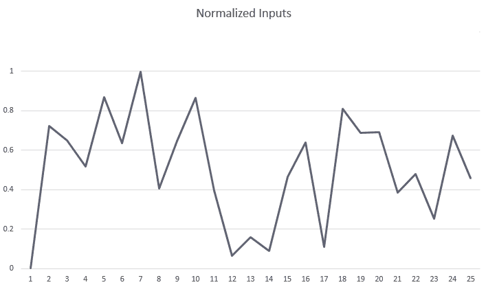

归一化输入点

这些输入代表了神经网络正在训练或可能对抗的归一化视图。如果您训练网络识别那条线，那么当它检测到那条线时，警告声音应该响起。当然，您添加的点越多，您的识别器可能工作得越好，也可能不会。我们将把它留给您自己进一步测试网络。

神经网络在 1990 年代末和 2000 年代初非常受游戏和图形开发者的欢迎。神经网络在各种 AI 场景中取得了一些成功，尤其是在驱动游戏方面，但最终，其他专门设计的技巧胜出，即直到最近，随着卷积神经网络等新技术的出现。这些新的成功导致了深度学习技术和平台的大幅增长。

这个简单的神经网络可以扩展以识别您想要的其他简单函数或模式。然而，如果我们尝试将其用于我们之前确定为 AR 关键的其他任何识别任务，它将表现得很差。因此，在下一节中，我们将探讨如何使用谷歌开发的新平台 TensorFlow 来解决我们的识别问题。

# 练习

独立完成以下练习：

1.  解释无监督学习、监督学习和强化学习之间的区别。这更多的是一种思维练习，但真正理解这些区别将是有益的。

1.  修改原始神经网络示例，当检测到超过一定距离的物体时发出警告。

1.  在第二个示例中，如果您按长度对输入进行排序会发生什么？它仍然有效吗？

1.  在第二个示例中，向网络添加一个额外的输出神经元。您还需要一个新的训练按钮，并需要修改`TrainNetwork`函数以接受两个`inputs`。

# TensorFlow

在机器学习领域，有一个新出现的名字叫做 **TensorFlow**，它也是由 Google 开发的，正在掀起一股令人印象深刻的浪潮。TensorFlow 是一个完整的机器学习平台，实际上它不仅仅是一个带有大量内置工具的执行引擎。更令人印象深刻的是，你可以在离线状态下使用大规模数据集训练高级神经网络、卷积神经网络、胶囊网络或你需要的一切。然后，你将这些训练好的网络放在一个称为 **MobileNet** 的移动设备上，以便快速识别和分类复杂对象。在本节中，我们将暂时放下 ARCore，来看看即将到来的 TensorFlow 的强大功能。

TensorFlow 是一个高级的机器学习资源库和工具包，值得你花时间去学习，了解你是否需要进行任何高级的识别任务。然而，请记住，这个工具需要你在数学方面有高级知识，并且对 Python 有实际的操作经验。

我们将运行 TensorFlow 的 Android 示例，不仅是为了了解工具的强大功能，也是为了理解可能实现的内容。尽管 Google 正在构建 TensorFlow 和 ARCore，但我们只能假设未来将构建新的集成工具。然而，目前，让我们打开命令提示符或 shell 并开始吧：

1.  从你的用户文件夹或根目录运行以下命令：

```kt
mkdir TensorFlow
cd TensorFlow
```

1.  创建 `TensorFlow` 目录并导航到它。然后，输入以下命令：

```kt
git clone https://github.com/tensorflow/tensorflow
```

1.  打开 Android Studio。从欢迎界面，选择“打开现有的 Android Studio 项目”。

1.  使用对话框导航到，选择 `TensorFlow/tensorflow/examples/android` 文件夹，然后点击“确定”。

1.  如果提示你进行 Gradle 同步，请点击“确定”。

1.  从项目侧面板下的 Gradle 脚本中打开 `build.gradle` 文件，并将 `nativeBuildSystem` 变量设置为 `none`，如图所示：

```kt
def nativeBuildSystem = 'none'
```

1.  连接你的设备并点击运行按钮，顶部的绿色箭头图标。遵循任何必要的构建步骤，并让应用推送到你的设备。

1.  构建完成后，Studio 将推送四个应用到你的设备：**TFClassify**、**TFDetect**、**TFSpeech** 和 **TFStylize**。尝试每个示例，并观察一些在设备上运行的网络的强大功能。

以下是一个 TFDetect 应用运行并非常准确地分类狗和人的示例：

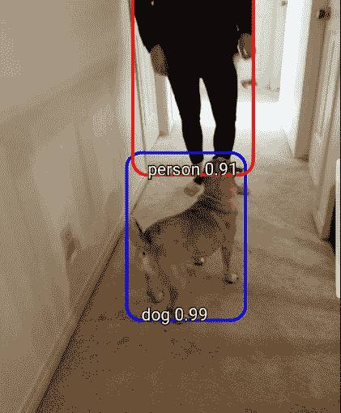

TFDetect 正确分类狗和人的功能

很遗憾，运行 TensorFlow 与 ARCore 需要的组件尚未完全准备好，因此在撰写本文时，我们无法完成一个完整的示例。然而，AR 应用程序的机器学习未来无疑将与 TensorFlow 或其他第三方解决方案相结合，在 TensorFlow 的基础上进行。谷歌在人工智能/机器学习领域拥有多年的经验，从开发自动驾驶汽车到 Google Home。它将这些年的知识融入 TensorFlow，使其对全世界开放。如果你计划构建自己的机器学习对象/特征识别，不花时间学习 TensorFlow 算是愚蠢之举。

我们计划构建一个在 ARCore 中运行的经过训练的 MobileNet 的示例。遗憾的是，组件尚未完全准备好，这导致了一个过于复杂的示例。大约在本书出版时，我们可能会看到更多工具的开发，以使将 TensorFlow 集成到 ARCore 中变得更加容易。

# 摘要

在本章中，我们深入探讨了机器学习的深层次——或者说深度学习的深层次——领域。我们首先讨论了机器学习的重要性以及我们可以在 AR 中使用它的应用。然后，我们探讨了机器学习如何通过无监督学习、监督学习和强化学习等不同学习方法来教授机器学习代理进行学习。接着，我们查看了一个特定的学习机器学习算法的例子，称为神经网络，通常被称为深度学习。这引导我们构建了一个简单的神经网络，你也可以用它来自己学习神经网络的复杂性。神经网络非常复杂，不太直观，因此了解它们的基本结构非常重要。然后，我们在一个非常简单的数据集上训练了这个网络，以通知用户他们是否离物体太近。这进一步讨论了神经网络如何使用梯度下降算法进行反向传播训练。之后，我们查看了一个增强的例子，它允许你训练网络来识别区域或对象。最后，我们探讨了当前机器学习的王者 TensorFlow，并查看了一个快速示例，展示了可能性和即将到来的是什么。

在下一章中，我们将回到使用 ARCore 构建实际示例。我们将构建一个简单的设计应用程序，让用户能够虚拟装饰他们的生活空间。
