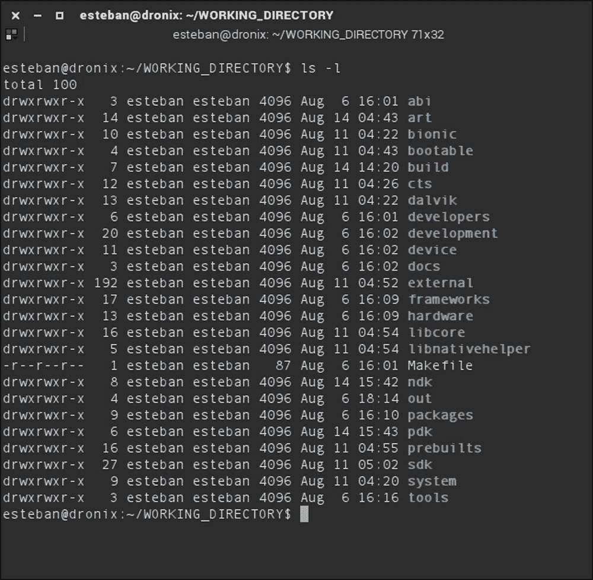

# 第二章\. 获取源代码 – 结构和哲学

在上一章中，我们概述了基于系统层的架构，并有了我们的第一次实际操作体验，使用 CTS 工具套件测试了一个真实世界的设备。

在本章中，用户将了解 Android 和谷歌开发模型背后的哲学。我们将展示源代码的组织方式，主要分支是什么，以及工作流程是什么。我们将创建一个逐步的旅程，以检索**Android 开源项目**（**AOSP**）的源代码，并通过安装所有必需的工具来准备环境。

用户将学习如何为 Android 开源项目做出贡献，如何使用诸如`git`、版本控制系统和`repo`、仓库管理器等工具。

为了完成本章，我们将深入研究 AOSP 文件夹结构，分析创建世界上最受欢迎的移动操作系统的最重要的组件。

## Android 的哲学

Android 是一个开源平台，旨在与大量不同的设备兼容，从硬件角度来看，到用途角度来看。主要目标是提供一个免费可用的软件平台，供大型企业公司和小型独立制造商甚至单个开发者使用。Android 旨在提供一个简单的方法来创建创新解决方案，并轻松地将它们推向市场。

一切始于 2005 年，当时谷歌收购了 Android Inc.，这是一家小型公司，正在为移动设备开发操作系统。几年后，开放手机联盟诞生了。2007 年，包括移动运营商、手机制造商、半导体和软件公司在内的 84 家公司公开宣布了他们全新的、即将推出的移动操作系统。

在接下来的整整一年里，该项目一直保密。谷歌努力将项目带到 1.0 版本，并于 2008 年将 Android 展示给了世界。在接下来的七年里，系统发布了四个主要版本。以下表格讲述了所有 Android 版本的年代顺序历史。每个版本都作为开源软件发布给了世界。每个版本，除了`Honeycomb`，这对谷歌来说是一次丑陋的公关失误，谷歌花费了大量精力来降低其影响，并尽快用`Ice Cream Sandwich`来替代它：


### 许可证

创建一个开源平台引发了一些关于哪种许可证能在保护和自由之间达到完美平衡的担忧。目标是给制造商足够的自由来调整系统以适应他们自己的硬件，同时不必担心暗箱操作许可证，试图窃取他们的知识产权。为了达到这个目标，谷歌选择了当时最著名的开源许可证之一，并将其应用于操作系统的绝大部分。

谷歌用来保护安卓开源项目（AOSP）的许可证是 Apache 软件许可证，版本 2.0，也称为 Apache 2.0，它涵盖了发布到 AOSP 的几乎所有代码行。Apache 2 许可证不适用于一个大型系统组件——内核。Linux 内核受 GNU 公共许可证 V2 保护，并附带一个*系统例外*，以便能够与 Android 一起分发。

作为开源且易于适应流行硬件，它以火箭般的速度将 Android 推向了移动市场的顶端，全球拥有超过一亿活跃设备，在 Google Play Store 上有超过一百万个应用程序可用。一亿活跃设备是获胜策略的结果——为制造商提供易于集成和定制的软件解决方案，免费且社区支持，在一个由苹果主导的市场中。

### 开源，闭源

仔细观察项目，可以看出 Android 与其他开源项目略有不同：Android 是在闭门中由谷歌开发的。社区中很多人不同意将 Android 视为像 Linux 那样开放的。事实上，这两种方法完全不同。是的，它们都有开源许可证，但 Linux 是一个社区开发的项目，而 Android 则完全由谷歌开发。

每次技术讨论、每个决定、每个路线图步骤都是由谷歌做出的。当开发周期完成后，谷歌发布操作系统的最新版本，更新公共源代码仓库，任何人都可以下载操作系统的最新版本。

当然，有用于讨论和支持的电子邮件列表，也有几种方式可以贡献到项目中，但所有决定都由 Android 开发团队做出。

### Android 开发模型

为了确保 Android 当前版本的稳定性，谷歌将源代码保持在*代码行*中。这种方法提供了一个适当的机制，将当前稳定版本（可在所有最新设备上使用）与当前正在开发的不稳定版本分开。正如你可能容易注意到的那样，谷歌在 Android 的命名惯例上与开源项目的通常命名法不同——使用`code line`而不是`branch`，因为单个`code line`可以基于多个 git `branches`。

以下图表展示了源代码历史随时间演变的过程，通过不同的分支和版本：


上一张图表显示了左侧的主要`public branch`，即上游分支。这个分支是主要的公共开发分支，其中不断发布所有关键的错误修复，并且在这里进行所有关于新设备和新技术的主要实验。每个开发人员或制造商都可以获取这一套源代码，并开始创建他们自己的 Android 设备。

在图表的右侧，我们可以看到谷歌的私有分支。这个分支包含 Android 的“下一个版本”。通常，所有开发工作都是由谷歌自己完成的，并得到一个硬件合作伙伴的支持，该合作伙伴提供参考设备。通常，这个设备是一个高端、顶级设备，谷歌将其指定为谷歌的下一个参考设备，也称为 Nexus。每个新的 Nexus 都是根据谷歌 Android 的发展路线图来选择的——每个技术硬件规范都支持或反对特定的软件开发，以创造设备和操作系统之间的完美共生。

当内部开发达到期望的稳定点时，新版本就会被发布，每个分支都会相应更新，然后开始新一轮的公开/私有开发周期。

### 源代码标签和构建

为了有效地引用特定的 Android 版本，自 Android 1.5 以来，每个公开版本都附带了一个花哨的代号、一个版本号和一个更面向开发者的 API 级别。

下表展示了代号/版本/API 级别之间的对应关系并不总是一对一的关系。大多数情况下，代号的寿命周期比版本号长：


### Nexus

Nexus 系列包含了谷歌设计、生产和销售的 Android 设备，这得益于其硬件制造商合作伙伴的帮助。

Nexus 系列的一个独特之处在于它为设备配备的裸 Android 系统——无论是制造商还是电话运营商都没有进行任何定制。系统基于纯 Android 源代码，为用户提供最纯粹的 Android 体验。作为一个高级提示，设备的引导加载程序可以轻松且合法地解锁，以允许任何专家用户可能希望进行的修改。在安全性方面，Nexus 设备是首先接收安全修复和系统更新的设备——保持更新，保持安全！

Nexus 系列在数量和质量上持续增长，现在它包含了智能手机、平板电脑，甚至数字播放器。下表展示了目前所有可用的型号概览。

#### 手机

这里是所有标准 Nexus 手机的列表：


#### 平板电脑

这里是所有标准 Nexus 平板电脑的列表：


#### 数字媒体播放器

这里是所有标准 Nexus 数字媒体播放器的列表：


表中的每一款设备都有其自己的 Android 构建版本，专门针对其硬件和用途进行定制。下表是谷歌为所有想要手动更换操作系统并希望获取官方构建版本的专家级 Android 用户提供的构建代号和版本示例：


每个构建都有一个`build-code`来标识，例如，LMY470。第一个字母是代码名的首字母，例如，*L*ollipop；第二个字母标识用于生成此构建的分支；接下来的两个字母标识发布日期，基于季度表示法——A 是 2009 年 Q1，F 是 2010 年 Q2，以此类推。季度字母后面的两个数字指定发布日。最后一个字母标识构建号。这种表示法并不非常精确。谷歌经常为多个构建重复使用相同的构建代码。我们需要将其视为发布日期的粗略估计。

### 源代码工具

Android 是一个庞大的项目，拥有惊人的源代码量。谷歌本身管理源代码，并将其存储在其服务器上，这些服务器对开发者和高级用户公开可访问。

考虑到项目的复杂性，我们只需要两个工具来检索源代码：

+   git

+   repo

让我们快速了解一下这些强大的工具，它们将伴随我们完成我们的旅程。

#### Git

Git 是目前世界上最受欢迎的源代码版本控制系统，公开可用。它是由林纳斯·托瓦兹（Linus Torvalds）创建的令人印象深刻的工具（是的，就是创建了 Android 内核中的 Linux 内核的那个林纳斯·托瓦兹）。

2005 年，托瓦兹（Torvalds）在努力寻找一种适当的方式来管理为其 Linux 内核工作的开发者的代码量和贡献。当时可用的任何工具都不够用，在几天内，他创建了其新的分布式版本控制系统的工作版本，该系统能够以速度和灵活性管理大型项目。

Git 为模块化系统提供了有效且易于实现的解决方案，谷歌充分利用了这一机会。Android 代码库的每个贡献都使用 git 功能提供——提交、分支和补丁。

系统尽可能地保持模块化，以便开发者和原始设备制造商提取和替换需要定制的组件。了解这一点后，很容易猜测 Android 包含多少个 git 仓库——数十个不同大小和结构的相互连接的仓库。

#### Repo

为了克服管理大量不同仓库的困难，谷歌创建了`git-repo`，这是一个用 Python 编写的工具，它在 git 上充当协调器，允许自动化工作流程的一些常见部分。

Repo 在许多场景中都很有用。最重要的是，所有涉及源代码的网络操作：检索、更新和将代码推送到远程服务器。Repo 是一个枢纽工具，我们将在下一节中了解到很多关于它的内容。

### Gerrit

值得注意的是，Gerrit 是用于评估和批准提交给 AOSP 的每个贡献的代码审查工具。它提供了一个图形用户界面来监控代码库的演变，并代表所有贡献在被接受和合并到主代码库之前结束的中心点，或者在审查结果为 *no, th* 时被拒绝。

*谢谢*。

## 设置环境

Android 构建系统由 Ubuntu Linux 正式支持。谷歌保证系统设置、环境设置以及所有要求都可以在这个特定的 Linux 发行版上轻松重现。事实上，如今，几乎每个 Linux 发行版都可以通过少许努力来准备进行适当的 Android 构建。

为了尽可能接近指南，并且因为我们认为 Ubuntu 是最容易设置的系统，在这本书中，我们将使用 Ubuntu Linux 15.04 来执行所有构建过程。

如果您正在使用 OS X 或 Windows，并且您希望坚持使用这些操作系统，我们将向您展示即使使用虚拟机也能实现我们的目标。

### 空间充足

构建系统所需的硬盘空间非常大。Android 源代码本身可以达到 100 GB 的占用空间。当我们转向更高级的场景，例如使用缓存系统（如 `ccache`）来加速多个系统构建时，我们很容易达到 200 GB 的占用空间。确保您的机器上有这种类型的可用空间非常重要，因为在构建过程中填满硬盘可能会使系统处于不稳定状态。

另一个需要注意的是您的连接速度——考虑到准备构建所需的数据量，请确保您有一个快速的互联网连接，或者适当的耐心。

## 安装所需工具

即使官方支持的 Linux 发行版是 Ubuntu，以下步骤和命令在基于 Debian 的每个发行版上都是同样正确的，如果它实际上安装在了您的计算机上，或者作为虚拟机运行。

要获取源代码，我们需要从 Google *git 仓库*中检索它，我们需要安装 git。让我们打开终端并运行：

```java
~$ sudo apt-get install git

```

Apt 将要求我们输入超级用户密码，并将负责在系统中安装 git。一旦我们有了 git，我们还需要它的信任伙伴工具——repo。Repo 不需要真正的安装。它是一个 Python 脚本，所以我们只需要下载它并将其放置在一个方便的文件夹中。

让我们在主文件夹中创建一个 `bin` 文件夹并将其添加到系统路径：

```java
~$ mkdir ~/bin
~$ export PATH=~/bin:$PATH

```

现在我们有了文件夹，我们可以使用 `curl` 来下载 `repo`：

```java
~$ curl https://storage.googleapis.com/git-repo-downloads/repo > ~/bin/repo
~$ chmod a+x ~/bin/repo

```

#### 注意

如果您的系统中没有 `curl`，您可以使用 `apt-get` 安装它，如下命令所示：

```java
~$ sudo apt-get install curl

```

以下是输出结果：


上一张截图显示了下载和我们的`chmod`命令，以确保`repo`能够正确执行。`repo`工具附带一系列帮助命令，可以通过这种方式访问：

```java
$ repo help

```

此命令列出了所有可用的命令，如下一张截图所示：


对于进一步的帮助，每个命令，例如`info`，都有自己的帮助屏幕，可以通过这种方式访问：

```java
$ repo help command

```

以下截图显示了`info`命令的帮助屏幕：


## 准备工作

如我们所知，谷歌是支持整个 Android 硬件基础设施的官方管理者——一切均由谷歌托管和维护。源代码仓库还提供了一个图形化导航源代码的 Web 界面。这个源代码浏览器可在[`android.googlesource.com/`](https://android.googlesource.com/)找到。

以下截图显示了页面外观的一个示例：


上一张截图显示的列表中的每一项都是一个`git`仓库。这可以让你充分了解谷歌的`repo`工具的重要性——手动管理这么多仓库将是纯粹的疯狂！使用`repo`，检索、下载和创建适当的文件夹结构只需几行代码。让我们动手吧！

首先，创建一个工作文件夹。打开终端并创建一个类似这样的文件夹：

```java
~$ mkdir WORKING_DIRECTORY
~$ cd WORKING_DIRECTORY

```

一旦进入文件夹，运行：

```java
~/WORKING_DIRECTORY$ repo init -u https://android.googlesource.com/platform/manifest

```

URL 指定了项目清单文件。清单文件指定了下载所需的哪些仓库以及必须预期的文件夹结构。

在这个阶段，`repo`将要求你提供全名和电子邮件。这种注册是为了使系统能够接收你的贡献。Gerrit 将使用这些信息通过通知和新闻与你沟通。显然，你的名字将与你在未来提交的每个贡献、修复或功能相关联。确保提供的电子邮件地址是一个有效的谷歌账户是一个明智的选择。

成功初始化将以以下方式结束：

```java
repo has been initialized

```

恭喜！我们现在在当前文件夹中有一个初始化的 repo 和一个名为`.repo`的配置文件夹，其中包含例如下载的清单文件。

在你的终端中运行`ls -la`以找到`.repo`文件夹。

目前，我们的文件夹包含整个 Android 项目的`master`分支。它必须被视为一个开发分支，所以我们不能保证系统将在设备上工作或在我们的系统上构建。我们可以使用这个分支提交一些贡献，但这将是我们旅程的另一步。我们当前的目标是尝试构建一个可工作的系统，所以明智的做法是切换到一个或一个支持特定设备的标签。

要切换到特定的分支，我们将使用`repo`，它会负责配置所有涉及的仓库，带我们到一个稳定且可靠的环境：

```java
:~/WORKING_DIRECTORY$ repo init -u https://android.googlesource.com/platform/manifest -b android-5.1.1_r3

```

之前显示的表格包含了我们可以切换到的所有可能的分支。

为了检索整个可用的分支列表，我们将使用一个技巧——克隆一个提供这些信息的特定仓库：`manifest.git`。让我们打开一个终端并克隆它：

```java
$ git clone http://https://android.googlesource.com/platform/manifest.git manifest

```

进入我们刚刚创建的文件夹并获取列表：

```java
$ cd manifest
$ git branch -a

```

以下截图显示了可用的分支列表的一部分：


### 下载代码

一切就绪：文件夹已准备就绪，`repo` 已正确配置，我们有大量的空闲硬盘空间和快速的互联网连接。让我们同步！

打开一个终端并运行：

```java
$ repo sync

```

喝一杯美味的咖啡吧，因为这需要一些时间！`repo` 工具将下载清单文件中指定的每个仓库的每个文件，超过 50GB。

### 亲自动手编写代码

知道我们将适应我们的硬件，了解创建和提交贡献的工作流程非常重要。为了实现这个目标，我们将使用`repo`和`git`。

贡献工作流程基于五个步骤：

1.  我们创建一个新的主题分支：

    ```java
    $ repo branch

    ```

1.  我们开发所有我们想要的编辑、修复和功能。我们将这些贡献添加到下一个提交中：

    ```java
    $ git add our_files

    ```

1.  我们将我们的暂存文件保存到 git 仓库中：

    ```java
    $ git commit -m "Add awesome new feature"

    ```

1.  我们将我们的新提交提交到代码审查服务器：

    ```java
    $ repo uploads

    ```

我们已经提交了代码，正在等待审查—— fingers crossed！

如果你不想下载整个代码库，并且你知道你将要定制哪个特定的模块，你可以只同步这个模块：

```java
$ repo sync art

```

当我们的模块已经同步后，我们需要创建一个新的分支来保持我们的环境组织有序，具有清晰的架构和方便比较我们的编辑与原始内容的方式。要创建我们的新`主题分支`，我们需要进入模块文件夹并运行一个`repo`命令：

```java
$ cd art/
$ repo start my_branch .

```

如果一切就绪，我们运行这个命令：

```java
$ repo status .

```

这个命令会让人感到一丝安慰：

```java
:$[…]/art$ repo status .
project art/                    branch my_branch

```

在我们的工作中，我们可以创建我们需要的任何数量的分支，并且我们可以如下列出它们：

```java
$ git branch

```

以下截图显示了当前模块中所有分支的列表：


当前分支是带有星号（asterisk）的分支。现在我们知道有哪些可用的分支，我们可以使用以下方式在分支之间切换：

```java
$ git checkout branch_name

```

对于我们添加的每个修复或功能，一个新的 Git 提交将出现在我们的分支上：

```java
$ git add art_new_feature
$ git commit -m "Add new awesome feature to ART"

```

一旦我们的所有编辑都完成，我们需要准备好将我们的贡献提交到 Gerrit 系统以及负责审查每个代码提案的开发者。

在能够提交我们的补丁之前，我们需要生成一个新的密码来访问源代码仓库。Google 提供了一个快速服务，可以在 URL [`android-review.googlesource.com/new-password`](https://android-review.googlesource.com/new-password) 上生成密码。

选择你想要连接到 Android 源代码仓库的谷歌账户，你将到达 git cookie 配置页面。谷歌已经为你设置好了一切。只需将配置复制粘贴到你的一个终端中，你就可以开始了。

要提交我们的分支，我们更新模块以确保它与`upstream`保持一致，然后我们更新：

```java
$ repo sync
$ repo upload

```

一旦我们请求上传，`repo`将要求确认，显示我们正在提交的所有贡献，如下面的截图所示：


确认后，`repo`将与仓库服务器建立安全连接，并将你的贡献存储在线。你现在是一名 Android 开发者，或者至少你正在朝着这个方向前进！

## 查看 AOSP 内部

在这一点上，我们已经有了 AOSP 的副本，因此我们可以开始查看项目由什么组成。

在深入探讨之前，我们必须警告你，当你从头开始生成新的构建镜像时，你不会找到大多数 Android 设备上都能找到的谷歌应用。这是因为谷歌应用不是在 Apache 2.0 许可证下授权的，因此它们没有包含在公共项目中。我们谈论的是如 Play 商店、Gmail、YouTube、地图以及所有其他官方谷歌应用。

这些应用仅提供给兼容设备，也就是说，那些通过我们在第一章中遇到的`兼容性测试套件`的设备。

能够分发一个预装所有谷歌应用的 Android 设备并非易事。在确认设备通过 CTS 兼容后，还需要通过直接联系谷歌来获得特定的**谷歌移动服务**（**GMS**）许可证。

显然，你可以在互联网上找到这些应用的二进制形式，并将其添加到你的构建中。这不是实现目标的官方方式，我们支持更清洁的发布方式来分发我们出色的设备，但值得一提的是，存在一些模糊的快捷方式。

回到我们的源代码，让我们看看我们的`WORKING_DIRECTORY`内部，看看我们可以在哪里找到 AOSP 由其组成的 Android 基本组件。

下一个截图显示了根目录中包含的所有文件夹的清晰概览：



### ART 目录

最重要的文件夹之一无疑是`art/`。它包含由谷歌设计和开发的新的`Runtime Environment`的源代码。

ART 是 Android RunTime 的缩写，它是在 Android 4.4 Kitkat 中作为 Dalvik 虚拟机的替代品被引入的。它在 Android 5.0 Lollipop 中完全取代了 Dalvik。旧的 Dalvik VM 基于**即时编译**（**JIT**）技术，即它实时解释和编译应用程序源代码为机器代码。这种实现有其优点，但也有缺点，因为运行时编译无疑会影响系统性能。

ART 基于 AOT（即时编译）技术，在应用安装时编译所有应用代码，即在执行之前。这显然需要更多时间来安装应用，但考虑到最新 Android 设备的硬件性能，这个时间通常是不易察觉的。

### bionic 目录

Bionic 是 Android 的 C 运行时。与大多数 Linux 发行版不同，Android 不使用 GNU C 库（`glibc`）。GNU C 库和`bionic`之间的主要区别是许可证——`glibc`在 GPL 许可证下分发，而 bionic 有 BSD 许可证。在一个如此商业化的世界中，更宽松的许可证至关重要。

其他非常重要的特性是轻量级和大小。Bionic 比 glibc 小得多，这使得它更适合用于嵌入式系统，如手机。此外，它还考虑到低性能处理器，因此性能更佳。

Bionic 源代码的大部分来自 OpenBSD 项目，但也有部分，如`pthread`和动态链接器，是从头开始编写的，以确保满足性能、轻量级和灵活性的要求。

### 构建目录

此目录包含整个 Android 构建系统。它包含了所有的`makefile`核心模板。

此外，它还包含`envsetup.sh`脚本，允许开发者无需与环境管理问题作斗争即可使用 Android 源代码。我们将在本书的后续部分详细解释它，但简而言之，运行此脚本会提供各种实用工具，使你能够对源代码执行各种操作，例如编译特定模块或对特定文件进行搜索，例如所有`.java`文件等。

### 外部目录

Android 使用的所有开源项目的包都可以在这个目录中找到。它包含了各种库以及非常重要的实用工具，如`zlib`、`SQLite`和`webkit`。

### 设备目录

在这里，你可以找到针对特定设备的所有配置和定义。以下截图展示了内容概览。正如你所见，它充满了以知名制造商命名的文件夹：


这里包含了所有官方 Google 设备的定义，即所有 Nexus 设备，但也有其他目录，例如：

+   `common`：此目录包含有关 GPS 的信息以及一个脚本，允许你提取特定设备的二进制部分，以便它们可以包含在镜像构建中。

+   `generic`：此目录包含名为“goldfish”的通用设备的配置，并用于构建模拟器镜像。

+   `google`: 此目录包含 **配件开发套件**（**ADK**）的代码。它还包含一个 DEMOKIT Android 应用，允许你控制 ADK 板。ADK 是硬件制造商和爱好者的参考实现，可以作为制作 Android 配件的起点。

+   `sample`: 此目录包含如何编写自己的 Android 共享库的完整示例，而不修改 Android 框架。它还展示了如何编写 JNI 代码并将其包含在库中，以及使用此类库的客户端应用程序。

### The frameworks directory

这个文件夹非常重要，因为它包含 Android 框架的源代码。在这里，你可以找到 Android 的所有主要组件，如 Activity、Services 等。在这里，你还可以找到在 C/C++ 原生代码和 Java 代码之间使用的映射。

### The out directory

尽管听起来可能很直观，但当构建完成时，编译的结果就在这个目录中。在这里，我们可以找到准备闪存到我们的设备或模拟器上的图像，例如在名为 `out/product/generic/` 的子目录下为模拟器图像。在其子文件夹之一 `out/host/linux-x86/` 中，你还可以找到从主机端需要的所有工具，例如 `fastboot`、`zipalign`、`dexdump` 等等。

### The packages directory

如文件夹名称所示，在这里你可以找到所有标准的 Android 应用程序包，例如 `Camera`、`Calculator`、`Dialer`、`Launcher`、`Settings` 等。再次强调，这些不是像 `YouTube` 或 `Maps` 这样的 Google 应用，而是每个 Android 安装中常见的系统应用。

### The system directory

`system/` 目录包含 Android `system core` 的源代码，这是一个在 ART 虚拟机启动任何基于 Java 的服务之前负责设备初始化的最小 Linux 系统。

在这个文件夹中，你可以找到 `init` 进程的源代码以及相关的 `init.rc` 默认脚本，该脚本初始化并动态配置平台，以及 `Toolbox`（Android 的 `BusyBox` 替代品）等应用程序的源代码，以及我们将在接下来的章节中更详细解释的 `adb` 和 `fastboot` 工具的源代码。

### The rest of the directory structure

这里是 AOSP 部分剩余的文件夹：

+   `abi`: 这是 `libgabi++` 的源文件。

+   `bootable`: 这包括启动和启动相关的代码。其中一些是遗留的，例如 Nexus 等设备上的引导加载程序实现的 fastboot 协议信息可能很有趣。

+   `cts`: 此目录包含兼容性测试套件的代码。

+   `dalvik`: 此目录包含 Dalvik 虚拟机的代码。

+   `development`: 此目录包含开发工具——SDK 和 NDK 的源代码。

+   `docs`：此目录包含与 Android 开源项目相关的文档。它包含一个名为`source.android.com`的子文件夹，其中包含生成静态 HTML 所需的所有文件。您可以在[`source.android.com/`](http://source.android.com/)上查看构建结果。

+   `注意`：此目录是在线版本，通常与 AOSP 中的版本不一致。

+   `hardware`：此文件夹包含 HAL（硬件抽象层），这些库使得与设备硬件进行接口交互成为可能。

+   `libcore`：此目录包含 Apache Harmony。

+   `ndk`：此目录包含生成原生开发工具包的脚本，它允许在 Android 应用程序中使用用 C/C++编写的原生代码。

+   `pdk`：这是平台开发工具包，一组 Google 发送给各种 OEM 的实用工具，以便他们在重要系统更新之前更新自己的框架。

+   `prebuilts`：此目录包含预编译的文件，包括各种工具链版本。

+   `sdk`：这是软件开发工具包。

+   `tools`：这些是一些外部 IDE 工具。

## 摘要

在本章中，我们学习了代表 Android 基础的许多非常重要的事情。

我们从 Android 关于许可证和开发模型的理念开始，涉及到后续的不同版本的 Android。我们学习了如何安装和使用必要的工具来为 AOSP 项目做出贡献，以及如何下载 AOSP 源代码副本，选择正确的 TAG 以获取所需的 Android 版本。

在下一章中，我们将进行第一次构建，为模拟器生成一个镜像，但在此之前，我们将解释 Android 构建系统的工作原理以及我们需要安装哪些工具。
