# 第三章\. 设置和构建 – 模拟器方法

在上一章中，我们学习了如何检索源代码，并对文件夹结构有了概述。现在我们知道了分支模型的工作原理以及如何为项目做出贡献。这是一个重要的话题，因为 Android 是一个开源协议，但它的管理方式与其他流行的开源项目大相径庭。

在本章中，我们将设置整个环境，为构建我们的第一个 Android 系统并将其闪存到实际目标设备做准备。我们的努力将集中在创建一个完全工作的官方 Android 模拟器版本。

用户将学习如何使用`adb`和`fastboot`等工具，这两者都是谷歌提供的最重要的工具之一。

## 准备主机系统

要构建像 Android 这样的复杂系统，我们需要满足一些硬件和软件要求。首先，是主机系统。

支持 Android 构建环境的官方 Linux 发行版是`Ubuntu Linux`。谷歌定期为其设备发布新的 Android 构建版本，所有这些版本都是使用 Ubuntu 创建的。目前，谷歌正在使用 Ubuntu 14.04，尽管这不是最新可用的版本。

本书中的每个示例都将在一个常见的笔记本电脑上开发和执行，该笔记本电脑配备英特尔 i5 CPU 和 4GB 的 RAM，运行 Ubuntu Linux 15.05，这是最新可用的版本。使用不同的 Linux 版本可以证明，如果所有要求都得到满足，你可以使用任何 Linux 发行版甚至 Mac OS X 来构建 Android——如果你无法设置 Ubuntu，尝试不同的版本将具有挑战性，但作为一个学习经验，值得一试。

如果你是一名 Microsoft Windows 用户，遗憾的是，你将无法使用原生操作系统构建 Android。一个可能的解决方案是使用运行 Ubuntu 的虚拟机，例如。

### 硬件要求

深入了解硬件要求，你只需要一台最新的个人电脑。正如前文所预期的那样，我们将使用一款中端笔记本电脑作为我们的示例。它是一款联想 x220，配备英特尔 i5 CPU 和 4GB 的 RAM：这足以完成工作，而且价格合理，但构建时间不会太短。

为了加快构建时间，使用高端 PC 是可取的。更快的 CPU、更多核心和更多 RAM 将利用多线程和并行构建，并将显著减少构建时间，让你在旅程中能够进行更多实验。

环境设置的一个关键点是必要的硬盘空闲空间。所需的空间相当大——仅源代码就需要大约 100GB 的存储空间。整个构建过程将需要大约 150GB。如果我们试图尽可能快地构建，可能我们会启用构建系统缓存选项`ccache`。缓存系统将需要更多的空闲空间。

下表将为您提供关于最低和推荐硬件的粗略估计：

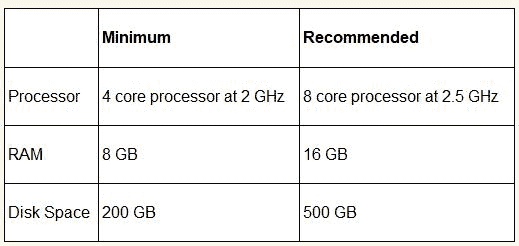

### 软件要求

在这本书中，我们将使用 Ubuntu Linux 15.04 构建系统。如果您无法获得这个版本，您可以使用较旧版本，例如谷歌的团队，一个完全不同的发行版，甚至是一个虚拟机。

当涉及到操作系统时，一个基本的要求是架构：如果我们计划构建 Android 2.3 或更高版本，我们需要一个 64 位系统。较旧的 Android 版本可以使用 32 位系统，但这不太可能。

#### 安装 Java JDK

Oracle 的 *Java 开发工具包* 是构建 Android 的关键要求，是必不可少的。每个 Android 版本都需要特定的 JDK 版本。根据我们想要构建的版本，我们将安装：

+   Cupcake 到 Froyo 的 JDK 5

+   Gingerbread 到 KitKat 的 JDK 6

+   KitKat、Lollipop 和 Marshmallow 的 JDK 7

我们将构建 Android Lollipop 5.1.1，并且我们需要至少 JDK 7。在 Ubuntu 上安装 JDK 非常简单。让我们先打开一个终端并运行以下命令：

```java
~$ sudo apt-get install openjdk-7-jdk

```

`apt-get` 命令将解决所有依赖，下载所有必需的软件包并安装它们。如果您是 *鼠标和图标* 用户，您可以使用 **Ubuntu 软件中心** 实现相同的目标，如下面的截图所示：

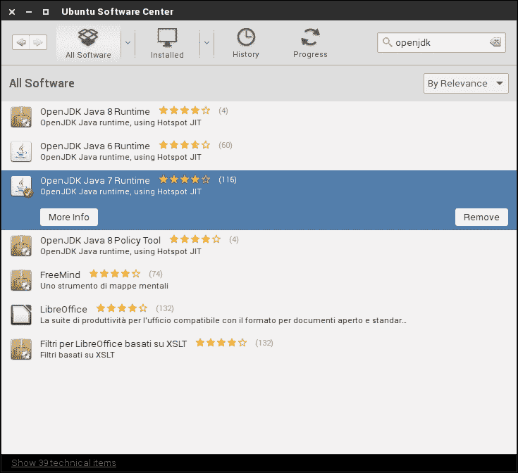

如果您是 Java 开发者或者出于特定原因计划构建不同的 Android 版本，比如冰淇淋三明治和棒棒糖，您可能会拥有不止一个版本的 Java 开发工具包。这种多用途场景需要更多的配置步骤。我们需要指定哪个 JDK 版本将作为系统中的默认版本。使用我们信任的终端，让我们运行以下命令：

```java
~$ sudo update-alternative –config javac

```

以下截图显示了输出。如您所见，它列出了所有可用的 JDK 版本，并允许您选择一个设置为默认版本。在我们的场景中，我们使用 JDK 7，因为我们计划构建 Android 5 或更高版本。

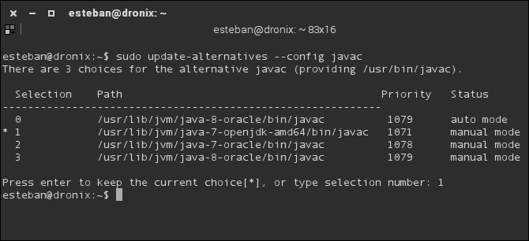

#### 安装系统依赖

即使 Java 在 Android 世界中是关键玩家，我们还需要一些 *低级* 工具来满足所有 Android 构建系统要求。其中一些是通用工具，它们可能已经安装，但我们的目标是从头开始设置整个系统：我们不能冒险遗漏一个依赖项。

使用您的终端，运行以下 `apt-get` 命令：

```java
~$ sudo apt-get install bison g++-multilib git gperf libxml2-utils \
 make python-networkx zlib1g-dev:i386 zip

```

如同往常，`apt-get` 将解决所有依赖并安装所有必需的软件包。以下截图显示了在您已经拥有所有必需软件包的情况下的命令输出，真幸运：

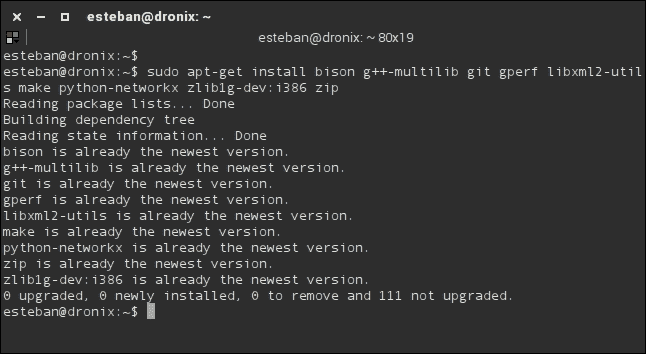

到目前为止，您的 Ubuntu 已经包含了构建世界上最受欢迎的移动操作系统所需的所有软件包和应用程序。

### 设置 Mac OS X 环境

构建 Android 最重要的要求之一是大小写敏感的文件系统。如果你计划使用 OS X 构建 Android，满足这一要求的最实际方法是创建一个包含大小写敏感文件系统的分区或磁盘镜像。

#### 创建大小写敏感的磁盘镜像

OS X 提供了一个方便的图形工具来创建新的磁盘镜像。打开`Spotlight`并启动`Disk Utility`。上面的工具栏中有一个**新建镜像**按钮，它会带你到磁盘镜像创建屏幕，如下面的截图所示：

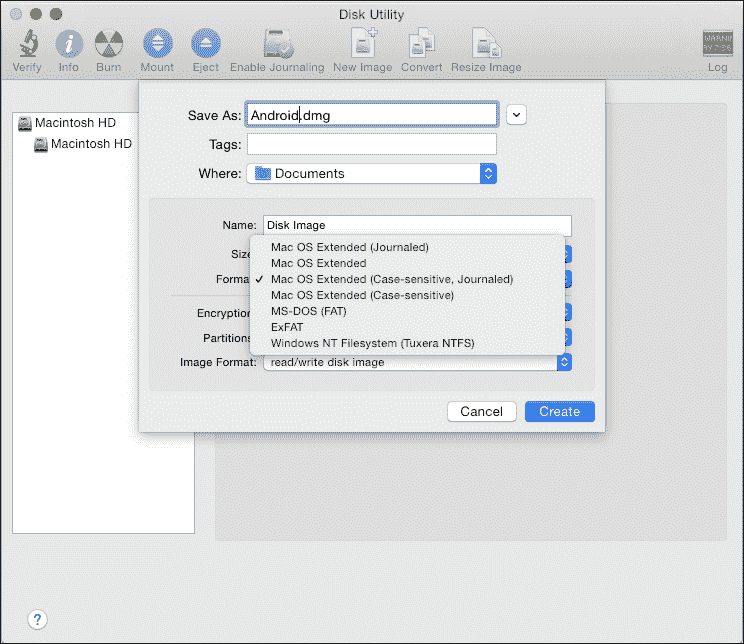

如前一个截图所示，关键设置是**格式**：它必须是`Case-sensitive, Journaled`。对于**大小**设置，越大越好，考虑到 Android 构建可能很快就会使用数百 GB。我们建议的最小大小至少为 50 GB。

如果你更倾向于使用**命令行**，可以使用 Terminal 和`hdiutil`创建这个磁盘镜像，如下面的命令所示：

```java
~$ hdiutil create -type SPARSE -fs 'Case-sensitive Journaled HFS+' \-size 50g ~/android.dmg

```

如果磁盘镜像创建成功，我们现在磁盘上有一个`.dmg`或`.dmg.sparsefile`文件。一旦我们挂载它，我们就可以像正常硬盘一样使用它——下载 Android 源代码并继续构建过程。

以下两个命令将给你提供挂载和卸载磁盘镜像的能力：

```java
~$ hdiutil attach ~/android.dmg -mountpoint /Volumes/android-disk;
~$ hdiutil detach /Volumes/android-disk;

```

#### 注意

如果你用完了空间，以下命令将给你机会调整磁盘镜像的大小，并允许你继续你的 Android 构建工作：

```java
~$ hdiutil resize -size <new-size-you-want>g ~/android.dmg.sparseimage

```

#### 安装所需的软件

一旦我们有了安装磁盘镜像，就像 Linux 一样，我们需要安装所有那些我们需要正确构建系统的软件要求。

安装 Java 开发工具包非常简单：只需从[`www.oracle.com`](http://www.oracle.com)下载适当的`.dmg`文件并安装它。关于 Android 目标版本和所需 Java 版本的规定在这里同样适用。

此外，我们还需要：

+   **Xcode**：Xcode 的安装有很好的文档记录，可以在[`developer.apple.com`](https://developer.apple.com)找到，因为 Xcode 是 iOS 开发的主要参与者。

+   **MacPorts**：这是一个开源项目，将帮助我们安装许多有用的工具。你可以按照[`www.macports.org/install.php`](http://www.macports.org/install.php)上的安装信息进行安装。

一旦我们有了这两个主要拼图，我们需要使用 MacPorts 安装`make`、`git`、`bison`和`GPG`软件包，在你的 Terminal 上使用以下命令：

```java
~$ POSIXLY_CORRECT=1 sudo port install gmake bison libsdl git gnupg

```

最后但同样重要的是，我们需要增加可能的最大文件描述符数。OS X 自带一个非常小的值——普通用户不需要所有这些文件描述符，但鉴于 Android 构建过程中涉及数百个文件，我们将需要更多的数量。为了增加这个值，我们需要启动我们的 Terminal 并运行以下命令：

```java
~$ ulimit –S –n 1024 

```

现在，限制已提升至 1,024 个文件。我们可以通过将以下内容添加到`~/.bash_profile`文件中，在您的`home`文件夹中，使这个值保持持久。

## Android 构建系统

在深入配置和构建您的第一个 Android 系统之前，我们将概述构建系统本身、涉及的工具以及谷歌对整个过程的独特方法。

关于创建新模块以及构建系统本身的官方文档非常少。您在这个旅程结束时的大部分知识将来自您自己的动手经验以及我们放入这些页面中的经验。

### 概述

就像许多其他项目一样，开源或闭源，Android 使用强大的工具`make`来构建整个系统，但与其他所有项目相比，Android 使用它的方式完全不同。

使用`make`的常见方法将是使用 Makefile 的层次结构：一个单一的根 Makefile 检索并运行包含在项目某些子文件夹中的其他所有 Makefile。通常，每个子文件夹代表主项目的一个子模块，它可以独立构建或依赖于其他模块。与其他项目不同，Android 没有`menuconfig`或其他任何图形配置实用程序来定制构建系统、启用或禁用模块。所有类型的构建配置都是通过环境变量完成的，我们将在下一节中展示。

此外，整个模块构建是非传统的。以 Linux 内核为例，通常，当构建一个模块时，在源代码相同的文件夹中，我们会得到编译文件。模块一个接一个，构建系统编译一切，最后，它检索所需的文件，将它们链接在一起，并生成最终输出。Android 以不同的方式工作。正如您在接近构建完成时会注意到的那样，Android 试图尽可能保持每个模块文件夹的清洁——每个编译文件最终都会进入`/out`文件夹，这样就可以更容易地清理一切，只需删除这个文件夹，一切就可以在一瞬间变得井然有序。

如您所猜的那样，构建系统完全是谷歌定制的。所有东西都是从零开始设计和开发的，使用现有工具，但以不寻常的方式处理问题。Android 开发者创建了一个巨大的 Makefile，其中包含构建每个模块和组装最终系统映像所需的所有信息。

整个构建系统都包含在`build/`文件夹中。这个文件夹包含：

+   工具 shell 脚本

+   工具 Python 脚本

+   一组包含创建所有系统模块所需信息的`.mk`文件

每个模块都有自己的文件夹。这个文件夹包含构建模块最重要的文件`Android.mk`。这个文件包含了构建模块源代码和生成二进制文件所需的所有信息。

模块“`Android.mk`”文件是构建过程的第一步——构建系统会扫描每个文件夹以查找这些文件，并将它们包含到它将用于后续步骤的单个巨大的 Makefile 中。

源代码根目录包含一个包含以下内容的 Makefile：

```java
### DO NOT EDIT THIS FILE ###
include build/core/main.mk
### DO NOT EDIT THIS FILE ###
```

文件看起来很空，但它包含了所有最重要的`.mk`文件——“`main.mk`”。这个文件位于“`build/core`”，包含了一系列检查和所有必要的操作，以检索构建所有模块所需的全部“`Android.mk`”文件。

#### 注意

没有特殊的配置，Android 构建系统只创建 Android 系统镜像。要生成 CTS、NDK 和 SDK，我们需要更多的设置工作，正如我们稍后将会看到的。

### 引导

整个构建系统都是通过一个单一的 shell 脚本——“`build/envsetup.sh`”来启动的。正如您在下面的屏幕截图中所看到的，这个脚本负责准备构建环境。它设置了一些配置并提供了一些有用的工具，使我们的工作变得更加容易：它是 Android 构建系统的瑞士军刀。

启动您的终端并按照以下方式运行脚本：

```java
~$ . build/envsetup.sh

```

这里是输出结果：


之前的屏幕截图显示了“`envsetup.sh`”的输出，它使系统完全运行并准备好构建。要获取我们现在可用的所有命令列表，请在您的终端中运行：

```java
:~$ hmm

```


之前的屏幕截图显示了“`hmm`”命令的输出。我们稍后会看到很多这样的命令，但作为一个美味的期待：

+   “`lunch`”：这个命令可以帮助您通过一个命令配置针对特定目标所需的所有内容

+   “`mm`”：这个命令允许您仅编译当前文件夹中包含的模块

### 设置

合适的配置环境是构建系统最重要的因素之一。每个构建系统都提供了一种明确的方式来指定，例如，我们要构建哪个平台上的哪个模块。以 Linux 内核为例，它提供了一个方便的图形菜单来执行所有必要的配置：

```java
$ make menuconfig

```

Menuconfig 允许您启用或禁用要构建的模块，选择所需的平台，以及许多其他可能的配置。每个单独的配置位都保存在一个`.config`文件中，可以轻松读取或编辑，并用于构建过程。

正如我们所预期的，Android 基于完全不同的东西。没有图形界面来执行配置。唯一的交互式或自动配置系统是“`envsetup.sh`”，我们之前已经学过了。那么为什么 Android 没有提供任何酷炫的工具来配置构建系统呢？简单地说，因为它不需要！我们不应该禁用我们不希望构建的所有模块，所以 Android 并没有提供一种简单的方法。

假设我们正在为刚刚创建的新设备构建 Android，而这个设备没有内置摄像头。我们可能想要移除管理摄像头的系统部分。没有官方的方法来做这件事。如果我们想这么做，我们需要亲自动手，随着时间的推移和页面的积累，我们将能够做到这一点。

我们可以安全地说，整个 Android 构建系统配置可以简化为设置几个环境变量。构建系统将使用这些变量来确定我们针对哪个设备，或者它应该使用哪个工具链。

最重要的变量是：

+   TARGET_PRODUCT

+   TARGET_BUILD_VARIANT

+   TARGET_BUILD_TYPE

+   TARGET_TOOLS_PREFIX

+   TARGET_PREBUILT_KERNEL

+   OUT_DIR

在接下来的章节中，我们将学习所有可以操纵以完善构建的变量。

#### TARGET_PRODUCT 变量

这个变量包含指定我们为哪个设备准备系统的信息。我们目前的目标是官方模拟器，所以我们将设置这个变量为`aosp_arm`。如果我们想为 Google 的 Nexus 6 构建系统，我们将设置变量为`aosp_shamu`，或者为 Google 的 Nexus 5 设置变量为`aosp_hummerhead`。

为了快速访问所有针对所有支持设备的特定值，我们提供了一个方便的表格，如下所示：


如您所想，每个设备都支持特定版本的系统。例如，使用我们当前下载的源代码库，标记 android-5.1.1：

+   aosp_arm

+   aosp_arm64

+   aosp_mips

+   aosp_mips64

+   aosp_x86

+   aosp_x86_64

+   aosp_manta

+   aosp_flounder

+   mini_emulator_x86_64

+   mini_emulator_mips

+   mini_emulator_x86

+   mini_emulator_arm64

+   m_e_arm

+   aosp_mako

+   aosp_hammerhead

+   aosp_shamu

+   full_fugu

+   aosp_fugu

+   aosp_deb

+   aosp_tilapia

+   aosp_flo

+   aosp_grouper

一旦我们确定了目标设备，打开终端并运行：

```java
$ export TARGET_PRODUCT=aosp_arm

```

#### TARGET_BUILD_VARIANT 变量

每个`Android.mk`文件都引用这个变量来启用或禁用其代码库的编译部分。这个变量有三个可能的值，它指定了构建变体。我们可以将其设置为：

+   `eng`: 在这里，每个标记为用户、调试和`eng`的模块都被启用

+   `userdebug`: 在这里，每个标记为用户和调试的模块都被启用

+   `user`: 在这里，每个标记为用户的模块都被启用

我们可以使用变量如下：

```java
$ export TARGET_BUILD_VARIANT=eng

```

#### TARGET_BUILD_TYPE 变量

这个变量指定了我们将为每个模块执行哪种类型的构建。如果我们打算创建一个开发系统，我们可能需要更多的日志信息，例如。对于这种情况，我们将设置这个变量为`debug`，构建并测试我们的系统。在这个阶段之后，我们将使用这个变量设置为`release`来重建系统，以禁用冗长的日志记录和所有开发特性。

#### TARGET_TOOLS_PREFIX 变量

这个变量指定了在构建过程中使用自定义工具链的路径。通常，它保持为空，但随着经验的积累，你应该尝试不同的工具链，这些工具链在互联网上免费提供。最著名且经过优化的自定义工具链之一是由`Linaro`团队开发和分发的。

#### `OUT_DIR`变量

如果出于某些特定原因我们想要覆盖`out/`文件夹的默认路径，我们可以使用这个变量来指定一个自定义路径。这个变量在所有有多个硬盘或网络共享的场景中都非常有用。例如，我们可以在快速的 SSD 磁盘上运行构建过程，并将输出存储在标准的旧式磁盘上，甚至是一个网络磁盘，以便与我们的队友共享。

#### `TARGET_PREBUILT_KERNEL`变量

这是一个相当高级的变量。它允许我们向系统提供一个与默认不同的内核。每个目标设备都附带一个预编译的默认内核，因为 Android 构建系统不会构建它——它已经存在了。

注入自定义内核是一个非常有趣的话题，它打开了众多有趣的场景。在第五章“自定义内核和引导序列”中，我们将构建一个自定义内核并将其注入到我们的 Android 系统中，以创建一个完全定制的 Android 体验：这个变量将是拼图中最重要的部分之一。

#### `buildspec.mk`文件

如果我们想要持久化这些变量，我们可以将它们添加到`buildspec.mk`文件中。每次我们运行`make`时，系统都会检查这个文件，评估所有变量，然后相应地继续。`buildspec.mk`文件在`build/`文件夹中以`buildspec.mk.default`为名的方便模板版本提供。这个模板文件包含所有可用的变量。每个变量都有注释，默认禁用，并附带关于其用途和如何使用的简要说明。

我们可以将这个文件视为 Linux 内核`.config`文件的等价物，即使我们可能有更少的配置选项。

#### `lunch`命令

在前面的几个部分中，我们已经对`lunch`有了一个初步的了解。如果我们不想手动设置所有这些环境变量，或者我们不想使用

使用`buildspec.mk`，我们可以使用`lunch`。在我们执行了`envsetup.sh`之后，我们可以在系统中找到它。

让我们来看看这个命令。打开一个终端并进入你的`WORKING_DIRECTORY`。确保你已经启动了`envsetup.sh`，然后运行：

```java
$ lunch

```

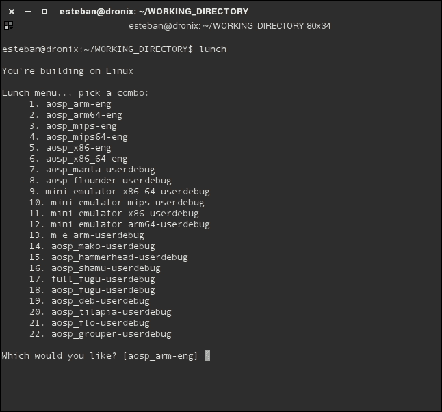

前面的截图显示了命令的输出，正如你很容易看到的，它帮助我们选择我们想要的变量的确切组合。每个特定的 Android 版本都有自己的`lunch`命令，每个`lunch`命令版本都有自己的输出。前面的截图显示了 android-5.1.1 标签的输出。

一旦你选择了所需的配置，`lunch`将显示它将要设置的每个变量的摘要，然后返回终端，如下面的截图所示：

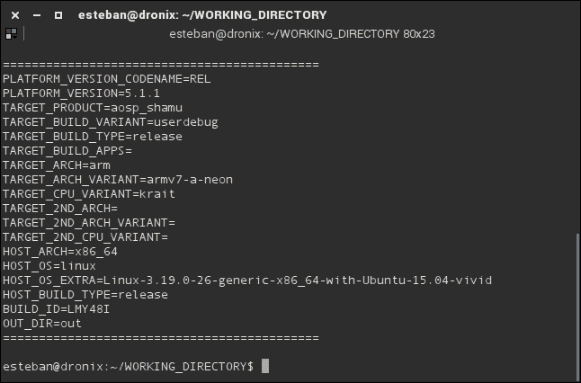

我们现在可以运行`make`命令并构建我们的第一个 Android 版本了！

### 构建系统

你已经下载了源代码，使用`envsetup.sh`初始化了整个环境，并使用`lunch`配置了每个系统变量。你现在可以构建系统了。打开一个终端并运行：

```java
:~$ make –j8

```

构建系统将启动，寻找所有那些模块和`Android.mk`文件以包含在构建过程中并执行编译。

如果你想要享受更详细的编译输出，你可以运行：

```java
:~$ make –j8 showcommands

```

使用这个额外参数，构建系统将打印所有*GCC*编译日志和所有`javac`编译日志，以便在构建过程中尽可能提供更多信息。

#### 更多关于 make 的信息

`make`命令提供了一些在特定场景下很有用的有趣选项。

#### 构建模块

例如，如果你想只构建一个单独的模块，你可以运行：

```java
~$ make art

```

在这个例子中，我们只构建`art`。模块名称包含在`module`文件夹中的`Android.mk`文件中。只需滚动文件，你就会找到一个表示要使用`make`的精确模块名称的变量`LOCAL_MODULE`。

我们也可以使用`mm`命令检索模块名称。在终端中，只需到达模块文件夹并运行：

```java
$ mm

```

#### 清理模块

如果模块构建完成后我们还不满意，我们可以清理所有编译文件并从头开始。打开一个终端，到达模块文件夹，并运行：

```java
~$ make clean-<module>

```

#### 清理所有内容

如果你想要清理整个项目并为从头开始的新构建准备系统，打开一个终端，到达`WORKING_DIRECTORY`，并运行：

```java
~$ make clean

```

此命令从我们在`OUT_DIR`变量中指定的文件夹中删除所有编译文件。

#### 列出模块

```java
$ make modules

```

此命令显示 AOSP 架构中每个模块的列表。可用的模块数量庞大：我们可能需要等待几秒钟才能看到此命令的任何输出。

#### 重新创建镜像

此命令根据当前源代码库的状态，使用增量构建方法重新创建系统镜像，如下所示：

```java
$ make snod

```

这是一个开发过程中的关键命令。想想只开发一个模块。当你达到一个开发里程碑时，你可以使用以下命令构建模块：

```java
$ make module_name

```

如果一切正常，你可能想将你的全新模块注入到 Android 系统镜像中。你可以通过以下方式实现：

```java
:$ make module_name snod

```

#### 构建工具

以下命令将创建并提供给我们两个对 Android 专家来说最重要的工具——`adb`和`fastboot`：

```java
:$ make tools

```

我们将在下一页有足够的时间了解它们。

#### 超越系统镜像

我们目前正在构建一个准备闪存到设备上的系统镜像。不幸的是，这个程序排除了我们想要构建的一些有用工具：NDK、SDK 和 CTS。

#### Android SDK

Google 通过 Android 开发者网站提供官方的 Android SDK。它已经为每个平台编译好，可供下载。在更高级的场景中，你可能需要扩展 SDK 并将其重新分发为你的版本。构建自定义 SDK 是一个三步命令的工作，这些命令我们在前面的章节中已经学过：

```java
~$ . build/envsetup.sh
~$ lunch sdk-eng
~$ make

```

此过程的输出将是一个全新的自定义 Android SDK，位于`out/host/linux-x86/sdk/`。

#### Android NDK

Android NDK 是基于 C/C++的本地等效物，基于 Java 的 Android SDK。要构建 NDK，打开终端，到达`WORKING_DIRECTORY`，然后运行：

```java
~$ cd ndk/build/tools
~$ export ANDROID_NDK_ROOT=path/to/WORKING_DIRECTORY/ndk
~$ ./make-release

```

系统将提醒你关于过程可能的长持续时间。只需接受消息，同时准备一些咖啡。

#### Android CTS

CTS 是一个知名的工具。我们在前面的章节中学到了关于它的所有内容。要构建我们自己的版本，我们只需要一个命令：

```java
~$ make cts

```

### 在 AOSP 模块内部

AOSP 项目极其庞大。源代码库中包含的模块数量巨大。Android 5 Lollipop 大约包含 4,000 个不同的模块。它们从用 C/C++编写的本地模块，到提供系统组件：守护进程、库和 Java 模块，以提供从 APK 到 JAR 文件所需的一切。

每个模块都包含一个 Android.mk 文件。这个文件包含构建模块所需的所有信息。Android 构建系统不使用递归 make 方法，而是将每个 Android.mk 文件合并为一个单一的巨大 Makefile 来构建系统：每个 Android.mk 文件都是拼图的一部分。

除了 Android.mk，模块文件夹还包含`CleanSpeck.mk`文件。这个文件帮助我们正确清理在执行模块清理命令时编译的每个文件。

#### 深入 Android.mk

获取知识的最快途径是亲自动手。我们将分析 Android 源代码中的一个真实的 Android.mk 文件，以了解其结构和目的。在上一章中，我们了解到`external/`文件夹包含许多第三方工具，这些工具丰富了 Android 系统。其中之一是`netcat`。让我们看看它的 Android.mk 文件：

```java
LOCAL_PATH:= $(call my-dir)
include $(CLEAR_VARS)

LOCAL_SRC_FILES:=\
        netcat.c \
        atomicio.c

LOCAL_CFLAGS:=-O2 -g

LOCAL_MODULE_TAGS := eng

LOCAL_MODULE_PATH := $(TARGET_OUT_OPTIONAL_EXECUTABLES)

LOCAL_MODULE:=nc

# gold in binutils 2.22 will warn about the usage of mktemp
LOCAL_LDFLAGS += -Wl,--no-fatal-warnings

include $(BUILD_EXECUTABLE)
```

几行需要更详细研究的神秘代码：

```java
LOCAL_PATH:= $(call my-dir)
```

这一行指定了`LOCAL_PATH`变量并将其设置为当前模块路径。正如你所猜到的，`$(call my-dir)`函数返回当前模块路径。

这个函数是系统提供的一组有用的函数之一，用于在开发新模块期间使用。整个列表包含在`build/core/definitions.mk`中。每个函数显然都带有代码，以及一个微小但有效的目的描述，如下一张截图所示：

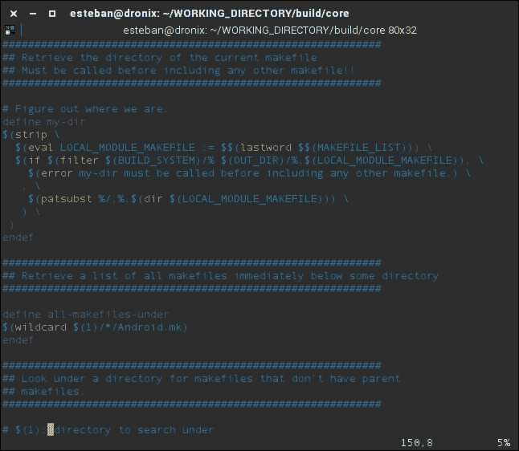

```java
include $(CLEAR_VARS)
```

这一行解决了由于 Android 构建系统的特性而产生的一个大问题——将所有的 Android.mk 文件合并成一个单独的 Makefile，会创建一个危险的场景，其中模块 A 的 `LOCAL_` 变量可能会被模块 B 错误地使用。`$(CLEAR_VARS)` 函数重置了之前设置的变量，并允许当前模块安全地访问其本地变量，使用以下代码：

```java
LOCAL_SRC_FILES:=\
        netcat.c \
        atomicio.c
```

以下一行指定了当前模块中包含的源文件：

```java
LOCAL_CFLAGS:=-O2 -g
```

以下一行指定了我们将要传递给编译器的参数：

```java
LOCAL_MODULE_TAGS := eng
```

这一行指定了该模块属于哪个变体。这与我们在前几节中了解到的环境变量 `TARGET_BUILD_VARIANT` 密切相关。在这里指定 `eng` 将使此模块在构建系统的 `eng` 构建变体时可用：

```java
LOCAL_MODULE_PATH := $(TARGET_OUT_OPTIONAL_EXECUTABLES)
```

这一行指定了在构建过程成功时编译的可执行文件安装的位置。在这种情况下，最终文件将被放置在系统镜像的 `xbin/` 文件夹中。这个变量是可选的。系统将根据全局配置中已指定的默认值进行操作。我们可以使用这个变量来指定一个 *不同的* 目标文件夹：

```java
LOCAL_MODULE:=nc
```

这一行在几节前就已经被预期到了。它指定了模块名称。它必须是唯一的，它也将是可执行文件的最终名称。在这种情况下，我们的 `netcat` 工具将成为 `nc` 可执行文件，正如在 `*nix` 系统中常见的那样：

```java
LOCAL_LDFLAGS += -Wl,--no-fatal-warnings
```

对于编译器来说，链接器也将有一组特定的参数。这一行指定了链接器将根据以下选项进行操作：

```java
include $(BUILD_EXECUTABLE)
```

这一行指定了我们正在尝试构建的模块类型。我们当前的模块是一个可执行实用程序，因此我们将指定 `$(BUILD_EXECUTABLE)`，系统将正确地从所有模块源代码生成可执行文件。

#### Android.mk 变量生态系统

在上一节中，我们分析了一个实际的 Android.mk。这让我们在创建自己的 Android 模块时获得了一些信心。在本节中，我们将继续我们的旅程，概述我们可以在 Android.mk 中使用的所有变量：

`LOCAL_` 变量是所有必要的变量，用于实现适当的模块配置和编译。这类变量会被 `$(CLEAN_VARS)` 取消，并且在所有 Android.mk 文件中是最常见的类型。

`INTERNAL_`、`HOST_` 和 `TARGET_` 变量不应用于自定义目的，因为它们通常由构建系统本身使用。

`BUILD_` 变量指定了构建类型，正如我们在之前的示例中看到的，我们使用了 `BUILD_EXECUTABLE`。

从技术上来说，我们可以使用任何类型的变量，但这是一场危险的游戏。很难预测构建系统将如何操纵我们的 Android.mk 文件来创建其 Makefile：顺序可能不被尊重，名称可能被覆盖，作用域可能被无效化。为了安全地玩耍并依赖于构建系统架构，让我们专注于只使用 `LOCAL_` 变量来完成我们的任务。

关于这些变量没有官方文档。即将到来的列表是辛勤工作、冒险、猜测以及从整个构建系统中搜集信息的结果。

#### LOCAL_ 变量

当涉及到 `LOCAL_` 变量时，我们可以根据此列表自定义我们的模块：

+   `LOCAL_PATH`: 这指定了模块的路径。通常，该值是通过使用 `$(call my-dir)` 函数检索的。

+   `LOCAL_MODULE`: 这指定了模块的名称，如果我们在处理可执行模块，则指定可执行文件的名称。

+   `LOCAL_MODULE_CLASS`: 这指定了模块所属的类别。根据其类别，模块构建过程的每个结果都将放置在正确的文件夹中。可能的类别的例子有 `EXECUTABLE`、`ETC`、`SHARED_LIBRARY`、`STATIC_LIBRARY` 和 `APPS`。

+   `LOCAL_SRC_FILES`: 这指定了模块中包含的所有源文件列表，由空格分隔。

+   `LOCAL_PACKAGE_NAME`: 这指定了应用程序的名称，例如：联系人、电话、计算器等等。

+   `LOCAL_SHARED_LIBRARIES`: 这指定了可能需要的共享库。

+   `LOCAL_MODULE_TAGS`: 这指定了一个标签，例如 `eng`，系统将包括此模块在所有以 `eng` 类型作为 `TARGET_BUILD_VARIANT` 的目标构建中。

+   `LOCAL_MODULE_PATH`: 这指定了一个自定义安装路径，以覆盖 `BUILD_` 模板中指定的路径。

+   `LOCAL_CC`: 这指定了要使用的不同 C 编译器。

+   `LOCAL_CXX`: 这指定了要使用的不同 C++ 编译器。

+   `LOCAL_CFLAGS`: 这有助于向 C 编译器命令行添加模式标志。

+   `LOCAL_CPPFLAGS`: 这有助于向 C++ 编译器命令行添加模式标志。

+   `LOCAL_CPP_EXTENSION`: 这指定了 C++ 文件的自定义扩展，如果由于某种原因实际扩展不是 `.cpp`。

+   `LOCAL_C_INCLUDE`: 这指定了构建模块所需的自定义 C 头文件路径。

+   `LOCAL_LDFLAGS`: 这有助于向链接器命令行添加模式标志。

+   `LOCAL_PREBUILT_EXECUTABLES`: 在创建 `BUILD_PREBUILD` 类型的模块期间，此变量将包含将成为最终系统镜像一部分的所有二进制可执行文件。我们将在下一章中了解更多关于这一点。

+   `LOCAL_PREBUILT_LIBS`: 在创建 `BUILD_PREBUILD` 类型的模块期间，此变量将包含将成为最终系统镜像一部分的所有库。

+   `LOCAL_PREBUILT_PACKAGE`：在创建 `BUILD_PREBUILD` 类型的模块期间，此变量将包含将成为最终系统映像一部分的所有预构建 APK。

#### BUILD_ 变量

以下列表包含在自定义模块开发过程中可用的最常见 `BUILD_` 变量：

+   `BUILD_EXECUTABLE`：当需要使用原生 C/C++ 代码进行构建时，我们可以在配置中添加此行：

    ```java
    include $(BUILD_EXECUTABLE)
    ```

+   `BUILD_PREBUILT`：这允许我们将二进制组件添加到我们的最终映像中。

+   `BUILD_MULTI_PREBUILT`：这允许我们创建将具有相同类别二进制组件的最终映像注入模块。它通常与 `LOCAL_MODULE_CLASS` 一起使用，以指定类别和放置二进制文件的位置。

+   `BUILD_PACKAGE`：这允许我们创建生成 APK 文件的模块。

+   `BUILD_SHARED_LIBRARY`：这允许我们创建生成共享库文件的模块。

+   `BUILD_STATIC_LIBRARY`：这允许我们创建生成静态库文件的模块。

+   `BUILD_JAVA_LIBRARY`：这允许我们创建生成 Java 库文件的模块。

#### 模块模板示例

在本节中，我们将分析现实世界的模块模板代码片段，以便清楚地了解一个完全运行的模块模板看起来像什么。

#### 原生可执行文件模板

如果你打算对一个通用的原生单文件可执行应用程序进行工作，例如，`your_executable.c`，你可以使用以下代码片段来构建它：

```java
LOCAL_PATH:= $(call my-dir)
include $(CLEAR_VARS)         

LOCAL_SRC_FILES:= your_executable.c       
LOCAL_MODULE:= your_executable            

include $(BUILD_EXECUTABLE)
```

#### 共享库模板

如果你正在处理所谓的共享库，这个代码片段会很有用：你的库将由一组文件组成，即 `foo.c` 和 `bar.c`，并将相应地构建：

```java
LOCAL_PATH:= $(call my-dir)     
include $(CLEAR_VARS)

LOCAL_SRC_FILES:= foo.c bar.c
LOCAL_MODULE:= libmysharedlib
LOCAL_PRELINK_MODULE := false   # Prevent from prelink error

include $(BUILD_SHARED_LIBRARY) 
```

#### 应用程序模板

如果你打算对一个完整的应用程序进行工作，你可以使用以下代码片段：

```java
LOCAL_PATH:= $(call my-dir)
include $(CLEAR_VARS)
LOCAL_MODULE_TAGS:= eng
LOCAL_SRC_FILES:= $(call all-java-files-under src)
LOCAL_PACKAGE_NAME:= MyApplication

include $(BUILD_PACKAGE)
```

此代码片段将构建指定路径和包中的每个 `.java` 文件，并将所有内容打包为 `MyApplication`。

## 创建自定义设备

在我们的旅程中，你学习了如何检索源代码以及如何设置构建系统。在本节中，你将学习如何创建一个新的目标设备并将其添加到构建系统中。我们现在要创建的设备具有特定的硬件功能。这是一个概念验证设备，其唯一目的是向你展示你可以多么容易和快速地创建一个全新的设备，然后对其进行定制。

每个设备定义都包含在 `device/` 文件夹中。第一级文件夹包含所有制造商的文件夹。每个制造商文件夹包含其自己的设备。让我们创建我们自己的制造商和设备文件夹：我们的品牌是 Irarref，我们的型号是 F488。打开终端，到达 `WORKING_DIRECTORY` 文件夹，并运行：

```java
~$ mkdir –p device/irarref/f488

```

一旦我们建立了文件夹结构，我们需要创建所有那些允许构建系统检测我们的设备并将其作为构建系统的目标使其可用的文件。我们将创建以下文件：

+   `Android.mk`: 以通用方式描述如何编译源文件。本质上，它代表了一个将被构建系统在适当时间合并的全球 Makefile 的片段。

+   `AndroidProducts.mk`: 这个文件包含一个`PRODUCS_MAKEFILEs`变量，列出了所有可用的产品。在我们的场景中，我们只有一个设备，它由这些文件表示。

+   `full_f488.mk`: 这个文件指定了关于设备的相关信息。

+   `BoardConfig.mk`: 这个文件指定了关于设备板的相关信息。

+   `vendorsetup.sh`: 这个脚本使设备对`envsetup.sh`和`lunch`可用。

### 深入设备配置

如我们所知，我们的第一个设备相当简单，但非常有教育意义。让我们看看我们的设备规范是如何分布在我们所有的配置文件中的：

+   `Android.mk`:

    ```java
    LOCAL_PATH:= $(call my-dir)
    Include $(CLEAN_VARS)

    Ifneq ($(filter f488, $(TARGET_DEVICE)),)
    Include $(call all-makefile-unter, $(LOCAL_PATH))
    Endif
    ```

+   `AndroidProducts.mk`:

    ```java
    PRODUCT_MAKEFILES:= $(LOCAL_DIR)/full_f488.mk
    ```

+   `full_f488.mk`:

    ```java
    $(call inherit-product, 
    $(SRC_TARGET_DIR)/product/aosp_base.mk
    #
    DEVICE_PACKAGE_OVERLAY:=

    PRODUCT_PACKAGE+=
    PRODUCT_COPY_FILES+=
    PRODUCT_NAME:= full_f488
    PRODUCT_DEVICE:= f488
    PRODUCT_MODEL:= Android for Irarref F488
    ```

+   `BoardConfig.mk`:

    ```java
    TARGET_NO_BOOTLOADER := true
    TARGET_NO_KERNEL := true
    TARGET_CPU_ABI := armeabi
    HAVE_HTC_AUDIO_DRIVER := true
    BOARD_USES_GENERIC_AUDIO := true

    # no hardware camera
    USE_CAMERA_STUB := true

    # CPU
    TARGET_ARCH_VARIANT := armv7-a-neon
    ARCH_ARM_HAVE_TLS_REGISTER := true
    ```

+   `vendorsetup.sh`:

    ```java
    add_lunch_combo full_f488-eng
    ```

我们的`Android.mk`相当标准，完全基于我们在前面的章节中学到的内容。`AndroidProducts.mk`正如预期的那样，只包括了`full_f488.mk`。

`full_f488.mk`文件包含了一些有趣的行。首先，它包括了`aosp_base.mk`，这是一个由系统提供的配置文件，对于许多真实设备来说是通用的。

接下来，我们发现了一些有趣的变量：

+   `DEVICE_PACKAGE_OVERLAY:=`: 这个变量允许我们创建一个自定义覆盖，例如，自定义 AOSP 系统中特定模块的一些设置。例如，如果你检查`shamu`设备的等效文件中的这个变量，你可以注意到他们正在使用它来自定义启动器应用程序中的几个设置。

+   `PRODUCT_PACKAGE+=`: 这个变量允许我们在编译过程中添加包。

+   `PRODUCT_COPY_FILES+=`: 这个变量执行文件复制操作。语法相当直接：`source_file:dest_file`

+   `PRODUCT_NAME:= full_f488`: 这个变量指定了产品名称。这是`lunch`将打印为`TARGET_PRODUCT`的确切相同值。

+   `PRODUCT_DEVICE:= f488`: 这个变量指定了设备名称。

+   `PRODUCT_MODEL:=`: Irarref F488 的 Android：这个变量指定了设备型号标签，我们将在 Android 系统中的**设置** | **关于手机** | **型号**下找到。

在所有这些文件就绪后，你现在可以重新启动`envsetup.sh`，我们全新的原型设备将出现在可用设备列表中。

## 从零到屏幕锁定

到目前为止，我们已经收集了关于架构、如何配置构建系统以及我们的原型设备的大量信息。是时候为真实设备创建我们的第一个镜像并使用它了！我们希望避免所有可能的硬件相关的问题，因此我们将目标定位在最简单的非硬件 Android 设备上：Android 模拟器。

我们将构建最新可用的 Android Lollipop 源代码。正如我们所学的，我们将下载它，配置它以针对模拟器，构建它，并在设备上尝试它。

### 设置

让我们设置我们的`WORKING_DIRECTORY`并下载我们宝贵的源代码。打开终端并运行以下命令：

```java
:$ mkdir WORKING_DIRECTORY
:$ cd WORKING_DIRECTORY
:$ repo init –u https://android.googlesource.com/platform/manifest -b \
android-5.1.1_r9
:$ repo sync

```

下载完成后，我们可以配置环境。让我们运行：

```java
:$ build/envsetup.sh

```

这将创建我们在工作中需要的所有实用工具。现在我们有`lunch`，例如，运行它我们可以继续配置环境：

```java
:$ lunch

```

让我们选择一个目标设备：

```java
aosp_arm-eng

```

`lunch`命令将设置一切并显示一个配置报告，如下一个截图所示：

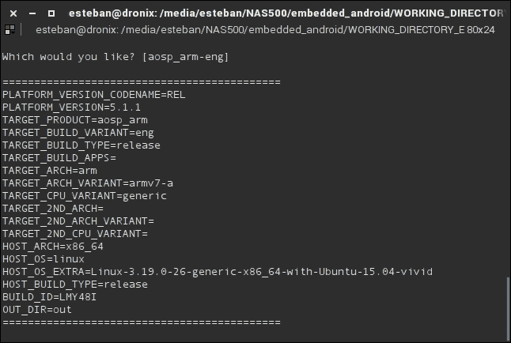

### 构建

一切就绪。我们只需要一个命令来启动构建过程：

```java
:$ make –j8

```

构建过程完成后，前往`out/target/product/generic/`。这个文件夹将包含我们构建的镜像。以下截图显示了构建过程的结果：一个充满`.img`文件的文件夹，准备闪存到设备中：

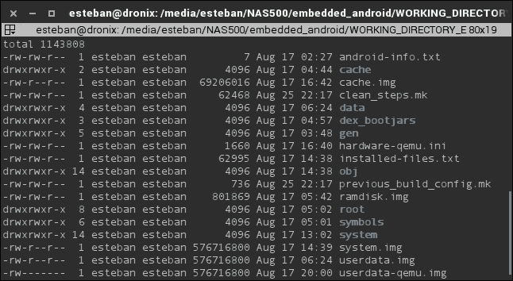

### 运行

要启动模拟器，Android 提供了`emulator`命令。这个命令将在编译结束时可用。使用我们`out/`文件夹中的`.img`文件，我们可以这样运行它：

```java
$ emulator -system out/target/product/generic/system.img -ramdisk out/target/product/generic/ramdisk.img -data out/target/product/generic/userdata-qemu.img

```

几分钟后，模拟器窗口将弹出，你将看到如下截图所示的内容：

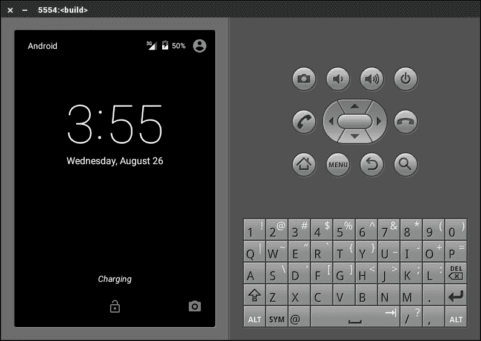

你可以使用鼠标和键盘使用模拟器，执行你会在真实设备上做的相同操作。Android 模拟器是一个强大的工具，其可能性几乎是无穷无尽的。如果你想深入了解这个话题，Android 开发者网站提供了一个专门的页面：[`developer.android.com/tools/help/emulator.html`](http://developer.android.com/tools/help/emulator.html)。

## 摘要

本章是一次精彩的运行！你为构建你的第一个 Android 系统准备好了系统。你学习了如何配置和定制构建系统。你学习了创建自定义模块并将其包含到系统镜像中的基本技能。你从头开始创建了一个系统镜像，并在 Android 模拟器上进行了测试。

在下一章中，我们将提高标准。我们将把我们的努力转移到真实的硬件设备上。我们将使用智能手机 Nexus 5 和开发板 UDOOU。我们将操作引导加载程序和恢复分区，以完全控制系统。
