# 第四章\. 移动到真实硬件

在上一章中，你学习了如何设置必要的环境配置以及如何构建你的第一个纯系统，针对模拟器。在本章中，我们将快速概述每个专家 Android 用户的基本工具，并将完成我们的第一个针对真实设备的系统——配置、构建、烧录和测试。

## 调试工具

调试工具是每个开发者都无法离开的工具之一。在嵌入式系统（如 Android 系统）中，它们甚至更为重要。Android 提供了大量的调试工具，以简化复杂或无聊的任务。其中两个最重要的工具无疑是 `adb` 和 `fastboot`。

### 介绍 ADB

ADB 代表 Android Debug Bridge，它是由两个关键部分组成的工具包：

+   在设备上运行的 Adb 服务器

+   在 PC 上运行的 Adb 客户端

通常，`adb` 被认为是命令行工具，但如果你更喜欢以图形化的方式使用它，你可以在网上找到一些图形前端。Android Studio，谷歌为 Android 开发提供的官方 IDE，使用 `adb` 与每个设备通信并提供如 `Android 设备监控器` 这样的酷炫工具。使用图形界面，我们可以分析来自设备的日志，甚至为了调试目的进行截图。

以下截图显示了如何使用 **Android 设备监控器** 从运行在设备上的设备和应用中检索大量信息：

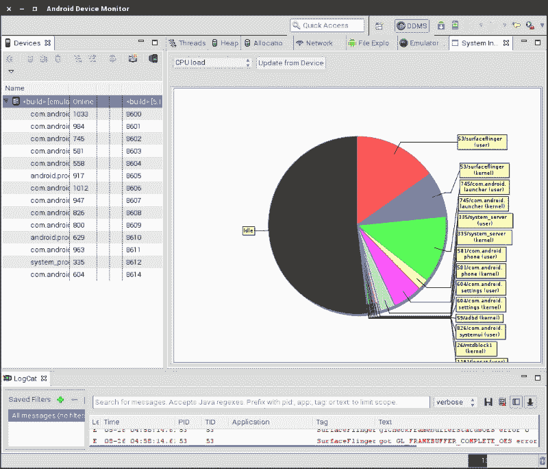

在我们的旅程中，我们将主要在命令行中使用 `adb`，因为我们的工作具有嵌入式特性。正如我们所知，模拟器表现得像硬件设备，因此我们可以轻松使用 `adb` 与之通信。让我们看看一些与运行中的模拟器交互的有用命令。

首先，我们需要一个所有可用命令的便捷列表。这可以通过以下命令轻松实现：

```java
$ adb --help

```

现在，我们需要检测连接的设备。在我们的可靠终端上运行以下命令：

```java
$ adb devices

```

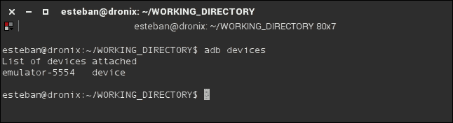

之前的命令将扫描所有连接的设备并将它们列出。之前的截图显示我们的模拟器已连接并准备好通信。在多设备场景中，我们可能会在正确检测设备时遇到一些问题。Adb 给我们提供了另一个选项 `-l`：


使用 `-l` 选项，`adb` 将显示有关设备的更多详细信息，这有助于我们正确识别它们，如之前的截图所示。

一旦我们检测到设备，我们可以通过几种方式与之通信。最常见的方式之一是将它连接到设备的内部 shell。每个 Android 设备都自带一个系统 shell：它是嵌入式或远程系统的常用工具。要连接到内部 shell，我们只需运行以下命令：

```java
$ adb shell

```

如果我们有多台设备，我们需要指定我们想要连接到哪台设备，如下所示：

```java
$ adb -s ZX1B226467 shell

```

一旦我们连接到内部 shell，我们可以将系统当作一个普通的 `*nix` 系统来处理。我们可以运行一个 `ls` 命令：

```java
$ ls –l

```

如下一个截图所示，我们获得了目录列表：

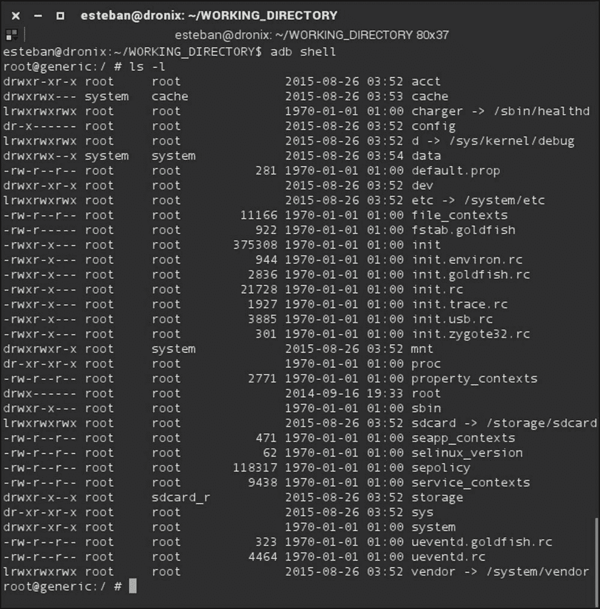

我们建议您探索文件系统并进行实验。您会发现您几乎可以做到任何事情，从操作文件到操作应用程序。

#### 将文件推送到设备

Adb 给我们提供了数十个有用的命令来管理我们的设备：

```java
$ adb push

```

`adb push` 命令无疑是其中最有用的一个。它允许我们从我们的电脑复制文件到我们的 Android 设备。下一个截图显示了如何将单个文件上传到我们的设备：


我们创建了一个新的文件，`pippo.txt`，其中包含一行，`hello pippo`，然后我们将这个文件上传到我们的连接设备，到 `/sdcard/` 文件夹中。正如你所见，第一个参数是文件名，第二个参数是我们想要复制文件到的目标位置。

下一个截图显示了 `pippo.txt` 已成功上传到设备的 `/sdcard/` 文件夹：

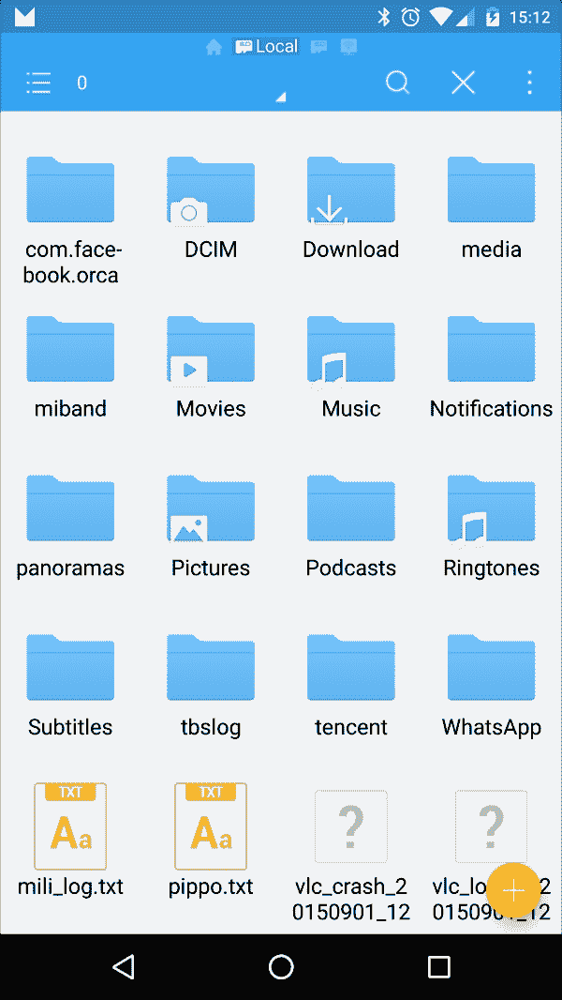

#### 从设备中拉取文件

在开发过程中，我们可能需要从设备中检索一个文件。为了实现这一点，`adb` 给我们提供了 `push` 的对立面，即 `pull`：

```java
$ adb pull

```

前面的命令能够从连接的设备中检索文件并将其复制到我们的电脑。语法与 `push` 类似，只是结果相反。下一个截图显示了如何从设备中 `pull` 我们的 `pippo.txt` 并将其复制到当前目录：

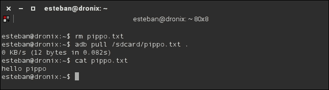

我们已经从当前文件夹中删除了原始文件，使用 `.` 作为目标将设备上的文件拉到当前文件夹，并检查复制的 `pippo.txt` 文件是否包含预期的行，`hello pippo`。

#### 安装 Android APK 文件

正如我们所知，任何 Android 应用都包含在一个 APK 文件中。通常，用户看不到这个文件，因为他们都是通过 Google Play 商店安装所有应用的。作为高级用户，我们经常处理尚未发布的应用，用于调试和测试。这些应用在 Google Play 商店上还没有提供，所以 `adb` 给我们提供了手动安装它们的机会，使用以下命令：

```java
~$ adb install <path to .apk file>

```

下一个截图显示了 APK 文件已成功安装到我们的设备 ZX1B226467 上：

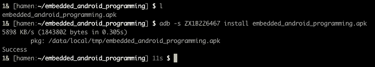

#### Logcat

任何复杂的系统，如 Android，都需要一个日志系统。Android 通过 `logcat` 提供日志功能，以帮助用户进行开发和监控。使用以下命令：

```java
~$ adb logcat

```

我们可以指示 `adb` 连接到 Android 日志系统，选择默认缓冲区，并开始实时将每个系统日志消息打印到我们的终端。Android 为高级使用提供了其他两个日志缓冲区：

+   `radio`：这包含与无线电通信系统相关的所有相关日志消息

+   `events`：这包含与系统事件相关的消息

我们可以使用 `–b` 选项选择一个不同于默认的缓冲区。例如，如果我们想查看所有与事件相关的日志，我们可以使用以下命令：

```java
:~$ adb logcat –b events

```

Adb `logcat` 随附几种有趣的输出模式。我们可以使用 `–v` 选项和模式名称来选择它们：

+   简短

+   颜色

+   长度

+   可打印

+   进程

+   原始

+   标签

+   线程

+   线程时间

+   时间

+   微秒

下一张截图显示了选择 `color` 模式时的 `logcat` 输出：


如您所见，`logcat` 将为每个不同的日志级别使用不同的颜色。我们甚至可以使用以下命令根据日志级别本身进行过滤：

```java
~$ adb logcat *:E

```

在这种情况下，我们只显示错误信息。下一张截图显示了我们可以使用的每个可用过滤参数：

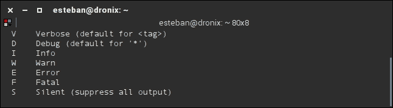

要获取 `logcat` 所有可能选项的完整列表，您可以使用以下命令访问 `logcat` 命令的帮助：

```java
~$ adb logcat –h

```

以下截图显示了所有可用选项及其描述的完整列表：


### Fastboot

Fastboot 是 Android 提供给我们使用计算机和 USB 连接来操作设备闪存及其分区的工具。Fastboot 不与 Android 系统通信。它与能够在一个最小系统环境中交互的特定固件通信：`引导加载程序模式`。

在引导加载程序模式下，系统只初始化完成所有最关键操作所需的最小硬件和软件：

+   `flash`：此选项用于从主机计算机部署新的二进制系统镜像到设备分区

+   `erase`：此选项用于删除特定的分区

+   `reboot`：此选项用于将设备重新启动到可用的引导模式之一：恢复模式、引导加载程序或标准模式

+   `format`：此选项用于格式化特定的分区

下一张截图显示了以下命令的输出，列出了所有可用的 `fastboot` 选项：

```java
~$ fastboot –-help

```

如您所想象的那样，`fastboot` 将在未来扮演重要角色，当我们开始构建和测试我们的自定义 Android 系统时：

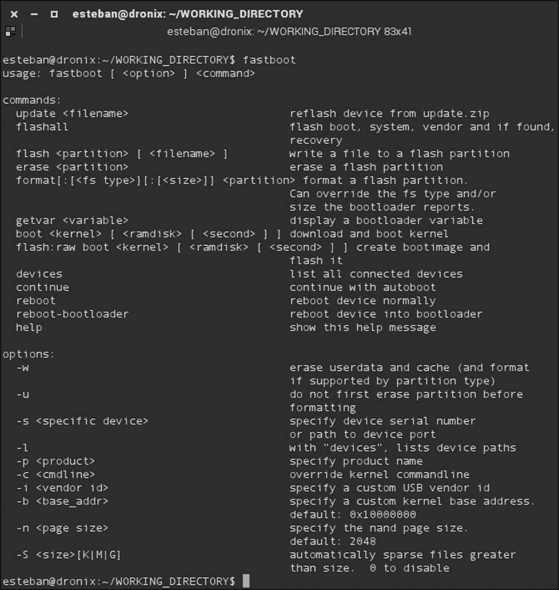

## 选择我们的硬件

在前面的章节中，我们学习了如何获取源代码，构建系统是如何工作的，以及如何为模拟器构建我们的第一个自定义 Android 系统。我们对真实硬件的了解只有：Android 主要用于智能手机和平板电脑，并且我们可以根据 Android **兼容性定义文档 (CDD)** 以及其所有约束和规则来认证我们的硬件。事实是，Android CDD 的目的是提供指导，以便将符合 Google 移动服务要求的设备推向市场。这是关键信息，因为它给了我们在目标不是为大众消费市场开发智能手机或平板电脑时选择不同硬件的自由。

在过去两年中，非智能手机或平板电脑，但能够运行 Android 的设备数量急剧增加。出现了一个全新的生态系统，即所谓的开发板，可以运行 Android 或 Ubuntu Linux 等。这些板中的大多数不符合 CDD 规范——它们没有 Google Play Store、YouTube、Google Maps 等应用程序，但它们仍然运行 Android，并且可以针对 Android CTS 进行测试。这对想要进行实验的制造商或高级用户来说是一个巨大的机会。

这种情况现在成为可能，因为启动 Android 的实际硬件要求现在变得越来越低。记住，Android 基于 Linux 内核，如果剥离 Google 应用生态系统，系统本身也有一些相似之处。如今，大多数配备足够硬件以运行 Linux 的板都有很好的机会运行 Android。

### 硬件架构

我们在 Android 市场上找到的最受欢迎的硬件架构无疑是 ARM 系列，包括 ARMv7 和 ARMv8-A。随着时间的推移，x86 和 MIPS 平台获得了官方支持，并在最近几个月中获得了市场份额。另外，Android 5 Lollipop 引入了对 64 位架构的支持。

#### 最小要求

就像仅仅为了玩游戏而设定的最小要求一样，即使是 Android 本身也是如此。例如，Android 5.1 要求在标准显示密度设备上安装时至少有 512 MB RAM。否则，如果你计划将其移植到高密度显示设备上，你将至少需要 1.8GB RAM。

早期版本对 RAM 的要求较低。例如，Android 4.4 KitKat 只需要 512 MB RAM。不幸的是，KitKat 还有一些其他限制——不支持 64 位架构，并且需要 OpenGL ES 2.0 GPU。

许多其他硬件组件，如摄像头、GPS 传感器、加速度计、陀螺仪、触摸屏等，非常常见，但它们绝对是可选的——如果你的设备不需要摄像头，你可以节省一些钱。你可以根据你的使用案例，从非常基础的系统开始，定制到具体所需。

#### 系统芯片 – SoC

先进嵌入式系统的出现，如智能手机和平板电脑，对新型嵌入式芯片产生了巨大需求——越来越多的小型且功能强大的芯片。当你想到计算机时，你会想到 CPU、主板、显卡以及大量的外部设备。在嵌入式领域，你会想到 SoC。

SoC 代表系统芯片，它超越了 CPU 的简单概念。大多数当前的 SoC 解决方案集成了多核 CPU、RAM 控制器、ROMs、EEPROMs 或闪存、USB 支持、以太网支持、USART、SPI，甚至电源管理系统。所有这些都在一个单独的芯片中，如下一张示例 SoC 架构的截图所示：

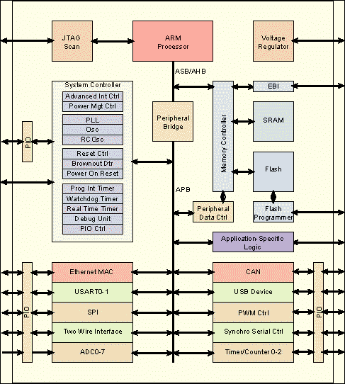

如你所想，这种方法的直接优势是系统的小型化。我们现在可以拥有强大、功能更完整、更复杂的系统，在更小、更小的封装中拥有更小的功耗，以满足市场的每一个需求。

这里最大的玩家如下：

+   三星

+   高通

+   华为

+   美达科

+   英伟达

+   英特尔

+   飞思卡尔

+   德州仪器

+   博通

#### 基带处理器

如果你计划开发智能手机或带有无线电功能的设备，你将需要处理某种**基带处理器（BP）**。基带处理器是一个独立的组件；大多数时候它位于负责所有与无线电通信相关的 SoC 之外。

BP 是一个关键组件，出于安全原因被单独保留。各国政府对无线电组件认证有严格的政策，基本上，每个政府都要求这些组件配备只读固件。由于其性质，BP 通常配备特定的实时操作系统，并通过基于 AT 命令的串行总线与外部世界通信。

### 我们硬件的选择

这本书的主要目标是教授如何为现有设备创建一个自定义系统，以及如何为可以转变为 Android 设备的设备创建一个可工作的 Android 系统。

我们将在这次旅程中使用两个流行的设备：

+   摩托罗拉的谷歌 Nexus 6

+   Aidilab 和 SECO 的 UDOO

#### 摩托罗拉 Nexus 6

在第二章中，我们学习了关于谷歌设备——智能手机、平板电脑等。在这一章中，我们将使用他们目前可用的最新智能手机——Nexus 6。

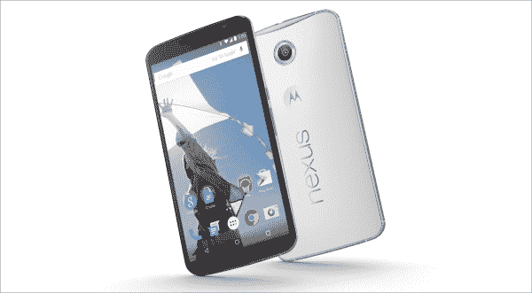

Nexus 6，代号 Shamu，目前是谷歌提供的顶级设备。其技术规格令人印象深刻：

+   高通®骁龙™ 805，四核 2.7 GHz CPU

+   显示 QHD AMOLED，5.96 英寸 2,560 x 1,440 (493 ppi)，16:9

+   后置摄像头：13 MP，LED 闪光灯，f/2.0

+   前置摄像头：2 MP

+   GPU：Adreno 420

+   无线：802.11ac 2x2 (MIMO)

+   蓝牙：4.1

+   NFC

+   RAM：3 GB

+   存储：32 GB 或 64 GB

+   传感器：GPS、陀螺仪、加速度计、光传感器、气压计

+   网络连接：

    +   GSM：850/900/1,800/1,900 MHz

    +   Band WCDMA：1/2/4/5/6/8/9/19

    +   Band LTE：1/3/5/7/8/9/19/20/28/41

    +   CA DL：B3-B5，B3-B8

+   电池：3,220 mAh，无线充电系统

下面的截图显示了内部结构——SoC、电池、显示屏：

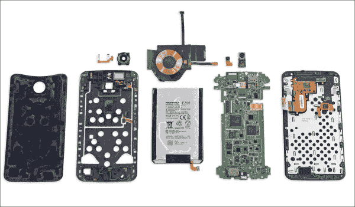

Nexus 6 显然是一个完全符合 CDD 和 CTS 的平台。它配备了完整的谷歌应用包，并将作为我们的参考认证设备。

#### UDOO Quad

与 Nexus 6 完全不同，UDOO 不是一个智能手机或 Google 认证设备——这里没有 Google 应用。它是一个所谓的单板计算机——一个可以配备 Android 或 Ubuntu Linux 的开发和实验板。UDOO 将成为我们的参考板，以证明我们可以从与智能手机相当不同的硬件中创建一个可工作的 Android 系统。

让我们看看它的技术规格：

+   Freescale ARM i.MX6 Cortex A9 四核 1GHz CPU

+   GPU Vivante GC 2000 + Vivante GC 355 + Vivante GC 320

+   Atmel SAM3X8E ARM Cortex-M3 CPU（与 Arduino Due 相同）

+   76 个完全可用的 GPIO：62 个数字 + 14 个数字/模拟

+   RAM：DDR3 1GB

+   以太网最高 1,000Mbit/s

+   板载 micro SD 卡作为主要存储

+   HDMI 端口

+   LVDS 端口

+   Wi-Fi 模块

+   SATA 接口

+   RTC 模块

+   CSI 摄像头连接

+   2 个 USB 端口

+   2 个 3.5" 端口用于麦克风和扬声器！[](img/epub_36702041_63.jpeg)

如你所见，没有传感器——没有花哨的光传感器或陀螺仪，没有加速度计，也没有 GPS。也没有基带处理器——我们无法打电话，但足以在上面运行 Android 了！

#### 注意

你肯定注意到了 Atmel 微处理器。基本上，UDOO 配备了一个嵌入式 Arduino 微处理器，可以用来进一步推动你的实验——去做吧！

## 为实际设备编译 Android

到现在为止，你已经知道了关于构建系统和如何检索源代码所需的一切。检索 Google 官方设备的正确源代码并不是什么大问题，但生活并不总是这么简单。与许多不同的设备一起工作，你肯定会遇到一个不愿意提供源代码的制造商。他们没有法律义务发布它。这是一个不幸的情况，希望将来会被视为不良营销并消失。

对于我们的示例，我们将要玩两个提供良好支持且将完美服务于目的的设备。

### Nexus 6

我们将要探索的第一台设备是摩托罗拉官方的 Google Nexus 6。我们已经对该设备有了概述。如果你想进一步推动它，可以参考官方摩托罗拉 Nexus 6 网页：

[`www.motorola.in/consumers/View-all-Mobile-Phones/Nexus-6-by-Motorola/nexus-6-in.html`](http://www.motorola.in/consumers/View-all-Mobile-Phones/Nexus-6-by-Motorola/nexus-6-in.html)

在第二章中，我们学习了如何检索 Google 官方设备的源代码。我们现在需要知道的是特定的标签来引用：

```java
android-5.1.1_r14
```

当我们有了源代码，我们可以使用设置脚本设置环境，并运行 `lunch` 命令来特别针对我们的 Nexus 6。下一张截图显示了我们是怎样选择设备编号 16，Nexus 6——代号 Shamu：

```java
aosp_shamu_userdebug
```

这里是输出：

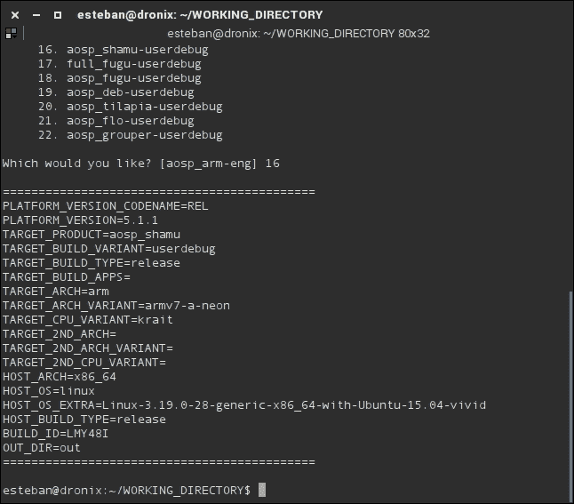

由于安全和版权原因，我们获取的源代码库并不包含构建系统所需的所有内容。现实世界的设备，与模拟器不同，包含必须单独下载的专有软件组件。例如，我们的 Nexus 6 有其三个组件制造商的专有软件：

+   **Broadcom**: NFC、蓝牙和 Wi-Fi

+   **Motorola**: 媒体、音频、热管理、触摸屏和传感器

+   **Qualcomm**: GPS、音频、摄像头、手势、图形、DRM、视频和传感器

软件组件以二进制文件的形式分发，可以在 [`developers.google.com/android/nexus/drivers`](https://developers.google.com/android/nexus/drivers) 下载，查找 Nexus 6，构建代号 LMY48M。下载三个文件并将它们提取到您的 `WORKING_DIRECTORY` 中。下一个截图显示了您的下载文件夹内容，包括三个下载的文件：

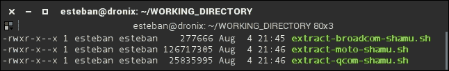

每个下载的包在提取内容后都包含一个脚本，一旦您运行这个脚本，它将显示您需要接受才能继续的许可协议。下一个截图显示了 `extract-broadcom-shamu.sh` 文件的流程：

```java
$ chmod +x extract-broadcom-shamu.sh
$ ./extract-broadcom-shamu.sh

```

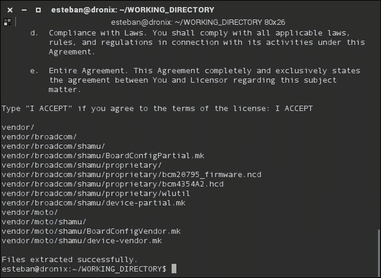

这三个脚本是在启动实际构建过程之前的最终配置步骤。在我们接受所有三个许可协议后，我们可以运行我们信任的 `make` 命令，并耐心等待构建过程完成。

构建过程完成后，`out/target/product/shamu/` 文件夹将包含您为 Google Nexus 6 的第一个 Android 构建。

### UDOO Quad

UDOO 是市场上最受欢迎的开发板之一。硬件一流，用户社区良好，文档详尽，是无数实验的理想工作台。

UDOO 不是 Google 设备，所以我们没有机会使用我们已有的源代码来创建我们定制的 Android 系统。我们必须坚持使用 UDOO 制造商提供给高级用户的源代码。您可以从以下链接下载源代码：

[`download.udoo.org/files/Sources/UDOO_Android_4.4.2_Source_v1.0.tar.gz`](http://download.udoo.org/files/Sources/UDOO_Android_4.4.2_Source_v1.0.tar.gz)

下载文件后，您可以使用终端和以下命令提取它：

```java
$ tar zxf  UDOO_Android_4.4.2_Source_v1.0.tar.gz

```

#### 注意

如您所已了解，目前可用的最后版本的 UDOO Android 源代码库是 KitKat。当我们的冒险结束时，您可以尝试将 Lollipop 移植到这个平台，作为一个新的具有挑战性的 Android 项目。

提取的文件和文件夹看起来与我们在 Nexus 6 中看到的官方 Android 文件夹结构完全一样。唯一的真正区别是 UDOO 为我们提供了几乎所有组件的源代码——您将找到引导加载程序源代码甚至 Linux 内核源代码。引导加载程序和内核将在构建过程中编译，与 Nexus 6 的情况不同，那时我们得到了预编译的文件。Android 系统、引导加载程序和内核将被组合，以创建我们需要部署到 UDOO 的最终镜像集。

#### 设置

在启动`envsetup`脚本之前，我们需要配置环境，以便能够构建引导加载程序。我们将在下一节中学习很多关于引导加载程序的知识。现在，您只需打开您的终端并运行以下命令：

```java
$ export ARCH=arm
"$ export CROSS_COMPILE=$PWD/prebuilts/gcc/linux-x86/arm/arm-eabi-4.6/bin/arm-eabi-
$ export PATH=$PWD/bootable/bootloader/u-boot-imx/tools:$PATH
$ source build/envsetup.sh

```

作为最后的配置步骤，我们需要设置构建系统，以便正确生成适用于我们的 UDOO 的系统镜像：

```java
~$: lunch udoo-eng

```

#### 引导加载程序

一切就绪。我们现在可以编译引导加载程序了。打开终端并导航到`bootloader`文件夹：

```java
$ cd bootbable/bootloader/uboot-imx

```

这个文件夹包含执行引导加载程序编译的可执行文件。按照以下方式运行它：

```java
$ ./compile –c

```

之前的命令将显示一个配置对话框，就像下一个截图中的那样。您将选择您要针对的硬件配置——CPU、RAM 等等。当一切配置妥当后，编译过程将被执行，并将生成引导加载程序二进制镜像：

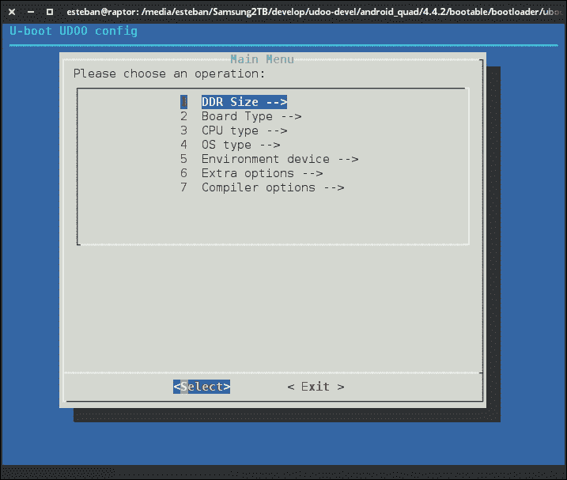

#### 系统

一旦我们有了引导加载程序镜像，我们就可以回到源代码根目录，并使用以下命令启动主系统镜像构建过程：

```java
$ make

```

这可能需要一些时间，所以请耐心等待。像往常一样，当编译完成后，您将在`out/`文件夹中找到所有需要的二进制镜像，准备安装到我们的硬件上并使其活跃起来。

#### 内核

Linux 内核将在 Android 系统构建过程中自动编译。如果您愿意，也可以使用以下命令自行编译内核：

```java
$ make -C kernel_imx imx6_udoo_android_defconfig
$ make bootimage

```

该过程将在`out/`文件夹中生成一个新的`boot.img`。您可以在`kernel_imx/arch/arm/boot`中找到特定的内核文件。

## 引导加载程序模式

上一节指导您创建了第一个系统镜像，准备将其烧录到您的硬件上。这些镜像将被部署到设备内存中。Nexus 6 有一个内置的 Nand 内存。UDOO 有一个相当标准的 SD 卡。部署的第一步是将设备切换到引导加载程序模式。

引导加载程序模式是设备的一种特定状态，允许我们使用`fastboot`实用程序将系统镜像传输和部署到设备本身。每个运行 Android 的设备都有这种模式，但并非每个设备都允许我们访问它。一些设备配备了锁定的引导加载程序，出于安全原因或仅仅是因为制造商的短视。

显然，我们将能够访问我们设备上的引导加载程序：Google 是一个慷慨的制造商，每个 Nexus 设备都配备了未锁定或可解锁的引导加载程序；UDOO 作为开发板，旨在对开发者友好。

### Nexus 设备

每个 Nexus 设备都会让我们访问引导加载程序模式，但每个设备都会以自己的方式完成。根据型号，我们需要一系列特定的步骤来在引导加载程序模式下启动设备。以下表格显示了如何为每个 Nexus 设备执行此操作。请确保关闭您的设备并拔掉 USB 线缆，从表格中选择型号，并按下正确的按钮：


对于我们的 Nexus 6，我们需要按下 *音量下* 然后也按下 *电源* 并保持两者按下。智能手机将启动，您将看到如下截图所示的屏幕：

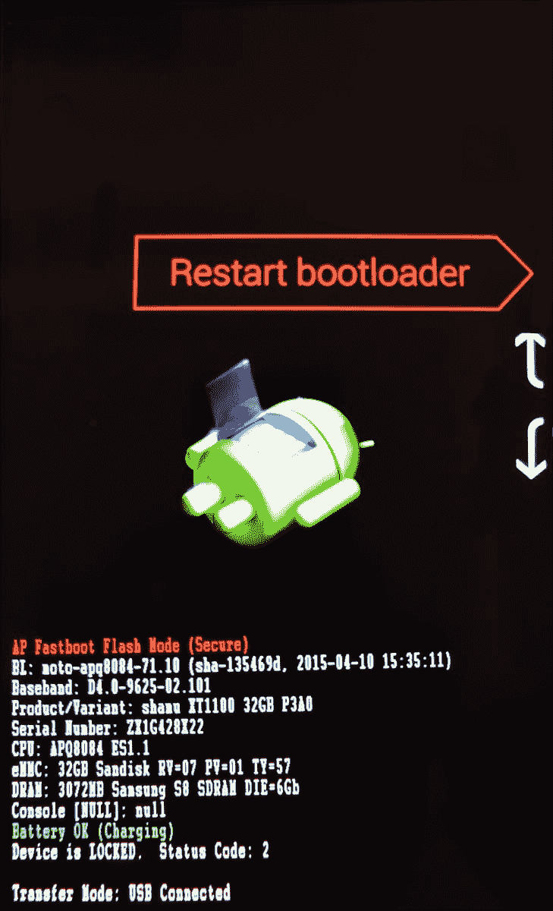

我们现在处于 `Bootloader Mode`！

您首先会注意到的是相当明确的：

*设备已锁定*

正如我们所说，Nexus 设备配备了可解锁的引导加载程序。我们只需将设备通过标准 USB 线缆连接到我们的电脑，打开终端并运行以下命令：

```java
$ fastboot oem unlock

```

您将看到一个警告消息，它会警告您解锁引导加载程序将擦除设备上的所有内容。是的，它会。这很不幸，但从安全和系统角度来看，这是必要的。

#### 注意

这正是考虑数据备份的合适时机。您仍然可以中止进程，重新启动您的智能手机，保存您的数据，然后再次尝试。我们将等待您！

如果您足够勇敢，而且您不再需要手机上的所有小猫图片，只需选择 `YES`，引导加载程序将顺利解锁。如果出于任何原因您希望引导加载程序再次锁定，可以使用以下命令：

```java
$ fastboot oem lock

```

在我们解锁引导加载程序后，我们获得了对 Nand 存储器的完全控制权——我们可以擦除分区或刷入我们创建的系统镜像。不幸的是，Google 没有发布引导加载程序源代码，所以我们不知道他们是如何实现整个 fastboot 协议的。幸运的是，我们将借助 UDOO 来解决这个问题。UDOO 制造商为我们提供了完整的源代码库，包括引导加载程序的源代码。

### UDOO 家族板

UDOO 就像一本打开的书。我们可以几乎不费吹灰之力访问其内存上的每个分区。没有“按钮忍者组合”来切换到引导加载程序模式。我们可以使用串行连接来分析整个引导过程，停止它，并使用控制台与之交互：

1.  连接串行接口

1.  停止引导序列

1.  访问 u-boot 控制台

1.  运行 fastboot

我们现在已准备好 `fastboot 服务器`。有了服务器，我们将能够从我们的电脑连接到 fastboot，使用我们已知的 `fastboot 客户端`。

这个过程可能看起来比 Nexus 的过程要难一些。这是真的。事实是，UDOO 并没有像 Nexus 或市场上任何其他主流智能手机那样配备默认的保密引导加载程序。UDOO 主要是一块开发板，就像很多这样的设备一样，它给你提供了选择你喜欢的引导加载程序的自由和权力。然而，为了更加友好地对待开发者，UDOO 可以与最流行的开源引导加载程序解决方案——`uboot` 完美地协同工作。

`uboot` 解决方案完全符合引导加载程序正确启动操作系统的标准要求——硬件初始化、内存测试等等。它还实现了 fastboot 协议和从构建系统生成的 `boot.img` 中提取内核。这两个特性使得它与 Android 完全兼容。

## 刷 Android 系统镜像

到这里了。拼图的每一块都到位了——你终于可以开始将你全新的自定义 Android 版本安装到你的设备上了。

#### 注意

作为提醒，我们构建了所谓的库存版本的 Android 系统：你在这里找不到任何 Google 应用程序——没有 YouTube，没有 Google Play Store。

### Nexus 6

构建过程完成后，你将在 **out/target/product/shamu** 文件夹中找到你需要的所有系统镜像：

+   `system.img`：这个是，嗯，系统镜像。它包含整个操作系统——Android 框架、系统本地库以及系统实用应用程序，例如计算器或时钟。

+   `recovery.img`：这个镜像包含我们将放置在 *Recovery* 分区中的内容。它包含一个内核和恢复软件本身。

+   `boot.img`：这个镜像包含 Linux 内核和一个小型的 RamDisk。这个镜像将被放置在引导分区中，并将包含初始化系统所需的所有文件：例如 `init.rc`，以及启动系统所需的每一个组件。

每个分区都可以使用特定的分区镜像和适当的命令进行刷写。将你的 Nexus 切换到引导加载程序模式，插入 USB 线，然后刷写几个分区。启动你的终端，导航到 `out/target/product/shamu`，并执行以下命令：

```java
:$ fastboot flash system system.img
:$ fastboot flash boot boot.img
:$ fastboot flash recovery recovery.img
:$ fastboot reboot

```

最后一条命令将重新启动你的设备，你全新的自定义 Android 版本将开始运行！这个系统的第一个版本肯定看起来会很简陋，没有 Google Play Store。没有安装应用程序的可能性，实际上我们几乎无法使用这个设备。请不要露出悲伤的表情！在接下来的章节中，我们将学习如何获取和安装我们需要的 Google 应用程序以及如何定制我们的系统。

作为最后的说明，在这个第一次运行中，我们使用了 Google 提供的 Linux 内核——我们没有从源代码编译它。在接下来的章节中，我们将学习如何进行编译并完全控制。

### UDOO

如往常一样，UDOO 略有不同。我们有几种可能的路径来实现我们的目标，但首先的事情是分区。第一步是准备带有适当分区的 SD 卡。与 Nexus 及其预分区 Nand 内存不同，Nexus 可以直接烧录，UDOO 我们完全控制系统，包括内存分区。

自由和力量伴随着责任——我们需要在安装系统之前创建适当的分区。为了方便开发者，UDOO 开发团队提供了一个方便的脚本来加快这项工作。你的 UDOO 工作目录的根目录中包含一个`make_sd.sh`文件。将 UDOO SD 卡插入你的电脑并检测磁盘号：

+   在 Linux 上，使用`df –f`，你应该寻找类似`/dev/mmcblkX`的东西。

+   在 OS X 上，使用`diskutil list`，你应该寻找类似`/dev/rdisksX`的东西。

一个超级简单的技巧是将 SD 卡插入并记下所有的磁盘号。取出 SD 卡，找出现在缺失的那个！一旦你检测到磁盘号，你可以像这样运行脚本，指定正确的磁盘名称：

```java
$ ./make_sd.sh /dev/mmcblkX

```

脚本将自动擦除 SD 卡，创建分区结构，并复制构建系统在`out/`中生成和部署的所有文件。这可能需要一段时间，具体取决于你的 SD 卡速度。

正如我们所见，为谷歌设备开发相当直接：我们下载源代码并开始配置系统以生成我们的构建镜像。最终我们得到一个可以稍后决定按需定制的系统版本。将 Android 开发或移植到新硬件则完全是另一回事：这相当不同，需要一些努力和承诺。

当你决定开始这样的旅程时，第一步是选择合适的硬件平台。市场提供了大量的供应商，每个供应商都提供他自己的特定解决方案——不同的 SoC、不同的板载传感器、便宜的低端板或超快的昂贵板。这本书中没有讨论选择昂贵板或不选择昂贵板的讨论空间。我们专注于开发者和他们的世界，作为一个专业人士，99%的时间他们都会发现自己在与所谓的参考板打交道*。

**参考板**是一种特殊类型的发展板，每个供应商都向其潜在客户提供。通常，参考板会配备尽可能多的板载组件——大量的传感器、大量的外部设备、大量的连接器以及可能的应用目的。最终目标是向开发者提供一个能够真正展示 SoC 和整个硬件解决方案全部潜力的板子。一切都是为了使开发者的生活更轻松：提供了 Linux 内核源代码，提供了硬件组件规格，并提供了文档。

在本章中，我们使用的 UDOO 板可以被认为是参考板。它没有每个可能传感器，但它很容易通过外部传感器进行扩展，并且我们知道如何与这些传感器通信，因为平台是开放的且易于调试。一种调试我们软件和硬件的简单方法是至关重要的，这有助于使我们的开发时间更有效。

UDOO 配备了一个方便的 micro-USB 连接，它也是一个串行到 USB 转换器。使用此连接，我们可以在最低级别的监视器之一与板子交互并操作启动序列。为了正确连接到板子控制台，我们需要在计算机上安装特定的软件：一个名为 `minicom` 的调制解调器控制和终端仿真器。

您可以使用 `apt-get` 在 Ubuntu 上安装它：

```java
$ sudo apt-get install minicom

```

您可以使用 `brew` 在 OS X 上安装它：

```java
$ brew install minicom

```

当我们有了 `minicom`，我们可以将关闭的 UDOO 连接到 USB 端口，并在我们的终端上运行以下命令：

```java
$ minicom –b 115200 –D /dev/ttyUSB0

```

`ttyUSB0` 是操作系统与 UDOO 连接关联的系统设备。在您的系统中，它可能不同，例如 `ttyUSB1`、`ttyUSB2`，这取决于硬件配置、其他连接的 USB 设备等因素。可能需要进行一些尝试和错误。

现在，我们可以插入电源线并打开板子。如果连接配置正确，您将看到以下截图所示的启动序列：

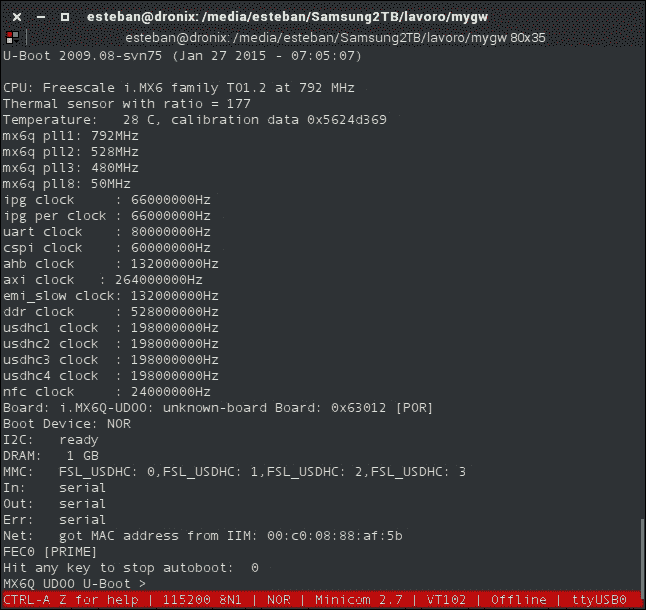

我们可以通过几种有趣的方式监控启动序列并与系统交互。我们现在感兴趣的是停止启动序列并切换到引导加载程序模式。

在启动序列过程中，您将看到一条消息，提示如何停止启动序列本身并访问 `uboot`。一旦进入，按照以下截图所示运行 `fastboot`：

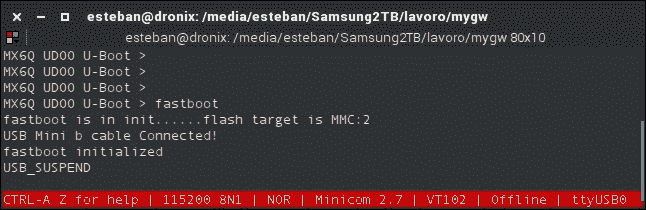

现在，我们可以刷写我们拥有的系统镜像：

```java
$ fastboot flash system system.img
$ fastboot flash boot boot.img
$ fastboot flash recovery recovery.img
$ fastboot reboot

```

在保持串行连接的情况下，当系统重启时，我们可以享受启动序列提供的所有系统消息：系统初始化和 Linux 内核加载，直到我们达到 Android 加载并完成 Android 系统控制台提示。这正是深入访问和了解您的系统和硬件的美丽与力量。以下截图显示了内核部署精确时刻的启动序列的一部分：

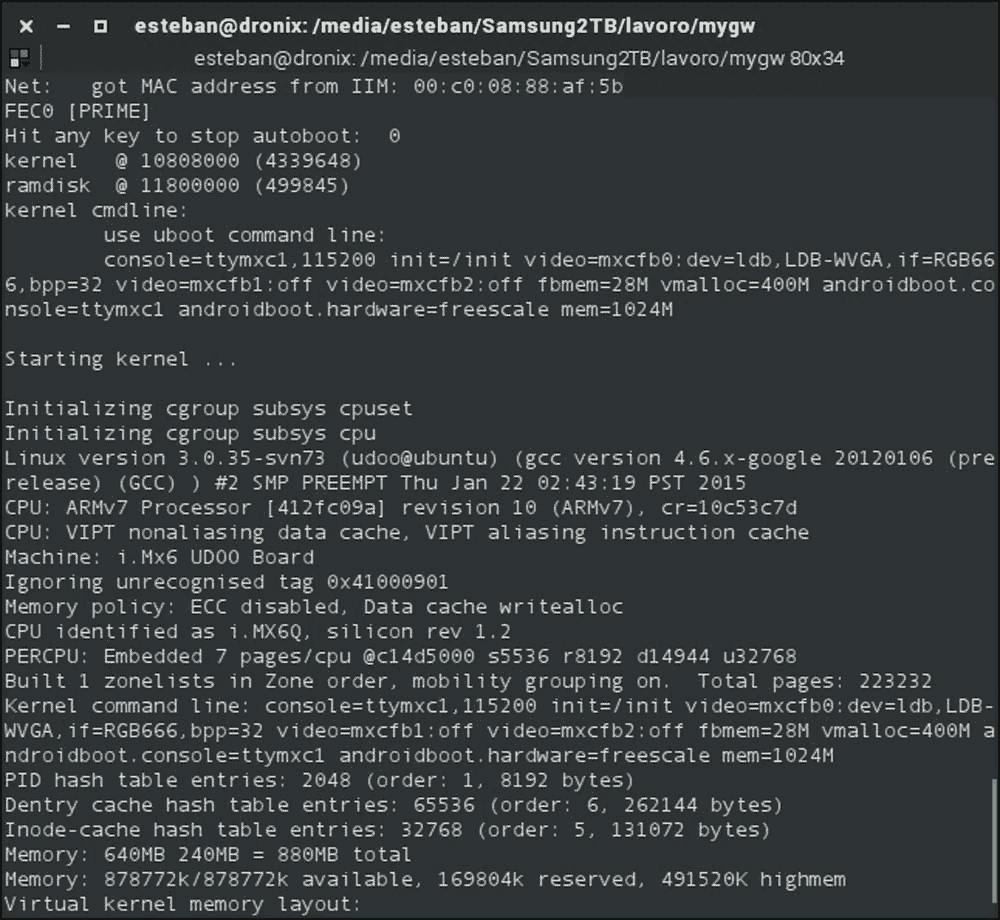

## 摘要

在本章中，您为实际设备构建并安装了您的第一个 Android 系统。您现在对 Google Nexus 6 和 UDOO 板了解得更多。您已经学习了如何使用 ADB 和 Fastboot。您已经学习了如何通过串行连接和 minicom、监控以及操作启动序列等工具与开发板交互。

在下一章中，我们将深入了解 Linux 内核的构建和定制。
