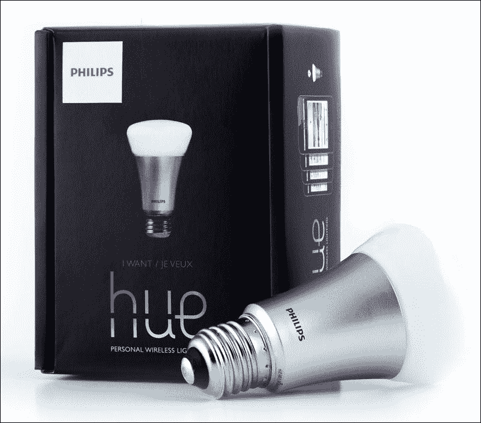

# 第八章\. 超越智能手机

在第七章，*定制您的个人 Android 系统*中，你学习了如何给你的定制 Android 系统添加最后的个人风格。你定制了应用层和系统层：新的菜单、新的应用和新的守护进程。

在本章中，我们将更进一步：我们将*超出*智能手机，连接到外部微控制器、传感器和不同的设备。我们将看到整个世界如何与 Android 连接和互动。

你将了解 Android ADK 和 Arduino，以及谷歌如何用 Android 导向的设备丰富我们的生活：从 Chromecast 设备到 Android Auto，从智能手表到物联网。

## 认识 Arduino

十多年前，在一个小意大利酒吧里，一群学生和研究人员创造了一个低成本微控制器，它将彻底改变 DIY（Do It Yourself）的世界——**Arduino**，如下一张图片所示：


Arduino（或 Genuino，非美国市场）的最新版本被称为 Arduino **UNO**。**Uno**在意大利语中意味着*一个*，这个代号是为了庆祝板子自带的 IDE（集成开发环境）的第一个稳定版本。这个板子基于 Atmel 的 ATmega328P，提供了一套可控制的输入/输出引脚。一旦被正确编程，它可以作为一个独立的微控制器工作，并且可以通过其 USB 连接使用。

Arduino 最伟大的特点是它的开放性：从硬件原理图到开发 IDE，一切自第一天起就都是开源的。这种开放性和板子的可扩展设计允许制造商和高级用户创建无限数量的所谓**扩展板**：


Arduino 扩展板是一个可以附加到 Arduino 上以增强其功能和添加新功能的独立组件。上一张图片展示了如何堆叠 Arduino 扩展板以创建一个完全新定制的设备。Arduino 扩展板的常见例子包括：

+   Ethernet Shield，它使 Arduino 能够通过互联网连接与外界通信。

+   Proto Shield，它可以用来制作你用面包板创建的原型的*永久*版本。

+   Relay Shield，它使 Arduino 能够控制高压电路。这在家庭自动化中至关重要，当你需要开关灯或电器时。

+   Display Shield，它为 Arduino 提供了一种与外界进行视觉通信的方式。

自从 Arduino 问世以来，它获得了越来越多的粉丝和热情的开发者，这得益于其易于使用的界面和极低的学习曲线。今天，没有硬件或电子知识的软件开发者也可以创建超出他们电脑的项目，并能与外部世界互动。为了利用这些可能性，2012 年谷歌创建了 Android ADK。

### Android ADK

Android Accessory Development Kit 是 Android Open Accessory 设备的参考实现。在 2012 年的 Google I/O 大会上，谷歌向开发者提供了 Android Accessory Development Kits，并为制造商提供了创建他们自己的套件、为 Android 创建外部配件设备的明确规范。这些认证设备之一就是 Arduino 本身，但多亏了整个项目的开放性，你自己也可以构建一个兼容设备。

不幸的是，Android ADK 在开发者中从未真正*火爆*。当然，你可以在网上找到许多关于将 Android 智能手机连接到 Arduino 的有趣项目，比如 TCRobotics 在[`blog.bricogeek.com/noticias/arduino/el-adk-de-google-en-un-arduino-uno`](http://blog.bricogeek.com/noticias/arduino/el-adk-de-google-en-un-arduino-uno)上的项目。这肯定是我们最喜欢的之一；它展示了巨大的潜力，但也揭示了保持 Android 智能手机**有线**连接到整个过程的巨大牺牲：


幸运的是，对于 Android ADK 的使用，有更多酷炫的方式来与传感器和电子设备互动。

### 使用 UDOO 作为一体化的 ADK 设备

如你所知，UDOO 可以运行 Android。你可能不知道的是，它上面还内置了 Arduino。是的，Android 和 Arduino 都在同一块板上！当你想到你可以将触摸屏，甚至鼠标和键盘连接到 UDOO 时，你很快就会开始幻想你那些极客项目的实现。

#### 准备工作

要开始使用 Arduino，你只需要设置 UDOO 并将 Android 部分连接到 SAM3X（Arduino 兼容）部分。以下图片展示了从上方看到的 UDOO，左侧高亮显示的是跳线 18。这个跳线必须拔掉才能启用 SAM3X。右侧也高亮显示了你要连接的 USB 端口：


一旦板子准备就绪，你就可以进入软件部分。

#### 刷写 Arduino 板

在这个快速示例中，我们将控制连接到 UDOO 的 LED。LED 将连接到 UDOO 板的输入 13。每个 LED 都有两个引脚；较长的那个是阳极，必须连接到输入 13，较短的则是阴极，必须连接到地，即输入 13 左侧的无编号输入：


电子设备设置已经就绪。让我们从[`www.udoo.org/other-resources/`](http://www.udoo.org/other-resources/)下载 Arduino IDE。

第一次运行 Arduino IDE 时，你会看到一个空的项目文件：


这个空的 Arduino 草图为你提供了我们的 Arduino 程序的骨架结构：

+   一个只运行一次并设置第二方法所需一切的`setup`方法

+   一个不断重复运行的`loop`方法，直到板子被关闭

为了正确连接和编程我们的 Arduino，我们需要选择板型和端口。从 Arduino IDE 工具菜单中选择**板** *|* **Arduino Due (编程端口)**：


上一张图片显示了目前市场上可用的不同 Arduino 板数量。UDOO 与 Arduino Due 兼容，因此我们选择了该板型。一旦我们选定了合适的板型，我们需要选择用于连接到 UDOO 的**端口**：


如你在图中所见，端口名在不同的电脑上可能会有所不同。上一张图片显示了苹果 MacBook Pro 的常见配置。

一旦 IDE 配置正确，我们就可以开始编写源代码，如下所示：

```java
#include "variant.h"
#include <stdio.h>
#include <adk.h>

#define  LED_PIN  13

// Accessory descriptor. It's how Arduino identifies itself to Android.
char descriptionName[] = "ArduinoADK"; 
char modelName[] = "UDOO_ADK";           // Arduino Accessory name (Need to be the same defined in the Android App)
char manufacturerName[] = "Packt";     // Manufacturer (Need to be the same defined in the Android App)

char versionNumber[] = "1.0";            // version (Need to be the same defined in the Android App)
char serialNumber[] = "1";
char url[] = "http://www.packtpub.com";      // If there isn't any compatible app installed, Android suggest to visit this url

USBHost Usb;
ADK adk(&Usb, manufacturerName, modelName, descriptionName, versionNumber, url, serialNumber);

#define RCVSIZE 128
uint8_t buf[RCVSIZE];
uint32_t bytesRead = 0;

void setup() {
    Serial.begin(115200);   
    pinMode(LED_PIN, OUTPUT);
    delay(500);
    Serial.println("Starting...");
}

void loop() {
    Usb.Task();

    if (adk.isReady()) {
      adk.read(&bytesRead, RCVSIZE, buf);// read data into buf variable
      if (bytesRead > 0) {
        if (parseCommand(buf[0]) == 1) {// compare received data
          // Received "1" - turn on LED
          digitalWrite(LED_PIN, HIGH);
        } else if (parseCommand(buf[0]) == 0) {
          // Received "0" - turn off LED
          digitalWrite(LED_PIN, LOW); 
        }  
      }
    } else {
      digitalWrite(LED_PIN , LOW); // turn off light
    }  

    delay(10);
}

// the characters sent to Arduino are interpreted as ASCII, we decrease 48 to return to ASCII range.
uint8_t parseCommand(uint8_t received) {
  return received - 48;
}
```

我们可以快速分析源代码，并找出：

+   我们指定了引脚号 13

+   我们指定了模型名称、制造商名称和版本号，这些信息将识别我们连接到 Android 的板型。

+   我们正在配置串行连接

+   我们正在监听串行连接上的传入数据，并相应地做出反应：

    +   如果我们收到 1，则打开 LED

    +   如果我们收到 0，则关闭 LED

一旦源代码就绪，你可以使用 IDE 的**文件** | **上传**菜单将其烧录到 Arduino 上。

#### 创建 Android 应用

Android 应用将非常简单：一个切换按钮来打开和关闭 LED。你可以使用 Android Studio 向导创建初始应用，创建一个空的`Activity`以开始。一旦有了框架，你需要在`build.gradle`中添加一个新的依赖项：

```java
dependencies {
    compile 'me.palazzetti:adktoolkit:0.3.0'
}
```

Emanuele Palazzetti，Packt Publishing 出版的《入门 UDOO》一书的作者，发布了一个实用的 Android 库，ADK Toolkit ([`github.com/palazzem/adk-toolkit`](https://github.com/palazzem/adk-toolkit))，用于简化你的 Android 应用和 Android ADK 设备之间的通信，我们将充分利用这个库。

你需要在你的 AndroidManifest 中添加一些特定的配置。在你的`<activity>`标签中，添加以下行：

```java
<intent-filter>
  <action android:name="android.hardware.usb.action.USB_ACCESSORY_ATTACHED"/>
</intent-filter>
<meta-data
  android:name="android.hardware.usb.action.USB_ACCESSORY_ATTACHED"
  android:resource="@xml/accessory_filter"/>
```

如你所注意到的，`<meta-data>`标签引用了一个名为`accessory_filter`的 XML 资源。目前它缺失。让我们在`src/res/xml/`文件夹中创建一个`accessory_filter.xml`：

```java
<?xml version="1.0" encoding="utf-8"?>
<resources>
  <usb-accessory
    manufacturer="Packt"
    model="UDOO_ADK"
    version="1.0"/>
</resources>
```

这是我们在 Arduino 草图中所添加的确切信息，将允许 Android 正确识别我们的板型。

设置完成。让我们继续到我们应用的 UI。遵循向导后，你现在有一个带有自己布局的单个`Activity`；很可能是它的名字是`main.xml`，位于`src/res/layout`。一旦你找到了布局，我们可以添加我们的按钮：

```java
<ToggleButton 
 android:id="@+id/toggleButtonLED"
 android:textOn="Turn OFF" 
 android:textOff="Turn ON" 
 android:layout_width="500dp" 
 android:layout_height="200dp" 
 android:layout_centerVertical="true" 
 android:layout_centerHorizontal="true"
 android:textSize="50sp"
 android:onClick="blinkLED"/>
```

这非常直接：一个 ID，几个标签，以及一个当按钮被点击时触发的`onClick`方法。

由`onClick`引用的方法将被放置在我们的`Activity`中：

```java
public void blinkLED(View v) {
    if (buttonLED.isChecked()) {
        adkManager.write("1");
    } else {
        adkManager.write("0");
    }
}
```

当按钮被点击时，如果是开启状态，我们发送`1`；如果是关闭状态，我们发送`0`。这很公平，但我们把数据发送到哪里？那个`adkManager`是什么？

`adkManager`模块随 ADK Toolkit 提供。我们在`Activity`中创建它并设置它。这是最终的结果：

```java
public class UDOOBlinkLEDActivity extends Activity {

    private ToggleButton buttonLED;

    private AdkManager adkManager;

    @Override
    public void onCreate(Bundle savedInstanceState) {
        super.onCreate(savedInstanceState);
        setContentView(R.layout.main);
        buttonLED = (ToggleButton) findViewById(R.id.toggleButtonLED);

        adkManager = new AdkManager(this);
        registerReceiver(adkManager.getUsbReceiver(), adkManager.getDetachedFilter());
    }

    @Override
    public void onResume() {
        super.onResume();
        adkManager.open();
    }

    @Override
    public void onPause() {
        super.onPause();
        adkManager.close();
    }

    public void blinkLED(View v) {
        if (buttonLED.isChecked()) {
            adkManager.write("1");
        } else {
            adkManager.write("0");
        }
    }
}
```

最后，我们的应用完成了。只需将其上传到我们的 UDOO，您将有一个巨大的按钮来打开和关闭 LED：


## 探索物联网的可能性

知道您最喜欢的操作系统可以在数千种设备上运行，在数百种不同的定制中，并且可以与任何类型的设备通信，无论是有线还是无线，这开辟了令人难以置信的可能性。

### Android Auto

2014 年，谷歌推出了 Android Auto，这是一个旨在使用我们汽车中已有的控制命令 Android 系统的创新项目：


2015 年，Android Auto 的第一个版本发布，开发者社区开始真正关注它。2016 年，数十家汽车制造商将推出支持集成 Android Auto 的车型。

Android Auto 背后的理念是支持驾驶安全，并在驾驶时为用户提供一种访问其设备的替代方式。为了实现这一目标，谷歌工程师与汽车制造商合作，在 Android 设备和汽车仪表盘之间建立了一座桥梁。

汽车仪表盘和控制代表了我们驾驶时可能拥有的用户体验和交互的顶端。一切都被放置得恰到好处，以便于访问，一切都被设计得易于使用，一切都被创造得既有效又强大，但又不分散注意力。

这些限制迫使谷歌重新思考他们为这个新挑战而流行的应用。当您将 Android 智能手机连接到 Android Auto 兼容的汽车时，您可以享受一个针对特定场景定制的不同操作系统用户界面。下一张图片显示了 Android Auto 的 Google Maps 界面：


下一张图片显示了连接我们的设备到 Android Auto 兼容汽车后，Google Play Music 的用户界面：


如 Google Maps 或 Google Play Music 等流行应用演变成更有效的设计，充分利用了仪表盘更大的屏幕和方向盘控制。

从开发者的角度来看，Android Auto 带来一个明显的问题：

> *我需要一辆车来开发和测试我的应用吗？*

幸运的是，谷歌为那些想要接触 Android Auto 的人提供了测试工具：**桌面车载单元**（**DHU**）。它随 Android SDK 一起提供，在您的计算机上运行，并允许您的计算机充当汽车仪表盘。以下图片显示了智能手机如何切换到 Android Auto 模式，以及用户界面如何切换到 DHU：


上一张图片展示了将智能手机连接到汽车后，智能手机显示屏的外观——它变黑并显示了 Android Auto 标志。下一张图片展示了将智能手机连接后，汽车仪表盘如何变得活跃。汽车仪表盘变成了 Android Auto 用户界面，在这个例子中，显示了几个 Google Now 卡片，包括交通和天气信息：


### Android Wear

当我们等待 Android Auto 功能的车款进入我们的生活时，我们可以将注意力转向 Android Wear。

2014 年，谷歌宣布了一种特定的 Android 版本，专门为智能手表设计和开发。Android Wear 最初是基于 Android 5.0 Lollipop 的定制版本，目前基于 Android 6.0.1 Marshmallow。

Android Wear 旨在增强用户每天与世界互动的方式。一款 Android Wear 智能手表连接到 Android 智能手机，并提供更快地访问通知、消息以及所有可能的、在不与智能手机本身交互的情况下以更好的方式享受的内容：


像上一张图片中的那样的智能手表提供了与数十个服务的集成，例如 Google Fit、Endomondo 和 IFTTT。它们具有蓝牙和 Wi-Fi 连接性、GPS 和加速度计。这一巨大的可能性推动 Android 社区进行实验，并为数十种场景创造解决方案。

在 Android SDK 和 Android 社区的支持下，在过去两年里，我们看到为智能手表量身定制的应用程序数量不断增加——我们可以用我们的手表打开我们的飞利浦 Hue 灯，我们可以用我们的手表关闭我们的 Google Nest，我们可以通过 Parrot Flower Power 了解我们植物的状态。

沿着这条道路走下去，将直接带我们进入下一节。

## 智能家居

我们生活在一个许多设备、家电和“事物”原本是*未连接*的世界，现在却成为了不断增长的互联设备生态系统中的一部分。我们来自一个过去，计算只能在我们的电脑中发生——我们现在生活在这样一个当下，计算发生在我们的口袋里，通过我们的智能手机。我们正朝着这样一个未来迈进，计算将在任何地方发生：手表、汽车、无人机、房屋、花园等等。

我们曾经有需要手动控制的恒温器，现在我们有智能恒温器，例如 Google Nest，它们会从我们的习惯中学习并相应地做出反应，以创造更好的用户体验：


我们以前需要用墙上的开关来打开和关闭灯光，现在我们有智能灯泡，比如飞利浦 Hue，可以通过智能手机甚至智能手表来控制。这些灯泡在我们接近家的时候可以自动打开，利用地理围栏等概念。我们有可以与其他设备互联的灯光，比如智能门铃，可以为听力受损的用户创建视觉触发器：



我们有植物传感器，比如 Parrot Flower Power，可以在我们的智能手机上显示通知，告诉我们我们的植物需要浇水。知道了这一点，即使我们在数千公里外的某个偏远海滩上，享受着假期，我们也可以远程命令 Belkin WeMo 开关打开我们的灌溉系统并给植物浇水。

我们有智能冰箱，比如三星 Family Hub，它们连接到互联网，并允许你实际上*看到*冰箱内部，检查明天早餐的橙汁是否缺少。它们变得越来越互联，韩国版本将知道你最喜欢的产品的可能折扣，并建议你检查哪个特定的超市以节省一些钱。

我们有智能镜子，比如汉娜·米特尔施泰特（Hannah Mittelstaedt）制作的那个（[`github.com/HannahMitt/HomeMirror`](https://github.com/HannahMitt/HomeMirror)），可以用你的一部旧安卓设备轻松创建。给你的旧平板电脑赋予新的生命和新的用途。它可以提供天气预报、最新新闻、植物状态、交通信息，或者在你早上刷牙时你想拥有的任何有用信息。

我们有智能咖啡机，比如**Nespresso Prodigio**，它可以告诉我们水位、剩余咖啡胶囊和必要的维护情况。咖啡机可以远程控制，从沙发上操作，而且在我们历史上，这个经典的笑话不再是笑话了；我们的安卓手机实际上可以为我们煮咖啡！

## 一个绿色的机器人能让你娱乐吗？

> *一旦人类满足了所有基本需求，就开始与无聊作斗争了！*

好吧，可能有点夸张了，但我们正在进入娱乐部分，所以让我们来谈谈一些有趣的事情吧！

### 多媒体

娱乐是一个巨大的市场，谷歌很快就跳了进来，推出了它的 Nexus Player 和 Chromecast 设备：


上一张图片展示了谷歌 Chromecast 的最新型号。当谷歌进入这个市场时，他们决定为用户提供一个尽可能容易设置的设备。谷歌 Chromecast 有一个 HDMI 接口和一个 USB 电源线；仅此而已。你将 HDMI 连接到电视上，连接电源，现在你的电视就可以连接到你的智能手机了。

你的智能手机变成了遥控器，只需几点击，你就可以开始流式传输你想要的任何多媒体内容，直接到你的电视：你偏好的 YouTube 频道，你从 Google Play Store 偏好的电影，你从 Google Play Music 的音乐，以及数百个第三方应用都可以成为内容来源。

如果你不喜欢看电视，而你是一个音乐迷，谷歌的 Chromecast Audio 可以满足你的需求：


至于 Chromecast，Chromecast Audio 连接到你的 Hi-Fi 系统非常简单，并且可以通过你可以在 Android 智能手机上安装的 Chromecast 应用轻松设置。

其中一个关键特性是它可以通过家庭 Wi-Fi 系统建立独立的 Wi-Fi 连接，因此它可以被指令播放你的音乐，而不是要求你的手机将音乐流式传输到 Chromecast Audio。你可以使用智能手机控制它，但不会耗电，因为你的手机和 Chromecast Audio 之间没有持久的 Wi-Fi 或蓝牙连接。

### 玩具

现在，当我们想到由 Android 供电的玩具时，我们只能想到无人机！


最受欢迎的，如图中所示的 Parrot ARDrone，设定了标准并推动了市场的发展。随着时间的推移，出现了许多商业替代品，但就像智能镜子一样，遥控玩具社区也完全转向了 DIY。

在 2015 年都灵 Droidcon 黑客马拉松期间，我们展示了如何在 24 小时内使用 Android 设备通过 Wi-Fi 控制由 UDOO 供电的遥控车……[`www.hackster.io/team-dronix-alter-ego/dronixcar-37b81a?f=1#`](https://www.hackster.io/team-dronix-alter-ego/dronixcar-37b81a?f=1#)：


这款遥控车配备了视频摄像头，实时流媒体传输到智能手机。智能手机充当视频消费者和遥控器。

整个项目以开源的形式发布，遵循经典的 Android/Linux 传统。

## 摘要

我们的旅程结束了！这是一段相当刺激的过山车之旅，从操作系统的历史到它如何让设备准备好与外部世界通信。你学习了如何获取设备的源代码，如何导航源文件夹树，以及如何创建完美的设置来正确构建纯净的 Android 系统。

你开始升级系统，添加自定义功能，以丰富用户体验，提高性能，并添加对您自己的硬件的支持。你深入到引导序列的内部结构，以进一步自定义系统。然后你回到表面，自定义架构金字塔的最高部分，即用户界面，为用户提供终极定制的 Android 系统。

最后，你看到了如何轻松地摆脱 Android 设备本身，发现一个由 Android 平台驱动的设备世界，这些设备正等待通信和交互。

我们的旅程已经结束，但你的旅程才刚刚开始！掌握你所学的知识，进行实验，尝试你的想法，失败，学习更多，再次尝试，最终成功！

Android 是一个强大的工具；你可以用它将你疯狂的想法变成现实！
