# 熟悉 Xcode

那么，你想要进入 iOS 开发领域吗？我在 2010 年 1 月 27 日站在你的位置上，当时苹果公司首次宣布了 iPad。实际上，会议一结束，我就知道我想学习如何为 iPad 创建应用。我注册了 Apple 开发者网站并支付了 99 美元的年度费用。但是，我意识到我不知道从哪里开始。由于 iPad 尚未发布，所以没有大量的教学书籍或视频。我之前有编程经验；然而，我不知道如何编写 Objective-C（iOS 的原始编程语言）。因此，我不得不自学基础知识。在这本书中，我们将一起学习成为 iOS 开发者所需的一切。

如果你是编程新手，请慢慢来。你应该在进入下一章之前理解每一章的内容。这些重要的技能将为你打下 iOS 开发的坚实基础。如果你有之前的编程经验，你仍然应该复习前面的章节，因为它们将为你提供复习的机会。

在这本书的整个过程中，我们将在 Xcode 中工作，特别是 Xcode 9（以及我们将在本书后面解决的 Swift 4）。Xcode 被称为**集成开发环境**（**IDE**）。使用 Xcode 为我们提供了构建 iOS、tvOS、macOS（以前称为 OS X）和 watchOS 应用所需的一切。在本章中，我们将探索 Xcode，以帮助您更舒适地使用它。如果您不在 Xcode 9 上，请确保更新 Xcode，因为本书中的代码否则将无法正常运行。

本书将重点关注创建一个通用的 iOS 应用（适用于 iPhone 和 iPad 的应用）。最好的方法是创建一个项目，以便熟悉所有内容的位置以及如何找到所需的内容。因此，让我们首先下载并安装 Xcode。

# 开始学习

为了下载 Xcode，请在您的 Mac 上打开 App Store，然后在右上角的搜索栏中输入`Xcode`：

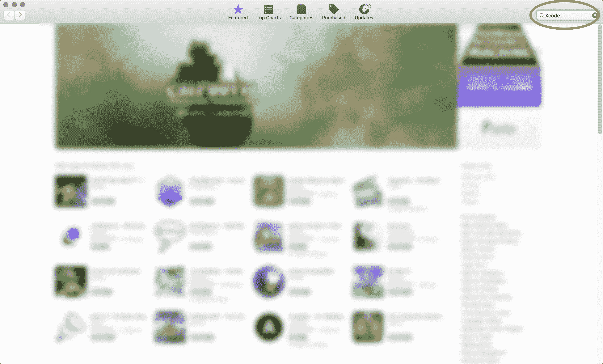

为了提高图片质量，请从[`www.packtpub.com/sites/default/files/downloads/LearniOS11ProgrammingwithSwift4SecondEdition_ColorImages.pdf`](https://www.packtpub.com/sites/default/files/downloads/LearniOS11ProgrammingwithSwift4SecondEdition_ColorImages.pdf)下载图形包。

接下来，点击“安装”：

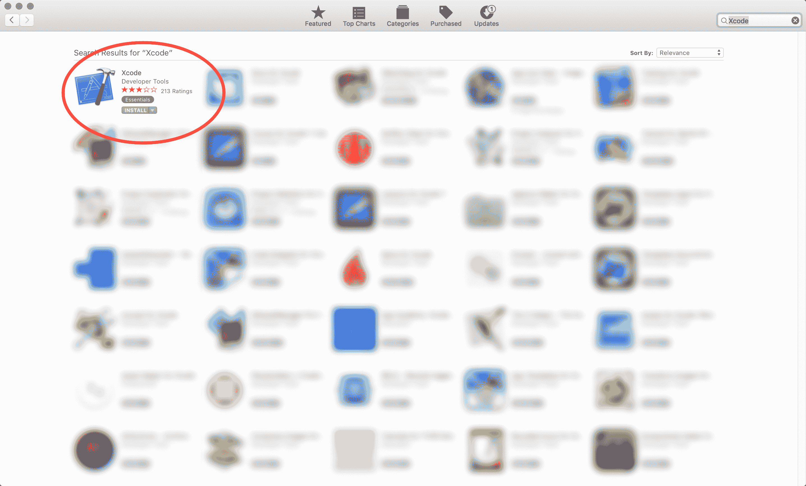

安装完成后，启动 Xcode，你应该会看到以下欢迎屏幕：

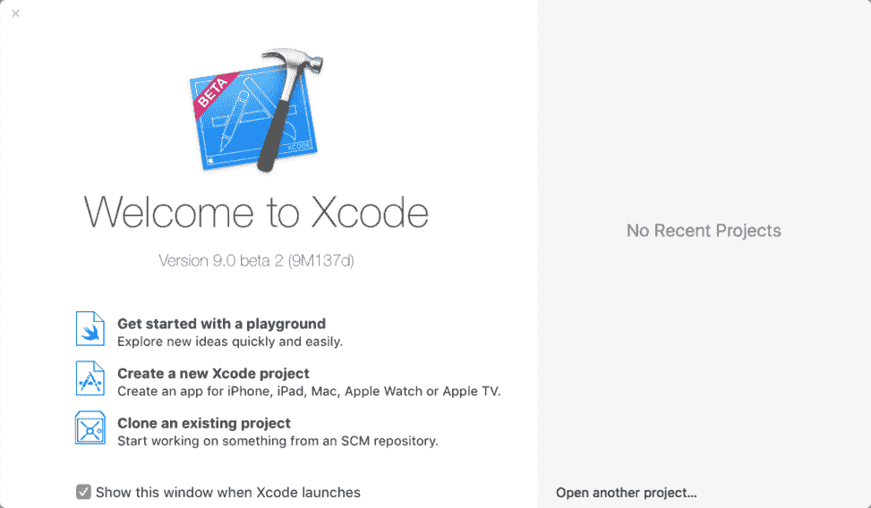

如果你这是第一次启动 Xcode，那么你将在右侧面板中看到“无最近项目”。如果你之前创建过项目，那么你将在右侧看到它们列出来。为了开始，我们将点击欢迎屏幕左侧面板中的“创建一个新的 Xcode 项目”。这将带我们到新项目屏幕：

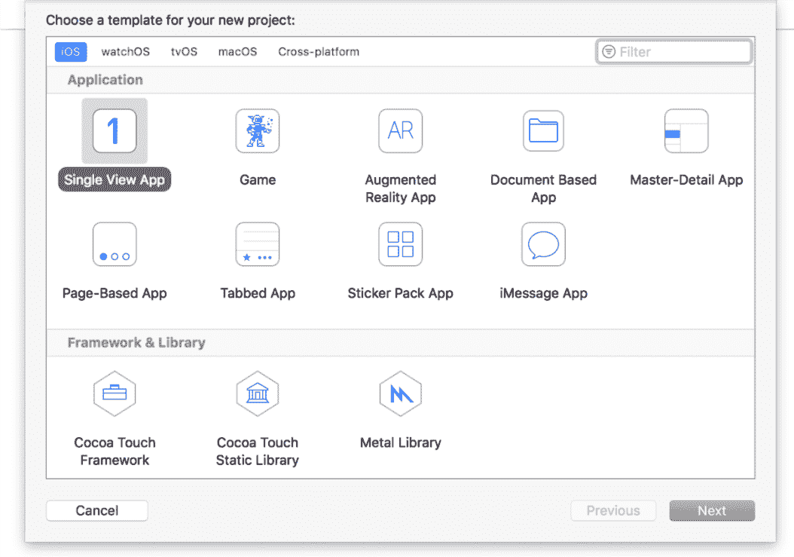

在屏幕顶部，你可以选择以下项目之一：iOS、watchOS、tvOS、macOS 和跨平台。由于我们正在为 iOS 创建应用，请确保已选择 iOS。然后，选择“单视图应用”并点击“下一步”。现在，你将看到一个新项目的选项屏幕：

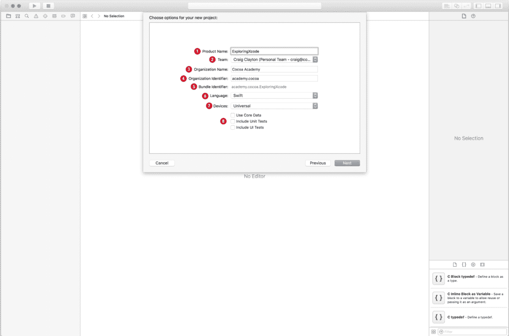

这个选项屏幕有以下七个项目需要完成或选择：

1.  产品名称：产品名称是你的应用。我们将将其设置为`ExploringXcode`。

1.  团队：团队与你的苹果账户相关联。我们现在将忽略这一点，因为它对这个章节不是必需的。如果你已经设置了团队，就保持原样。我们将在本书的后面部分详细介绍这一点。

1.  组织名称：你可以将组织名称设置为你的公司名称或只是你的名字。

1.  组织标识符：你将设置组织标识符为你的域名反序。例如，我的网站 URL 是`cocoa.academy`，因此，我的标识符是`academy.cocoa`。由于 URL 是唯一的，这将确保不会有其他人拥有你的标识符。如果你没有域名，那么现在就使用你的名字和姓氏。如果你想要将应用提交到苹果商店，你最终将不得不购买一个域名。

1.  包标识符：当你创建一个新项目时，苹果会将你的产品名称与你的组织标识符结合起来，以创建你唯一的包标识符。因此，即使有 10,000 人创建这个项目，每个人也将有不同的包标识符。

1.  语言：确保你的语言设置为 Swift。

1.  复选框：你可以取消选中“使用 Core Data”、“包含单元测试”和“包含 UI 测试”，因为这些是我们在这个章节中不会用到的。

现在，选择“下一步”，Xcode 将提示我们保存项目。我有一个专门的项目文件夹，但你可以将其保存在桌面上以便于访问。

# Xcode 界面

你的项目现在已打开，是我们熟悉所有面板的时候了。如果你是第一次使用 Xcode，那么这可能会让你感到有些不知所措。因此，我们将将其分解为五个部分：

+   **导航面板**

+   **标准编辑器**

+   **工具面板**

+   ****调试面板****

+   **工具栏**

+   **窗口面板控制**

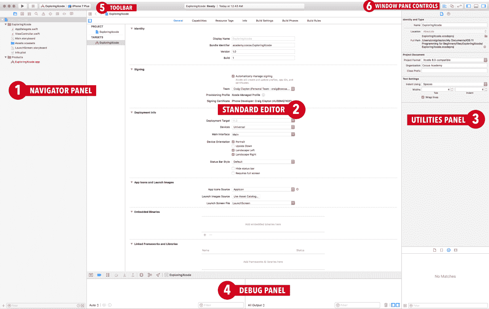

# 导航面板

导航面板的主要用途是添加新文件和/或选择现有文件。其他图标偶尔会用到；我们将在需要时介绍它们。

# 标准编辑器

标准编辑器是一个用于编辑文件的单一面板视图。标准编辑器区域是你将主要工作的区域。在这个区域，我们可以查看故事板文件，查看我们的 Swift 文件，或查看我们的项目设置。

# 工具面板

当你第一次使用 Xcode 时，工具面板可能会有些令人困惑，因为此菜单根据你在标准编辑器中选择的选项而变化。当我们开始构建应用时，我们将更深入地探讨这一点。现在，只需知道工具面板由顶部的检查器面板和底部的库面板组成。检查器面板允许你更改你在故事板中放置的项目的属性或属性；库面板允许你将对象、图像资源和代码片段插入到你的应用中。

# 调试面板

调试面板将允许我们查看应用中的日志消息。当你完成这本书的时候，你会非常熟悉这个面板。调试面板是获取关于你的应用正在做什么或没有做什么的反馈的绝佳工具之一。

# 工具栏

接下来，我们看看工具栏：

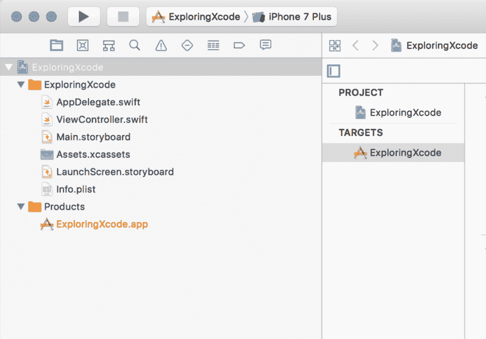

首先，我们有一个播放按钮，这是我们启动应用的方式（或使用 *cmd* + *R*）。接下来，你会看到一个停止按钮，在你运行你的应用之前，这个按钮将不会激活。这个停止按钮（或 *c**md* + *.*) 用于停止你的应用运行。停止按钮的右侧，你会看到你的目标（你的项目名称）以及当前选定的模拟器。如果你点击你的项目名称，你会看到一个类似于这样的屏幕：

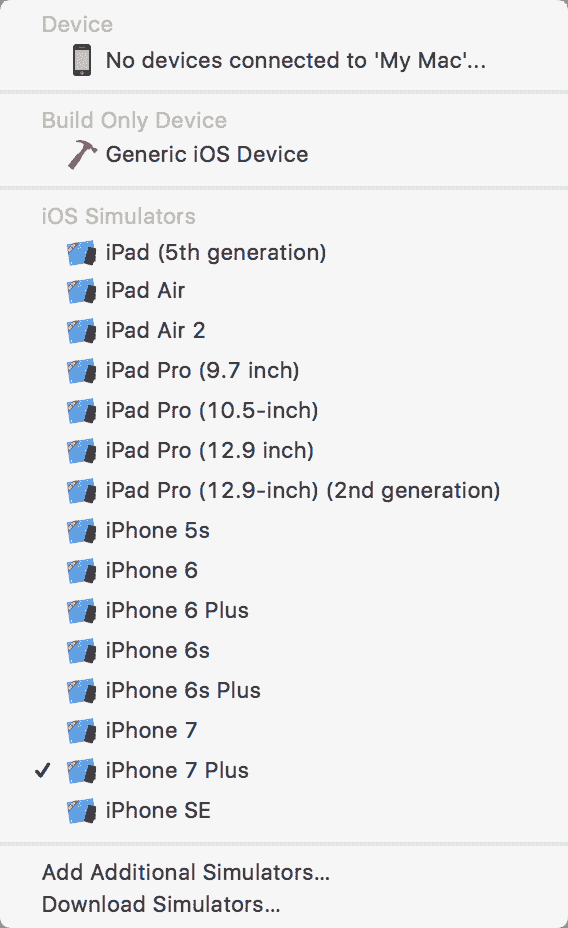

这个下拉菜单，我们将称之为设备和 iOS 模拟器下拉菜单，允许你更改你的模拟器类型。出于我们项目的目的，选择 iPhone7 Plus 作为你的模拟器，然后点击播放图标（或使用 *cmd* + *R*）来运行你的应用。你的应用将是一个空白页，并且很可能不会适应整个屏幕（除非你在一个大屏幕上）。

为了看到整个屏幕，你可以左右滚动；然而，一旦你的应用中有元素，这样做就会变得困难。所以，滚动的一个替代方案是将你的应用调整大小以适应屏幕。我们可以通过进入你的模拟器菜单并导航到窗口 | 缩放来完成这个操作：

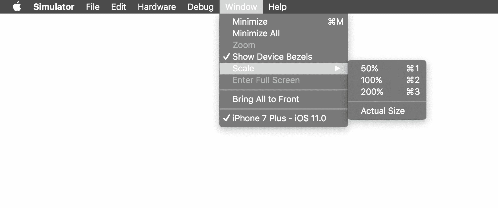

在这里，你可以从 200% 缩放到 100%，或 50%（选择任何允许应用最佳适应你屏幕大小的百分比）。

现在，让我们回到 Xcode 并选择停止按钮（或使用 *cmd* + *.*）。

如果你使用键盘快捷键，请确保 Xcode 是焦点；否则，这个快捷键将不会工作。我使用 15 英寸 MacBook Pro Retina - 因此，当我正在处理一个应用时，我会使用横向的 iPhone 6 或 iPad Air 2 模拟器。它们都很好地适应了我的屏幕，无需调整大小。

除了模拟器之外，还有一个仅构建设备以及设备部分，它们都位于本章前面显示的设备和模拟器下拉菜单的顶部。请注意，出于我们的目的，在我们构建应用时，你将只需要一个模拟器；然而，如果你想的话，你可以添加一个 iOS 设备（见 iOS 设备部分）。

# 通用 iOS 设备

在“设备与模拟器”下拉菜单的“仅构建设备”部分，选择“通用 iOS 设备”用于当你需要存档你的应用时，这意味着你正在为提交给苹果（无论是 App Store 还是 Test Flight）准备你的应用。如果你现在尝试选择通用 iOS 设备并运行应用，你将看到以下信息：

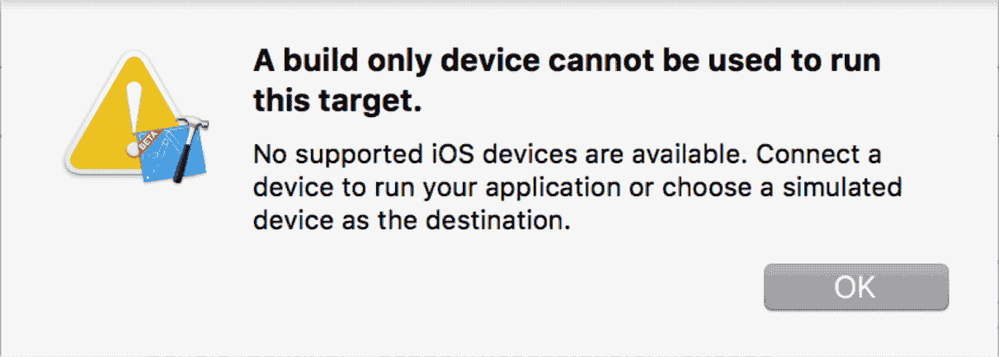

因此，将通用 iOS 设备更改为实际的模拟器，然后你将能够继续。

# iOS 设备

如果你没有将设备连接到计算机，你将在“设备与模拟器”下拉菜单的“设备”部分看到“无设备连接...”

如前所述，当我们开始构建“Let's Eat”应用时，你将可以选择使用模拟器或连接设备到 Xcode。使用设备会更慢；然而，模拟器不会像设备那样运行。

在过去，你需要有一个付费账户才能在设备上构建你的应用。现在，你不需要开发者账户就可以在你的设备上运行应用。请注意，如果你决定连接设备而不是使用模拟器，你需要在设备上安装 iOS 11。Xcode 9 引入了无线连接手机的能力。我们首先将查看传统方式，然后我们将介绍如何无线连接你的手机。

以下步骤仅适用于那些目前不想为 Apple 开发者计划付费的人：

1.  通过 USB 连接你的 iOS 设备

1.  在下拉菜单中，选择你的设备（这里，Xclusive iPhone 6 Plus）：

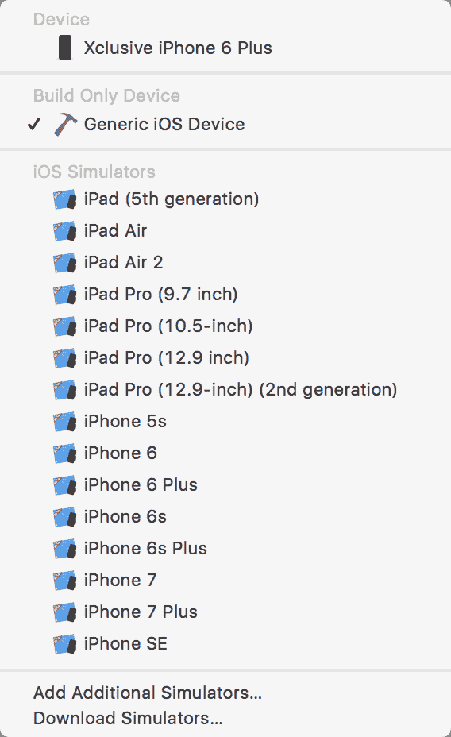

1.  等待 Xcode 9 完成索引和处理。这可能需要一些时间。一旦完成，状态将显示为“就绪”。

1.  通过点击播放按钮（或使用*cmd* + *R*）运行项目。

你将得到两个错误，内容如下：

+   +   为`ExploringXcode`签名需要一个开发团队。

        在项目编辑器中选择一个开发团队。

    +   在 iOS 10.0 的 SDK 中，产品类型应用需要代码签名。

忽略这些错误的细节，因为它们基本上表明我们需要创建一个账户并将我们的设备添加到该账户：

1.  现在，在标准编辑器中，你将在签名下看到需要添加一个账户：

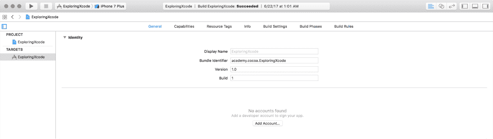

1.  点击“添加账户”。如果未弹出“使用 Apple ID 登录 Xcode”对话框，在底部左侧的“账户”屏幕上，点击+并选择 Apple ID：

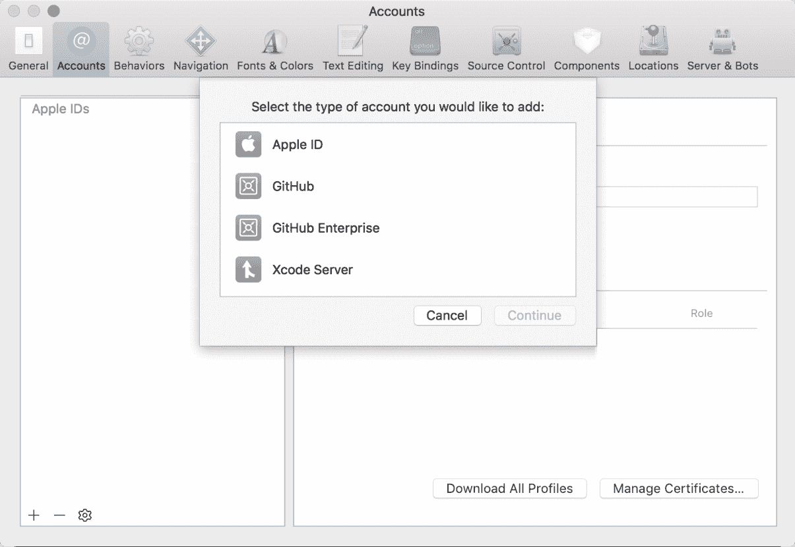

1.  然后，你将点击“创建 Apple ID”。你将被要求输入

    你的出生日期、姓名、电子邮件和密码，以及安全问题。确保在回答安全问题之前验证你的电子邮件；否则，你将不得不回到这个屏幕并再次添加 Apple ID。

1.  完成所有步骤后，你将看到你的账户：

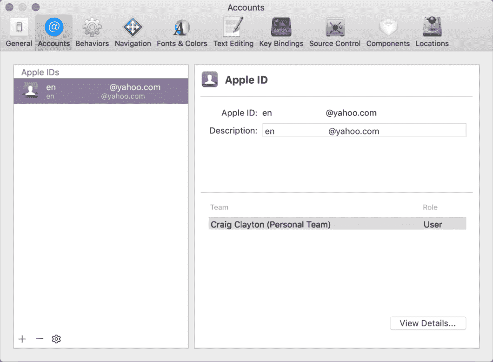

如果你已经有账户，那么，你将不会看到“添加账户”，而是会看到一个包含你的账户列表的下拉菜单。如果你的设备没有连接到这个账户，你可能会看到一个消息询问你是否想将你的设备添加到你的账户中。

# 无线连接

现在你已经将手机和账户连接好了，无线设置手机就变得简单了。在你的设备已经通过 USB 连接的情况下，前往 Window | 设备和模拟器。点击标记为“通过网络连接”的复选框：

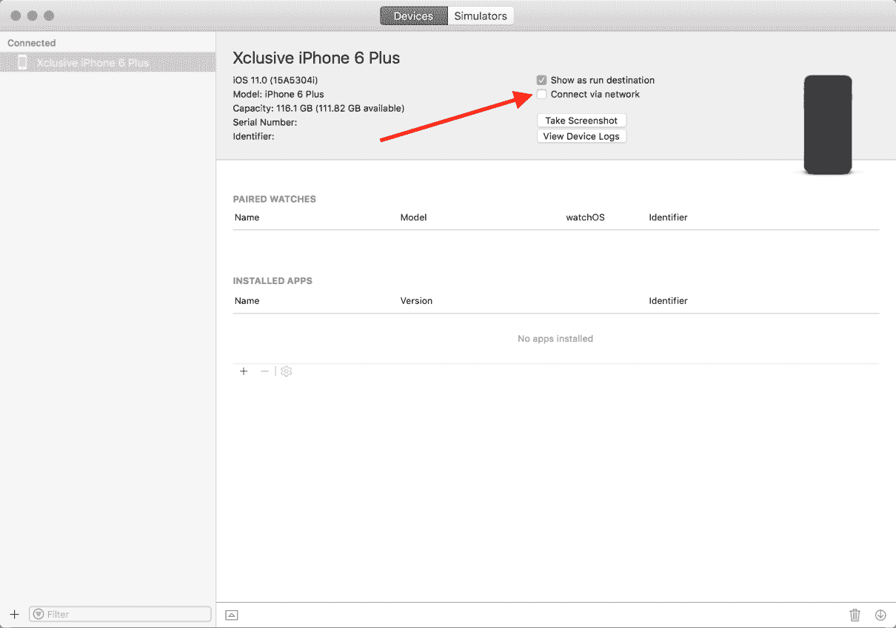

确保你的手机和电脑连接到同一个 Wi-Fi 网络。

当我第一次连接到我的设备时，我在 Xcode 中看到了一个地球图标，这表明你已通过网络连接。

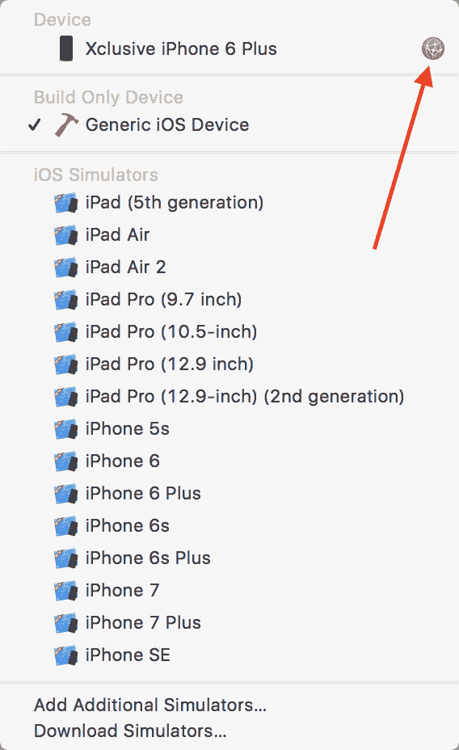

短时间内，地球图标消失了。即使你没有看到图标，你也可以断开 USB 连接，你的设备仍然应该连接到 Xcode（只要你在同一个 Wi-Fi 网络上连接）。

在这本书的大部分内容中，你不需要使用设备；然而，根据你拥有的 MacBook 类型，你可能需要使用设备。

在我们到达工具栏的右侧之前，请在你的导航面板中选择 `Main.storyboard` 文件。此文件用于为你的整个应用进行所有视觉设置。我们将在本书的后面详细讨论这个问题。选择文件后，你应该看到以下内容：

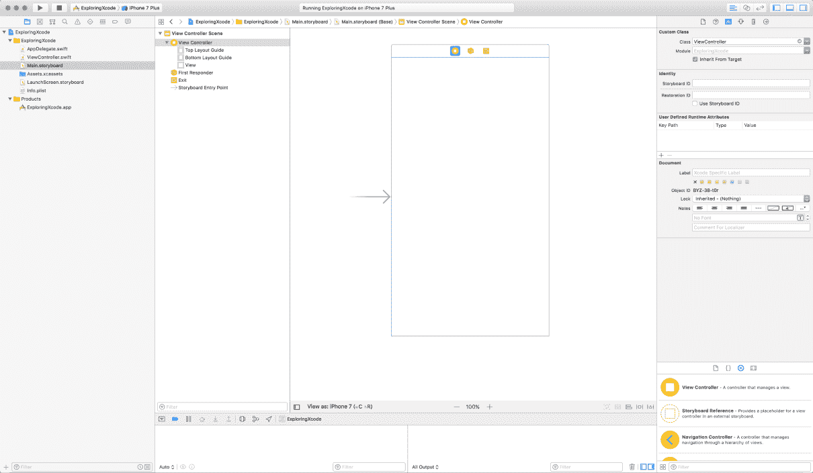

# 窗口面板控件

以下截图显示了窗口面板控件：

接下来是窗口面板控件，你会看到两组图标。第一组称为编辑模式，第二组称为查看。让我们看看编辑模式图标的函数：

此图标控制标准编辑器（这是导航面板中 `Main.storyboard` 文件早期截图中的中心面板）。

此图标将标准编辑器分成两个面板，你将在右侧看到 `ViewController.swift` 文件。我们将在这本书中一直使用这个分屏。

此图标是版本编辑器。由于这是一个更高级的功能，我们将在本书中不涉及版本编辑器。

在这一点上，你可能觉得打开的面板太多了，我同意你的看法。这就是工具栏中最后几组查看图标派上用场的地方。

让我们来看看以下表格中的这些图标及其功能：

此图标将切换（隐藏或显示）导航面板（或使用 *cmd* + *0*）。

此图标将切换（隐藏或显示）调试面板（或使用 *cmd* + *shift* + *Y*）。

>

此图标可以切换（隐藏或显示）工具面板（或使用 *cmd* + *alt* + *0*）。

# 摘要

恭喜！你已经完成了对 Xcode 基础的探索。当我们开始构建我们的应用时，我们将深入探讨 Xcode 的更重要部分。现在是时候开始学习 Swift 4 了。
