# 第六章：开始 UI 设置

现在您已经学习了 Swift，这将帮助您理解您稍后将会看到的大量样板代码，是时候开始构建我们的 *Let's Eat* 应用程序了。让我们先概述一下我们将要构建的内容。我们将回顾最终产品，然后进入如何构建这个应用程序。在我们开始之前，将会有很多新的术语和您可能熟悉或不熟悉的事物。尽可能多地学习，不要让细节阻碍您的进步。

在本章中，我们将涵盖以下主题：

+   有用术语

+   应用程序浏览

+   项目设置

+   故事板

+   创建自定义标题视图

# 有用术语

在我们深入挖掘并开始设置我们的 UI 之前，我们需要花几分钟时间介绍（或再次介绍）一些在我们构建应用程序时应该理解的术语：

+   视图控制器

+   表视图控制器

+   收集视图控制器

+   导航控制器

+   标签栏控制器

+   故事板

+   转场

+   自动布局

+   **模型视图控制器** (**MVC**)

# 视图控制器

视图控制器 (`UIViewControllers`) 是空白场景，您可以使用它来包含其他 UI 元素。它们为您提供了创建自定义界面的能力。

# 表视图控制器

表视图控制器 (`UITableViewController`)，它继承自 `UIViewController`，是最常见的 UI 元素之一，用于显示项目列表。例如，苹果的设置屏幕使用表视图控制器来显示用户可以访问和更改的设置列表：

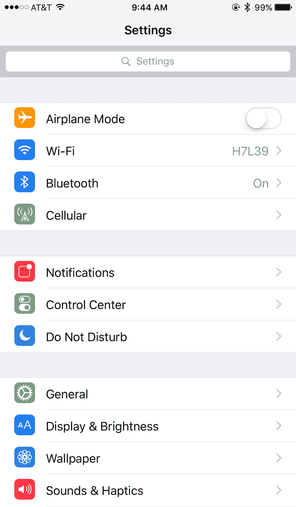

# 收集视图控制器

收集视图控制器 (`UICollectionViewControllers`) 通常用于您想要在网格中显示元素时。它们高度可定制，因此，在非网格布局中变得越来越受欢迎。

例如，App Store 目前使用 `UICollectionViewControllers` 来展示其特色页面和应用程序详情页面：

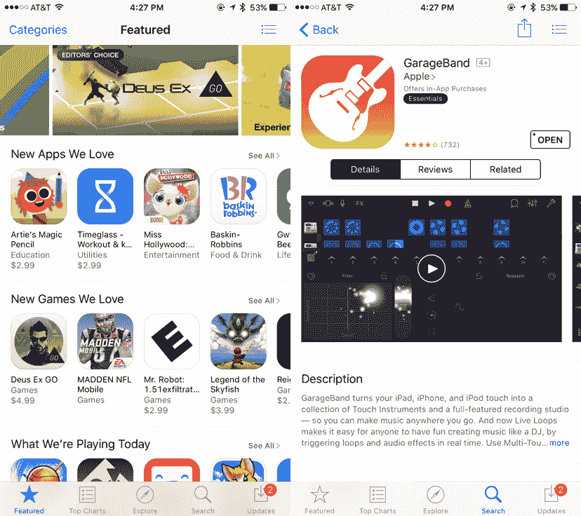

# 导航控制器

导航控制器 (`UINavigationController`) 是一个 UI 元素，它允许您为分层内容构建钻取式界面。当您将导航控制器嵌入到视图控制器、表视图控制器或收集视图控制器中时，它管理从一个控制器到另一个控制器的导航。

# 标签栏控制器

标签栏控制器 (`UITabBarController`) 管理一组视图控制器。我们的 *Let's Eat* 应用程序将使用标签栏控制器。这个控制器将使我们能够以最小的设置来为应用程序提供导航功能。

苹果有一些您可能熟悉的、使用标签栏控制器的应用程序：

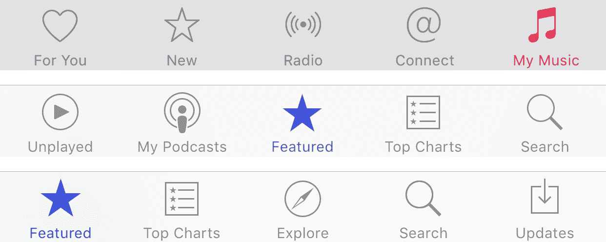

一个 `UITabBarController` 在 iPhone 上只能有五个标签。如果您的 `UITabBarController` 在 iPhone 上有超过五个标签，第五个标签以及之后的标签将移动到“更多”按钮下方：

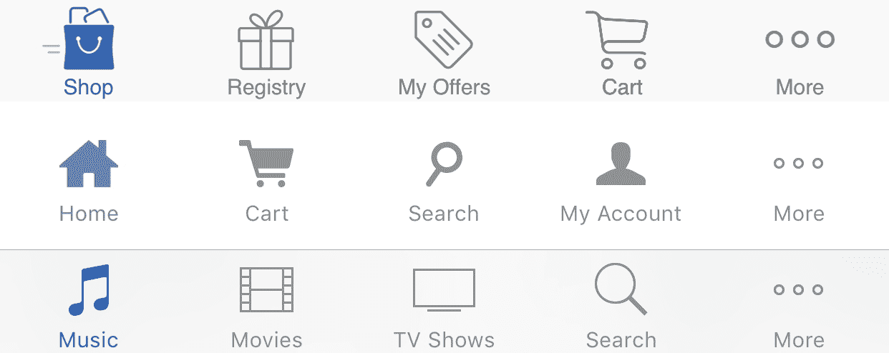

# 故事板

故事板是一个文件，显示了你应用 UI 的视觉表示。这是一个应用的故事板看起来像：

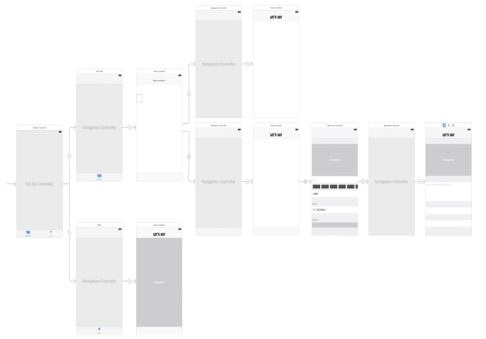

故事板允许你使用视图控制器、表格视图控制器和集合视图控制器作为场景，在视觉上创建你的整个应用。除了在视觉上创建你的应用外，你还可以使用连接来连接场景，并设置场景之间的过渡。

# 连接

连接用于连接一个控制器到另一个控制器。在故事板中，连接由一个带有图标的箭头表示：

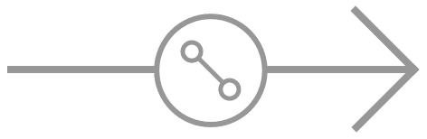

连接也让你能够指定从一个场景到另一个场景的过渡，几乎不需要编程。

# 自动布局

自动布局是一个出色的工具，它允许你支持不同的屏幕尺寸和设备旋转。使用自动布局，你可以为 UI 元素设置不同的约束，以便它能够调整大小和旋转的变化。在你的应用中使用自动布局允许你为所有设备使用一个故事板。

# 模型-视图-控制器（MVC）

MVC 是一种标准的软件开发模式，它是对软件设计中常见问题的解决方案。苹果基于 MVC 设计模式构建了 iOS 应用。这种模式将我们的应用分为三个阵营，即模型、视图和控制器。我们将在本书的后面详细讨论这一点。

# 应用导览

我们正在构建的“Let's Eat”应用是一个餐厅预订应用，允许用户在特定区域找到餐厅，并在应用内创建预订（尽管我们的应用不会预订这些预订）。我选择餐厅预订应用作为本书中课程的用途，因为大多数新的 iOS 11 功能在这样的应用中都能很好地协同工作。该应用涵盖了从地图到 iMessage 扩展的许多不同方面。让我们看看应用的总体流程，这样，在我们构建的过程中，你会有一个很好的方向感：

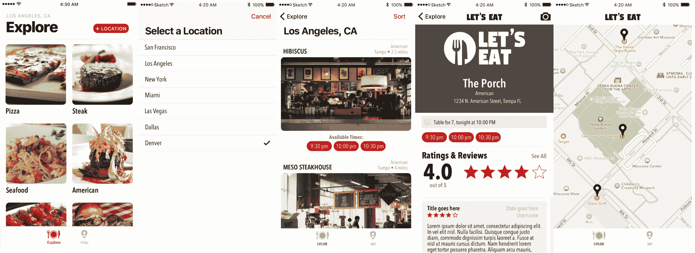

# 浏览标签

当应用启动时，你会看到浏览标签。这个标签将允许用户选择他们想要的特定菜系，并选择一个特定的预定义位置。让我们分析这个视图中的每个组件：

对于这个屏幕，我们将使用一个空的视图控制器，这是所有我们的 UI 组件所在的地方。正如你所见，我们应用中的这个视图被设计成网格，因此我们将使用集合视图控制器。我们将自己设置这个集合视图控制器。

当我构建应用时，我通常从一个空的集合视图或表格视图开始，因为它给我的代码以及用户界面提供了更多的灵活性。

# 位置

位置视图是从浏览标签访问的城市列表。我们从本地文件加载这个城市列表，如果用户选择了一个城市，应用将加载该地区的所有餐厅：

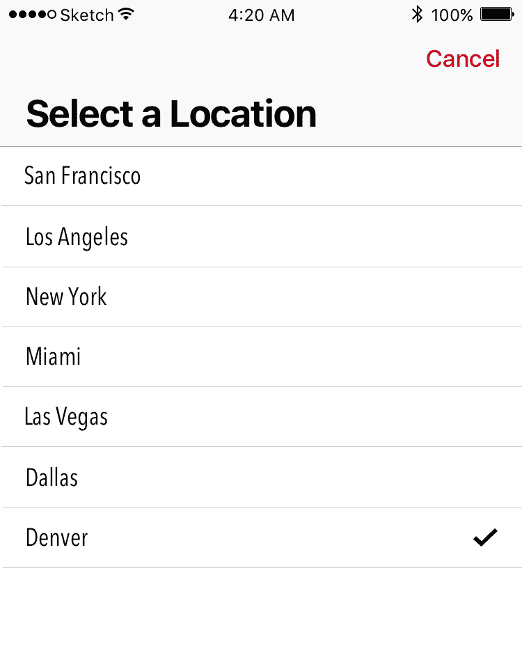

对于这个位置视图，我们将使用一个使用表格视图的视图控制器。

# 餐厅列表

在餐厅列表中，我们通过所选菜系看到该地区的餐厅：

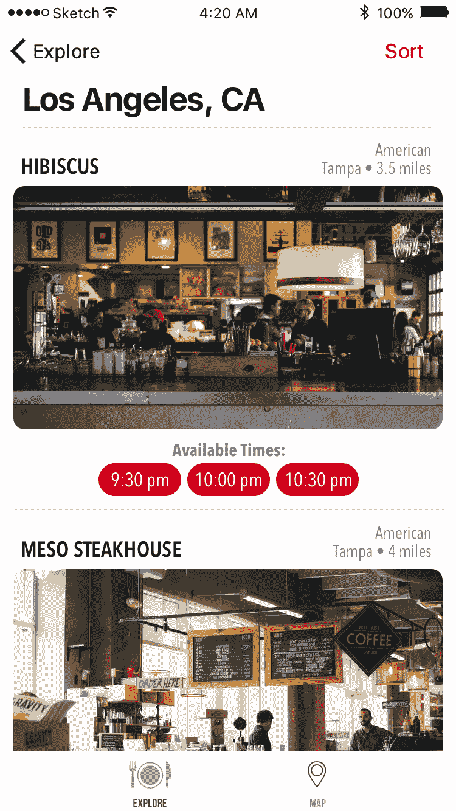

在本书中，我们将介绍 `UICollectionViews` 和 `UITableViews`，但作为介绍，您应该知道 `UICollectionViews` 非常强大。它们之所以强大，是因为您可以自定义它们以看起来您想要的样子。例如，应用商店详情是一个自定义的 `UICollectionView`。

当使用 `UICollectionView` 时，一个很棒的功能是，当您构建一个像这样的通用应用时，您可以让您的视图在 iPhone 上看起来像列表，但在 iPad 上以最小的努力显示为网格。

# 餐厅详情

我们餐厅的详细信息提供了更多关于餐厅的信息。此视图使用一个使用静态单元格的 `UITableView` 构建：

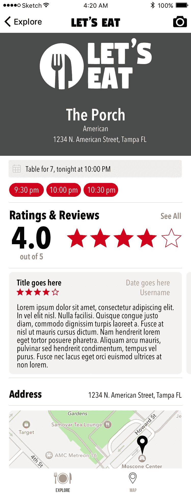

# 地图标签页

我们地图标签页是一个带有从特定位置放置的标记的视图控制器，表示该地区的所有餐厅：

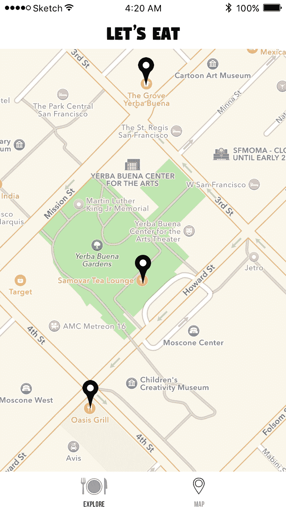

# 项目设置

现在我们已经游览了应用，我们将构建 *Let's Eat* 应用。首先，我们需要创建应用，然后处理 UI，最后在故事板中设计我们的应用。

对于应用的初始设置，我们将查看一些 iOS 基础知识，从创建新项目开始。

# 创建新项目

要创建新项目：

1.  打开 Xcode，Xcode 欢迎屏幕将出现。在欢迎屏幕的左侧面板中单击创建新的 Xcode 项目。

1.  选择单视图应用并单击下一步：

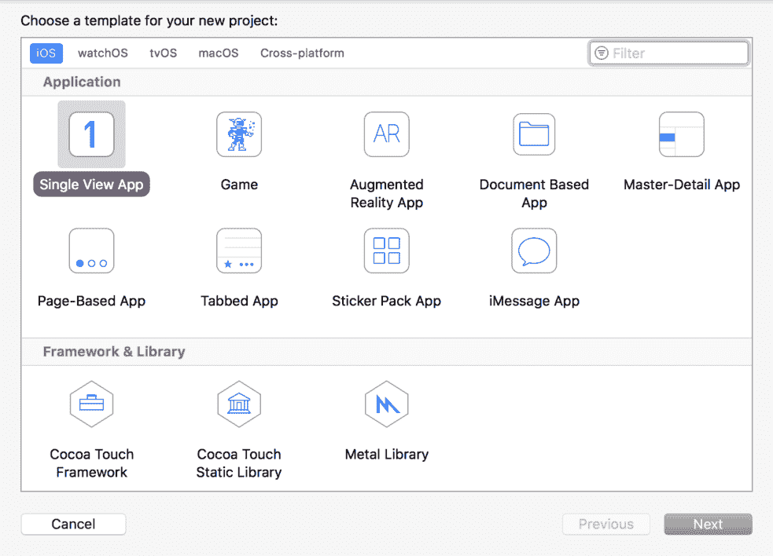

1.  在出现的选项屏幕中，将有多个项目需要完成或选择。将以下内容添加到该选项屏幕，然后单击下一步：

+   +   **产品名称**: LetsEat

    +   **团队**: 您的账户或留空

    +   **组织名称**: 您的姓名/公司名称

    +   **组织标识符**: 您的域名倒序

    +   **语言**: Swift

    +   **设备**: 通用

    +   **使用 Core Data**: 未勾选

    +   **包含单元测试**: 未勾选

    +   **包含 UI 测试**: 未勾选

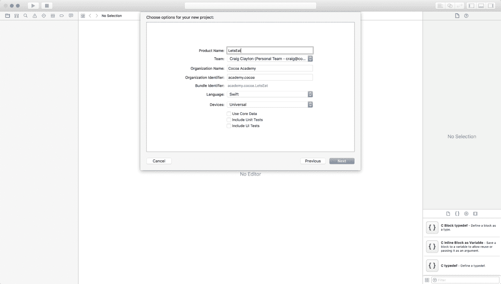

1.  选择您的桌面或文件夹以保存项目，然后点击创建：

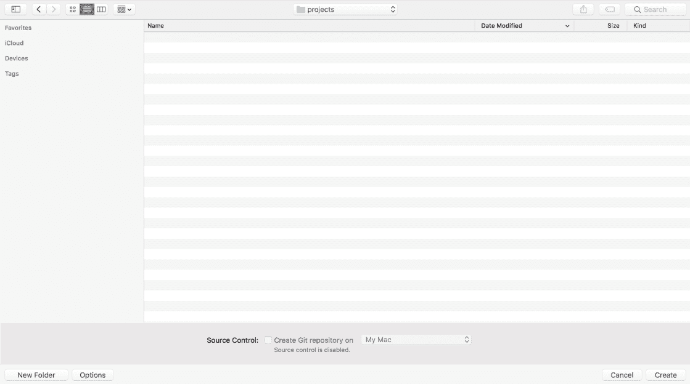

1.  保存后，您将看到以下屏幕：

您的项目现已创建，我们可以开始着手创建我们的第一个 iOS 应用。

# 摘要

在本章中，我们介绍了我们将全书使用的有用术语。我们还查看了我们将在整个应用中构建的内容，现在我们对应用的外观有了很好的了解。

接下来，让我们深入挖掘并开始在故事板中工作，设置应用程序的 UI。在接下来的几章中，我们将严格在故事板中工作，以设置我们的应用程序。一旦一切设置完成，我们将专注于本书剩余部分的代码。
