# 第八章：在 Storyboard 中构建我们的应用结构

在最后一章，我们创建了 Tab Bar Controller。在这一章，我们将创建我们应用中需要的其他 View Controllers。我们本章的目标是使用最少的代码在应用中导航。

本章将涵盖以下内容：

+   Collection View

+   出口

+   模态

在我们开始设置 Collection View Controller 之前，你需要添加两个文件，`ExploreViewController`和`RestaurantViewController`，这些文件你可以从 Packt 的网站或 GitHub 下载。通过添加这些文件和一些代码，我们将能够专注于我们应用的设计。

在本书的后面部分，我们将删除这些文件，并自己创建它们。但是，为了本章的目的，让我们将这两个文件添加到我们的项目中：

1.  打开从 Packt 的网站或 GitHub 下载的项目`assets`文件夹。打开`Chapter_08`，并将文件夹中的两个文件拖到导航器面板中的项目中：

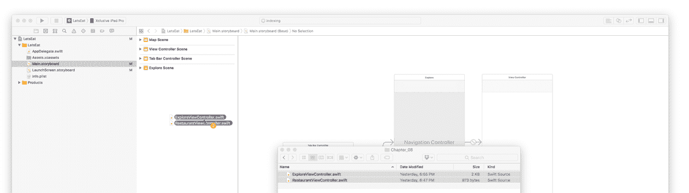

1.  当你放下文件夹时，你会得到以下消息：

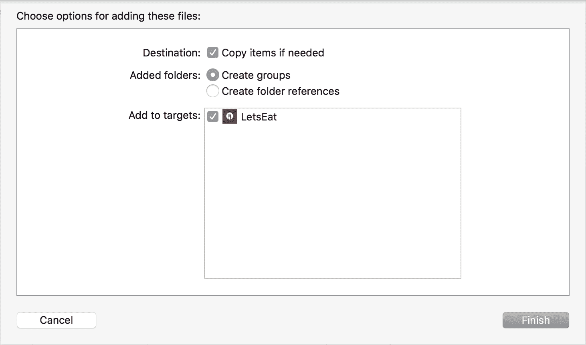

1.  确保你选中了“如果需要则复制项目”和“创建组”选项。然后，点击完成。

1.  现在我们可以向这些新文件添加代码，这将允许我们关闭本章后面将创建的模态。模态是一个容器，它会在应用当前显示的内容上方打开，并允许你进行更多操作，而无需打开屏幕上查看的所有信息。让我们添加代码，使我们能够关闭模态：

1.  打开`ExploreViewController.swift`文件，并在文件底部标有`// 在此处添加 Unwind`的地方，添加以下代码：

```
@IBAction func unwindLocationCancel(segue:UIStoryboardSegue) {} 
```

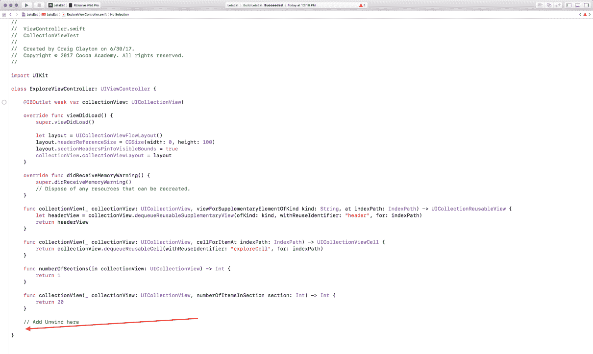

如果我们查看本书前面回顾的应用设计，在我们的第一个标签，探索标签中，我们显示了一个食物菜系的网格以及位置列表。首先，我们将设置我们的网格。

# 添加 Collection View Controller

如本书前面所述，Collection View Controllers 允许我们在网格中显示元素。让我们设置我们的 Collection View：

1.  选择`Main.storyboard`文件，确保你已经缩小视图，可以看到所有的场景。在工具面板中，确保你选择了对象库标签页。

1.  接下来，在过滤器字段中，输入：`collectionview`：

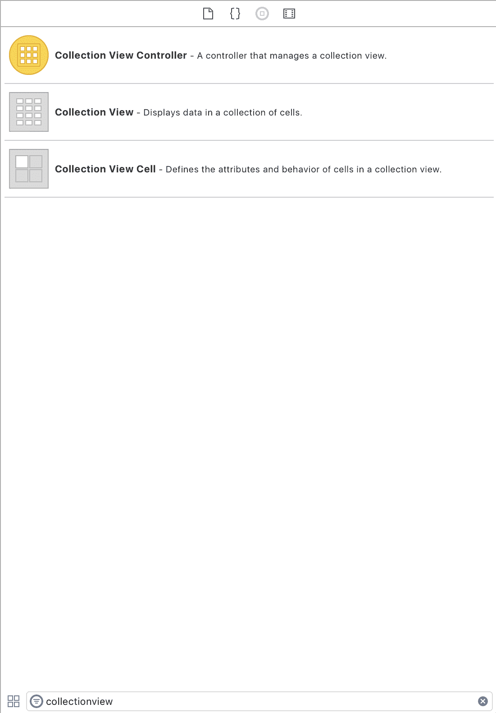

1.  点击并拖动 Collection View，并将其拖放到探索视图控制器：

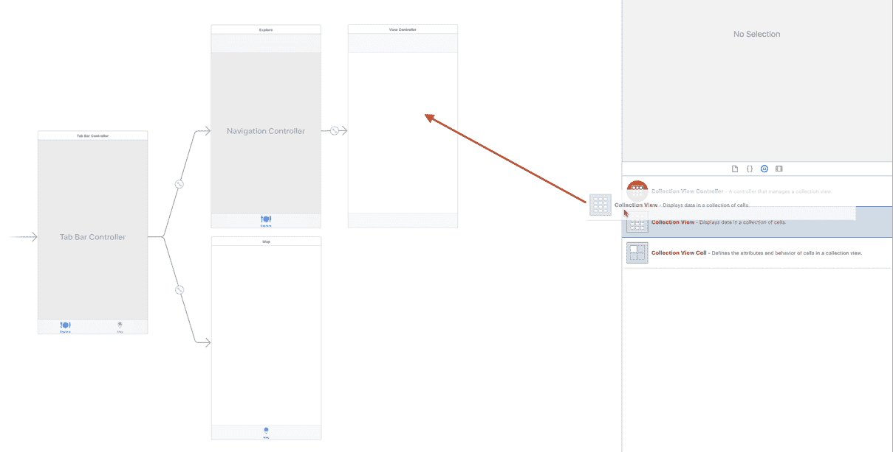

1.  将其拖放到场景中后，你将看到整个 Collection View 组件周围有小的方框。选择固定图标，并输入以下值：

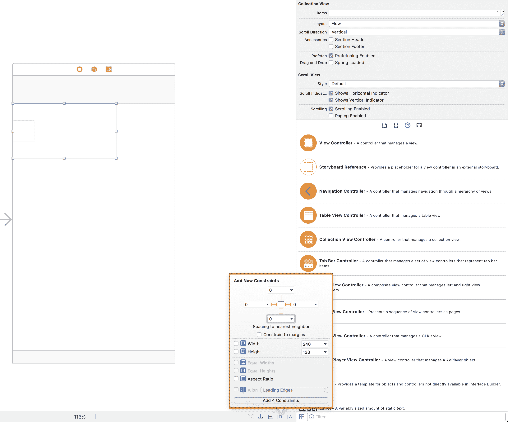

在“添加新约束”下的所有值都设置为`0`。

1.  点击添加 4 个约束。

现在我们已经为探索标签设置了 Collection View 组件。

# 连接我们的出口

让我们现在将我们的文件`ExploreViewController`链接到 Storyboard 中的`UIViewController`：

1.  在仍然处于`Main.storyboard`文件的情况下，通过点击该控制器顶部的最左侧图标来选择我们刚刚创建的带有集合视图的`UIViewController`：

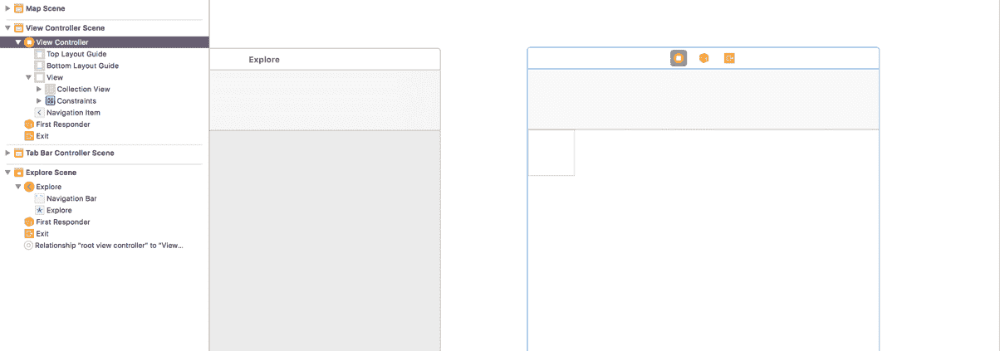

1.  现在，在工具面板中，选择身份检查器，这是从左数第三个图标：

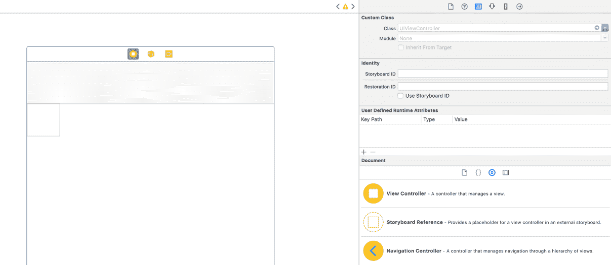

1.  在自定义类部分，在类下拉菜单中选择`ExploreViewController`并按*Enter*。

1.  在你按下*Enter*后，选择连接检查器，工具面板中右侧的最后一个图标：

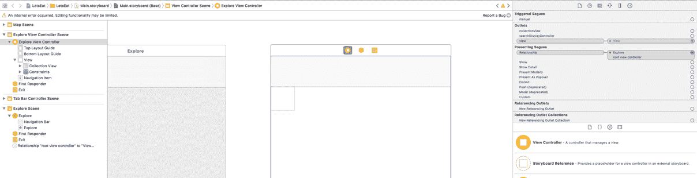

1.  在输出部分，你会看到 collectionView 和一个空白圆圈：

`IBOutlet`是一种连接到 UI 元素的方式。我们在`UIViewController`上有一个集合视图；现在，我们正在连接到这个变量。在本书的后面，你将学习如何创建这些变量。

1.  点击 collectionView 圆圈，并从圆圈拖动到我们刚刚添加到`UIViewController`内部的集合视图：

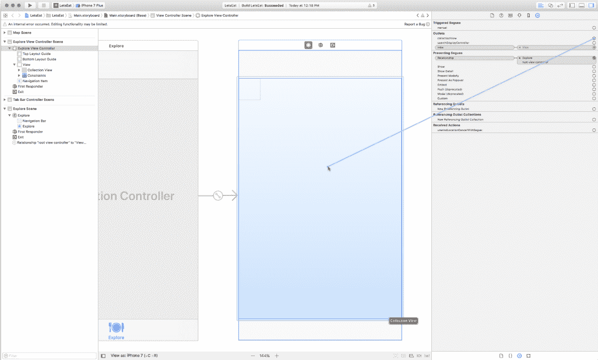

1.  一旦你释放它，你会看到圆圈被填充：

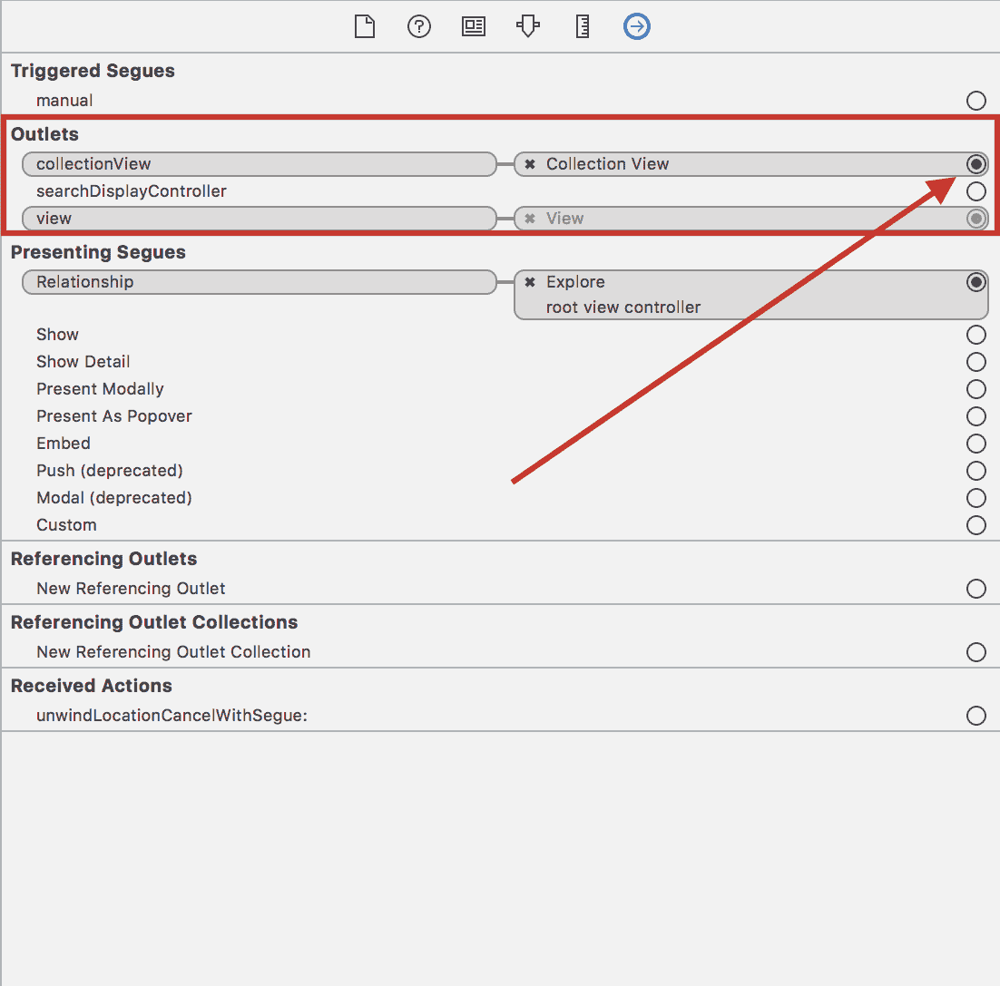

接下来，我们需要连接数据源和代理。这允许我们将数据传递到我们的集合视图，并知道我们的集合视图何时发生某种交互。

`dataSource`属性是我们用来为我们的集合视图提供数据的，因此我们需要将我们拥有的任何数据传递给这个属性。另一方面，提供行为的`delegate`属性不需要我们提供任何内容，因为它接收在我们集合视图内发生的交互。

1.  在你的场景中，选择你的集合视图，然后在工具面板中选择连接检查器。

1.  在输出部分，你会看到两个空白圆圈，`dataSource`和`delegate`：

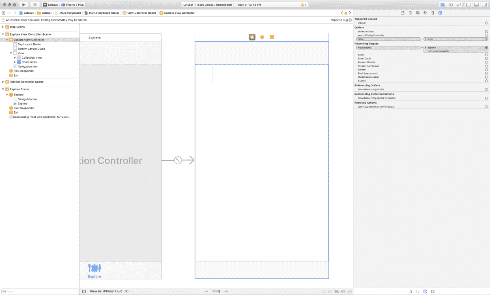

1.  点击并从`dataSource`属性的空白圆圈拖动到你的大纲视图中的 Explore View Controller，然后释放：

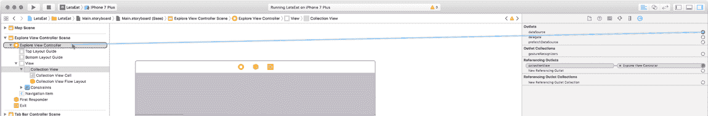

1.  对`delegate`属性重复此操作：

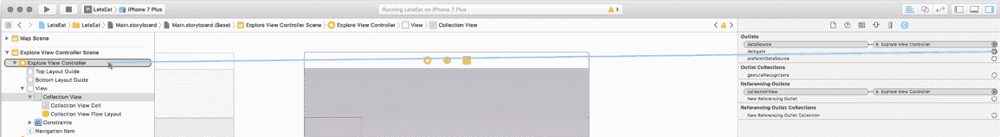

接下来，让我们设置我们的集合视图原型单元格以具有颜色。

# 创建自定义颜色

在 Xcode 9 中，我们现在能够向你的`Assets.xcassets`文件夹添加颜色。当你想要将所有颜色放在一个位置时，这很棒。在我们更新我们的探索单元格之前，让我们创建一个新的颜色：

1.  打开`Assets.xcassets`文件。

1.  在`Assets.xcassets`内部右键单击，你会看到文件夹，并创建一个名为 colors 的新文件夹：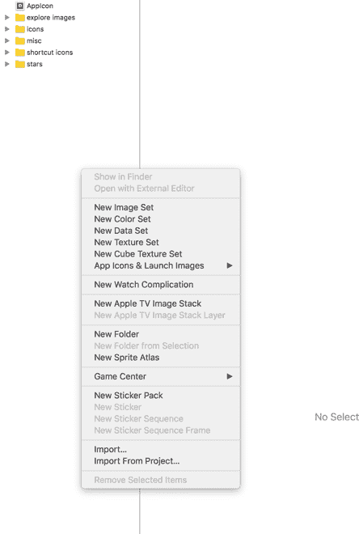

1.  接下来，右键点击 `Color` 文件夹，这次选择新建颜色集。你会在文件夹中看到一个新的颜色被添加。在实用工具面板中选择属性检查器：

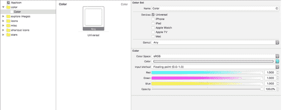

1.  在颜色集下，更新名称：`Demo Grey`。

1.  在颜色下，点击颜色，你会看到一个颜色面板：

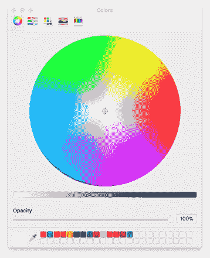

1.  点击第二个标签页，颜色滑块，并将十六进制颜色值更改为 `AAAAAA`。完成操作后，你应该看到以下内容：

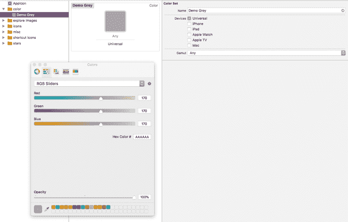

1.  现在我们有了颜色，我们将在颜色下拉菜单中找到我们的新颜色，就像你接下来会看到的那样。

# 设置我们的单元格

为了设置我们的单元格，我们需要执行以下步骤：

1.  在 `Main.storyboard` 中，选择集合视图原型单元格，这是集合视图内部的小方块。

1.  在实用工具面板中打开属性检查器：

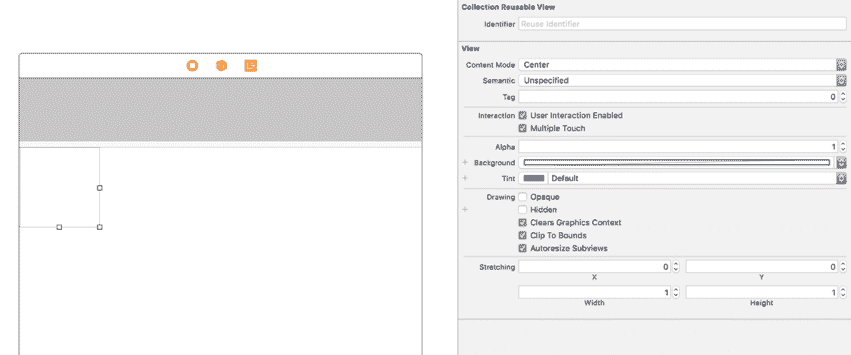

1.  更新以下内容：

+   +   标识符：`exploreCell`

    +   背景：演示灰色

1.  为了更新背景，你需要点击背景下的下拉箭头。你会看到我们的 Demo Grey 已经被添加：

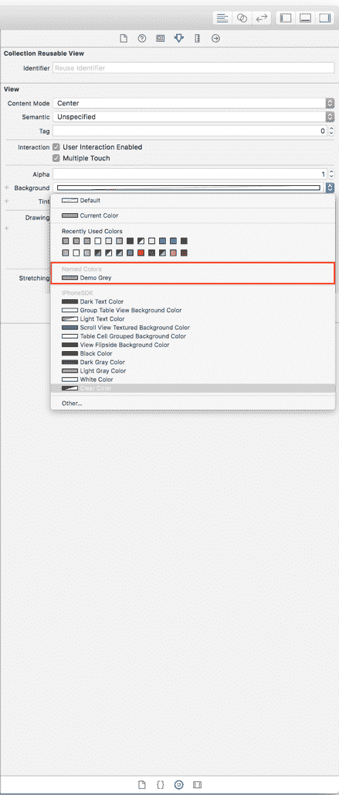

现在你应该看到以下内容：

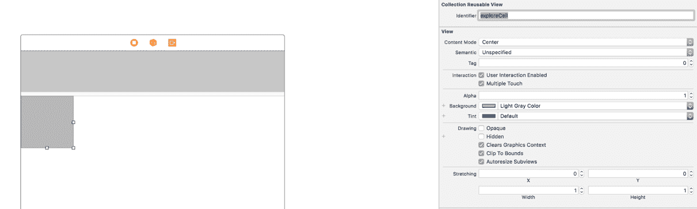

接下来，我们需要添加一个部分标题。

# 部分标题

我们的部分标题将包括页面标题、所选位置和一个我们将用来查看位置的按钮：

1.  在 `Main.storyboard` 概要中选中集合视图。

1.  然后，在你的实用工具面板中选择属性检查器，在集合视图附件下，选择 **部分标题** 旁边的复选框：

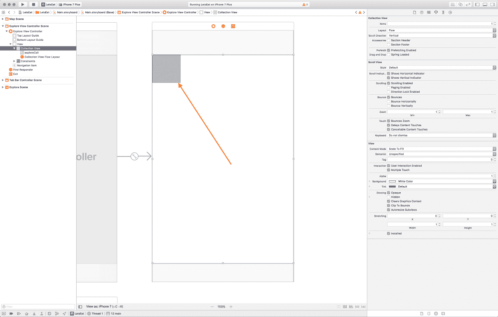

1.  接下来，你将看到一个框出现在我们的 Demo Grey 单元格上方，这是我们新的部分标题；你应该选择这个：

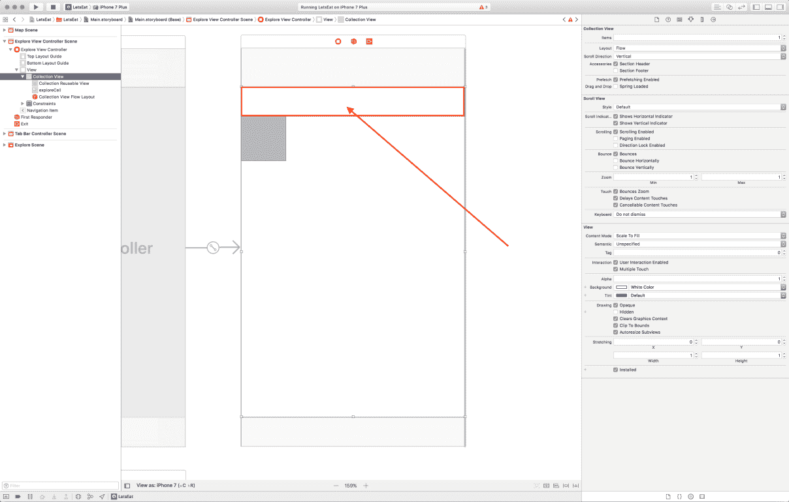

1.  最后，在实用工具面板中的属性检查器中，更新标识符为 Header：


让我们通过点击播放按钮（或使用 *cmd* + *R*）来构建和运行项目：

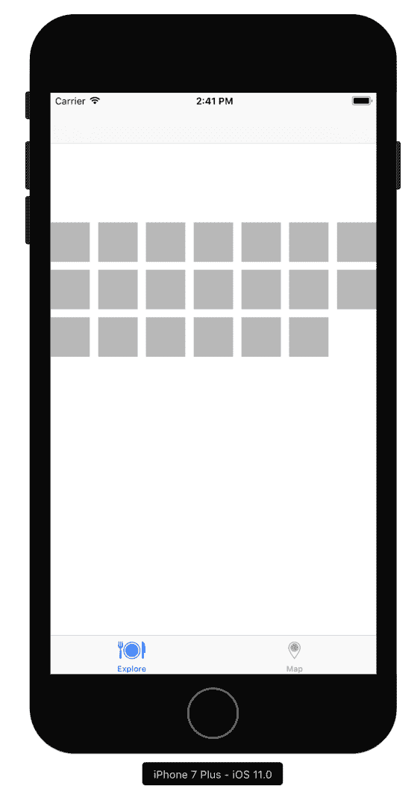

你会看到现在你有一个网格状的方块和一些白色空间（部分标题）在网格的顶部附近。在我们开始处理部分标题之前，让我们更新我们的网格以匹配每行两个特定大小的单元格的设计。

# 更新网格

为了更新我们的网格，我们需要采取以下步骤：

1.  使用 *cmd* + *Shift* + *O*，在快速打开窗口中输入 `Main.storyboard`，然后按 *Enter*。

1.  选择集合视图，然后在实用工具面板中选择大小检查器。

1.  根据你当前使用的模拟器，更新以下值。这些值可能需要更改，以便你的网格有两列单元格，所以请随意更改这些值：

对于 iPhone 7，使用以下值：


对于 iPhone 7 Plus，请使用以下值：


对于 iPhone 4/iPhone SE/iPhone 5/iPhone 5s，请使用以下值：

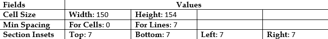

完成后，一切应该看起来像这样：

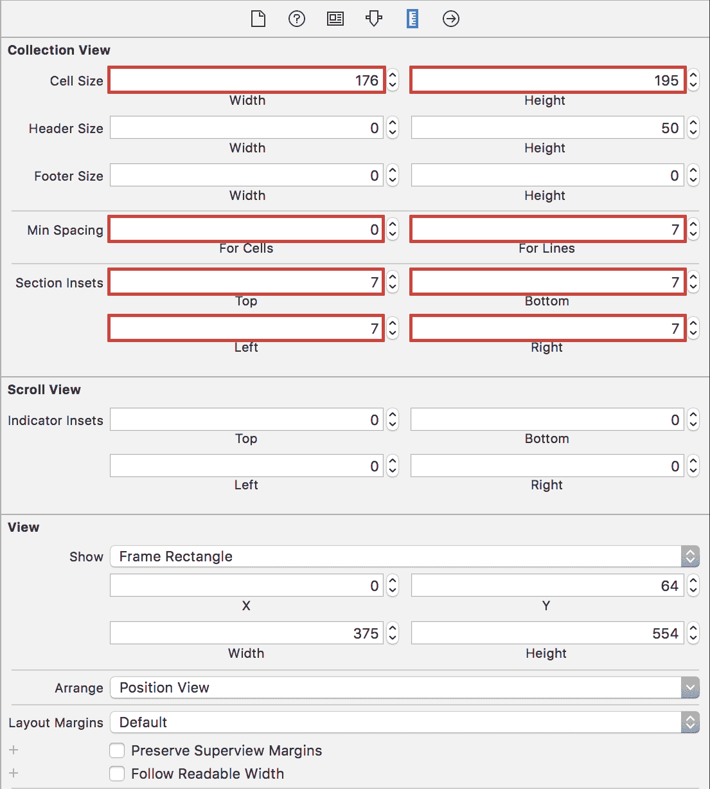

目前，就像我们刚刚做的那样，我们将使用故事板设置来设置我们的单元格。在本书的后面部分，我们将使它动态化，以便我们的宽度和高度可以通过代码进行调整。接下来，我们将处理我们的部分标题。

# 添加模态

让我们回顾一下部分标题的设计：

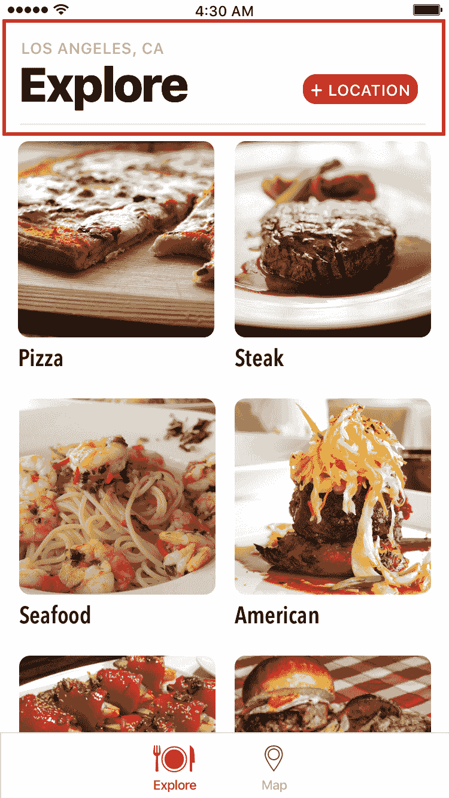

注意，我们有一个显示位置的 + 位置按钮。现在让我们添加这个模态：

1.  当您在 `Main.storyboard` 文件中时，选择对象库，并在库窗格底部的筛选字段中输入 `button`。

1.  现在，将 `Button` 组件拖放到我们在探索视图控制器中创建的部分标题：

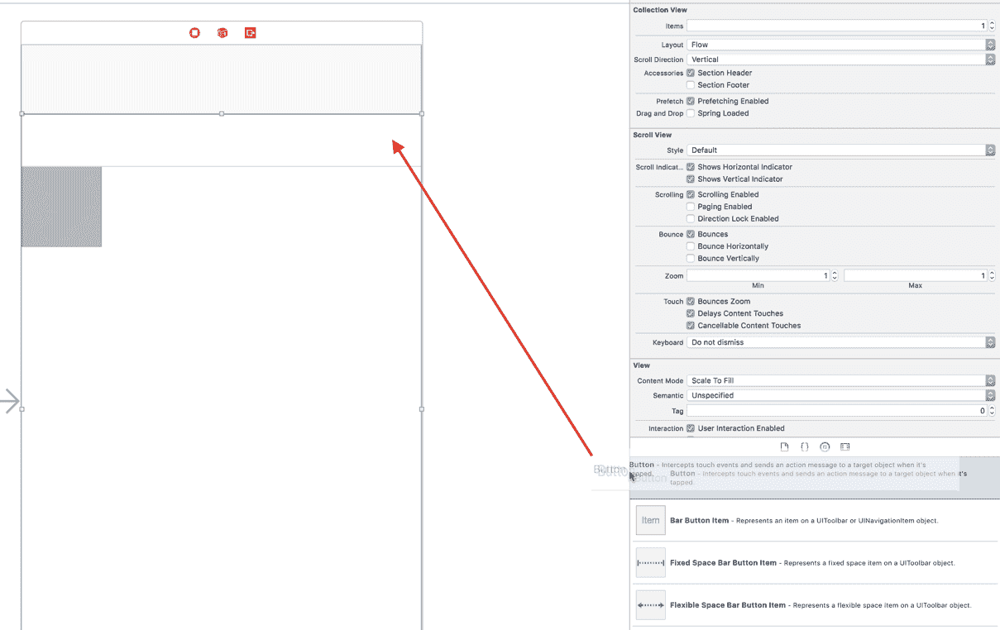

我们将在稍后对按钮进行格式化，包括位置和大小。

接下来，我们需要在我们的故事板中添加另一个视图控制器：

1.  在筛选中输入 `viewcontroller`，并将 `ViewController` 组件拖放到 `Main.storyboard` 中的探索视图控制器上方。

1.  在选择视图控制器后，导航到编辑器 | 嵌入 | 导航控制器。

1.  现在，从探索标签下的视图控制器中的“按钮”处，使用 Ctrl + 拖动到刚刚创建的导航控制器（您也可以在大纲视图中这样做，通过从按钮拖动到您刚刚创建的新导航控制器）：

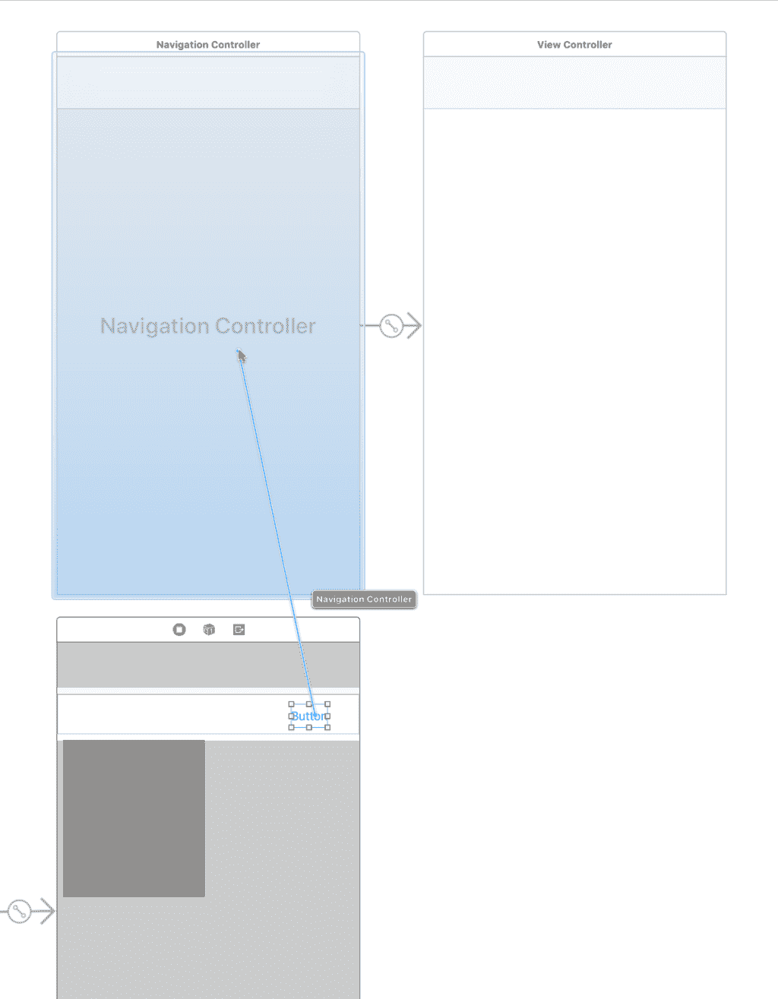

1.  当您松开鼠标时，会出现以下菜单，您应该选择模态显示：

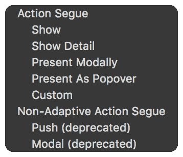

现在，通过点击播放按钮（或使用 *cmd* *+* *R*）来运行项目。您会看到我们的按钮现在可以打开一个模态。在下一章中，我们将使这个按钮符合我们的设计。

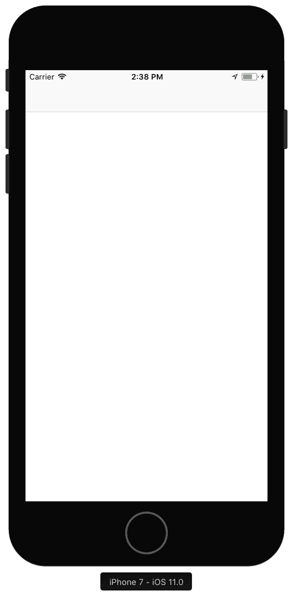

目前，正如您在前面的截图中所见，我们无法关闭此模态。因此，我们需要一个取消按钮和一个完成按钮来关闭视图。让我们修复这个问题：

1.  打开 `Main.storyboard` 并选择与标题中的按钮连接的 segue。现在它应该被突出显示：

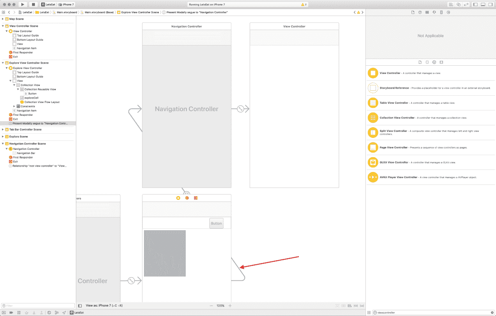

1.  然后，转到您的模态视图控制器（不是导航控制器）：

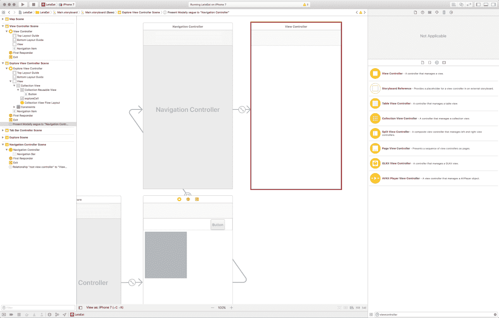

1.  接下来，在实用工具面板中对象库的筛选区域输入 `bar button`。

1.  将 Bar Button Item 拖放到您的 `View Controller Scene` 导航栏的右侧区域：

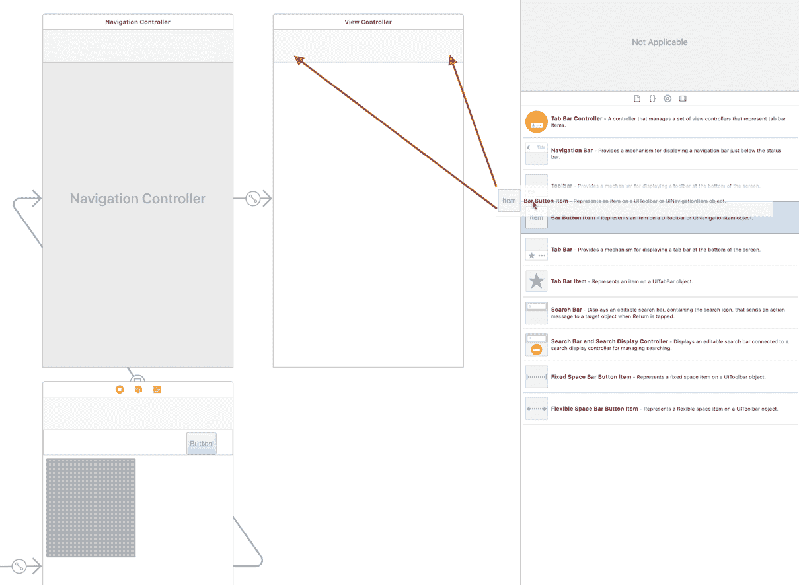

1.  将另一个 Bar Button Item 拖动到导航栏的左侧区域：

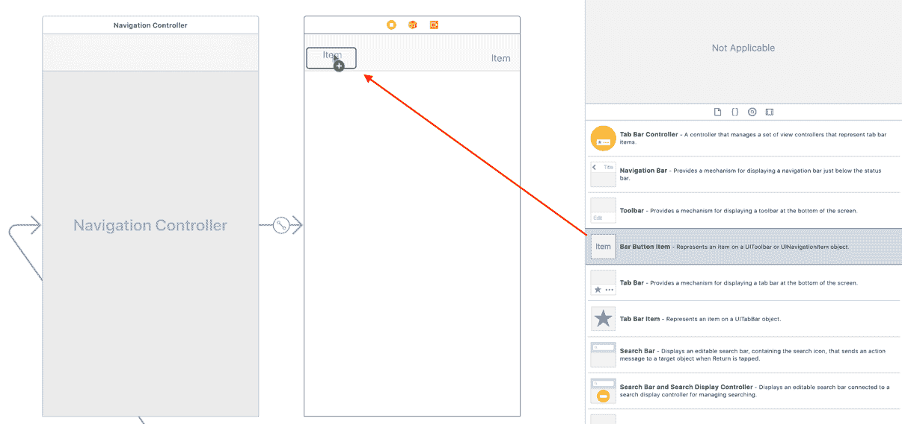

1.  现在你应该有两个条形按钮项，都显示为“项”：

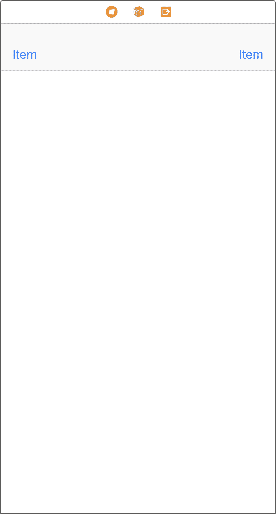

# 更新条形按钮项

接下来，我们需要更新两个条形按钮项，使其显示为“取消”和“完成”：

1.  选择左侧条形按钮项，并在“实用工具”面板中选择属性检查器。

1.  点击“系统项”，并在下拉菜单中选择“取消”。

1.  选择右侧条形按钮项，并在“实用工具”面板中的属性检查器中，将“系统项”更新为“完成”。

现在，你应该在左侧看到“取消”，在右侧看到“完成”：

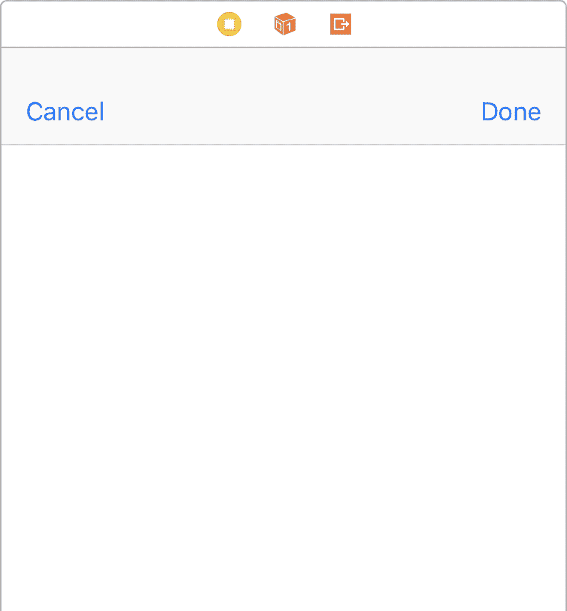

# 回滚我们的“取消”按钮

现在我们有了我们的按钮，我们希望当用户点击“取消”时关闭模态：

在`Main.storyboard`中，使用 Ctrl 从“取消”按钮拖动到退出：

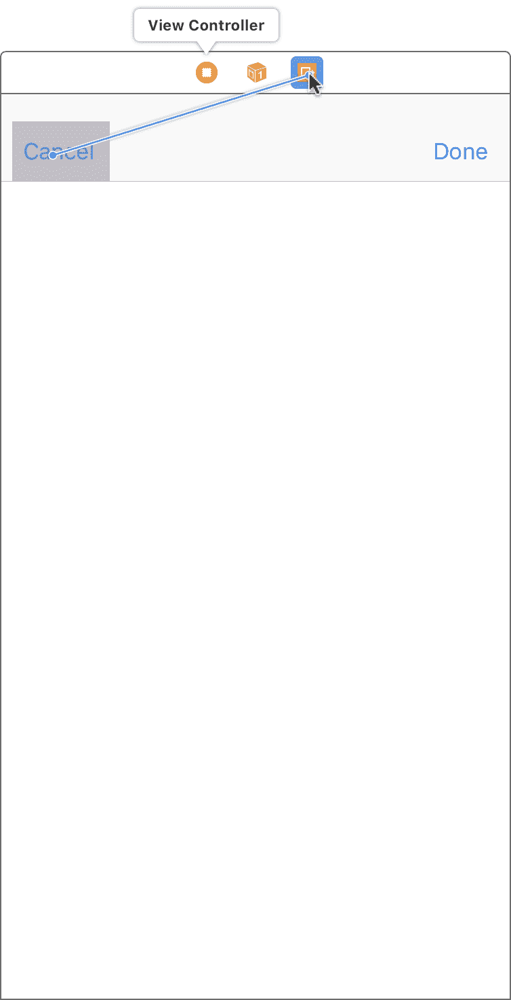

你也可以在轮廓视图中这样做。

你将看到一个弹出窗口，显示“操作转换”和`unwindLocationCancelWithSegue`。选择`unwindLocationCancelWithSegue`：

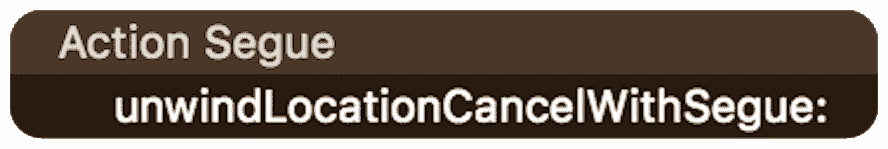

通过点击播放按钮（或使用*cmd* *+**R*）构建和运行项目，并测试我们的“取消”按钮。现在它应该关闭视图。我们将在稍后添加代码时更新“完成”按钮。

# 添加我们的第一个表格视图

现在，让我们在我们的`UIViewController`中添加一个`UITableView`：

1.  在`Main.storyboard`的“实用工具”面板中，在过滤器字段中输入`tableview`；然后，将表格视图拖到场景中：

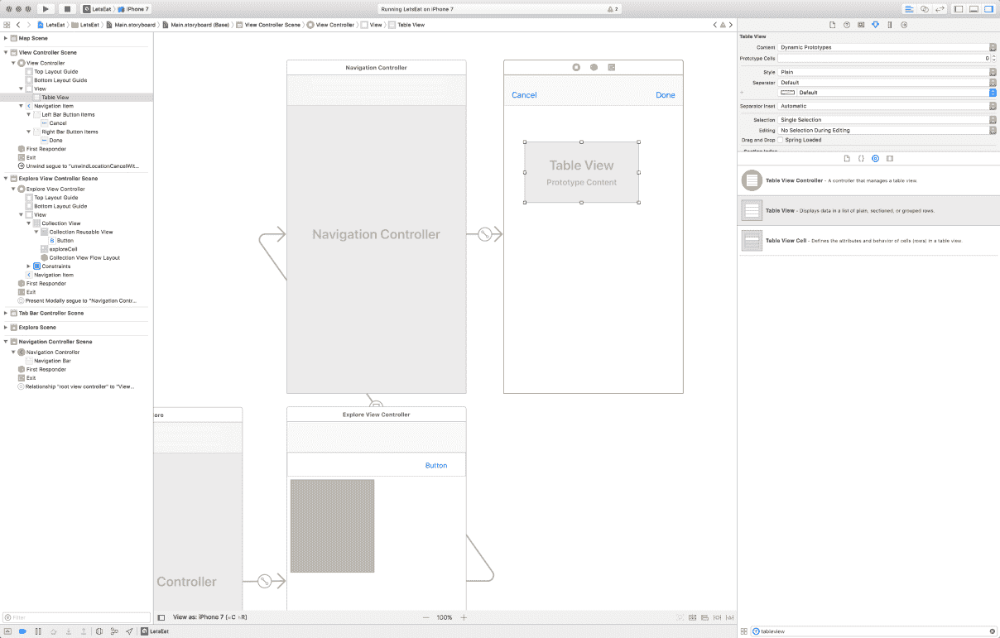

1.  选择“固定”图标并输入以下值：

+   +   将“添加新约束”下的所有值设置为`0`

    +   “限制到边距”复选框应该是不勾选的

1.  现在，点击添加 4 个约束。

如果你构建并运行项目，然后启动模态，你会看到一个空的表格视图。我们将在稍后完成这个表格视图。

# 摘要

我们已经完成了 UI 结构设置的一半。在本章中，我们创建了一个带有占位符单元格的集合视图。这使我们能够继续工作于我们应用程序的基本结构，并专注于应用程序的设计，在我们添加代码之前准备好所有资产。我们还添加了第一个原型标题，并向用户展示了一个模态。

在下一章中，我们完成基本结构的其余部分，然后集中精力调整我们的结构以匹配我们的设计。
