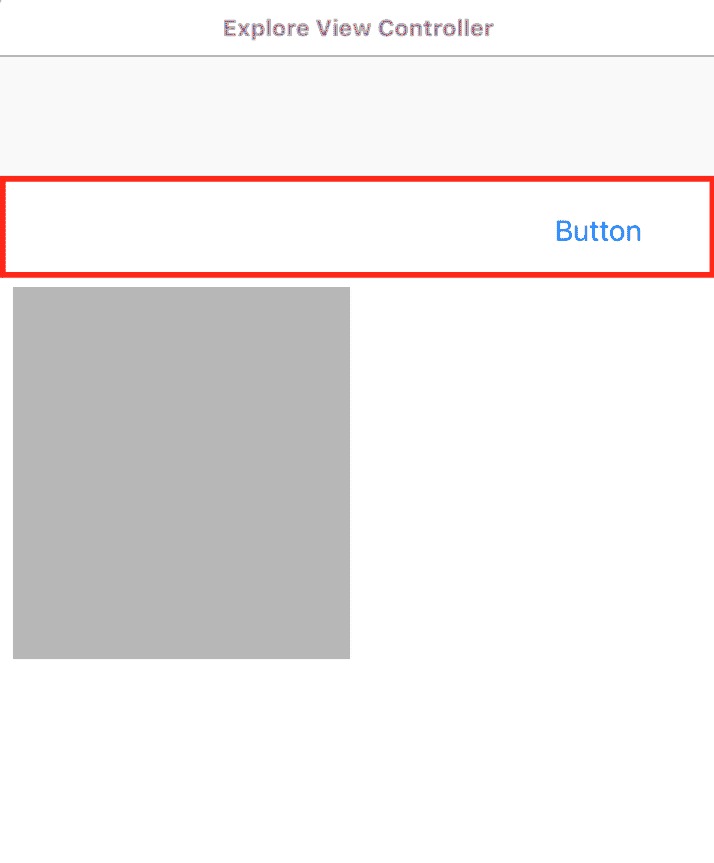
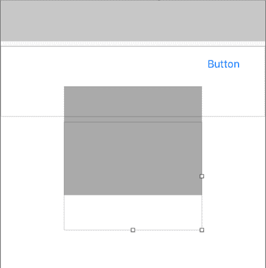
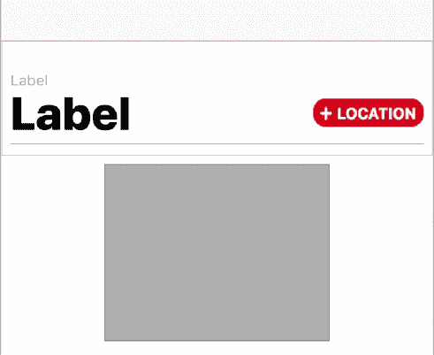
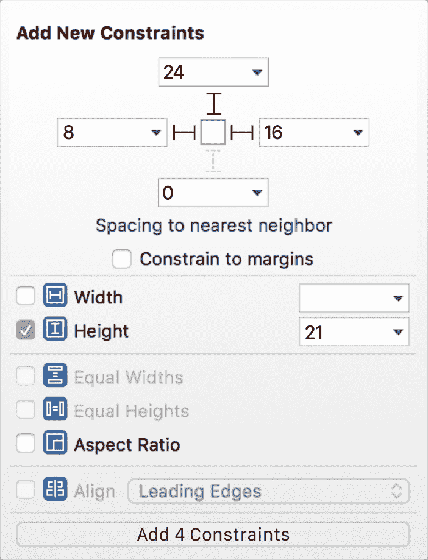
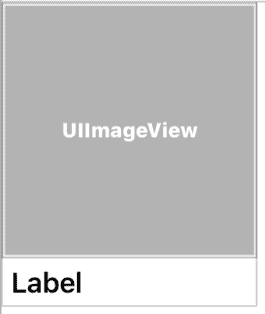
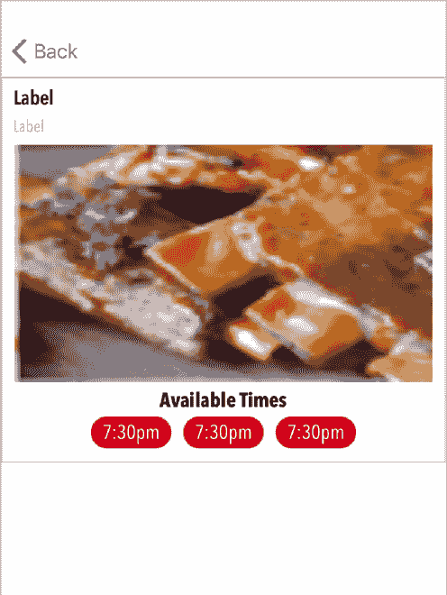
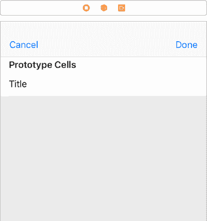

# 设计单元格

在本章以及整本书中，我们将调整我们的应用程序以匹配我们之前审查的设计。然而，设计的具体细节，如自定义字体，仅作为示例；你应该自由地更改以匹配你的品味。通过在学习过程中进行实验，你应该能更好地理解事物是如何工作的，并更舒适地使用 Xcode。我建议你首先彻底理解课程内容，然后再进行实验；然而，我强烈鼓励你享受乐趣并使应用程序成为你自己的。

在本章中，我们将使用以下内容：

+   表视图单元格

+   收集视图单元格

+   自动布局

# 设置“探索”标题

让我们回顾一下“探索”标签的标题部分：

在这个标题中，我们只有四个元素：两个 `UILabels`（标题和副标题）、一个按钮以及标题和按钮下方的灰色线条。

我们已经在之前章节中创建的原型标题（集合可重用视图）中已经有了这个按钮，现在我们需要添加两个 `UILabels` 并然后修改这三个元素，以便它们与我们的设计相匹配：

让我们开始吧：

1.  在 `Main.storyboard` 中，选择原型标题并在大小检查器中更新以下值：

+   +   宽度：`0`

    +   高度：`100`

当你更新大小的时候，你可能会遇到以下情况：

如果你这样做，只需点击不同的文件然后回来；故事板应该会自动修复。

1.  接下来，在对象库的过滤器字段中输入 `view`。

1.  然后，将一个视图拖入到我们刚才添加的原型标题中。

1.  选择视图（确保你使用轮廓视图并将此视图移动到所有其他元素下方。如果你不这样做，它将覆盖一切。）然后在大小检查器中更新以下值：

+   +   X：`0`

    +   Y：`0`

    +   宽度：`375`

    +   高度：`90`

1.  现在，在对象库的过滤器字段中输入 `label`。

1.  然后，将两个标签拖入到我们刚才添加的原型标题视图。

1.  接下来，我们将在我们的 `Assets.xcassets` 文件中添加一个新的颜色。将颜色命名为 `LetsEat Light Grey` 并将十六进制颜色设置为 `AFAFB2`。

1.  当我们在这里时，让我们将我们的 `Demo Grey` 重命名为 `LetsEat Dark Grey`。我们的单元格不会更新到这个新颜色，但这不会破坏任何东西。我们将在本章的后面更改这些颜色。

1.  选择其中一个标签，它将成为我们的副标题，然后在属性检查器中更新以下值：

+   +   颜色：`LetsEat Light Grey`

    +   字体：`System Semibold 13`

1.  接下来，在大小检查器中，更新以下值：

+   +   X：`8`

    +   Y：`24`

    +   宽度：`350`

    +   高度：`21`

1.  现在，选择另一个标签，它将成为我们的标题，然后在属性检查器中更新字体值为 `System Heavy 40.0`：

1.  然后，在大小检查器中更新以下值：

+   +   X：`8`

    +   Y：`45`

    +   宽度：`255`

    +   高度：`37`

1.  选择按钮；在属性检查器中，更新以下值：

+   +   类型：`自定义`

    +   图片：`btn-location`

    +   删除文本按钮

1.  接下来，在大小检查器中更新以下值：

+   +   X：`271`

    +   Y：`50`

    +   宽度：`96`

    +   高度：`25`

1.  最后，在对象库的过滤器字段中输入 `view`。

1.  然后，将一个视图拖入原型标题。

1.  选择视图（确保您使用轮廓视图并将此元素移至所有其他元素下方），并在大小检查器中更新以下值：

+   +   X：`8`

    +   Y：`89`

    +   宽度：`359`

    +   高度：`1`

1.  选择按钮，并在属性检查器中更新背景值为 `LetsEat Light Grey`：

现在，将所有元素放置到原型标题中，您的单元格应该看起来如下（在您的标签中应有文本“标签”）：

为了确保我们的单元格能够适应不同设备的尺寸，我们必须添加自动布局约束。

# 向探索标题添加自动布局

使用自动布局可能会非常令人沮丧。如果它不起作用，我建议您清除所有约束并重新开始。

让我们从向我们的副标题标签添加自动布局开始，这是我们应显示当前选定位置的地方：

1.  选择副标题标签，然后选择固定图标。输入以下值：

1.  点击添加 4 个约束。

1.  接下来，选择位置按钮，然后选择固定图标。输入以下值：

+   +   上：`5`

    +   右：`8`

    +   限制到边距：未选中

    +   宽度：`96`（应选中）

    +   高度：`25`（应选中）

1.  点击添加 4 个约束。

1.  接下来，选择灰色线条（视图），然后选择固定图标。输入以下值：

    +   右：`8`

    +   下：`10`

    +   左：`8`

    +   限制到边距：未选中

    +   高度：`1`（应选中）

1.  点击添加 4 个约束。

1.  现在，选择标题标签，然后选择固定图标。输入以下值：

+   +   上：0

    +   右：8

    +   左：8

    +   高度：37（应选中）

    +   限制到边距：未选中

1.  点击添加 4 个约束。

1.  最后，选择我们刚刚用作背景的视图，然后选择固定图标。输入以下值：

+   +   上：`0`

    +   右：`0`

    +   下：`10`

    +   左：`0`

    +   限制到边距：未选中

1.  点击添加 4 个约束。

我们已经完成了向探索标签页标题添加自动布局。

# 设置探索单元格

接下来，让我们处理探索集合视图单元格：

1.  在属性检查器中选择原型单元格，称为 `exploreCell`，并将背景颜色更新为白色。

1.  在探索视图控制器中，然后，在大小检查器中更新以下值：

+   +   宽度：`164`

    +   高度：`195`

1.  在对象库的过滤器字段中，输入 `view`。

1.  然后，将一个视图拖入原型单元格。

1.  选择视图，并在大小检查器中更新以下值：

+   +   X：`0`

    +   Y：`0`

    +   宽度：`164`

    +   高度：`164`

1.  接下来，在过滤器字段中输入：`image`。

1.  然后，将一个图像视图拖入我们刚刚添加的视图中。

1.  选择图像视图后，在大小检查器中更新以下值：

+   +   X：`0`

    +   Y：`0`

    +   宽度：`164`

    +   高度：`164`

1.  现在，在过滤器字段中输入：`label`。

1.  然后，将一个标签拖动到原型单元格中（不是视图）。

1.  选择标签后，在属性检查器中更新字体值为 Avenir Next Condensed Demibold 20。

1.  接下来，在大小检查器中更新以下值：

+   +   X：`6`

    +   Y：`169`

    +   宽度：`152`

    +   高度：`21`

`exploreCell` 现在已完成。您的单元格现在应如下所示：

在我们移动到餐厅单元格之前，让我们添加自动布局约束。

# 将自动布局添加到探索单元格

1.  在大纲视图中，选择包含图像视图和固定图标的容器视图。输入以下值：

+   +   顶部：`0`

    +   右侧：`0`

    +   左侧：`0`

    +   限制到边距：未勾选

    +   高度：`164`（应进行检查）

1.  点击添加 4 个约束。

1.  接下来，选择图像视图，然后选择固定图标。输入以下值：

+   +   顶部：`0`

    +   右侧：`0`

    +   底部：`0`

    +   左侧：`0`

    +   限制到边距：未勾选

1.  点击添加 4 个约束。

1.  最后，选择此 `exploreCell` 中的标签和固定图标。输入以下值：

+   +   顶部：`5`

    +   右侧：`6`

    +   底部：`6`

    +   限制到边距：未勾选

    +   高度：`21`（应进行检查）

1.  点击添加 4 个约束。

探索单元格现在具有所有必要的约束，我们可以现在设置餐厅单元格。

# 设置餐厅单元格

我们正在设置的餐厅单元格有许多元素，所以请确保您有足够的时间。确保您前往餐厅视图控制器并开始：

1.  在属性检查器中更新背景颜色。

1.  选择餐厅列表原型单元格，并在大小检查器中更新以下值：

+   +   宽度：`375`

    +   高度：`312`

1.  在对象库的过滤器字段中输入 `view`。

1.  然后，将一个视图拖动到原型单元格中。

1.  选择视图后，在大小检查器中更新以下值：

+   +   X：`75.5`

    +   Y：`245`

    +   宽度：`224`

    +   高度：`56`

1.  接下来，在过滤器字段中输入 `label`。

1.  然后，将一个标签拖动到我们刚刚添加的视图中。

1.  选择标签后，在大小检查器中更新以下值：

+   +   X：`0`

    +   **Y**：`2`

    +   宽度：`224`

    +   高度：`21`

1.  然后，在属性检查器中更新以下值：

+   +   文本：在文本下的空文本字段中添加可用时间

    +   颜色：`黑色`

    +   对齐：`居中`

    +   字体：Avenir Next Condensed Bold 17

1.  接下来，在过滤器字段中输入 `button`。

1.  将按钮拖动到我们刚刚添加的视图中。

1.  选择按钮后，在属性检查器中更新以下值：

+   +   类型：`系统`

    +   标题：普通，然后在标题下的空文本字段中添加 7:30 pm

    +   字体：Avenir Next Condensed Regular 17

    +   文本颜色：`白色`

    +   背景：`time-bg`

1.  接下来，在大小检查器中更新以下值：

+   +   宽度：`68`

    +   高度：`27`

1.  现在，在大纲视图中选择按钮并按 *cmd* + *C* 复制。

1.  然后，按 *cmd* + *V* 两次粘贴。你现在应该有三个按钮。

1.  接下来，*cmd* + 点击每个创建的按钮，然后点击 **嵌入堆叠** 图标。这是过滤器图标左侧的第四个图标：

**

1.  在大纲视图中选择堆叠视图，然后更新属性检查器中的以下值：

+   +   轴：水平

    +   对齐：填充

    +   分布：等间距

    +   间距：`10`

1.  在大小检查器中，将 X 设置为 `0`。

1.  接下来，在对象库的过滤器字段中输入 `view`。

1.  然后，将一个视图拖动到原型单元格中。

1.  选择视图后，在大小检查器中更新以下值：

+   +   X：`11`

    +   Y：`42`

    +   宽度：`353`

    +   高度：`200`

1.  接下来，在过滤器字段中输入 `image`。

1.  然后，将一个图像视图拖动到我们刚刚添加的视图中。

1.  在大纲视图中选择图像视图，并在属性检查器中更新图像值为 `american`。我们只是使用这张图片作为占位符，以查看我们的单元格是否设置正确。稍后，我们将删除它并使用代码加载图片。

1.  选择图像视图后，在大小检查器中更新以下值：

+   +   X：`0`

    +   Y：`0`

    +   宽度：`353`

    +   高度：`200`

1.  接下来，在过滤器字段中输入：`label`。

1.  然后，将两个标签拖动到原型单元格中。

1.  选择一个标签，并在属性检查器中更新字体值为 Avenir Next Condensed Demi Bold 17。

1.  然后，在大小检查器中，更新以下值：

+   +   X：`10`

    +   Y：`8`

    +   宽度：`355`

    +   高度：`19`

1.  选择另一个标签，并在属性检查器中更新以下值：

+   +   颜色：`LetsEat 深灰色`

    +   字体：Avenir Next Condensed Regular 14

1.  然后，在大小检查器中，更新以下值：

+   +   X：`10`

    +   Y：`32`

    +   宽度：`355`

    +   高度：`19`

我们已经完成了餐厅单元格的设置，现在看起来如下：

现在我们需要将自动布局添加到所有元素。

# 将自动布局添加到餐厅单元格

由于我们在餐厅单元格中有许多元素，这意味着使用自动布局时出现错误的机会更多。虽然有时使用自动布局可能会让你感到沮丧，但如果你像我一样是一个视觉型的人，希望你最终会欣赏使用它：

1.  选择顶部标签，然后输入以下值：

+   +   顶部：`8`

    +   右侧：`10`

    +   左侧：`10`

    +   限制到边距：未勾选

    +   高度：`19`（应进行检查）

1.  点击添加 4 个约束。

1.  现在，选择最后一个标签下面的标签，然后选择固定图标。输入以下值：

+   +   顶部：`5`

    +   右侧：`10`

    +   左侧：`10`

    +   限制到边距：未勾选

    +   高度：`16`（应进行检查）

1.  点击添加 4 个约束。

1.  接下来，选择图像容器，然后选择固定图标。输入以下值：

+   +   顶部：`4`

    +   限制到边距：未勾选

    +   宽度：`353`（应进行检查）

    +   高度：`200`（应进行检查）

1.  点击添加 3 个约束。

1.  接下来，点击对齐图标，并将容器内的水平对齐值设置为 `0`（应进行检查）。

1.  点击添加 1 个约束。

1.  现在，选择容器内部的图片，然后选择固定图标。输入以下值：

+   +   顶部：`0`

    +   右：`0`

    +   底部：`0`

    +   左：`0`

    +   限制于边距：未勾选

1.  点击添加 4 个约束。

1.  现在，选择包含堆叠视图和可用时间标签的容器，然后选择固定图标。输入以下值：

+   +   顶部：`3`

    +   限制于边距：未勾选

    +   宽度：`224`

    +   高度：`56`

1.  点击添加 3 个约束。

1.  接下来，点击对齐图标，并将**在容器中水平对齐**的值输入为`0`（应该勾选）。

1.  点击添加 1 个约束。

1.  现在，在容器内部选择堆叠视图，然后选择固定图标。输入以下值：

+   +   顶部：`4`

    +   右：`0`

    +   左：`0`

    +   限制于边距：未勾选

    +   高度：`27`

1.  点击添加 4 个约束。

1.  接下来，选择三个按钮上面的标签，然后选择固定图标。输入以下值：

+   +   顶部：`2`

    +   左：`0`

    +   右：`0`

    +   限制于边距：未勾选

    +   高度：`21`

1.  点击添加 4 个约束。

1.  最后，点击对齐图标，并将**在容器中水平对齐**的值输入为`0`（应该勾选）。

1.  点击添加 1 个约束。

现在，餐厅单元格的所有自动布局都已设置。让我们构建并运行我们的项目，然后转到餐厅单元格。一切应该看起来与我们在书中之前审查的设计一致。

# 位置单元格

我们现在需要处理位置单元格。找到位置视图控制器，对于这个单元格，我们使用苹果提供的预定义单元格。

1.  选择表格视图，并将原型单元格更新为`1`。

1.  接下来，选择原型单元格并输入以下值：

+   +   样式：基本

    +   标识符：`locationCell`

这就是我们需要做的全部。现在，你的单元格应该看起来如下：

当你将样式从自定义更改为基本时，单元格中应该出现标题这个词。标题只是占位文本。我们所有的单元格现在都已准备好编写我们在后续章节中要讨论的代码。

# 摘要

在本章中，我们格式化了单元格以匹配我们的设计，并添加了自动布局约束。自动布局可能很复杂；然而，就像任何事情一样，你练习得越多，就越容易。你可以用代码编写自动布局，但我不喜欢在故事板中这样做。如果你想用代码来做，有很多教程可以帮助你。

在下一章中，我们将致力于使餐厅详情页看起来与设计一致。由于其中很多是静态的，你应该看到如何使用静态表格可以让你的应用迅速启动并运行。
