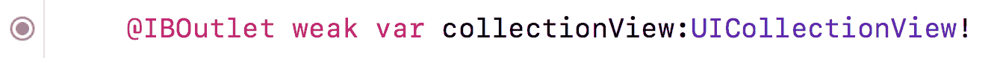

# 开始使用网格

我是一个视觉型的人；我更喜欢从视觉开始，确保应用看起来符合设计。从 UI 开始帮助我识别数据结构，并使我熟悉应用。因此，我可以将注意力集中在代码上。

在前面的章节中，我们设置了我们的应用结构，并对涉及的基本概念有了良好的理解。在本章中，你将学习关于应用架构以及如何为我们的“让我们吃饭”应用创建架构。

本章我们将涵盖以下内容：

+   理解模型-视图-控制器（MVC）架构

+   类和结构

+   控制器和类

# 理解模型-视图-控制器（MVC）架构

苹果构建 iOS 应用以使用被称为**模型-视图-控制器**（**MVC**）的东西，这是一种描述在应用中结构化代码的架构模式。用通俗易懂的话来说，这仅仅意味着将我们的应用分成三个不同的阵营：模型、视图和控制器。

这里有一个 MVC 架构的图解，帮助你理解它：


让我们讨论每个阵营：

+   **模型**：**模型**阵营负责应用的数据和业务逻辑。模型唯一的工作是处理数据的表示、数据存储以及数据上的操作。

+   **视图**：**视图**阵营负责屏幕上显示的所有内容。视图处理展示和格式化用户交互产生的结果数据。

+   **控制器**：**控制器**阵营是其他两个阵营之间的联络员或协调者。控制器处理大量的设置和与视图的连接。控制器还解释用户交互。由于控制器位于视图和模型之间，因此视图和模型对彼此一无所知。

总结来说，控制器处理用户交互，要么直接对视图做出响应，要么将其传递给模型。当模型完成一个任务时，它将任务传递回控制器，然后控制器与视图进行交流。

# 熟悉设置

对于初学者来说，MVC 架构可能会让你不确定事物应该放在哪里。随着我们通过本书的进展，你将学会放置事物的位置以及原因。所以，在我们一步步共同完成这个过程时，你不需要担心事物应该放置的位置。

随着你的项目增长，MVC 架构将很多责任放在了控制器上。因此，在本书中，我们调整了 MVC 模式，以便不对控制器施加过多压力。

在我们继续编码之前，我们需要讨论类和结构。

# 类和结构

类和结构体（也称为结构体）是包含属性和方法的文件。您使用这些属性和方法来添加功能。您从第一章，“熟悉 Xcode”，就开始使用结构体了。字符串、整数、布尔值、数组、字典和集合都是结构体。

在本书的早期，我们创建了函数。正如第六章，“开始 UI 设置”中提到的，方法是一个存在于类或结构体内部的函数。

类和结构体非常相似；然而，Swift 对它们各自的处理方式略有不同。为了更好地理解类和结构体是如何工作的，我们创建一个新的 Playground 项目。在 Playground 中工作使我们能够学习如何创建自定义类和结构体，并了解它们各自的优点和缺点。

1.  您可以保持项目打开，但让我们回到 Playgrounds。由于我们打开了 Xcode，请转到文件 | 新建 | Playground。

1.  在出现的选项屏幕中，为新 Playground 命名，命名为`FunctionsStructs`，并确保平台设置为 iOS。点击下一步然后创建。现在，让我们删除新 Playground 中的所有内容，并打开调试面板，可以使用切换按钮或*cmd* + *Shift* + *Y*。

1.  在您的空 Playground 中添加以下内容：

```
class Cat {
}
struct Dog {
}
```

我们刚刚创建了我们第一个类和结构体，并定义了两个新的自定义数据类型（称为**Swift 类型**），`Cat`和`Dog`。由于我们尚未为类或结构体提供一个属性（如名称）或创建`Cat`或`Dog`的实例，所以在结果或调试面板中您什么也看不到。

当您创建类和结构体时，最佳实践是使用大写字母开头。此外，您必须为您的类和结构体使用不同的名称。否则，您将得到一个错误。尽管一个是类，另一个是结构体，但它们各自都需要一个独特的名称。

现在，我们需要为我们的`Cat`类和`Dog`结构体命名。因此，让我们给它们都添加一个名为`name`的属性：

```
class Cat {
  var name:String?
}

struct Dog {
  var name:String?
}
```

如果在创建时无法设置属性，那么建议您使用问号（`?`）将该属性设置为可选。使用可选，保护您的代码在未设置名称时尝试访问名称。您还可以将变量设置为可选未包装。例如，您还可以这样做：

```
var name:String!.
```

现在`Cat`和`Dog`都有了一个名为`name`的属性，让我们为它们各自创建一个实例：

```
let yellowCat = Cat()
yellowCat.name = "Whiskers"
print(yellowCat.name)
var yellowDog = Dog()
yellowDog.name = "Bruno"
print(yellowDog.name)
```


到目前为止，表面上看起来一切正常。我们创建了 `Cat` 和 `Dog`，并为它们各自命名。但是，假设 `Whiskers` 跑掉了，几周后，它在新家庭中找到了一个家，这个新家庭决定将它的名字改为 `Smokey`。在 `Whiskers` 跑掉后，`Bruno` 变得孤独，决定去找它，但也迷路了。`Bruno` 找到了一个新的家，这个新家庭决定将它命名为 `Max`。

在游乐场中，我们创建了一个新的常量，名为 `yellowStrayCat`，并将其设置为等于 `yellowCat`，因为它仍然是 `Whiskers`。然而，我们将 `yellowStrayCat` 的名称更改为 `Smokey`。我们还创建了一个新的常量，名为 `yellowStrayDog`，将其设置为等于 `yellowDog`，并将其命名为 `Max`。

```
let yellowStrayCat = yellowCat
yellowStrayCat.name = "Smokey"
print(yellowStrayCat.name)

var yellowStrayDog = yellowDog
yellowStrayDog.name = "Max"
print(yellowStrayDog.name)
```

我们的结果面板显示，`yellowStrayCat` 和 `yellowStrayDog` 的名称现在分别是 `Smokey` 和 `Max`。所以，在我们的类和我们的结构体之间似乎一切正常，对吧？不，它们并不相同。在打印语句（`yellowStrayCat.name`）下方打印 `yellowCat` 的名称。此外，对于 `yellowDog` 的名称，在打印语句（`yellowStrayDog.name`）下方也做同样的操作。现在，你的代码应该如下所示：

```
let yellowStrayCat = yellowCat
yellowStrayCat.name = "Smokey"
print(yellowStrayCat.name)
print(yellowCat.name)

var yellowStrayDog = yellowDog
yellowStrayDog.name = "Max"
print(yellowStrayDog.name)
print(yellowDog.name)
```

在我们的结果面板中，如前面的截图所示，你应该注意到一个意外的结果。`yellowCat`，`Whiskers` 现在的名字是 `Smokey`，但 `yellowDog` 仍然是 `Bruno`。不深入技术细节，当你使用类并像我们这样复制它时，它会回指原始实例。这被称为引用类型。然而，当结构体被复制时，它会创建一个新的实例，原始实例不受影响。这被称为 **值类型**。

在我们继续之前，让我们看看两者之间还有一个区别。在编程中，我们有一个称为 **继承** 的概念，这意味着我们可以创建另一个具有默认值的对象，其他对象可以继承这些默认值。让我们创建一个 `Animal` 类，它是我们的 `Cat` 类下面的基类：

```
class Animal {
  var age:Int?
}
```

现在，让我们更新我们的 `Cat` 类，使其继承自它，如下面的代码所示：

```
class Cat:Animal {
  ...
}
```

注意，我们只更新了 `Cat` 之后的内容。花括号中的其余类保持不变。

由于我们的类现在继承自 `Animal`，我们应该有一个名为 `age` 的新属性。在将 `yellowCat` 命名为 `Whiskers` 并在 `print` 语句之上，在我们设置 Whiskers 的名称之后，输入以下内容：

```
yellowCat.age = 3
```


因此，正如预期的那样，我们能够给 `Whiskers` 一个 `age`。让我们通过在 `Dog` 结构体后直接添加 `Animal` 来为我们的 `Dog` 结构体做同样的事情：

```
struct Dog:Animal {
  var name:String?
}
```

一旦你输入了前面的代码片段，你会看到以下内容：


出现了一个红色错误，并通知你 `Non-class type 'Dog' cannot inherit from class Animal`。因此，我们需要创建一个名为 `AnimalB` 的结构体，因为我们不能有相同的名称：

```
struct AnimalB {
  var age:Int?
}
```

将你的`Dog`结构体从`Animal`更新到`AnimalB`：

```
struct Dog:AnimalB {
  var name:String?
}
```

现在，你应该看到一个错误叫做`从非协议类型'AnimalB'继承`，这意味着我们的结构体不能从另一个结构体继承：


继承是你可以用类来做的，但不能用结构体来做的事情；这是类和结构体之间的另一个区别。还有一些其他的高级技术差异，但就我们的目的而言，这里描述的两个就足够了。

# 控制器和类

当与`UIViewController`、`UICollectionViewController`和`UITableViewController`一起工作时，你需要为这些元素中的每一个创建一个类文件。每个文件处理控制器发送和接收的所有逻辑和交互。除了交互之外，类文件还负责接收数据。当我们更深入地创建每个这些类文件时，你应该对此有更深的理解。

# 创建我们的控制器

当我们处理 UI 时，我们使用了为你准备好的控制器。现在我们知道我们的 UI 已经就绪，我们可以去掉这两个文件。我们将一起重新创建它们，并了解它们是如何工作的。

1.  请选择`ExploreViewController.swift`，然后*cmd* + 点击`RestaurantViewController.swift`。当你这样做时，你应该有两个文件被选中：


1.  接下来，按键盘上的*Delete*键。你应该看到以下屏幕：


1.  点击移至废纸篓。

1.  如果你选择移除引用，它会从项目中移除，但它仍然在你的项目文件夹中。

接下来，让我们创建我们的第一个文件：

1.  右键点击`LetsEat`文件夹，并选择新建文件。

1.  在选择新文件模板的屏幕上，顶部选择 iOS，然后选择 Cocoa Touch Class。然后，点击下一步：


1.  你应该看到一个选项屏幕。添加以下内容：

新文件：

+   +   类：`ExploreViewController`

    +   子类：`UIViewController`

    +   还要创建 XIB：未选中

    +   语言：`` `Swift` ``

1.  点击下一步后，你会被要求创建这个文件。选择创建，然后你的文件应该看起来像我的一样。

让我们回顾一下这个`ExploreViewController`类文件，并在文件内部做一些维护。我们创建这个文件是为了与我们在最初设置 UI 时创建的`UIViewController`一起使用。

注意，这个文件中有三个方法——`viewDidLoad()`、`didReceiveMemoryWarning()`和`prepare()`（已被注释掉）。让我们删除`didReceiveMemoryWarning()`和`prepare()`，因为我们现在不需要它们：


剩下的就是`viewDidLoad()`；这个方法在视图控制器的一生中只会被调用一次。让我们通过更新`viewDidLoad()`来了解这意味着什么：

```
func viewDidLoad() {
  super.viewDidLoad()
  print("Hello Explore View Controller")
}
```

现在，通过点击播放按钮（或使用 *cmd* + *R*）来运行项目。尽管我们期望在 Debug 面板中看到上面的 `print` 语句，但我们遇到了崩溃：


这个崩溃告诉我们，它有一个名为 `collectionView` 的键，但是找不到它。当我们删除我们的文件时，storyboard 仍然有对这个文件的引用，因为它不知道文件已被删除并重新创建。为了防止它崩溃，我们需要移除这个引用或者在我们的文件中添加变量 `collectionView`。

为了学习目的，我们将做两件事。让我们先移除引用，稍后我们将添加并重新连接它。我们这样做的原因是因为这是初学者最常见的错误之一。你连接了某个东西，然后移除了它，但从未从 storyboard 中移除，所以你的应用崩溃了。

1.  打开 `Explore.storyboard` 文件，并在 Utilities 面板中选择 Connections 检查器。

1.  接下来，在 Outline 视图中选择 Explore 视图控制器，你将在 Outlets 下看到问题：


这个感叹号告诉我们，它在我们 `ExploreViewController.swift` 文件中找不到这个变量。只需点击 X，变量就会从 storyboard 文件中移除。

如果你现在重新运行项目，我们的应用会再次崩溃。原因是我们的应用正在寻找我们尚未设置的数据集合视图。让我们更新这一点，以消除我们的崩溃：

1.  打开 `Explore.storyboard` 文件。

1.  然后，在 Outline 视图中仍然选中 Explore 视图控制器，在 Utilities 面板的 Connections 检查器中点击数据源和代理的 X。


让我们再次通过点击播放按钮（或使用 *cmd* + *R*）来运行项目；你现在应该在 Debug 面板中只看到 Hello Explore View Controller。

在我们继续之前，我们还需要更新我们的 Restaurant 视图控制器。你需要进入你的 `Restaurants.storyboard` 文件，并在 Outlets 检查器中选择 `collectionView`、`dataSource` 和 `delegate` 的 X，以移除我们在书中之前添加的 outlet。


接下来，在 Identity 检查器中，删除自定义类中的 `RestaurantViewController`。


自从我们删除了那些文件，我们的程序崩溃情况会更多。现在，我们已经将我们的 `ExploreViewController` 与 storyboard 中的 `UIViewController` 连接起来，让我们开始使用我们的 `UICollectionView`。

# 理解 Collection View 控制器和 Collection View 单元

如本书前面所述，集合视图控制器允许我们在网格中显示我们的数据。集合视图内的单个项目称为单元格，这些单元格显示数据。这些数据可以是图片、文本，或者图片和文本的组合。你可以完全控制你的集合视图单元格可以显示的内容。我们的集合视图控制器负责确保显示正确的单元格数量。

现在，让我们将我们的文件`ExploreViewController`与故事板中的`UICollectionView`连接起来。为此，我们使用辅助编辑器（或分屏），我们可以通过以下操作访问它：

1.  打开`Explore.storyboard`。

1.  使用隐藏导航器切换或*cmd* + *0*关闭导航器面板。

1.  通过按工具切换或使用*cmd* + *Alt* + *0*关闭工具面板。

1.  接下来，选择辅助编辑器或使用*cmd* + *Alt* + *Enter*。

你现在应该看到左侧的`Explore.storyboard`和右侧的`ExploreViewController.swift`：


1.  在你的`ExploreViewController.swift`文件中，在以下代码行之后添加以下内容：

```
class ExploreViewController: UIViewController {
  @IBOutlet weak var collectionView:UICollectionView!
```

`IBOutlet`是一种连接到 UI 元素的方式。我们在`UIViewController`上有一个集合视图；现在，我们正在创建一个变量，允许我们连接到它。

1.  在你创建变量后，你应该在变量的左侧看到一个小的圆圈：


1.  当你悬停在它上面时，你应该在圆圈内部看到一个加号按钮：


点击它并将其拖动到你的`UIViewController`中的集合视图中：


1.  一旦你释放鼠标按钮，你应该看到圆圈被填充：



1.  现在，选择标准编辑器或使用*cmd* + *Enter*。

在你的场景中，选择你的集合视图。然后，在你的工具面板中，选择连接检查器，这是右侧的最后一个图标。在出口部分，我们现在重新添加回`dataSource`和代理，与之前移除的相同：


`dataSource`属性是用来为我们的集合视图提供数据的，因此我们需要将我们拥有的任何数据传递给这个属性。另一方面，提供行为的`delegate`属性不需要我们提供任何内容，因为它接收在集合视图内发生的事件。

我们需要更新我们的集合视图的数据源；现在让我们添加这个：

1.  点击并拖动`dataSource`属性到你的大纲视图中的探索视图控制器。


1.  点击并拖动代理属性到你的大纲视图中的探索视图控制器：


# 将数据放入集合视图

有盒子是很好的，但是有带漂亮图片的数据要吸引人得多。让我们在集合视图中显示一些数据：

1.  使用*cmd* + *Shift* + *O*，这将打开一个名为“快速打开”的小窗口。在窗口内部，输入`ExploreView`并按*Enter*键以选择`ExploreViewController.swift`文件。

1.  将我们的类定义从`ExploreViewController:UIViewController`类更新为以下内容：

```
class ExploreViewController:UIViewController, UICollectionViewDataSource
```

# 理解数据源

每当我们使用集合视图获取数据时，我们必须遵守一个协议。协议是一组我们可以访问的方法，可以是必需的或可选的。对于集合视图，我们必须实现三个方法来将数据放入集合视图中。所以，让我们在`viewDidLoad()`的闭合花括号之后添加以下四个函数（每个都以`func`开头）：


让我们分解代码以更好地理解我们在做什么：

+   **第 A 部分**：这是我们添加到集合视图中的标题所需的第一种方法。

```
collectionView(_:viewForSupplementaryElementOfKind:at:)
```

+   **第 B 部分**：标识符是我们之前在章节中设计时添加的。这个标识符帮助 Xcode 知道我们正在引用什么视图：

```
let headerView = collectionView.dequeueReusableSupplementaryView(ofKind: kind, withReuseIdentifier: "header", for: indexPath)
return headerView
```

+   **第 C 部分**：我们的下一个方法会在我们需要每个项目时被调用。因此，在我们的情况下，它会被调用 20 次：

```
collectionView(_:cellForItemAt:)
```

+   **第 D 部分**：在这里，每当调用`collectionView(_:numberOfItemsInSection:)`时，我们都会创建一个单元格。标识符`exploreCell`是我们给它在故事板中起的名字；因此，这就是我们在我们的集合视图中抓取并使用的单元格：

```
return collectionView.dequeueReusableCell(withReuseIdentifier: "exploreCell", for: indexPath)
```

+   **第 E 部分**：此方法告诉我们的集合视图我们想要显示多少个不同的部分：

```
numberOfSections(in collectionView: UICollectionView)
```

+   **第 F 部分**：在这里，我们正在告诉我们的集合视图我们只想显示一个部分：

```
return 1
```

+   **第 G 部分**：我们的下一个方法告诉我们的集合视图我们将在我们设置的部分中显示多少个不同的项目。

```
collectionView(_:numberOfItemsInSection:)
```

+   **第 H 部分**：我们正在告诉我们的集合视图我们想要显示 20 个项目。

```
return 20
```

+   **第 I 部分**：最后，我们将这一行恢复原样，因为它被移除了。我们使用这个函数在点击取消按钮时关闭位置模态。

```
@IBAction func unwindLocationCancel(segue:UIStoryboardSegue) {}
```

通过点击播放按钮（或使用*cmd* + *R*）来构建和运行项目。你会看到我们的应用回到了第十一章的结尾，*设计静态表格*，但现在我们实际上知道代码方面发生了什么。

# 摘要

在本章中，我们涵盖了相当多的新主题以及大量的代码。只要你对本章所涵盖的内容有基本的理解，你就可以继续前进。许多这些概念和想法将会再次被涉及，因为这些是 iOS 中的常见设计模式。

我们学习了模型视图控制器架构。然后，我们介绍了类和结构体，它们的相似之处和不同之处。最后，我们探讨了控制器和类以及它们是如何工作的。然后我们为我们的故事板文件创建了控制器。

在下一章中，我们将探讨如何将本地数据导入我们的应用。我们还将了解如何将数据从探索视图传递到餐厅列表。
