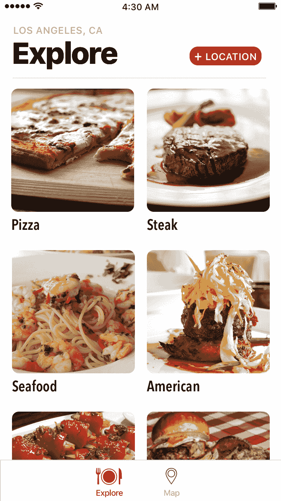
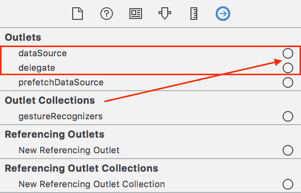

# 将数据放入我们的网格中

与数据一起工作非常重要，但与初学者一起工作时，我喜欢分步骤来做，这样这个过程会容易一些。在本章中，我们将处理存储在设备上的数据。在本书的后面部分，我们将处理从源中获取的数据。源数据意味着它来自网站 URL。使用源数据意味着您可以在不更新应用程序的情况下更新数据。

本章我们将涵盖以下内容：

+   什么是模型？

+   什么是 plist？

+   如何创建一个 plist？

+   与管理类一起工作

在上一章中，我们完成了探索列表，但我们没有数据。我们需要创建一个模型，我们可以用它来存储我们的单元格可以用来显示数据的信息。

# 模型

通常，当您在设计模型时，最好的开始方式是查看与您的视图关联的数据。让我们再次看看我们的应用设计：



在网格中显示的项（`UICollectionViewCell`）都由一些数据支持。从设计来看，我们看到每个项都需要一个图像和一个名称（菜系）。因此，我们需要创建一个名为 `ExploreItem` 的模型，具有两个属性，具体是 `image` 和 `name`。

在模型库中，我们将创建三个文件——`ExploreData.plist`、`ExploreItem.swift` 和 `ExploreDataManager.swift`。

# ExploreData.plist

第一个文件 `ExploreData.plist` 已经为您创建好了，可以在本章的项目文件中找到。这个文件包含我们需要的所有数据，以便有一个菜系列表。将此文件拖到导航器面板中的 `Model` 文件夹中。

在这个文件中，有一个字典项数组。每个项都有一个特定菜系的名称和图像。让我们看看这个文件的前几个元素：


我们将把这个文件加载到我们的探索列表中，这是我们用来根据特定菜系筛选餐厅的工具。

# ExploreItem.swift

接下来，我们需要创建一个文件来表示我们的数据。我们的探索列表显示了一个图像和一个名称，这与我们在 `Explore.plist` 文件中看到的对应图像和名称相匹配。现在让我们创建这个 `ExploreItem` 文件：

1.  右键点击 `Model` 文件夹并选择新建文件。

1.  在模板屏幕中，选择顶部的 iOS，然后选择 Swift 文件。然后，点击下一步。

1.  将文件命名为 `ExploreItem`，然后点击创建。

这个文件中只有一条 `import` 语句。

`import` 语句允许我们将其他库导入到我们的文件中，使我们能够查看这些库的内部，并使用它们的属性。Foundation 是苹果的核心框架之一，它提供了一组我们在编程时可以使用的工具。

由于我们不需要使用继承，我们将把这个文件做成一个 `struct`。在你的文件中添加以下内容：

```
struct ExploreItem {
}
```

现在我们已经将其声明为 `struct`，让我们添加这个文件需要的两个属性——一个图像和一个名称。对于这两个属性，我们将它们的数据类型都设置为 String。对于标题，这很有意义，因为这是我们将在 Collection View 中显示的文本。然而，对于图像，使用 String 数据类型可能并不那么明显。我们之所以将图像的数据类型设置为 String，是因为要获取它，我们必须通过名称来访问它。例如，`american.png` 是美国菜图像的文件名。在你的花括号内添加以下内容：

```
var name:String?
var image:String?
```

我们现在添加了两个属性，一个用于图像，一个用于名称，这两个属性都是可选的。由于我们不能为它们中的任何一个提供一个初始值，我们必须使它们成为可选的。

你的文件应该看起来如下：

```
struct ExploreItem {
  var name:String?
  var image:String?
}
```

我们接下来需要向这个文件添加另一项内容。

我们从 `plist` 中获取字典数据，并为每个项目创建一个 `ExploreItem`。我们的字典现在看起来如下：

```
["name": "All", "image": "all.png"]
```

我们需要将这个字典对象传递给我们的 `ExploreItem`。当你传递一个字典对象时，你必须创建一个自定义初始化器。我们的初始化器接受一个字典对象。然后，我们可以将字典中的每个项设置到我们两个属性的 数据中，即图像和名称。

当你创建一个 struct 时，默认情况下，你会得到一个 `init()` 方法，它包含你在参数中创建的所有属性。

例如，我们的 `ExploreItem` 将有一个默认初始化器，如下所示：

```
init(name:String, image:String)
```

我们将不使用这个初始化器，而是创建自己的来传递一个字典对象到它。

要创建一个**自定义初始化器**，我们将使用所谓的**扩展**，这使我们能够扩展我们的代码并添加更多功能。在你的 `ExploreItem` 文件中，在结束的大括号之后，添加以下内容：

```
extension ExploreItem {
}
```

接下来，让我们创建一个自定义初始化器，它接受一个字典对象作为参数。在我们刚刚添加的扩展的大括号之间添加以下内容：

```
init(dict:[String:Any Object]) {
}
```

我们现在在参数中创建了一个 `init()` 方法，它接受一个字典对象。正如前文所述，我们知道我们的数据看起来如下：

```
["name": "All", "image": "all.png"]
```

要传递每个值，我们需要使用字典语法，例如：

```
dict["name"]
dict["image"]
```

让我们通过将字典数据映射到我们的两个属性来继续。在 `init()` 方法的花括号内添加以下内容：

```
   self.name  = dict["name"] as? String
   self.image = dict["image"] as? String
}
```

由于我们的字典值是 `AnyObject`，我们必须指定我们的数据是一个字符串，通过在末尾使用 `as? String` 来实现。

我们现在已经为我们的 Explore 视图（菜谱列表）设置了数据项，你的文件应该看起来如下：

```
extension ExploreItem {
  init(dict:[String:AnyObject]) {
    self.name  = dict["name"] as? String
    self.image = dict["image"] as? String
  }
}
```

让我们现在关注我们的数据管理器。我们希望我们的数据管理器能够处理解析 plist 并提供数据。由于我们的数据将来自 plist，我们需要一个方法来首先从 plist 中获取数据。

# ExploreDataManager.swift

在我们的应用程序中，数据管理器负责与一个服务（例如，我们将在本书后面讨论的 Yelp API）通信，以及操作来自服务的数据。一旦收到来自服务的数据，数据管理器将创建我们可以用于应用程序的模型对象。

在某些应用程序中，这两个任务由控制器处理。然而，我们不是将这个责任放在我们的控制器上，而是限制控制器与管理者通信，这样它就永远不会知道任何关于服务的事情。

随着你对编程的熟悉，你会发现有几种不同的架构类型。我们尽可能地坚持 MVC，因为这是苹果用来构建 iOS 应用程序的方式。

现在让我们创建 `ExploreDataManager` 文件：

1.  右键点击 `Model` 文件夹，选择新建文件。

1.  在模板屏幕中，顶部选择 iOS，然后选择 Swift 文件。然后点击下一步。

1.  将此文件命名为 `ExploreDataManager`，然后点击创建。

由于我们需要首先定义我们的类，请在 `import` 语句下添加以下内容：

```
class ExploreDataManager {
}
```

在这里，我们使用了一个 `class` 而不是 `struct`，因为这是一个我们稍后会继承的文件。你并不总是确定你是否会从另一个类继承；因此，你可以默认使用 `struct`，然后在意识到你需要从另一个类继承时将其更改为 `class`。

现在，我们需要从 `ExploreData.plist` 文件中加载数据。向我们的 `ExploreDataManager` 添加以下方法：


+   **第 A 部分**：这个函数以 `fileprivate` 关键字开始。将 `fileprivate` 视为为你的方法设置访问级别的一种方式。如果你不使用 `fileprivate`，它默认为 internal，这意味着任何人都可以在类外部访问或使用该方法。

```
private
```

+   **第 B 部分**：我们的 `loadData()` 函数正在返回一些内容。`->` 表示我们的函数有一个返回值。这个方法的返回值是一个包含字典对象的数组。我们的字典将有一个字符串键，值将是 `AnyObject`。

```
[[String: AnyObject]]
```

`AnyObject` 允许我们接受任何返回的数据类型。因此，一个项目可以给我们一个 Int，而另一个项目可以返回一个 String。

您也可以使用 `Any`。`Any` 可以代表任何类型的实例，包括函数类型和可选类型。

+   **第 C 部分**：在函数内部，我们使用的是所谓的 `guard` 语句。`guard` 语句是为了在给定的语句返回 `false` 时提前退出方法或函数。我们的 `guard` 检查两个语句，并且两个语句都需要返回 `true`。

```
guard let path = Bundle.main.path(forResource: "ExploreData", ofType: "plist")
```

第一个语句检查 `ExploreData.plist` 文件是否存在于我们的应用程序包中。如果找到文件，该语句返回 `true`，并将文件路径设置为常量路径。我们接下来的语句，用逗号分隔，将在 *第 D 部分* 中讨论，如下所示。

+   **部分 D**：在这个语句中，如果第一个语句返回 `true`，我们就取 `path` 常量，然后检查文件内的内容。让我们再次看看文件中的数据：

```
let items = NSArray(contentsOfFile: path)
```


如果你查看这个 plist 的根，你会看到它的类型是数组。`NSArray` 有一个我们可以用来从文件中获取数据并将其放入我们可以工作的数组的方法。

通常，plist 有两种类型，数组或字典。目前，标准数组或字典都没有提供从文件中获取数据的方法，因此我们需要利用 `NSArray`（就像我们在这里做的那样）或 `NSDictionary` 分别来做这件事。

这个语句现在会检查我们确实是在处理一个数组，如果是的话，则返回 `true`。如果两个条件都返回 `true`，我们就可以得到我们 plist 中的数组。这个数组被设置为我们的常量项。

`NSArray` 和 `NSDictionary` 来自 Objective C（苹果为构建 iOS 应用程序的主要编程语言）；它们有一些额外功能。只需知道它们与 Swift 的对应物相似，但没有 `NS`。

+   **部分 E**：在这里，如果任何条件为 `false`，我们将返回一个空字典的数组。

```
else { return [[:]] }
```

否则，我们运行以下 `return`。

+   **部分 F**：这个 `return` 返回一个字典项的数组。一旦我们从 plist 中加载数据，我们就可以创建我们的 `ExploreItem`。因此，我们需要一个方法来访问我们所有的探索项并返回一个项的数组。

```
return items as! [[String : AnyObject]]
```

# 获取数据

要从 plist 中获取数据，在 `ExploreDataManager` 中的 `loadData()` 上面添加以下方法：

```
func fetch() {
  for data in loadData() {
    print(data)
  }
}
```

我们的 `fetch()` 方法将遍历从 plist 中获取的字典数据。现在你的文件应该看起来像这样：


在你的 `ExploreViewController.swift` 文件中，删除 `viewDidLoad()` 中的先前 `print` 语句，并用以下内容替换它：

```
let manager = ExploreDataManager()
manager.fetch()
```

通过点击播放按钮（或使用 *cmd*+ *R*）来构建和运行项目。你将注意到，在调试面板中，每次循环运行时，它都会给出一个字典对象，如下所示：


这正是我们想要的。

现在，在 `ExploreDataManager` 中，在我们的 `fetch` 方法上方直接添加以下内容：

```
fileprivate var items:[ExploreItem] = []
```

接下来，在我们的 `fetch()` 中，通过将 `print(data)` 替换为以下内容来更新我们的 `for...in` 循环：

```
items.append(ExploreItem(dict: data))
```

你的文件应该看起来像我的一样：


通过点击播放按钮（或使用 *cmd* + *R*）来构建和运行项目。在调试面板中，你应该看到一个探索项的数组。

我们目前有数据，也有单元格。但是，我们需要将数据传到单元格中，这样我们就可以看到图片和名称。让我们打开 `Explore.storyboard` 并更新我们的 `exploreCell`。

# 连接到我们的单元格

现在我们已经设置了我们的单元格，我们需要创建一个文件以便我们可以连接到我们的单元格：

1.  在导航器面板中的 `View` 文件夹上右键单击并选择新建文件。

1.  在模板屏幕中，在顶部选择 iOS，然后选择 Cocoa Touch 类。然后，点击下一步。

1.  你现在应该看到一个选项屏幕。添加以下内容：

新建文件：

+   +   类：`ExploreCell`

    +   子类：`UICollectionViewCell`

    +   还创建 XIB：未选中

    +   语言：`Swift`

1.  点击下一步后，你将被要求创建此文件。选择创建，你的文件应该看起来像我的一样：

```
import UIKit
class ExploreCell: UICollectionViewCell {
}
```

1.  接下来，打开 `Explore.storyboard` 并在大纲视图中选择 `exploreCell`。

1.  在实用工具面板中，选择身份检查器，并在自定义类下输入 `ExploreCell`。然后，按 *Enter*。

# 使用 IBOutlets 连接我们的 UI

为了访问我们的 UI 元素，我们需要用 `IBOutlets` 将它们连接起来。

1.  在导航器面板中打开 `ExploreCell.swift` 文件（或使用 *cmd* + *Shift* + *O*，输入 `ExploreCell`，然后按 *Enter*）。

1.  在类声明中，添加以下内容：

```
@IBOutlet var lblName:UILabel!
@IBOutlet var imgExplore:UIImageView!
```

1.  打开 `Explore.storyboard` 并再次选择你的 `exploreCell`。

1.  在实用工具面板中，选择连接检查器。你应该在我们的输出下看到我们刚刚创建的两个变量，lblName 和 imgExplore：


1.  现在，从 imgExplore 拖动 Ctrl 到我们放在单元格中的 UIImageView：


1.  通过从 lblName 拖动 CTL 到我们单元格中的 UILabel 来重复此步骤：


太好了！现在我们已经设置了单元格，让我们将其中的数据拉入。在我们的 `ExploreDataManager` 中，在 `loadData()` 方法之上添加这两个方法：

```
func numberOfItems() -> Int {
   return items.count
}

func explore(at index:IndexPath) -> ExploreItem {
   return items[index.item]
}
```

我们使用第一个方法，`numberOfItems()`，来更新我们的集合视图中项目总数的总数。第二个方法，`explore (at index:IndexPath)`，在我们在集合视图中创建每个项目时被调用。然后，我们使用这个方法将数据传递给单元格以显示名称和图像。

现在我们已经添加了这两个方法，让我们打开我们的 `ExploreViewController` 文件。我们目前在 `viewDidLoad()` 中的内容如下：

```
let manager = ExploreDataManager()
manager.fetch()
```

让我们将 `let manager` 移动到我们的集合视图下面，这样它就在 `viewDidLoad()` 之外；因此，我们可以在类的任何地方访问它，而不是只在函数内部。你现在应该在 `viewDidLoad()` 之前有这个：

```
@IBOutlet var collectionView: UICollectionView!
let manager = ExploreDataManager()
```

在 `viewDidLoad()` 中，只剩下 `manager.fetch()`。接下来，我们需要更新我们的 `numberOfItemsInSection()` 以说：

```
func collectionView(_ collectionView: UICollectionView, numberOfItemsInSection section: Int) -> Int {
  return manager.numberOfItems()
}
```

因此，我们不会返回 20，而是将从我们的 plist 中获取项目数量。

最后，在我们的 `cellForItemAt()` 中，在 `return` 单元格之前修改第三个必需方法中的 `let` 语句，添加 `as! ExploreCell`，如下所示：

```
let cell = collectionView.dequeueReusableCell(withReuseIdentifier: "exploreCell", for: indexPath) as! ExploreCell
```

然后，在你刚刚添加的代码片段之后和 `return` 单元格之前添加以下内容：

```
let item = manager.explore(at: indexPath)
if let name = item.name { cell.lblName.text = name }
if let image = item.image { cell.imgExplore.image = UIImage(named: image) }
```

这为我们的集合视图中的每个单元格获取一个 `ExploreItem` 并将数据传递给单元格。最后，对于你的返回，添加以下内容：

```
return cell
```

通过点击播放按钮（或使用 *cmd* + *R*）构建并运行项目。你现在应该看到你的 Collection View 有了图像和文本而变得生动起来：


图片并不完美，但我们稍后会修复它们。现在我们已经让我们的单元格显示内容，我们需要确保当你选择一个单元格时，它会跳转到我们的餐厅列表。

通过点击播放按钮（或使用 *cmd* + *R*）构建并运行项目。你现在应该能够选择你的单元格，它会跳转到你的餐厅列表页面。这个页面现在将是空的，所以让我们接下来处理这个。

# 餐厅列表

现在我们已经让我们的探索列表跳转到我们的餐厅列表，我们需要将我们的 Collection View 连接到我们的 `RestaurantListViewController`：

1.  右键点击 `LetsEat` 文件夹并选择新建文件。

1.  在模板屏幕中，在顶部选择 iOS，然后选择 Cocoa Touch 类。然后，点击下一步。

你现在应该看到一个选项屏幕。

1.  添加以下内容：

新文件：

+   +   类：`RestaurantViewController`

    +   子类：`UIViewController`

    +   也创建 XIB：未选中

    +   语言：`Swift`

点击下一步后，你将被要求创建此文件。

1.  选择创建。

1.  让我们删除 `didReceiveMemoryWarning()` 和 `prepare()`（已被注释），因为我们现在不需要它们。

1.  打开 `Restaurants.storyboard`。

1.  然后在工具面板中选择 `UIViewController`，并选择身份检查器，这是从左数第三个图标。

1.  在自定义类下，在类下拉菜单中选择 `RestaurantViewController` 并按 *Enter*。

1.  如果你的导航器面板目前是打开的，通过点击隐藏导航器切换或 *cmd* + *0* 来关闭它。

1.  如果你的工具面板目前是打开的，通过点击工具切换或使用 *cmd* + *Alt*/*Alt* + *0* 来关闭它。

1.  接下来，选择助理编辑器或使用 *cmd* + *Alt*/*Alt* + *Enter*。

1.  你现在应该在左侧看到 `Restaurants.storyboard`，在右侧看到 `RestaurantListViewController.swift`。

1.  现在，在以下内容之后添加：

```
class RestaurantListViewController: UIViewController {
   @IBOutlet var collectionView:UICollectionView!
```

1.  创建变量后，你会看到变量左侧有一个小圆圈。

1.  当你悬停在它上面时，你会看到一个加号按钮出现在圆圈中。点击它并将它拖到你的 `UIViewController` 中的 Collection View：

1.  一旦释放，你会看到圆圈被填充：


现在，是时候在我们的 Collection View 中显示一些内容了：

1.  使用 *cmd* + *Shift* + *O*，它打开快速打开搜索框，并输入 `Restaurant`。然后，按 *Enter* 选择 `RestaurantListViewController.swift` 文件。

1.  在你的场景中，选择你的 Collection View。然后在你的工具面板中选择连接检查器，这是右侧的最后一个图标。在输出部分下，`dataSource` 和 `delegate`，我们之前移除的相同内容，我们现在再次添加它们：



1.  接下来，我们需要更新 `RestaurantListViewController` 中的类定义。您目前有 `RestaurantListViewController:UIViewController`——更新为以下内容：

```
class RestaurantListViewController:UIViewController, UICollectionViewDataSource
```

如您之前在我们的探索网格中学习的那样，我们必须实现 `numberOfSections()`、`numberOfItemsInSection()` 和 `cellForItemAt()` 这三个方法，以便使用集合视图。因此，在我们的 `RestaurantListViewController` 中添加以下三个方法：

```
func collectionView(_ collectionView: UICollectionView, cellForItemAt indexPath: IndexPath) -> UICollectionViewCell {
    return collectionView.dequeueReusableCell(withReuseIdentifier: "restaurantCell", for: indexPath)
}

func numberOfSections(in collectionView: UICollectionView) -> Int {
    return 1
}

func collectionView(_ collectionView: UICollectionView, numberOfItemsInSection section: Int) -> Int {
    return 10
}
```

通过点击播放按钮（或使用 *cmd* + *R*）来构建和运行项目，看看会发生什么：


与我们在探索中使用的网格不同，我们的餐厅列表显示的是一列单元格。然而，当餐厅列表在 iPad 上显示时，它显示的是一个网格。这是我们使用集合视图所获得的灵活性之一。我们将在本书后面的章节中进一步设置我们的餐厅列表单元格，并显示数据。

# 摘要

在本章中，我们讨论了什么是模型，并查看了一个 plist 是什么。我们还学习了如何创建 plist 以及创建我们的第一个负责数据的经理类。在我们的数据管理器中，我们涵盖了从 plist 获取数据以及如何将数据表示为模型对象。

在下一章中，我们将探讨静态和原型表格视图之间的区别。您将看到表格视图和集合视图之间有很多相似之处，特别是在我们如何将数据放入它们中的方面。
