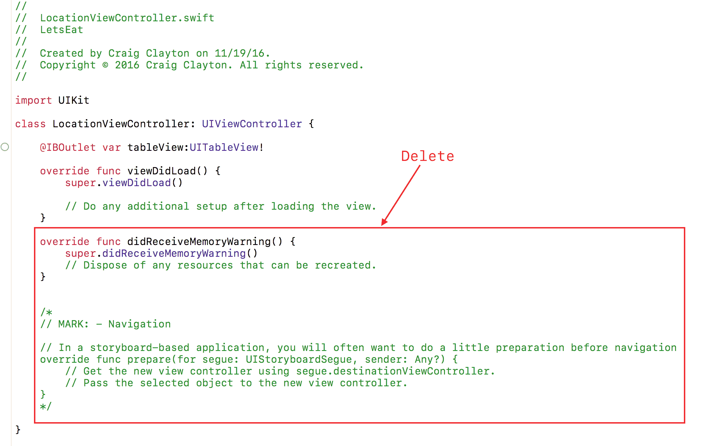
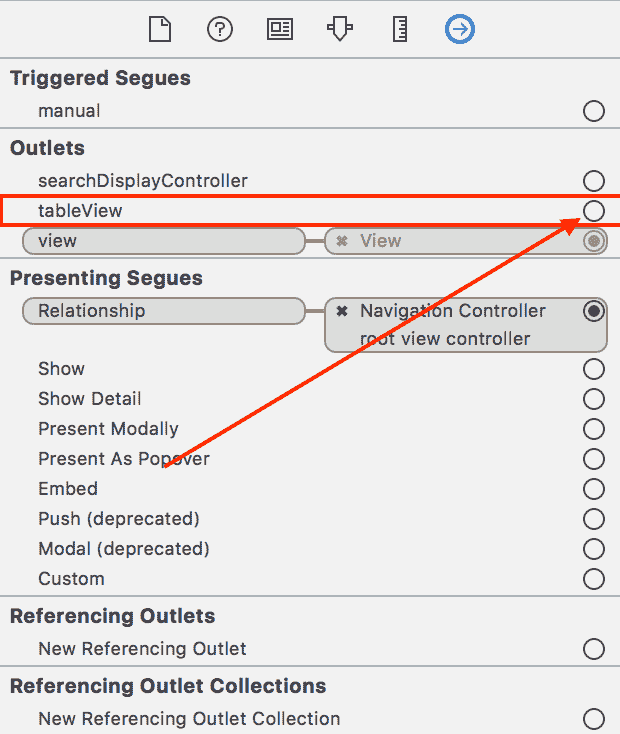
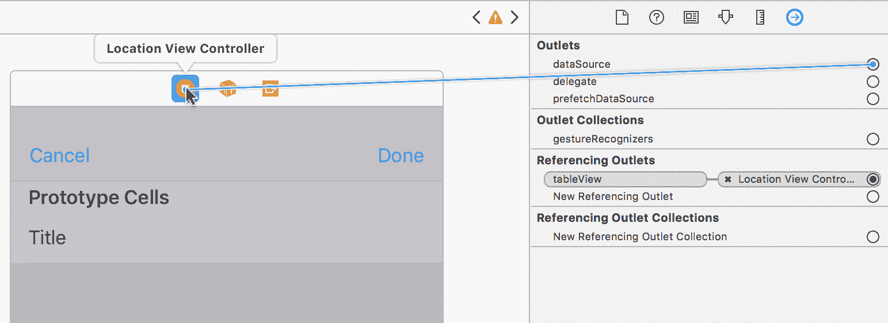
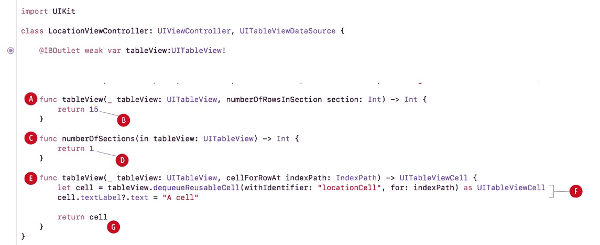
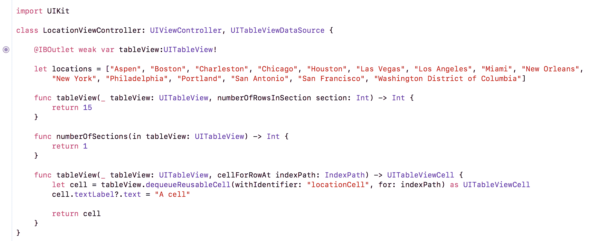
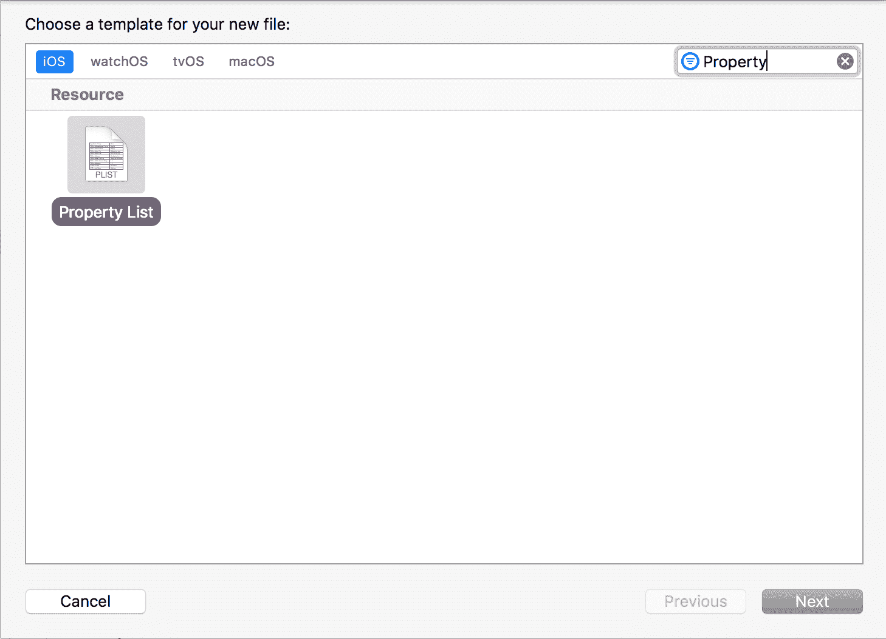
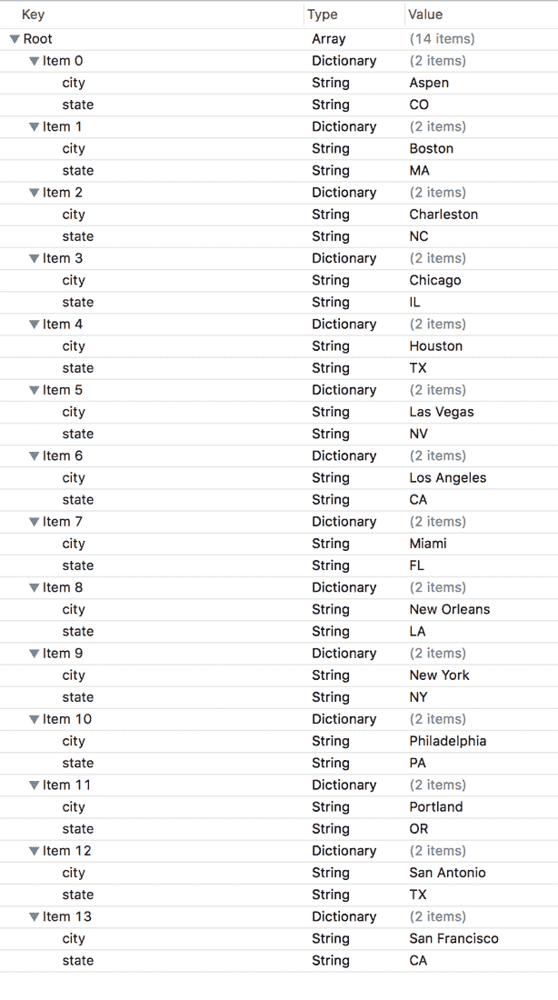
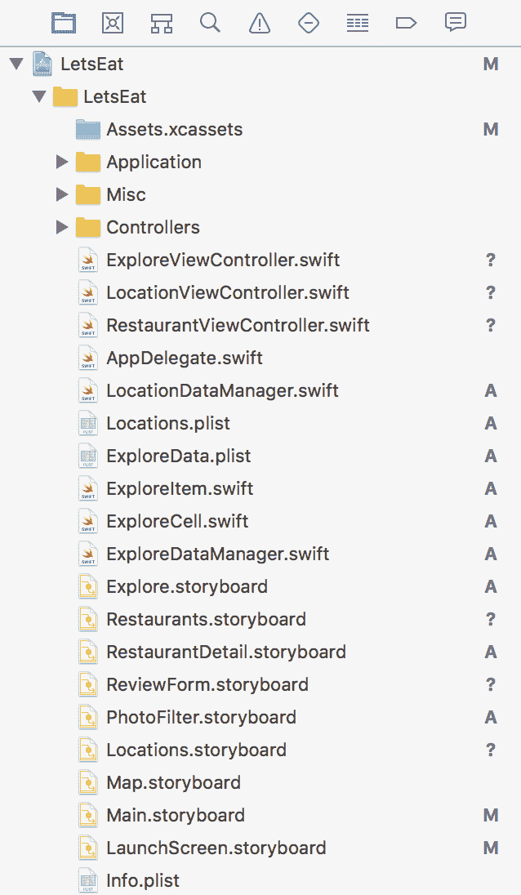
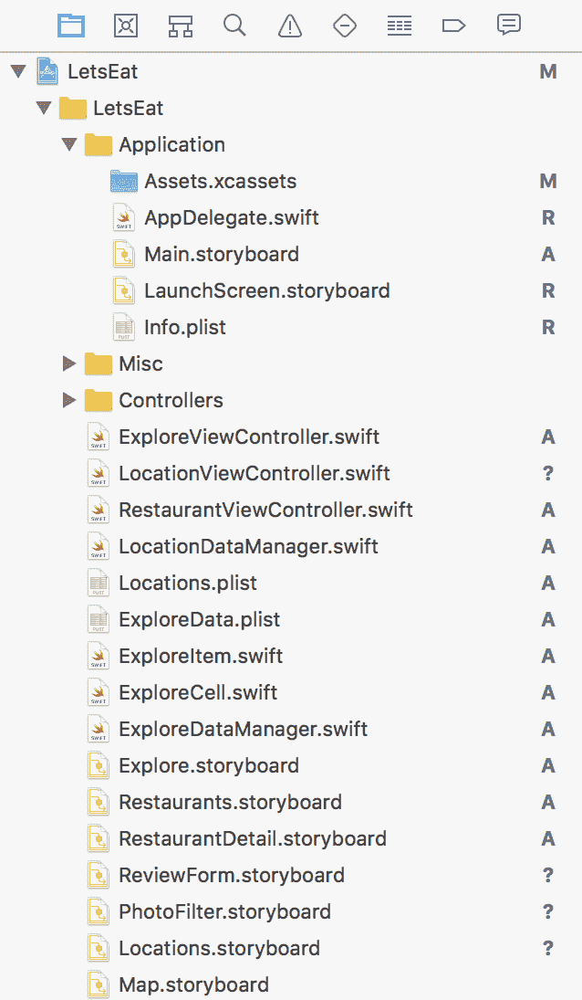
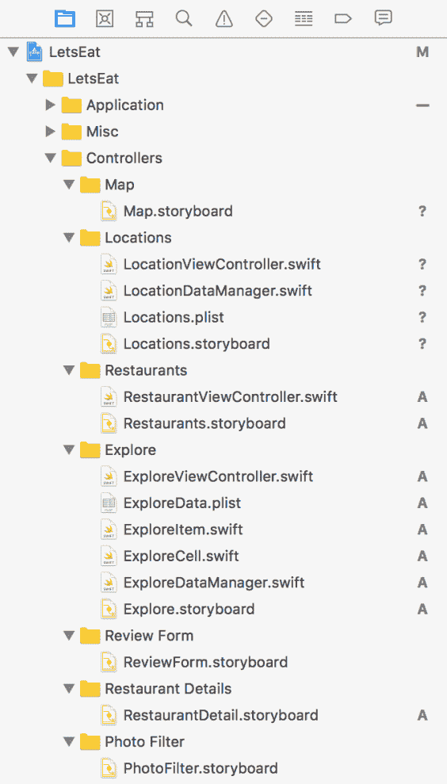

# 列表入门

当我开始做 iOS 开发时，我首先使用的是表格视图。当时，集合视图还没有被引入。随着你在 iOS 开发中的进步，你将使用很多表格和集合视图。你从最基础的内容开始，然后逐渐过渡到更高级的表格和集合视图。

我提到这一点的原因是，到本章结束时，你可能觉得事情似乎没有进展。这是完全正常的。但随着你在这几章中逐步进行，它们将变得越来越自然。

对于那些没有做过 iOS 开发的人来说，表格视图非常适合展示数据列表。iPhone 的邮件应用就是一个典型的表格视图示例。

在本章中，我们将使用我们的第一个表格视图。在我们的*Let's Eat*应用中，用户可以选择一个特定的位置来查找餐厅。

我们将在本章中介绍以下内容：

+   创建我们的第一个属性列表（plist）

+   创建我们的位置数据管理器

+   清理我们的文件结构

# 创建我们的位置视图控制器类

我们希望将数据显示在我们的表格视图中。在我们开始之前，在位置文件夹内创建三个新的文件夹——Controller、View 和 Model。正如我们之前所做的那样，右键点击`Location`文件夹并点击新建组来创建一个新的文件夹。

接下来，我们需要创建一个位置视图控制器类，我们可以用它与`UIViewController`一起使用：

1.  右键点击你刚刚创建的`Controller`文件夹，并选择新建文件。

1.  在“选择新文件模板”的屏幕上，顶部选择 iOS，然后选择 Cocoa Touch Class。然后点击下一步。

1.  在出现的选项屏幕中，添加以下内容：

新文件：

+   +   类：`LocationViewController`

    +   子类：`UIViewController`

    +   还创建 XIB：未选中

    +   语言：`Swift`

1.  点击下一步然后创建。

接下来，我们需要将我们的视图控制器与我们的类连接起来：

1.  选择`Locations.storyboard`。

1.  然后选择视图控制器。

1.  现在，在实用工具面板中，选择身份检查器。

1.  在自定义类下，在类下拉菜单中选择 LocationViewController 并按*Enter*键。

# 将我们的表格视图与位置视图控制器连接起来

目前，我们还没有办法与我们的表格视图和位置视图控制器进行通信。让我们看看我们如何连接这两个：

1.  打开`LocationViewController.swift`文件，并在类声明之后添加以下代码：

```
@IBOutlet weak var tableView:UITableView!
```

1.  通过按*c*md* + *S*保存文件。你的文件应该看起来像以下这样，变量旁边有一个空圆圈：


在我们开始之前，我们将清理我们的`LocationViewController.swift`文件。删除`viewDidLoad()`之后的所有内容：



接下来，让我们将我们的表格视图连接到文件。

1.  再次打开`Explore.storyboard`并确保你在概览视图中选择了位置视图控制器。

1.  然后，在实用工具面板中，选择连接检查器。在输出部分下，你会看到一个空圆圈，`tableView`：



点击并拖动空圆圈到故事板中的表格视图：


我们现在已经将表格视图连接到了位置视图控制器。

# 深入我们的表格视图代码

要将数据放入我们的表格视图，我们必须遵守一个协议，就像我们在集合视图中做的那样。在这种情况下，我们必须实现`UITableViewDataSource`：

1.  首先，我们需要更新我们的`class`声明。我们目前有以下内容：

```
class LocationViewController: UIViewController
```

1.  我们现在需要添加`UITableViewDataSource`，如下所示：

```
class LocationViewController: UIViewController, UITableViewDataSource
```

# 添加数据源和委托

如前一章所述，我们需要向我们的表格视图添加数据源和委托。表格视图使用**动态单元格**，我们必须添加：

1.  在概览视图中选择表格视图，然后在实用工具面板中选择连接检查器。

1.  点击并从`dataSource`拖动到概览视图中的位置视图控制器：



1.  使用`delegate`属性重复操作：


1.  在实用工具面板中，选择属性检查器，如果尚未选择，请确保你有以下值：

+   +   样式：`Basic`

    +   标识符：`locationCell`

    +   选择：`Gray`

    +   附件：`Disclosure indicator`

接下来，为了在`Tableview`中显示任何内容，我们需要添加`UITableViewDataSource`协议。我们的协议要求我们实现以下三个方法。在`viewDidLoad()`的闭合花括号之后添加以下内容：



让我们分解代码来了解我们在做什么：

+   **第一部分**：此方法告诉我们的表格视图我们想要显示多少行。

```
tableView(_:numberOfRowsInSection:)
```

+   **第二部分**：在这里，我们告诉我们的表格视图我们想要显示`15`行。

```
return 15
```

+   **第三部分**：此方法告诉我们的表格视图我们想要显示多少个部分。表格视图中的部分通常用作标题，但你可以按自己的方式使用它们。

```
numberOfSections(in:)
```

+   **第三部分**：我们告诉我们的表格视图我们只想显示一个部分。

```
return 1
```

+   **第四部分**：我们的第三个也是最后一个方法为每个我们需要的项目被调用。因此，在我们的情况下，它被调用了 15 次。

```
tableView(_:cellForRowAt:)
```

+   **第五部分**：在这里，每当*第四部分*被调用时，我们会创建一个单元格，无论是从队列中取一个（如果可用），还是创建一个新的单元格。标识符`locationCell`是我们给它在故事板中起的名字。因此，我们告诉我们的表格视图我们想要使用这个单元格。如果我们有多个表格视图，我们将引用单元格要显示的行和部分的标识符。

```
let cell = tableView.dequeueReusableCell(withIdentifier: "locationCell", for: indexPath) as UITableViewCell
cell.textLabel?.text = "A cell"
```

由于我们还没有任何数据，我们将我们的标签设置为`A cell`。`textLabel`变量是我们选择基本单元格时得到的默认标签。

+   **第 G 部分**：最后，每次我们创建一个新的单元格后，我们都将单元格返回给表格视图以显示该单元格。

```
return cell
```

通过点击播放按钮（或使用 *cmd* + *R*）来构建和运行项目，看看会发生什么。现在您应该看到“一个单元格”重复 15 次：


# 向我们的表格视图添加位置

现在我们有了表格视图显示数据，但我们需要它显示实际位置列表。让我们更新我们的表格视图以显示我们的位置列表：

1.  在`tableView`变量直接下方添加以下内容：

```
let locations = ["Aspen", "Boston", "Charleston", "Chicago", "Houston", "Las Vegas", "Los Angeles", "Miami", "New Orleans", "New York", "Philadelphia", "Portland", "San Antonio", "San Francisco", "Washington District of Columbia"]
```

1.  您的文件现在应该看起来像我的一样：



1.  接下来，为了更新我们的单元格以显示位置，我们需要将 `cell.textLabel?.text = "A cell"` 行替换为以下内容：

```
cell.textLabel?.text = locations[indexPath.item]
```

通过点击播放按钮（或使用 *cmd* + *R*）来构建和运行项目。在您的模拟器中选择位置后，您应该看到以下内容：


然而，有几个问题。如果我们向数组中添加另一个位置，它会崩溃，因为我们正在手动设置值。此外，我们只是从这个应用中构建的数组中加载这个列表。如果我们决定添加更多位置，我们还需要更新我们的单元格数量以及位置列表。因此，我们应该从 plist 中获取我们的位置，就像我们在上一章中所做的那样。Plists 提供了一个我们可以快速添加或从列表中删除位置的地方。

# 创建我们的第一个属性列表（plist）

在上一章中，我们使用提供的 plist 来加载我们的菜谱列表。在这一章中，我们将做同样的事情，但现在您已经熟悉了 plist 是什么，我们将一起从头创建一个。

我经常使用 plist，从创建菜单到拥有一个包含应用程序设置（如颜色或社交媒体 URL）的文件。我发现它们非常有用，特别是如果我在以后需要回来更新或更改东西的话。 

让我们学习如何从头创建 plist。要在 Xcode 中创建 plist，请执行以下操作：

1.  右键单击“Location”中的`Model`文件夹，然后选择“新建文件”。

1.  在“为新文件选择模板”中，在顶部选择 iOS，然后在过滤器字段中输入“属性”：



1.  选择“属性列表”然后点击下一步。

1.  将文件命名为“Locations”并点击创建。

您现在应该有一个看起来像我一样的文件：


# 向我们的属性列表添加数据

正如您在上一章中学到的，我们的 plist 有一个“根”；对于这个新文件，我们创建了一个“字典”作为我们的“根”类型。由于我们将要显示位置列表，我们需要我们的“根”是一个“数组”：

1.  在 plist 中点击“字典”并将其更改为“数组”：


1.  您应该看到数组旁边有一个加号（如果加号按钮没有显示，只需将鼠标悬停在那一行上，它就会出现）：


1.  点击加号按钮，它将添加一个具有字符串类型的新项目。将类型更改为字典：


1.  当你在项目 0 上悬停时，点击出现的加号按钮。

1.  我们现在需要更新新项目**。** 将键属性更新为“州”，并通过输入 CO 更新新项目的值属性：


1.  接下来，当你在“州”上悬停时，点击加号按钮。

1.  将键属性更新为“城市”，并通过输入 Aspen 更新新项目的值属性：


1.  接下来，点击项目 0 的展开箭头以关闭它：


1.  选择项目 0，然后按 *cmd* + *C* 复制，然后按 *cmd* + *V* 粘贴：


1.  接下来，打开项目 1，并将城市更新为波士顿，州更新为 MA：


1.  通过添加以下城市和州继续使用相同的过程：

| **键** | **类型** | **城市** | **州** |
| --- | --- | --- | --- |
| 项目 2 | 字符串 | 查尔斯顿 | 北卡罗来纳州 |
| 项目 3 | 字符串 | 芝加哥 | 伊利诺伊州 |
| 项目 4 | 字符串 | 休斯顿 | 德克萨斯州 |
| 项目 5 | 字符串 | 拉斯维加斯 | 内华达州 |
| 项目 6 | 字符串 | 洛杉矶 | 加利福尼亚州 |
| 项目 7 | 字符串 | 迈阿密 | 佛罗里达州 |
| 项目 8 | 字符串 | 新奥尔良 | 路易斯安那州 |
| 项目 9 | 字符串 | 纽约 | 纽约州 |
| 项目 10 | 字符串 | 费城 | 宾夕法尼亚州 |
| 项目 11 | 字符串 | 波特兰 | 俄勒冈州 |
| 项目 12 | 字符串 | 圣安东尼奥 | 德克萨斯州 |
| 项目 13 | 字符串 | 旧金山 | 加利福尼亚州 |

当你完成时，你的文件应该看起来像我的一样：



我们刚刚设置了我们的数据源。我们现在需要创建一个类似于上一章中我们创建的数据管理器：

# 创建我们的位置数据管理器

让我们创建 `LocationDataManager` 文件：

1.  右键单击 `Location` 文件夹中的 `Model` 文件夹，然后选择新建文件。

1.  在“为您的新文件选择模板”中，在顶部选择 iOS，然后选择 Swift 文件。然后点击下一步。

1.  将此文件命名为 `LocationDataManager`，然后点击创建。

1.  我们现在需要定义我们的类定义，所以在 `import` 语句之下添加以下内容：

```
class LocationDataManager {
}
```

1.  在类声明内部，添加以下变量以保持我们的数组私有，因为没有理由需要在类外访问它：

```
private var locations:[String] = []
```

1.  现在，让我们在我们的变量之后添加以下方法：

```
init() {
    fetch()
}

func fetch() {
    for location in loadData() {
        if let city = location["city"] as? String,
            let state = location["state"] as? String {
            locations.append("\(city), \(state)")
        }
    }
}

func numberOfItems() -> Int {
    return locations.count
}

func locationItem(at index:IndexPath) -> String {
    return locations[index.item]
}

private func loadData() -> [[String: AnyObject]] {
    guard let path = Bundle.main.path(forResource: "Locations", ofType: "plist"), let items = NSArray(contentsOfFile: path) else {
        return [[:]]
    }
    return items as! [[String : AnyObject]]
}
```

这些方法与我们在 `ExploreDataManager` 中拥有的方法相同，只不过我们现在从我们的 plist 中获取一个字典对象的数组。

# 与我们的数据管理器一起工作

我们现在需要更新我们的 `LocationViewController`。

首先，因为我们不再需要它，所以删除我们在类中创建的以下数组：

```
let locations = ["Aspen", "Boston", "Charleston", "Chicago", "Houston", "Las Vegas", "Los Angeles", "Miami", "New Orleans", "New York", "Philadelphia", "Portland", "San Antonio", "San Francisco", "Washington District of Columbia"]
```

接下来，由于我们需要在这个类中创建数据管理器的实例，请在 `viewDidLoad()` 之上添加以下内容：

```
let manager = LocationDataManager()
```

在 `viewDidLoad()` 中，我们想要获取 Table View 的数据，所以请在 `super.viewDidLoad()` 之下添加以下内容：

```
manager.fetch()
```

现在，你的 `viewDidLoad()` 应该看起来像以下内容：

```
override func viewDidLoad()  {
   super.viewDidLoad()
   manager.fetch()
}
```

对于 `numberOfRowsInSection()` 方法，我们不会使用 `15`，而是使用以下内容：

```
manager.numberOfItems()
```

最后，我们需要更新我们的 `cellForRowAt`。将 `cell.textLabel?.text = arrLocations[indexPath.item]` 替换为以下内容：

```
cell.textLabel?.text = manager.locationItem(at:indexPath)
```

你的 `cellForRowAt` 应该看起来像这样：

```
func tableView(_ tableView: UITableView, cellForRowAt indexPath: IndexPath) -> UITableViewCell {
   let cell = tableView.dequeueReusableCell(withIdentifier: "locationCell", for: indexPath) as UITableViewCell
   cell.textLabel?.text = manager.locationItem(at:indexPath)
   return cell
}
```

让我们通过点击播放按钮（或使用 *cmd* + *R*）来构建和运行项目。我们应该仍然看到我们的位置，但现在它们来自我们的 plist。在我们完成这一章之前，我们的项目导航器现在一团糟。我们只是在主文件夹中有文件。在没有组织的情况下将文件放入主文件夹不是你想要做的事情。在我们添加更多文件之前，让我们先组织我们的文件。

# 创建文件夹

创建文件夹很简单：你只需要在 `LetsEat` 文件夹上右键单击，就可以创建一个新的组。你还可以选择多个文件，并将所有选定的项目放入一个新的组中。

我们将首先创建三个文件夹，分别命名为 `Application`、`Misc` 和 `Controllers`。当你完成时，你应该会看到以下内容：



我们将把 `Info.plist`、`Assets.xcasset`、`App Delegate`、`LaunchScreen.storyboard` 和 `Main.storyboard` 都移动到 `Application` 文件夹中。你可以 *cmd* + 点击每个文件，然后逐个拖动。当你完成时，你应该会看到以下内容：



接下来，你想要为所有的 View Controllers 创建一个文件夹。在 `Controllers` 文件夹内，添加以下文件夹：`Photo Filter`、`Restaurant Details`、`Review Form`、`Explore`、`Restaurants`、`Locations` 和 `Map`。然后，将每个 storyboard 文件拖动到相应的文件夹中。将 `ExploreData.plist`、`ExploreItem`、`ExploreCell` 和 `ExploreDataManager` 拖动到 `Explore` 文件夹中。然后，将 `RestaurantViewController` 拖动到 `Restaurants` 文件夹中。最后，将 `LocationViewController`、`LocationDataManager` 和 `Locations.plist` 拖动到 `Locations` 文件夹中。当你完成时，你应该会有以下内容：



尽管我们清理了这个区域，但我通常不会用它来打开和查找文件，因为它需要花费太多时间。为了打开文件，我总是使用 *cmd* + *O* 并输入文件名。打开和关闭文件夹需要花费很长时间。你应该学习这个快捷键，因为它将提高你的工作效率。

目前来说，这样就足够了，我们可以继续添加更多文件夹，但比之前要好得多。

# 摘要

在本章中，我们使用了一个具有动态单元格的 Table View，这使得 Table View 能够根据数据变化。我们还处理了 unwinding segues。随后，我们通过 segues 传递了我们所需的数据。与 segues 一起，我们还研究了 plists，学习了如何创建它们以及如何向它们添加数据。最后，我们创建了我们的位置数据管理器，该管理器负责向 View Controller 提供数据。

在下一章中，我们将使用具有静态单元格的 Table View 来构建我们的餐厅详情。静态单元格非常适合用于表单或详情视图。我们可以使用 Collection View 来构建餐厅详情；然而，静态 Table View 将会工作得很好，并且会更加简单。

在此阶段，在进入下一章之前，你可能想要获取本章的入门项目，并尝试在不使用书籍作为指南的情况下再次尝试。回顾所学内容有助于巩固你的理解。
