# 我们在哪里？

我们在生活中都使用过地图，无论是实际的地图还是手机或其他设备上的地图。自 2012 年首次宣布以来，苹果地图已经取得了长足的进步。苹果每年都在稳步改进苹果地图。

在本章中，我们将使用地图和自定义标记来显示我们的餐厅列表。当用户点击地图上的标记时，他们将被直接带到我们在上一章中创建的餐厅详情页面。

在本章中，我们将涵盖：

+   标注是什么以及如何将它们添加到地图中

+   如何创建自定义标注

+   如何创建故事板引用

# 设置地图标注

在我们的地图中，我们将在每个餐厅位置放置标记。这些标记被称为标注，更具体地说，是`MKAnnotation`。由于我们将创建多个`MKAnnotation`协议，我们将创建一个子类化`MKAnnotation`的类。

# 什么是 MKAnnotation？

`MKAnnotation`是一个协议，为我们提供了与地图视图相关的信息。协议提供了一种方法、属性和其他所需功能的设计蓝图。`MKAnnotation`将包含信息，例如坐标（纬度和经度）、标题和副标题。

要在地图上放置标记，我们必须子类化`MKAnnotation`。当我们第一次查看类与结构体的区别时，我们看到类可以子类化或继承自其他类，这意味着我们可以从我们要子类化的类中获取属性、方法和额外的要求。让我们创建一个子类化`MKAnnotation`的标注并看看这是如何工作的。

# 创建餐厅标注

在我们创建文件之前，我们应该首先查看我们将要使用的数据。地图视图的数据将与我们在餐厅列表页面中使用的数据相同。让我们看看餐厅数据在 plist 格式下将是什么样子：

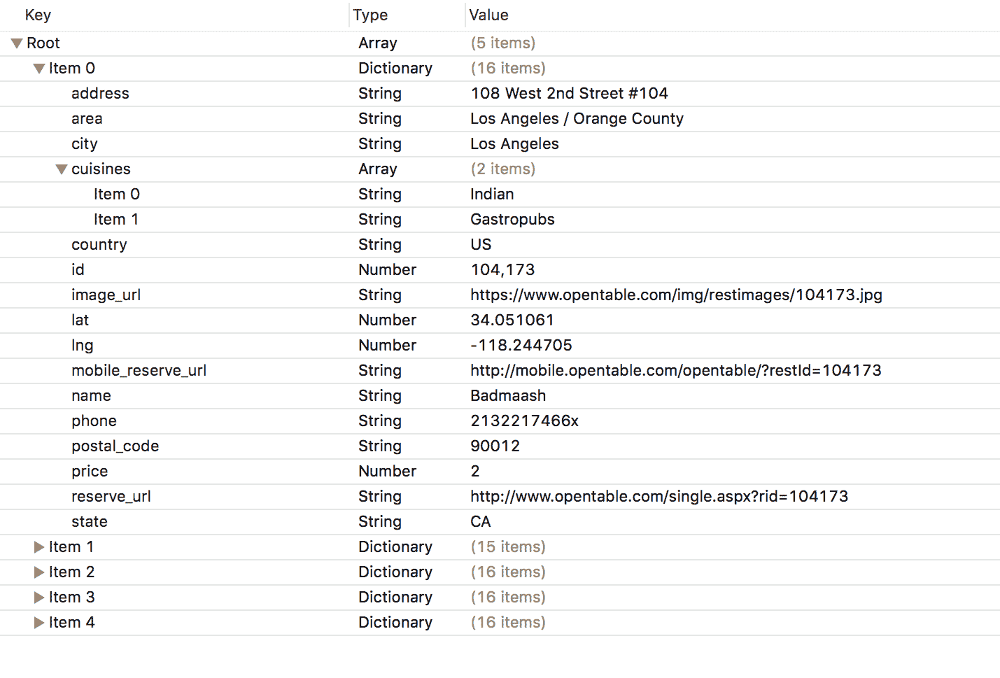

我们需要创建一个文件来表示地图视图中的这些数据，这将与餐厅列表页面不同，因为我们需要子类化`MKAnnotation`。让我们现在开始创建这个文件：

1.  右键点击`Map`文件夹并选择新建文件。

1.  在选择新文件模板的屏幕上，顶部选择 iOS，然后选择 Cocoa Touch Class。然后点击下一步。

1.  在出现的选项屏幕中，添加以下内容：

新建文件：*

+   +   类：`RestaurantItem`

    +   子类：`NSObject`

    +   也创建 XIB：未选中

    +   语言：`Swift`

1.  点击下一步然后创建。

1.  在这个新的`RestaurantItem.swift`文件中，在`import UIKit`下添加`import MapKit`。我们需要这个`import`语句，以便 Xcode 知道我们将要使用的文件位置。

1.  接下来，我们需要更新我们的类声明以创建标注。由于这是`MKAnnotation`的子类，我们需要将我们目前拥有的内容（`class RestaurantItem: NSObject`）更改为以下内容：

```
class RestaurantItem: NSObject, MKAnnotation
```

当你添加 `MKAnnotation` 时，你会看到一个错误。现在请忽略它，因为我们很快就会修复这个错误。

在类声明内部，添加以下内容：

```
var name: String?
var cuisines:[String] = []
var latitude: Double?
var longitude:Double?
var address:String?
var postalCode:String?
var state:String?
var imageURL:String?
```

当用户点击注释时，餐厅的名称和菜系类型将显示出来，同时还有一个详情图标。这个详情图标将带用户到餐厅详情页面。然后，我们将传递所有这些数据并使用它来填充我们在上一章中创建的餐厅详情页面。

我们需要初始化传递给对象的所有数据。因此，让我们创建一个自定义的 `init()` 方法，我们可以通过其参数传递一个字典对象：

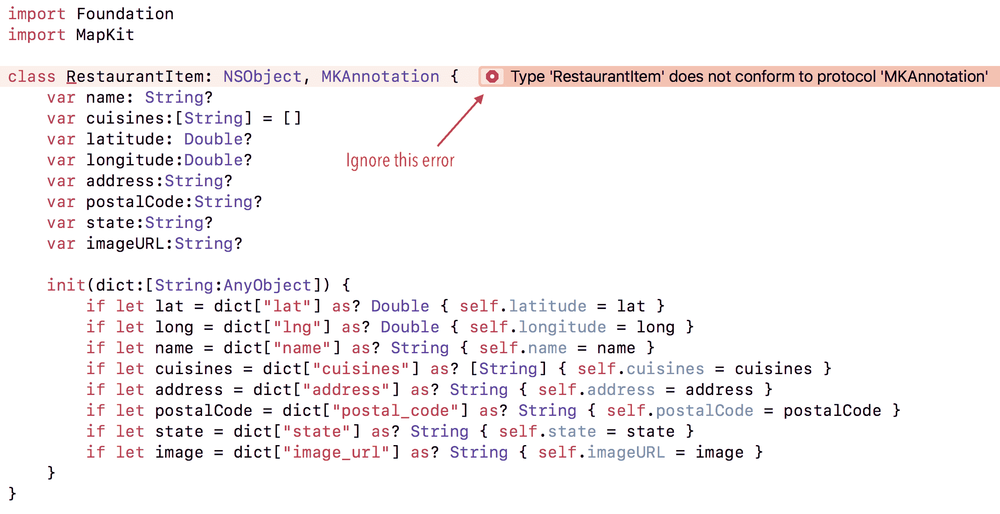

这个方法很大，但它并不是你之前没有见过的。我们使用 `if...let` 语句来检查每个元素中的数据。如果缺少某些数据，则不会发送。

现在我们来处理错误。我们得到错误的原因是因为我们正在子类化 `MKAnnotation` 而尚未声明坐标，这是一个必需的属性。我们还有两个其他可选属性——`title` 和 `subtitle`——我们正在用于我们的地图，并且需要声明。我们想要能够将这些数据传递给这三个属性，以便我们可以在地图上使用它们。

为了消除错误，我们首先需要添加坐标。我们需要设置纬度和经度，所以在 `init()` 方法之后添加以下内容：

```
var coordinate: CLLocationCoordinate2D {
  guard let lat = latitude, let long = longitude else { return CLLocationCoordinate2D() }
  return CLLocationCoordinate2D(latitude: lat, longitude: long )
}
```

`CLLocationCoordinate2D` 是一个由 `MapKit` 使用的类，用于设置图钉的确切位置。

注意，我们在这个属性中使用大括号。它在 `MKAnnotation` 中定义，我们使用计算属性来设置值。对于 `coordinate` 属性，我们将使用 `CLLocationCoordinate2D` 传递纬度和经度。在我们的 `init()` 方法中，我们创建了设置纬度和经度的数据，现在，我们将这些坐标传递给 `coordinate` 属性。

让我们在变量 `coordinate` 之上添加以下内容来对 `subtitle` 做同样的事情：

```
var subtitle: String? {
   if cuisines.isEmpty { return "" }
   else if cuisines.count == 1 { return cuisines.first }
   else { return cuisines.joined(separator: ", ") }
}
```

变量 `subtitle` 是一个计算属性，但这次我们使用了一个 `else...if` 语句。我们首先检查数组是否为空；如果是，则不显示任何内容。如果数组中只有一个项目，我们只需返回该项目。最后，如果我们数组中有多个项目，我们将每个项目放入一个字符串中，并用逗号分隔每个项目。例如，如果你的数组中有项目 `["American," "Bistro," "Burgers"]`，那么我们会创建一个看起来像 *American*, *Bistro*, *Burgers* 的字符串。

最后，我们需要添加标题。在 `subtitle` 变量之上输入以下内容：

```
var title: String? {
   return name
}
```

你的文件现在应该不再有错误，现在看起来应该是这样的：

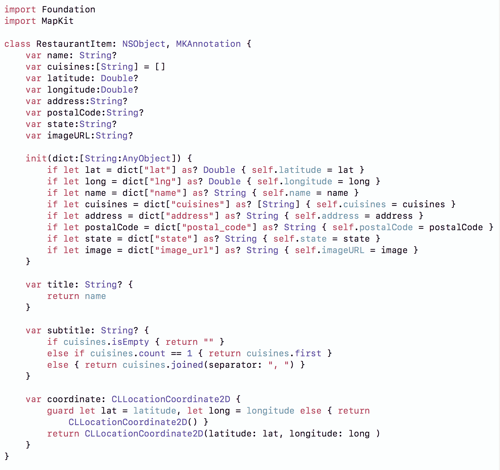

接下来，我们想要创建一个管理器，它将接收我们的数据并为我们的地图创建注释。

# 创建我们的地图数据管理器

在下一章中，我们将处理数据，但到目前为止，我们可以模拟一些数据来设置我们的结构。我们将使用 plist 来加载数据，就像我们在上一章中所做的那样。

现在让我们创建`MapDataManager`文件：

1.  右键点击`Map`文件夹并选择新建文件。

1.  在选择新文件模板的屏幕上，顶部选择 iOS，然后选择 Swift 文件。然后点击下一步。

1.  将此文件命名为`MapDataManager`，然后点击创建。

1.  接下来，我们需要定义我们的类定义，因此请在`import`语句下添加以下内容：

```
class MapDataManager {} 
```

1.  在类声明内部，添加以下变量：

```
fileprivate var items:[RestaurantItem] = []

var annotations:[RestaurantItem] {
    return items
}
```

注意，我们保持数组为私有，因为没有理由需要在类外部访问它。

1.  现在，让我们在我们的类声明中，变量之后添加以下方法：

```
func fetch(completion:(_ annotations:[RestaurantItem]) -> ()) {

  if items.count > 0 { items.removeAll() }
        for data in loadData() {
                        items.append(RestaurantItem(dict: data))
        }

        completion(items)
}

fileprivate func loadData() -> [[String:AnyObject]] {
         guard let path = Bundle.main.path(forResource: "MapLocations", ofType: "plist"),
           let items = NSArray(contentsOfFile: path) else { return [[:]] }
        return items as! [[String : AnyObject]]
}
```

您的文件现在应该看起来如下所示：

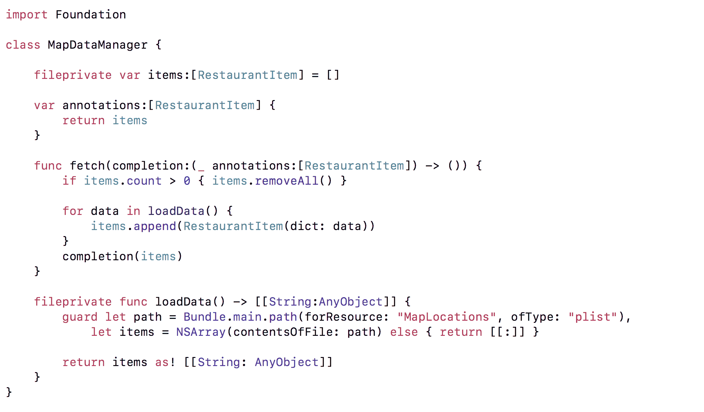

1.  `fetch()`和`loadData()`方法与我们在`ExploreDataManager`文件中的方法相同。然而，这里的`fetch()`方法在其参数中有一个新的内容，具体如下：

```
  completion:(_ annotations:[RestaurantItem]) -> ())
```

这被称为**闭包块**，它允许我们表示方法何时完成，然后指定要执行的操作（在这里，返回一个注释数组）。我们将使用这些注释在地图上加载标记。我们正在使用`for...in`循环；当我们完成时，我们调用`completion()`。当我们到达`MapViewController`时，你会看到我们如何编写这个。

现在，让我们看看我们的`MapLocations.plist`文件：

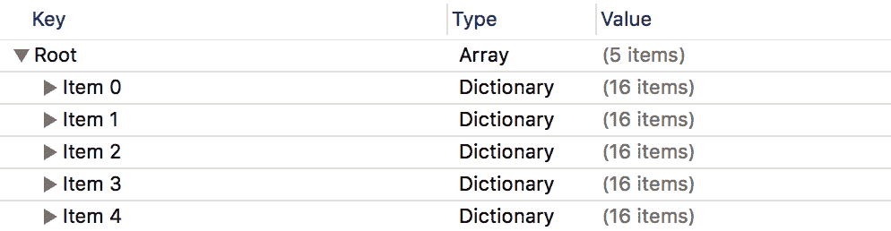

此文件结构与我们的`ExploreData.plist`文件相同。我们的`Root`是一个数组，`Root`中的每个项目都是一个字典项。许多程序员称之为**DRY**（**不要重复自己**）的缩写。由于两个 plist 文件都有字典对象的数组，我们可以更新我们的代码，以便在多个地方使用相同的方法。

# 创建基类

为了避免重复，我们将创建一个基类。这个基类将有一个名为`load(file name:)`的新方法，但我们将添加一个参数来传递文件名。现在让我们在我们的`Common`文件夹下创建一个`DataManager`文件：

1.  右键点击`Misc`文件夹并选择新建文件。

1.  在选择新文件模板的屏幕上，顶部选择 iOS，然后选择 Swift 文件。然后点击下一步：

1.  将此文件命名为`DataManager`，然后点击创建。

1.  在这个新文件中，我们需要定义我们的类定义；因此，请在`import`语句下添加以下内容：

```
protocol DataManager {}
```

1.  在协议声明内部，添加以下方法：

```
func load(file name:String) -> [[String:AnyObject]]
```

1.  现在，在协议下创建一个扩展：

```
extension DataManager {}
```

1.  在`extension`声明内部，添加以下内容：

```
func load(file name:String) -> [[String:AnyObject]] {
    guard let path = Bundle.main.path(forResource: name, ofType: "plist"),  let items = NSArray(contentsOfFile: path) else { return [[:]] }
   return items as! [[String : AnyObject]]
}
```

1.  当你完成时，你的文件应该看起来像我的一样：

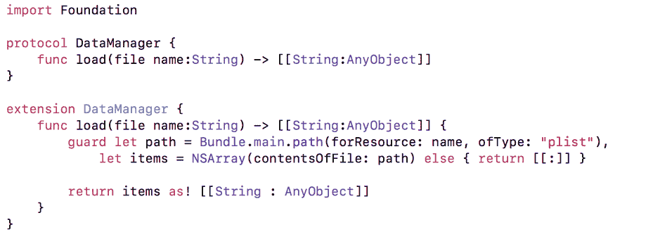

除了将函数名称更改为包含参数外，我们还创建了与我们在 `Explore` 和 `Map Data Manager` 文件中相同的函数。然而，这里的函数不再是一个 `private` 方法，因为我们希望它对任何想要使用它的类都是可访问的。

通过创建一个协议，我们正在使用所谓的面向协议编程。由于关于这个主题有很多书籍和视频，我们不会深入细节。您需要理解的核心概念是，我们可以在任何我们想要的类中使用它，并且可以访问 `load(name:)` 方法。

这就是我们在这个文件中需要做的所有事情。

# 重构代码

现在我们已经创建了新的协议，我们可以在需要的地方访问它。让我们首先更新我们的 `MapDataManger` 类以使用我们刚刚创建的新协议：

1.  删除 `loadData()` 函数，因为我们不再需要它了。您将在删除 `loadData()` 方法后看到错误。这个错误发生是因为我们需要在调用 `loadData()` 方法时给 `fetch()` 方法提供一个文件名来加载。我们很快就会修复这个问题。

1.  接下来，我们需要更新我们的类声明，使其如下所示：

```
class MapDataManager: DataManager 
```

1.  现在，我们的 `MapDataManager` 类正在使用我们的 `DataManager` 协议，这意味着我们将在 `MapDataManager` 中使用 `DataManager` 协议中的 `load(name:)` 方法。

1.  现在，让我们通过更新我们的 `fetch()` 方法来修复错误，从 `loadData()` 中的数据更新到以下内容：

```
for data in load(file: "MapLocations")
```

您更新后的文件现在应该看起来像以下这样：

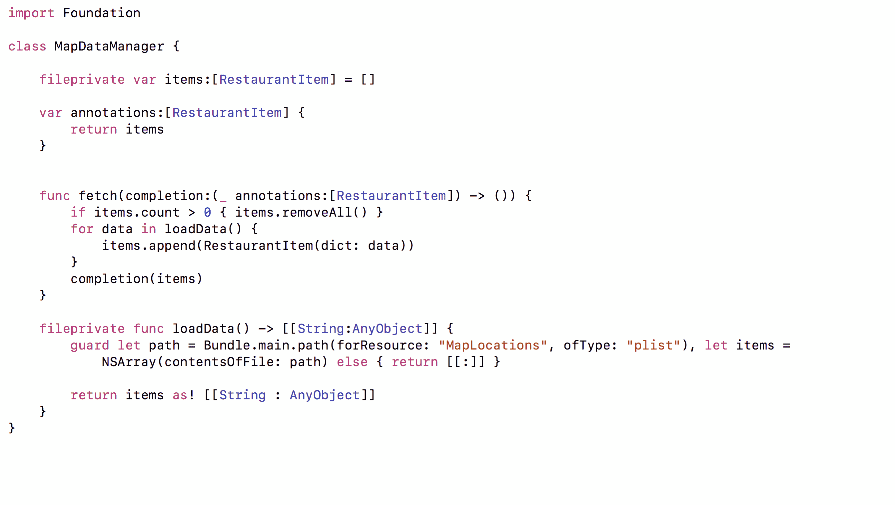

我们已经修复了 `MapDataManager` 中的错误，但我们需要对 `ExploreDataManager` 文件进行一些重构以执行相同的操作。

# 重构 ExploreDataManager

由于我们的 `loadData()` 函数在 `ExploreDataManager` 和 `MapDataManager` 文件中都是相同的，我们需要以与刚才更新 `MapDataManager` 相同的方式更新我们的 `ExploreDataManager`。打开 `ExploreDataManager` 并执行以下操作：

1.  删除私有的 `loadData()` 函数，因为我们不再需要它了。再次忽略错误，因为我们很快就会修复它。

1.  接下来，更新我们的类声明，现在应该如下所示：

```
class ExploreDataManager: DataManager
```

1.  现在，让我们通过更新我们的 `fetch()` 方法来修复错误，从 `loadData()` 中的数据更新到以下内容：

```
for data in load(file: "ExploreData")
```

1.  您更新后的函数现在应该看起来像以下这样：

```
func fetch() {
    for data in load(file: "ExploreData") {
        items.append(ExploreItem(dict: data))
    }
}
```

我们已经完成了文件的重构，现在我们可以随时使用相同的方法来加载具有字典项数组的 plist 文件。

重构是你随着代码编写量的增加而变得越来越熟悉的事情。当你刚开始时，理解何时重构会有些困难，因为你还在学习。你需要重构的最明显迹象是当你写了一些东西不止一次时。然而，重构并不总是适用于所有情况；有时，写相同的代码多次可能是不可避免的。仅仅意识到重构可能有用是一个好迹象，这是理解这种方法的一半战斗。我已经编程多年；有时我会复制粘贴我写的代码来测试它是否工作，然后从不重构。然后，几个月后，我会 wonder 为什么我没有在两个地方都写一个处理它的方法。

# 创建并添加注释

现在，我们需要将我们的地图连接起来，并开始显示地图上的注释。然后，我们将自定义注释以使其看起来像我们的设计。

# 创建我们的地图视图控制器

我们需要创建我们的`MapViewController`文件，并将其与 Storyboard 中的`UIViewController`和地图视图连接起来。首先，让我们创建这个文件：

1.  在导航面板中，在“地图”文件夹下的“控制器”文件夹上右键单击，然后选择“新建文件”。

1.  在“选择新文件模板”屏幕上，顶部选择 iOS，然后选择 Cocoa Touch Class。然后点击“下一步”。

1.  在出现的选项屏幕上添加以下内容：

新文件：*

+   +   类：`MapViewController`

    +   子类：`UIViewController`

    +   也创建 XIB：未选中

    +   语言：`Swift`

1.  点击“下一步”然后点击“创建”。

1.  在`import UIKit`语句下，添加`import MapKit`。

1.  更新你的类声明，包括以下子类：

```
class MapViewController: UIViewController, MKMapViewDelegate
```

现在，让我们将此文件与 Storyboard 中的`UIViewController`和地图视图连接起来：

1.  在类声明之后添加以下内容：

```
@IBOutlet var mapView: MKMapView!
```

1.  打开你的`Map.storyboard`文件。

1.  在大纲视图中，选择包含地图视图的视图控制器。

1.  现在，在“实用工具”面板中，选择“身份检查器”。

1.  在“自定义类”下，在类下拉菜单中选择`MapViewController`，然后按*Enter*以将视图控制器连接到类。

1.  现在，选择连接检查器。

1.  在“输出口”部分，你会在`mapView`旁边看到一个空圆圈。点击并拖动输出口到大纲视图中的视图控制器中的地图视图。

我们将开始使用我们的地图，但首先我们需要向我们的`MapDataManager`添加一些内容：

1.  在导航面板中打开`MapDataManager.swift`文件；在`import Foundation`语句下方，添加`import MapKit`。

1.  接下来，向我们的`MapDataManager`添加以下方法：

```
func currentRegion(latDelta:CLLocationDegrees, longDelta:CLLocationDegrees) -> MKCoordinateRegion {
    guard let item = items.first else { return MKCoordinateRegion() }
    let span = MKCoordinateSpanMake(latDelta, longDelta)
    return MKCoordinateRegion(center: item.coordinate, span: span)
}
```

在我们深入这个函数的特定部分之前，我们需要了解这个函数的作用。当你使用地图并在其上放置图钉时，你希望地图放大到特定的区域。要放大地图，你需要纬度和经度。这个方法所做的就是抓取数组中的第一个图钉（或注释）并放大到该区域：

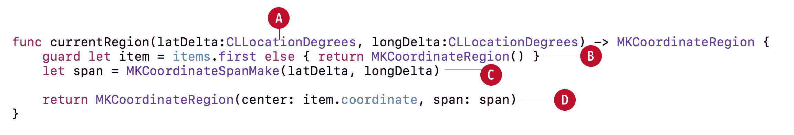

让我们分解一下代码：

+   **A 部分**：我们的方法有两个参数，它们都是`CLLocationDegrees`。它只是一个表示纬度或经度坐标的度数的类：

```
func currentRegion(latDelta:CLLocationDegrees, longDelta:CLLocationDegrees) -> MKCoordinateRegion {
```

+   **B 部分**：这个`guard`语句获取数组中的第一个项目。如果没有项目在数组中，它将只返回一个空的坐标区域。如果有项目在数组中，它将返回坐标区域：

```
guard let item = items.first else { return MKCoordinateRegion() }
```

+   **C 部分**：在这里，我们使用传递给函数的纬度和经度创建了一个`MKCoordinate`。`MKCoordinateSpan`定义了在纬度和经度方向上显示在地图上的跨度：

```
let span = MKCoordinateSpanMake(latDelta, longDelta)
```

+   **D 部分**：最后，我们正在设置区域的中心和跨度，并返回它们，这样当图钉落下时，地图可以放大到该区域：

```
return MKCoordinateRegion(center: item.coordinate, span: span)
```

现在，让我们设置我们的`MapViewController`以显示注释：

1.  在导航面板中打开`MapViewController.swift`文件，并删除`didReceiveMemoryWarning()`和`prepare()`（已被注释），因为我们不需要它们来完成我们的任务。

1.  在我们的`IBOutlet`语句下面直接添加以下内容：

```
let manager = MapDataManager()
```

1.  然后，在类定义内部，在`viewDidLoad()`方法之后添加以下方法：

```
func addMap(_ annotations:[RestaurantItem]) {
        mapView.setRegion(manager.currentRegion(latDelta: 0.5, longDelta: 0.5), animated: true)
        mapView.addAnnotations(manager.annotations)
}
```

在这个方法中，我们做了几件事情。我们首先通过参数传递注释。当我们调用`fetch()`并且完成时，它将返回注释的数组。我们将这个数组传递给我们的`addMap(_ annotations:)`方法以供使用。接下来，我们通过从我们的`MapDataManager`获取它来设置区域，从而设置纬度和经度增量。这将设置我们地图的缩放和区域。一旦我们有了这些，我们就将所有注释传递给地图以显示。

因此，我们需要让我们的经理去获取注释：

在`addMap(_ annotations:)`方法上方添加以下方法：

```
func initialize() {
    mapView.delegate = self       
    manager.fetch { (annotations) in
        addMap(annotations)
    }
}
```

在`initialize()`方法内部，我们将地图代理设置到这个类。在前面的章节中，我们使用 Storyboard 来做这件事；然而，你也可以用代码来做。这一行允许我们在用户点击注释或点击注释中的展开指示器时得到通知。

在本章的早期，我们在`MapDataManager`中创建了一个`fetch()`方法，其中我们使用了闭包块。这个闭包块要求我们用大括号将其包裹起来。一旦在管理器中调用`completion()`块，大括号内的所有内容都将执行。对于构建此应用程序的目的，我们将只有少量图钉或注释；因此，我们不需要完成块。然而，如果你有 100 个或 500 个注释，例如，闭包块将更加高效。我们稍后会做更多，这样你就可以更多地练习闭包块。

在`viewDidLoad()`中添加`initialize()`，以确保在视图加载时一切都会运行。

在构建之前，请确保将`MapLocations.plist`文件添加到`maps`文件夹中。这个文件位于本书的`assets`文件夹中。

通过点击播放按钮（或使用*cmd* + *R*）构建并运行项目：

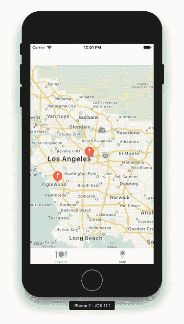

我们现在在地图上有了图钉，但我们需要更新它们，使它们看起来更像我们的设计。让我们学习如何自定义地图中的注释。

# 创建自定义注释

如果你曾经拥有过 iPhone 并使用过 Apple Maps，你将熟悉图钉。当你应用程序内有地图时，拥有自定义图钉（注释）可以让你的应用程序看起来更加精致。让我们创建我们的自定义注释。

在导航器面板中打开`MapViewController`，并在`addMap(_ annotations:)`方法下直接添加以下内容：

```
func mapView(_ mapView: MKMapView, viewFor annotation: MKAnnotation) -> MKAnnotationView? {
    let identifier = "custompin"
    guard !annotation.is Kind(of: MKUserLocation.self) else { return nil }
    var annotationView: MKAnnotationView?
    if let customAnnotationView = mapView.dequeueReusableAnnotationView(withIdentifier: identifier) {
        annotationView = customAnnotationView
        annotationView?.annotation = annotation
    }
    else {
        let av = MKAnnotationView(annotation: annotation, reuseIdentifier: identifier)
        av.rightCalloutAccessoryView = UIButton(type: .detailDisclosure)
        annotationView = av
    }
    if let annotationView = annotationView {
        annotationView.canShowCallout = true
        annotationView.image = UIImage(named: "custom-annotation")
    }
    return annotationView
}
```

让我们分解这段代码，以便我们更好地理解我们在做什么。我们将函数分解为以下部分：

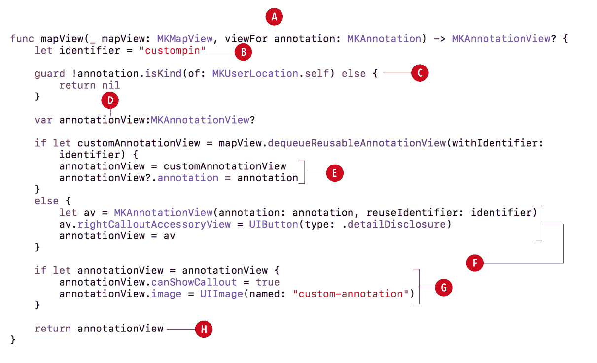

让我们从 A 开始：

+   **部分 A**：此方法将在需要放置注释时调用我们之前设置的`mapView.delegate`。我们将使用此方法在放置之前获取注释，并用自定义图钉替换默认图钉：

```
mapView(_:viewFor:)
```

+   **部分 B**：在这里，我们设置了一个标识符，类似于我们在使用集合视图和表格视图时设置的标识符：

```
let identifier = "custompin"
```

+   **部分 C**：这个`guard`将确保我们的注释不是用户位置。如果注释是用户位置，`guard`将返回`nil`。否则，它将继续通过方法：

```
guard !annotation.isKind(of: MKUserLocation.self) else {
   return nil
}
```

+   **部分 D**：`MKAnnotationView`是图钉的类名；在这里，我们创建了一个变量，我们可以用它来设置我们的自定义图片：

```
var annotationView:MKAnnotationView?

```

+   **部分 E**：在这个语句中，我们检查是否已经创建了可以重用的任何注释。如果是这样，我们将它们指向我们之前添加的变量。否则，我们在下一个`else`语句中创建注释：

```
if let customAnnotationView = mapView.dequeueReusableAnnotationView(withIdentifier: identifier) {
   annotationView = customAnnotationView
   annotationView?.annotation = annotation
}
```

+   **第 F 部分**：如果没有可重用的注释，我们创建一个新的`MKAnnotationView`，并给它一个带有按钮的呼出窗口。呼出窗口是一个气泡，当你点击它时出现在注释上方，以显示与该注释相关联的标题（餐厅名称）和副标题（菜系）。如果用户选择此呼出按钮，用户将被带到餐厅详情视图：

```
else {
   let av = MKAnnotationView(annotation: annotation, reuseIdentifier: identifier)
   av.rightCalloutAccessoryView = UIButton(type: .detailDisclosure)
                 annotationView = av
}
```

+   **第 G 部分**：在这里，我们确保我们的自定义注释将显示呼出窗口。我们还为我们的注释设置了自定义图像：

```
if let annotationView = annotationView {
   annotationView.canShowCallout = true
   annotationView.image = UIImage(named: "custom-annotation")
}
```

+   **第 H 部分**：一旦我们完成方法的学习，我们将我们的自定义注释返回到地图。此方法为地图上出现的每个注释调用：

```
return annotationView
```

通过点击播放按钮（或使用*cmd* + *R*）来构建和运行项目：

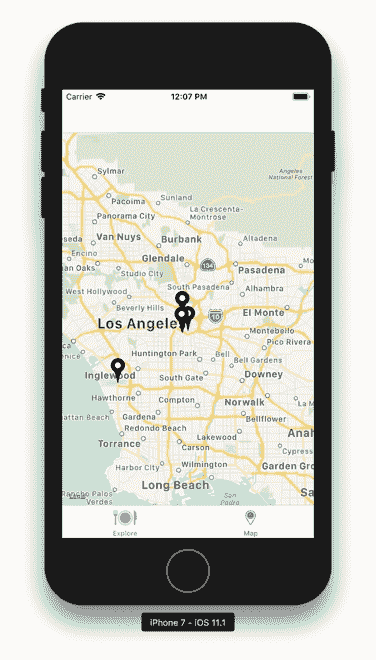

现在，我们的自定义注释已显示在地图上。每个图钉的呼出窗口显示餐厅名称以及与该特定图钉关联的餐厅的菜系。如果你点击呼出窗口，餐厅详情展开功能尚未工作。让我们现在设置它。

# 地图到餐厅详情

为了从呼出窗口导航到餐厅详情，我们需要更新我们的应用程序，以便我们的地图也可以打开餐厅详情。为此，我们必须首先创建一个故事板引用。

# 创建故事板引用

为了从地图链接到餐厅详情，我们需要创建一个故事板引用：

1.  打开`Map.storyboard`，在实用工具面板的对象库中，将 Storyboard Reference 拖动到`Map.storyboard`场景中：

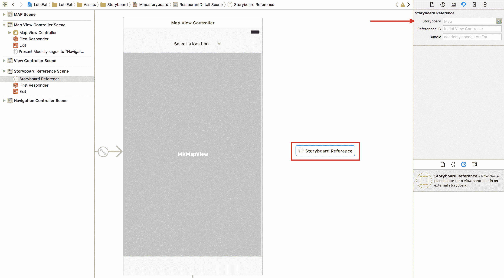

1.  接下来，在实用工具面板中选择属性检查器，并将 Storyboard Reference 下的故事板更新为`RestaurantDetail`。然后，按*Enter*键：

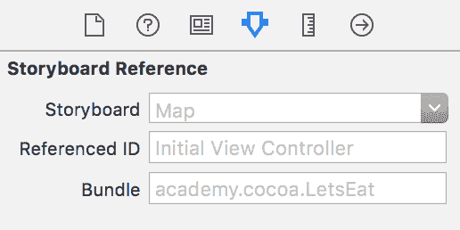

1.  *Ctrl* + 从地图视图控制器拖动到我们刚刚创建的故事板引用，并在出现的屏幕上选择显示。请注意，你可以从大纲视图中的地图视图控制器或场景中的地图视图控制器图标进行*Ctrl* + 拖动，如图下所示：

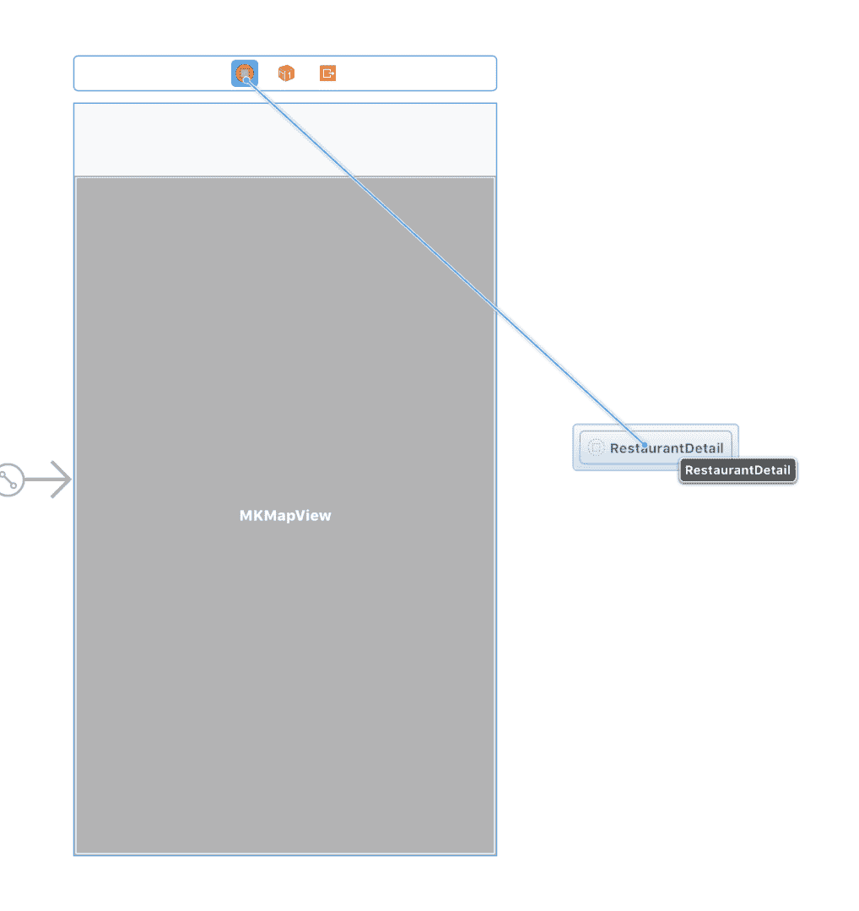

1.  选择连接地图视图控制器到故事板引用的 segue：

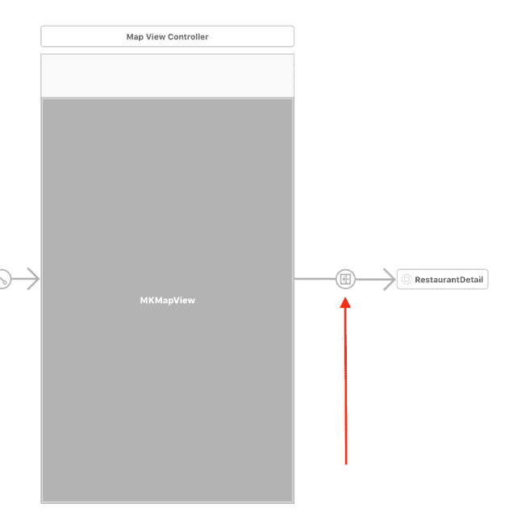

1.  在属性检查器中，更新 Storyboard Segue 下的标识符为`showDetail`。然后，按*Enter*键：

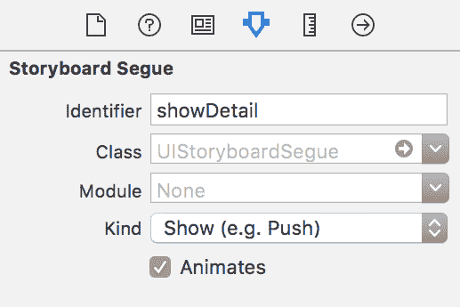

此标识符是我们每次点击餐厅详情展开时将要调用的。让我们接下来连接我们的 segue。

# 地图到餐厅详情

在我们连接 segue 之前，我们应该创建一个枚举（简称`enum`）来跟踪我们的 segue。枚举是一种用户定义的数据类型，由一组相关值组成：

1.  在`Common`文件夹内的`Misc`文件夹上右键单击，并选择新建文件：

1.  在选择新文件模板的屏幕上，顶部选择 iOS，然后选择 Swift 文件。然后点击下一步。

1.  将此文件命名为`Segue`并点击创建。

1.  在新文件中的`import Foundation`下面添加以下代码：

```
enum Segue:String {
  case showDetail
  case showRating
  case showReview
  case ShowAllReviews
  case restaurantList
  case locationList
  case showPhotoReview
}
```

我们最终需要所有这些转场，所以我们可以一次性添加它们。每次我们使用一个新的转场时，我都会参考这个文件。接下来，我们需要知道当用户点击呼出视图的详情展开时。

在`MapViewController.swift`文件中，在`addMap(_ annotations:)`方法下添加以下代码：

```
func mapView(_ mapView: MKMapView, annotationView view: MKAnnotationView, calloutAccessoryControlTapped control: UIControl) {
   self.performSegue(withIdentifier: Segue.showDetail.rawValue, sender: self)
}
```

我们使用`performSegue()`来调用我们的自定义转场。现在，当你点击注释然后点击呼出视图时，你将转到餐厅详情视图：

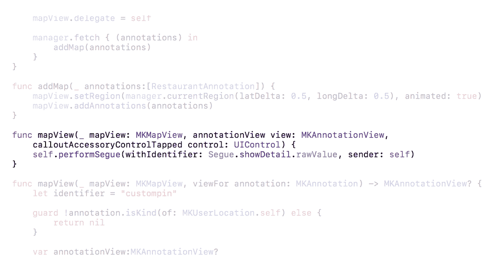

通过点击播放按钮（或使用*cmd* + *R*）来构建和运行项目。现在我们可以从地图中进入餐厅详情视图。

# 将数据传递到餐厅详情

在下一章中，我们将展示餐厅详情中的数据。现在，我们想要将数据传递到详情视图中。

为了使这个功能正常工作，我们需要更新我们的`RestaurantDetailViewController`（我们尚未创建）和`MapViewController`。让我们创建`RestaurantDetailViewController`：

1.  右键点击`Restaurant`文件夹，创建一个名为`Restaurant Detail`的新组。

1.  然后，右键点击新的`Restaurant Detail`文件夹，创建一个名为`Controller`的新组。

1.  接下来，右键点击新的`Controller`文件夹并选择新建文件。

1.  在选择新文件模板的屏幕上，顶部选择 iOS，然后选择 Cocoa Touch 类。然后点击下一步。

1.  在选项屏幕中添加以下代码：

新文件：

+   +   类：`RestaurantDetailViewController`

    +   子类：`UITableViewController`

    +   也创建 XIB：未选中

    +   语言：`Swift`

1.  点击下一步然后创建。

1.  删除`viewDidLoad()`方法之后的所有内容，因为我们不需要其他所有代码。

你的文件现在应该看起来如下：

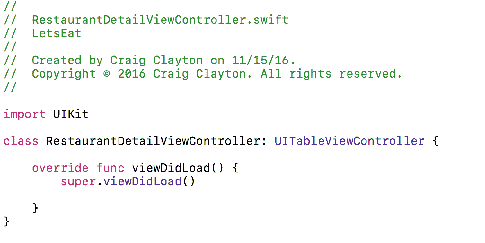

1.  接下来，在类声明内部，添加以下代码：

```
var selectedRestaurant:RestaurantItem?
```

1.  然后，在`viewDidLoad()`内部添加以下代码：

```
dump(selectedRestaurant as Any)
```

1.  你的文件现在应该如下所示：

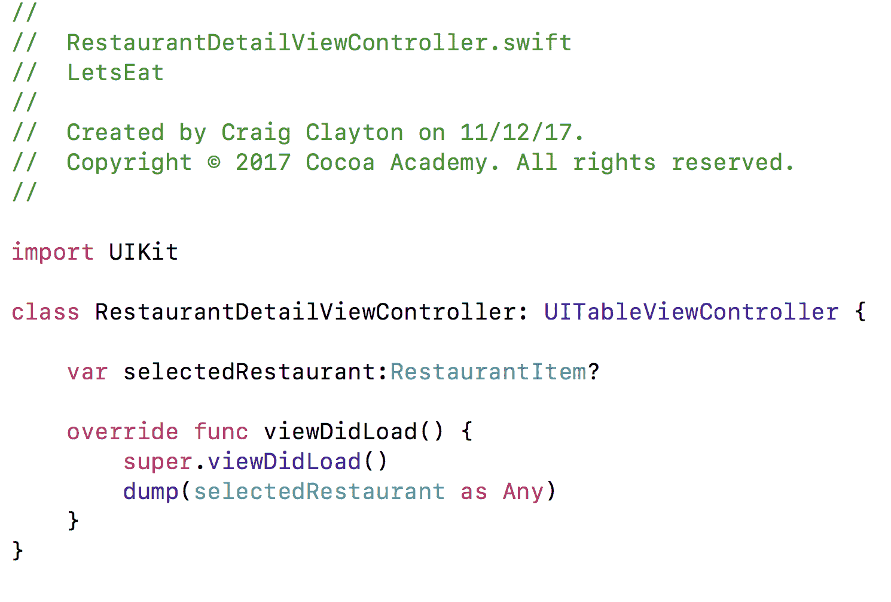

1.  打开你的`RestaurantDetail.storyboard`文件。

1.  在大纲视图中选择表格视图控制器。

1.  在工具面板中选择身份检查器。

1.  在自定义类下，在类下拉菜单中选择 RestaurantDetailViewController，然后按*Enter*以将视图控制器连接到该类。

这就是我们在`RestaurantDetailViewController`中需要做的所有事情。接下来，我们需要更新我们的`MapViewController`**：

1.  打开`MapViewController.swift`文件。

1.  直接在我们声明管理器的地方下面，添加以下代码：

```
 var selectedRestaurant:RestaurantItem?
```

1.  然后，将以下代码添加到`calloutAccessoryControlTapped()`方法中，位于`performSegue`之上：

```
guard let annotation = mapView.selectedAnnotations.first else { return }
selectedRestaurant = annotation as? RestaurantItem
```

你的文件现在应该看起来如下：

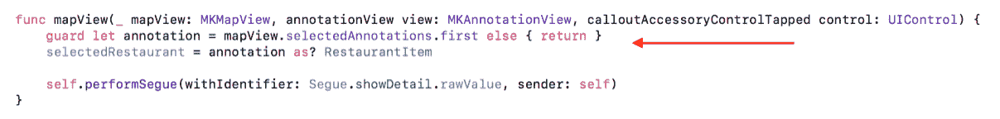

1.  接下来，在`viewDidLoad()`之后添加以下代码：

```
override func prepare(for segue: UIStoryboardSegue, sender: Any?) {
  switch segue.identifier! {
      case Segue.showDetail.rawValue:
               showRestaurantDetail(segue: segue)
          default:
               print("Segue not added")
   }
}
```

你将看到一个错误，但请忽略它，因为我们将在下一步中修复它。

每当我们通过过渡进行转换时，这个方法都会被调用。首先，我们检查 `showDetail` 标识符；如果这个标识符被调用，我们想在转换之前做些事情（在这种情况下，获取选定的餐厅并将其传递到详细视图）。

在 `addMap(_ annotations:)` 方法之后添加以下代码：

```
func showRestaurantDetail(segue:UIStoryboardSegue) {
   if let viewController = segue.destination as? RestaurantDetailViewController, let restaurant = selectedRestaurant  {
          viewController.selectedRestaurant = restaurant
   }
}
```

在这里，我们正在检查确保过渡目标为 `RestaurantDetailViewController`；如果是的话，我们确保我们有一个选定的餐厅。当确认过渡目标为 `RestaurantDetailViewController` 并且我们有一个选定的餐厅时，我们使用在 `RestaurantDetailViewController` 中创建的 `selectedRestaurant` 变量并将其设置为 `MapViewController` 中的选定餐厅。

您的文件现在应该看起来像以下内容，包括我们刚刚添加的两个新方法：

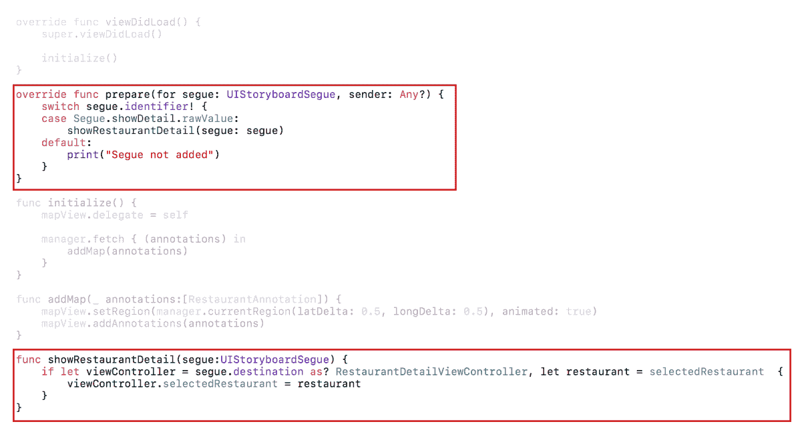

让我们通过点击播放按钮（或使用 *cmd + R*）来构建和运行项目，并测试我们是否可以向 `RestaurantDetailViewController` 传递数据。如果一切正常，你应该在你的调试面板中看到以下内容：

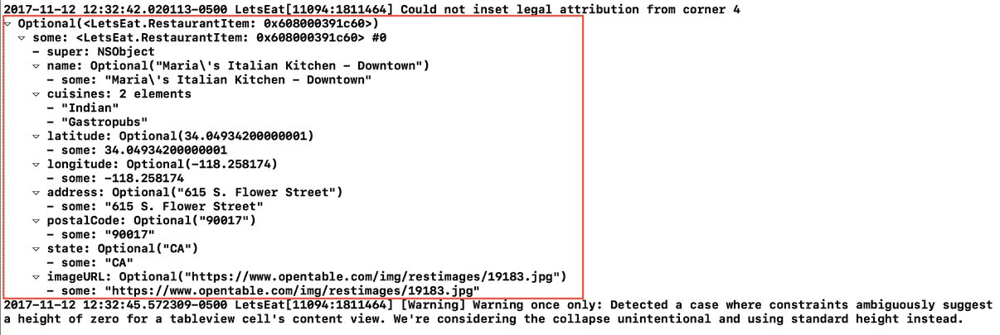

现在，我们的 `RestaurantDetailViewController` 能够接收数据；在下一章中，我们将展示这些数据。然而，在我们编写更多代码之前，我们应该更好地组织我们的代码。

# 组织你的代码

之前，我们为我们的 `DataManager` 编写了一个扩展；扩展对于将你的功能添加到标准库、结构体或类（如数组、整数和字符串）或你的数据类型非常有用。

这里有一个例子。假设你想知道一个字符串的长度：

```
let name = "Craig"
name.characters .count
```

为了访问字符串的计数，我们需要访问字符然后获取计数。

让我们通过创建一个扩展来简化这个操作：

```
extension String {
   var length: Int {
          return self.characters.count
   }
}
```

使用这个新创建的 `String` 扩展，我们现在可以通过编写以下内容来访问计数：

```
let name = "Craig"
name.length
```

如你所见，扩展非常强大，它使我们能够添加额外的功能，而无需更改主类或结构体。

到目前为止，我们很少关注文件结构，更多地关注理解我们在写什么。组织你的代码也非常重要，这就是为什么我们要重构我们的代码。重构将主要涉及复制和粘贴你已经写过的代码。扩展可以帮助我们更好地组织代码，并避免在 View Controllers 中造成混乱。此外，我们还可以通过扩展来扩展 View Controllers 的功能。我们将更新四个类：`ExploreViewController`、`RestaurantListViewController`、`LocationViewController` 和 `MapViewController`。

# 重构 ExploreViewController

我们将使用所谓的 `MARK` 注释将我们的 View Controller 划分为不同的部分。让我们从我们的 `ExploreViewController` 开始：

1.  在 `ExploreViewController` 文件中，在最后一个花括号之后，按几次 *Enter* 并添加以下代码（记住，这应该在类外部，而不是内部）：

```
 // MARK: Private Extension
private extension ExploreViewController {
  // code goes here
}
 // MARK: UICollectionViewDataSource
extension ExploreViewController: UICollectionViewDataSource {
  // code goes here
}
```

在这里，我们创建了两个扩展。我们的第一个扩展将是私有的，我们将在这里添加任何我们需要为这个控制器创建的方法。我们的第二个扩展只处理我们的 `collectionview` 数据源。让我们继续。

1.  我们目前有一个错误，因为我们同时在两个地方使用了 `UICollectionViewDataSource`。从文件顶部的类定义中删除 `UICollectionViewDataSource`（包括逗号）：

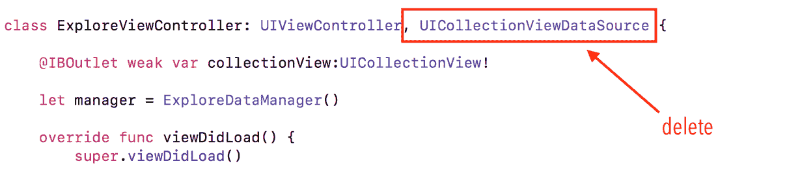

1.  现在，让我们将所有的 `CollectionViewDataSource` 方法移动到我们的扩展中。你应该移动以下内容：

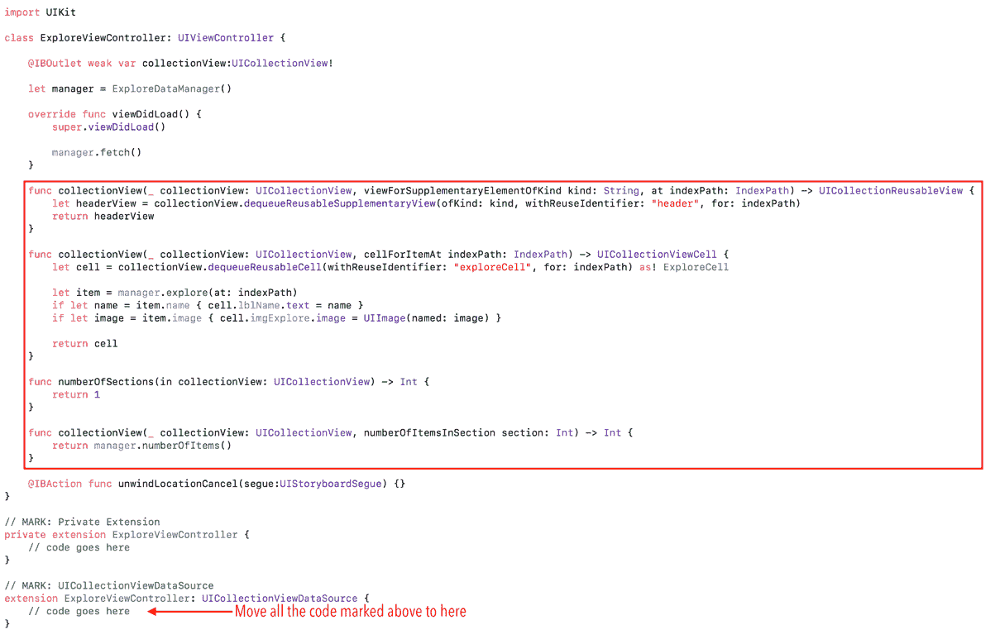

你的文件，包括扩展，现在应该看起来如下：

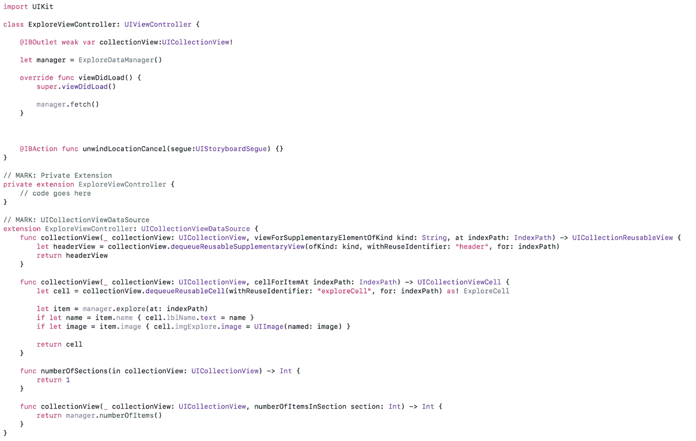

现在，你可能想知道我们为什么创建了 `private` 扩展。好吧，我试图做的一件事是尽可能保持 `viewDidLoad()` 的简洁。而不是在 `viewDidLoad()` 中写很多代码，我喜欢创建一个 `initialize()` 方法并调用它。这样，任何进入我的代码的人都可以清楚地知道我在做什么。让我们向我们的 `private` 扩展添加以下内容：

```
func initialize() {
  manager.fetch()
}

@IBAction func unwindLocationCancel(segue:UIStoryboardSegue){}
```

现在，我们可以在 `viewDidLoad()` 中调用 `initialize()`。当你完成时，你应该看到以下内容：

```
class ExploreViewController: UIViewController {
    @IBOutlet weak var collectionView:UICollectionView!
    let manager = ExploreDataManager()
    override func viewDidLoad() {
        super.viewDidLoad()
        initialize()
    }
}

// MARK: Private Extension
private extension ExploreViewController {
    func initialize() {
        manager.fetch()
    }

   @IBAction func unwindLocationCancel(segue:UIStoryboardSegue){}
}
```

现在，这可能会让你觉得我们为没有写任何代码，但随着你的类增长，你会看到这样做的好处。在我们清理其他文件之前，让我们看看 `MARK` 注释的作用。

# 使用 MARK 注释

目前，我们的 `MARK` 注释可能看起来像代码中的无用注释，但它比你想象的要强大。看看位于播放和停止按钮右侧的底部栏，并寻找最后一个箭头。我的显示为 `No Selection`，但如果你将光标放在一个方法上，你可能会看到这个：

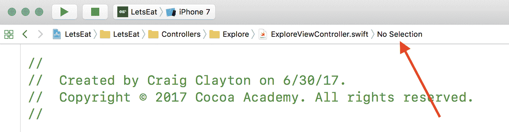

点击这个最后一个项目，你会看到以下内容：

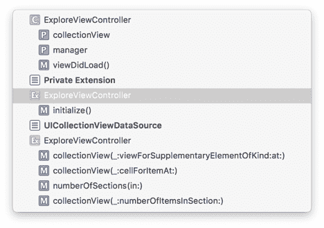

这显示了所有代码，就像我们的文件一样划分。你可以点击任何方法，文件就会直接跳转到那个方法。即使你的文件很长，你正在寻找一个方法，你也可以使用这个技术到达你需要的地方。我们已经完成了 `ExploreViewController` 的清理。

# 重构 RestaurantViewController

我们现在知道了我们的结构，所以让我们更新我们的 `RestaurantViewController`。即使我们目前没有东西要放在我们的 `private` 扩展中，我们也会添加它作为良好的实践：

1.  在我们的 `RestaurantViewController` 中，在最后一个花括号之后，按几次 *Enter* 并添加以下代码（记住，这应该在类外部，而不是内部）：

```
 // MARK: Private Extension

private extension RestaurantViewController {}
 // MARK: UICollectionViewDataSource

extension RestaurantViewController: UICollectionViewDataSource {}
```

1.  接下来，从主类中删除 `UICollectionViewDataSource` 子类。

1.  现在，让我们把所有的 `CollectionViewDataSource` 方法移动到我们的扩展中。你应该移动以下内容：

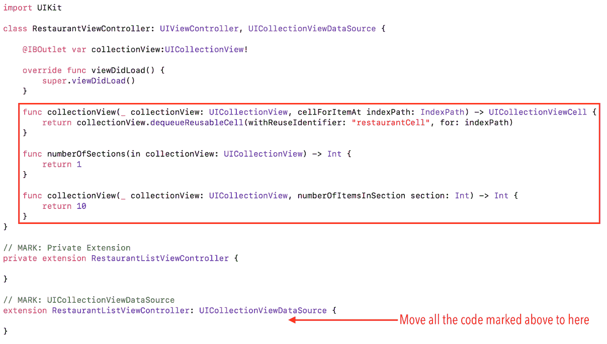

1.  你的文件，包括扩展，现在应该看起来如下：

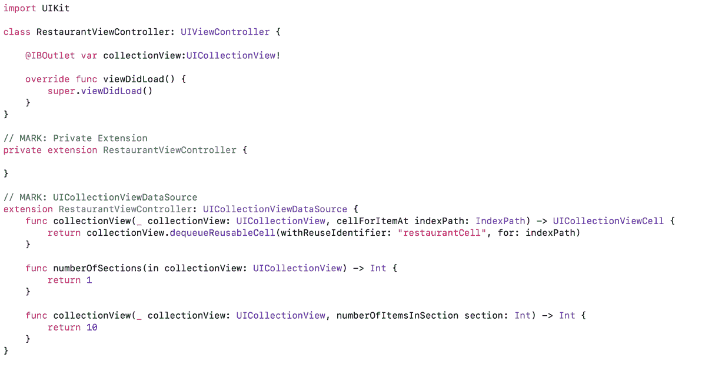

我们成功更新了 `RestaurantListViewController`。

接下来，让我们看看我们的 `LocationViewController`：

1.  在我们的 `LocationViewController` 中，在最后一个花括号之后，按几次 *Enter* 并添加以下代码（记住，这应该在类外部，而不是内部）：

```
// MARK: Private Extension
 private extension LocationViewController {}

 // MARK: UITableViewDataSource
extension LocationViewController: UITableViewDataSource {}
```

1.  接下来，从主类中移除 `UITableViewDataSource` 子类。

1.  现在，让我们把所有的 `TableViewDataSource` 方法移动到我们的扩展中。你应该移动以下内容：

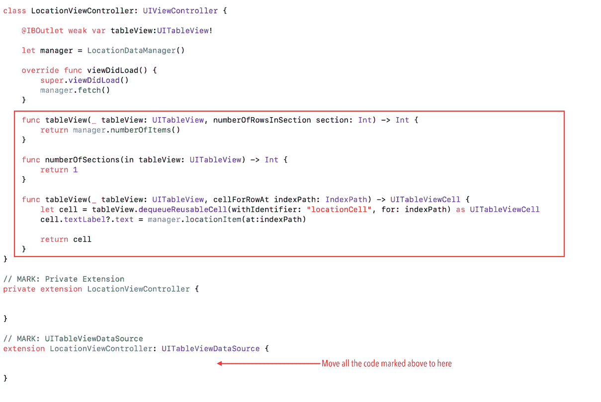

你的文件，包括扩展，现在应该看起来如下：

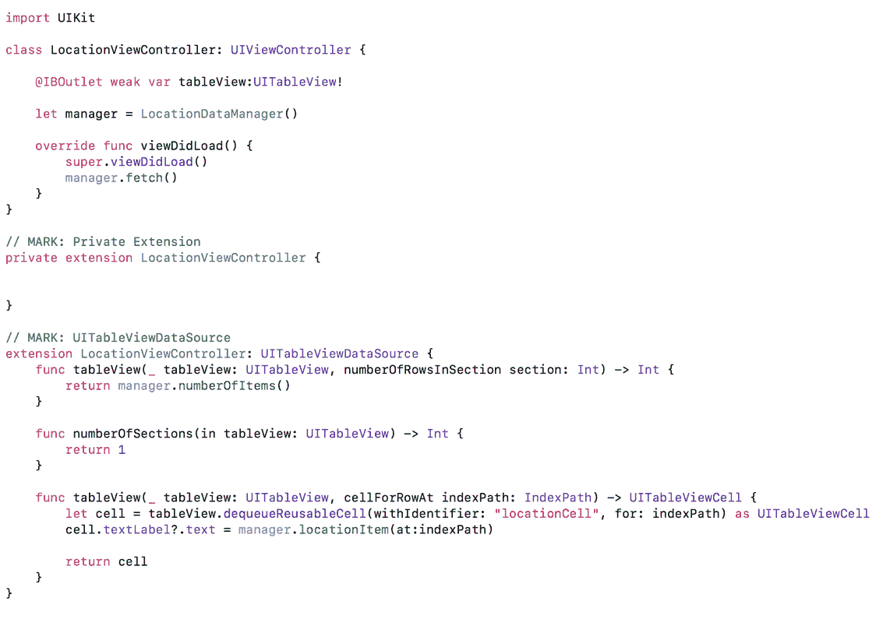

1.  现在，就像我们在 `ExploreViewController` 中做的那样，我们想在 `private` 扩展中创建一个 `initialize()` 方法，并将 `viewDidLoad()` 更新为调用 `initialize()`。当你完成时，你的文件应该看起来像我的：


我们通过清理 `LocationViewController` 来完成。最后，让我们看看我们的 `MapViewController`。

# 重构 MapViewController

我们差不多完成了对文件的重构。我们需要重构的最后一个文件是我们的 `MapViewController`。让我们开始吧：

1.  在我们的 `MapViewController` 中，在最后一个花括号之后，按几次 *Enter* 并添加以下代码（记住，这应该在类外部，而不是内部）：

```
// MARK: Private Extension
private extension MapViewController {}

 // MARK: MKMapDelegate
 extension MapViewController: MKMapDelegate {}
```

1.  接下来，从主类中移除 `MKMapViewDelegate` 子类并将其移动到我们的扩展中。

1.  现在，让我们把所有的 `MKMapViewDelegate` 方法移动到扩展中。你应该移动以下内容：

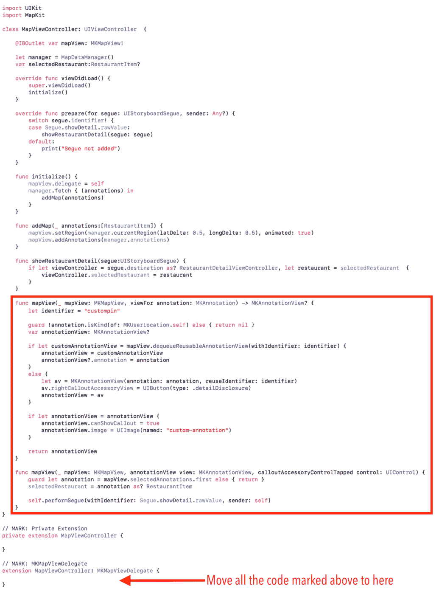

你的扩展现在应该看起来如下：

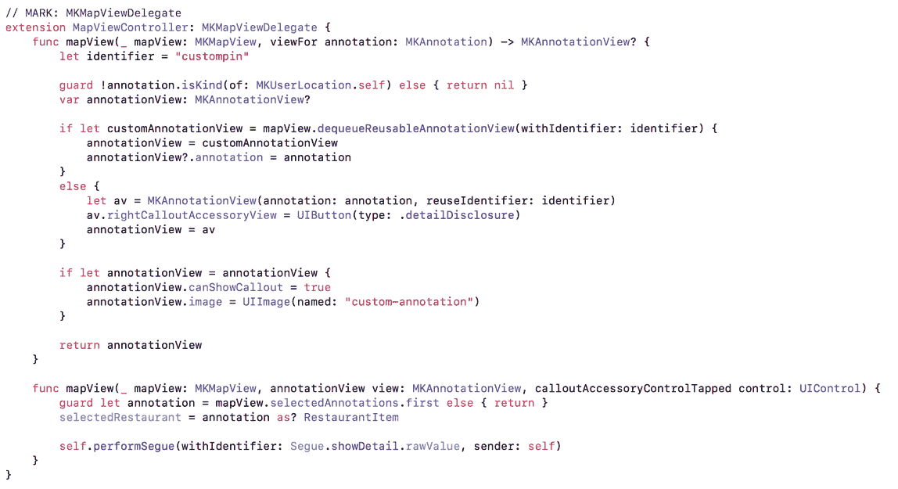

1.  接下来，让我们通过移动以下内容来更新我们的 `private` 扩展：

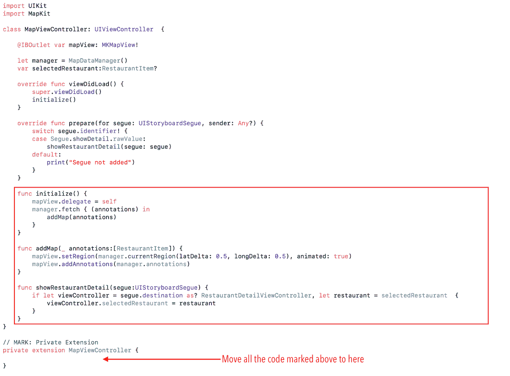

当你完成时，你应该有以下内容：

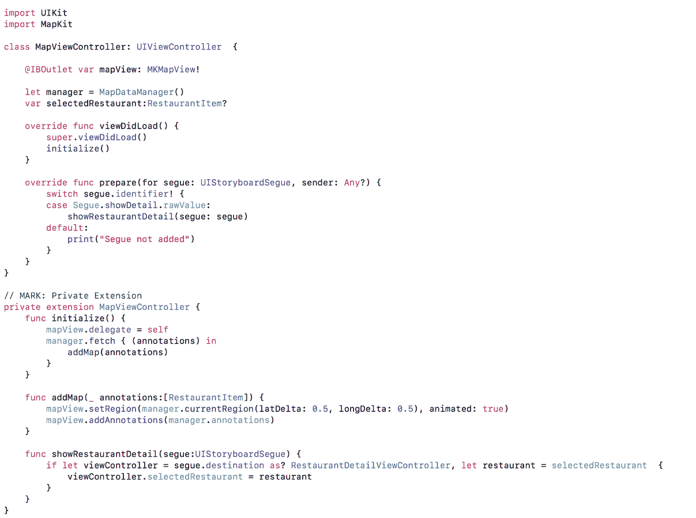

我没有包括 `MKMapViewDelegate` 扩展，因为文件太长了。该扩展位于我们的 `private` 扩展下。为什么我没有移动 `prepare()` 方法？在这种情况下，`prepare()` 和 `viewDidLoad()` 方法是 `UIViewController` 的重写方法。我们希望将这些方法保留在我们的主类声明中。我们做得越多，它就会变得越清晰。

我们完成了四个视图控制器的清理工作。你可能想知道这样做的好处是什么。在这个项目中，这些更新可能看起来并不重要，因为我们没有在视图控制器中做很多事情。然而，随着项目的增长，将会有一些情况需要采用多个协议和代理；因此，这些更新将会是有益的。

这里有一个例子：

```
class NewsListingView: UIViewController, NewsListingViewProtocol, UICollectionViewDelegate, UICollectionViewDataSource, LiveGameNewsViewDelegate, UIGestureRecognizerDelegate
```

这个类继承自视图控制器，并采用了一个协议、三个代理和一个数据源。如果你为每个需要的方法都有两个方法，那么你的类中就会有 12 个函数需要特定的方法。将我们的代码分离出来使得找到它们的位置变得非常容易。

# 摘要

在本章中，我们讨论了`MKAnnotations`是什么以及如何将它们添加和子类化以便在地图上使用。我们还学习了如何自定义我们的标注。现在我们的应用可以从点击标注直接跳转到餐厅详情页面。我们还了解到扩展可以帮助组织代码以及添加功能，而无需更改我们正在工作的主类或结构体。

在下一章中，我们将展示我们的餐厅列表中的数据。我们还将设置餐厅详情页面以显示数据。
