# 第十八章：在餐厅详细视图中显示数据

我们的应用程序正在顺利地进行，但在我们可以开始添加功能之前，我们还有一个部分要做。在我们的所有视图中都有数据，除了餐厅详细视图。在上一个章节中，我们使用 segues 传递数据，我们将在本章再次这样做。在这个视图中，我们还有一些其他事情需要设置，在继续到应用程序的一些功能之前；因此，在本章中，我们将涵盖：

+   使用 segues 传递数据

+   连接 IBOutlet 以显示数据

+   在地图视图中显示一个注释

让我们通过添加以下内容来设置我们的`RestaurantDetailViewController`：

1.  在类声明之后和`selectedRestaurant`变量之前添加以下变量：

```
   // Nav Bar
    @IBOutlet weak var btnHeart: UIBarButtonItem!

    // Cell One
    @IBOutlet weak var lblName: UILabel!
    @IBOutlet weak var lblCuisine: UILabel!
    @IBOutlet weak var lblHeaderAddress: UILabel!

    // Cell Two
    @IBOutlet weak var lblTableDetails: UILabel!

    // Cell Three
    @IBOutlet weak var lblOverallRating: UILabel!

    // Cell Eight
    @IBOutlet weak var lblAddress: UILabel!
    @IBOutlet weak var imgMap: UIImageView! 
```

1.  确保保存文件。

现在我们已经创建了`IBOutlet`，我们需要将它们连接起来：

1.  打开`RestaurantDetail.storyboard`，在大纲视图中选择餐厅详细视图控制器，然后在实用工具面板中打开连接检查器。

1.  现在点击并从我们刚刚添加的以下变量的空圆圈拖动到场景或大纲视图中列出的相应元素。

1.  场景中用于`imgMap`标签到地图视图的空圆圈：

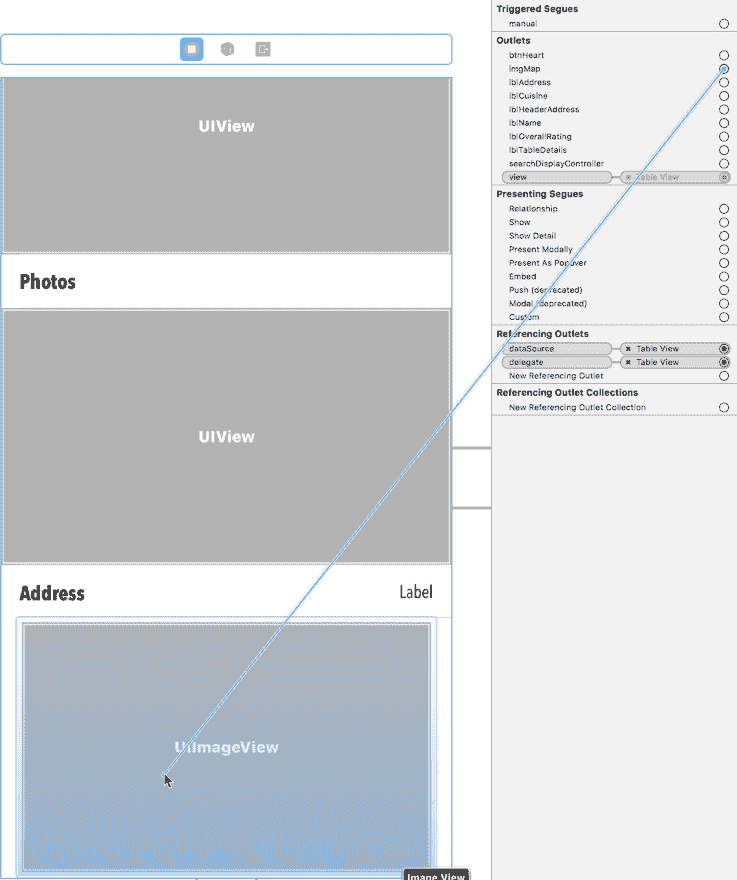

1.  场景中用于`lblAddress`标签到地图上方的地址标签的空圆圈：

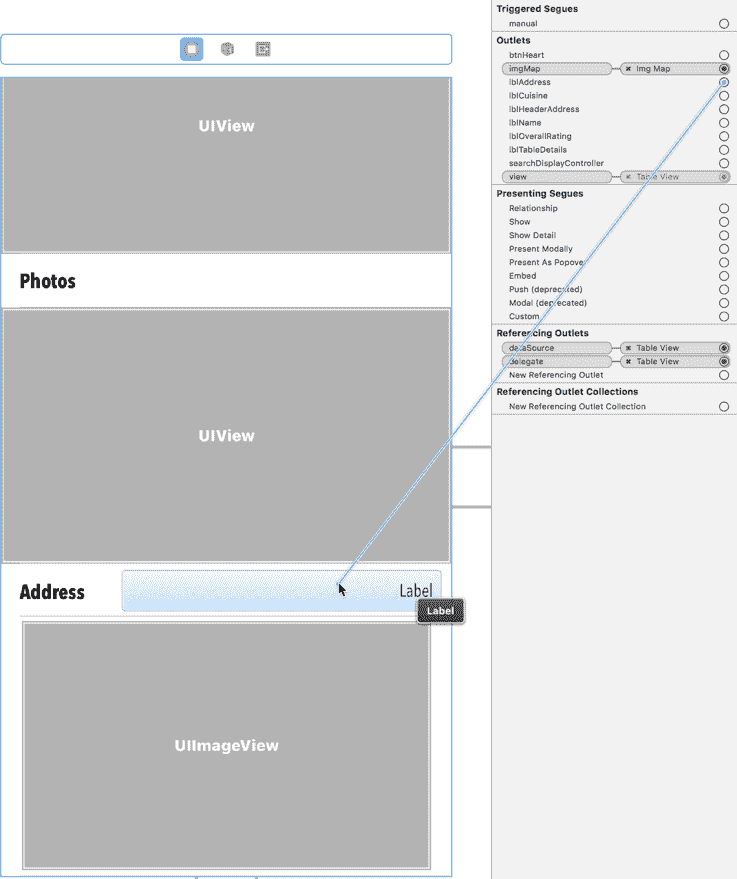

1.  场景中用于`lblOverallRating`标签到评论单元格内的标签的空圆圈：

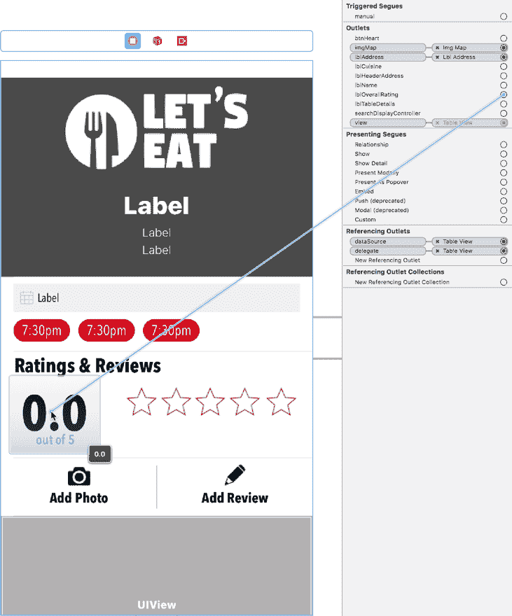

1.  场景中用于`lblTableDetails`标签到标题下方的标签的空圆圈：

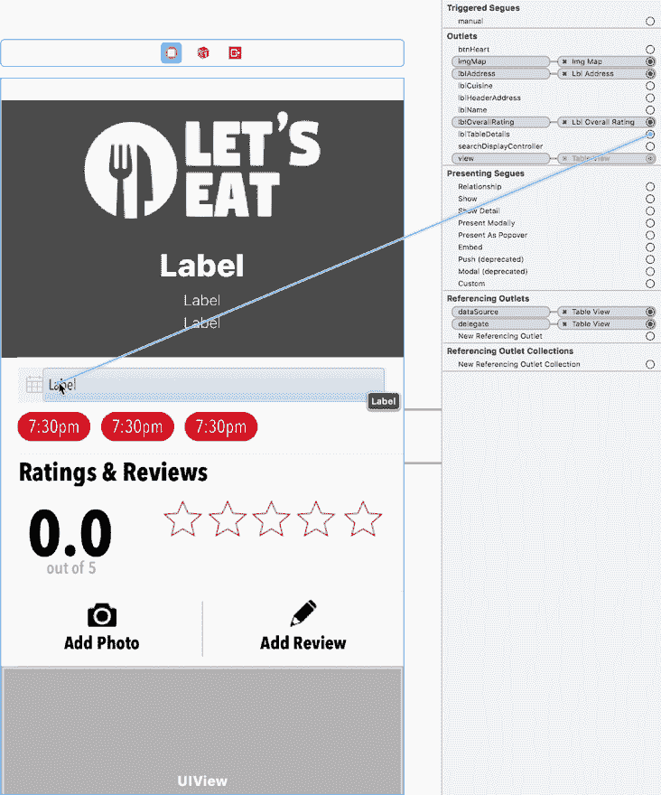

1.  场景中用于`lblName`标签下 logo 下的空圆圈：

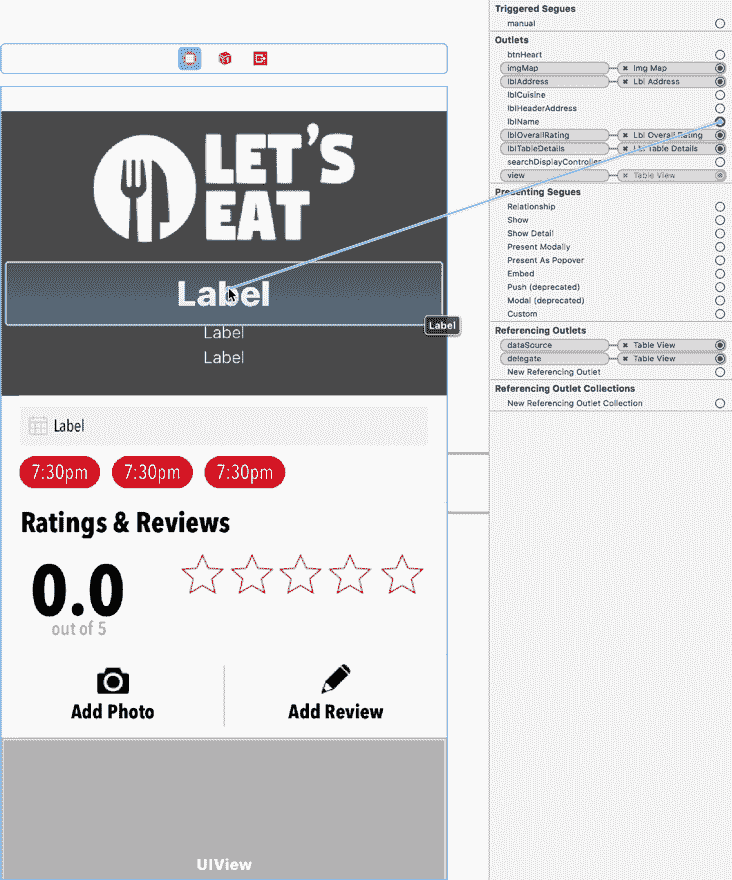

1.  场景中用于`lblCuisine`标签下`lblName`标签的空圆圈：

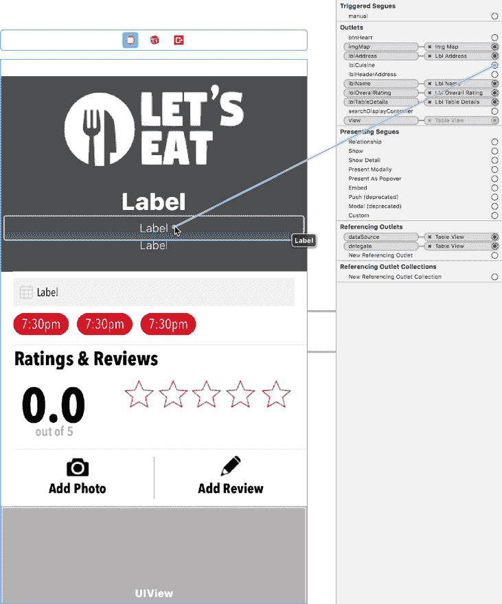

1.  场景中用于`lblHeaderAddress`标签下`lblCuisine`标签的空圆圈：

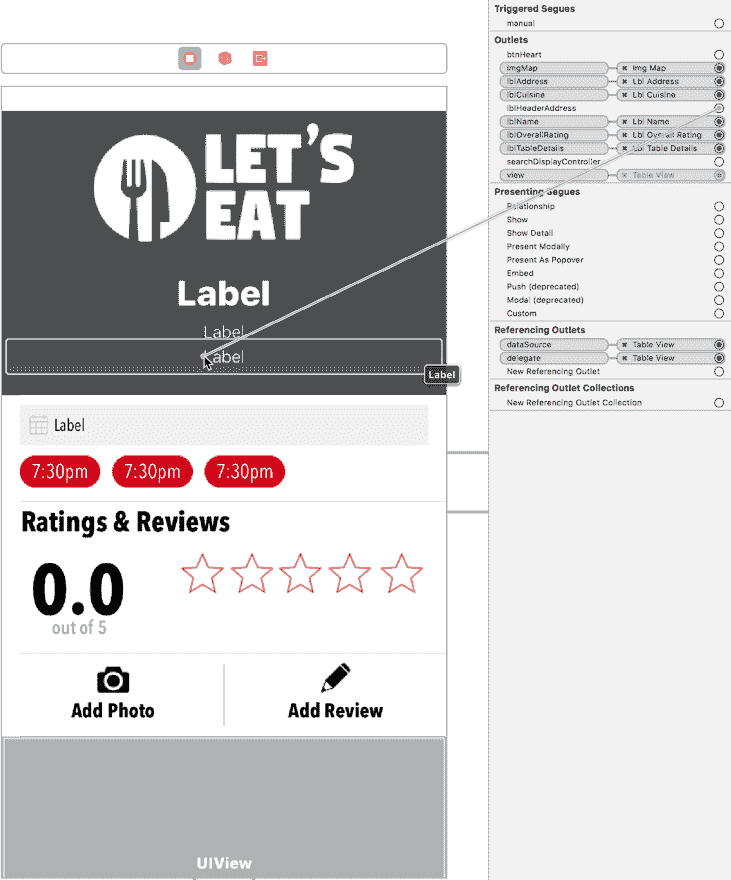

# 添加导航按钮

添加导航按钮曾经是如此简单，只需拖出按钮即可；然而，不知何故，现在不再是这种情况。要在导航栏中显示心形图标，我们需要执行以下操作：

1.  在大纲视图中选择餐厅详细视图控制器。

1.  接下来，转到编辑器 | 嵌入 | 导航控制器。

完成后，你应该会看到以下内容：

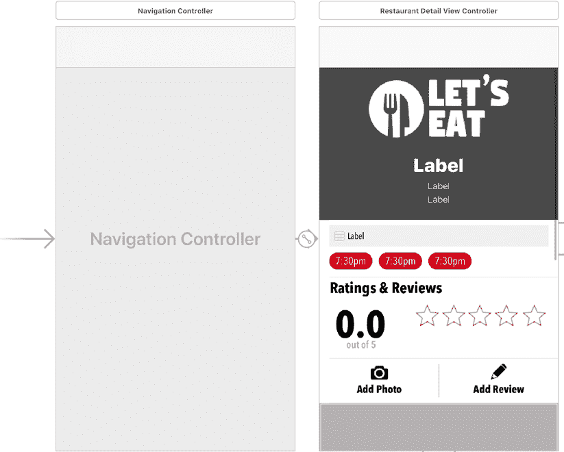

1.  接下来，打开实用工具面板，在对象库的筛选栏中输入`bar`；将一个工具栏按钮拖到餐厅详细视图控制器的右上角。你将在这个区域看到一个轮廓出现，如下所示：

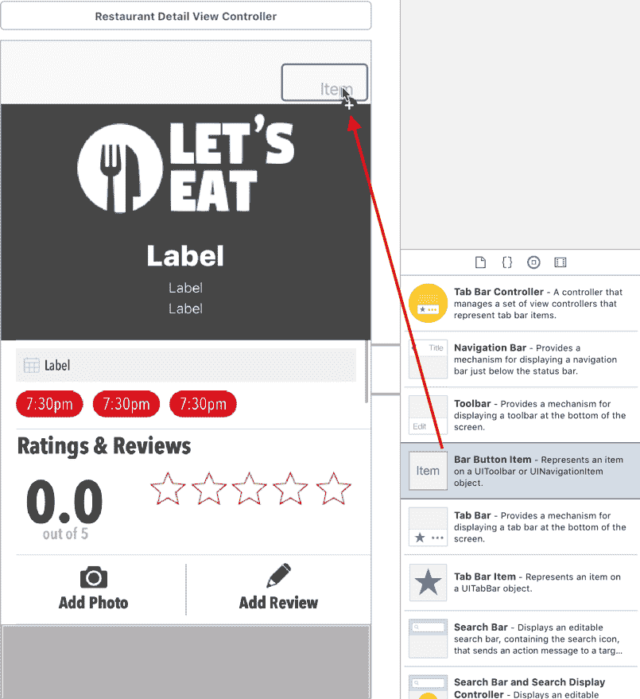

在属性检查器中，在工具栏下，删除标题和图像的文本项，并将图像值更新为 heart-unselected。完成后，你应该会看到以下内容：

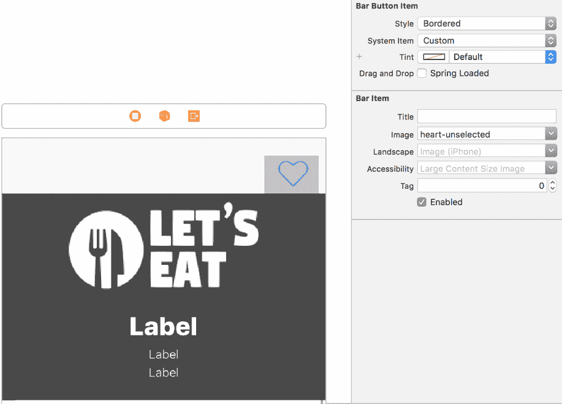

1.  现在我们需要连接导航栏中的收藏图标。在大纲视图中选择餐厅详情视图控制器。然后，在输出检查器中点击并拖动 `btnHeart` 到我们新创建的按钮，如下所示：

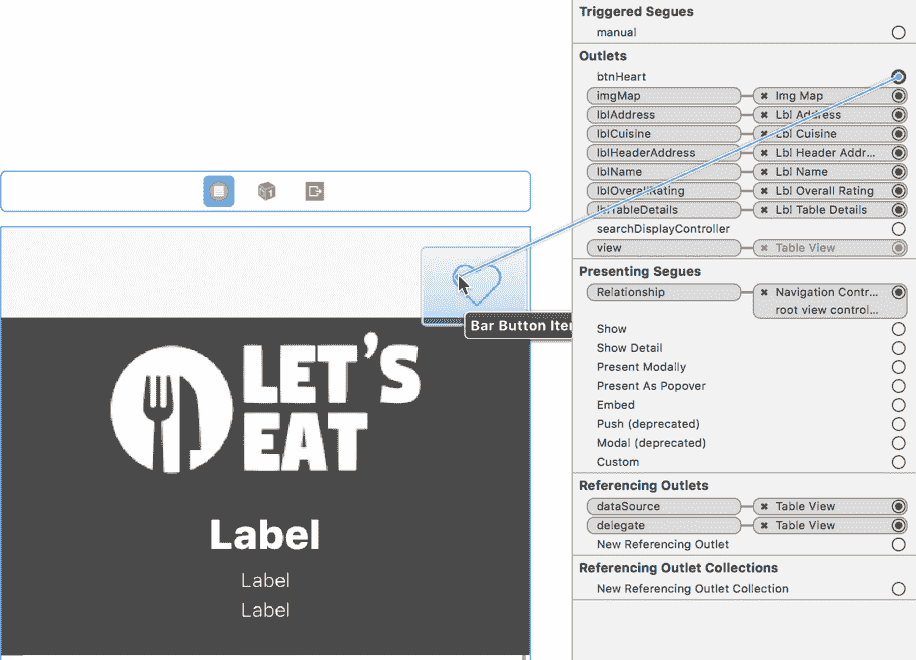

1.  接下来，仍然选择视图控制器，在属性检查器中点击“是初始视图控制器”旁边的复选框。完成后，你应该看到以下内容：

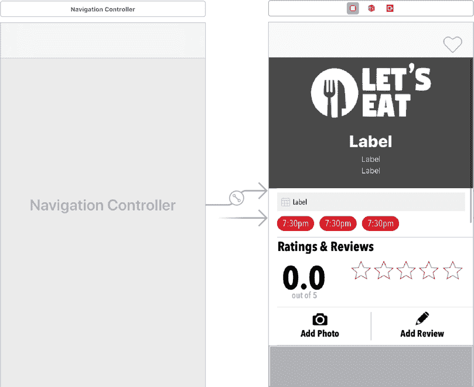

1.  现在选择导航控制器并将其删除。完成后，你应该看到以下内容：

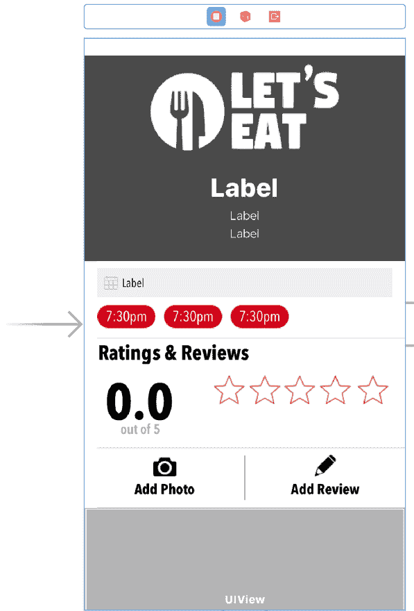

由于某种原因，我们不得不经历所有这些步骤，只是为了添加条形按钮项，尽管通常我们只需拖放即可。现在我们已经将所有内容连接起来，我们可以开始编码，并让我们的详情页面显示数据。

# 在我们的静态表格视图中显示数据

接下来，我们需要创建一个方法，该方法将在我们的标签中显示所有数据。

因此，打开 `RestaurantDetailViewController.swift` 文件，并在最后一个花括号之前添加以下内容：

```
func setupLabels() {
    guard let restaurant = selectedRestaurant else { return }
    if let name = restaurant.name {
        lblName.text = name
        title = name
    }

    if let cuisine = restaurant.subtitle { lblCuisine.text = cuisine }
    if let address = restaurant.address {
        lblAddress.text = address
        lblHeaderAddress.text = address
    }

    lblTableDetails.text = "Table for 7, tonight at 10:00 PM"
}
```

此方法现在将获取数据并在我们的标签内显示。接下来，我们想在详情视图的底部显示餐厅位置的地图。现在，你可能想知道为什么我们使用图片而不是地图。使用地图需要更多的资源，而图片可以使事情更加流畅。让我们安排显示地图图片，并在图片中显示我们的自定义注释。在 `setupLabels()` 方法下和最后一个花括号之前添加以下方法：

```
func createMap() {
    guard let annotation = selectedRestaurant, let long = annotation.longitude, let lat = annotation.latitude else { return }
    let location = CLLocationCoordinate2D(
        latitude: lat,
        longitude: long
    )

    takeSnapShot(with: location)
}
```

在此方法中，我们获取经纬度并将值输入到 `CLLocationCoordinate2D` 对象中。然后我们将位置传递给名为 `takeSnapShot(with:)` 的方法。在 `createMap()` 方法下添加以下方法：

```
func takeSnapShot(with location: CLLocationCoordinate2D) {
    let mapSnapshotOptions = MKMapSnapshotOptions()
    var loc = location
    let polyLine = MKPolyline(coordinates: &loc, count: 1)
    let region = MKCoordinateRegionForMapRect(polyLine.boundingMapRect)

    mapSnapshotOptions.region = region
    mapSnapshotOptions.scale = UIScreen.main.scale
    mapSnapshotOptions.size = CGSize(width: 340, height: 208)
    mapSnapshotOptions.showsBuildings = true
    mapSnapshotOptions.showsPointsOfInterest = true

    let snapShotter = MKMapSnapshotter(options: mapSnapshotOptions)
    snapShotter.start() { snapshot, error in
        guard let snapshot = snapshot else {
            return
        }

        UIGraphicsBeginImageContextWithOptions(mapSnapshotOptions.size, true, 0)
        snapshot.image.draw(at: .zero)

        let identifier = "custompin"
        let annotation = MKPointAnnotation()
        annotation.coordinate = location

        let pinView = MKPinAnnotationView(annotation: annotation, reuseIdentifier: identifier)
        pinView.image = UIImage(named: "custom-annotation")!
        let pinImage = pinView.image
        var point = snapshot.point(for: location)

        let rect = self.imgMap.bounds
        if rect.contains(point) {
            let pinCenterOffset = pinView.centerOffset
            point.x -= pinView.bounds.size.width / 2
            point.y -= pinView.bounds.size.height / 2
            point.x += pinCenterOffset.x
            point.y += pinCenterOffset.y
            pinImage?.draw(at: point)
        }

        if let image = UIGraphicsGetImageFromCurrentImageContext() {
            UIGraphicsEndImageContext()
            DispatchQueue.main.async {
                self.imgMap.image = image
            }
        }
    }
}
```

此方法虽然很长，但它允许我们创建所需大小的地图。然后我们将所有设置传递给我们的快照器以创建图片。一旦我们创建了图片，我们就在其上添加自定义注释。尽管这需要很多代码，但这是完全理解它的最佳方式。在这里，我们建议逐行更改值以查看它对图片的影响。

现在我们已经创建了我们的函数，我们只需按照以下方式调用它们：

在 `RestaurantDetailViewController.swift` 文件中 `viewDidLoad()` 方法之后添加以下内容：

```
func initialize() {
   setupLabels()
   createMap()
}
```

现在需要在你的 `viewDidLoad()` 方法中调用此方法。将 `viewDidLoad()` 方法中的 `dump` 语句替换为以下内容：

```
initialize()
```

现在我们已经完成了餐厅详情视图控制器的开发。让我们通过点击播放按钮（或使用 *cmd* + *R*）来构建和运行项目。当你选择一家餐厅时，你应该在详情页面上看到所有关于该餐厅的信息。

此外，你应该在地图上看到餐厅位置的标记，实际上这是一个图片：

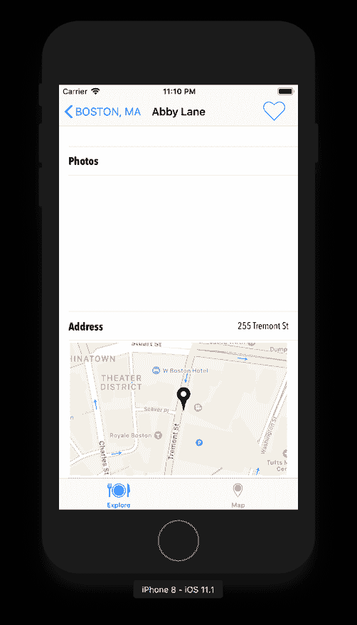

目前我们已经完成了餐厅详情的设置，但我们仍然需要能够显示评分、评论和图片。我们将在接下来的章节中处理所有这些功能。

# 摘要

现在我们已经将 JSON 数据加载到我们的应用中。正如你所见，从 plist 文件转换到 JSON 文件并不是一个巨大的步骤。我们的应用现在看起来越来越像可以在 App Store 上发布了。在接下来的章节中，我们将关注添加你可能想在应用中使用的功能。这些功能将增强用户体验，因此学习它们将非常有价值。即使这些功能看起来不是你想要的或需要的，从长远来看，了解它们是什么以及它们是如何工作的也将是有益的。

在下一章中，你将使用相机，学习如何应用滤镜并将图片保存到相机胶卷。
