# 食品评论

我们都熟悉评论，从食品评论到 App Store 评论。看到网站和应用的评论很常见。在本章中，我们将创建一个包含自定义五星级评分组件的评论表单，并将其添加到其中。我们将了解`UIControls`及其强大功能。我们还将探讨字面量及其在代码中的使用方法。

在本章中，你将学习以下内容：

+   创建用户可以用来写评论的表单

+   创建自定义星级评分

+   图像和颜色字面量

# 开始创建评论

我们的评论表单 UI 已经设置好了，但我们需要对其进行一些小的修改。目前，我们显示了一个用于评分的图像。我们将构建一个自定义评分组件，我们将在餐厅详情和我们的评论表单中使用它。

我们首先将其添加到餐厅详情中，然后完成之后，再添加到评论表单中。我们希望我们的评分视图能够显示从零星到五星的评分。我们还希望用户在评分时能够选择半星，因此它还需要显示半星。

我们首先要做的是开始创建我们的自定义`UIControl`。`UIButtons`和`UISwitches`是`UIControls`的子类，而且不需要过于技术化，我们将创建我们的控件：

1.  右键点击“评论表单”文件夹并选择“新建文件”。

1.  在“选择新文件模板”屏幕中，在顶部选择 iOS，然后选择 Cocoa Touch Class。然后点击“下一步”。

1.  在出现的选项屏幕中，添加以下内容：

新建文件：

+   +   类：`RatingsView`

    +   子类：`UIControl`

    +   语言：`Swift`

1.  点击“下一步”，然后点击“创建”。

现在我们已经创建了文件，我们希望能够在故事板中将它连接到一个`UIView`。让我们做以下操作：

1.  打开`RestaurantDetail.storyboard`。

1.  在“实用工具”面板的对象库中，在过滤器字段中输入`view`。

1.  删除带有五个空星星的图像。

1.  然后，将一个带有空星星的视图拖入单元格中。

1.  选择视图，然后在“大小检查器”中更新以下值：

+   +   X：`151`

    +   Y：`43`

    +   宽度：`205`

    +   高度：`34`

1.  选择视图，然后点击“固定”图标。输入以下值：

+   +   顶部：`13`

    +   左：`0`

    +   宽度：`205`（已勾选）

    +   高度：`34`（已勾选）

    +   限制到边距：未勾选

1.  点击“添加 4 个约束”。

1.  接下来，选择“餐厅视图控制器”，然后在“身份检查器”中，将自定义类更新为`RatingsView`并按*Enter*键。

现在，我们已经准备好开始。打开`RatingsView.swift`文件，让我们开始吧。

# 在我们的自定义`UIControl`中显示评分

在`RatingsView.swift`文件内部，我们首先需要创建所有我们将要使用的变量。在类声明下添加以下内容：

```
let imgFilledStar = #imageL iteral(resourceName: "filled-star")
let imgHalfStar = #imageLiteral(resourceName: "half-star")
let imgEmptyStar = #imageLiteral(resourceName: "empty-star")
let shouldBecomeFirstResponder = true
var rating:CGFloat = 0.0
var totalStars = 5 
```

如果你在使用图像字面量时遇到麻烦，可以使用`UIImage(named:)`代替。

我们在这个文件中做一些事情。我们使用图像字面量作为变量。如果你在文件中输入`Image Literal`并按回车键，你会看到一个小的图标：

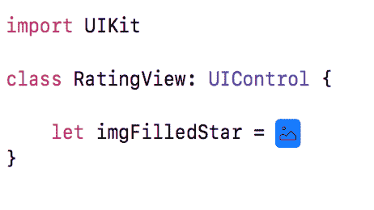

双击此图标，会出现一个模态窗口，显示您可以选择的图片：

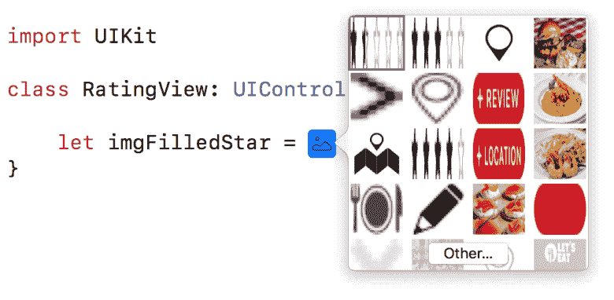

您可以使用这个窗口查找并找到三张图片，或者您可以直接在这里输入您看到的所有内容，图片就会显示出来。完成后，您应该看到以下内容：

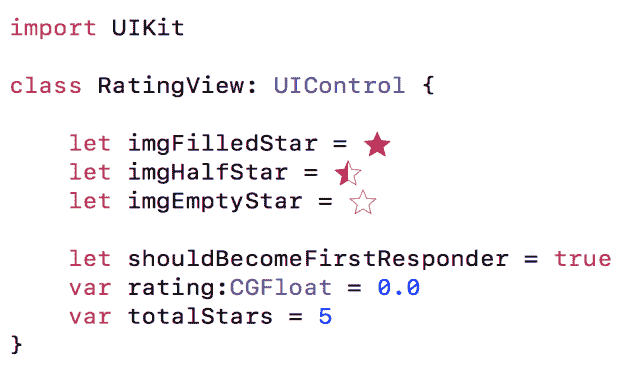

创建的前三个变量用于绘制我们的评分视图。下一个变量`showBecomeFirstResponder`是一个变量，让我们能够响应和处理事件。下一个变量是评分变量，用于跟踪我们的当前评分。最后，我们有一个变量来跟踪星星的总数。

现在让我们添加我们的`init`方法：

```
override init(frame: CGRect) {
    super.init(frame: frame)
}
required init?(coder aDecoder: NSCoder) {
    super.init(coder: aDecoder)
}
override func setNeedsLayout() {
    super.setNeedsLayout()
    self.setNeedsLayout()
}
```

这些只是创建视图时需要的一些样板代码。这里没有太多要解释的，除了您需要它们之外。接下来，我们需要创建一些方法来处理创建我们的星星。我们需要每种类型的星星（完整、半和空）三个。在最后一个大括号之后添加以下内容：

```
private extension RatingView {
    func drawStar(with frame:CGRect, highlighted:Bool) {
        let image = highlighted ? imgFilledStar :imgEmptyStar
        draw(with: image, and: frame)
    }

    func drawHalfStar(with frame:CGRect) {
        draw(with: imgHalfStar, and: frame)
    }

    func draw(with image:UIImage, and frame:CGRect) {
        image.draw(in: frame)
    }
}
```

这些方法只是创建一个完整、半或空星星。我们现在需要能够绘制这些星星。`UIView`有一个`draw`方法，我们可以用它来绘制星星。在`drawStar(frame:highlighted:)`方法之前，在类内部添加以下方法：

```
override func draw(_ rect: CGRect) {
    let context = UIGraphicsGetCurrentContext()
    context!.setFillColor( colorLiteral(red: 1, green: 1, blue: 1, alpha: 0).cgColor)
    context!.fill(rect)

    let availWidth = rect.size.width
    let cellWidth = availWidth / CGFloat(totalStars)
    let starSide = (cellWidth <= rect.size.height) ? cellWidth : rect.size.height

    for index in 0...totalStars {
        let value = cellWidth*CGFloat(index) + cellWidth/2
        let center = CGPoint(x: value+1, y: rect.size.height/2)
        let frame = CGRect(x: center.x - starSide/2, y: center.y - starSide/2, width: starSide, height: starSide)
        let highlighted = (Float(index+1) <= ceilf(Float(self.rating)))

        if highlighted && (CGFloat(index+1) > CGFloat(self.rating)) {
            drawHalfStar(with: frame)
        } else {
            drawStar(with: frame, highlighted: highlighted)
        }
    }
}
```

这里是我们创建星星所需的所有代码。让我们分解代码，看看发生了什么。首先，我们获取一个图形上下文，并将其填充颜色设置为透明。这次我们使用颜色字面量，这允许我们在 Swift 文件中创建颜色并直接看到这些颜色。您可以输入`Color Literal`并按*Enter*键。您将看到一个白色框已经为您创建，如果您双击此框，就可以像在故事板中一样编辑颜色。

接下来，我们创建三个变量：`availWidth`、`cellWidth`和`starSide`。由于我们在故事板中使用`UIView`，我们检查这个容器的尺寸。然后，我们根据宽度和星星的数量确定每颗星星的大小。最后，我们计算星星的高度。

然后，我们遍历每一颗星星，并根据评分值创建它们。我们的评分可以是 0-5，增量是`0.5`。我们还设置了每个星星的位置，使用中心点。最后，根据值确定星星应该是空星星、半星星还是满星星。这就是我们的设置方法，您不需要完全理解其工作原理，只需有一个基本理解即可，随着您代码量的增加，它开始变得有意义。

在我们构建项目之前，打开`RestaurantDetailViewController`，在`import UIKit`下添加以下导入：

```
import MapKit
Then, after imgMap, add the following outlet:
@IBOutlet weak var ratingView: RatingView!
```

让我们通过将`createMap()`、`setupLabels()`和`takeSnapshot(:location)`方法移动到一个私有扩展中来做一些清理工作。完成后，您应该看到以下内容：

```
private extension RestaurantDetailViewController {
    func setupLabels() {
        guard let restaurant = selectedRestaurant else { return }
        if let name = restaurant.name {
            lblName.text = name
            title = name
        }
        if let cuisine = restaurant.subtitle { lblCuisine.text = cuisine }
        if let address = restaurant.address {
            lblAddress.text = address
            lblHeaderAddress.text = address
        }
        lblTableDetails.text = "Table for 7, tonight at 10:00 PM"
    }
    func createMap() {
        guard let annotation = selectedRestaurant, let long = annotation.longitude, let lat = annotation.latitude else { return }
        let location = CLLocationCoordinate2D(
            latitude: lat,
            longitude: long
        )
        takeSnapShot(with: location)
    }

    func takeSnapShot(with location: CLLocationCoordinate2D) {
        let mapSnapshotOptions = MKMapSnapshotOptions()
        var loc = location
        let polyLine = MKP  olyline(coordinates: &loc, count: 1)
        let region = MKCoordinateRegionForMapRect(polyLine.boundingMapRect)
        mapSnapshotOptions.region = region
        mapSnapshotOptions.scale = UIScreen.main.scale
        mapSnapshotOptions.size = CGSize(width: 340, height: 208)
        mapSnapshotOptions.showsBuildings = true
        mapSnapshotOptions.showsPointsOfInterest = true
        let snapShotter = MKMapSnapshotter(options: mapSnapshotOptions)
        snapShotter.start() { snapshot, error in
            guard let snapshot = snapshot else {
                return
            }
            UIGraphicsBeginImageContextWithOptions(mapSnapshotOptions.size, true, 0)
            snapshot.image.draw(at: .zero)
            let identifier = "custompin"
            let annotation = MKPointAnnotation()
            annotation.coordinate = location
            let pinView = MKPinAnnotationView(annotation: annotation, reuseIdentifier: identifier)
            pinView.image = UIImage(named: "custom-annotation")!
            let pinImage = pinView.image
            var point = snapshot.point(for: location)
            let rect = self.imgMap.bounds
            if rect.contains(point) {
                let pinCenterOffset = pinView.centerOffset
                point.x -= pinView.bounds.size.width / 2
                point.y -= pinView.bounds.size.height / 2
                point.x += pinCenterOffset.x
                point.y += pinCenterOffset.y
                pinImage?.draw(at: point)
            }

            if let image = UIGraphicsGetImageFromCurrentImageContext() {
                UIGraphicsEndImageContext()
                DispatchQueue.main.async {
                    self.imgMap.image = image
                }
            }
        }
    }
}
```

接下来，将以下方法添加到私有方法中：

```
func createRating() {
    ratingView.rating = 3.5
}
```

接下来，打开`RestaurantDetail.storyboard`，选择餐厅视图控制器，然后在输出检查器中点击并从`ratingView`拖动到我们之前创建的`UIView`。通过点击播放按钮（或使用*cmd* + R）来构建和运行项目。当你到达餐厅详情时，你会看到我们现在有了 3.5 颗星：

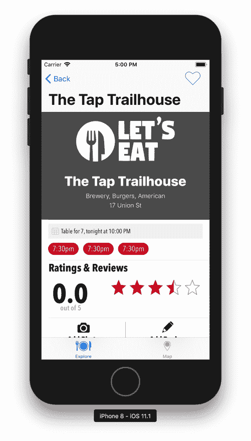

这正是我们想要的，但我们还需要我们的控件能够处理触摸事件。

# 添加我们的触摸事件

添加触摸事件将用于将评分更改为所需的评分。打开`RatingView`，让我们在主类内部添加所需的方法，以便我们的控件能够通过添加以下内容来接受触摸事件：

```
override var canBecomeFirstResponder: Bool {
    return shouldBecomeFirstResponder
}
override func beginTracking(_ touch: UITouch, with event: UIEvent?) -> Bool {
    if self.isEnabled {
        super.beginTracking(touch, with: event)
        if (shouldBecomeFirstResponder && self.isFirstResponder) {
            becomeFirstResponder()
        }
        handle(with: touch)
        return true
    }
    else { return false }
}
```

然后，在私有扩展中添加以下内容：

```
func handle(with touch: UITouch) {
    let cellWidth = self.bounds.size.width / CGFloat(totalStars)
    let location = touch.location(in: self)
    var value = location.x / cellWidth

    if (value + 0.5 < CGFloat(ceilf(Float(value)))) {
        value = floor(value) + 0.5
    }
    else {
        value = CGFloat(ceilf(Float(value)))
    }

    updateRating(with: value)
}
// Update Rating
func updateRating(with value:CGFloat) {
    if (self.rating != value && value >= 0 && value <= CGFloat(totalStars)) {
        self.rating = value
        setNeedsDisplay()
    }
}
```

以下代码用于处理触摸。首先，我们设置`canBecomeFirstResponder`变量。然后，我们有`beginTracking(touch:event:)`。在这个方法中，我们设置我们的控件是否可以接受触摸事件。如果控件被启用，则允许触摸，并调用`handle()`方法并传递`UITouch`位置。让我们讨论一下`handle()`方法。

在我们的处理方法中，我们开始有三个变量。我们首先获取整个评分视图的宽度。然后，我们获取触摸位置的价值，然后最后我们取位置的`x`值并将其除以宽度。然后我们检查这个值，确定它是否小于`0.5`或大于`0.5`，并相应地进行四舍五入。最后，我们使用我们计算出的值更新评分。

在`updateRating(value:)`方法中，我们检查我们的值是否不等于当前值，以及该值是否大于零且小于总星数。如果这些条件通过，则我们将评分设置为新的值并调用`setNeedsDisplay()`方法。此方法确保我们的控件被重新绘制。

打开`RestaurantDetailsViewController`，在`createRating()`方法中添加以下内容：

```
ratingView.isEnabled = true
```

我们现在有了评分，通过将评分设置为 3.5，我们现在应该看到 3.5 颗星。我们还设置了`isEnabled`值为`true`，这意味着我们可以触摸并更改评分。如果我们将其设置为`false`，则值无法更改。在餐厅详情中，我们希望关闭触摸，但在`ReviewFormViewController`中我们希望它被启用。你可以尝试一下，完成后将`isEnable`值设置为`false`并移除评分。

我们将在本书的后面设置评分，当我们开始保存评论时：

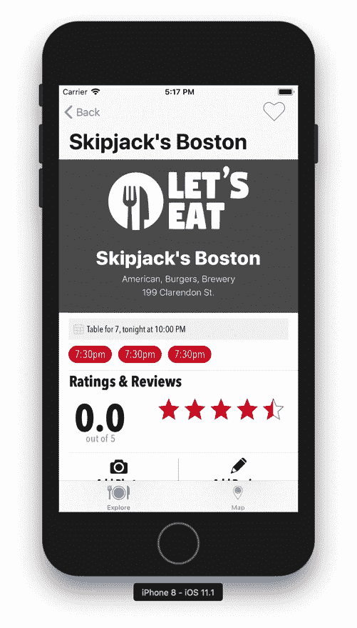

现在，你可以通过点击视图将评分从 3.5 更改为 4.5。现在我们已经设置好了这个，让我们设置我们的评论表单。

# 设置撤销（unwind）转场

正如我们之前所做的那样，我们需要添加代码以便我们能够撤销（解散）视图控制器：

1.  打开`RestaurantDetailsViewController.swift`文件，并在私有扩展中添加以下内容：

```
@IBAction func unwindReviewCancel(segue:UIStoryboardSegue) {}
```

1.  保存文件并打开`ReviewForm.storyboard`。

1.  使用 CTL 拖动取消按钮到同一视图控制器中的退出图标：

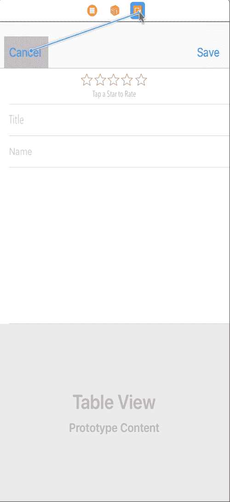

1.  在出现的屏幕中，在操作切换下选择`unwindReviewCancelWithSegue`。

如果您通过点击播放按钮（或使用*cmd* + *R*）构建和运行项目，现在应该能够关闭评分视图。

# 设置我们的评分控制

我们现在将设置我们的评分控制：

1.  打开`ReviewForm.storyboard`。

1.  在实用工具面板的对象库中，在过滤器字段中输入`view`。

1.  删除带有五个空星的图片。

1.  然后，将一个视图拖到带有空星的单元格中。

1.  选择视图，并在“大小检查器”中更新以下值：

+   +   X：`133`

    +   Y：`7`

    +   宽度：`108`

    +   高度：`17`

1.  接下来，在“身份检查器”中，将**自定义类**更新为`RatingsView`并按*Enter*键。

1.  接下来，选择视图内部的视图，然后选择固定图标并输入以下值：

+   +   顶部：`7`

    +   限制到边距：未勾选

    +   宽度：`108`（应该被勾选）

    +   高度：`17`（应该被勾选）

1.  点击添加 3 个约束。

1.  接下来，点击对齐图标并输入“容器中水平”的值为`0`（应该被勾选）。

1.  点击添加 1 个约束。

1.  选择标签“点击星星进行评分”。

1.  然后，选择固定图标并输入“顶部”的值为`1`。

1.  点击添加 1 个约束。

1.  接下来，选择餐厅视图控制器，然后在“身份检查器”中，将自定义类更新为`RatingsView`并按*Enter*键。

我们现在已更新了表单；接下来让我们创建我们的控制器。

# 创建我们的评论表单控制器

1.  右键单击“评论表单”文件夹，然后选择“新建文件”。

1.  在选择新文件模板的屏幕中，在顶部选择 iOS，然后选择 Cocoa Touch 类。然后，点击下一步。

1.  在出现的选项屏幕中，添加以下内容：

新文件：

+   +   类：`ReviewFormViewController`

    +   子类：`UITableViewController`

    +   也创建 XIB：未勾选

    +   语言：`Swift`

1.  点击下一步，然后创建。

删除`viewDidLoad()`方法之后的所有内容，因为我们不需要其他所有代码。接下来，让我们通过在类声明之后添加以下内容来设置我们的`ReviewFormViewController`：

```
@IBOutlet weak var ratingView: RatingView!
@IBOutlet weak var tfTitle: UITextField!
@IBOutlet weak var tfName: UITextField!
@IBOutlet weak var tvReview: UITextView!
```

我们还需要在保存按钮被点击时添加一个方法，如下所示：

```
@IBAction func onSaveTapped(_ sender: Any) {
  print(ratingView.rating)
  print(tfTitle.text as Any)
  print(tfName.text as Any)
  print(tvReview.text)
  dismiss(animated: true, completion: nil)
}
```

现在，让我们将此文件与我们的`UIViewController`和故事板中的评论表单连接起来：

1.  在实用工具面板中，选择“身份检查器”。

1.  在自定义类下，在类下拉菜单中输入/选择`ReviewFormViewController`并按*Enter*键以将视图控制器连接到该类。

1.  现在，在实用工具面板中选择“连接检查器”。

1.  现在，点击并拖动我们刚刚添加的以下每个变量的空圆圈到场景或大纲视图中的相应元素。

1.  点击并拖动`ratingView`的空圆圈到故事板中的`UIView`：

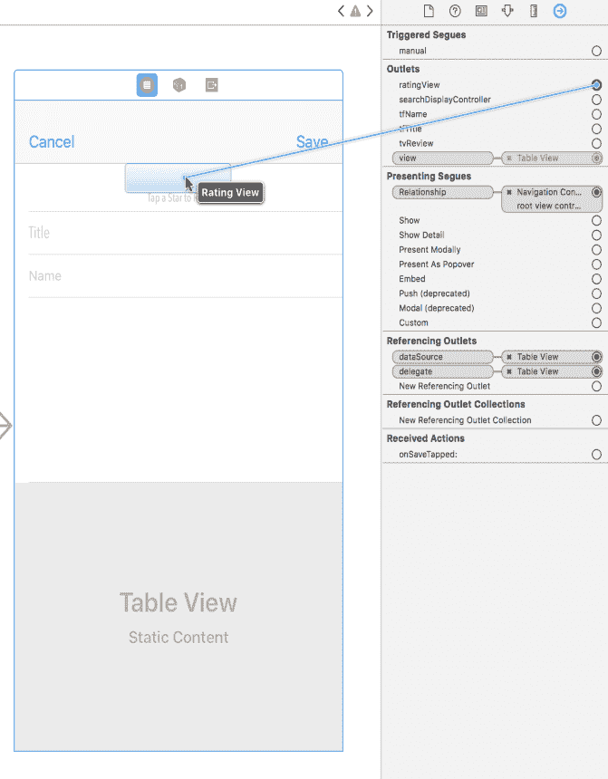

1.  从空圆圈点击并拖动`tfTitle`到故事板中的`Textfield`：

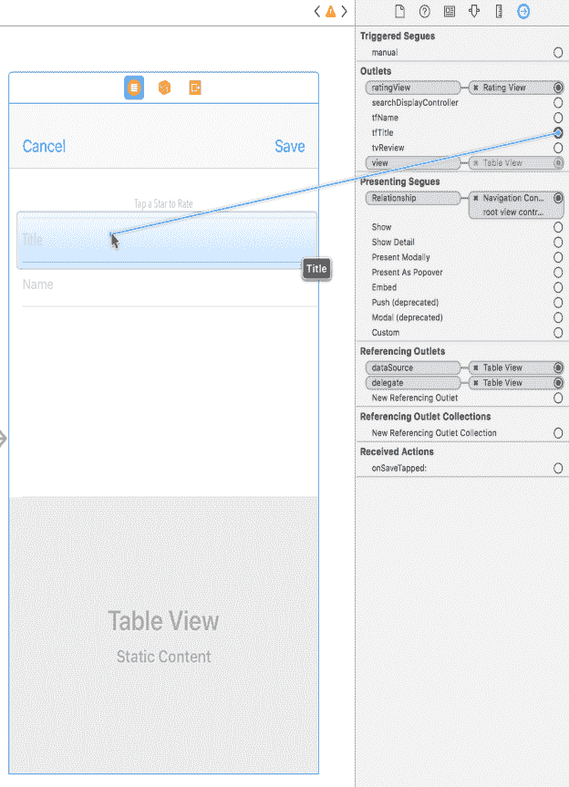

1.  从空圆圈点击并拖动`tfName`到故事板中的`Textfield`：

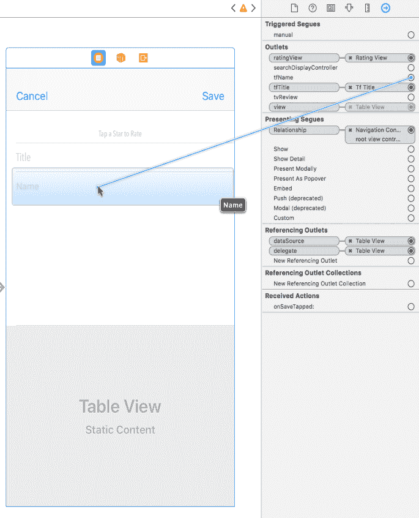

1.  从空圆圈点击并拖动`tvReview`到故事板中的`Text View`：

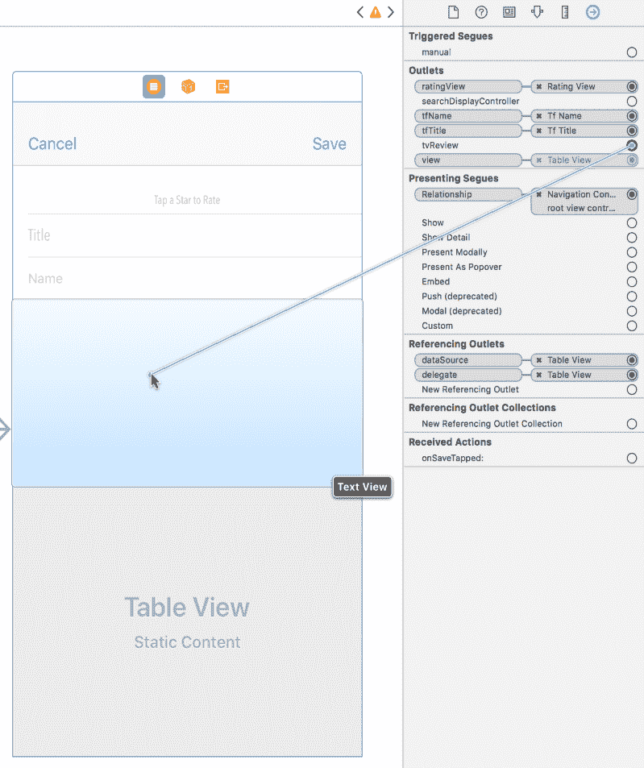

1.  最后，从空圆圈点击并拖动`onSaveTapped`到导航控制器中的保存按钮：

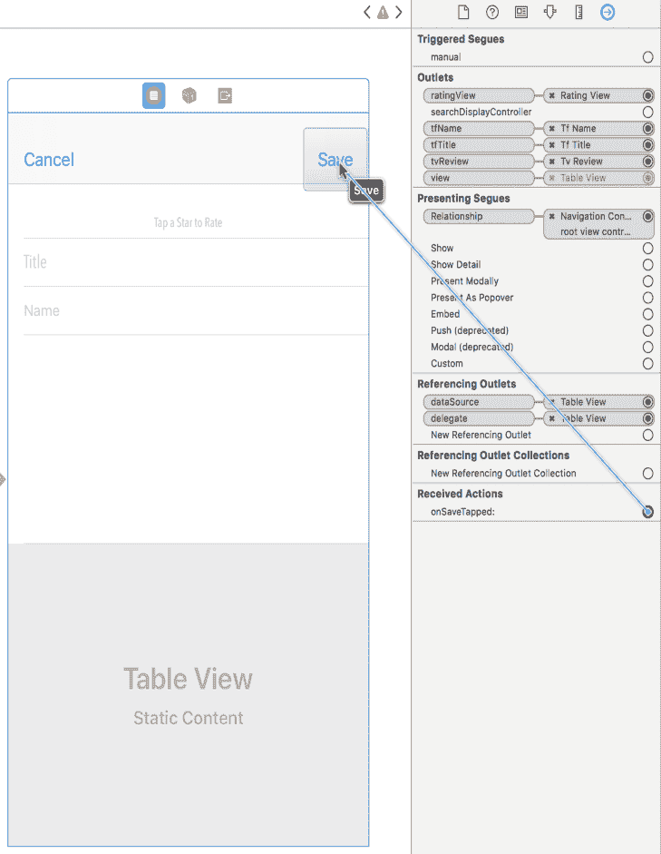

现在，我们已经将出口连接到我们的表单，通过点击播放按钮（或使用*cmd* + *R*）来构建和运行项目。如果你访问你的表单，输入信息并点击保存，你可以在输出面板中看到这些信息。我们的评论现在准备好了。接下来，我们将创建带有滤镜的照片。

# 摘要

在本章中，我们使用静态表格视图创建了一个评论表单。我们第一次使用文本视图和文本字段。我们还设置了我们的第一个自定义`UIControl`，即我们的星级评分，并在本章中使用了颜色和图像字面量。字面量是查看你正在工作的图像或颜色的视觉方式的一种好方法。

在下一章中，我们将研究创建一种方法来向餐厅添加照片。我们还将学习如何为我们的照片添加滤镜。
