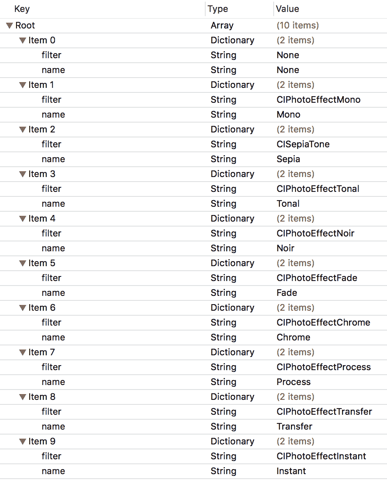
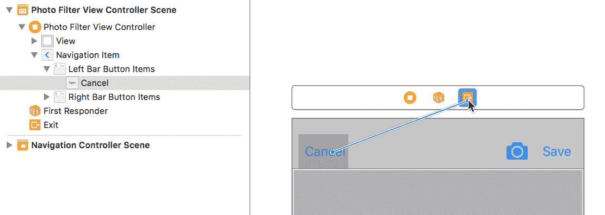
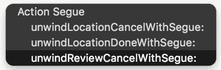
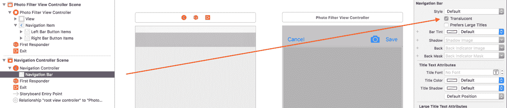
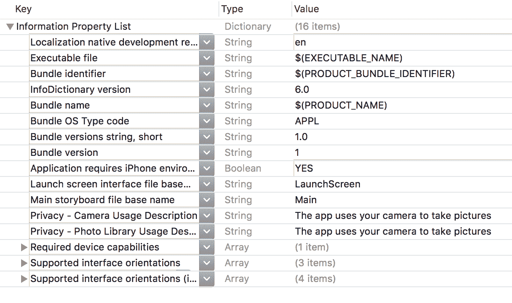
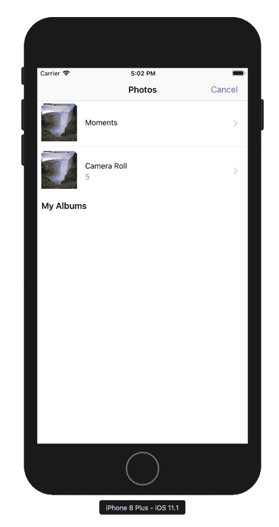
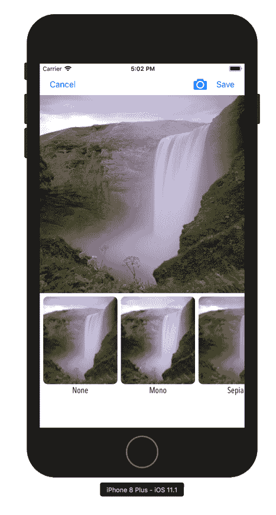

# 与照片过滤器一起工作

在本章中，我们专注于创建餐厅的照片以及如何使用相机和相册。我们赋予用户拍照并应用过滤器到照片的能力。在下一章中，我们将通过完成评论表单并允许用户保存他们的评论来将上一章和本章的内容全部结合起来。我们还将学习如何保存照片。

在本章中，你将学习：

+   如何使用相册获取图片

+   如何使用相机拍照并将它们带入我们的应用

+   如何将过滤器应用到我们的图片并将它们准备好保存到设备上

# 理解过滤器

根据我们的设计，我们知道我们需要对照片应用过滤器。我们不会仅仅创建一个过滤器数组，而是将使用一个 plist 来加载我们想要的过滤器集。你可以在本章的`asset`文件夹中找到`FilterData.plist`文件。将此文件拖放到`Review`文件夹中的`Model`文件夹中。如果需要，请确保勾选“复制项目”，然后点击完成。

让我们看看 plist，看看它包含什么：



此列表仅包含 170 多个可用的过滤器效果中的 10 个。如果你想查看完整的过滤器列表，可以在[`tinyurl.com/coreimage-ios`](http://tinyurl.com/coreimage-ios)找到列表。你可以自由地添加、删除或更新任何过滤器。现在我们已经看到了我们的 plist 的样子，我们需要创建一个表示这些数据的模型。我们还需要创建一个`Manager`类来管理我们的项目。让我们首先创建模型：

1.  右键点击`Review`文件夹中的`Model`文件夹，选择新建文件。

1.  在选择新文件模板的屏幕上，顶部选择 iOS，然后选择 Swift 文件。然后，点击下一步。

1.  将此文件命名为`FilterItem`并点击创建。

1.  接下来，我们需要定义我们的结构；因此，在`import`语句下添加以下内容：

```
class FilterItem: NSObject {
   let filter:String
   let name:String
   init(dict:[String:AnyObject]) {
       name  = dict[name] as! String
         filter = dict[filter] as! String
   }
}
```

`filter`属性将是应用过滤器的类；而`name`属性将用于显示。

接下来，让我们创建我们的`FilterManager`文件：

1.  右键点击`Photo Filter`文件夹，选择新建文件。

1.  在选择新文件模板的屏幕上，顶部选择 iOS，然后选择 Swift 文件。然后，点击下一步。

1.  将此文件命名为`FilterManager`并点击创建。

1.  接下来，我们需要定义我们的类定义；因此，在`import`语句下添加以下内容：

```
class FilterManager: DataManager {
    func fetch(completionHandler:(_ items:[FilterItem]) -> Swift.Void) {
        var items:[FilterItem] = []
        for data in load(file: "FilterData") {
            items.append(FilterItem(dict: data))
        }
        completionHandler(items)
    }
}
```

此文件使用我们的`DataManager`基类，它将我们的 plist 数据转换为字典对象的数组。一旦完成，我们就从这些数据中创建`FilterItems`。

接下来，我们需要创建一个文件，该文件接受一个`FilterItem`并对图像应用过滤器。由于我们将在多个地方执行此操作，最好将所有这些代码放在一个地方。因此，我们将创建一个文件来处理所有这些处理工作。让我们创建我们的`ImageFiltering`文件：

1.  右键点击`Photo Filter`文件夹并选择新建文件。

1.  在选择新文件模板的屏幕上，选择顶部的 iOS，然后选择 Swift 文件。然后点击下一步。

1.  将此文件命名为`ImageFiltering`并点击创建。

1.  将你的文件更新为以下内容：

```
import UIKit
import CoreImage

protocol ImageFiltering {
    func apply(filter:String, originalImage:UIImage) -> UIImage
}

protocol ImageFilteringDelegate:class {
    func filterSelected(item:FilterItem)
}

extension ImageFiltering {
    func apply(filter:String, originalImage:UIImage) -> UIImage {
        let initialCIImage = CIImage(image: originalImage, options: nil)
        let originalOrientation = originalImage.imageOrientation
        guard let ciFilter = CIFilter(name: filter) else {
            print("filter not found")
            return UIImage()
        }
        ciFilter.setValue(initialCIImage, forKey: kCIInputImageKey)
        let context = CIContext()
        let filteredCIImage = (ciFilter.outputImage)!
        let filteredCGImage = context.createCGImage(filteredCIImage, from: filteredCIImage.extent)
        return UIImage(cgImage: filteredCGImage!, scale: 1.0, orientation: originalOrientation)
    }
}
```

让我们分解每个部分，以便我们可以理解我们用这段代码做了什么：

```
import UIKit
import CoreImage
```

`CoreImage`为我们提供了进行图像处理的访问权限。

```
protocol ImageFiltering {
  func apply(filter:String, originalImage:UIImage) -> UIImage
}
```

创建此协议允许其他类遵循它，因此我们可以访问该方法，并允许我们在任何需要的地方使用它。

```
protocol ImageFilteringDelegate:class {
  func filterSelected(item:FilterItem)
}
```

此协议用于在选择滤镜时使用，以及当我们需要传递选定的滤镜时，从一个视图或视图控制器传递到另一个视图控制器。扩展中包含`apply(filter:originalImage:)`方法。在这个方法中，我们创建了一个扩展，并添加了所有我们将要用于应用滤镜到图像的代码。

# 创建我们的滤镜滚动条

用户选择一张照片后，我们向用户展示一个包含该图像的屏幕。在下面的图像中，我们有一个滚动条，也称为`UIScrollView`，它允许我们创建可以水平或垂直滚动的内联内容。`UIScrollView`显示了一个应用了滤镜的图像（缩略图）以及滤镜的名称。这张图像和名称以视觉方式向用户展示我们的滤镜。

当用户点击图像时，用户会看到选定的滤镜改变主图像。让我们看看一个例子：


现在我们将在`UIScrollView`内部创建元素。由于我们在 Storyboard 中创建了很多内容，让我们完全在代码中创建`PhotoItem`：

1.  右键点击`Review`文件夹并选择新建文件。

1.  在选择新文件模板的屏幕上，选择顶部的 iOS，然后选择 Swift 文件。然后点击下一步。

1.  将此文件命名为`PhotoItem`并点击创建。

1.  将你的文件更新为以下内容：

```
import UIKit

class PhotoItem: UIView, ImageFiltering {
}
```

1.  接下来，在类声明中添加你的变量：

```
var imgThumb:UIImageView?
var lblTitle:UILabel?
var data:FilterItem?
weak var delegate: ImageFilteringDelegate?
```

在这里，我们创建了一个委托，用于让任何类知道何时发生某些事情。我们使用这个委托当有人点击对象本身时，这允许我们将`FilterItem`数据传递给父类。

你已经多次使用过这种模式。表格视图和集合视图都有你遵循的委托。

1.  现在，我们需要添加我们的`init`方法。在你的变量之后添加以下内容：

```
required init?(coder aDecoder: NSCoder) {
   fatalError(init(coder:) has not been implemented)
}

init(frame:CGRect, image:UIImage, item:FilterItem) {
    super.init(frame: frame)
    setDefaults(item: item)
    createThumbnail(image: image, item: item)
    createLabel(item: item)
}
```

每当你创建一个`UIView`时，你必须添加此方法。如果不添加，它会给你一个错误，然后你必须添加它。

这是一个自定义的`init()`方法，它允许我们在创建项目时传递数据（在这里，是框架、图像和滤镜项）。我们有一些错误，因为我们没有创建添加到`init()`方法中的方法。

1.  接下来，让我们创建一个扩展并添加以下方法：

```
private extension PhotoItem {
  func setDefaults(item:FilterItem) {
    data = item
    let tap = UITapGestureRecognizer(target: self, 
    action:#selector(thumbTapped))
    self.addGestureRecognizer(tap)
    self.backgroundColor = .clear
  }

  func createThumbnail(image:UIImage, item:FilterItem) {
    if item.filter != "None" {
      let filteredImg = apply(filter: item.filter, originalImage: image)
      imgThumb = UIImageView(image: filteredImg)
    }
    else { imgThumb = UIImageView(image: image) }

    guard let thumb = imgThumb else {
      return
    }

    thumb.contentMode = .scaleAspectFill
    thumb.frame = CGRect(x: 0, y: 22, width: 102, height: 102)
    thumb.clipsToBounds = true

    addSubview(thumb)
  }

  func createLabel(item:FilterItem) {
    lblTitle = UILabel(frame: CGRect(x: 0, y: 0, width: 102, height: 22))

    guard let label = lblTitle else {
      return
    }

    label.text = item.name
    label.font = UIFont.systemFont(ofSize: 12.0)
    label.textAlignment = .center
    label.backgroundColor = .clear

    addSubview(label)
  }
}
```

我们的 `setDefaults()` 方法用于创建一个点击手势。当项目被点击时，我们调用 `thumbTapped` 方法。我们还设置了此方法的数据和背景颜色。

`createThumbnail(image: item:)` 方法用于创建图像并应用图像过滤器。然后，我们设置其框架并将图像添加到视图中。

在我们的最终方法 `createLabel(item:)` 中，我们创建了一个标签并传递了过滤器的名称。然后，我们设置其框架并将标签添加到视图中。我们还需要添加到我们的扩展中的两个更多方法。

1.  在 `createLabel(item:)` 方法之后添加以下内容：

```
@objc func thumbTapped() {
  if let data = self.data {
    filterSelected(item: data)
  }
}

func filterSelected(item:FilterItem) {
  delegate?.filterSelected(item: item)
}
```

`thumbTapped()` 方法用于检测点击。当用户点击项目时，它调用 `filterSelected`。

`filterSelected(item:)` 方法是我们之前创建的协议；我们只是调用 `delegate` 方法，`filterSelected`。我们看到当选定的过滤器被调用时会发生什么。

我们的 `PhotoItem` 已经完成；现在我们需要为我们的 `Filter` 收藏视图创建单元格。

# 创建过滤器单元格

我们已经在故事板中创建了所需的单元格。然而，在我们创建视图控制器之前，我们需要创建一个过滤器单元格。这个单元格用于显示所有可用的过滤器。

1.  右键点击 `Review` 文件夹中的 `Controller` 文件夹中的 `Photo Filter` 文件夹，并选择新建文件。

1.  在选择新文件模板的屏幕中，选择顶部的 iOS，然后选择 Cocoa Touch 类。然后，点击下一步。

1.  在出现的选项屏幕中，添加以下内容：

新建文件：

+   +   类：`FilterCell`

    +   子类：`UICollectionViewCell`

    +   还创建 XIB：未选中

    +   语言：`Swift`

1.  点击下一步，然后创建。

1.  更新你的文件如下：

```
class FilterCell: UICollectionViewCell {
  @IBOutlet var lblName:UILabel!
  @IBOutlet var imgThumb: UIImageView! 
}

extension FilterCell: ImageFiltering {
  func set(image:UIImage, item:FilterItem) {
    if item.filter != "None" {
      let filteredImg = apply(filter: item.filter, originalImage: image)
      imgThumb.image = filteredImg
    }
    else { imgThumb.image = image }

    lblName.text = item.name

    roundedCorners()
  }

  func roundedCorners() {
    imgThumb.layer.cornerRadius = 9
    imgThumb.layer.masksToBounds = true
  }
}
```

我们的单元格相当基础：我们设置了一个图像并给它添加了圆角。

1.  打开 `PhotoFilter.storyboard`。

1.  在概要视图中选择集合视图单元格。然后，在实用工具面板中，在身份检查器下设置自定义类为 FilterCell。

1.  在属性检查器中，将标识符设置为 filterCell。

1.  接下来，连接 `lblName` 和 `imgThumb` 的出口。

1.  我们需要确保当我们点击添加照片按钮时可以关闭模态视图。我们已经添加了所需的方法，但我们需要将其添加到故事板中。从取消按钮拖动到退出图标：CTL



1.  在弹出窗口中，选择 `unwindReviewCancelWithSegue`：



1.  在导航控制器中，在概要视图中选择导航栏。然后，在属性检查器中取消选中半透明：



添加此选项确保我们的导航栏是纯白色而不是半透明的。

我们已经完成了单元格和故事板设置的设置。让我们转到创建我们的视图控制器。

# 创建我们的应用过滤器视图控制器

现在我们需要创建我们的 `PhotoFilterViewController`：

1.  在`Review`文件夹中的`Controller`文件夹中的`Photo Filter`文件夹上右键单击，并选择“新建文件”。

1.  在选择新文件模板的屏幕中，顶部选择 iOS，然后选择 Cocoa Touch 类。然后，点击“下一步”。

1.  在出现的选项屏幕中，添加以下内容：

新文件：

+   +   类：`PhotoFilterViewController`

    +   子类：`UIViewController`

    +   也创建 XIB：未选中

    +   语言：`Swift`

1.  点击“下一步”，然后创建。

当文件打开时，删除`viewDidLoad()`方法之后的所有内容。

1.  然后，添加以下内容：

```
class PhotoFilterViewController: UIViewController {
    var image: UIImage?
    var thumbnail: UIImage?
    let manager = FilterManager()
    var selectedRestaurantID:Int?
    var data:[FilterItem] = []
    @IBOutlet var collectionView: UICollectionView!
    @IBOutlet weak var imgExample: UIImageView!

    override func viewDidLoad() {
        super.viewDidLoad()
        initialize()
    }
}
```

在这里，我们正在设置我们的变量和我们的`initialize()`方法。你可以忽略错误，因为我们将在创建扩展后修复这个问题。

1.  添加以下扩展名：

```
// MARK: - Private Extension
private extension PhotoFilterViewController {

  func initialize() {
    requestAccess()
    setupCollectionView()
    checkSource()
  }
}
```

我们正在创建一些我们需要的基本函数。我们的第一个函数是`initialize()`方法，它调用三个新方法。让我们接下来创建这三个方法。

1.  在`initialize()`方法之后添加以下方法：

```
func requestAccess() {
  AVCaptureDevice.requestAccess(for: AVMediaType.video) { granted in
    if granted {}
  }
}

func setupCollectionView() {
  let layout = UICollectionViewFlowLayout()
  layout.scrollDirection = .horizontal
  layout.sectionInset = UIEdgeInsets(top: 7, left: 7, bottom: 7, right: 7)
  layout.minimumInteritemSpacing = 0
  layout.minimumLineSpacing = 7

  collectionView?.collectionViewLayout = layout
  collectionView?.delegate = self
  collectionView?.dataSource = self
}

func checkSource() {
  let cameraMediaType = AVMediaType.video
  let cameraAuthorizationStatus = AVCaptureDevice.authorizationStatus(for: cameraMediaType)

  switch cameraAuthorizationStatus {
    case .authorized:
    showCameraUserInterface()
    case .restricted, .denied:
    break
    case .notDetermined:
    AVCaptureDevice.requestAccess(for: cameraMediaType) { granted in
      if granted {
        self.showCameraUserInterface()
      }
    }
  }
}
```

我们下一个方法，`setupCollectionView()`方法，是我们集合视图的基本设置。我们在`delegate`和`dataSource`上做了不同的处理。在前面的章节中，我们使用输出检查器设置了这个。这次，我是在代码中设置的。两种方法都可以，没有对错之分，但请选择一种并在整个应用中坚持使用。我之所以做了两种，只是为了演示目的。

下一个方法请求用户访问他们的相机或照片库。`checkSource()`检查你是否在模拟器或手机上运行。如果你在模拟器上运行，由于没有相机，你将自动获得照片库。如果你在设备上，则用户可以访问他们的相机。现在，我们需要添加两个额外的辅助方法。让我们首先添加它们，然后讨论。

1.  添加以下方法：

```
func showApplyFilter() {
    manager.fetch { (items) in
        if data.count > 0 { data.removeAll() }
        data = items
        if let image = self.image {
            imgExample.image = image
            collectionView.reloadData()
        }
    }
}

func filterItem(at indexPath: IndexPath) -> FilterItem{
    return data[indexPath.item]
}
```

第一个方法`showApplyFilter()`用于在集合视图中创建过滤器内容。`filterItem(at:)`用于用户选择`filter`项时使用。我们将传递集合视图的索引位置并从中创建一个过滤器项。此项用于在集合视图上方的大图像中显示当前选中的过滤器。

让我们努力在集合视图中显示项目。正如我们过去所做的那样，我们有几个必需的方法，用于我们的集合视图显示单元格。在我们的私有扩展下添加以下扩展：

```
extension PhotoFilterViewController: UICollectionViewDataSource {
    func collectionView(_ collectionView: UICollectionView, numberOfItemsInSection section: Int) -> Int {
        return data.count
    }

    func numberOfSections(in collectionView: UICollectionView) -> Int {
        return 1
    }

    func collectionView(_ collectionView: UICollectionView, cellForItemAt indexPath: IndexPath) -> UICollectionViewCell {
        let cell = collectionView.dequeueReusableCell(withReuseIdentifier: "filterCell", for: indexPath) as! FilterCell
        let item = self.data[indexPath.row]
        if let img = self.thumbnail {
            cell.set(image: img, item: item)
        }
        return cell
    }
}
```

我们之前已经这样做过了，但让我们再次回顾一下这些方法。`-collectionView:numberOfItemsInSection:`负责每个部分中的项目数量。对于这个集合视图，这意味着我们将要显示的过滤器项数量。接下来，我们有`-numberOfSectionsInCollectionView:`，它告诉我们的集合视图我们有多少个部分；在我们的情况下，我们只有一个。最后，我们有`-collectionView:cellForItemAtIndexPath:`，这是为每个需要创建的单元格运行的方法。在这个方法中，我们正在创建一个过滤器单元格。

现在我们已经设置了基本的集合视图，我们需要确保我们的集合视图布局正确。在这个文件中添加另一个扩展，用于负责集合视图项的布局。在刚刚添加的最后一个扩展之后添加以下扩展和方法：

```
extension PhotoFilterViewController: UICollectionViewDelegateFlowLayout {
    func collectionView(_ collectionView: UICollectionView, layout collectionViewLayout: UICollectionViewLayout, sizeForItemAt indexPath: IndexPath) -> CGSize {
        let screenRect = collectionView.frame.size.height
        let screenHt = screenRect - 14
        return CGSize(width: 150, height: screenHt)
    }
}
```

这个扩展只是设置了我们的单元格大小和间距。保存文件。接下来，让我们连接我们的两个`IBOutlets`：

1.  打开`PhotoFilter.storyboard`。

1.  在“大纲”视图中选择视图控制器，然后在“实用工具”面板中选择“身份”检查器。

1.  在“自定义类”下，在“类”下拉菜单中选择或输入`PhotoFilterViewController`并按*Enter*键。

1.  然后，在“实用工具”面板中选择“连接”检查器。

1.  在“输出”部分，点击并拖动每个组件（`imgExample`、`collectionView`和`onPhotoTapped:`）的空圆圈，分别到场景中的`Image View`、`CollectionView View`和`导航栏顶部的相机图标`上。现在，请再次打开`PhotoFilterViewController.swift`文件，并添加一些额外的代码。

我们的集合视图已经设置好了，但在我们能够使其他所有功能正常工作之前，我们需要添加一些额外的代码。接下来，我们需要添加两个额外的扩展，一个用于处理用户使用相机和照片库的情况，另一个用于我们之前创建的自定义协议。在我们的应用中，我们需要使用`AVFoundation`和`MobileCoreServices`。`AVFoundation`是一个框架，它为我们提供了访问相机的权限，而`MobileCoreServices`则为我们提供了访问滤镜的权限。在文件顶部，在`import UIKit`下面：

```
import AVFoundation
import MobileCoreServices
```

1.  现在，让我们添加第一个扩展，用于访问相机和照片库：

```
extension PhotoFilterViewController: UIImagePickerControllerDelegate, UINavigationControllerDelegate {

    func imagePickerControllerDidCancel(_ picker: UIImagePickerController) {
        picker.dismiss(animated: true, completion: nil)
    }

    func imagePickerController(_ picker: UIImagePickerController, didFinishPickingMediaWithInfo info: [String : Any]) {
        let image = info[UIImagePickerControllerEditedImage] as? UIImage
        if let img = image {
            self.thumbnail = generate(image: img, ratio: CGFloat(102))
            self.image = generate(image: img, ratio: CGFloat(752))
        }
        picker.dismiss(animated: true, completion: {
            self.showApplyFilter()
        })
    }

    func showCameraUserInterface() {
        let imagePicker = UIImagePickerController()
        imagePicker.delegate = self
        #if (arch(i386) || arch(x86_64)) && os(iOS)
            imagePicker.sourceType = UIImagePickerControllerSourceType.photoLibrary
        #else
            imagePicker.sourceType = UIImagePickerControllerSourceType.camera
            imagePicker.showsCameraControls = true
        #endif
        imagePicker.mediaTypes = [kUTTypeImage as String]
        imagePicker.allowsEditing = true
        self.present(imagePicker, animated: true, completion: nil)
    }

    func generate(image:UIImage, ratio:CGFloat) -> UIImage {
        let size = image.size
        var croppedSize:CGSize?
        var offsetX:CGFloat = 0.0
        var offsetY:CGFloat = 0.0
        if size.width > size.height {
            offsetX = (size.height - size.width) / 2
            croppedSize = CGSize(width: size.height, height: size.height)
        }
        else {
            offsetY = (size.width - size.height) / 2
            croppedSize = CGSize(width: size.width, height: size.width)
        }
        guard let cropped = croppedSize, let cgImage = image.cgImage else {
            return UIImage()
        }
        let clippedRect = CGRect(x: offsetX * -1, y: offsetY * -1, width: cropped.width, height: cropped.height)
        let imgRef = cgImage.cropping(to: clippedRect)
        let rect = CGRect(x: 0.0, y: 0.0, width: ratio, height: ratio)
        UIGraphicsBeginImageContext(rect.size)
        if let ref = imgRef {
            UIImage(cgImage: ref).draw(in: rect)
        }
        let thumbnail = UIGraphicsGetImageFromCurrentImageContext()
        UIGraphicsEndImageContext()
        guard let thumb = thumbnail else { return UIImage() }
        return thumb
    }
}
```

我们为`UIImagePickerControllerDelegate`和`UINavigationControllerDelegate`创建的扩展有两个我们需要实现的方法。我们还有一些自定义的辅助方法。当用户点击取消按钮时，会调用`-imagePickerControllerDidCancel: method()`，因此我们只需关闭`Controller`并什么都不做。

当我们从`Picker`中获取图像并关闭它时，会使用`-imagePickerController:didFinishPickingMediaWithInfo: method()`。我们在这里设置缩略图和图像值；然后，我们应用`generate()`方法以获取更小的尺寸。最后，我们关闭`Controller`并调用`showApplyFilter()`来将选定的图像添加到我们的滤镜视图中。

`showCameraUserInterface()` 用于显示相机界面以及相机控制。如我之前提到的，代码首先检查你是否正在运行模拟器，如果是，则显示相册。如果你正在设备上运行，你会看到相机界面。`generate(image:ratio:)` 方法是我们用来获取图像并将它们裁剪到所需大小，并返回一个更小尺寸的图像的方法。相册和相机图像相当大。因此，如果我们不使用这个方法，UI 将需要很长时间才能完成我们所需的所有操作。

我们只需要添加一个扩展，那就是之前创建的自定义协议。请在 `PhotoFilterViewController` 的底部添加以下扩展：

```
extension PhotoFilterViewController: ImageFiltering, ImageFilteringDelegate {
    func filterSelected(item: FilterItem) {
        let filteredImg = image
        if let img = filteredImg {
            if item.filter != "None" {
                imgExample.image = self.apply(filter: item.filter, originalImage: img)
            }
            else {
                imgExample.image = img
            }
        }
    }
}
```

`filterSelected(item:)` 获取选定的过滤器项，并将过滤器应用于我们的 `imgExample`。我们有一个 `if` 语句来检查用户是否选择了 `None`，如果是，则显示没有过滤器的图像。在我们运行它之前，我们需要获取用户使用相机或访问用户相册的权限。

# 获取权限

苹果要求，如果我们使用相机或访问相册，我们必须让用户知道我们在做什么以及为什么这样做。如果你没有这样做，你的相机相关代码将无法工作，并且当你提交应用时，你的应用将被拒绝。让我们现在就处理这个问题。

打开 `Info.plist` 文件，通过在任何键上悬停并点击第一个键的加号图标来添加以下两个键，然后对第二个键重复此操作：

+   `- NSPhotoLibraryUsageDescription`

+   `- NSCameraUsageDescription`

对于每个键的值，输入任何你想要作为用户将看到的提示。在以下示例中，值被设置为 `The app uses your camera to take pictures`：



请确保如果你要将此提交到商店，你使用了适当的措辞。用户和苹果都能看到这个措辞。让我们通过点击播放按钮（或使用 *cmd* + *R*）来构建和运行项目。你现在应该能够从相册获取照片或使用相机。



一旦你有了照片，窗口就会消失，你可以应用过滤器并保存它。



我们实际上还没有保存照片。我们将在下一章中这样做。

# 摘要

在本章中，我们介绍了许多新内容。你学习了如何使用相机以及如何在相机不可用的情况下集成相册。我们首次水平使用 `UICollectionView` 来放置一排图像。这一章有很多代码，可能有些部分让人困惑。请回顾这些部分，确保你完全理解它们。这一章中有许多内容你可以在许多其他应用中重用。

在下一章中，我们将能够保存照片和餐厅评论。
