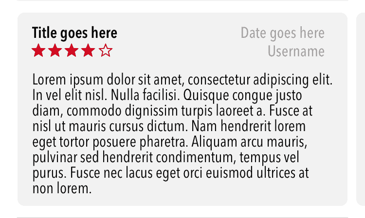
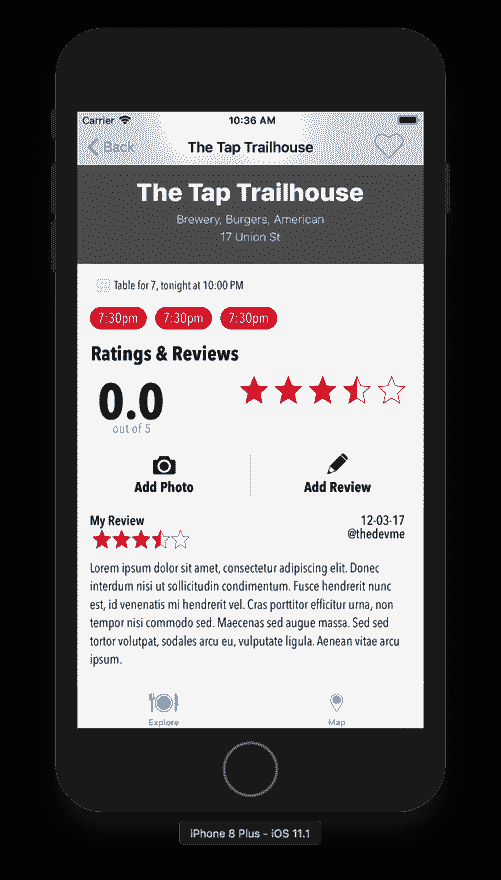
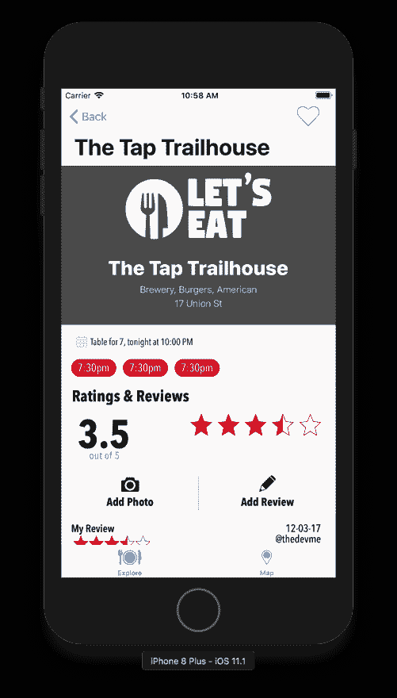

# 第二十二章：保存评论

我们几乎完成了我们的应用。在本章中，我们最终将开始将评论和照片保存到 Core Data 中。然后我们将学习如何从 Core Data 中检索数据并在我们的应用中显示它们。大部分的设置已经为我们完成，我们大部分的工作是调用我们在本书早期创建的方法。

在本章中，你将学习如何：

+   将项目保存到 Core Data

+   从 Core Data 中检索项目

+   将 Core Data 中的项目显示到表格视图中

# 保存评论

首先，我们将从保存评论到 Core Data 开始。打开`ReviewFormViewController.swift`并在`@IBOutlets`上方添加以下变量：

```
var selectedRestaurantID:Int?
```

接下来，删除`onSavedTapped(:)`方法内部的所有内容，然后添加以下内容：

```
@IBAction func onSaveTapped(_ sender: Any) {

  var item = ReviewItem()
  item.name = tfName.text
  item.customerReview = tvReview.text
  item.restaurantID = selectedRestaurantID
  item.rating = Float(ratingView.rating)
  let manager = CoreDataManager()
  manager.addReview(item)
  dismiss(animated: true, completion: nil)
}
```

这就是我们使用`CoreDataManager`将项目保存到 Core Data 所需的所有代码。为了显示特定餐厅的评论，我们需要保存所有带有餐厅标识符的评论。然后，当我们访问某个餐厅时，我们将使用餐厅标识符来搜索 Core Data 以查看是否有已保存的评论。我们通过转场传递此标识符。

1.  打开`RestaurantDetail.storyboard`并选择我们用来跳转到`ReviewForm`的转场。

1.  在实用工具面板的属性检查器中，更新 Storyboard Segue 下的标识符为`showReview`。然后按*Enter*。

1.  接下来，我们需要确保，当用户创建评论时，我们将`restaurantID`传递给评论表单视图控制器。我们需要更新我们的`RestaurantItem`使其具有一个 ID。在`imageURL:String?`变量之后打开`RestaurantItem`并添加以下内容：

```
var restaurantID:String?
```

1.  接下来，在枚举`CodingKeys:String`中添加新的情况：

```
case restaurantID = "id"
```

1.  打开`RestaurantDetailViewController.swift`并在`viewDidLoad()`方法之后添加此方法（现在忽略错误）：

```
override func prepare(for segue: UIStoryboardSegue, sender: Any?) {
   if let identifier = segue.identifier {
         switch identifier {
         case Segue.showReview.rawValue:
               showReview(segue: segue)
         default:
               print("Segue not added")
         }
   }
}
```

`RestaurantDetailViewController`中的`prepare()`方法将检查`showReview`转场标识符。如果成功，它将调用`showReview()`方法，这将带你到评论列表。

1.  接下来，在`createRating()`方法内部私有的扩展上方添加以下方法：

```
func showReview(segue:UIStoryboardSegue) {
    guard let navController = segue.destination as? UINavigationController,
        let viewController = navController.topViewController as? ReviewFormViewController else {
            return
    }
    viewController.selectedRestaurantID = selectedRestaurant?.restaurantID
}
```

1.  当我们在清理时，将`initialize()`方法移动到`private`扩展中。

1.  接下来，打开`ReviewFormViewController`；让我们创建一个`private`扩展并将`onSaveTapped(_:)`方法移动到其中。然后删除方法内部的所有内容，并使用以下内容更新方法：

```
private extension ReviewFormViewController {
    @IBAction func onSaveTapped(_ sender: Any) {
        var item = ReviewItem()
        item.name = tfName.text
        item.customerReview = tvReview.text
        item.restaurantID = selectedRestaurantID
        item.rating = Float(ratingView.rating)
        let manager = CoreDataManager()
        manager.addReview(item)
        dismiss(animated: true, completion: nil)
    }
}
```

让我们通过在`ReviewFormViewController`中添加一个`print`语句来确保我们正在传递`restaurantID`。

1.  在`-viewDidLoad()`方法中，添加以下`print`语句：

```
print(selectedRestaurantID as Any)
```

让我们通过点击播放按钮（或使用⌘ + *R*）来构建和运行项目。你现在应该在控制台中看到`restaurantID`。你可以创建一个评论，在保存评论后，你将被带回到餐厅详情视图，但我们仍然缺少在餐厅详情中显示我们的评论。我们将在本章的后面处理这个问题。在我们这样做之前，让我们看看我们如何将照片保存到 Core Data 中。

# 保存照片

保存评论相当简单，本质上保存照片没有太大区别。我们的代码将与处理评论时所做的非常相似。打开 `PhotoFilterViewController`，删除 `checkSavedPhoto()` 方法内的所有内容，并用以下内容更新它：

```
func checkSavedPhoto() {
    if let img = self.imgExample.image {
      var item = RestaurantPhotoItem()
      item.photo = generate(image: img, ratio: CGFloat(102))
      item.date = NSDate() as Date
      item.restaurantID = selectedRestaurantID
      let manager = CoreDataManager()
      manager.addPhoto(item)
    }
}
```

这个方法将确保我们有一个图像，并将其与其餐厅 ID 一起保存到 Core Data。我们需要为保存时添加一个方法。在私有扩展内添加以下方法：

```
 @IBAction func onSaveTapped(_ sender: AnyObject) {
    DispatchQueue.main.async {
        self.checkSavedPhoto()
    }
}
```

现在，当用户点击“保存”按钮时，这将确保保存一张图片；如果是这样，它将数据保存到 Core Data。在我们能够保存之前，我们需要将餐厅标识符传递给 `PhotoFilterViewController.swift`。

1.  打开 `RestaurantDetail.storyboard` 并选择我们用来跳转到照片滤镜视图的 segue。

1.  在实用工具面板的属性检查器中，更新 Storyboard Segue 下的 Identifier 为`showPhotoFilter`。然后，按 *Enter*。

1.  最后，打开位于 `Common` 文件夹下的 `Misc` 文件夹中的 `Segue.swift` 文件，并验证是否包含以下 `case` 语句；如果没有，请添加它：

```
case showPhotoFilter
```

1.  在 `RestaurantDetailViewController.swift` 内，用以下内容更新你的 `prepare` 方法：

```
override func prepare(for segue: UIStoryboardSegue, sender: Any?) {
   if let identifier = segue.identifier {
         switch identifier {
         case Segue.showReview.rawValue:
               showReview(segue: segue)
         case Segue.showPhotoFilter.rawValue:
               showPhotoFilter(segue: segue)
         default:
               print("Segue not added")
         }
   }
}
```

1.  接下来，在 `showReview()` 方法内部添加以下方法：

```
func showPhotoFilter(segue:UIStoryboardSegue) {
    guard let navController = segue.destination as? UINavigationController,
        let viewController = navController.topViewController as? PhotoFilterViewController else {
            return
    }
    viewController.selectedRestaurantID = selectedRestaurant?.restaurantID
}
```

我们正在将餐厅标识符传递给我们的照片，并且现在我们的照片已保存在 Core Data 中。在您保存照片后，您将被带回到餐厅详情视图，但接下来我们需要在详情部分显示这些照片。

我们还缺少最后一件事。照片评论和评论部分需要从数据库中提取数据才能显示。我们需要为每个部分创建一个类，所以让我们现在开始添加这个类：

1.  创建一个名为 `Reviews` 的新文件夹。

1.  现在，右键点击文件夹并选择“新建文件”。

1.  在选择新文件模板的屏幕上，顶部选择 iOS，然后选择 Cocoa Touch Class。然后，点击“下一步”。

1.  在出现的选项屏幕中，添加以下内容：

    新文件：

+   +   类：`ReviewsViewController`

    +   子类：`UIViewController`

    +   还创建 XIB：未选中

    +   语言：`Swift`

1.  点击“下一步”然后创建。当文件打开时，将所有内容替换为以下代码：

```
import UIKit
class ReviewsViewController: UIViewController {
    @IBOutlet weak var collectionView: UICollectionView!
    var selectedRestaurantID:Int?
    let manager = CoreDataManager()
    var data: [ReviewItem] = []
    override func viewDidLoad() {
        super.viewDidLoad()
        initialize()
    }

    override func viewDidAppear(_ animated: Bool) {
        super.viewDidAppear(animated)
        setupDefaults()
    }
}
```

1.  接下来，让我们通过添加以下内容来添加我们的 `private` 扩展：

```
private extension ReviewsViewController {
    func initialize() {
        setupCollectionView()
    }

    func setupDefaults() {
        checkReviews()
    }

    func setupCollectionView() {
        let flow = UICollectionViewFlowLayout()
        flow.sectionInset = UIEdgeInsets(top: 7, left: 7, bottom: 7, right: 7)
        flow.minimumInteritemSpacing = 0
        flow.minimumLineSpacing = 7
        flow.scrollDirection = .horizontal
        collectionView?.collectionViewLayout = flow
    }

    func checkReviews() {
        let viewController = self.parent as? RestaurantDetailViewController
        if let id = viewController?.selectedRestaurant?.restaurantID {
            if data.count > 0 { data.removeAll() }
            data = manager.fetchReviews(by: id)
            if data.count > 0 {
                collectionView.backgroundView = nil
            }
            else {
                let view = NoDataView(frame: CGRect(x: 0, y: 0, width: collectionView.frame.width, height: collectionView.frame.height))
                view.set(title: "Reviews")
                view.set(desc: "There are currently no reviews")
                collectionView.backgroundView = view
            }
            collectionView.reloadData()
        }
    }
}
```

我们正在做之前的基本设置。我们的 `checkReviews()` 方法略有不同，因为我们首先检查是否有任何评论。如果没有，我们显示一条消息说“目前没有评论”。如果有，我们不显示任何内容。

1.  接下来，让我们通过向我们的数据源添加以下内容来添加我们的集合视图扩展：

```
extension ReviewsViewController: UICollectionViewDataSource {
    func collectionView(_ collectionView: UICollectionView, numberOfItemsInSection section: Int) -> Int {
        return data.count
    }

    func numberOfSections(in collectionView: UICollectionView) -> Int {
        return 1
    }

    func collectionView(_ collectionView: UICollectionView, cellForItemAt indexPath: IndexPath) -> UICollectionViewCell {
        return collectionView.dequeueReusableCell(withReuseIdentifier: "reviewCell", for: indexPath)
    }
}
```

1.  接下来，让我们通过向我们的布局添加以下内容来添加我们的集合视图扩展：

```
extension ReviewsViewController: UICollectionViewDelegateFlowLayout {

    func collectionView(_ collectionView: UICollectionView, layout collectionViewLayout: UICollectionViewLayout, sizeForItemAt indexPath:IndexPath) -> CGSize {
        if data.count == 1 {
           let width = collectionView.frame.size.width - 14
            return CGSize(width: width, height: 200)
        }
        else {
           let width = collectionView.frame.size.width - 21
            return CGSize(width: width, height: 200)
        }
    }
}
```

接下来，为了让我们的集合视图工作，我们需要创建我们的单元格和这个类的扩展：



1.  右键点击 `Review` 文件夹并选择“新建文件”。

1.  在选择新文件模板的屏幕中，顶部选择 iOS，然后选择 Cocoa Touch 类。然后，点击下一步。

1.  在出现的选项屏幕中，添加以下内容：

新文件：

+   +   类：`ReviewCell`

    +   子类：`UICollectionViewCell`

    +   也创建 XIB：未勾选

    +   语言：`Swift`

1.  点击下一步然后创建。

1.  在这个新文件中，添加以下代码：

```
@IBOutlet weak var lblTitle: UILabel!
@IBOutlet weak var lblDate: UILabel!
@IBOutlet weak var lblName: UILabel!
@IBOutlet weak var lblReview: UILabel!
@IBOutlet weak var ratingView: RatingView!
```

1.  保存文件并打开`RestaurantDetail.storyboard`。

1.  定位为我们为`Reviews`创建的`Container`，并选择集合视图中的单元格。选择视图控制器，在身份检查器下，在自定义类中设置类为 ReviewsViewController。

1.  然后按*Enter*。

1.  现在，在实用工具面板中，在大小检查器下，将大小更新为自定义。

1.  接下来，将宽度设置为`350`，高度设置为`200`。

1.  在属性检查器下，设置标识符为`reviewCell`和背景颜色为`#F2F2F2`。您可以将此颜色添加到您的颜色集中。

1.  然后，在身份检查器下，将类更新为`ReviewCell`。

1.  选择集合视图，并在身份检查器中点击并拖动 dataSource 和 delegate 到视图控制器。

# 设置单元格 UI

现在，让我们将所有的 UI 元素放入`reviewCell`（前面显示的示例）中：

1.  在实用工具面板的对象库中，在过滤器字段中输入 label。

1.  然后，将四个标签拖放到单元格中。

1.  选择一个标签，并在大小检查器中更新以下值：

+   +   X：`8`

    +   Y：`5`

    +   宽度：`116`

    +   高度：`5`

1.  然后，在实用工具面板中选择属性检查器；将字体更新为 Avenir Next Condensed Demi Bold 并将大小设置为`16`**。**

1.  选择另一个标签，并在大小检查器中更新以下值：

+   +   X：`245`

    +   Y：`5`

    +   宽度：`97`

    +   高度：`21`

1.  然后，在实用工具面板中选择属性检查器；将字体更新为 Avenir Next Condensed Medium，将大小设置为`16`，并将颜色设置为 LetsEat Light Grey**。**

1.  选择另一个标签，并在大小检查器中更新以下值：

+   +   X：`245.5`

    +   Y：`21`

    +   宽度：`97`

    +   高度：`21`

1.  然后，在实用工具面板中选择属性检查器；将字体更新为 Avenir Next Condensed Medium，将大小设置为`16`，并将颜色设置为 LetsEat Light Grey。

1.  选择最后一个标签，并在大小检查器中更新以下值：

+   +   X：`8`

    +   Y：`54`

    +   宽度：`334`

    +   高度：`137`

1.  然后，在实用工具面板中选择属性检查器；将字体更新为 Avenir Next Condensed Regular 并将大小设置为`16`**。**现在，将行数设置为`6`。

我们已经完成了单元格的设置，但我们只需要为我们的单元格添加自动布局。

# 添加自动布局

如果我们不向我们的单元格添加自动布局，它们看起来将不正确；所以，我们现在就做：

1.  打开`RestaurantDetail.storyboard`。

1.  接下来，选择用于评论的容器视图，然后选择固定图标。输入以下值：

+   +   顶部：`0`

    +   右：`0`

    +   底部：`0`

    +   左：`0`

    +   限制到边距：未勾选

1.  点击添加 4 个约束。

1.  现在，选择用于评论的集合视图，然后选择固定图标。输入以下值：

+   +   顶部：`0`

    +   右侧：`0`

    +   底部：`` `0` ``

    +   左侧：`0`

    +   限制到边距：未勾选

1.  点击添加 4 个约束。

构建并运行你的项目，添加几条评论；现在你应该能在餐厅详情中看到评论出现：



在本章结束前，我还有两件事要更新。现在我们已经开始保存评论，我们有了餐厅的整体评分。让我们添加这个功能。

# 添加整体评分

要添加整体评分，我们需要从 Core Data 中提取所有评论，将它们全部相加，并得到平均值。让我们在我们的 Core Data 管理器中添加一个新的方法来处理这个功能。请在`CoreDataManager.swift`中添加以下内容：

```
func fetchRestaurantRating(by identifier:Int) -> Float {
    let reviews = fetchReviews(by: identifier).map({ $0 })
    let sum = reviews.reduce(0, {$0 + ($1.rating ?? 0)})
    return sum / Float(reviews.count)
}
```

在这个方法中，我们通过 ID 获取餐厅的所有评论。然后，我们使用`reduce`方法将它们全部相加，然后最终计算平均值。现在让我们使用这个新创建的方法。打开`RestaurantDetailViewController.swift`。在我们的`selectedRestaurant`变量下添加以下内容：

```
let manager = CoreDataManager()
```

接下来，在`createRating()`方法下，我们只是将评分设置为`3.5`星。更新此方法如下：

```
func createRating() {
    if let id = selectedRestaurant?.restaurantID {
        let value = manager.fetchRestaurantRating(by: id)
        ratingView.rating = CGFloat(value)
        if value.isNaN { lblOverallRating.text = "0" }
        else { lblOverallRating.text = "\(value)" }
    }
}
```

现在我们的方法正在检查我们是否有一个餐厅 ID。如果我们有，那么我们就为`ratingView`设置评分。我们还更新了整体标签以显示平均值。构建并运行你的项目，你应该现在能看到有评分的餐厅：



我们已经完成了这一章，但还有一个部分我们没有做，那就是照片评论。你的挑战是添加照片评论并在集合视图中显示它们。我们已经在本章中涵盖了所有内容，所有的代码都是相同的。如果你遇到困难，请随时使用下一章中的项目文件。

# 摘要

我们在本章中涵盖了大量的内容，并且现在已经完成了我们主要应用程序的主要功能。我们的应用程序开始成形。我们能够创建一个 Core Data 模型，现在可以保存评论到 Core Data 中。我们还可以显示餐厅的所有评论或提取最后一条评论并显示它。

在下一章中，我们将对应用程序进行最后的润色，使其成为一个更通用的应用程序。一旦我们完成这个工作，我们的主要应用程序就完成了，我们可以专注于添加一些酷炫的功能，例如 iMessage 应用程序、通知和 3D Touch。
