# 第二十三章：通用

我们在这整本书的大部分内容中专注于我们应用程序的逻辑，并让应用程序在 iPhone 上运行。我们没有太多关注应用程序在 iPad 或其他设备上的运行情况。在本章中，我们将查看 iPad 上的应用程序，以及更新所有 iPhone 设备上的应用程序。你会惊讶于已经有多少功能在运行，并且只需要进行一些小的更改，我们的应用程序就能达到我们想要的外观。我们还将花时间清理一些设计元素，使其更接近设计。

在本章中，我们将涵盖以下内容：

+   更新我们的应用程序以支持所有设备

+   了解多任务处理以及如何为其编写代码

+   清理设计元素和使用全局设置

# 探索

在我们开始使布局适用于每个设备并开始使这个应用程序更加精致之前，让我们做一些设计调整。

让我们比较一下我们在 iPhone 8 上看到的内容与原始设计：

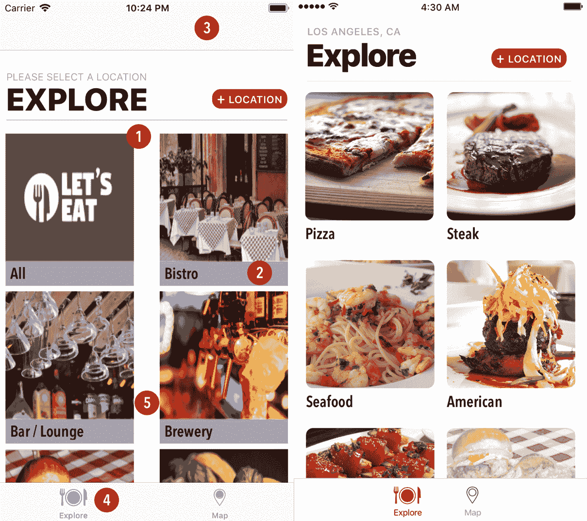

我们需要修复几个问题：

+   实现圆角

+   移除灰色背景

+   导航栏出现

+   修复间距

+   标签栏颜色

我们将修复所有这些问题，但现在我们将重点关注前四个。在我们的照片滤镜列表中，我们有圆角。我们可以在这里实现这些功能。通过按*cmd* + *Shift* + *o*打开`ExploreCell.swift`文件，输入`ExploreCell`并按*Enter*。添加以下扩展：

```
private extension ExploreCell {
    func roundedCorners() {
        imgExplore.layer.cornerRadius = 9
        imgExplore.layer.masksToBounds = true
    }
}
```

在`-layoutSubviews`方法内部添加一个`roundedCorners()`调用。

现在我们已经修复了第一个问题，让我们通过移除背景颜色来修复第二个问题。打开`Explore.storyboard`，在大纲视图中选择`exploreCell`。在实用工具面板下，在属性检查器中将背景从“Let'sEat 暗灰色”更新为“白色”。第三个问题，即导航栏显示，也很容易修复。通过按*cmd* + *Shift* + *o*打开`ExploreViewController.swift`文件，输入`ExploreViewController`并按*Enter*。在`viewDidLoad()`之后添加以下方法：

```
override func viewWillAppear(_ animated: Bool) {
    super.viewWillAppear(animated)
    navigationController?.setNavigationBarHidden(true, animated: false)
}
```

这就是我们需要做的；现在，每次我们进入这个视图时，我们都会始终隐藏顶部的导航栏。最后，让我们更新我们的应用程序，使我们的标签栏按钮颜色正确。我们需要在我们的颜色集中添加一个新的颜色，称为“Let'sEat 红色”，并将十六进制值设置为`D0021B`。现在，打开文件底部的`AppDelegate.swift`文件，在最后一个花括号之后添加以下内容：

```
private extension AppDelegate {
    func initialize() {
        setupDefaultColors()
    }

    func setupDefaultColors() {
        guard let red = UIColor(named: "Lets Eat Red") else { return }
        UITabBar.appearance().tintColor = red
        UITabBar.appearance().barTintColor = .white
        UITabBarItem.appearance()
            .setTitleTextAttributes(
                [NSAttributedStringKey.foregroundColor: UIColor.black],
                for: UIControlState.normal)
        UITabBarItem.appearance()
            .setTitleTextAttributes(
                [NSAttributedStringKey.foregroundColor: red],
                for: UIControlState.selected)
        UINavigationBar.appearance().tintColor = red
        UINavigationBar.appearance().barTintColor = .white
        UITabBar.appearance().isTranslucent = false
        UINavigationBar.appearance().isTranslucent = false
    }
}
```

现在，在`-application:didFinishLaunchingWithOptions:`内部添加`initialize()`方法调用。通过点击播放按钮（或使用⌘ + *R*）构建并运行项目。

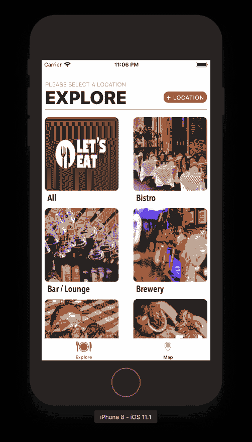

你现在应该看到我们已经完成了前四项。接下来，让我们解决间距问题。在我们这样做之前，让我们首先将设备切换到任何 iPad（我通常使用 iPad Air 2，但你可以选择你喜欢的任何一款）。然后通过点击播放按钮（或使用 ⌘ + *R*）构建并运行项目。你会看到目前还不是太糟糕，但每个设备的间距都不同。现在，我们已经设置了只适用于一个设备的值。然而，我们需要它在所有设备上都有效。

让我们从 `Explore.storyboard` 开始。首先，我们需要更新一些探索单元格的自动布局。目前，我们为图片设置了一个宽度，需要更加动态：

1.  打开 `Explore.storyboard`。

1.  选择 `exploreCell` 内的图片。

1.  然后，在工具面板中，选择属性检查器，并将视图部分下的内容模式更改为 Aspect Fill。这将防止图片看起来被拉伸，同时仍然填充整个区域。

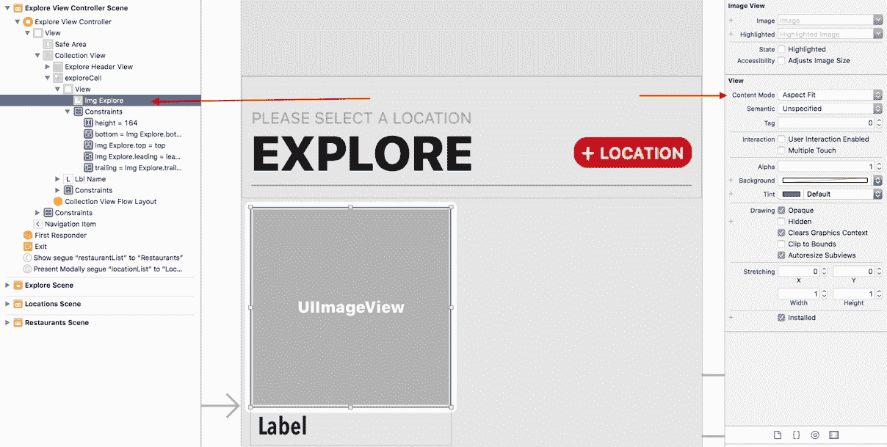

这些是我们需要对我们探索单元格进行的唯一更新。接下来，我们将创建一个文件，它将告诉我们使用的是哪种设备。然后我们可以根据设备设置不同的外观。让我们创建这个文件：

1.  右键点击 `Misc` 文件夹并选择新建文件。

1.  在选择新文件模板的屏幕上，顶部选择 iOS，然后选择 Swift 文件。然后点击下一步。

1.  将此文件命名为 `Device` 并点击创建。

首先，我们需要将我们的 `import` 语句从 `import Foundation` 更改为 `import UIKit`。

接下来，将以下内容添加到 `import` 语句中：

```
struct Device {
   static var currentDevice: UIDevice {
         struct Singleton {
               static let device = UIDevice.current
         }
         return Singleton.device
   }

   static var isPhone: Bool {
         return currentDevice.userInterfaceIdiom == .phone
   }

   static var isPad: Bool {
         return currentDevice.userInterfaceIdiom == .pad
   }
}
```

我们的新结构将告诉我们我们是在 iPad 上还是 iPhone 上。拥有这样的文件是好的，因为它允许你避免重写相同的代码。为了实现这段代码，我们只需要添加一段像下面的代码片段：

```
if Device.isPhone{ }
```

这个语句将使我们的代码更易于阅读；如果我们需要添加任何针对特定设备的检查，我们可以在同一个文件中完成。将代码像这样放入文件中的另一个很好的用途是，当你构建下一个应用程序时，你只需将此文件添加到你的项目中即可继续。 

接下来，让我们打开 `ExploreViewController.swift` 文件并对我们的代码进行一些更新。我们需要创建一个变量，我们将用它来设置我们想要的项目之间的间距。在我们的 `viewDidLoad()` 方法之前添加以下内容：

```
fileprivate let minItemSpacing: CGFloat = 7
```

现在，我们需要创建一个函数来设置一些默认的 Collection View 值。同时，我们还需要创建一个 `initialize()` 方法来调用我们的设置函数。在 `initialize()` 方法内部添加以下方法调用：

```
setupCollectionView()
```

接下来，在 `initialize()` 方法之后，在 `private` 扩展内部添加以下内容：

```
func setupCollectionView() {
    let flow = UICollectionViewFlowLayout()
    flow.sectionInset = UIEdgeInsets(top: 7, left: 7, bottom: 7, right: 7)
    flow.minimumInteritemSpacing = 0
    flow.minimumLineSpacing = 7
    collectionView?.collectionViewLayout = flow
}
```

这个方法将确保我们周围有七像素的间距。我们最后需要创建一个扩展，它将允许我们以编程方式处理所有的间距。在最后一个花括号之后添加以下扩展：

```
extension ExploreViewController: UICollectionViewDelegateFlowLayout {
    func collectionView(_ collectionView: UICollectionView, layout collectionViewLayout: UICollectionViewLayout, sizeForItemAt indexPath: IndexPath) -> CGSize {
        if Device.isPad {
            let factor = traitCollection.horizontalSizeClass == .compact ? 2:3
            let screenRect = collectionView.frame.size.width
            let screenWidth = screenRect - (CGFloat(minItemSpacing) * CGFloat(factor + 1))
            let cellWidth = screenWidth / CGFloat(factor)

            return CGSize(width: cellWidth, height: 195)
        }
        else {
            let screenRect = collectionView.frame.size.width
            let screenWidth = screenRect - 21
            let cellWidth = screenWidth / 2.0

            return CGSize(width: cellWidth, height: 195)
        }
    }

    func collectionView(_ collectionView: UICollectionView, layout collectionViewLayout: UICollectionViewLayout, referenceSizeForHeaderInSection section: Int) -> CGSize {

        return CGSize(width: self.collectionView.frame.width, height: 100)
    }
}
```

添加`UICollectionViewDelegateFlowLayout`允许我们在代码中更新我们的单元格项大小。让我们讨论我们刚刚添加的扩展的每个部分。`-collectionView:layout:sizeForItemAtIndexPath:`方法用于设置单元格的大小。在这个方法内部，我们使用我们创建的结构。我们检查我们是否在使用 iPad 或 iPhone。

在`if...else`语句的 if 部分，我们检查屏幕是否紧凑。如果是紧凑的屏幕，我们想要两列网格；否则，我们想要三列网格。我们还在屏幕宽度上均匀分布我们的项目。

在`if...else`语句的 else 部分，我们只是在所有手机上设置了一个两列的网格。我们获取屏幕宽度，然后减去`21`，然后将结果除以`2`以均匀分布单元格。

如果你运行项目，一切看起来都很好。

如果你尝试通过使用⌘ + 右箭头或⌘ + 左箭头旋转设备，还有一件事是损坏的。然后，你会看到我们的布局间距没有更新。

为了修复这个问题，我们需要进行一个额外的更新。在`-shouldPerformSegueWithIdentifier:sender:`之后添加以下内容：

```
override func viewWillTransition(to size: CGSize, with coordinator: UIViewControllerTransitionCoordinator) {
   collectionView.reloadData()
}
```

现在，通过点击播放按钮（或使用⌘ + *R*）再次构建并运行你的项目，并旋转设备。你会看到我们的布局间距现在已更新。

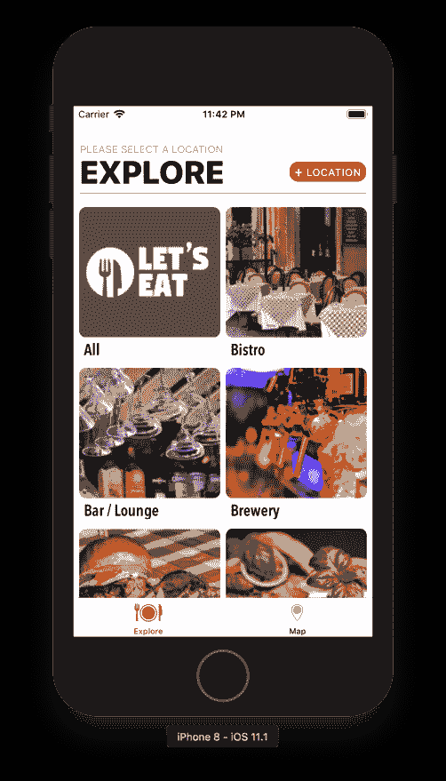

探索现在完成；让我们转到我们的位置列表。

# 位置列表

让我们比较我们的当前位置列表与设计：

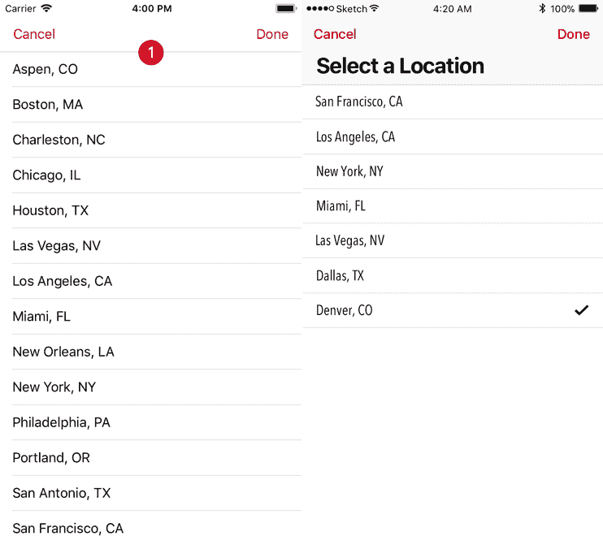

我们有一件事需要修复：大标题。这是一个简单的更新。打开`LocationViewController`，在`initialize()`方法中，在`manager.fetch()`之后添加以下代码：

```
title = "Select a Location"
navigationController?.navigationBar.prefersLargeTitles = true
```

在此代码中，我们设置了一个新的 iOS 11 特性`prefersLargeTitles`为`true`。如果你构建并运行，你会看到我们现在做得很好。接下来，我们将注意力转向餐厅列表页面，并更详细地讨论 iPad 和多重任务。

# 餐厅列表

对于我们的餐厅列表页面，我们希望在所有手机上显示一列网格，在所有 iPad 上显示两列网格。如果你通过点击播放按钮（或使用⌘ + *R*）构建并运行项目，并转到餐厅列表页面，你会看到我们需要修复 iPad 上的间距以正确显示两列：

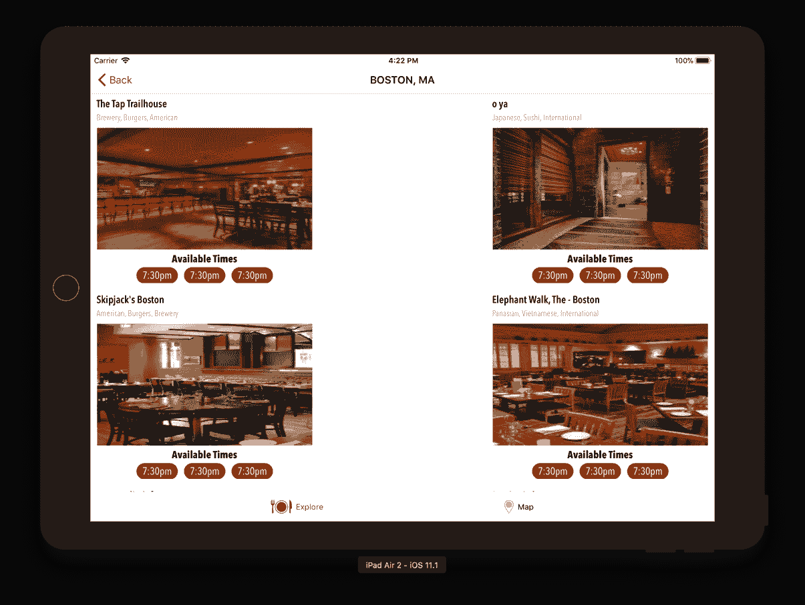

让我们看看如何修复这个问题。记住，我们仍然想在 iPhone 上保持一列，在 iPad 上保持网格。打开`RestaurantViewController.swift`文件，在`private`扩展内部的`createData()`方法上方添加以下内容：

```
func initialize() {
   createData()
   setupTitle()
   if Device.isPad{ setupCollectionView() }
}
```

你会在`setupCollectionView()`方法中得到一个错误。现在先忽略它，因为我们很快就会修复它。这个方法检查设备是否是 iPad；如果是，它将调用`setupCollectionView()`方法。接下来，在刚刚添加的`initialize()`方法下添加以下内容：

```
func setupCollectionView() {
   let flow = UICollectionViewFlowLayout()
   flow.sectionInset = UIEdgeInsets(top: 7, left: 7, bottom: 7, right: 7)
   flow.minimumInteritemSpacing = 0
   flow.minimumLineSpacing = 7
   collectionView?.collectionViewLayout = flow
}
```

前面的方法与我们之前在故事板中添加的关于项目之间间距的相同内容，但在这里我们是通过编程实现的。

我们还有几件事情需要解决。首先，我们将以编程方式计算屏幕大小。就像我们在`ExploreViewController`中做的那样，我们将创建一个新的扩展来处理我们的集合视图布局。在`viewDidLoad()`方法之前添加以下内容：

```
fileprivate let minItemSpacing: CGFloat = 7
```

现在，在文件的底部（在最后一个花括号之后）添加以下内容：

```
extension RestaurantViewController: UICollectionViewDelegateFlowLayout {

    func collectionView(_ collectionView: UICollectionView, layout collectionViewLayout: UICollectionViewLayout, sizeForItemAt indexPath: IndexPath) -> CGSize {
        if Device.isPad {
            let factor = traitCollection.horizontalSizeClass == .compact ? 2:3
            let screenRect = collectionView.frame.size.width
            let screenWidth = screenRect - (CGFloat(minItemSpacing) * CGFloat(factor + 1))
            let cellWidth = screenWidth / CGFloat(factor)
            return CGSize(width: cellWidth, height: 325)
        }

        else {
            let screenRect = collectionView.frame.size.width
            let screenWidth = screenRect - 21
            let cellWidth = screenWidth / 2.0

            return CGSize(width: cellWidth, height: 325)
        }
    }
}
```

这段代码表明，如果设备是 iPhone，将显示一列网格；如果是 iPad，将显示两列网格。现在，我们需要更新我们的`viewDidAppear()`方法。目前，我们正在调用`createData()`和`setupTitle()`这两个方法。我们需要移除这两个调用，并仅调用`initialize()`。完成之后，`viewDidAppear()`应该看起来像以下这样：

```
override func viewDidAppear(_ animated: Bool) {
    super.viewDidAppear(animated)
    initialize()
}
```

通过点击播放按钮（或使用⌘ + *R*）来构建并运行 iPad 项目：

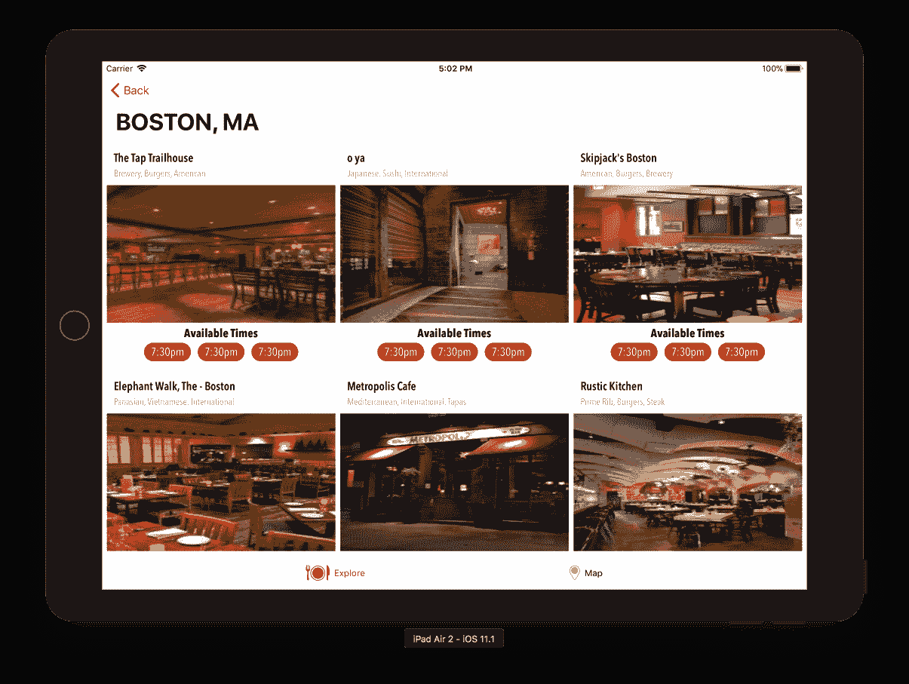

两列网格是我们为餐厅列表页面在 iPad 上想要的，但我们需要验证我们没有更改 iPhone 上的单列网格。将设备切换回任何 iPhone 模拟器，并在构建和重新运行项目后，你应该仍然在 iPhone 上看到一列网格。

在 iPad 设置上仍然存在问题。切换回 iPad，通过点击播放按钮（或使用⌘ + *R*）重新构建并运行项目。当项目启动时，按⌘ + 右箭头键旋转设备。然后，返回到你的餐厅列表页面。第一个问题是，如果你旋转设备，单元格间距不会更新。另一个问题是，如果你进行多任务处理，你的应用会调整大小，你需要确保布局相应地调整。

要查看多任务，从底部向上滑动：

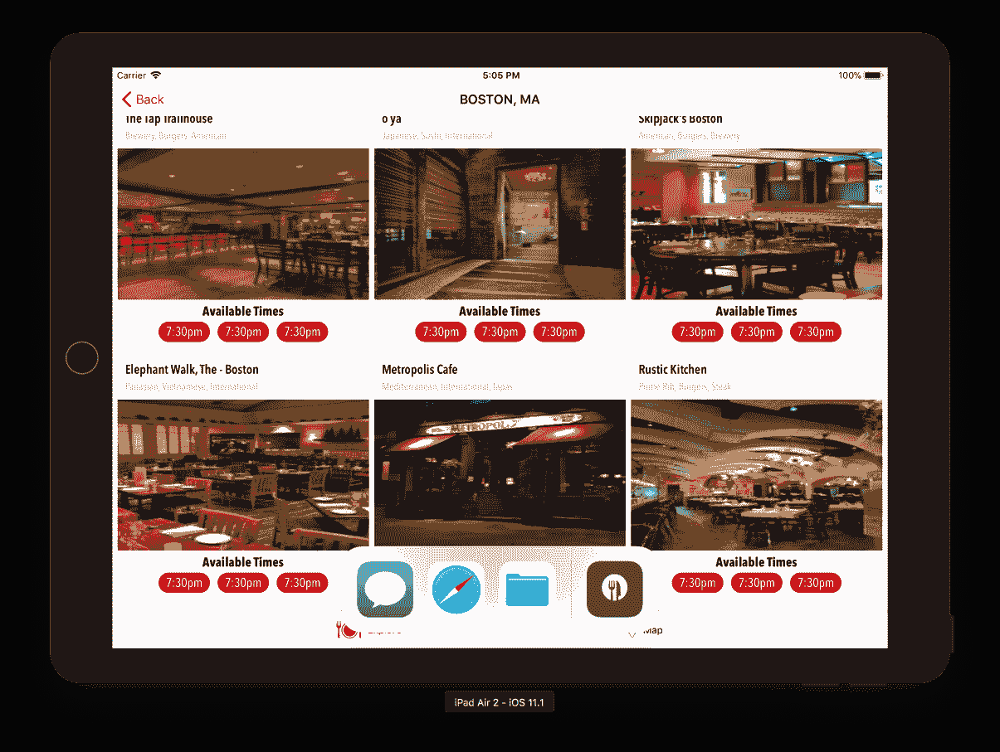

然后，将应用拖到我们的应用右侧：

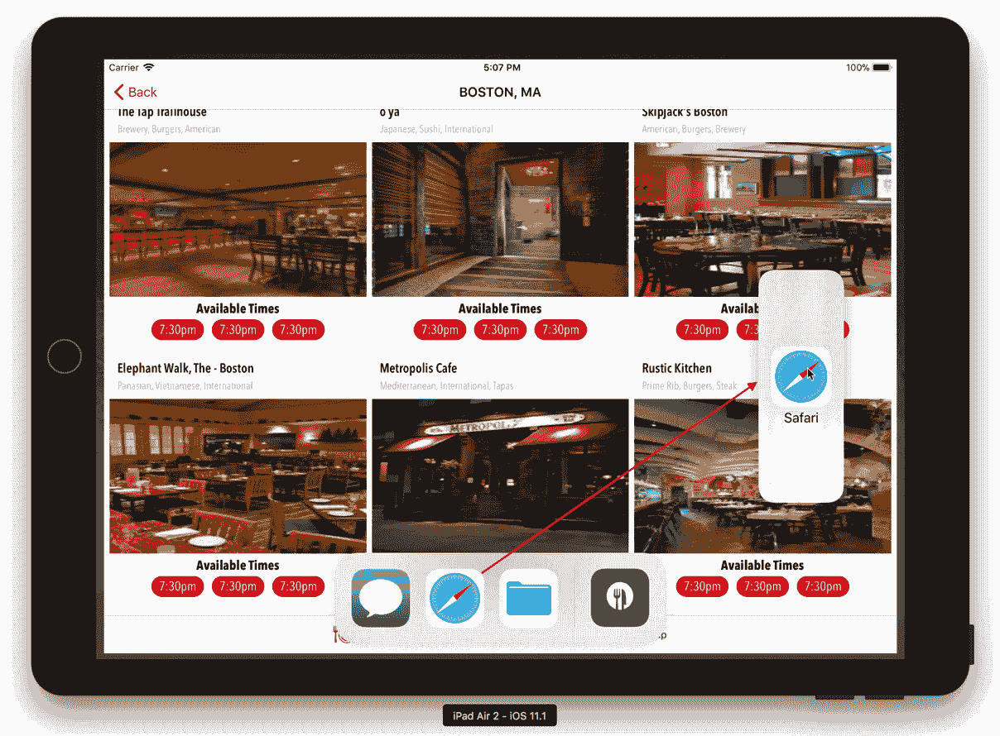

抓住位于新屏幕中间的小标签，并将其向左拉。这个标签将分割屏幕与我们的应用，并允许你控制更多（或更少，如果你将其移回右侧）的屏幕：

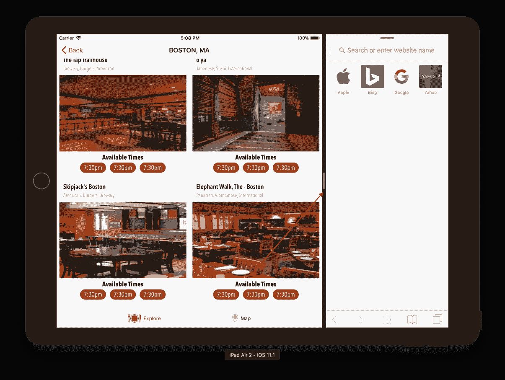

当你将标签页向左移动时，你会注意到*Let's Eat*应用不会调整单元格大小，而是只显示一列。无论屏幕分割到我们的应用和其他应用之间时可用的大小如何，我们的应用都需要进行调整。

解决这些问题是一个非常简单的修复。在你的`RestaurantViewController`中，在最后一个花括号之前添加以下代码：

```
override func viewWillTransition(to size: CGSize, with coordinator
: UIViewControllerTransitionCoordinator) {   collectionView.reloadData()
}
```

通过点击播放按钮（或使用⌘ + *R*）构建并重新运行项目，并使用⌘ + 右箭头旋转设备。现在你会看到，每次你更新餐厅列表页面的尺寸时，网格也会相应更新以适应新尺寸。现在让我们转到餐厅详情页面。

# 更新餐厅详情

如果你点击餐厅并转到餐厅详情页面，你应该会看到以下截图类似的内容：

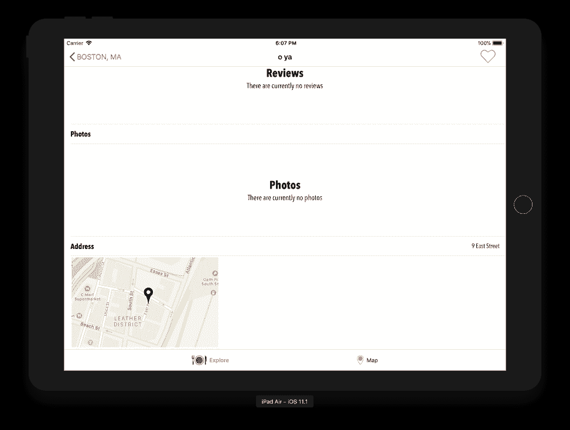

在此屏幕上我们无需做太多修改。如果你向下滚动到底部，你会看到我们创建的图像尺寸不正确。我们需要更新这一点，以便根据设备，渲染适当大小的图像。我们还需要更新自动布局。你可以尝试其他设备尺寸；你应该在所有屏幕上看到相同的显示。

1.  打开`RestaurantDetail.storyboard`。

1.  使用大纲视图选择图像映射，并在属性检查器中更新内容模式为“填充比例”。

如果你现在构建并运行，你会看到我们的地图现在填充了区域，但我们的图像被拉伸了。我们可以保留这一点，但如果这是要提交的，根据设备调整图像大小将是一种更好的处理方式。我们已经完成了清理工作，使我们的应用程序准备好在 iPad 上使用。你现在应该能够看到集合视图有多么强大，以及它们如何用很少的代码实现自定义外观。

# 摘要

你现在有一个在所有设备上都能完美运行的应用程序。你可以看到使用集合视图如何让你的应用程序在不同设备上具有一些多样性，而且代码很少。随着你对这个越来越熟悉，你会找到其他方法让你的应用程序在各个设备上看起来独特。

我们现在可以提交应用程序，它将完全正常，但为什么不利用一些你可以实现的功能呢？

在下一章中，我们将通过为我们的应用程序创建一个 iMessage 应用程序来实现这一点。
