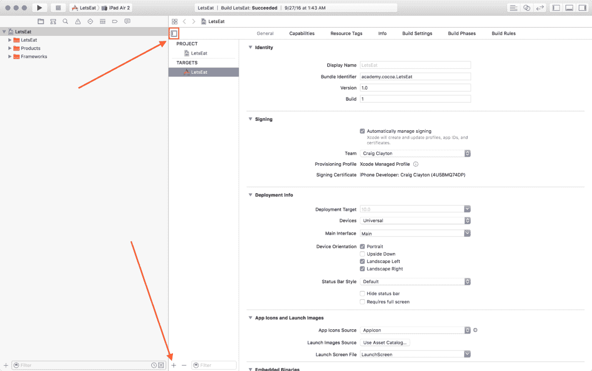

# 第二十四章：iMessages

文本消息最初只是简单的文本和特殊字符创建的面部表情。随着智能手机变得越来越普遍，文本消息也是如此。现在，消息是绝大多数人重要的沟通方式。人们发现回复短信比接听电话更容易。

当苹果公司宣布 iMessage 应用和贴纸时，它将消息提升到了另一个层次。在此之前，我们已经有贴纸了，但现在我们有一个完全集成的系统。iMessages 不仅允许你发送贴纸来表达比文字更有效的情感或情绪；你现在可以使用消息发送游戏的分数，甚至可以通过短信玩游戏。

在本章中，我们将创建一个 *iMessage* 应用。这个应用将允许用户查找餐厅并向其他人发送预订。我们将构建我们的 UI，使其看起来与我们的手机相似。为了创建 *iMessages* 应用，我们需要向我们的应用添加一个消息扩展。

在本章中，我们将涵盖以下内容：

+   构建自定义消息应用 UI

+   创建框架

+   在多个目标之间共享代码

+   学习如何将预订发送给其他人

# 理解 iMessages

从 UI 开始总是我首选的构建应用的方式，因为你可以感受到你需要编写什么代码。我们将实现一个单屏，它将是一个餐厅列表（通过点击用户编写消息旁边的贴纸图标访问）。用户可以选择他或她有预订的餐厅，并通过消息发送给另一个人。一旦那个人收到消息，那个人将能够点击预订并查看所有详细信息。

在消息视图控制器中，有两种展示风格：紧凑和展开。


苹果建议你为每种风格都使用两个不同的视图控制器。然而，由于我们的屏幕很简单，我们将只使用一个。但是，记住，如果你想进行更复杂的布局，你应该使用两个控制器。

# 创建我们的扩展

让我们通过现在开始工作在 UI 上来开始吧：

1.  在导航器面板中，选择项目导航器，然后选择你的项目：


1.  在标准编辑器中，找到目标区域，然后是目标区域底部的 +（加号按钮）。（如果你的目标区域没有显示，请点击以下截图左侧蓝色高亮的通用图标）：



1.  点击 +（加号按钮），然后选择 iMessage 扩展：


1.  点击“下一步”，然后你会看到以下屏幕：


1.  将产品名称设置为 `MessageApp` 并点击“完成”。

1.  在你点击“完成”后，你会收到以下消息。选择“激活”：


通过激活`MessageApp`方案，我们将能够从模拟器中构建和运行 iMessages。现在，您可以选择运行我们的*Let's Eat*应用或我们的*iMessages*应用。

# 更新我们的资产

接下来，我们需要添加对我们*iMessages*应用必要的资产：

1.  在导航面板中的`MessageApp`文件夹中，选择`Assets.xcassets`文件夹。

1.  点击*删除*按钮，然后选择出现的屏幕上的“移动到垃圾箱”。

1.  然后，打开从 Packt 网站下载的项目`assets`文件夹（[`www.packtpub.com/`](https://www.packtpub.com/))。

1.  打开`Chapter24`，将`Assets.xcassets`文件夹拖动到导航面板中的`MessageApp`文件夹内。不要在 Xcode 中这样做；您需要像本书开头一样在 Finder 中打开它。

1.  在出现的选项屏幕上，确保“如需复制项目”和“创建组”两个选项都被选中，然后选择完成。

如果您打开`Assets.xcassets`文件夹，您将看到现在有一个图标和两个其他图像资产，我们将需要为我们的*iMessages*应用使用它们。

# 实现我们的消息 UI

接下来，我们需要设置我们的 UI。在我们的*iMessages*应用中，我们将有一个单屏；在这个屏幕上，我们将使用集合视图显示餐厅列表。当你点击餐厅时，你将能够向其他人发送预订消息。让我们开始吧：

1.  在您的`MessageApp`项目中，选择您的`MainInterface.storyboard`。您将看到一个带有显示“Hello World”标签的单个故事板：


1.  通过在概要视图中选择它并按*删除*键来删除显示“Hello World”的标签。

1.  选择消息视图控制器，然后在实用工具面板中选择属性检查器，并将模拟度量下的状态栏从推断更改为无。

1.  接下来，在实用工具面板的对象库中，输入`collectionview`进行筛选，然后将集合视图拖动到场景中的视图控制器中。

1.  选择集合视图，选择固定图标，并输入以下值：

+   +   所有“添加新约束”下的值都设置为`0`

    +   不勾选“约束到边距”。

    +   更新框架设置为“新约束的项目”

1.  点击添加 4 个约束。

1.  接下来，仍然选择集合视图，在实用工具面板中打开属性检查器。

1.  在属性检查器中选择背景，并在颜色滑块选项卡下，在下拉菜单中的 RGB 滑块下将十六进制颜色设置为`ECECEC`。

1.  接下来，选择集合视图单元格，然后是实用工具面板中的大小检查器。

1.  将大小从默认更改为自定义。然后，将宽度设置为`320`，高度设置为`78`。

1.  然后，在属性检查器中选择背景，并在颜色滑块选项卡下，在下拉菜单中的 RGB 滑块下将十六进制颜色设置为`FFFFF`。

1.  在实用工具面板中，选择媒体库并在过滤器字段中输入 restaurant-list。

1.  将 `restaurant-list-img` 拖动到你的 Collection View 单元格中。

1.  在图片仍然被选中的情况下，转到实用工具面板中的大小检查器并更新以下值：

+   +   X：`8`

    +   Y：`9`

    +   宽度：`60`

    +   高度：`` `60` ``

1.  接下来，在实用工具面板中选择对象库并在过滤器中输入 `label`。

1.  将三个标签拖动到单元格中。

1.  选择第一个标签，然后在大小检查器中更新以下值：

+   +   X：`76`

    +   Y：`10`

    +   宽度：`236`

    +   高度：`21`

1.  接下来，选择属性检查器；将字体更新为粗体并验证字体大小为 `17`。

1.  选择第二个标签，然后在大小检查器中更新以下值：

+   +   X：`76`

    +   Y：`35`

    +   宽度：`236`

    +   高度：`16`

1.  然后，在属性检查器中，将字体更新为 Light，大小 `14`。

1.  选择最后一个标签，然后在大小检查器中更新以下值：

+   +   X：`76`

    +   Y：`53`

    +   宽度：`236`

    +   高度：`16`

1.  最后，在属性检查器中，将字体更新为 Light，大小 `14`。

当你完成时，你的单元格应该看起来像以下这样：


现在我们已经放置了项目，我们需要为我们的元素添加一些自动布局。

# 将自动布局添加到我们的单元格

让我们看看如何将自动布局添加到我们的单元格中。

自动布局将允许我们的布局适应所有设备。让我们开始：

1.  选择单元格中的图片，然后选择固定图标。在“添加新约束”部分下输入以下值：

    +   顶部：`9`

    +   左侧：`8`

    +   限制到边距：未勾选

    +   宽度：`60`（已勾选）

    +   高度：`60`（已勾选）

1.  点击添加 4 个约束。

1.  接下来，选择单元格中的第一个标签，然后选择固定图标。在“添加新约束”部分下输入以下值：

    +   顶部：`10`

    +   左侧：`8`

    +   右侧：`8`

    +   限制到边距：未勾选

    +   高度：`21`（已勾选）

1.  点击添加 4 个约束。

1.  接下来，选择单元格中的第二个标签，然后选择固定图标。在“添加新约束”部分下输入以下值：

    +   顶部：`4`

    +   左侧：`8`

    +   右侧：`8`

    +   限制到边距：未勾选

    +   高度：`16`（已勾选）

1.  点击添加 4 个约束。

1.  最后，选择单元格中的最后一个标签，然后选择固定图标。在“添加新约束”部分下输入以下值：

    +   顶部：`2`

    +   左侧：`8`

    +   右侧：`8`

    +   限制到边距：未勾选

    +   高度：`16`（已勾选）

1.  点击添加 4 个约束。

我们已经完成了 UI 的设置，现在可以继续将数据放入我们的应用并显示它。

# 创建一个框架

由于我们所有的数据代码都是在我们的 iOS 应用中创建的，因此重写我们的 *iMessages* 应用代码没有意义。我们可以创建一个框架，以便在 iOS 和 iMessage 应用之间共享数据。

使用框架以及应用扩展允许我们将共享代码放在一个地方。这意味着代码更少，效率更高，因为当你需要做出更改时，你不需要在多个地方更新代码。让我们开始创建我们的框架：

1.  在“导航器”面板中，选择“项目导航器”，然后再次选择我们之前所做的项目。

1.  找到“TARGETS”区域，并点击该区域底部的+按钮。

1.  在“iOS”选项卡下，滚动到最底部，选择“框架和库”，然后选择“Cocoa Touch 框架”，接着点击“下一步”：


1.  在“产品名称”下，键入`LetsEatDataKit`，然后点击“完成”。

您现在应该在导航器面板的“产品”文件夹中看到以下文件夹和文件：


1.  选择`LetsEatDataKit`目标，并确保在“部署信息”下，您的部署目标设置为`10.0`，并且已勾选“应用扩展”：


1.  在导航器面板中，右键单击`LetsEatDataKit`文件夹，创建一个名为`Restaurant`的新组。

1.  现在，从您的`Let's Eat`应用中，请将`Restaurant`文件夹内的`Controllers`文件夹中的`RestaurantDataManager.swift`文件拖动到新创建的`LetsEatDataKit`文件夹的`Restaurant`文件夹中。

1.  接下来，将`Map`文件夹内的`RestaurantItem.swift`文件从`Controllers`文件夹拖动到`LetsEatDataKit`文件夹的`Restaurant`文件夹中。

1.  然后，将`Restaurant`文件夹内的`Controllers`文件夹中的`RestaurantAPIManager.swift`文件拖动到`LetsEatDataKit`文件夹的`Restaurant`文件夹中。

1.  最后，将整个`JSON`文件夹从`Misc`文件夹中拖动到`LetsEatDataKit`文件夹的`Restaurant`文件夹中。

当您完成这些步骤后，您应该在`LetsEatDataKit`文件夹中有以下文件：


1.  接下来，打开我们刚刚移动的`API Manager`文件夹，并在`json`子文件夹中，选择`Aspen.json`文件。

1.  在“实用工具”面板中，选择“文件检查器”，并定位到“目标成员”部分：


1.  要将此文件的目标设置为不仅是我们自己的应用，还要设置为我们的`MessageApp`和`LetsEatDataKit`，请在“目标成员”下勾选`MessageApp`和`LetsEatDataKit`。因此，我们的`Let's Eat`应用、`MessageApp`和`LetsEatDataKit`都应该被勾选：


1.  接下来，选择`json`文件夹内的每个 JSON 文件，并更新所有文件，使它们的目标都指向`LetsEat`、`MessageApp`和`LetsEatDataKit`。

1.  然后，选择`LetsEatDataKit`文件夹的`Restaurant`文件夹内的剩余三个文件，并更新它们，使每个文件的目标仅指向`LetsEatDataKit`。

1.  现在，将您的目标从`MessageApp`更改为`LetsEatDataKit`：


按⌘ + *B*来构建应用而不运行它，只要您更新了所有文件的目标，您的构建应该会成功。

现在，切换回`Let's Eat`应用，并按⌘ + *B*。您会注意到一些错误。这些错误是预期的，并且很容易修复：

1.  在`MapViewController.swift`文件中，在文件顶部添加以下`import`：

```
import LetsEatDataKit
```

1.  然后，继续更新你的`RestaurantItem`。我们需要将此文件设置为`public`，以便其他文件可以看到它。因此，在`RestaurantItem.swift`文件中，更新我们的结构声明，在类之前添加`public`，使其看起来如下所示：

```
public class RestaurantItem
```

同样，我们需要将每个变量都设置为`public`，因为我们正在将它们全部用作数据。通过在它们前面添加关键字`public`来更新所有变量，然后保存文件。当你将`public`添加到注释变量时，你会看到另一个错误发生。这个错误是因为我们试图在类不是`public`的情况下将变量设置为`public`。

1.  因此，打开你的`RestaurantItem`类，并更新类、以下每个变量和`init()`方法，以`public`访问权限：

```
public class RestaurantItem: NSObject, MKAnnotation
public var name: String?
public var cuisines:[String] = []
public var latitude: Double?
public var longitude:Double?
public var address:String?
public var postalCode:String?
public var state:String?
public var imageURL:String?
public var restaurantID:Int?
public var title: String?
public var subtitle: String?
public var coordinate: CLLocationCoordinate2D
public enum CodingKeys: String, CodingKey
```

1.  保存文件，现在你的`RestaurantItem`错误将消失。

我们还需要进行更多的细微更新。我们需要将我们的`RestaurantAPIDataManager`和`RestaurantDataManager`都设置为`public`。让我们从`RestaurantAPIDataManager`开始，并更新以下`struct`和`method`以`public`访问权限：

```
public struct RestaurantAPIManager
public static func loadJSON(file name:String) -> [[String:AnyObject]]
```

接下来，更新`RestaurantDataManager`中的类和以下每个方法，以`public`访问权限：

```
public class RestaurantDataManager
public func fetch(by location:String, withFilter:String="All",  completionHandler:() -> Swift.Void)
public func numberOfItems() -> Int
public func restaurantItem(at index:IndexPath) -> RestaurantItem
```

我们还需要将我们的`RestaurantDataManager`类的`init()`方法设置为`public`；因此，在类声明之后，添加以下内容：

```
public init() {}
```

有这个`init()`方法允许我们编写以下内容：

```
let manager = RestaurantDataManager()
```

当我们将其设置为`public`时，我们在拥有`RestaurantDataManager()`时调用`init()`方法。

现在，将目标改为`LetsEatDataKit`，并通过按⌘ + *B*重新构建。此时，构建应该再次成功。如果你打开`MapViewController`文件，你应该会看到这个文件中的所有错误都已修复。

然而，我们仍然需要在`MapDataManager`、`LocationViewController`、`RestaurantViewController`、`ExploreViewController`、`RestaurantDetailViewController`和`MessagesViewController`内部解决更多的错误。因此，在每个这些三个文件中，在`import`语句部分的最顶部添加以下内容：

```
import LetsEatDataKit
```

然后，再次按⌘ + *B*，在这些三个文件或整个项目中不应该有任何错误。

现在，如果你将目标切换回我们的*Let's Eat*应用，并通过按播放按钮（或使用⌘ + *R*）构建和运行它，你应该会看到一切按预期工作。我们现在可以开始在*iMessages*应用中使用这些数据。

# 连接我们的消息单元格

现在我们已经整理好了文件，我们可以开始连接一切。之前，我们创建了我们的单元格，现在我们需要创建一个用于连接的单元格类：

1.  在导航器面板中右键单击`MessageApp`文件夹，并选择新建文件。

1.  在选择新文件模板的屏幕中，在顶部选择 iOS，然后选择 Cocoa Touch Class。然后，点击下一步。

1.  你现在将看到一个选项屏幕。请在新文件部分添加以下内容：

+   +   类：`RestaurantMessageCell`

    +   子类：`UICollectionViewCell`

    +   还创建 XIB：未选中

    +   语言：`Swift`

1.  点击下一步，然后创建。

1.  在新文件中，在类声明内部添加以下内容：

```
@IBOutlet var lblTitle:UILabel!
@IBOutlet var lblCity:UILabel!
@IBOutlet var lblCuisine:UILabel!
```

1.  保存文件，然后在导航器面板中的`MessageApp`文件夹中打开`MainInterface.storyboard`。

1.  在大纲视图中，选择集合视图单元格。

1.  然后，在实用工具面板中选择身份检查器；在类下拉菜单中的自定义类下，选择 RestaurantMessageCell 并按*Enter*。

1.  接下来，切换到实用工具面板中的属性检查器，并将标识符更新为`restaurantCell`，然后按*Enter*。

1.  现在，切换到实用工具面板中的连接检查器，并从每个列表旁边的空圆圈拖动到屏幕上显示的相应`UILabel`。

```
lblTitle
lblCity
lblCuisine
```


我们现在已经设置了单元格。让我们继续让我们的*iMessages*应用程序工作。

# 展示餐厅

我们将展示一个餐厅列表，就像在我们的应用程序中一样，但我们不会做整个界面。大部分代码对你来说都很熟悉，因为我们之前已经做过。

1.  在导航器面板中打开`MessagesViewController.swift`文件，并在类声明内部添加以下代码：

```
@IBOutlet var collectionView: UICollectionView!
let manager = RestaurantDataManager()
var selectedRestaurant:RestaurantItem?
```

1.  接下来，我们需要设置我们的集合视图默认值。在`private`扩展内部添加以下方法：

```
private extension MessagesViewController {
    func setupCollectionView() {
        let flow = UICollectionViewFlowLayout()
        flow.sectionInset = UIEdgeInsets(top: 7, left: 7, bottom: 7, right: 7)
        flow.minimumInteritemSpacing = 0
        flow.minimumLineSpacing = 7
        collectionView.collectionViewLayout = flow
        collectionView.delegate = self
        collectionView.dataSource = self
    }
}
```

添加前面的代码后，你将看到错误。现在忽略它们，因为我们很快就会修复它们。现在，我们将创建一个`initialize()`方法，该方法将设置集合视图并获取我们的数据。

1.  在`createMessage()`方法之上添加以下方法：

```
func initialize() {
   setupCollectionView()
   manager.fetch(by: "Chicago", completionHandler: {
         self.collectionView.reloadData()
   })
}
```

由于这个标签页不包含位置列表，我们只需手动传递一个城市。这里我们使用芝加哥，但你也可以将其更改为你选择的任何城市。

1.  接下来，在`viewDidLoad()`方法内部调用`initialize()`方法，这样你的`viewDidLoad()`方法现在看起来如下：

```
override func viewDidLoad() {
    super.viewDidLoad()
    initialize()
}
```

1.  然后，让我们为我们的集合视图代理和数据源创建另一个扩展。在`MessagesViewController.swift`文件中的最后一个花括号之后，添加以下`extension`声明：

```
extension MessagesViewController:UICollectionViewDelegate, UICollectionViewDataSource, UICollectionViewDelegateFlowLayout {
}
```

1.  现在我们已经设置了`extension`，让我们添加所有需要的函数来使我们的集合视图显示数据。请在我们的`extension`内部添加以下内容（这将消除我们之前的错误）：

```
func numberOfSections(in collectionView: UICollectionView) -> Int {
    return 1
}

func collectionView(_ collectionView: UICollectionView, numberOfItemsInSection section: Int) -> Int {
    return manager.numberOfItems()
}

func collectionView(_ collectionView: UICollectionView, cellForItemAt indexPath: IndexPath) -> UICollectionViewCell {
```

```
    let cell = collectionView.dequeueReusableCell(withReuseIdentifier: "restaurantCell", for: indexPath) as! RestaurantMessageCell
    let item = manager.restaurantItem(at: indexPath)
    if let name = item.name { cell.lblTitle.text = name }
    if let address = item.address { cell.lblCity.text = address }
    if let cuisine = item.subtitle { cell.lblCuisine.text = cuisine }
    return cell
}

func collectionView(_ collectionView: UICollectionView, layout collectionViewLayout: UICollectionViewLayout, sizeForItemAt indexPath: IndexPath) -> CGSize {
    let cellWidth = self.collectionView.frame.size.width - 14
    return CGSize(width: cellWidth, height: 78)
}

func collectionView(_ collectionView: UICollectionView, didSelectItemAt indexPath: IndexPath) {
    selectedRestaurant = manager.restaurantItem(at: indexPath)
    guard let restaurant = selectedRestaurant else { return }
    createMessage(with: restaurant)
}
```

你应该非常熟悉我们刚刚添加的内容。我们正在设置我们的集合视图数据源，并确保我们的单元格间距为 14 像素（每边 7 像素）。

最后，在我们构建应用程序之前，我们需要在故事板中连接我们的集合视图：

1.  在导航器面板中的`MessageApp`文件夹中打开`MainInterface.storyboard`。

1.  选择消息视图控制器，然后是实用工具面板中的连接检查器。

1.  然后，在输出端口下，点击并从 `collectionView` 旁边的空圆圈拖动到我们的场景中的集合视图中。

让我们更改目标 *消息应用* 并通过点击播放按钮（或使用 ⌘ + *R*）构建和运行我们的 *iMessages* 应用。点击贴纸按钮后，您的应用应该看起来类似于以下图片：


点击箭头（由红色方框突出显示）将屏幕从紧凑模式扩展到扩展模式，然后再回到紧凑模式。现在我们已经显示了我们的餐厅，我们需要能够将餐厅预订发送给其他人。让我们接下来添加这个功能。

# iMessage 崩溃

如果您刚刚尝试启动应用并且它崩溃了，这里有一个修复方法。

1.  在模拟器中，打开 `消息` 应用。

1.  选择凯特。

1.  然后点击带有三个点的图标：


1.  然后点击编辑：


1.  点击 `MessageApp` 的开关：


1.  点击完成。

构建并重新运行应用，应该就没有问题了。这个错误是苹果的 bug，执行这些步骤是修复此问题的唯一方法。让我们继续发送预订。

# 发送预订

我们需要设置我们的集合视图，以便当用户点击一个单元格时，它将预订添加到 iMessages 中的对话中。在创建要发送的消息时，我们可以设置以下内容：


我们将使用除尾注和尾副标题之外的所有内容。

1.  在导航面板中打开 `MessageApp` 文件夹中的 `MessagesViewController`。

1.  然后，在我们的主类声明中，在 `private` 扩展中的 `setupCollectionView()` 方法之后添加以下方法：

```
func createMessage(with restaurant:RestaurantItem) {
   if let conversation = activeConversation {
         let layout = MSMessageTemplateLayout()
         layout.image = UIImage(named: "restaurant-detail")
         layout.caption = "Table for 7, tonight at 10:00 PM"
         layout.imageTitle = restaurant.name
         layout.imageSubtitle = restaurant.cuisine
         let message = MSMessage()
         message.layout = layout
         message.url = URL(string: "emptyURL")
         conversation.insert(message, completionHandler: { (error: Error?)  in
               if error != nil {
                     print("there was an error \(error)")
               }
               else {
                     self.requestPresentationStyle(.compact)
               }
         })
   }
}
```

在这个方法中，我们正在设置一个 `MSMessage`。我们首先检查是否有活跃的对话。如果是 `true`，我们然后设置我们的布局。在这里，我们只是使用我们的资源中的一个图片来创建一个图片背景（我们也可以使用视频，例如）。我们还设置了标题 `Table for 7, tonight at 10:00PM`。这允许接收者看到预订的所有相关信息。接下来，我们将餐厅名称作为图片标题，将餐厅的菜系作为图片副标题。然后，我们创建一个 `MSMessage` 实例，传递我们创建的布局，并给它一个 URL（在我们的情况下，只是一个空字符串，因为我们没有 URL）。最后，我们将消息插入到对话中。我们需要确保，当我们想要发送消息时，我们处于紧凑模式；否则，用户会认为应用不起作用。

最后，我们只需要添加调用我们的 `createMessage()` 方法的代码。在我们的扩展中添加以下方法，但在最后一个花括号之前：

```
func collectionView(_ collectionView: UICollectionView, didSelectItemAt indexPath: IndexPath) {
   selectedRestaurant = manager.restaurantItem(at: indexPath)
   guard let restaurant = selectedRestaurant else { return }
   createMessage(with: restaurant)
}
```

这里，我们正在检查用户是否点击了一个单元格；然后，我们获取 `selectedRestaurant` 并将其传递给我们的 `createMessage()` 方法。

通过点击播放按钮（或使用 ⌘ + *R*）来构建和运行项目。选择一家餐厅，你将现在在消息区域看到一条包含所选餐厅的消息：


你可以看到，只需一点努力，你就可以给你的应用添加一个不错的 *iMessages* 应用。

# 摘要

在本章中，我们探讨了如何将 *iMessages* 应用添加到我们的应用中。我们还创建了一个框架，允许我们在两个应用中使用数据而无需重复代码。我们研究了创建 `MSMessage` 所涉及的内容，以及我们如何将 `MSMessageTemplateLayout` 传递给 `MSMessage`。我们现在知道，在发送消息时，我们也可以发送嵌入的视频以及图片。此外，我们现在可以通过 *iMessages* 应用发送带有预订相关数据的预订。

在下一章中，我们将回到我们的 *Let's Eat* 应用，我们将学习如何在我们的应用中处理通知。
