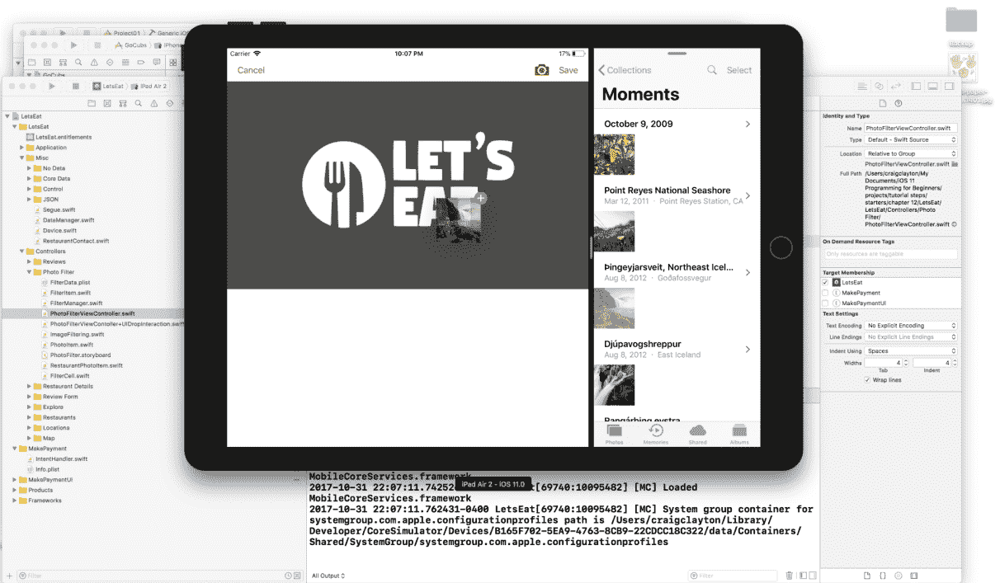
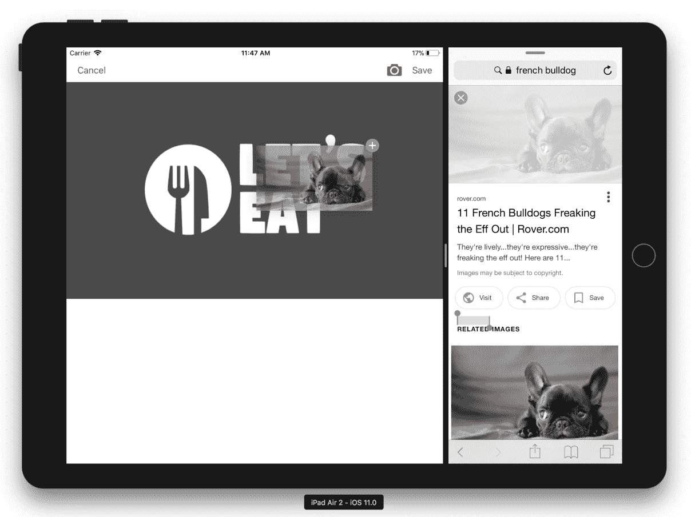
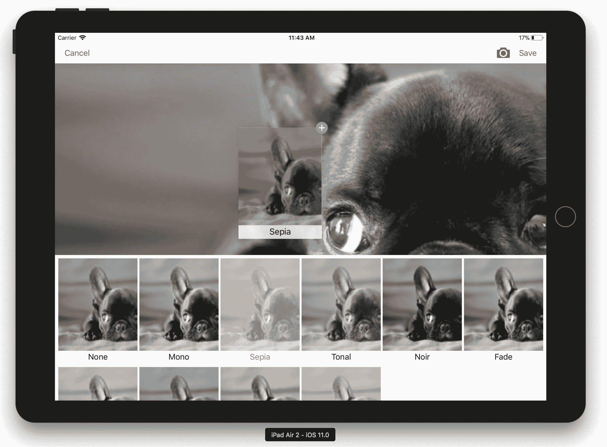
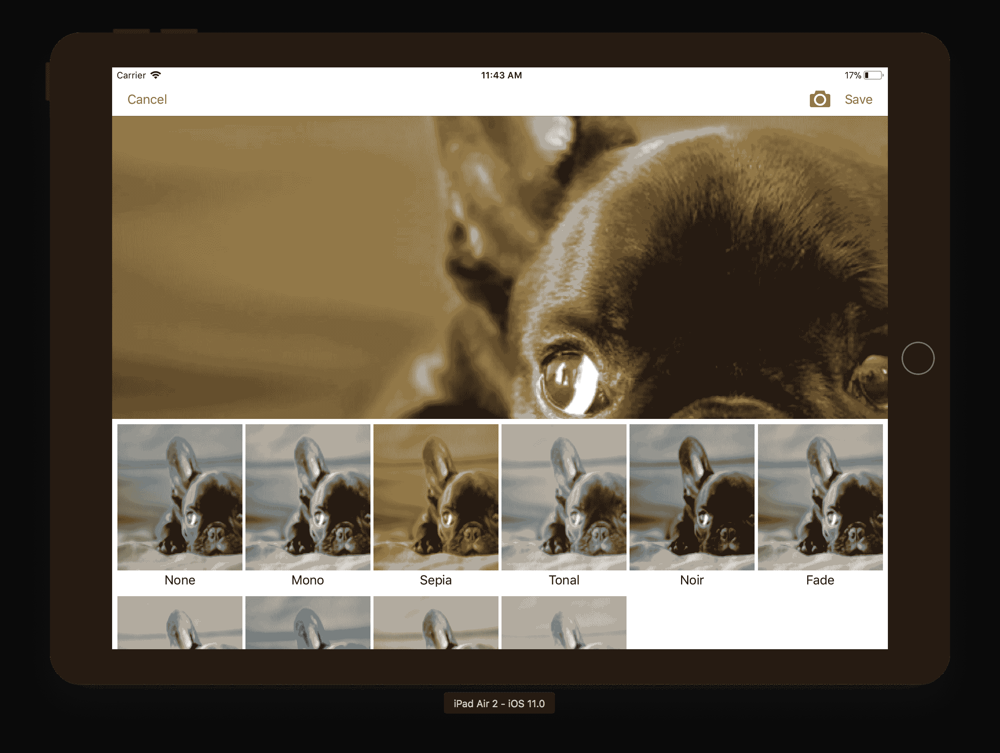

# 第二十七章：拖拽和放置

*拖拽和放置* 在 2017 年 6 月的 WWDC 上被引入，并以不同的方式吸引了我。我喜欢使用我的 iPad，我觉得这会使做事变得更简单。随着我有时间使用 iOS 11，我认为我的假设是正确的，我迫不及待地想看到更多应用拥有这个功能。

我们将通过让用户拖拽我们在筛选滚动器中使用的筛选项来将拖拽和放置添加到我们的 iPad 应用中。我们还将接受来自 *照片* 应用的拖拽和放置。用户将能够从 *照片* 应用中拖拽并将其放置到 iPad 上的滚动器中。

我们将在本章中介绍以下内容：

+   如何从集合视图中拖拽

+   如何创建自定义拖拽元素

+   如何接受来自 *照片* 应用程序的拖拽和放置

本章中有大量的代码，主要是因为我们将要做很多事情。我们首先想要做的是从 *照片* 应用程序或任何包含照片的应用中拖拽照片并将其放置到我们的筛选视图区域。拖拽和放置是使用选择器控件添加照片的替代方法。

# 接受来自其他应用的拖拽

让我们开始接受来自其他应用的拖拽和放置操作：

+   从 *照片* 应用程序添加拖拽和放置到我们的照片视图中

+   从筛选滚动器添加拖拽和放置

我们首先想要做的是启用我们的筛选项的拖拽功能。我们需要为我们的 `PhotoFilterViewController` 创建一个新的扩展，命名为 `PhotoFilterViewController+UIDropInteraction`。在这个文件中，添加以下内容：

```
import UIKit
import Foundation
extension PhotoFilterViewController: UIDropInteractionDelegate {
}
```

接下来，我们需要添加所有接受放置交互的方法。我们将编写此代码以允许在应用内以及应用外进行放置。当你开始拖拽一个元素时，Apple 称这为 **会话**。我们将需要关注两个主要会话，本地会话或非本地会话。本地会话意味着我们在我们的应用内拖拽，如果不是这种情况，那么会话来自不同的应用。让我们通过首先添加第一个方法 `-dropInteraction:canHandleSession` 来处理这个问题：

```
func dropInteraction(_ interaction: UIDropInteraction, canHandle session: UIDropSession) -> Bool {
    if session.localDragSession == nil {
        return session.canLoadObjects(ofClass: UIImage.self)
    }
    else { return false }
}
```

此方法是我们允许项被拖拽到我们的应用中以及本地拖拽对象的地方。对于本地拖拽，我们接受一个图像，目前我们不接受应用内的放置。我们稍后会添加这个功能。让我们添加下一个我们需要实现的方法 `-dropInteraction:sessionDidUpdate:`：

```
func dropInteraction(_ interaction: UIDropInteraction, sessionDidUpdate session: UIDropSession) -> UIDropProposal {
    let operation: UIDropOperation
    if session.localDragSession == nil {
        operation = .copy
    }
    else { operation = .copy }
    return UIDropProposal(operation: operation)

}
```

此方法告诉我们的应用我们希望如何消费数据，在两种情况下我们都会复制它。让我们添加下一个方法 `-dropInteraction:performDrop`：

```
func dropInteraction(_ interaction: UIDropInteraction, performDrop session: UIDropSession) {
    if session.localDragSession == nil {
        for dragItem in session.items {
            loadImage(dragItem.itemProvider)
        }
    }
}
```

当用户从屏幕上抬起手指时，会调用此方法。这表示用户有放置项的意图，这是您请求拖拽项数据的机会。我们简单地获取这些数据并在我们的图像视图中显示它；我们还创建了筛选缩略图。这种行为与在选择器中选择图像的行为相同。最后，我们将我们的最后一个方法添加到 `-dropInteraction:previewForDroppingItem:withDefault`：

```
func dropInteraction(_ interaction: UIDropInteraction, previewForDropping item: UIDragItem, withDefault defaultPreview: UITargetedDragPreview) -> UITargetedDragPreview? {
    if item.localObject == nil {
        return nil
    } else {
        let target = UIDragPreviewTarget(container: view, center: imgExample.center)
        return defaultPreview.retargetedPreview(with: target)
    }
}
```

这个最后的方法是为拖入我们视图中的图像创建一个预览。当你完成时，你的扩展应该看起来像以下这样：

```
import UIKit
import Foundation

extension PhotoFilterViewController: UIDropInteractionDelegate {

    func dropInteraction(_ interaction: UIDropInteraction, canHandle session: UIDropSession) -> Bool {
        if session.localDragSession == nil {
            return session.canLoadObjects(ofClass: UIImage.self)        }
        else { return false }
    }

    func dropInteraction(_ interaction: UIDropInteraction, sessionDidUpdate session: UIDropSession) -> UIDropProposal {
        let operation: UIDropOperation
        if session.localDragSession == nil {
            operation = .copy
        }
        else { operation = .copy  }
        return UIDropProposal(operation: operation)
    }

    func dropInteraction(_ interaction: UIDropInteraction, performDrop session: UIDropSession) {
        if session.localDragSession == nil {
            for dragItem in session.items {
                loadImage(dragItem.itemProvider)
            }
        }
    }

    func dropInteraction(_ interaction: UIDropInteraction, previewForDropping item: UIDragItem, withDefault defaultPreview: UITargetedDragPreview) -> UITargetedDragPreview? {
        if item.localObject == nil {
            return nil
        } else {
            let target = UIDragPreviewTarget(container: view, center: imgExample.center)
            return defaultPreview.retargetedPreview(with: target)
        }
    }
}
```

现在我们已经完成了从其他应用程序拖动的实现。现在，我们的拖放实现已经添加，我们只需要确保我们的视图将接受它。在 `PhotoFilterViewController` 中添加以下方法：

```
func addDropInteraction() {
    view.addInteraction(UIDropInteraction(delegate: self))
}
```

在这里，我们正在实现我们在扩展中刚刚创建的 `UIDropInteraction`。我们只需要调用这个方法。将 `addDropInteraction()` 添加到 `initialize()` 中。现在它应该看起来像以下这样：

```
func initialize() {
    requestAccess()
    addDropInteraction()
    setupCollectionView()
    checkDevice()
}
```

同时启动 iPad Air 模拟器和打开 *Photos* 应用程序。你现在可以直接从 *Photos* 应用程序拖动到我们的过滤器区域：



我们也可以从 Safari 拖动到我们的过滤器区域：



我们可以将我们的过滤器项拖放到我们的照片中，但在此阶段它目前没有任何作用。我们需要做一些工作来使其实现。

# 拖放过滤器项

为了使我们的过滤器项可拖动，我们有很多事情要做。首先，我们需要更新我们的 `PhotoFilterViewController+UIDropInteraction` 文件。打开它，查找 `-dropInteraction:canHandleSession:` 方法，并将 `else` 语句从 `false` 更新为以下内容：

```
else { return session.canLoadObjects(ofClass: FilterItem.self) }
```

当你完成时，你的方法将看起来像以下这样：

```
func dropInteraction(_ interaction: UIDropInteraction, canHandle session: UIDropSession) -> Bool {
    if session.localDragSession == nil {
        return session.canLoadObjects(ofClass: UIImage.self)
    }
    else { return session.canLoadObjects(ofClass: FilterItem.self) }
}
```

目前可以忽略这个错误。在这里，我们只是确保我们的 `FilterItem` 类可以被拖放和加载。现在，我们需要在这个类中做一项更新：找到 `-dropInteraction:performDrop:` 方法。在 `if` 语句之后，我们将添加一个 `else`：

```
else {
    for dragItem in session.items {
        let itemProvider = dragItem.itemProvider
        itemProvider.loadObject(ofClass: FilterItem.self) { (object, error) in
            if let error = error {
                print(error.localizedDescription)
            } else {
                DispatchQueue.main.async {
                    if let item = object as? FilterItem {
                        print("filter \(item.filter)")
                        self.filterSelected(item: item)
                    }
                }
            }
        }
    }
}
```

我们刚刚添加的 `else` 语句将遍历每个正在拖动的项目并加载对象。我们的应用程序不支持多个可拖动项目，但这就是处理的地方。当我们添加此代码时，我们将会遇到另一个错误，但我们很快就会解决这个问题。`-dropInteraction:performDrop:` 方法现在应该看起来像以下这样：

```
func dropInteraction(_ interaction: UIDropInteraction, performDrop session: UIDropSession) {
    if session.localDragSession == nil {
        for dragItem in session.items {
            loadImage(dragItem.itemProvider)
        }
    }
    else {
        for dragItem in session.items {
            let itemProvider = dragItem.itemProvider
            itemProvider.loadObject(ofClass: FilterItem.self) { (object, error) in
                if let error = error {
                    print(error.localizedDescription)
                } else {
                    DispatchQueue.main.async {
                        if let item = object as? FilterItem {
                            print("filter \(item.filter)")
                            self.filterSelected(item: item)
                        }
                    }
                }
            }
        }
    }
}
```

我们仍然有两个错误需要修复；让我们通过打开 `Photo Filter` 文件夹中的 `FilterItem` 类来修复这些错误。在 `init` 方法下添加以下内容：

```
required init(itemProviderData data: Data, typeIdentifier: String) throws {
    if typeIdentifier == FilterItem.typeIdentifier {
        let item = try? JSONDecoder().decode(FilterItem.self, from: data)
        if let i = item {
            self.name = i.name
            self.filter = i.filter
            return
        }
    }

    throw ParseError.decodingFailed("Invalid type!")

}
```

我们正在添加一个 `init` 方法，这是我们需要用于拖动的。这允许我们在应用程序中传递数据。我们有两个错误，因为我们需要符合 `NSItemProviderReading` 和 `NSItemProviderWriting`。我们将它们都写在同一个文件中。在 `Photo Filter` 文件夹中，创建一个新的 `Swift` 类并添加第一个扩展：

```
import UIKit
import MobileCoreServices

extension FilterItem: NSItemProviderReading {

    static var readableTypeIdentifiersForItemProvider: [String] {
        return [FilterItem.typeIdentifier]
    }

    static func object(withItemProviderData data: Data, 
      typeIdentifier: String) throws -> Self {
        switch typeIdentifier {
        case FilterItem.typeIdentifier:
            return try! JSONDecoder().decode(self, from: data)
        default:
            throw ParseError.decodingFailed("Invalid type!")
        }
    }
}
```

此扩展是为了符合 `NSItemProviderReading`，它解码我们传递的数据，以便我们可以读取它。接下来，通过在我们的第一个扩展之后添加以下内容来添加最后一个扩展：

```
extension FilterItem: NSItemProviderWriting {
    static var writableTypeIdentifiersForItemProvider: [String] {
        return [FilterItem.typeIdentifier, kUTTypeUTF8PlainText as String]
    }

    func loadData(withTypeIdentifier typeIdentifier: String, forItemProviderCompletionHandler completionHandler: @escaping (Data?, Error?) -> Void) -> Progress? {
        let data: Data?
        switch typeIdentifier {
        case FilterItem.typeIdentifier:
            data = try? JSONEncoder().encode(self)
        case kUTTypeUTF8PlainText as NSString as String:
            data = "\(name), \(filter)".data(using: .utf8)
        default:
            data = nil
        }
        completionHandler(data, nil)
        return nil
    }
}
```

此扩展允许我们通过首先确保类类型为 `FilterItem` 来将我们的数据导出为二进制表示。我们几乎完成了所有需要的设置。我们现在需要确保我们的 Collection View 允许拖动。目前，如果您尝试拖动，则不会发生任何操作。打开 `PhotoFilterViewController` 并在 `setupCollectionView()` 方法的底部添加以下内容：

```
collectionView?.dragDelegate = self
```

添加此行将显示错误，但您可以忽略它，因为我们即将修复它。完成之后，整个方法将看起来如下所示：

```
func setupCollectionView() {
    let layout = UICollectionViewFlowLayout()
    if Device.isPhone { layout.scrollDirection = .horizontal }
    else { layout.scrollDirection = .vertical }
    layout.sectionInset = UIEdgeInsets(top: 7, left: 7, bottom: 7, right: 7)
    layout.minimumInteritemSpacing = 0
    layout.minimumLineSpacing = 7

    collectionView?.collectionViewLayout = layout
    collectionView?.dragDelegate = self
}
```

这现在允许从 Collection View 拖动，但我们现在需要实现拖动代理代码才能使其全部工作。在我们创建另一个扩展之前，让我们在`Photo Filter`文件夹内创建一个新的文件夹，并将其命名为`Extensions`。然后将我们之前创建的两个文件，`Filter-Item+NSItemProvider` 和 `PhotoFilterViewController+UIDropInteraction`，拖入`Extensions`文件夹。

现在我们已经正确设置了该文件夹，请点击`Photo Filter`文件夹内的`Extensions`文件夹，并创建一个名为`PhotoFilterViewController+ UICollectionViewDrag`的新文件。创建文件后，添加以下内容：

```
import UIKit

extension PhotoFilterViewController: UICollectionViewDragDelegate {
    func collectionView(_ collectionView: UICollectionView, itemsForBeginning session: UIDragSession, at indexPath: IndexPath) -> [UIDragItem] {
        let itemProvider = NSItemProvider(object: data[indexPath.item])
        let dragItem = UIDragItem(itemProvider: itemProvider)
        return [dragItem]
    }
}
```

此方法 `-collectionView:itemsForBeginningDragSession:atIndexPath:` 我们正在获取拖动时索引路径处的项目数据。如果数组为空，则拖动会话将不会开始。我们已经完成；如果您构建并运行项目，现在您将能够将过滤器项目拖放到选定的照片上。让我们从我们的过滤器列表中拖动：



释放过滤器项目后，您应该看到以下内容：



# 摘要

在本章中，我们探讨了如何接受来自其他应用程序的拖放操作。我们还探讨了如何使用 Collection View 创建自定义拖动项。现在，我们可以使用 iPad 上的拖放操作来快速添加照片，而 iPhone 则仅使用 *Camera Roll*。目前，拖放操作仅支持 iPad，但希望苹果公司很快会将其开放给我们用于我们的应用程序。在下一章中，我们将探讨如何使用 Siri 为朋友的晚餐请求付款。
