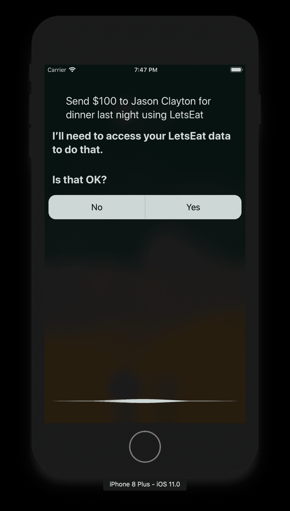

# SiriKit

去年，苹果公司宣布新增了一个名为**SiriKit**的新框架。这个框架允许开发者在其应用中利用 Siri 的功能。在过去的一年里，SiriKit 已被开发者逐渐采用。今年，苹果公司增加了更多受支持的领域。在本章中，我们将为我们的应用添加 SiriKit 支持。

我最初的目标是让 Siri 设置餐厅预订，但不幸的是，苹果软件要求使用 MapKit 来完成此功能。使用 MapKit 并不是真正的问题。真正的问题是，你必须与苹果公司合作才能设置此功能，因此我们无法进行餐厅预订。如果你正在开发需要此功能的应用，那么你需要联系苹果支持。在本章中，我们将设置框架，以便我们能够请求从某人那里获得资金。SiriKit 的设置相当类似，所以一旦你熟悉了这一章，你应该不会在处理其他章节时遇到问题。请注意，要使用 SiriKit，您必须在设备上拥有开发者许可证才能运行 Siri。

本章我们将涵盖以下主题：

+   理解 SiriKit

+   与 SiriKit 扩展一起工作

+   与 SiriKit UI 扩展一起工作

# 理解 SiriKit

在开始之前，我们首先需要了解 Siri 如何与我们的应用交互。通过以下图表查看其工作原理：


用户通过与 Siri 交互来提出请求。Siri 接收请求并查找请求应用的意图。如果找不到应用，Siri 会通知你。如果找到了应用，但无法完成请求，Siri 会通知你请求目前无法完成。如果意图可以被应用处理，它将信息传递给您的应用。您的应用使用这些信息完成所需操作，并向 Siri 报告。如果应用需要更多信息，它会让 Siri 知道需要请求什么，直到应用拥有所需的所有信息或用户取消请求。

# 支持的意图

截至 iOS 11，苹果目前支持以下意图：

+   VoIP 通话（发起通话并搜索用户的通话记录）

+   消息（发送消息并搜索用户的收件箱消息）

+   支付（在用户之间发送支付或支付账单）

+   列表和笔记（创建和管理笔记和待办事项列表项）

+   视觉代码（使用快速响应（QR）码传达联系和支付信息）

+   照片（搜索并显示照片）

+   锻炼（开始、结束和管理健身计划）

+   预订行程（预订行程并报告其状态）

+   车辆命令（管理车辆门锁和获取车辆状态）

+   CarPlay（与车辆的 CarPlay 系统交互）

+   餐厅预订（借助*地图*应用创建和管理餐厅预订）

此 API 要求你在应用可以使用它之前与 Apple Maps 一起工作。有关如何开始的信息，请访问[`mapsconnect.apple.com`](http://mapsconnect.apple.com)。

我们将使用支付意图，它允许我们在用户之间发送支付或支付账单。完成之后，我们可以说 *嘿 Siri！昨晚用 LetsEat 给 Jason Clayton 发送 100 美元*。我们可以将其连接到任何银行系统，但目前我们已经为这个设置了所有其他内容。让我们开始吧。

# 启用 Siri 功能

我们需要做的第一件事是启用 SiriKit：

1.  在 Xcode 中，转到你的应用并选择 `LetsEat` 目标：


1.  接下来，点击功能选项卡：


1.  然后，按一下开关以激活 Siri：


1.  完成后你应该会看到以下内容：


1.  你需要一个有效的开发者账户来完成以下步骤。否则，在尝试跟随时你会看到错误。接下来，我们需要为我们的项目添加一个新的目标。在 TARGETS 部分的底部，你应该会看到一个 + 按钮。


1.  点击 + 按钮，你会看到以下屏幕：


1.  接下来，在 iOS 选项卡下选择 Intents 扩展。然后点击下一步。

1.  在出现的选项屏幕中，有一些字段需要填写或选择。将以下内容添加到选项屏幕，然后点击下一步：

+   +   产品名称：`MakePayment`

    +   团队：必须有团队

    +   组织名称：你的名字/公司名称

    +   组织标识符：你的域名反向顺序

    +   语言：`Swift`

    +   包含 UI 扩展：勾选

    +   项目：`LetsEat`

    +   嵌入到应用程序：`LetsEat`

这就是它应该看起来的样子：


当你完成时，我们将向我们的项目添加两个扩展：`MakePayment` 和 `MakePaymentUI` 扩展。这些扩展就是我们用来将 SiriKit 添加到项目的工具。我们需要编辑这些扩展，以便它们可以接受支付：

1.  打开 `MakePayment` 文件夹并选择 `Info.plist` 文件。

1.  展开所有 `NSExtension` 下的展开箭头。当它们全部展开时，你应该会看到以下内容：


目前，应用已设置为使用发送消息意图，而我们想使用发送支付意图。

1.  在 `IntentsSupported` 下删除 `项目 1 (INSearchForMessagesIntent)` 和 `项目 2 (INSetMessageAttributeIntent)`：


1.  现在，对于 `项目 0`，将 `INSendMessageIntent` 更改为 `INSendPaymentIntent`。

1.  在 `IntentsRestrictedWhileLocked` 下，通过点击 + 按钮添加 `INSendPaymentIntent`：


1.  完成后，你应该会看到以下内容：


1.  接下来，在 `MakePaymentUI` 文件夹下打开 `Info.plist`，展开 `NSExtension` 下的所有展开箭头，并将 `IntentsSupported` 下的 `INSendMessageIntent` 更改为 `INSendPaymentIntent`：


我们已经完成了我们的 plist 设置。每次我们访问某个东西时，我们总是必须请求权限，就像我们之前访问用户照片时做的那样。在`*LetsEat*`应用的`Info.plist`文件中，我们需要更新我们的 plist，让用户知道我们需要访问 Siri 以及我们的原因。添加`NSSiriUsageDescription`键。

对于键值，输入任何你想要的作为用户看到的提示。在以下示例中，值被设置为`This app uses Siri to send payments.`：


现在，在你的`AppDelete`中，在`import UIKit`之后添加以下导入：

```
import Intents 
```

接下来，在`setupDefaultColors()`之后，添加以下方法：

```
func requestSiriPermissions() { 
    INPreferences.requestSiriAuthorization({ (status) in 
        print(status) 
    }) 
} 
```

然后，在你的`-application:didFinishLaunchingWithOptions:`方法下的`setupDefaultColors()`中，添加`requestSiriPermissions()`。

添加这个会请求用户允许使用 Siri。现在，如果你打算在真实的应用中使用这个功能，我会说你应该添加一个设置部分，用户可以使用开关来打开或关闭 Siri。你不想强迫用户使用某物而不真正给他们一个理由。在 iOS 中，一旦你请求用户权限并且他们拒绝，他们必须进入设置部分。如果你想请求，那么最好有一个另一个对话框来请求权限；如果他们同意，那么运行请求，如果用户说不同意，那么你什么都不做。这样你就不必强迫你的用户去手机设置中打开这个功能。现在我们已经设置了权限，我们需要创建可以发送金钱的用户。

# 创建用户

当使用 SiriKit 时，它需要一个`INPerson`对象。`INPerson`对象被 Siri 用来发送用户东西——在我们的例子中是金钱。让我们创建这个新文件：

1.  右键点击`Misc`文件夹并选择新建文件。

1.  在选择新文件模板的屏幕上，顶部选择 iOS，然后选择 Swift。然后，点击下一步。

1.  将文件保存为`RestaurantContact`。

1.  点击创建。

1.  将以下代码添加到该文件中：

```
import Intents 

struct RestaurantContact { 
    let name: String 
    let email: String 

    static func allContacts() -> [RestaurantContact] { 
        return [ 
            RestaurantContact(name: "Jason Clayton", email: "jason@mac.com"), 
            RestaurantContact(name: "Joshua Clayton", email: "joshua@texas.edu"), 
            RestaurantContact(name: "Teena Harris", email: "teena@gmail.com") 
        ] 
    } 

    func inPerson() -> INPerson { 
        let formatter = PersonNameComponentsFormatter() 
        let handle = INPersonHandle(value: email, type: .emailAddress) 

        if let components = formatter.personNameComponents(from: name) { 
            return INPerson(personHandle: handle, nameComponents: components, displayName: components.familyName, image: nil, contactIdentifier: nil, customIdentifier: nil) 
        } 
        else { 
            return INPerson(personHandle: handle, nameComponents: nil, displayName: nil, image: nil, contactIdentifier: nil, customIdentifier: nil) 
        } 
    } 
} 
```

在这里，我们正在创建可以用来请求 Siri 发送金钱的联系人。我们已设置三个人来接受金钱：Jason Clayton，Joshua Clayton 和 Teena Harris。当我们用 Siri 请求时，这些是它查找的名称，以查看该人是否存在。如果名字不在列表中，Siri 会告诉你名字未找到。这个列表可以有任何你想要的名称，所以如果你想将名字改为其他东西，现在可以这么做。只需确保当我们到达请求部分时，你也要在那里更改名字。我们的`inPerson()`方法只是将格式化为 SiriKit 需要读取的对象的格式。我们现在需要添加在发送支付意图被调用时运行的代码。

# 更新我们的意图处理器

我们现在可以最终添加在发送支付意图被调用时运行的代码。打开`MakePayment`扩展文件夹中的`IntentHandler`类。在删除此文件中除导入意图行之外的所有内容后，添加以下代码：

```
class IntentHandler: INExtension{ 

    override func handler(for intent: INIntent) -> Any { 
        if intent is INSendPaymentIntent { 
            return SendMoneyIntent() 
        } 

        return self 
    } 
} 
```

在这里，我们正在创建一个自定义意图处理器。当意图是发送支付时，我们想要运行我们的`SendMoneyIntent`类。我们需要创建这个文件。在`IntentHandler`类相同的文件路径下，添加以下内容：

```
class SendMoneyIntent: NSObject, INSendPaymentIntentHandling { 
    func handle(intent: INSendPaymentIntent, completion: @escaping (INSendPaymentIntentResponse) -> Void) { 
        if let person = intent.payee, let amount = intent.currencyAmount { 
            //handle payment 
            print("person (person.displayName) - amount (String(describing: amount.amount))") 

            completion(INSendPaymentIntentResponse(code: .success, userActivity: nil)) 
        } 
        else { 
            completion(INSendPaymentIntentResponse(code: .failure, userActivity: nil)) 
        } 
    } 

} 
```

在这个类中，`handle()`方法响应`SendPaymentIntent`。我们正在打印人员的显示名称和金额。我们在这里传递一个完成块，但在实际生产代码中，你会运行你正在使用的任何 API 来验证支付。在`handle()`方法下`SendMoney`意图内添加以下内容：

```
func resolvePayee(for intent: INSendPaymentIntent, with completion: @escaping (INPersonResolutionResult) -> Void) { 

    if let payee = intent.payee { 
        let contacts:[RestaurantContact] = RestaurantContact.allContacts() 
        var result: INPersonResolutionResult? 
        var matchedContacts:[RestaurantContact] = [] 

        for contact in contacts { 
            print("checking existing: (contact.name) - (payee.displayName)") 

            if contact.name == payee.displayName { 
                matchedContacts.append(contact) 
            } 

            switch matchedContacts.count { 
                case 0: 
                    print("no matches") 
                    result = .unsupported() 
                case 1: 
                    print("best matched") 
                    let person = matchedContacts[0].inPerson() 
                    result = INPersonResolutionResult.success(with: person) 
                default: 
                    print("more than one match") 
                    let person:[INPerson] = matchedContacts.map { contact in 
                        return contact.inPerson() 
                    } 
                    result = INPersonResolutionResult.disambiguation(with: person) 
            } 
        } 

        completion(result!) 
    } else { 

        completion(INPersonResolutionResult.needsValue()) 
    } 
} 
```

在这个方法中，我们正在获取收款人信息并检查是否在联系人中找到匹配的人。我们正在遍历联系人并寻找匹配项。完成后，我们将结果返回给 Siri。如果找不到用户，Siri 会告诉你找不到这个人。如果 Siri 找到了这个人，那么`PaymentIntent`继续。最后，在`IntentViewController`中，更新`desiredSize`变量为以下：

```
var desiredSize: CGSize { 
    return CGSize(width: self.desiredSize.width, height: 150) 
} 
```

在这里，我们正在设置 UI 的大小为`高度`为`150`。让我们看看我们如何测试这一点。

# 测试 Siri

我们可以在设备或模拟器上测试 Siri。如果你想测试在设备上，只需将目标更改为`MakePayment`目标，并连接你的 iOS 11 设备。如果你想在这个模拟器中测试，我们需要做以下操作：

1.  首先，前往 iPhone 模拟器的`Settings`。

1.  然后，选择 Siri。

1.  点击开关以启用按 Home 键唤醒 Siri。

1.  选择启用 Siri。

现在，你有两个选择。你可以在模拟器中运行应用和 Siri。在这个时候，你可以说`Send $100 to Jason Clayton for dinner last night using LetsEat`（或者你使用之前创建的联系人中添加的任何人的名字）。第二个选择是你可以输入你想要每次显示的文本。要设置此文本，每次运行应用时，选择`MakePayment`方案：


1.  然后，再次点击方案下拉菜单并选择编辑方案...：


1.  然后，在 Siri Intent Query 下输入所需的文本，例如`Send $100 to Jason Clayton for dinner last night using LetsEat`，然后点击关闭：


记住我们有一个`MakePayment`方案。运行`MakePayment`方案，首先会发生的事情是 Siri 会首先要求你给予权限：



1.  当你接受时，Siri 会显示你的请求并询问你是否接受：


当你接受时，你会看到你的钱已经发送。在我们的例子中，我们实际上并没有发送钱，所以这个步骤总是会通过：


注意，Siri 请求权限的原因是我们首先运行的是 Siri 而不是应用。如果我们运行的是应用，我们会得到以下内容：


我们现在已经完成了。我们没有对我们的用户界面（UI）做任何事情，但你可以在你的 UI 中添加任何你想要的东西，比如一个标志、一个视图或显示给收款人的显示内容，或者你决定的其他任何内容。享受这个过程，让它成为你自己的。

# 摘要

在本章中，我们探讨了如何将 Siri 集成到我们的应用中。尽管 Siri 仅限于特定的意图，我们仍然可以找到独特的方式来使用它，例如用于消息、笔记和列表。每个意图的整体设置都是相同的——唯一的区别是你一旦意图触达你的应用后所做的事情。在下一章中，我们将探讨如何将我们的应用分发给他人进行测试，以及如何将我们的应用提交到 App Store。
