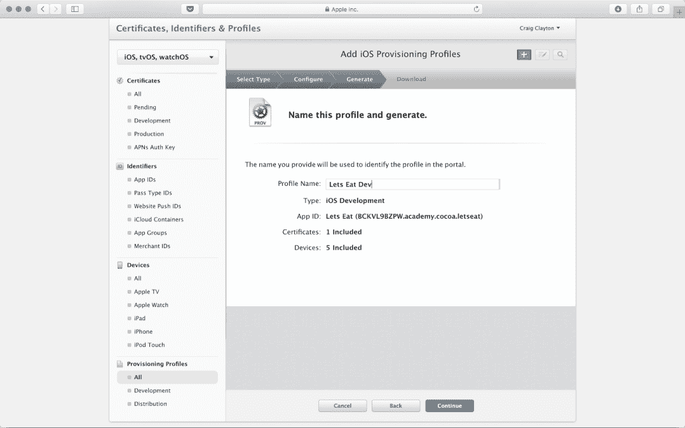
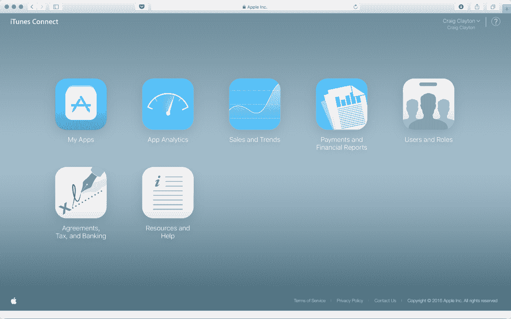

# 测试版和商店提交

在这本书中，我们已经走得很远了，从学习 Xcode 到如何构建整个应用。然而，如果不学习如何将应用提交到 App Store，这个过程就不完整。这个过程在第一次做的时候可能看起来很多，但过了一段时间后就会变得容易，甚至变得自然而然。

当我提交我的第一个应用时，我非常紧张。我记得提交应用后的那种释然感，但很快我就开始反复检查网站和我的收件箱，等待那封批准邮件。我听说过很多人花了很多时间开发应用，结果却被拒绝；这些担忧是可以理解的，但要知道苹果希望你们成功。即使你的应用被拒绝（我的第一个应用就是这样），这也不一定是一件坏事。

我的第一款应用是一款体育应用，它因为两个原因被拒绝。首先，在苹果看来，我的应用标志与 NFL 标志太相似。为了解决这个问题，我简单地制作了一个带有应用首字母的通用标志。其次，我的图片质量被认为不符合标准；因此，我获得了更好的图片。然后我重新提交了我的应用，几天后我的应用就被批准了。几乎可以肯定，即使你已经做了很长时间，你也会遇到拒绝。请放心，你可以解决你应用中的任何问题，并将其重新提交给 App Store 以获得批准。

在本章中，我们将涵盖您需要了解的一切，以便将您的应用放入 App Store。在 Xcode 9 中，很多事都在幕后为您完成；然而，本章的目标是向您展示您如何自己设置这些事情。您需要有一个开发者账户才能跟随这些步骤。如果您想购买开发者账户，请访问[`developer.apple.com/programs/`](https://developer.apple.com/programs/)。

本章我们将涵盖以下主题：

+   创建捆绑标识符

+   创建证书签名请求

+   创建生产和开发证书

+   创建生产和开发配置文件

+   创建 App Store 列表

+   制作发布版本并提交到 App Store

+   进行内部和外部测试

本章为您设置，以便您按需使用。它不是让您按照顺序跟随，就像本书中的其他章节一样。例如，您可能需要创建一个捆绑标识符，然后需要了解如何添加外部测试人员。当您需要执行这些任务之一时，请将本章作为资源使用。

# 创建捆绑标识符

当我们创建项目时，我们谈到了捆绑标识符（也称为您的 App ID）。这个捆绑标识符用于识别您的应用，因此必须是唯一的。让我们按照以下步骤进行：

1.  登录您的苹果开发者账户，您将看到以下屏幕：

1.  点击“证书、标识符和配置文件”。

1.  然后，在“标识符”部分下点击“App ID”：

1.  点击屏幕右上角的加号按钮：

1.  “注册 App ID”屏幕将出现，如下所示：

1.  在“注册 App ID”屏幕的顶部部分，如前一张截图所示，添加以下内容：

+   +   名称：更新 App ID 描述下的此字段为 `LetsEat`。

    +   显式 App ID：在 App ID 后缀下的此字段应选中。

    +   包标识符：在 App ID 后缀下的此字段应填写您输入的详细信息。

确保包标识符遵循标准命名约定：`com.yourcompanyname.letseat`。您的包标识符应与我们在创建项目时设置的相同 ID 相同。例如，我的包标识符是 `cocoa.academy.letseat`。

1.  接下来，在如下所示的“注册 App ID”屏幕的底部部分，选择应用程序所需的 App 服务，然后点击继续。

我们的项目没有任何 App 服务，但如果你未来的应用程序需要它们，你可以在 Xcode 中设置它们：你会在“目标”下选择项目，然后选择“能力”选项卡并按需修改：

如果您以后决定添加 App 服务，您可以在 Xcode 中进行。您会在“目标”下选择项目，然后选择“能力”选项卡并按需修改：

在验证您的 App ID 信息后，点击注册：

您的 App ID 现已创建。现在让我们看看证书是什么以及如何使用它们。

# 创建证书签名请求

无论您何时在项目上工作，您都需要创建一个**证书签名请求**（**CSR**）。您会在您的计算机上创建此证书，然后将其上传到 Apple 开发者账户。完成操作后，您会下载此文件并将其在“钥匙串访问”中打开。让我们创建一个用于生产的证书（用于 App Store）和一个用于开发的证书（用于本地构建）：

1.  打开“钥匙串访问”（您可以通过点击菜单栏右上角的搜索图标并输入“钥匙串访问”来找到它）：

1.  在菜单栏中，当在“钥匙串访问”中时，选择“钥匙串访问 | 证书助手 | 从证书颁发机构请求证书...”：

1.  输入用户电子邮件地址和应用程序名称作为通用名称，然后在“请求是”下选择“保存到磁盘”。

1.  然后，点击继续。

1.  在出现的屏幕中，输入证书名称，选择保存位置，然后点击保存，如下所示：

1.  点击完成，导出证书并将其保存到您的计算机上：

# 创建生产和开发证书

我们需要创建生产证书和开发证书。生产证书用于 App Store，而开发证书用于验证你是一名团队成员，允许你签名的应用程序在设备上运行。记住，Xcode 9 现在可以为你处理这些，但了解这个过程仍然很有用。让我们首先创建一个生产证书：

1.  登录到苹果开发者账户，你将看到以下屏幕：

1.  点击“证书、标识符和配置文件”，然后在“证书”下选择“所有”。

1.  点击屏幕右上角的“+”按钮：

1.  在出现的屏幕上，选择“生产”下的“App Store”和“Ad Hoc”，然后点击“继续”：

1.  此屏幕随后列出创建 CSR 文件（我们已创建）所需的步骤。点击“继续”：

1.  通过在“上传 CSR 文件”下选择“选择文件”，选择你保存的证书文件并点击“打开”。然后，点击“继续”：

1.  接下来，下载证书：

1.  然后，通过双击下载的证书来安装它。

对于开发证书，你需要重复这些步骤，只是在选择证书类型时，你将选择“开发”下的“iOS App Development”，而不是在“生产”下选择“App Store”和“Ad Hoc”。所有其他步骤都将相同。

# 创建生产配置文件

现在，让我们创建一个用于分发应用程序的生产配置文件。Xcode 9 会为你创建这些，但再次强调，了解如何操作仍然很有用：

1.  登录到苹果开发者账户，你将看到以下屏幕：

1.  点击“证书、标识符和配置文件”，然后在“配置文件”下选择“所有”。

1.  点击屏幕右上角的“+”按钮：

1.  在“分发”下选择“App Store”，然后点击“继续”：

1.  选择之前创建的 Bundle ID，然后点击“继续”：

1.  接下来，选择之前创建的证书，然后点击“继续”：

1.  接下来，输入配置文件名称“Let's Eat Prod”，然后点击“继续”：

1.  下载证书：

1.  通过双击下载的证书来安装它。

# 创建开发配置文件

现在，让我们创建一个开发配置文件，该配置文件用于使用 Xcode 在你的设备上构建应用程序：

1.  登录到 Apple 开发者账户。

1.  点击“证书、标识符和配置文件”。

1.  接下来，在“配置文件”下，点击“所有”。

1.  然后，点击屏幕右上角的+按钮。

1.  接下来，在“分发”下选择“App Store”，然后点击继续。

1.  选择之前创建的 Bundle ID 并点击继续。

1.  接下来，选择之前创建的证书，然后点击继续。

1.  输入配置文件名称，`Lets Eat Dev`，然后点击继续：

1.  选择你希望使用的设备或选择“全选”：

1.  下载证书：

1.  通过双击下载的证书来安装它。

# 创建 App Store 列表

接下来，我们将创建 App Store 列表：

1.  登录到你的 iTunes 账户并选择“我的应用”：

1.  点击屏幕左上角的+按钮：

1.  选择“新建应用”：

1.  输入你的应用程序详情，然后点击创建：

应用程序现在将列在你的 iTunes 账户中。

# 创建存档构建

当你将应用程序提交到 App Store 时，你需要创建一个存档。这个存档也将用于内部和外部测试，我们将在稍后讨论。当你的存档完成时，你将上传它到 App Store。现在让我们创建一个存档：

1.  打开 Xcode，选择项目，并输入以下信息：

+   +   在“身份”下，将版本号和构建号分别更新为`1.1`和`2`。

    +   在“签名”下，确保已勾选“自动管理签名”。

    +   在“签名”下，选择“团队”。

    +   对于小版本构建，你希望将版本号增加`0.1`，将构建号增加`1`。在某些情况下，开发者将版本号设置为三位数（例如，`1.1.2`）。这完全取决于你的业务以及你如何处理版本号。如果你正在进行重大更新，那么通常将版本号增加`1`。

1.  选择“通用 iOS 设备”作为构建目标：

1.  通过添加`ITSAppUsesNonExemptEncryption`来更新你的`Info.plist`，将其类型设置为`布尔值`，并将其值设置为`NO`。除非你使用某些特殊加密，否则值应该是`NO`。由于我们的应用程序没有特殊加密，我们将值设置为`NO`。

1.  选择“产品”|“存档”：

1.  在出现的屏幕的“存档”选项卡下，选择你的开发团队，然后点击选择：

1.  你的 IPA 文件现在将创建，因此现在点击上传：

1.  你将看到上传开始，如下面的截图所示：

1.  然后，当你的上传成功后，你将看到以下内容：

1.  当你的应用被批准或拒绝时，你将收到一封电子邮件。如果被拒绝，一旦修复了问题，你可以通过更新存档并遵循之前列出的步骤以相同的方式重新提交。

# 内部和外部测试

内部和外部测试使用的是所谓的**TestFlight**。TestFlight 应用可以从 App Store 下载。需要电子邮件地址来注册 TestFlight。让我们看看如何创建每种类型的测试。

# 内部测试

内部测试不经过审查流程。你只能向最多 25 名测试者发送构建进行内部测试。让我们开始吧：

1.  登录你的 iTunes 账户并选择“我的应用”。

1.  选择你的“Let's Eat”应用然后选择“TestFlight”。

1.  在页面左侧选择“内部测试”，然后在页面右侧点击“选择要测试的版本”：

1.  然后，选择你想要测试的版本并点击“确定”：

1.  你现在将看到以下屏幕：

1.  最后，点击“内部测试者”旁边的“+”按钮并添加你的内部测试者：

# 外部测试

外部测试可能或可能不经过审查流程，但通过外部测试，你可以有最多 2,000 名测试者。对于外部测试，请遵循以下步骤：

1.  登录你的 iTunes 账户并选择“我的应用”。

1.  选择你的“Let's Eat”应用然后选择“TestFlight”。

1.  在页面左侧选择“外部测试”。

1.  接下来，在页面右侧点击“添加构建测试”，选择你的构建并点击“确定”：

1.  最后，点击“外部测试者”旁边的“+”按钮并添加你的外部测试者：

1.  当你完成添加测试者后，点击“开始测试”按钮，你将看到以下屏幕。你需要按照以下方式完成所需的信息：

1.  接下来，将你的应用提交给苹果进行审查；当它被批准或拒绝时，你将收到一封电子邮件。如果被拒绝，一旦修复了问题，你可以通过更新存档并遵循之前列出的步骤以相同的方式重新提交。

# 摘要

你现在已经完成了构建应用并将其提交到 App Store 的整个过程。如果你从头到尾都完成了，恭喜你，因为这确实是一项伟大的成就。

在这个阶段，你能做的只有等待苹果审核你的项目。接下来的那一周左右将会是最令人紧张的时期（至少对我来说是这样的）。如果你的应用被拒绝，请不要担心，因为即使是经验最丰富的开发者也会遇到这种情况，而且通常是可以修复的。应用可能会因为一些容易解决的问题而被拒绝；然而，你不想在项目上投入数月的时间，却遗漏了一些苹果永远不会批准的大问题。因此，请做好研究，了解哪些内容是苹果接受的，哪些是不接受的。当你将应用提交到 App Store 时，请通过 Twitter（`@thedevme`）联系我，让我知道——我很乐意看看你构建了什么。
