# 第一章. 开始 iOS 开发

在其他 IT 领域，移动行业是增长最快的领域。iOS 在移动行业中扮演着关键角色；如今，甚至主要的 IT 玩家也在企业方式中融入了移动性。这个标题将帮助你从企业的角度理解 iOS 开发及其实现的基础。

要开始 iOS 开发，我们需要以下这些：

+   一个 Mac 系统

+   Xcode

+   iOS SDK

基本上，iOS 开发基于 Objective-C 语言。Objective-C 是 C 编程语言的扩展；这包括**OOP**（**面向对象编程**）的概念，并为 C 添加了 Smalltalk 风格的通信。Xcode 是为了帮助你为 iPad、iPhone 和 Mac 构建出色的应用而构建的。Xcode 是 iOS 的**IDE**（**集成开发环境**）。

你可以从苹果商店下载 Xcode，如下截图所示：

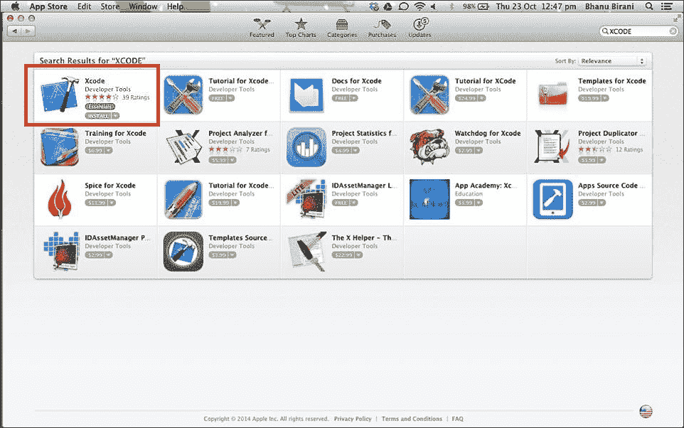

Xcode 选项

它是免费的；下载 Xcode 后，它将自动出现在启动板上。Xcode 提供了不同的功能，如编码、设计、用户界面和测试。

在本章中，我们将涵盖以下主题：

+   接口和实现类

+   iOS 中的方法类型

+   数据类型

+   数组

+   属性和合成

+   代理

+   构建一个简单的应用

# 接口和实现

在 Objective-C 中，表示单个类的文件有两种类型：一个是`interface`文件，另一个是`implementation`文件。在`interface`文件中，方法的声明和变量的声明是完成的；在`implementation`文件中，我们定义这个方法并使用声明的变量。

## 接口和实现的代码片段

以下是为`interface`类提供的代码片段：

```swift
@interface MyClass:NSObject{ 
            // declare class variables here
}
            // class methods and instance methods are declared here
@end
```

`MyClass.h`文件是一个`interface`类。`NSObject`是所有类的根类，导入`NSObject`类是必须的。`@end`关键字表示我们的接口块已完成。

以下是我们名为`MyClass.m`的`implementation`类：

```swift
@implementation MyClass
                   // class methods are defined here
@end
```

# iOS 中的方法类型

我们在`interface`文件中声明的方法在`implementation`文件中定义。方法的声明方式如下：

```swift
-(returnType)methodName:(typeName) variable1 :(typeName)variable2;
```

iOS 中有两种方法：一种是类方法，另一种是实例方法。在类方法中，我们不需要创建对象；我们可以直接使用它们的类名来访问这些方法。类方法由`+`符号表示。我们可以在 Java 和 C++等语言中找到静态方法，我们将在 Objective-C 和 Ruby 等语言中找到类方法。静态方法和类方法之间的区别在于它们有不同的语言概念。

主要区别如下：

+   静态方法在所有实例之间共享（在 Objective-C 中不存在这种情况）。

+   类方法是在类上的一个方法。在 Objective-C 和 Ruby 等语言中，类本身是另一个类的实例（元类）。在方法声明前使用加号（+）表示该方法将在类上定义。技术上，它只是不同对象上的一个实例方法。类方法的语法如下：

    ```swift
    +(void)classMethod;
    ```

    在实例方法中，我们必须创建一个对象。如果没有创建对象，我们无法访问实例方法。为对象分配内存。`alloc` 关键字用于分配内存。实例方法的语法如下：

    ```swift
    -(void)InstanceMethod;  
    ```

## 创建对象

在 `implementation` 文件中创建对象如下：

```swift
MyClass  *object= [[MyClass alloc]init] ;
[object  InstanceMethod];
```

在这里，我们使用了 `alloc` 和 `init` 关键字。`alloc` 关键字用于为对象分配内存，而 `init` 关键字用于初始化该对象。

# 重要数据类型

与任何其他编程语言一样，iOS 也有不同的数据类型，如 `int`、`float`、`double`、`char` 和 `id`。数据类型用于指定变量中存储的数据类型。iOS 中有四种重要的数据类型：

+   `NSString`: 这用于表示字符串

+   `NSInteger`: 这用于声明整数

+   `CGFloat`: 这用于声明浮点值

+   `BOOL`: 这用于声明布尔值（是或否）

# 数组

数组是具有连续内存分配的同质数据类型的集合。在 iOS 中，数组有两种类型：

+   `NSArray`

+   `NSMutableArray`

## NSArray

`NSArray` 是一个不可变数组。在 Objective-C 中，默认情况下，数组是不可变的，也就是说，正如其名称所示，它初始化后的对象不能被更改或删除：

```swift
       NSArray *xyz  =  [[NSArray alloc] init];
  Xyz = @[@"Harry", @"Tom", @"jack"];
```

## `NSMutableArray`

`NSMutableArray` 是 `NSArray` 的子类。这是一个可修改的数组，其对象在数组初始化后可以被删除或修改：

```swift
        NSMutableArray *xyz = [[NSMutableArray alloc] init];
  Xyz = @[@"Harry", @"Tom", @"jack"];
```

### 注意

字符串的概念与 C 语言中相同。字符串也有两种类型：`NSMutableString` 和 `NSString`。以下是一个 `NSString` 类型的示例：

```swift
NSString *myName = @"Jack";
```

# 属性和合成

对象的属性被定义为让其他对象使用或改变它们的状态。然而，在面向对象编程中，无法直接从类外部访问对象的内部状态（除了公共访问器）。相反，使用访问器方法（获取器和设置器）与对象交互。`@property` 的目标是通过自动生成这些访问器方法来简化属性创建和配置：

+   `@property`: 此方法自动在我们的代码中实现设置器/获取器方法；我们不必手动编写代码。

+   `@synthesize`: 此方法使用给定的属性合成属性，编译器将为我们的变量生成设置器和获取器方法。然而，现在我们不使用 `synthesize`；代替 `@synthesize`，我们使用下划线（`_`）或 `self` 关键字。

让我们通过一个代码片段来理解这些方法。这是接口文件：

```swift
#import <Foundation/Foundation.h>
@interface MyClass : NSObject
@property  void  methodname;
@end
```

这是实现文件：

```swift
#import "MyClass.h"
@implementation Class
@synthesize methodname = _methodname; 
@end
```

在 Objective-C 中，每个对象都持有引用计数。当创建一个对象时，其引用计数增加一；当释放对象时，引用计数减少一。当引用计数达到零时，它会自动释放内存。`@property` 的属性如下：

+   `atomic`：默认情况下，每个属性都是原子的。它将确保获取器方法总是返回整个值，或设置器方法总是设置整个值。一次只有一个线程可以访问一个变量以获取或设置值。因此，原子也是线程安全的。

+   `nonatomic`：在 `nonatomic` 中，无法保证从变量返回的值与设置器方法设置的值相同。同时，多个单线程可以同时访问一个变量。

+   `strong`：`strong` 属性拥有对象。编译器将确保我们分配给此属性的任何对象只要我们（或任何其他对象）用强引用指向它，就不会被销毁。

+   `weak`：在 `weak` 引用中，我们不想控制对象的生存周期。我们弱引用的对象之所以存在，仅仅是因为至少有一个其他对象持有对该对象的强引用。

+   `retain`：这指定了在赋值时应在对象上调用 `retain`。它获取对象的拥有权。

+   `assign`：这指定了设置器使用简单的赋值。它使用标量类型的属性，例如 `float` 或 `int`。

+   `copy`：在赋值时复制一个对象，并增加引用计数一。

考虑以下使用属性的简单示例：

```swift
   @property (nonatomic, assign) float radius;
       @property (atomic, strong) NSString *name;
```

# 代理

代理是一种工具，通过它可以一个对象与另一个对象进行通信；反过来，对象可以保持相互连接。这是一种方法，其中一个对象可以代表另一个对象行事。委托对象保留对另一个对象的引用，并在适当的时候向它发送消息。消息通知委托对象，委托对象即将处理或将要处理的事件。

考虑以下如何使用代理的示例。

让我们定义 `FirstViewController.h` 接口文件如下：

```swift
#import "SecondViewController.h"

@interface FirstViewController : UIViewController <SecondViewControllerDelegate>
{
    IBOutlet UITextField *userNameTextField;
}

@property (nonatomic, strong) UITextField *userNameTextField;

-(IBAction)goNext:(id)sender;

@end
```

现在，让我们定义 `FirstViewController.m` 实现文件：

```swift
#import "FirstViewController.h"

@interface FirstViewController ()

@end

@implementation FirstViewController

@synthesize userNameTextField;

-(void)goNext:(id)sender{

    SecondViewController *secondVC = [[SecondViewController alloc]init];

    secondVC.delegate = self;
    [self.navigationController pushViewController:secondVC animated:YES];   
}

-(void)done:(NSString*)name{

    NSLog(@"BACK in firstVC");
    userNameTextField.text = name;
}

@end
```

接下来，我们将定义 `SecondViewController.h` 接口文件如下：

```swift
#import "FirstViewController.h"

@protocol SecondViewControllerDelegate <NSObject>

-(void)done:(NSString*)someText;

@end
@interface SecondViewController : UIViewController{

    IBOutlet UITextField *someText;
    IBOutlet UIButton *returnButton;
    id delegate;
}

@property (assign, nonatomic) id <SecondViewControllerDelegate> delegate;
@property (strong, nonatomic) UITextField *someText;

-(IBAction)goBack:(id)sender;

@end
```

现在，我们将定义 `SecondViewController.m` 实现文件如下：

```swift
#import "SecondViewController.h"

@interface SecondViewController ()

@end

@implementation SecondViewController

@synthesize someText;
@synthesize delegate = _delegate;

-(void)goBack:(id)sender{

    [self.delegate done:someText.text];

    FirstViewController *firstVC = [[FirstViewController alloc]init];

    [self.navigationController pushViewController:firstVC animated:YES];
}

@end
```

# 构建我们的第一个 iPhone 应用

让我们通过以下步骤制作我们的第一个 iPhone 应用：

1.  打开 Xcode；你将看到以下屏幕。在右侧的面板中，你可以看到你的现有项目。你可以直接从项目列表中选择打开项目；另一方面，对于新项目，选择**创建一个新的 Xcode 项目**。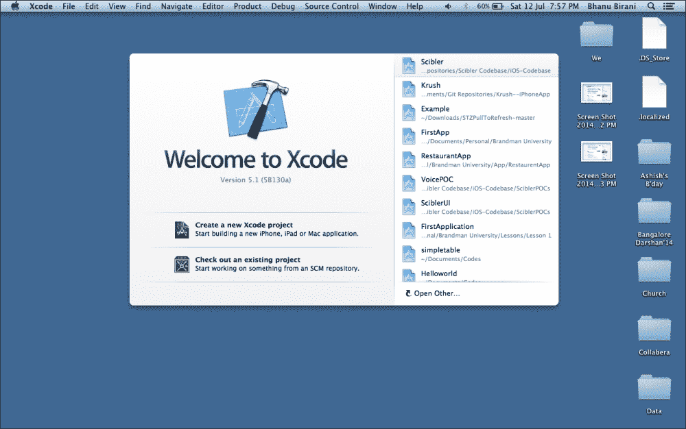

1.  Xcode 提供了八个模板。在左侧面板中，您可以看到有两个选项：**iOS** 和 **OS X**。**iOS** 用于苹果触摸设备，而 **OS X** 用于桌面设备。最初，选择**单视图应用程序**。然后，点击**下一步**，如图所示：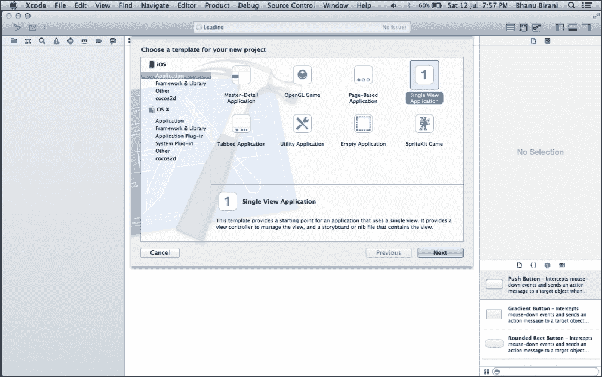

1.  现在，是时候给你的项目命名，并从**设备**下拉菜单中选择**iPhone**。然后，点击**下一步**。以下截图将出现：

    ### 小贴士

    **下载示例代码**

    您可以从您在 [`www.packtpub.com`](http://www.packtpub.com) 购买的所有 Packt 书籍的账户中下载示例代码文件。如果您在其他地方购买了这本书，您可以访问 [`www.packtpub.com/support`](http://www.packtpub.com/support) 并注册，以便将文件直接通过电子邮件发送给您。

    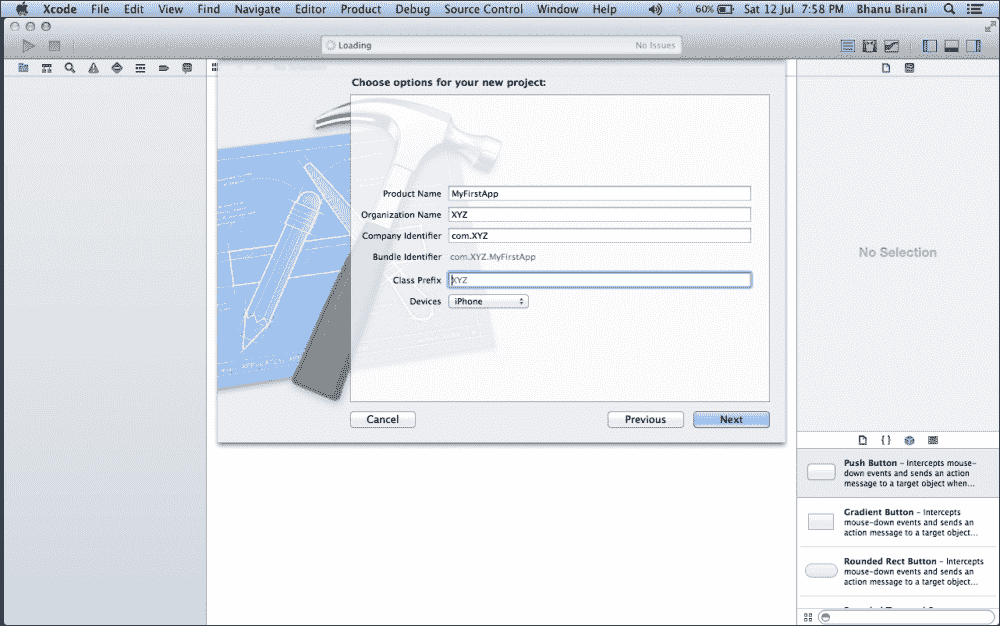

1.  将您的项目保存在您选择的目录中：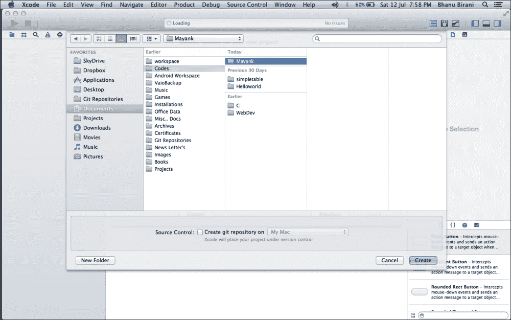

1.  现在，您的编辑器将看起来如下截图所示。在左侧面板中，有一个类的声明。从左侧面板中选择故事板。故事板为您的应用程序提供视图。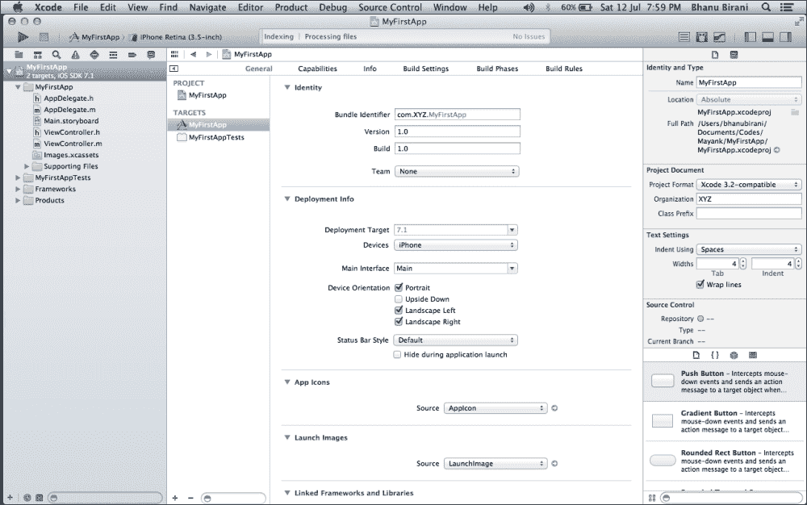

    这是您的故事板。目前，它是一个空视图控制器。故事板有许多区域，例如导航区域、编辑区域、工具区域和调试区域，以下将逐一描述：

    +   **导航区域**：在这个面板中，我们可以通过导航选择栏在多个导航器之间切换。我们将经常使用的三个导航器是项目导航器、搜索导航器和问题导航器。

    +   **编辑区域**：编辑区域是我们可能花费大部分时间的地方！所有编码都发生在这里。

    +   **工具区域**：Xcode 的工具区域由两个面板组成：检查器面板和库面板。检查器面板将给我们提供关于文件详情。然而，当我们查看故事板时，检查器面板将显示您可以修改的所选元素的各个属性。库面板在我们查看故事板之前不会非常有用。当我们使用 Xcode 的界面构建部分时，我们可以从库面板拖动 UI 元素到编辑区域，以将它们添加到用户界面中。

    +   **调试区域**：调试区域将在您运行应用程序时显示控制台输出和各种变量的状态。

    在以下截图，我们可以看到一个箭头在视图之前；这表示该视图是应用程序的起始视图。当应用程序启动时，此视图将首先启动：

    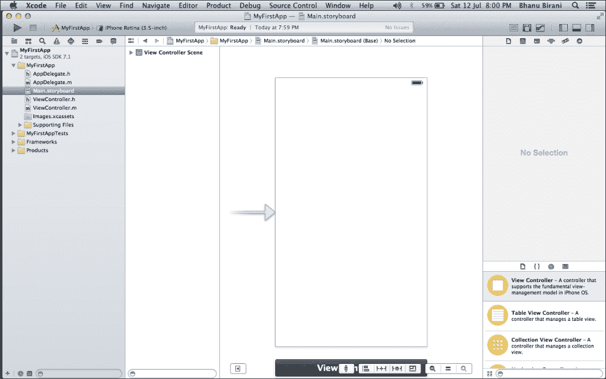

1.  在右侧，有许多组件，如按钮、标签和文本字段（我们将在接下来的章节中学习这些组件）。按照以下截图所示，从右侧面板拖放一个按钮；通过双击重命名它；给它任何名字。例如，命名为 `Hello`。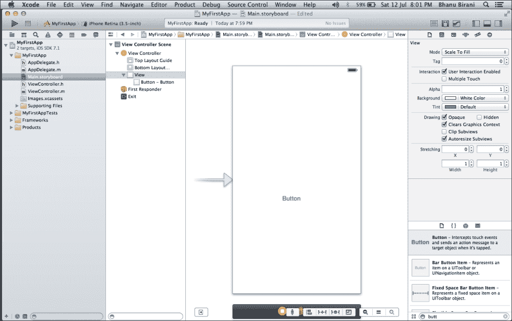

    这就是我们的 UI 部分。现在，让我们继续到编码部分。

1.  前往 `ViewController.h` 并在其中编写以下方法。`.h` 文件是我们项目的接口文件，其中我们声明属性和方法。如果我们想声明变量，那么它们将在接口的大括号内声明；属性和方法定义在大括号外：

    ```swift
    @interface ViewController : UIViewController
    {
    Int x;
    }
    @property (nonatomic, strong) NSString*recipeName;
    ```

    ### 注意

    回到我们的程序，我们必须描述一个方法，`showMessage`，其中我们描述了 `UIAlertview` 函数；这会显示一个带有消息的弹出窗口。

    以下截图显示了包含前面代码片段的编辑区域：

    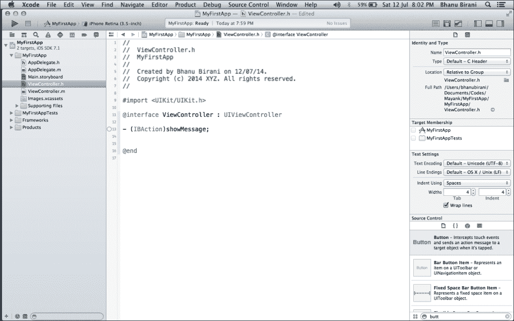

    让我们逐行理解代码：

    +   `#import <UIKit/UIKit.h>`: 这是我们代码中导入的一个头文件。`UIKit` 是一个框架，包含所有 UI 部分的内置库文件。`UIKit` 头文件导入了 `UIKit` 框架中可用的所有其他头文件；导入此头文件后，我们不需要手动导入其他 `UIHeader` 文件，如 `UIViewController.h`、`UIView.h` 或 `UIButton.h`。

    +   `@interface ViewController: UIViewController`: 这是对 `ViewController.h` 类的一个接口。它继承自 `UIViewController` 类，用于处理我们屏幕或视图的流程。

    +   `(IBAction)showMessage`: 这是一个我们手动创建的方法。当我们想要在按钮点击时执行某些操作时，我们将使用 `IBAction`。这是 iOS 中的一种返回类型。这里，方法的名称是 `showMessage`（我们可以给出任何名字）。`IBAction` 告诉 UI 构建器该方法可以用作选择器（事件接收器）。

    +   `@end`: 这段代码表示我们的接口部分已经结束。

1.  现在，前往 `ViewController.m` 并描述在 `.h` 文件中定义的方法。这也被称为 `implementation` 文件。以下截图展示了实现文件中使用的代码：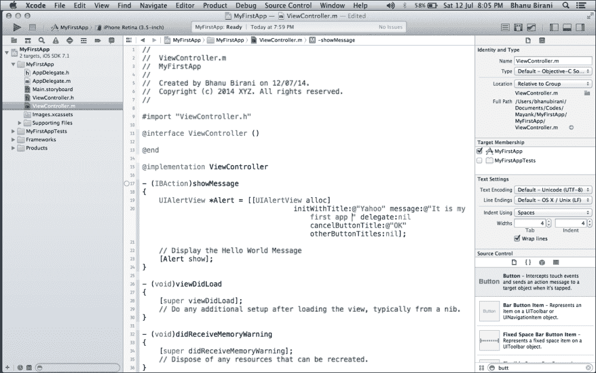

    再次逐行理解代码：

    +   `#import "ViewController.h"`: 这导入了我们的 `.h` 类（接口类）。

    +   `@implementation ViewController`: 从这个片段开始，我们的方法实现。在接口文件中声明的我们将在这里实现。它还包含一些内置方法，如 `–(void)viewDidLoad`、`-(void)didRecieveMemoryWarning` 等。我们可以在这些方法中按需编写代码。如果我们选择 **Empty application** 模板，则不会提供这些内置方法。

    +   `UIAlertView`: 弹出视图是出现在当前视图之上的弹出窗口或消息。我们可以通过创建它的对象来使用它。在这里，`Alert`是一个对象。`alloc`是一个关键字，用于为对象分配内存。

    +   `[Alert show]`: 这个片段用于在屏幕上显示弹出窗口。

    现在我们必须将这个按钮连接到我们声明的那个方法。如果不连接按钮，它将不会工作。使用以下步骤来连接按钮。

1.  右键点击按钮。会出现一个黑色弹出窗口。选择**Touch Up Inside**并将其连接到**View Controller**，如图所示。释放鼠标后，从弹出窗口中选择**showMessage**。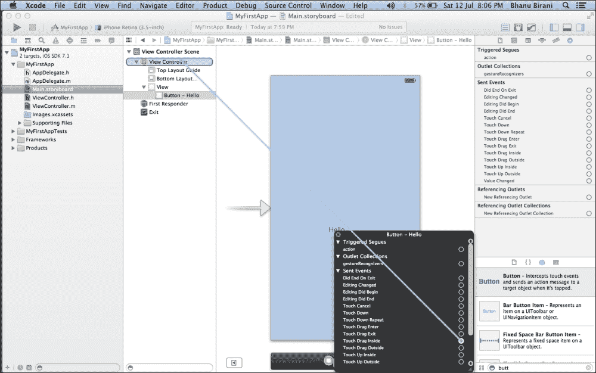

1.  现在，你的按钮已经连接到了`Alert`方法。现在是执行你的项目的时候了。运行你的项目并点击**Hello**按钮。你的输出将类似于以下截图：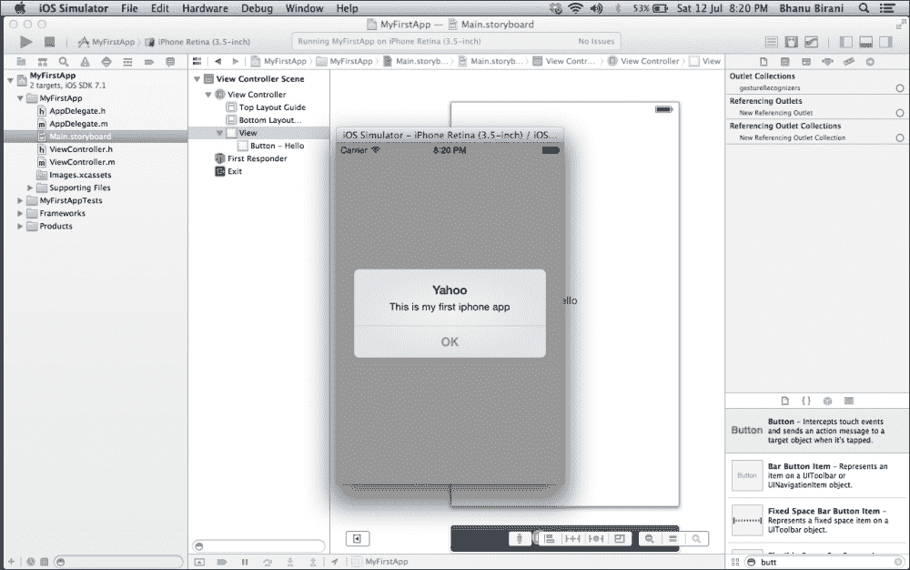

# 摘要

在本章中，我们学习了 iOS 的基础知识，例如方法、数组、属性、代理等。在本章之后，我们也将能够使用 Xcode，我们可以使用 UI 组件制作简单的应用。在下一章中，我们将学习更多关于组件的内容。
