# 第三章：探索各种框架

框架是一组资源的集合。它将静态库及其头文件收集到一个单一的结构中，Xcode 可以轻松将其包含到我们的项目中。框架是动态库。在 iOS 中，有两种类型的框架：公开框架和私有框架。从 iOS 3.1 开始，所有私有和公开库都合并到一个大缓存文件中。苹果为不同的功能提供了许多框架。框架的扩展名为`.framework`。对于每个独特的功能，都定义了一个框架——例如，使用地图时，有`MapKit`框架可用，使用位置时，有`CoreLocation`框架可用。各种框架位于`<Xcode.app>Contents/Developer/Platforms/iPhoneOS.platform/Developer/SDKs/<iOS_SDK>/System/Library/Frameworks`目录中，其中`Xcode.app`是我们的应用程序路径（我们保存应用程序的地方）。

在本章中，我们将涵盖以下主题：

+   表格形式的框架描述

+   iOS 中的数据库

+   社交集成

+   以更好的方式理解每个主题的活动

通常，框架是包含可链接库（`.dylib`）及其相关资源和头文件的包。每个框架都包含与其相关的示例代码和其他资源。苹果提供了许多框架。框架在以下表格中列出，并附有描述：

| 名称 | 描述 |
| --- | --- |
| `Accelerate.framework` | 此框架处理数学、数字信号处理、大数和图像处理。 |
| `Accounts.framework` | 此框架提供对`Accounts`数据库中账户的访问。如果不存在账户，它允许创建账户。 |
| `AddressBook.framework` | 此框架提供对`AddressBook`数据库的访问。 |
| `AddressBookUI.framework` | 此框架包含用于显示系统定义的人选选择器和编辑接口的类。 |
| `AdSupport.framework` | 此框架提供访问用于广告的标识符以及一个表示是否启用了有限跟踪的标志。 |
| `AssetsLibrary.framework` | 此框架提供对用户照片和视频的访问。 |
| `AudioToolbox.framework` | 此框架提供用于录制、播放和音频流的接口。 |
| `AudioUnit.framework` | 此框架用于加载音频单元及其用途。 |
| `AVFoundation.framework` | 此框架用于播放和录制音频和视频。 |
| `CFNetwork.framework` | 此框架用于通过 Wi-Fi 或蜂窝网络访问网络。 |
| `CoreAudio.framework` | 此框架提供用于 Core Audio 的数据类型。 |
| `CoreBluetooth.framework` | 此框架提供对蓝牙（硬件）的访问。 |
| `CoreData.framework` | 此框架包含应用程序数据模型的接口。 |
| `CoreFoundation.framework` | 此框架提供软件服务和数据的基本管理。 |
| `CoreGraphics.framework` | 此框架包含 Quartz 引擎的 API，并提供 2D 视图。 |
| `CoreImage.framework` | 此框架是用于操作图像和视频的接口。 |
| `CoreLocation.framework` | 此框架是用于确定用户位置的接口。 |
| `CoreMedia.framework` | 此框架包含操作音频和视频的底层例程。 |
| `CoreMIDI.framework` | 此框架包含处理 MIDI 数据的底层例程。 |
| `CoreMotion.framework` | 此框架是访问加速度计和陀螺仪数据的接口。 |
| `CoreTelephony.framework` | 此框架允许访问运营商信息和当前通话的相关信息。 |
| `CoreText.framework` | 此框架包含文本布局和渲染引擎。 |
| `CoreVideo.framework` | 此框架包含使用音频和视频的底层例程。建议不要直接使用它。 |
| `EventKit.framework` | 此框架接口用于访问日历和事件。 |
| `EventKitUI.framework` | 此框架包含用于显示日历界面的类。 |
| `ExternalAccessory.framework` | 此框架是一个用于与附加硬件通信的接口。 |
| `Foundation.framework` | 此框架包含管理字符串、数组、集合和底层数据类型的接口。 |
| `GameController.framework` | 此框架是用于与游戏相关硬件通信的接口。 |
| `GameKit.framework` | 此框架用于点对点连接和创建社交游戏。 |
| `GLKit.framework` | 此框架用于构建 OpenGL ES 应用程序。 |
| `GSS.framework` | 此框架提供安全相关服务。 |
| `iAd.framework` | 此框架用于显示广告。 |
| `ImageIO.framework` | 此框架包含读取和写入图像数据的类。 |
| `IOKit.framework` | 此框架是一个底层框架，用于与内核和硬件通信。 |
| `JavaScriptCore` | 此框架包含评估 JavaScript 代码和解析 JSON 的文件。 |
| `MapKit.framework` | 此框架用于在我们的应用程序中嵌入地图和使用反向地理编码。 |
| `MediaAccessibility.framework` | 此框架在 iOS 7 中定义。它管理媒体文件中闭路电视内容的呈现。 |
| `MediaPlayer.framework` | 此框架包含全屏模式播放视频的接口。 |
| `MediaToolbox.framework` | 此框架包含播放音频内容的接口。 |
| `MessageUI.framework` | 该框架包含用于编写电子邮件的接口。 |
| `MobileCoreServices.framework` | 此框架定义系统支持的 UTIs。 |
| `MultipeerConnectivity.framework` | 此框架在 iOS 7 中引入。它负责在设备之间实现点对点网络。 |
| `NewsstandKit.framework` | 此框架提供了在后台下载杂志和报纸的接口。 |
| `OpenAL.framework` | 此框架包含跨平台音频库的接口。 |
| `OpenGLES.framework` | 此框架提供了 OpenGL ES 库的接口，并包含用于 2D 和 3D 图形的类。 |
| `PassKit.framework` | 此框架包含创建数字通行证的接口，用于替换如票、会员卡等物品。 |
| `QuickLook.framework` | 这提供了预览文件的接口。 |
| `SafariServices.framework` | 此框架是在 iOS 7 中引入的。它支持在 Safari 中创建阅读列表项。 |
| `Security.framework` | 此框架提供了管理密钥、信任策略和证书的接口。 |
| `Social.framework` | 此框架包含用于通信或集成社交网络服务的接口。 |
| `SpriteKit.framework` | 此框架是在 iOS 7 中引入的。它便于创建基于精灵的动画。 |
| `StoreKit.framework` | 此框架负责处理与应用程序相关的财务交易。 |
| `SystemConfiguration.framework` | 此框架包含确定网络是否可用的接口。 |
| `Twitter.framework` | 此框架包含发送推文的接口。 |
| `UIKit.framework` | 此框架包含 iOS UI 组件和应用程序用户界面的类。 |
| `VideoToolbox.framework` | 此框架包含设备使用的接口。建议不要直接使用它。 |

这些是苹果提供的各种框架，我们可以根据需要使用它们。

# 使用库探索各种 UI 组件

您已经在上一章中学习了 UI。现在我们可以通过探索一些 UI 组件和框架来开始。我们将通过以下步骤制作一个简单的“学生注册”应用：

1.  首先，在 Xcode 中创建一个新的单视图项目。

1.  现在，转到故事板并导航到**编辑器** | **嵌入** | **导航控制器**，如图下截图所示：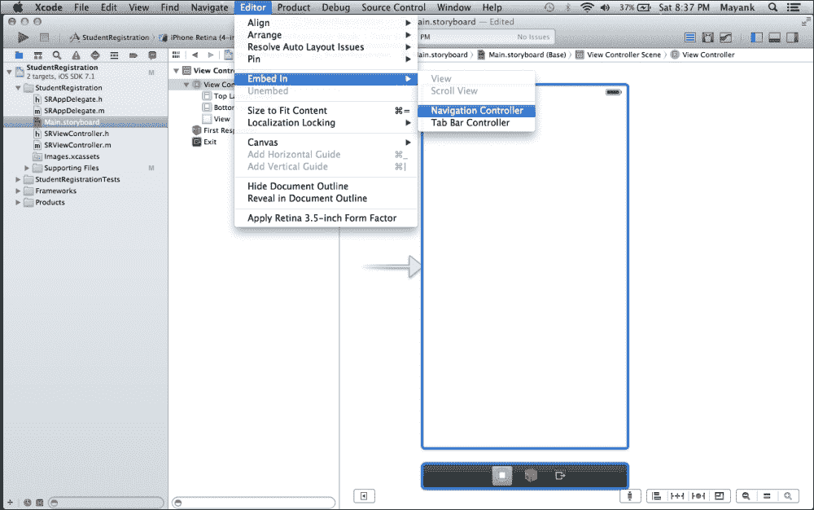

1.  现在您的故事板看起来像这样：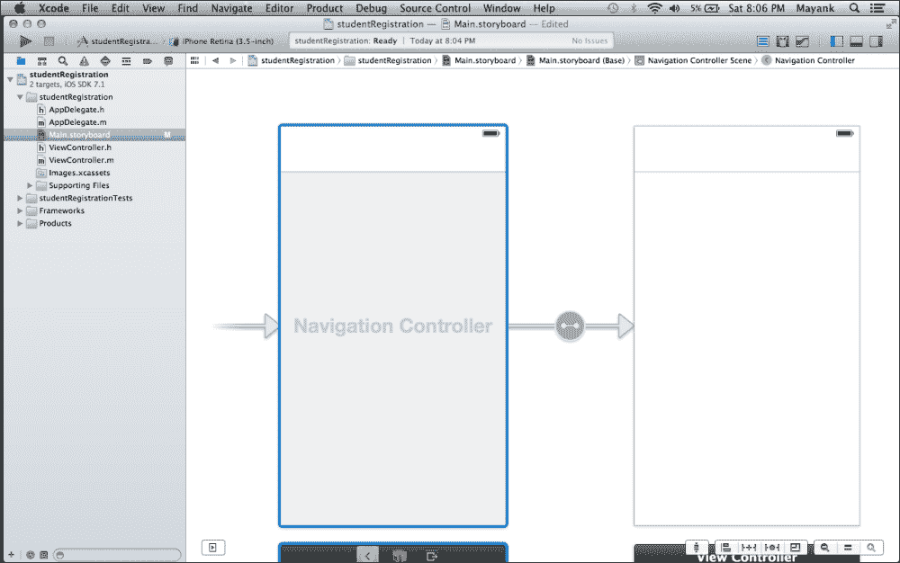

1.  通过点击它来选择第二个视图的导航栏，并将其重命名为“学生注册”。

1.  向视图中添加一个按钮（命名为“添加学生”），并从右侧的检查器面板设置按钮文本和背景颜色。

1.  在界面构建器中搜索新的视图控制器，并将其拖到第二个视图旁边。

1.  对于新的视图控制器，我们需要添加新的类文件。转到 Xcode 顶部的**文件**，然后导航到**文件** | **新建** | **文件...**。

1.  现在，创建一个新的**Objective-C 类**文件，并为该类命名一个合适的名称（例如，`StudentRegistration`），如下面的截图所示：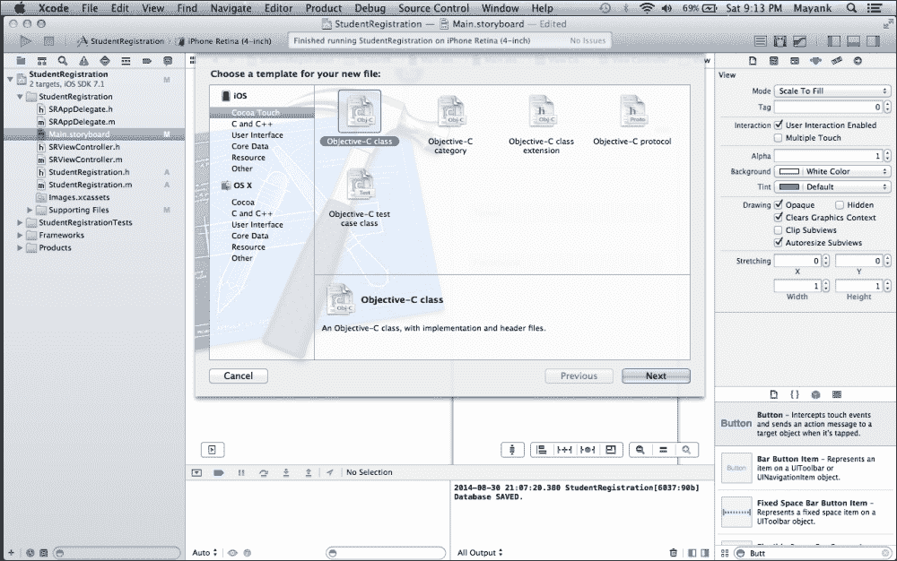

1.  前往故事板，选择我们的第三个视图，并在检查器元素中为其提供一个与我们的新 Objective-C 类相似的名称。

1.  右键单击按钮，选择**操作**选项，拖动到新视图（第三个视图），并选择**推送**。

1.  现在，如以下截图所示，在第三个视图中拖动四个文本字段。选择一个文本字段，并转到检查器面板，在那里您将找到一个选项**占位符**。在这里，为所有文本字段输入文本。

1.  在界面构建器中找到工具栏按钮，并将其拖动到第三个视图的工具栏上，并命名它（例如，`Save`）。

通过遵循前面的步骤，我们的故事板将看起来像这样：

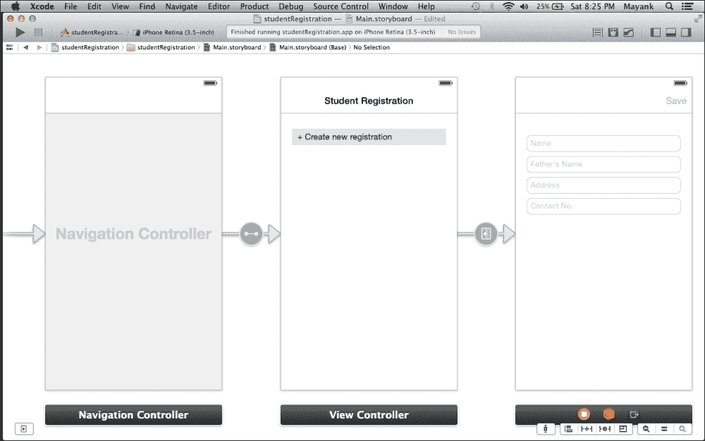

这里是我们的简单 UI，但这次我们需要拉伸我们的 UI 组件。我们可以更改导航栏的颜色以提高可见性。要更改我们的导航栏颜色，我们需要应用以下代码。我们可以在`AppDelegate.m`中的`didFinishLaunchingWithOptions:`方法中插入以下代码：

```swift
[[UIApplication sharedApplication] setStatusBarHidden:NO withAnimation:YES];
  // Change navigation bar color
  [[UINavigationBar appearance] setBarTintColor:[UIColor colorWithRed:41.0f/255.0f green:128.0f/255.0f blue:185.0f/255.0f alpha:1.0f]];

  [[UINavigationBar appearance] setTintColor:[UIColor whiteColor]];

  // Change font of navigation bar
  [[UINavigationBar appearance] setTitleTextAttributes:[NSDictionary dictionaryWithObjectsAndKeys:[UIColor whiteColor],NSForegroundColorAttributeName, nil]];
```

现在，我们需要在`StudentRegistration-Info.plist`文件中进行一些更改。根据以下截图进行更改：

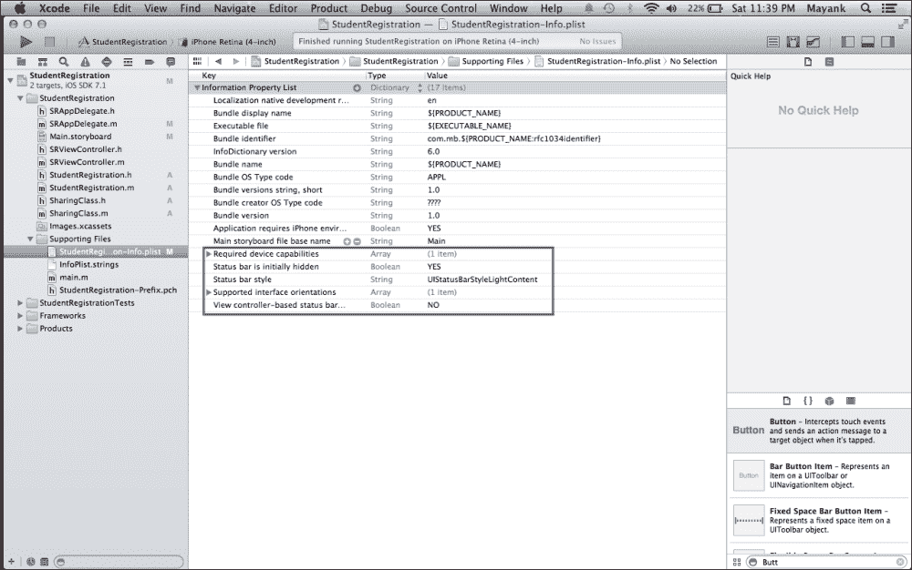

运行我们的项目后，输出将看起来像这样：

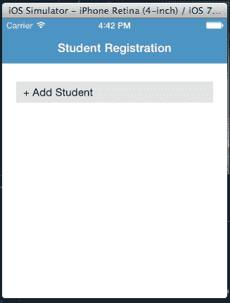

现在，点击**+ 添加学生**按钮；它将推动我们的应用进入另一个视图，我们的屏幕将看起来像这样：

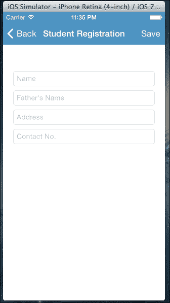

# 数据库集成

数据库是将我们的数据保存在计算机内存中的方式。数据库是一组保存在计算机中的数据，可以通过多种方式访问。在 iOS 中，主要只有一种类型的数据库：**SQLite**。

## SQLite

SQLite 是 SQL 的嵌入式实现。SQLite 是一个进程内库，它实现了一个自包含、零配置、无服务器和事务性的 SQL 数据库引擎。SQLite 的源代码存在于公共领域，并且对私人用途和商业用途都是免费的。SQLite 适用于多种编程语言，如 C、C++、Java 等。它也适用于多种操作系统，如 iOS、Android、Symbian、Blackberry 等。SQLite 用于在 iOS 中处理数据文件或创建数据文件。它可以通过使用 SQL 查询轻松执行。SQLite 基于 RDBMS 的原则工作，其中数据存储在表中，关系也存储在表中。

因此，我们可以在项目中使用 SQLite，Apple 提供了一个库和一个框架：`ibsqlite3.dylib`和`sqlite3.h`。SQLite 有几个功能。重要的功能如下：

+   `sqlite3_open()`: 此函数创建并打开一个空数据库。如果数据库已存在，它将仅打开数据库。

+   `sqlite3_close()`: 此函数用于关闭已打开的 SQLite 数据库连接。它将释放与数据库连接关联的所有资源。

+   `sqlite3_prepare_v2()`: 此函数用于将 SQL 语句编译成字节码。它基本上将 SQL 语句转换成可执行的代码片段。

+   `sqlite3_step()`: 此函数将调用之前准备好的 SQL 语句。

+   `sqlite3_finalize()`: 此函数从内存中删除之前准备的 SQL 语句。

+   `sqlite3_exec()`: 此函数将 `sqlite3_prepare_v2()`、`sqlite3_step()` 和 `sqlite3_finalize()` 的功能合并为单个函数调用。

让我们进行一个小活动，以更好地理解 SQLite。我们将扩展之前的应用程序。打开该应用程序，按照以下步骤进行：

1.  前往 **项目设置** | **常规**。现在，向下滚动并点击 **+** 添加框架。搜索 SQLite 框架并点击 **添加**，如图所示：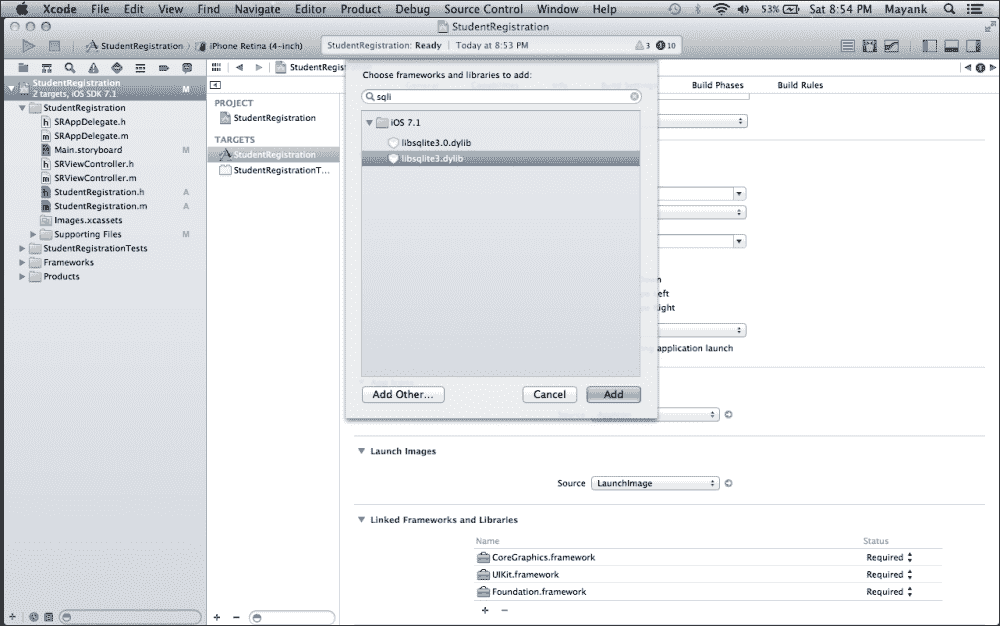

1.  在之前步骤中添加的新类中导入以下 SQLite 头文件：

    ```swift
    #import <sqlite3.h>
    ```

1.  现在，在界面部分创建 SQLite 对象，如下所示：

    ```swift
    sqlite3 *_database;
    ```

1.  现在，将所有文本字段和 **保存** 按钮链接到新添加的类文件的 `.h` 文件。

1.  现在，转到 `.m` 文件中的 `Save` 方法，并编写以下代码以实现 SQLite 集成：

    ```swift
    - (IBAction)Save:(id)sender {

      NSArray *paths= NSSearchPathForDirectoriesInDomains(NSDocumentDirectory NSUserDomainMask, YES);
      NSString *documentsDirectory = [paths objectAtIndex:0];
      NSString *databasePath =[documentsDirectory stringByAppendingPathComponent:@"mydbs.sqlite"];

        // Check to see if the database file already exists
      bool databaseAlreadyExists = [[NSFileManager defaultManager] fileExistsAtPath:databasePath];

        // Open the database and store the handle as a data member
      if (sqlite3_open([databasePath UTF8String], & _database) == SQLITE_OK)
      {
        // Create the database if it doesn't yet exists in the filesystem
        if (!databaseAlreadyExists)
          {
            // Create the SIGNUP table
            const char *sqlStatement = "CREATE TABLE IF NOT EXISTS REGISTRATION (NAME TEXT, FATHERNAME TEXT, ADDRESS TEXT, CONTACT TEXT)";
            char *error;

            if (sqlite3_exec(databaseHandle, sqlStatement, NULL, NULL,    &error) == SQLITE_OK)
              {
                NSLog(@"Database and tables created.");
              }
            else
              {
                NSLog(@"Error: %s", error);
              }

          }

          //-----------SAVING DB-----------

          // Create insert statement for the person
        NSString *insertStatement = [NSString stringWithFormat:@"INSERT INTO REGISTRATION (NAME, FATHERNAME, ADDRESS, CONTACT) VALUES (\"%@\", \"%@\", \"%@\", \"%@\")", Name.text,Fathername.text,Address.text,Contact.text];

        char *error;
        if ( sqlite3_exec(databaseHandle, [insertStatement UTF8String], NULL, NULL, &error) == SQLITE_OK)
          {
            NSLog(@"Database SAVED.");
          }
        else
          {
            NSLog(@"Error: %s", error);
          }

        sqlite3_close(databaseHandle);
      }
      Name.text=@"";
      Fathername.text=@"";
      Address.text=@"";
      Contact.text=@"";

    }
    ```

1.  编译并运行您的应用程序，在所有文本字段中输入文本，然后点击 **保存**，如图所示。在控制台中，输出将是 **数据库已保存**。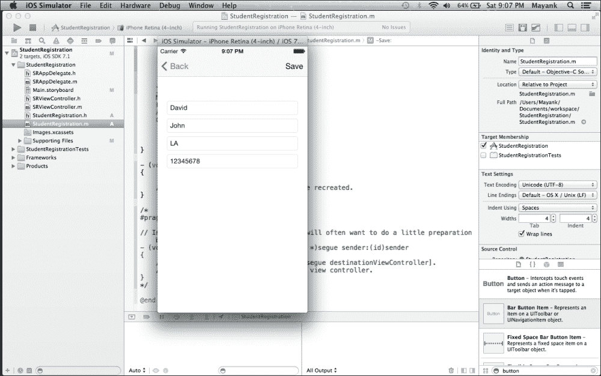

1.  点击 **保存** 按钮将清除所有文本字段（如图所示）并将我们的输入保存到数据库中：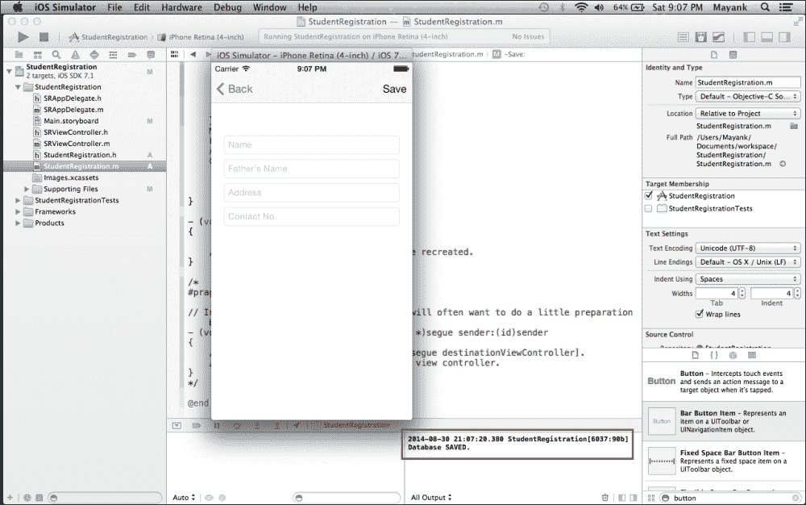

这就是将 SQLite 数据库与我们的应用程序集成的全部内容。

## Core Data

它被成千上万的应用程序和数百万的人使用，包括 iOS 和 OS X。Core Data 由苹果公司维护，并且有很好的文档记录。它是一个成熟的框架。Core Data 利用 Objective-C 语言及其运行时，并易于与 Core Foundation 框架集成。结果是，一个易于使用且在内存使用方面非常高效的框架，用于管理易于使用且内存使用效率高的对象图。Core Data 是苹果公司提供的强大框架，用于在应用程序中包含数据。它甚至更受欢迎，因为它不使用进程，并且可以轻松维护数据之间的关系。

苹果定义了一个名为`CoreData.framework`的框架，用于 Core Data。在我们应用中使用 Core Data 之前，我们需要将此框架添加到我们的项目中。Core Data 本身不是我们应用程序的数据库；它是一个管理对象图的框架。使用 Core Data，我们可以轻松地将我们应用中的对象追踪到数据库中的表记录，而无需执行任何 SQL 查询。在 Core Data 中，我们需要添加三个不同的实例来处理数据库，如下所示：

+   **持久存储协调器**：正如其名所示，它是一个协调器，在管理对象上下文和存储在我们数据库（SQLite 文件）中的低级文件之间进行协调。我们无法直接使用它；它只会在设置`NSManageObjectContext`时使用。为持久存储协调器创建链接会自动为 SQLite 文件创建链接。

+   **托管对象上下文**：我们可以将其视为一个草稿本（一个小型、快速的临时数据存储内存）。当我们从持久存储中检索对象时，我们会将其临时副本放入草稿本中。然后我们可以随意使用和修改这些对象，而不保存这些数据；持久性保持不变。

+   **NSManageObjectModel**：一个托管对象模型是`NSManagedObjectModel`类的实例。它描述了一个对象（也称为实体）的模式（包含定义）。

让我们通过一个活动来了解 Core Data：

1.  要创建示例应用程序项目，请启动 Xcode 并选择创建新项目的选项。在新项目窗口中，选择**空应用程序**选项。在**产品名称**字段中输入`CoreData`，启用**使用 Core Data**复选框，然后点击**下一步**以选择存储项目文件的位置，如图所示：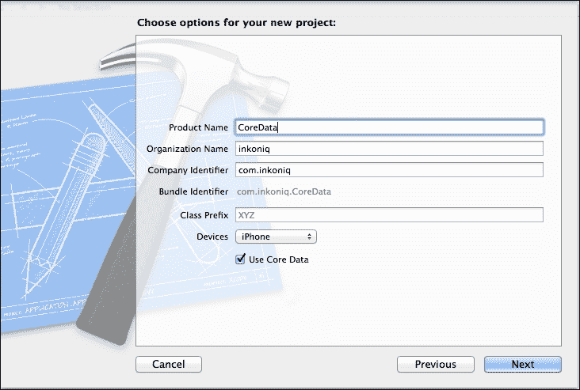

1.  除了创建新项目时通常存在的文件外，这次还创建了一个名为`CoreData.xcdatamodeld`的附加文件。这个文件将用于存储我们数据模型的实体描述。实体描述定义了我们的数据模型，就像模式定义了数据库表的模式一样。要为`CoreData`应用程序创建实体，选择`CoreData.xcdatamodeld`文件以加载实体编辑器，如图所示：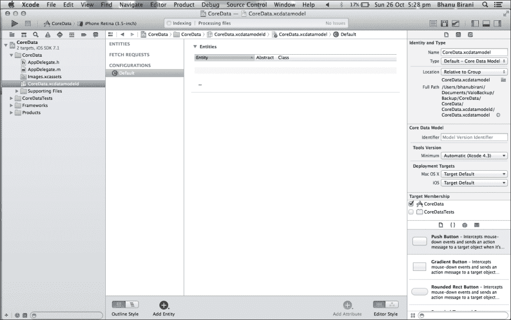

1.  要创建一个新的实体，点击位于底部面板中的 **添加实体** 按钮。在 **实体** 标题下双击新出现的 **实体** 项目，并将实体名称更改为 `Contacts`。实体创建后，下一步是添加一些属性来表示要存储的数据。为此，点击 **添加属性** 按钮。在 **属性** 面板中，将属性命名为 `name` 并将其类型设置为 `String`。重复这些步骤添加另外两个名为 `address` 和 `phone` 的 String 属性，如图所示：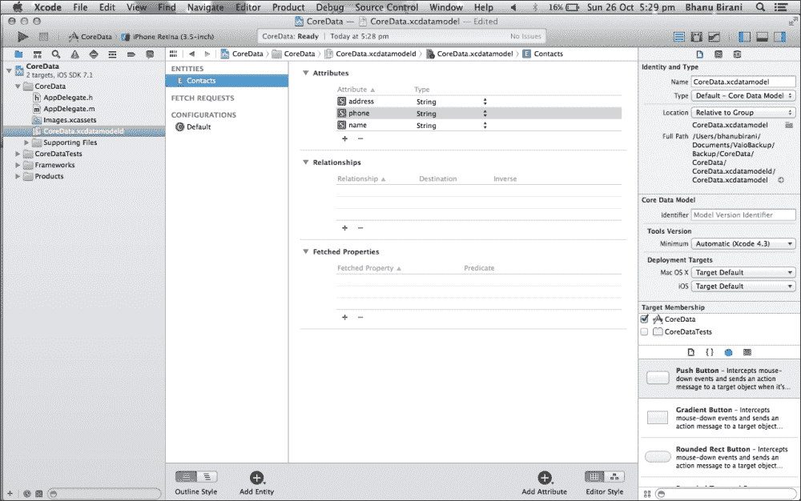

1.  现在，我们需要创建自己的故事板文件和视图控制器类。要添加故事板文件，导航到 **文件** | **新建** | **文件…**，在弹出的对话框中，从左侧面板的 **iOS** 下方选择 **用户界面** 类别。在主面板中，选择 **故事板** 选项，然后点击 **下一步**，如图所示：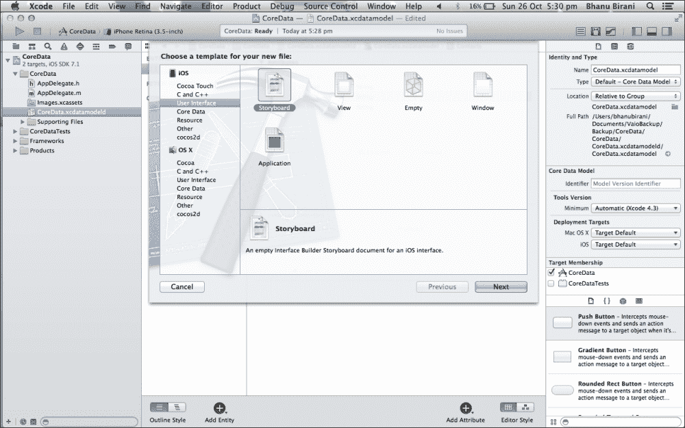

1.  将故事板命名为 `Main`（如图所示），选择项目中的新文件位置，然后点击 **创建**。

1.  接下来，编辑 `AppDelegate.m` 文件并修改 `didFinishLaunchingWithOptions` 方法，使其仅返回 `YES`，而不是为应用程序创建窗口（因为我们现在使用的是故事板文件来设计用户界面，这不再需要）：

    ```swift
    - (BOOL)application:(UIApplication *)application   didFinishLaunchingWithOptions:(NSDictionary *)launchOptions
    {
         return YES;
    }
    ```

1.  现在，我们需要一个新的 Objective-C 文件。因此，从菜单中添加一个新文件，并将其命名为 `CoreDataViewController`。

1.  在故事板中，从界面构建器拖动 `ViewController` 并设计如图所示的界面：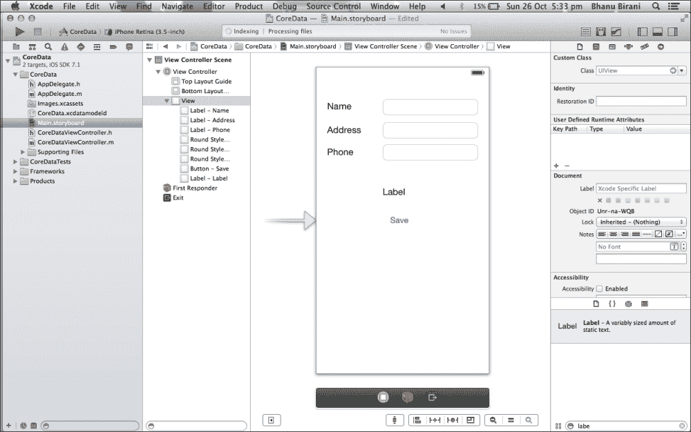

    不要忘记在 Xcode 右侧的检查器编辑器中为这个视图命名。

1.  现在，是时候在故事板和新增的 Objective-C 文件（`CoreDataViewController.h`）之间建立连接了。我们还需要将 `AppDelegate.h` 类导入到我们的新类中，如下所示：

    ```swift
    #import<AppDelegate.h>
    ```

    我们的 `.h` 类可能看起来如下所示：

    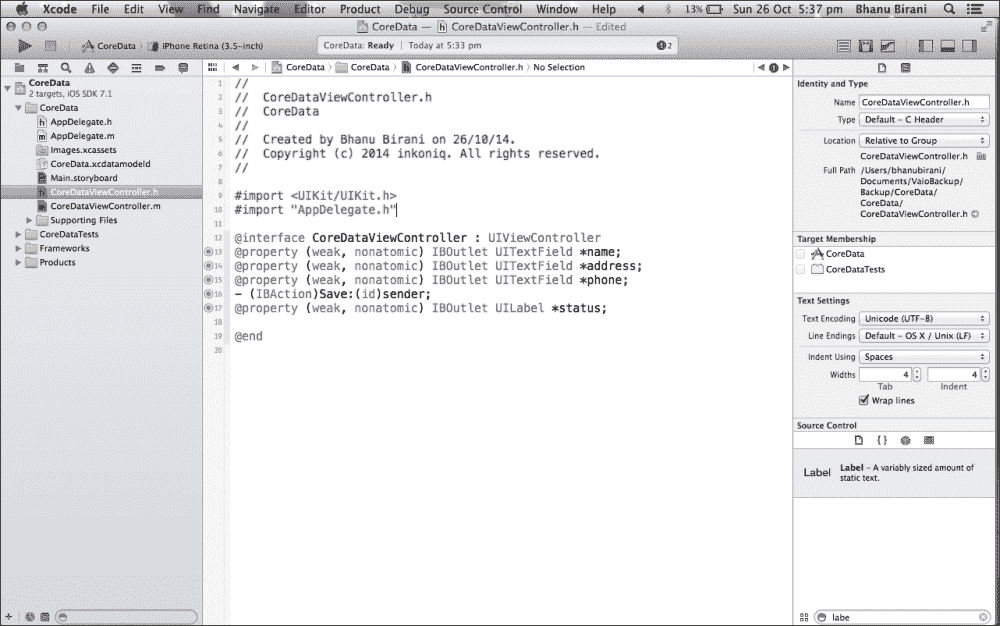

1.  当用户触摸 **保存** 按钮时，将调用 `Save` 方法。因此，我们必须在这个方法中实现代码以获取托管对象上下文，并创建和存储包含用户输入数据的托管对象。选择 `CoreDataViewController.m` 文件，向下滚动到模板 `Save` 方法，并实现以下代码：

    ```swift
    - (IBAction)Save:(id)sender 
    {
        CoreDataAppDelegate *appDelegate =
        [[UIApplication sharedApplication] delegate];

        NSManagedObjectContext *context =[appDelegate managedObjectContext];
        NSManagedObject *newContact;
        newContact = [NSEntityDescriptioninsertNewObjectForEntityForName:@"Contacts"inManagedObjectContext:context];
        [newContact setValue: _name.text forKey:@"name"];
        [newContact setValue: _address.text forKey:@"address"];
        [newContact setValue: _phone.text forKey:@"phone"];
        _name.text = @"";
        _address.text = @"";
        _phone.text = @"";
        NSError *error;
        [context save:&error];
        _status.text = @"Contact saved";
    }
    ```

1.  最后一步是构建和运行应用程序。点击主 Xcode 项目窗口工具栏中的 **运行** 按钮，并将示例文本输入到文本框中，如图所示：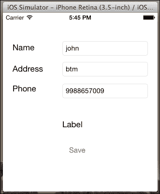

1.  点击 **保存** 按钮后，我们的数据将保存在数据库中，并且标签将变为 **联系人已保存**，如图所示：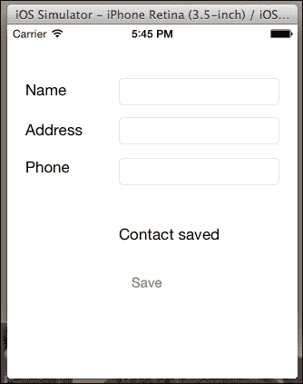

# 我们应用中的社交集成

在应用中集成社交网站现在非常普遍。在 iOS 6 中，引入了一个名为 **Social.framework** 的新框架。社交框架让我们能够将 Facebook 和 Twitter 等社交网络服务集成到我们的应用中。我们不需要下载任何 SDK 或使用任何 API；社交框架处理一切。对于集成社交网络服务，一个重要的类是 `SLComposeViewController`。`SLComposeViewController` 类提供了一个标准的视图，供用户编写推文或 Facebook 帖文。此类还允许用户在不添加任何额外代码的情况下分享位置。

`SLComposeViewController` 类的工作是在我们的设备上获取 Twitter 或 Facebook 的屏幕，以实现分享。

现在，为了处理 API 和连接，Social 框架中提供了一个新的类：`SLRequest`。`SLRequest` 类允许 iOS 应用通过基于 HTTP 的请求直接与社交网络 API 交互。

让我们进行一项简单的活动，以更好地理解社交集成：

1.  再次，继续使用之前的项目。打开该项目，并添加一个新 Objective-C 类，就像我们之前做的那样，并给它命名。

1.  将新的视图控制器拖动到第三个视图控制器附近或下方，并分别添加名为 `Tweet` 和 `Facebook` 的两个按钮。

1.  在第二个视图中（在 **添加学生** 按钮下方）添加一个按钮，并给它命名（例如，`分享到 Facebook 或 Twitter`）。

1.  现在，在检查元素中将新的视图（第四个视图）的名称与新的类相同。

1.  点击 **分享到 Facebook 或 Twitter** 按钮，选择操作并将其链接到第四个（新）视图。故事板将看起来像这样：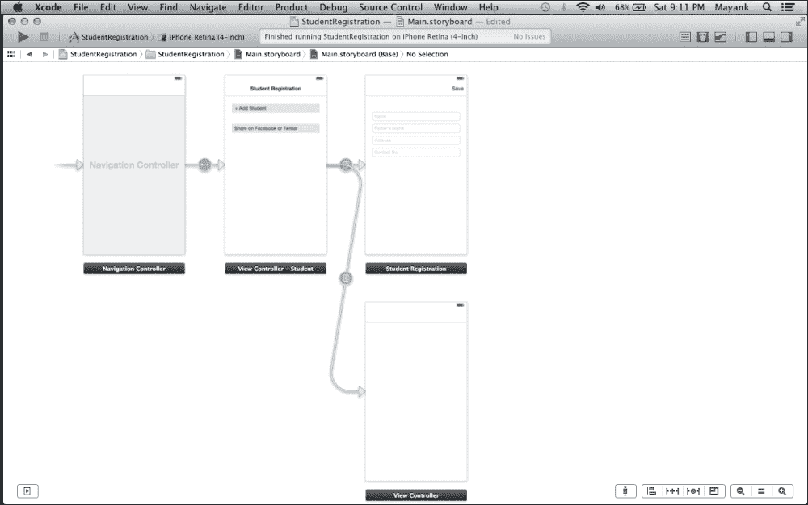

1.  将两个按钮（**Tweet** 和 **Facebook**）链接到新的类。

1.  将新的框架 `Social.framework` 添加到我们的代码中。

1.  将头文件导入到新的 `.h` 类文件中：

    ```swift
    #import<Social/Social.h>
    ```

1.  在新的 `.m` 类文件中添加以下代码：

    ```swift
    - (IBAction)Tweet:(id)sender {

        SLComposeViewController *tweetSheet = [SLComposeViewController
        composeViewControllerForServiceType:SLServiceTypeTwitter];
        [tweetSheet setInitialText:@" Share on Twitter -_- "];
        [self presentViewController:tweetSheet animated:YES completion:nil];

    }

    - (IBAction)PostOnFB:(id)sender {

        SLComposeViewController *controller = [SLComposeViewController composeViewControllerForServiceType:SLServiceTypeFacebook];

        [controller setInitialText:@"Post to your wall -_- "];
        [self presentViewController:controller animated:YES completion:Nil];
    }
    ```

1.  编译并运行项目。输出结果将类似于以下截图：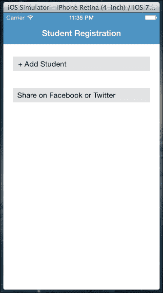

1.  点击 **分享到 Facebook 或 Twitter** 按钮。输出结果如下：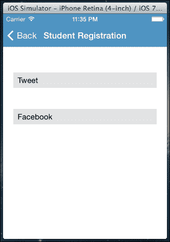

1.  现在，点击 **Tweet** 按钮。输出结果如下：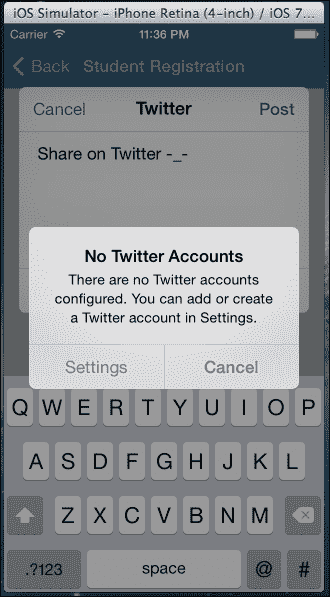

    这种输出出现是因为我们没有在模拟器中管理设置。当你在 **设置** 中设置你的账户时，它将能够在我们 Twitter 上发布推文；或者当我们实际在设备上运行它时，它将正常工作。

1.  现在，点击 **Facebook** 按钮，输出结果如下：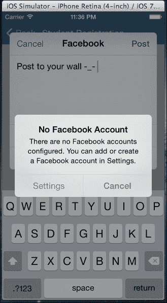

此活动仅用于在我们的帖子中分享一些内容。为了创建登录功能，我们需要 Facebook SDK。使用 Facebook 登录不仅可以将社交特性添加到您的应用中，还可以用作登录系统，而不是创建一个自定义的登录系统。要创建 Facebook 登录，我们需要从[`developers.facebook.com/docs/ios`](https://developers.facebook.com/docs/ios)下载 Facebook SDK。此 SDK 中提供了许多类。大多数任务都由这些类处理。开发者无需担心所有事情。他们只需将登录视图添加到视图控制器中即可。

此活动稍微复杂一些，方法也较长，因此您可以查看以下链接：[`www.appcoda.com/ios-programming-facebook-login-sdk/`](http://www.appcoda.com/ios-programming-facebook-login-sdk/)，获取 Facebook 登录的适当示例。按照链接中给出的步骤操作，您将得到类似于以下截图的输出：

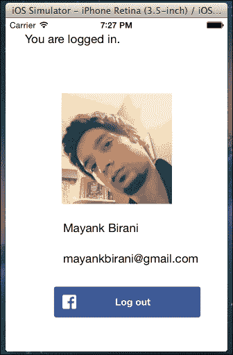

# 摘要

在本章中，您学习了更多关于 UI 以及如何在项目中集成框架的知识。您通过探索每个部分，制作了一个简单的应用，`学生注册`。在章节的结尾，您创建了一个具有 UI 及其功能的完整应用。您还学习了关于数据库和社交媒体集成的知识。

在下一章中，您将学习关于新的框架和 API 以及各种新概念。
