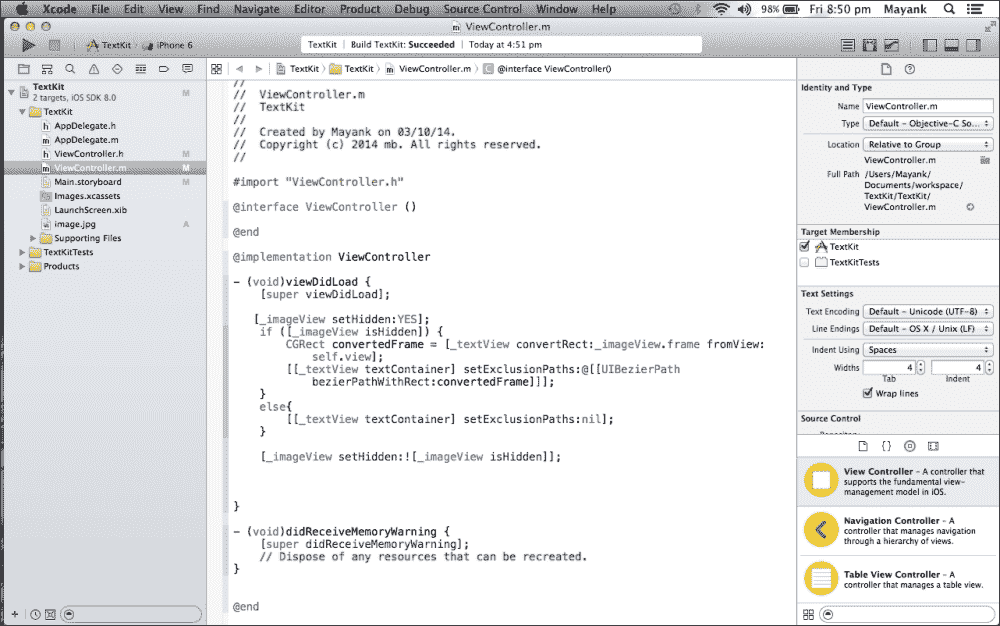

# 第四章 iOS 7 中引入的 API

**API** 代表 **应用程序编程接口**。API 是一组命令、函数、代码段和协议，程序员可以在他们的应用程序中使用。它们是程序员可用的预定义函数，而不是从头开始编写。虽然 API 使程序员的任务变得更容易，但 API 是软件到软件的接口，而不是用户界面。使用 API，应用程序可以在没有任何用户干预的情况下相互通信。一些流行的 API 包括 Google Map API、Twitter API、YouTube API 等。

本章将涵盖以下主题：

+   使用 AirDrop 远程发送/接收文件

+   iOS 的第一个原生游戏引擎

+   使用文本工具管理你的排版

+   样本项目

苹果为开发者做了很多重大更新，以便他们将其纳入他们的应用程序中。用户界面已经完全重新设计。iOS 7 引入了一个新的动画系统来创建 2D 和 2.5D 游戏。多任务增强、对等连接以及许多其他重要功能都已添加。

# 使用 AirDrop

苹果在 iOS 7 中引入了一个名为 **AirDrop** 的新功能。AirDrop 用于轻松与其他附近的 iOS 设备共享图片、联系人、笔记等。它使用蓝牙来检测附近的设备。当通过蓝牙建立连接时，它将创建一个临时的 Wi-Fi 网络来连接两个设备。有一个名为 `UIActivityViewController` 的类可用于在我们的应用程序中集成 AirDrop。我们只需要告诉这个类我们想要分享哪些对象，它就会处理其余的事情。`UIActivityViewController` 类是一个标准的视图控制器类，它提供了一些标准服务，例如将项目复制到剪贴板、在社交媒体网站上共享内容、通过消息发送项目等。在 iOS 7 SDK 中，这个类与内置的 AirDrop 功能一起提供：

```swift
UIImage *Image1  = [UIImage imageNamed:@"Image.png"];

UIActivityViewController *activityVC = [[UIActivityViewController alloc] initWithActivityItems:[NSArray arrayWithObjects:@"Share Image", Image1, nil] applicationActivities:nil];
```

让我们通过一个小活动来了解这个功能：

1.  打开 Xcode 并创建一个新的项目。

1.  将图像视图和按钮从界面构建器拖放到故事板中。我们的故事板将如下截图所示：

1.  将任何图像拖放到 Xcode 中你想要使用的类文件下方。

1.  从故事板中选择图像视图，并移动到属性检查器。然后，在 **Image** 文本框中，给它赋予与我们在 Xcode 中拖拽的图像相同的名称，如下截图所示：

1.  现在，将图像视图和按钮链接到 `viewcontroller.h` 并创建一个数组，我们将在此数组中存储从 AirDrop 想要传输的内容。

    ```swift
    - (IBAction)share:(id)sender;
    @property (weak, nonatomic) IBOutlet UIImageView *image;
    @property (nonatomic,strong) NSArray *activityItems;
    ```

    以下截图将展示我们想要传输的内容：

    

1.  移动到 `viewController.m` 并在 `viewDidLoad` 方法中添加以下代码：

    ```swift
      NSString *shareString = @"This is my Development Machine.";
      UIImage *shareImage = [UIImage imageNamed:@"image.jpg"];
      self.activityItems = @[shareString,shareImage];
    ```

    在前面的代码中，我们创建了一个我们想要分享的字符串，并创建了一个 `UIImage` 对象来存储我们的图像。

    然后，我们将它们两个都添加到了我们定义的数组中。现在，让我们在我们的按钮事件中添加一些代码，如下所示：

    ```swift
    UIActivityViewController *avController = [[UIActivityViewController alloc]initWithActivityItems:self.activityItemsapplicationActivities:nil];

    NSArray *excludedActivities =  @[ UIActivityTypePostToTwitter,
                                     UIActivityTypePostToFacebook,
                                     UIActivityTypePostToWeibo,
                                     UIActivityTypeMessage,
                                     UIActivityTypeMail,
                                     UIActivityTypePrint,
                                     UIActivityTypePrint,
                                     UIActivityTypeCopyToPasteboard,
                                     UIActivityTypeAssignToContact,
                                     UIActivityTypeSaveToCameraRoll,
                                     UIActivityTypeAddToReadingList,
                                     UIActivityTypePostToFlickr,
                                     UIActivityTypePostToVimeo, 
                                     UIActivityTypePostToTencentWeibo];

    avController.excludedActivityTypes = excludedActivities;

    [self presentViewController:avController animated:YES completion:nil];
    }
    ```

    在前面的代码中，我们使用我们的 `activityItems` 数组创建了 `UIActivityViewController`。通过 `excludedActivityTypes` 属性，我们排除了所有不需要的活动，使得 AirDrop 成为唯一的共享选项。最后，我们展示了活动视图控制器。以下截图说明了前面的代码片段：

    

1.  现在是编译和运行我们的程序的时候了。执行后，我们的模拟器将看起来像以下截图：

1.  点击**通过 AirDrop 分享**按钮。我们的模拟器现在将看起来像这样：

    在这里，没有可用的选项，因为我们排除了除了 AirDrop 选项之外的所有选项，并且模拟器不支持 AirDrop。当我们将此代码放在真实设备上时，它将显示可用于共享的设备和具有 AirDrop 的设备。

# SpriteKit

苹果推出了其首个游戏引擎，SpriteKit，它允许我们在不依赖第三方游戏库的情况下为 iOS 创建游戏。它非常强大，并且在用法上倾向于传统的 iOS 框架方法。它也非常容易采用和学习。此外，它支持许多功能，如物理模拟、纹理图集、重力、恢复力和游戏中心支持。此外，它还提供了非常丰富的开发者文档，位于**苹果开发者中心**。它非常有用且编写得很好。您可能需要首先了解游戏开发的解剖结构，才能开始使用 SpriteKit。因此，这里有两个基本且最重要的术语：一个是场景（Scenes），另一个是精灵（Sprites）。场景可以被认为是游戏中的关卡。因此，在任何游戏中，得分层、**HUD**（**抬头显示**）层和游戏玩法层都可以作为不同的场景。然而，场景中的任何对象，如玩家或敌人，都可以被认为是精灵。

## iOS 原生游戏框架

苹果推出了其自家的原生 2D 游戏框架，称为 SpriteKit。SpriteKit 是一个出色的 2D 游戏引擎，它提供了对精灵、动画、滤镜和遮罩的支持。最重要的是，它还提供了对物理引擎的支持，为游戏提供真实世界的模拟。

苹果公司提供了一个名为 *Adventure Game* 的示例游戏，以帮助用户开始使用 SpriteKit。您可以在 [`developer.apple.com/library/ios/documentation/GraphicsAnimation/Conceptual/CodeExplainedAdventure/AdventureArchitecture/AdventureArchitecture`](https://developer.apple.com/library/ios/documentation/GraphicsAnimation/Conceptual/CodeExplainedAdventure/AdventureArchitecture/AdventureArchitecture) 查看示例 SpriteKit 游戏项目。这个示例项目展示了该框架的能力。然而，该项目理解起来比较复杂；为了学习目的，您只需创建一些简单易懂的内容即可。为了更深入地理解基于 SpriteKit 的游戏，本书中将构建一系列迷你游戏。为了理解 SpriteKit 游戏编程的基础，我们将在本章中构建一个迷你 *AntKilling* 游戏。

让我们按照以下步骤开始构建 *AntKilling* 游戏：

1.  启动 Xcode。导航到 **文件** | **新建** | **项目**。然后，在提示窗口中，导航到 **iOS** | **应用程序** | **SpriteKit 游戏** 并点击 **下一步**，如图所示：

1.  在提示窗口中填写所有项目详细信息，并将 **产品名称** 输入为 `AntKilling`。同时提供您组织的名称，选择设备名称为 **iPhone**，并将 **类前缀** 选择为 **AK**。点击 **下一步**，如图所示：

1.  在您的驱动器上选择一个位置以保存项目，然后点击 **创建**。

1.  然后，构建示例项目以检查其输出。一旦您使用播放按钮构建并运行项目，您将在设备上看到以下屏幕：

如您所见，示例 SpriteKit 项目播放了一个带有背景色的标签。SpriteKit 的工作原理是场景，可以理解为游戏的关卡或屏幕。可以同时运行多个场景；例如，在游戏中可以同时运行游戏玩法场景、HUD 场景和得分场景。

现在，我们可以通过以下步骤查看入门项目的更详细设置：

1.  在主目录中，您已经默认创建了一个场景；这个场景被称为 `AKMyScene`。现在，点击 `AKMyScene.m` 以探索屏幕上添加标签的代码。您应该看到类似于以下截图的内容：

    现在，我们必须更新此文件以添加我们的 *AntKilling* 游戏代码。为了开始编写代码，我们必须满足一些先决条件；例如，我们必须将方向锁定为横屏，因为我们想要一个横屏游戏。

1.  要更改游戏的朝向，请打开**AntKilling**项目设置并导航到**目标** | **常规**。你将看到以下截图所示的内容：

1.  现在，在**常规**选项卡中，取消选中**设备方向**选项下的**肖像**，以便最终设置看起来类似于以下截图：

1.  现在，构建并运行项目。你将能够看到应用程序以横幅方向启动。

1.  现在，是时候将`AKMyScene`更新为包含我们的蚂蚁精灵了。只需下载并打开你为此章节获得的所有资源，并将它们添加到你的 Xcode 项目中。

1.  在将资源添加到 Xcode 项目时，请确保选定的目标是**AntKilling**，并且如果需要，请勾选**将项目复制到目标文件夹**。

1.  现在，从`AKMyScene.m`中删除所有现有代码，使其看起来类似于以下截图：

    现在，这里是对我们迄今为止所做工作的解释：

    1.  首先，我们创建了一个私有接口来声明私有变量：

        ```swift
        @interface AKMyScene ()
        @property (nonatomic) SKSpriteNode *ant;
        @end
        ```

    1.  然后，在`init`方法中，我们打印了一个日志来打印屏幕的大小：

        ```swift
        NSLog(@"Size: %@", NSStringFromCGSize(size));
        ```

    1.  我们使用以下代码行将屏幕背景色更改为白色：

        ```swift
        self.backgroundColor = [SKColor colorWithRed:1.0 green:1.0 blue:1.0 alpha:1.0];
        ```

    1.  在以下代码行中，我们使用`spriteNodeWithImageNamed`方法创建了一个精灵对象，并将图像名称传递给它。然后，我们将精灵对象定位到屏幕的`(100, 100)`位置，这是屏幕的左下角。然后，最后，我们将其作为子方法添加：

        ```swift
        self.ant = [SKSpriteNode spriteNodeWithImageNamed:@"ant.jpg"];
        self.ant.position = CGPointMake(100, 100);
        [self addChild:self.ant];
        ```

1.  现在，构建并运行你的应用程序。你将看到以下截图所示的内容：

    现在，正如你所看到的，屏幕颜色已经变成了白色，但屏幕上没有蚂蚁。这意味着代码中有些问题。所以现在，让我们检查我们的日志，它应该打印以下内容：

    ```swift
    2014-07-22 19:13:27.019 AntKilling[1437:60b] Size: {320, 568}

    ```

    因此，我们发现场景大小不正确；它应该打印`568`作为宽度，`320`作为高度，但它打印的是相反的。

1.  要调试这个问题，请导航到你的`AKViewController.m`中的`viewDidLoad`方法。这将是以下截图所示的内容：

    因此，从这个方法中，我们可以看到我们的场景从视图的边界中吸收大小，并且这个`viewDidLoad`方法在视图被添加到视图层次结构之前就被调用了。因此，它没有响应布局更改。由于视图边界的不一致，我们的场景以错误的边界启动。

1.  要解决这个问题，我们必须将场景启动代码移动到`viewWillLayoutSubviews`方法中。

1.  在从 `viewDidLoad` 方法中移除代码并将其粘贴到 `viewWillLayoutSubviews` 之后，代码文件将类似于以下截图所示：

1.  现在，再次构建并运行应用程序。你会看到以下输出：

    恭喜！你已经修复了这个问题；现在，你的蚂蚁已经出现在你指定的屏幕位置上了。如果你仔细观察，你会发现状态栏出现在游戏的顶部，这看起来并不好。

1.  要从屏幕上移除状态栏，打开你的 `AntKilling-Info.plist` 文件，并添加 `UIViewControllerBasedStatusBarAppearance` 属性，并将值设置为 `NO`。你的 `.plist` 文件应该类似于以下截图：

1.  再次构建并运行你的项目。你现在应该能够看到没有状态栏的游戏，如下面的截图所示：

    现在看起来很完美；我们的蚂蚁正如预期的那样驻留在屏幕上。所以，我们的下一个目标是当我们点击蚂蚁时使它动画化。

1.  为了完成这个任务，我们需要在 `AKMyScene.m` 文件中 `initWithSize` 方法下方添加以下代码：

    ```swift
    - (void)touchesBegan:(NSSet *)touches withEvent:(UIEvent *)event
    {
        UITouch *touch = [touches anyObject];
        CGPoint positionInScene = [touch locationInNode:self];
        SKSpriteNode *touchedNode = (SKSpriteNode *)[self nodeAtPoint:positionInScene];
        if (touchedNode == self.ant) {
            SKAction *sequence = [SKAction sequence:@[[SKAction rotateByAngle:degreeToRadian(-3.0f) duration:0.2],
                                 [SKAction rotateByAngle:0.0 duration:0.1],
                                 [SKAction rotateByAngle:degreeToRadian(3.0f) duration:0.2]]];

            [touchedNode runAction:[SKAction repeatActionForever:sequence]];
        }    
    }
    float degreeToRadian(float degree) {
        return degree / 180.0f * M_PI;
    }
    ```

    最终的代码文件将类似于以下截图所示：

    

    让我们逐行分析，了解我们到目前为止所做的工作：

    1.  首先，我们添加了 `-(void)touchesBegan:(NSSet *)touches withEvent:(UIEvent *)event` 方法来抓取场景上的所有触摸。

    1.  现在，在函数中，第一行代码允许我们获取 `UITouch *touch = [touches anyObject];` touch。

    1.  在下一行，我们抓取了触摸并将其转换为 `CGPoint positionInScene = [touch locationInNode:self];` 位置。

    1.  使用以下行，我们获取了被触摸的精灵：

        ```swift
        SKSpriteNode *touchedNode = (SKSpriteNode *)[self nodeAtPoint:positionInScene];
        ```

    1.  一旦你有了精灵对象，比较并检查选定的对象是否是蚂蚁虫。如果是蚂蚁虫，那么通过添加以下代码行来使对象动画化：

        ```swift
        SKAction *sequence = [SKAction sequence:@[[SKAction rotateByAngle:degreeToRadian(-3.0f) duration:0.2],
                                                  [SKAction rotateByAngle:0.0 duration:0.1],
                                                  [SKAction rotateByAngle:degreeToRadian(3.0f) duration:0.2]]];
        [touchedNode runAction:[SKAction repeatActionForever:sequence]];
        ```

1.  现在，这段代码将使选定的精灵动画化。构建并运行项目，当你点击蚂蚁时，你会看到蚂蚁在动画化。

你很快就会注意到，当我们点击蚂蚁时，它开始动画化，但没有办法停止它。所以，让我们添加一种方法，当你点击场景中的任何地方时停止这种动画。转到 `- (void)touchesBegan:(NSSet *)touches withEvent:(UIEvent *)event` 方法，并将其更新为以下代码：

```swift
- (void)touchesBegan:(NSSet *)touches withEvent:(UIEvent *)event
{
    UITouch *touch = [touches anyObject];
    CGPoint positionInScene = [touch locationInNode:self];
    SKSpriteNode *touchedNode = (SKSpriteNode *)[self nodeAtPoint:positionInScene];
    if (touchedNode == self.ant) {
        SKAction *sequence = [SKAction sequence:@[[SKAction rotateByAngle:degreeToRadian(-3.0f) duration:0.2],
                                                  [SKAction rotateByAngle:0.0 duration:0.1],
                                                  [SKAction rotateByAngle:degreeToRadian(3.0f) duration:0.2]]];

        [touchedNode runAction:[SKAction repeatActionForever:sequence]];
    } else {
        [self.ant removeAllActions];
    }
}
```

如果你仔细观察，你会发现我们添加了一个 `if`/`else` 条件来检查当我们点击蚂蚁时它是否动画化，以及当我们点击屏幕外的任何地方时是否停止所有动作。为了在精灵上停止所有动作，我们可以使用精灵上的 `removeAllActions` 方法。

# Text Kit

`UIKit`框架包括几个类，其目的是在用户的 App 中显示文本，例如`UITextView`、`UITextField`、`UILabel`和`UIWebView`。从`UITextView`类创建的文本视图旨在在屏幕上显示不同类型的文本。`UITextView`是一个名为**Text Kit**的强大布局引擎。Text Kit 建立在**Core Text**之上，因此它提供了与 Core Text 相同速度和功能。`UITextView`完全集成到 Text Kit 中；它提供编辑和显示功能，使用户能够输入文本、指定格式属性并查看结果。其他 Text Kit 类提供文本存储和布局功能。以下图表显示了 Text Kit 在 iOS 文本和图形框架中的位置：


我们知道 Text Kit 是一系列类和函数的集合。然而，Text Kit 有三个主要类：

+   `NSTextStorage`（文本存储类）

+   `NSLayoutManager`（布局管理类）

+   `NSTextContainer`（文本容器类）

## NSTextStorage

`NSTextStorage`类负责存储所有与文本属性相关的信息，例如字体、大小或段落信息。`NSTextStorage`类是`NSMutableAttributedString`类的子类，这就是为什么它负责保持所有文本属性。除此之外，它的作用还在于确保所有编辑过的文本属性数据在整个可能执行的管理和编辑操作中保持一致。

## NSLayoutManager

如其名称所暗示的，`NSLayoutManager`类管理存储在`NSTextStorage`对象中的文本数据在视图中显示的方式。其任务是处理并支持任何文本可以显示的视图对象，并执行任何必要的 Unicode 字符到符号的转换，以确保每个字符都能正确地显示在屏幕上。此类对象由`NSTextStorage`通知关于对文本及其属性所做的任何修改，因此每次更改都会立即反映在相应的视图中。

## NSTextContainer

`NSTextContainer`类实际上指定了文本将出现的位置视图，并处理有关此视图的信息（例如其框架或形状）。然而，此类的一个相当重要的特性是它能够保持一个 Bezier 路径数组，这些路径定义了应该从文本将出现允许区域中排除的区域。这使得文本工具包具有独特的可能性，允许文本绕过图像或其他非文本对象流动，并允许开发者以令人印象深刻或要求严格的方式显示文本。

文本工具包是`UIKit`框架中一系列类和协议的集合，它提供高质量的排版服务，使应用能够以各种排版存储、布局和显示文本：字距调整、连字符、换行和文本对齐。

## 字距调整

所有字符都有不同且不规则的外形，并且这些外形必须精确地相邻放置。文本布局库考虑了这一点；例如，大写字母*T*在其“翅膀”下有很多空白空间，并将下面的小写字母移动得更近。这显著提高了文本的可读性，尤其是在较长的文本片段中。以下截图说明了字距调整：


## 连字符

这是 Text Kit 的一个艺术特性。一些字符组合起来看起来很漂亮，例如当*f*与*l*组合时。这些组合符号被称为字符。


## 行断开

为了从字符序列创建行，布局引擎必须通过找到一个点来结束一行并开始下一行来进行行断开。在文本系统中，您可以在单词边界或字符边界处指定行断开。在罗马文本中，如果单词在字符之间被断开，需要在断点处插入连字符字符。

## 对齐

文本行也可以进行对齐；对于水平文本，行通过调整单词间和字符间的间距，在左右边距上对齐，如下面的截图所示。系统在将文本流拆分成行、添加连字符和其他字符替换之后，如果需要，将执行对齐和对齐。


让我们再次转向排除路径。我们知道 Text Kit 包含许多类，Text Container 是其中之一。它的一个伟大特性是它可以存储一个`UIBezierPath`数组并强制文本绕过这些路径；由于它们被排除在文本绘制区域之外，因此被称为**排除路径**。让我们通过以下步骤来了解它们是如何工作的：

1.  打开 Xcode 并创建一个新项目。转到故事板，将**文本字段**拖到视图中，并编辑您想要的文本（如下面的截图所示）：

1.  将图像视图拖放到文本视图中，如下所示：

1.  在图像视图中添加一个图像，就像我们之前做的那样。将任何图像拖入 Xcode，如下面的截图所示，并通过属性检查器将图像视图的名称与拖动的图像的名称相同：

1.  编译并运行代码；我们的模拟器将如下所示。它切掉了图像下面的文本部分；这不是我们预期的输出。

1.  要实现专用路径文本，我们需要添加一些代码。首先，将文本字段和图像视图链接到`viewController.h`文件，如下面的截图所示：

1.  在`viewController.m`文件中，在`viewDidLoad`方法中编写以下代码：

    ```swift
    [_imageView setHidden:YES];
        if ([_imageView isHidden]) {
          CGRect convertedFrame = [_textView convertRect:_imageView.frame fromView:self.view];
          [[_textView textContainer] setExclusionPaths:@[[UIBezierPath bezierPathWithRect:convertedFrame]]];
        }
        else{
          [[_textView textContainer] setExclusionPaths:nil];
        }
        [_imageView setHidden:![_imageView isHidden]];
    ```

    在前面的代码中，我们首先检查图像视图是否隐藏（`_propertyName` 也是访问除 `self.property` 之外任何属性的一种方式）。如果它被隐藏（初始状态），那么我们必须将排除路径设置为文本视图的文本容器对象，以便文本围绕图像视图流动，当然，也要使图像视图可见：

    ```swift
    CGRect convertedFrame = [_textView convertRect:_imageView.frame fromView:self.view];
    ```

    这行代码用于将图像视图坐标从 `self.view` 视图转换为文本视图，因此图像视图和浮动文本存在于同一区域。接下来，使用 `UIBezierPath` 类的 `bezierPathWithRect:` 类方法，我们通过其参数指定的框架创建了贝塞尔路径；在我们的情况下，这是图像视图的框架（转换为文本视图的坐标）。我们将这个贝塞尔路径添加到 `NSArray` 中，最后，我们设置了排除路径。请注意，在 `else` 情况下，我们将排除路径设置为 `nil`，因为我们不希望在图像视图不存在时文本流动。

    我们的 `viewController.m` 文件将类似于以下截图所示：

    

1.  运行代码。现在，我们的文本不会因为图像而被截断。看下面的截图；它没有截断我们的文本，并且每行文本都在图像之后继续。文本通过 `UIBezierPath` 类为图像留出空间，并为图像视图创建了一个不同的类。所以，现在，你可以尝试圆形图像或其他任何形状的图像。

# 摘要

在本章中，我们学到了很多有趣的东西，包括如何创建游戏，在文本之间添加图像，以及通过 AirDrop 分享。所有这些 API 都是在 iOS 7 中引入的。在本章之后，尝试扩展在这里执行的所有活动。这将阐明你的概念。在下一章中，我们将学习 iOS 8 API，包括 PhotoKit、手动相机控制和 Handoff 概念。
